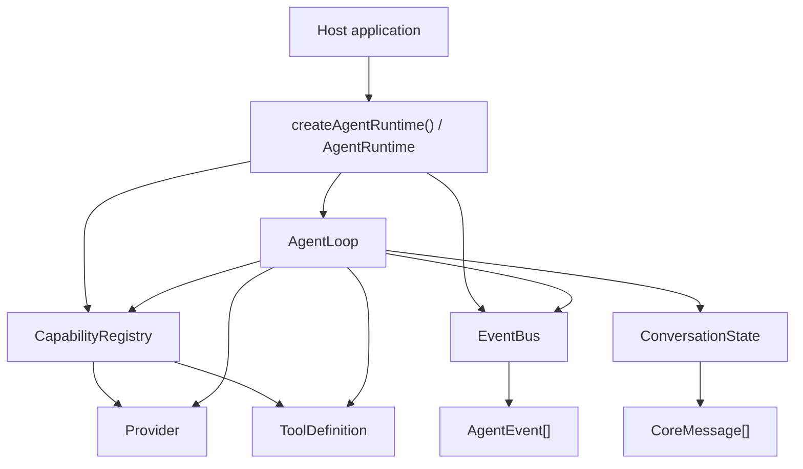
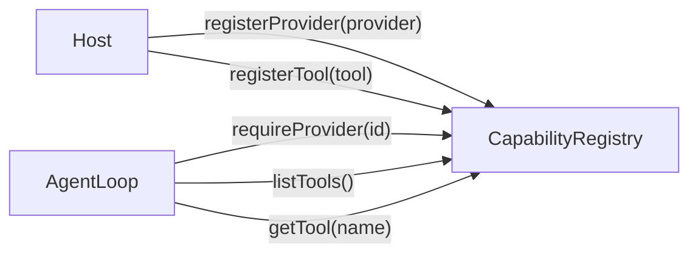
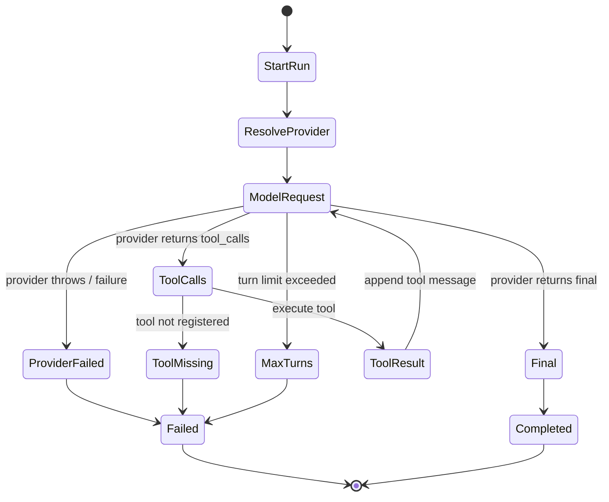
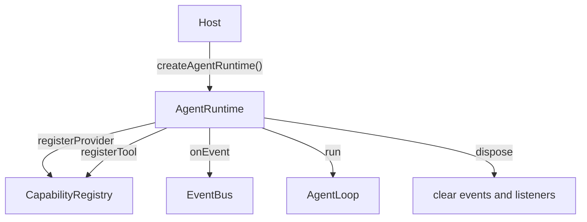
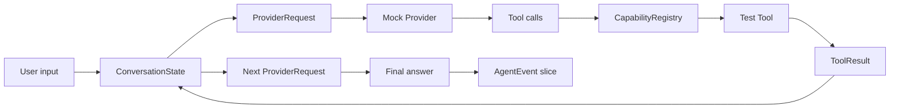

# 从 0 到 1 构建 Agent：M0 Core Kernel 的最小闭环

很多人一开始做 Agent，会很自然地先想到这些东西：接入 OpenAI、做一个 CLI、加文件工具、支持 MCP、加权限、做记忆、做插件、做 UI。它们都重要，但如果第一步就把这些东西混在一起，Agent 很快会变成一个大而散的应用，而不是一个可以长期演化的 runtime。

M0 的目标反过来：先不做真实 provider，不做真实工具，不做插件，不做持久化，也不做 UI。我们只证明一件事：

```text
user -> model -> tool -> model -> final
```

也就是说，一个没有产品外壳的 core runtime，能不能独立完成一次最小 agent loop。

这篇文章只讲 M0 范围内的设计：core contracts、`CapabilityRegistry`、`ConversationState`、`EventBus`、`AgentLoop`、`createAgentRuntime()`，以及为什么要把事件类型收敛成 `AgentEventType` 常量。

## 一、为什么第一步不是接真实模型

如果第一步就接真实模型，表面上进展很快：能问答、能调用工具、甚至能做一点任务。但真实模型会带来太多噪声：provider SDK 类型、网络失败、流式协议、token 统计差异、工具 schema 方言、鉴权、重试策略。

这些东西会掩盖真正需要先回答的问题：

- Agent loop 的生命周期边界是什么？
- 模型请求工具后，tool result 如何回到模型？
- tool 失败时，是让 run 崩溃，还是作为 observation 回流？
- host 如何观察一次 run 里发生了什么？
- core 是否能不依赖 CLI/Web/IDE/server 仍然运行？

所以 M0 用 mock provider 和 test tool。它们不是为了“模拟真实世界的一切”，而是为了把 runtime contract 先打稳。

M0 的设计判断是：**先证明 core loop，再把真实 provider、真实工具和插件生态接进来。**

## 二、M0 的模块边界

M0 的 core package 保持很小，只放不可外包的 agent 内核能力：



每个模块的职责都很克制：

- `contracts/` 定义 message、provider、tool、runtime、event 等公共类型。
- `CapabilityRegistry` 只负责注册和解析 provider/tool。
- `ConversationState` 只负责维护消息序列和 tool call/result 配对。
- `EventBus` 只负责发布和记录已发生的事实。
- `AgentLoop` 是最小状态机，推进 model/tool/model/final。
- `AgentRuntime` 是 host-facing facade，给外部应用一个稳定入口。
- `testing/` 提供 mock provider 和 test tool，让 M0 不依赖外部服务也能验证闭环。

注意这里没有 plugin loader、HookKernel、权限系统、真实文件工具、session store、UI projection。这不是遗漏，而是边界。

## 三、contracts：先把语言说清楚

Agent 最容易混乱的地方，是大家在同一个词上说不同的东西。M0 先定义一组 core contracts：

- `CoreMessage`：系统、用户、助手、工具四类消息。
- `ToolCall`：模型想调用的工具名、调用 id 和输入。
- `ToolResult`：工具成功或失败后的结构化结果。
- `ProviderRequest` / `ProviderResponse`：core 和模型 provider 之间的统一协议。
- `AgentEvent`：run、model、tool、usage、error 等生命周期事实。
- `AgentRunResult`：一次 run 对 host 返回的成功或失败结果。

这里最重要的设计是：**core contracts 不引入任何真实 provider SDK 类型。**

如果 `packages/core` 里出现了某个具体 provider 的类型，后续每接一个 provider，core 都会变重。M0 要的是反过来：provider 插件以后适配 core，而不是 core 适配每个 provider。

## 四、CapabilityRegistry：能力先注册，再被 loop 使用

Agent loop 本身不应该知道“有哪些工具”和“模型从哪里来”。它只应该知道：我需要一个 provider，我需要一组 tools。

所以 M0 引入 `CapabilityRegistry`：



这个 registry 在 M0 里只是内存版，但它已经建立了后续插件系统的雏形：能力不是散落在 loop 里的硬编码，而是由外部注册，再由 core 在运行时解析。

缺失能力要显式失败。比如 provider 不存在时返回 `PROVIDER_NOT_FOUND`，tool 不存在时返回 `TOOL_NOT_FOUND`。这比静默 fallback 更重要，因为 agent runtime 后续要支持审计、恢复和调试，失败必须是可观察的事实。

## 五、ConversationState：tool result 必须配回原来的 tool call

Agent 不是普通聊天。普通聊天只有 user 和 assistant；Agent 还会出现 assistant 请求 tool、tool 返回 observation、assistant 继续回答。

M0 的 `ConversationState` 做两件事：

- 保存当前 run 的 message 序列。
- 把每个 `ToolResult` 转成带 `toolCallId` 的 `ToolMessage`。

成功工具会变成普通 tool observation；失败工具也会变成 tool observation，只是 `isError: true`，内容类似：

```text
TOOL_EXECUTION_FAILED: Kaboom
```

这个设计很关键。tool 失败不是只有 host 才能看到的异常，而是模型也能看到的上下文。这样 provider 可以在下一轮基于失败继续解释、重试或收束，而不是整个 loop 直接断掉。

## 六、EventBus：事件记录已经发生的事实

M0 从第一天就加入事件，不是为了做漂亮日志，而是为了让 host 不必解析 assistant 文本也能理解发生了什么。

一次成功 run 的事件大致是：

```mermaid
sequenceDiagram
  participant Host
  participant Runtime
  participant Loop as AgentLoop
  participant Bus as EventBus
  participant Provider
  participant Tool

  Host->>Runtime: run(input, providerId)
  Runtime->>Loop: run(options)
  Loop->>Bus: run.started
  Loop->>Bus: model.requested
  Loop->>Provider: generate(messages, tools)
  Provider-->>Loop: tool_calls
  Loop->>Bus: model.responded
  Loop->>Bus: tool.called
  Loop->>Tool: execute(input)
  Tool-->>Loop: ToolResult
  Loop->>Bus: tool.result
  Loop->>Bus: model.requested
  Loop->>Provider: generate(messages_with_tool_result, tools)
  Provider-->>Loop: final
  Loop->>Bus: model.responded
  Loop->>Bus: run.finished
  Loop-->>Runtime: AgentRunSuccess
  Runtime-->>Host: finalAnswer + events
```

事件类型目前包括：

- `run.started`
- `run.finished`
- `model.requested`
- `model.responded`
- `tool.called`
- `tool.result`
- `usage.recorded`
- `error`

这些类型被集中定义为 `AgentEventType`：

```ts
export const AgentEventType = {
  RunStarted: "run.started",
  RunFinished: "run.finished",
  ModelRequested: "model.requested",
  ModelResponded: "model.responded",
  ToolCalled: "tool.called",
  ToolResult: "tool.result",
  UsageRecorded: "usage.recorded",
  Error: "error"
} as const;
```

为什么不用散落的字符串？因为 `this.publish({ type: "tool.called", ... })` 这种写法很容易被写错，测试里也容易复制出另一套字符串。把事件名集中成变量后，发布点、类型定义和测试断言都引用同一个事实源。后面如果事件命名变化，只改一处。

## 七、AgentLoop：最小状态机长什么样

`AgentLoop` 是 M0 的核心，但它不是一个大脑。它只是一个状态机：



它每一轮做的事很固定：

1. 从 `ConversationState` 取一份 messages snapshot。
2. 从 `CapabilityRegistry` 取当前 tools。
3. 发布 `model.requested`。
4. 调用 provider。
5. 发布 `model.responded` 和可选的 `usage.recorded`。
6. 如果 provider 返回 final，完成 run。
7. 如果 provider 返回 tool calls，逐个找 tool、执行 tool、记录 tool result。
8. 把 tool result 追加到 conversation，再进入下一轮。
9. 超过 max turns 则以结构化失败结束。

这个 loop 特意没有做 retry、streaming、权限、hook、context compaction。因为这些都是后续阶段的问题。M0 只需要证明 loop contract 能稳定承载最小行为。

## 八、Runtime facade：host 只需要一个入口

如果让 host 直接 new registry、new event bus、new loop，第一版就会把内部结构暴露出去。所以 M0 提供 `createAgentRuntime()`：



它给 host 的 API 很少：

- `registerProvider(provider)`
- `registerTool(tool)`
- `onEvent(listener)`
- `run(options)`
- `dispose()`

这就是 M0 的 host-facing surface。后续 CLI、Web、IDE、server 都可以站在同一个 runtime 上，而不是各自复制一套 loop。

## 九、测试：用 mock 证明 contract，而不是证明外部世界

M0 的测试不依赖真实模型和真实工具。测试覆盖的是 core 行为：

- 成功 tool-calling run。
- tool 返回失败时，失败作为 observation 回流给 provider。
- tool 抛异常时，异常归一化为结构化 `ToolFailure`。
- provider 缺失时返回显式 run failure。
- tool 缺失时返回显式 run failure。
- provider 抛异常时归一化为 `PROVIDER_FAILED`。
- provider 不给 final 时触发 max turns。
- 长生命周期 `EventBus` 下，每次 run 只返回当前 run 的事件切片。

这类测试的价值不是“看起来像真实使用”，而是把 core contract 钉住。以后接真实 provider 或插件，如果行为变了，测试会告诉我们是适配层的问题，还是 core contract 被破坏了。

## 十、M0 刻意不做什么

M0 最容易失控的地方，是把“马上会需要”的东西提前放进来。所以边界必须写清楚：

- 不做真实 provider integration。
- 不做 filesystem、shell、browser、git、MCP 等真实工具。
- 不做 plugin manifest、plugin loader、HookKernel。
- 不做权限、命名空间、reload、stale context guard。
- 不做持久化 session store、replay、fork、artifact store。
- 不做 CLI、Web、IDE、server API 或 UI projection。
- 不做 context compaction、skills、memory、multi-agent、eval。

这些不是不重要，而是不属于 M0。M0 的任务只有一个：让 core agent 能跑起来，并且边界足够干净。

## 结语：M0 的一句话

M0 不是一个完整 Agent 产品，而是一块最小可执行内核。

它用 contracts 统一语言，用 registry 注入能力，用 state 保持消息配对，用 event bus 留下事实，用 loop 推进生命周期，再用 runtime facade 给 host 一个稳定入口。

把它连起来，就是这条最小链路：



有了这块小内核，后续 M1/M2/M3 才能放心加入 plugin host、typed hooks、真实 provider、真实工具、权限和审计。否则越早追求“看起来完整”，越容易在后面付出重写 core 的代价。
