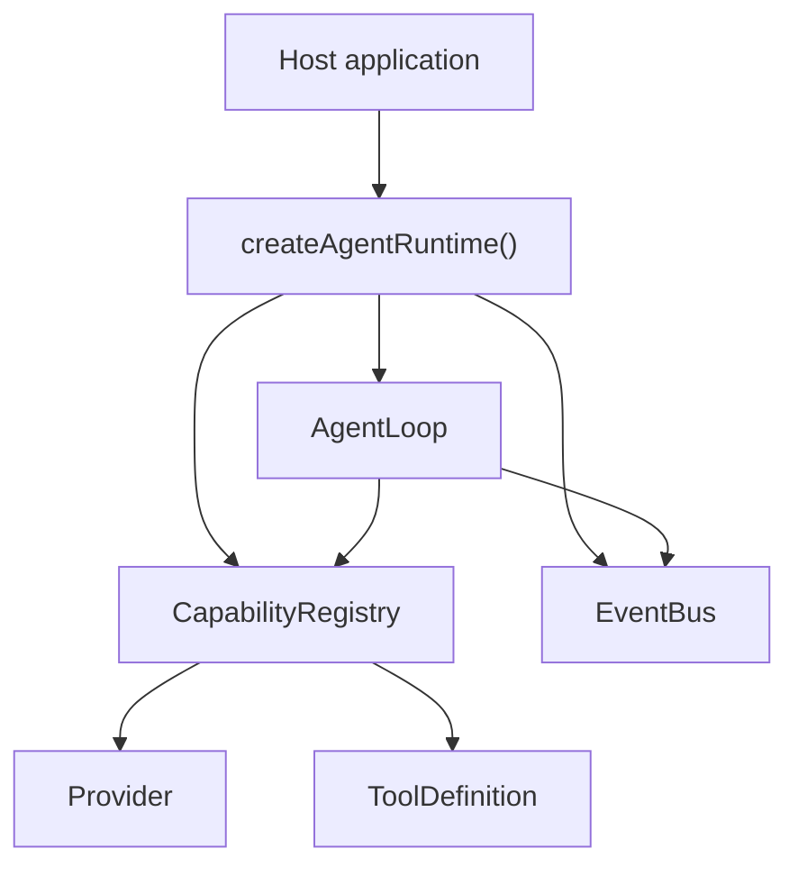
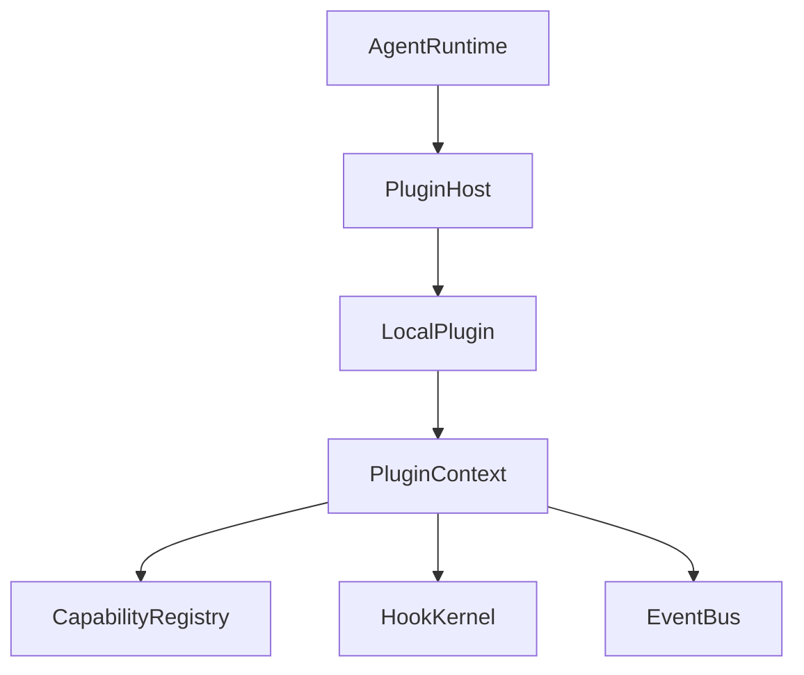
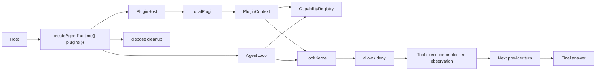

# 从 0 到 1 构建 Agent：M1 Plugin Host 与 Hook Kernel

M0 已经证明了一件很小但很关键的事：一个没有 CLI、没有 UI、没有真实模型 SDK、没有真实工具的 core runtime，可以独立跑完这条链路：

```text
user -> model -> tool -> model -> final
```

但 M0 还有一个明显问题：provider 和 tool 都是宿主手动注册进去的。

这在 M0 没关系，因为我们只想证明 core loop 能不能跑起来。但如果继续这样发展，后面的系统会慢慢变成这样：

```text
我要接一个 provider -> 改 core
我要加一个 tool -> 改 core
我要在工具执行前做一次拦截 -> 改 core
我要做一个示例能力包 -> 还是改 core
```

这和 “小内核 + 插件生态” 的目标是冲突的。

M1 要证明的是另一件事：

**core 不需要为每一种能力写死入口。宿主可以挂载一个本地插件，插件可以注册 provider、tool 和 hook，runtime 可以消费这些能力完成最小 run，并在结束时清理插件状态。**

这篇文章只讲 M1 范围内的设计：`LocalPlugin`、`PluginContext`、`PluginHost`、`HookKernel`、`createAgentRuntime({ plugins })`、pre-tool gate，以及为什么 hook 不能只做成 `EventBus` listener。

## 一、M1 为什么不是直接做真实 provider 插件

很多人看到 M0 之后，会很自然地想：下一步是不是该接 OpenAI、Anthropic、Gemini，或者 OpenAI-compatible provider？

这当然是后面要做的事。但如果 M1 直接接真实 provider，会把太多问题混在一起：

- provider SDK 类型要不要进入 core？
- streaming 怎么标准化？
- usage、cost、error taxonomy 怎么统一？
- credential 怎么路由？
- provider fallback 怎么做？
- 插件怎么加载、怎么卸载、怎么隔离？
- hook 在什么位置影响行为？

这些都是重要问题，但它们不是同一个问题。

M1 先把问题切窄：**不做真实 provider transport，只证明 core 能被本地插件扩展。**

也就是说，M1 不是为了让系统“看起来更像一个完整产品”，而是为了回答一个更基础的问题：

```text
能力能不能从 core 外面进来？
```

如果这个问题不先解决，后面每接一个 provider、每加一个 tool、每补一个控制点，都会有退化成 first-party 特例的风险。

## 二、从 M0 到 M1：问题到底变了什么

M0 的模块边界大概是这样：



M0 的 host 可以这样使用 runtime：

```ts
const runtime = createAgentRuntime();

runtime.registerProvider(mockProvider);
runtime.registerTool(testTool);

await runtime.run({
  input: "Use the tool",
  providerId: "mock"
});
```

这已经不错了：能力不是写死在 `AgentLoop` 里，而是进入了 `CapabilityRegistry`。

但它仍然要求宿主知道插件里面有哪些 provider、有哪些 tool，然后逐个注册。换句话说，宿主仍然在做插件作者该做的事。

M1 想要的是：

```ts
const runtime = createAgentRuntime({
  plugins: [examplePlugin]
});
```

然后插件自己在初始化阶段完成注册：

```text
plugin.init(context)
  -> context.registerProvider(...)
  -> context.registerTool(...)
  -> context.registerHook(...)
```

这样 host 只表达一件事：“我要加载这个插件。”

至于这个插件贡献了什么能力，应该由插件自己声明。

## 三、LocalPlugin：先定义最小插件形态

M1 没有做 manifest、目录扫描、动态 import、远程安装、签名、sandbox、marketplace。

插件形态被刻意收窄成一个可信本地对象：

```ts
export type LocalPlugin = {
  id: string;
  name?: string;
  init(context: PluginContext): Promise<void> | void;
  shutdown?(context: PluginShutdownContext): Promise<void> | void;
};
```

这看起来很简单，但这里有两个关键判断。

第一，M1 的插件是 **本地可信插件**。它不是 marketplace 里随便下载的第三方代码，所以这一阶段不解决安全隔离和信任策略。

第二，插件只有 `init` 和可选的 `shutdown`。它不直接拿 runtime，不直接拿 `AgentLoop`，不直接拿 `ConversationState`，也不直接改 registry 内部状态。

插件拿到的是受限的 `PluginContext`：

```ts
export type PluginContext = {
  pluginId: string;
  registerProvider(provider: Provider): void;
  registerTool(tool: ToolDefinition): void;
  registerHook(hook: HookRegistration): void;
};
```

这就是 M1 的作者契约：你可以贡献能力，但不能随意改 core state。

为什么要这么克制？

因为插件系统最容易失控的地方，就是一开始把自由度给得太大。插件如果能直接拿到 `ConversationState`，就可以绕过 message 配对规则；如果能直接拿到 `AgentLoop`，就可以偷偷改变执行顺序；如果能直接改 registry map，失败清理和事件审计都会变得很难。

M1 的原则是：

**插件通过 context 注册能力，core 仍然掌握能力如何被消费。**

## 四、PluginHost：插件初始化不是散落在 runtime 里的几行代码

有了 `LocalPlugin` 之后，下一步不是把 `for (const plugin of plugins)` 随手写进 `AgentRuntime`。

M1 引入了 `PluginHost`，专门负责插件生命周期：



`PluginHost` 做几件事：

- 按插件数组顺序初始化插件。
- 给每个插件创建受限 `PluginContext`。
- 把插件注册的 provider/tool 委托给现有 `CapabilityRegistry`。
- 把插件注册的 hook 委托给 `HookKernel`。
- 发布插件初始化、能力注册、失败、shutdown 等事件。
- 初始化失败时清理已经注册的插件能力。
- runtime dispose 时执行 shutdown，并返回 shutdown failure。

这里最重要的设计是：**provider/tool 注册复用 M0 的 registry，不另建一套 plugin registry。**

也就是说，插件提供的 provider 和 host 手动注册的 provider，最终进入同一个能力池：

```text
Host registerProvider(...)
Plugin context.registerProvider(...)
        |
        v
CapabilityRegistry
        |
        v
AgentLoop requireProvider / listTools / getTool
```

这样 M1 证明的是：插件能力真的进入了 core runtime 的正常能力集合，而不是绕了一条“插件专用小路”。

## 五、HookKernel：为什么 hook 不能只是事件监听

M0 已经有了 `EventBus`。那为什么 M1 还要加 `HookKernel`？

因为 event 和 hook 解决的不是同一个问题。

`EventBus` 适合记录已经发生的事实：

```text
run.started
model.requested
tool.called
tool.result
error
```

这些事件可以给 UI、日志、trace、测试和 debugger 用。它们的特点是：事情已经发生了，订阅者只是观察。

但 hook 要解决的是另一类问题：

```text
这个 tool call 到底要不要执行？
shutdown 时要不要跑插件 cleanup？
hook 失败时 run 应该怎样暴露？
多个 hook 谁先执行？
第一个 hook deny 后，后面的 hook 还要不要跑？
```

这些问题会改变 runtime 后续行为，所以不能靠普通事件广播。

M1 的 `HookKernel` 只支持三个 phase：

```ts
export const HookPhase = {
  RuntimeStart: "runtime.start",
  PreToolGate: "pre_tool.gate",
  RuntimeShutdown: "runtime.shutdown"
} as const;
```

也只支持两个 effect：

```ts
export const HookEffect = {
  Observe: "observe",
  Gate: "gate"
} as const;
```

这依然很小，但已经把最关键的边界立住了：

- lifecycle hook 是 observe：用于 start/shutdown 这类生命周期节点。
- pre-tool hook 是 gate：可以 allow，也可以 deny。
- hook 执行顺序由 plugin load order + hook register order 决定。
- gate 使用 first-deny-wins：第一个 deny 直接短路，后面的 gate 不再执行。
- hook decision 和 hook failure 都会进入事件通道，供测试和 debug 观察。

这就是 M1 对 hook 的核心判断：

**EventBus 记录事实，HookKernel 参与决策。**

## 六、pre-tool gate：把阻断点放到真正的工具执行路径上

M1 最关键的行为验证，是 pre-tool gate。

它的位置必须很精确：

```text
provider returns tool_calls
  -> state.addAssistantToolCalls(...)
  -> publish tool.called
  -> run pre-tool gate
  -> if allow: resolve tool and execute
  -> if deny: skip execution and append blocked tool observation
```

这不是一个旁路监听器，而是在 `AgentLoop` 的真实控制路径上。

为什么要放在 `tool.called` 之后、`tool.execute` 之前？

因为 `tool.called` 是一个事实：模型确实提出了这个 tool call。这个事实应该被观察到。

但工具还没执行，所以 gate 还有机会阻断副作用。

M1 的 deny 行为不是直接让 run 崩掉，而是生成一个模型可见的 tool observation：

```text
TOOL_CALL_BLOCKED: blocked by example plugin
```

这个 observation 会像普通 tool result 一样追加回 conversation state，保证 assistant tool call 和 tool result 仍然配对。下一轮 provider 可以看到“这个工具被拦截了”，然后给出最终回答或调整策略。

这点很重要。如果 gate deny 只是在 host 侧返回一个错误，模型就不知道发生了什么；如果 deny 后不写 tool result，conversation 里就会留下一个没有结果的 tool call。

M1 的处理方式是：

```mermaid
sequenceDiagram
  participant Provider
  participant Loop as AgentLoop
  participant Kernel as HookKernel
  participant Tool
  participant State as ConversationState
  participant Bus as EventBus

  Provider-->>Loop: tool_calls
  Loop->>State: add assistant tool calls
  Loop->>Bus: tool.called
  Loop->>Kernel: pre-tool gate
  Kernel-->>Loop: deny
  Loop--xTool: skip execute
  Loop->>State: add blocked tool result
  Loop->>Bus: hook.decision + tool.result
  Loop->>Provider: next request with blocked observation
```

也就是说，deny 阻断的是工具副作用，不阻断 agent loop 继续收束。

## 七、runtime 为什么要懒初始化插件

M1 没有在 `createAgentRuntime({ plugins })` 的构造阶段立刻初始化插件，而是在第一次 `run()` 前懒初始化。

这不是偷懒，而是为了 host 可观察性。

如果构造时就初始化插件，host 可能还没来得及订阅事件：

```ts
const runtime = createAgentRuntime({ plugins: [plugin] });
runtime.onEvent(...); // 太晚了，plugin init events 可能已经发完
```

M1 的顺序是：

```ts
const runtime = createAgentRuntime({ plugins: [plugin] });
runtime.onEvent(listener);
await runtime.run(...); // 这里才触发 plugin init
```

这样 host 可以观察到：

- `plugin.capability_registered`
- `plugin.initialized`
- `hook.decision`
- `hook.failure`
- `plugin.failure`
- `plugin.shutdown`

这也让插件 init failure 能通过 `AgentRunFailure` 暴露，而不是构造函数直接 throw。

宿主看到的是统一的 run failure：

```ts
{
  ok: false,
  runId,
  error: {
    code: "PLUGIN_INIT_FAILED",
    message: "..."
  },
  events
}
```

这延续了 M0 的原则：runtime failure 要结构化、可观察，而不是散落成 raw exception。

## 八、dispose 从同步清空变成 async lifecycle

M0 的 `dispose()` 很简单：清空事件和 listeners。

M1 之后，runtime 里有插件生命周期状态，有 shutdown hook，也可能有插件自己的 cleanup。同步 `dispose(): void` 不够用了。

所以 M1 把它扩展成：

```ts
dispose(): Promise<AgentRuntimeShutdownResult>
```

返回值包含：

```ts
{
  ok: boolean;
  runId: string;
  failures: Array<{
    code: string;
    message: string;
    details?: unknown;
  }>;
  events: AgentEvent[];
}
```

这样 shutdown 失败不会被 `eventBus.dispose()` 直接清掉。runtime 会先跑 shutdown hook 和 plugin shutdown，收集 failure 和 events，再清理 event listeners、hook registrations、插件贡献的 provider/tool。

dispose 之后，旧 runtime 进入终态：

```text
dispose()
  -> shutdown plugin state
  -> cleanup registry/hook/event listener
  -> disposed = true
  -> later run() returns RUNTIME_DISPOSED
```

这个边界对插件系统很重要。否则，一个已经关闭的 runtime 还可以继续使用旧插件能力，会让 session 生命周期变得很模糊。

## 九、示例插件：一个插件同时贡献 provider、tool、hook

M1 没有做很多示例插件，而是做了一个综合示例插件：`createExamplePlugin()`。

它在同一个插件里做四件事：

- 注册一个 mock provider。
- 注册一个 test tool。
- 注册一个 pre-tool gate hook。
- 提供 shutdown 行为。

这个示例的意义不是“给生产用”，而是让插件作者一眼看懂最小 authoring path：

```text
createExamplePlugin()
  -> plugin.init(context)
  -> registerProvider(example-provider)
  -> registerTool(example-tool)
  -> registerHook(example-pre-tool-gate)
  -> runtime.run(...)
  -> provider asks for tool
  -> hook allow/deny
  -> tool result or blocked observation
  -> provider final
  -> runtime.dispose()
  -> plugin shutdown
```

它还可以配置 gate allow/deny、init failure、hook failure、shutdown failure，用来测试 M1 的失败路径。

最重要的是：plain runtime 不会自动加载这个插件。

```ts
const runtime = createAgentRuntime();
```

这样的 runtime 仍然保持 M0 行为；只有 host 显式传入：

```ts
const runtime = createAgentRuntime({
  plugins: [example.plugin]
});
```

插件能力才会进入 runtime。

这保证了示例插件是作者入口，而不是 core 默认能力。

## 十、M1 之后 core 多了哪些事件和错误

为了让插件生命周期和 hook 决策可测试，M1 扩展了事件类型：

```text
plugin.initialized
plugin.shutdown
plugin.capability_registered
hook.decision
hook.failure
plugin.failure
```

同时也扩展了错误码：

```text
PLUGIN_INIT_FAILED
PLUGIN_SHUTDOWN_FAILED
HOOK_FAILED
RUNTIME_DISPOSED
```

这些名字看起来像小细节，但它们决定了后续系统能不能被 debug。

如果插件 init 失败只是一个普通 throw，host 很难知道是哪个插件失败、失败发生在什么阶段、有没有半初始化残留。

如果 hook 失败被伪装成 tool failure，系统就会把“控制平面坏了”和“工具执行坏了”混在一起。

如果 shutdown failure 被 dispose 清空，测试和 host 都无法知道插件是否真的清理干净。

所以 M1 的错误策略是：

- plugin init failure：结构化 run failure，并清理已注册插件能力。
- pre-tool hook failure：结构化 `HOOK_FAILED` run failure，不伪装成 tool result。
- pre-tool hook deny：不是 failure，而是一个模型可见的 blocked observation。
- plugin shutdown failure：通过 async dispose result 和事件暴露。
- disposed runtime：后续 run 返回 `RUNTIME_DISPOSED`。

## 十一、测试真正证明了什么

M1 的测试不是只看 happy path。

它覆盖了几类关键风险：

- 插件可以通过 context 注册 provider、tool、hook。
- hook 按插件加载顺序和注册顺序执行。
- pre-tool gate 默认 allow。
- first deny wins，后续 gate 不执行。
- gate deny 后真实 tool 不执行。
- gate deny 后 provider 仍能看到 tool observation。
- gate throw 后返回结构化 `HOOK_FAILED`。
- 插件 init 失败会发布 failure event，并清理半初始化能力。
- duplicate provider/tool 沿用 `CAPABILITY_ALREADY_REGISTERED`。
- shutdown hook 和 plugin shutdown 失败不会吞掉后续 cleanup。
- `createAgentRuntime({ plugins })` 不需要宿主手动逐个注册插件能力。
- 无插件 runtime 仍保持 M0 行为。
- dispose 后 runtime 不能继续 run。

这些测试合起来证明的不是“插件系统已经完整”，而是 M1 的最小闭环成立：

```text
host mounts plugin
  -> plugin registers capabilities
  -> runtime consumes capabilities
  -> hook gates tool execution
  -> events expose decisions/failures
  -> dispose cleans plugin lifecycle state
```

## 十二、M1 刻意不做什么

M1 很容易被拉大，因为一说插件，大家会马上想到完整生态。

所以边界必须继续写清楚：

- 不做真实 OpenAI、Anthropic、Gemini 或 OpenAI-compatible provider 插件。
- 不做 provider fallback、stream normalization、usage/cost normalization。
- 不做 credential routing 和 provider-specific error taxonomy。
- 不做 plugin reload / hot reload。
- 不把 namespace、同名冲突治理、能力覆盖策略作为硬验收。
- 不做 command 注册。
- 不做 resource discovery、model input patching、tool result post-processing。
- 不做 context compaction hook 或 projection hook。
- 不做 marketplace、remote install、sandbox、signing、trust policy。
- 不做 MCP、skills、session store、replay 或 host adapter。

这些都不是“不重要”，而是 M1 要先把插件边界两侧的最小协议打稳。

## 结语：M1 的一句话

M0 证明的是：core loop 可以独立跑起来。

M1 证明的是：core loop 可以被外部本地插件扩展，而不退化成一堆写死在 core 里的 first-party 特例。

把 M1 连起来，就是这条链路：



如果只记一句话，可以这样记：

**M1 没有急着做完整插件生态，而是先证明了本地插件能把 provider、tool、hook 三类能力带进 core，并且 core 能用确定的生命周期、事件和失败语义把它们消费掉。**

有了这一步，后面的 M2 provider plugins、M3 tool plugins + permission runtime、M6 skills/MCP/capability discovery，才有一个干净的内核边界可以继续往上长。
