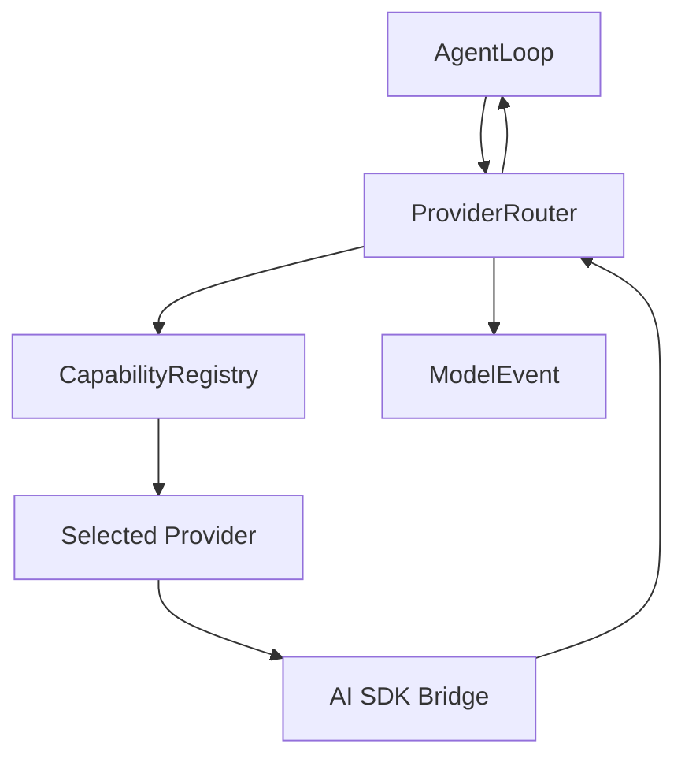
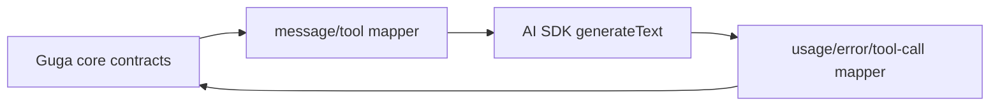

# 从 0 到 1 构建 Agent：M2 Provider Runtime 与 AI SDK Bridge

M1 已经把 core 从“宿主手动注册能力”推进到了“插件可以贡献能力”：

```text
plugin.init(context)
  -> registerProvider(...)
  -> registerTool(...)
  -> registerHook(...)
```

这解决了一个很关键的问题：provider、tool、hook 可以从 core 外面进来。

但 M1 的 provider 仍然是一个很轻的 mock contract：

```ts
provider.generate(request) -> final | tool_calls | failure
```

它足够证明 agent loop 能跑，但还不足以接真实模型。

真实模型一进来，问题就不再是“怎么调一个 SDK”。问题会立刻变成：

```text
OpenAI、Anthropic、OpenAI-compatible、Gateway 的消息格式不同怎么办？
streaming chunk 不同怎么办？
tool call 是谁执行？
usage 和 cost 怎么表示？
rate limit、auth、context overflow 怎么归一化？
fallback 是 SDK 决定，还是 Guga runtime 决定？
AI SDK 的类型能不能进入 core public API？
```

M2 要证明的是：

**Guga 可以接入真实模型 backend，但 core 仍然拥有自己的 provider runtime 语义。AI SDK 可以成为默认 bridge，却不能成为 core contract。**

这篇文章讲 M2 的设计和实现：`ModelMetadata`、`Usage`、`ProviderError`、`ModelEvent`、`ProviderRouter`、`packages/provider-ai-sdk`，以及为什么这次选型不是“直接用 AI SDK”，而是“让 AI SDK 站在 Guga contract 的外侧”。

## 一、M2 为什么不是直接写一个 callOpenAI

从 M1 往后看，最自然的下一步好像是：

```ts
const result = await openai.chat.completions.create(...);
```

或者：

```ts
const result = await generateText({ model, messages, tools });
```

这样当然最快。只要能返回文本，demo 就能看起来更真实。

但这里有一个陷阱：**一次模型调用不是 agent 的 provider 层。**

一次 HTTP 调用只回答：

```text
我能不能拿到模型输出？
```

provider runtime 要回答的是：

```text
模型输出怎样进入 agent loop？
模型错误怎样影响 retry/fallback？
模型产生的 tool call 怎样回到 Guga tool pipeline？
usage 怎样被审计？
provider SDK 变化怎样不污染 core？
```

如果 M2 直接把 `generateText()` 写进 `AgentLoop`，短期会少写一些 adapter 代码，长期会把 provider 细节扩散到最核心的控制路径里：

```text
AgentLoop
  -> AI SDK message type
  -> AI SDK tool type
  -> AI SDK finishReason
  -> AI SDK usage shape
  -> AI SDK error object
  -> AI SDK retry behavior
```

这样做的问题不是“依赖了一个库”，而是 core 的语义开始跟着外部库走。

Guga 的目标是小内核、强插件、可审计、可恢复。这个目标要求 provider SDK 只能存在于边界外：

```text
provider SDK 世界
  -> bridge / adapter
  -> Guga-owned contracts
  -> AgentLoop / Router / Tool pipeline
```

所以 M2 的第一条判断是：

**先固定 Guga 自己的 provider runtime contract，再让真实 SDK 适配进来。**

## 二、为什么选 AI SDK 做第一条真实 provider bridge

既然不能直接把 SDK 塞进 core，那第一条真实 provider bridge 应该怎么选？

M2 讨论过几条路。

第一条路是分别做：

```text
plugin-provider-openai
plugin-provider-anthropic
plugin-provider-openai-compatible
```

这看起来更“原生”，但会马上引入三份 transport 维护成本。OpenAI 和 Anthropic 的 message、tool、reasoning、usage、finish reason、error 细节都不一样；OpenAI-compatible 又会因为本地模型、代理、网关实现不同而出现边界差异。

如果 M2 直接拆成多个原生 provider 插件，工作重点会从“建立 Guga provider runtime 边界”滑向“维护多个厂商 transport”。这不是 M2 最需要证明的事。

第二条路是做一个很薄的 `LLMClient`：

```ts
interface LLMClient {
  complete(messages): Promise<string>;
}
```

这条路能更快返回文本，但会低估真实 agent provider 层需要表达的内容。M2 不只需要文本，还需要 model metadata、tool intent、usage、provider error、fallback 事件和未来 model hook contract。一个只返回 string 的 client 会让这些语义以后再“补洞”。

第三条路是直接把 AI SDK 当 core contract：

```text
core exports AI SDK LanguageModel / ModelMessage / Tool types
```

这会减少 bridge mapping，但代价太高。core public API 一旦暴露 AI SDK 类型，Guga 的 runtime 语义就被外部版本绑定。AI SDK 很适合做 provider 覆盖和模型调用，但不应该定义 Guga 的审计、重放、hook、router 和 tool permission 边界。

所以 M2 选择了第四条路：

```text
packages/core
  owns Guga provider/model/event/router contracts

packages/provider-ai-sdk
  owns AI SDK dependency and maps it into Guga contracts
```

这条路的推理是：

- AI SDK 已经解决了大量 provider 接入摩擦，适合作为第一条真实 bridge。
- Guga core 仍然只暴露自己的 contract，适合长期演进。
- AI SDK 版本变化只影响 bridge package，不变成 core breaking change。
- OpenAI-compatible 可以做确定性 smoke path，Gateway 可以做 production-facing path，OpenAI/Anthropic 可以做 focused compatibility path。

换句话说：

**M2 采用 AI SDK 的覆盖能力，但不采用 AI SDK 作为 Guga 的架构边界。**

## 三、先分清 Provider、Gateway 和 Guga Router

讨论多模型接入时，最容易混在一起的三个词是：

```text
provider
gateway
router
```

它们听起来都像“模型入口”，但解决的问题不一样。

先看 AI SDK 最直观的 provider 写法：

```ts
import { generateText } from "ai";
import { google } from "@ai-sdk/google";

const { text } = await generateText({
  model: google("gemini-3-pro-preview"),
  prompt: "What is love?"
});
```

这里的 `google` 就是一个 provider。它代表的是“我直接使用 Google 这个模型厂商的接入包”。如果换成 OpenAI，写法会变成：

```ts
import { openai } from "@ai-sdk/openai";

model: openai("gpt-5")
```

如果换成 Anthropic，又会变成：

```ts
import { anthropic } from "@ai-sdk/anthropic";

model: anthropic("claude-sonnet-4-5")
```

这种写法的好处是清楚、直接、控制力强。你一眼就知道请求会发给哪个厂商。

但它也带来一个现实问题：每多接一个厂商，就多一组 package、认证方式、模型命名、provider option 和兼容细节。对普通应用来说这可以接受；对 Guga 这种要先把 agent runtime 地基打稳的项目来说，M2 阶段不应该把精力过早花在多个厂商接入包的细枝末节上。

Gateway 模式解决的是另一个问题：

```ts
import { generateText, gateway } from "ai";

const { text } = await generateText({
  model: gateway("google/gemini-3-pro-preview"),
  prompt: "What is love?"
});
```

这里的 `gateway` 本身也可以看成一种 provider，但它不是某一个模型厂商，而是一个统一入口。模型 ID 里带上厂商前缀：

```text
google/gemini-3-pro-preview
openai/gpt-5
anthropic/claude-sonnet-4-5
```

请求先进入 Gateway，再由 Gateway 转到背后的模型厂商。

所以 provider 和 gateway 的关系可以这样记：

```text
provider = 直接连某个模型厂商
gateway = 先连统一入口，再由统一入口路由到模型厂商
```

那 Guga 的 `ProviderRouter` 又是什么？

它不是 AI SDK Gateway 的替代品。它解决的是 Guga runtime 自己的问题：

```text
这次 agent 主循环该用哪个模型？
摘要任务该用哪个便宜模型？
provider 返回 rate limit 后要不要 retry？
payment/auth 失败后要不要 fallback？
context overflow 是换模型，还是先 compact？
```

也就是说，三层关系是：

```text
Guga ProviderRouter
  -> 选择一个 Guga provider/model candidate
    -> packages/provider-ai-sdk
      -> AI SDK gateway("google/gemini-3-pro-preview")
        -> 真实模型厂商
```

Gateway 负责把“多厂商接入”简化成一个模型入口。

Guga Router 负责把“agent runtime 的模型选择、retry、fallback、事件审计”留在 core 里。

这就是为什么 M2 继续保留 Gateway 模式作为默认主路径。

Guga 可以以后支持这种直连 provider 写法：

```ts
import { google } from "@ai-sdk/google";

createAiSdkProviderPlugin({
  id: "google",
  modelId: "gemini-3-pro-preview",
  model: google("gemini-3-pro-preview")
});
```

但 M2 更适合先坚持 Gateway 写法：

```ts
createAiSdkProviderPlugin({
  id: "ai-gateway",
  mode: "gateway",
  modelId: "google/gemini-3-pro-preview"
});
```

原因很简单：M2 要证明的不是“Guga 能不能 import 每个厂商的 SDK”，而是“真实模型世界能不能通过一个 bridge 进入 Guga runtime，同时不破坏 core contract”。

Gateway 把第一阶段的厂商复杂度压低；Guga Router 把 runtime 控制权留住。两者不是竞争关系，而是上下两层。

## 四、Core 先拥有 provider runtime contract

M2 首先扩展的是 `packages/core/src/contracts/provider.ts`。

M1 的 provider 只需要能返回 final、tool calls 或 failure。M2 之后，provider contract 开始描述真实模型调用的最小语义：

```ts
export type ModelMetadata = {
  providerId: string;
  modelId: string;
  displayName?: string;
  purposes?: ModelPurpose[];
  contextWindow?: number;
  maxOutputTokens?: number;
  capabilities?: ModelCapability;
  metadata?: Record<string, unknown>;
};
```

这里的重点不是字段很多，而是 core 开始知道“模型”不等于“provider 字符串”。

一个 provider 下面可能有多个 model。不同 model 可能适合不同用途：

```text
primary     -> 主推理模型
summarizer  -> 辅助摘要模型
cheap       -> 低成本辅助模型
reasoning   -> 长思考模型
```

这里的 `purposes` 很容易被误解成 provider 分类。它不是。

`providerId` 回答的是：

```text
这个模型从哪个 provider 入口调用？
```

`modelId` 回答的是：

```text
这个 provider 入口下面具体调用哪个模型？
```

`purposes` 回答的是：

```text
这个模型在 Guga runtime 里适合做什么工作？
```

比如同样走 Gateway：

```ts
{
  providerId: "ai-gateway",
  modelId: "google/gemini-3-pro-preview",
  purposes: ["primary"]
}
```

表示这个模型适合做主模型，参与 agent 主循环、规划和工具调用。

另一个模型也可以走同一个 Gateway：

```ts
{
  providerId: "ai-gateway",
  modelId: "google/gemini-3-flash",
  purposes: ["auxiliary", "summarizer"]
}
```

表示它更适合做辅助任务，比如摘要、压缩、便宜快速的分类判断。

这就是 `purposes` 的价值：它让模型选择从“字符串硬编码”变成“按任务意图选择”。

```text
主循环请求       -> purpose: primary
上下文压缩请求   -> purpose: summarizer
便宜辅助判断请求 -> purpose: auxiliary
```

如果没有 `purposes`，Guga 只能在调用处写死：

```text
摘要任务就用 google/gemini-3-flash
主循环就用 google/gemini-3-pro-preview
```

这会让模型分工散落在各个模块里。

有了 `purposes`，调用方只表达意图，`ProviderRouter` 再根据 policy 找 candidate：

```text
purpose: summarizer
  -> candidates:
     - ai-gateway/google/gemini-3-flash
     - ai-gateway/openai/gpt-5-mini
```

这不是一个很复杂的功能，但它让 Guga 从 M2 开始就有了“主模型”和“辅助模型”分工的语言。

M2 没有做完整模型运营平台，也没有接 `models.dev`，但先把最小 model metadata 放进 core，是为了让 router 和 debug path 有稳定依据。

usage 也被重新定义：

```ts
export type Usage = {
  inputTokens?: number;
  outputTokens?: number;
  totalTokens?: number;
  cachedInputTokens?: number;
  reasoningTokens?: number;
  cost?: UsageCost;
};
```

这里一个很重要的取舍是：M2 记录 token usage，但不伪造 cost。

AI SDK 或 Gateway 可能提供 provider metadata，未来也可能查 pricing。但 M2 没有建立 vendor-neutral billing contract，所以成本只能明确表达为：

```ts
cost: {
  status: "unknown",
  reason: "AI SDK result did not include Guga pricing metadata"
}
```

这比随便写一个估算价格更诚实。

因为 usage 是审计事实，不能为了界面好看而制造假的精确性。

## 五、ProviderError：错误不是日志，而是 router 的输入

真实 provider 接入后，错误分类会直接影响下一步动作。

`401` 可能是 auth。
`402` 可能是 payment。
`429` 可能是 rate limit。
上下文超限可能应该触发 compaction。
临时网络错误可能可以 retry。
fatal error 则不应该重复消耗请求。

所以 M2 增加了 normalized provider error taxonomy：

```ts
export const ProviderErrorCategory = {
  Auth: "auth",
  RateLimit: "rate-limit",
  ContextOverflow: "context-overflow",
  Payment: "payment",
  Retryable: "retryable",
  Fatal: "fatal"
} as const;
```

这一步的意义是：provider error 不再只是一个 `Error.message`。

它变成 router 可以判断的结构化输入：

```text
rate-limit + retryable -> 可以 retry
rate-limit + non-retryable -> 可以 fallback
payment -> 后续可以切换付费可用 provider
context-overflow -> 后续可以触发 compaction
fatal -> 不要无意义重试
```

M2 还没有实现 credential pool、payment fallback、context compaction，但先建立错误分类，是为了避免以后从 raw SDK exception 里到处猜。

这也是 provider runtime 和普通 API wrapper 的区别：

**API wrapper 把错误抛出去；provider runtime 把错误变成控制流事实。**

## 六、ModelEvent：streaming 和 non-streaming 先使用同一种语言

真实模型调用还有一个常见分叉：streaming 和 non-streaming。

如果 M2 一开始就让 agent loop 分别处理：

```text
generateText result
streamText chunks
OpenAI stream parts
Anthropic stream parts
Gateway metadata
```

agent loop 很快会变成 provider stream 解释器。

所以 M2 引入了 `ModelEvent`：

```ts
export const ModelEventType = {
  Requested: "model.requested",
  Selected: "model.selected",
  RetryScheduled: "model.retry_scheduled",
  FallbackSelected: "model.fallback_selected",
  TextDelta: "model.text_delta",
  ReasoningDelta: "model.reasoning_delta",
  ToolIntent: "model.tool_intent",
  Usage: "model.usage",
  Metadata: "model.metadata",
  Finished: "model.finished",
  ProviderError: "model.provider_error"
} as const;
```

这里有一个细节：M2 的 AI SDK bridge 先用 `generateText`，不是完整 streaming bridge。

但 core 仍然定义 `ModelEvent`，因为 M2 要先固定 runtime 事件语言。non-streaming provider 也会合成同样的语义事件：

```text
model.requested
model.selected
model.text_delta
model.usage
model.finished
```

等后续接 `streamText`，provider bridge 只需要把真实 stream parts 映射成同一套 `ModelEvent`，而不是让 agent loop 增加一套分支。

这就是 M2 的顺序：

```text
先定义 Guga event semantics
再接 non-streaming bridge
以后扩展 streaming adapter
```

而不是：

```text
先把 SDK stream 泄漏进 loop
以后再试图抽象回来
```

## 七、ProviderRouter：fallback 不能交给 bridge 偷偷做

AI SDK 和 Gateway 都可能提供自己的 retry、routing 或 fallback 能力。

那为什么 M2 还要在 core 里做 `ProviderRouter`？

因为对 agent runtime 来说，fallback 不是 transport 小细节，而是审计事实和控制决策。

如果 bridge 内部偷偷完成：

```text
primary model failed
-> bridge chose fallback
-> final text returned
```

core 只能看到“模型返回了 final”。它不知道：

- 第一个模型为什么失败。
- 是 rate limit、auth、payment，还是 context overflow。
- retry 了几次。
- fallback 到了哪个模型。
- 是否应该给 host、UI、trace、session store 留下事件。

所以 M2 的 router 设计是：



bridge 只执行一次被选中的 provider/model call：

```text
router selected ai-sdk/local-model
  -> bridge calls AI SDK once
  -> bridge maps result/error back
  -> router decides retry/fallback/final failure
```

实现里这个边界很直接：

```ts
generateText({
  model,
  messages,
  tools,
  toolChoice,
  maxRetries: 0
});
```

`maxRetries: 0` 不是性能选择，而是控制权选择。

M2 要的是：

```text
Guga router owns retry/fallback
AI SDK bridge owns single-call transport mapping
```

这样每次 selection、retry、fallback、provider error 都能以 `ModelEvent` 进入 runtime event stream。

这里也解释了为什么 Gateway 模式不能替代 Guga Router。

Gateway 可以帮你找到背后的模型厂商，可以统一鉴权、观测、限流，也可以提供一些服务侧能力。

但 Gateway 不知道 Guga 的 agent loop 正在做什么。它不知道这次调用是主循环、摘要、视觉理解，还是一次压缩失败后的恢复请求；它也不知道工具执行必须经过 Guga 的 permission 和 hook pipeline。

所以 Gateway 可以是模型入口，但不能是 agent runtime 的决策中心。

## 八、ModelRegistry：模型元数据进入同一个能力池

M1 的 `CapabilityRegistry` 已经能注册 provider 和 tool。

M2 没有另起一个独立的 global model registry，而是在同一个能力边界里增加 model metadata：

```ts
registry.registerProvider(provider);
registry.registerModel({
  providerId: "ai-sdk",
  modelId: "local-model",
  purposes: ["primary"],
  capabilities: { toolCalling: true, usage: "optional" }
});
```

插件也通过受限 context 注册模型：

```ts
context.registerProvider(provider);
context.registerModel?.(metadata);
```

这延续了 M1 的原则：

**插件贡献能力，但 core 掌握能力池和生命周期。**

为什么不把 model metadata 留在 bridge 自己内部？

因为 router 要根据 model metadata 选择模型，runtime/debug path 要能解释当前可用能力，plugin cleanup 要能移除插件贡献的 provider/model。model metadata 如果只藏在 bridge 里，core 就又回到了“外部黑盒返回一个结果”的状态。

所以 M2 的能力池变成：

```text
CapabilityRegistry
  providers
  models
  tools
```

这样 host 手动注册、插件注册、AI SDK bridge 注册，最终都进入同一个 runtime 能力集合。

## 九、AI SDK bridge：只做翻译，不接管 agent loop

新的 `packages/provider-ai-sdk` 是 M2 的第一条真实 provider bridge。

它支持四种 mode：

```ts
export type AiSdkBridgeMode =
  | "gateway"
  | "openai-compatible"
  | "openai"
  | "anthropic";
```

这个包依赖 AI SDK 和相关 provider package，但 `packages/core` 不依赖它们。

bridge 的核心职责只有三件：

第一，把 Guga messages 映射成 AI SDK messages：

```text
Guga CoreMessage[]
  -> AI SDK-shaped messages
```

第二，把 Guga tools 映射成 AI SDK tool specs：

```text
ToolDefinition[]
  -> { description, inputSchema }
```

注意这里没有 `execute`。

第三，把 AI SDK result 映射回 Guga provider response：

```text
text       -> { type: "final" }
toolCalls  -> { type: "tool_calls" }
usage      -> Guga Usage
error      -> Guga ProviderError
metadata   -> raw references
```

整个 bridge 的边界可以概括成：



它不是一个新的 agent loop。
它不是一个 permission runtime。
它也不是 provider platform。

它只是 adapter。

这个克制很重要，因为 AI SDK 本身有很强的工具调用和多步能力。如果 bridge 直接传 `execute`，或者使用 SDK-managed `stopWhen` multi-step loop，就会出现第二条隐藏 agent loop：

```text
Guga AgentLoop
  -> AI SDK loop
     -> execute tool
     -> continue model call
```

这样工具执行就绕过了 Guga 的 registry、hook、permission 和审计边界。

所以 M2 的 bridge 明确禁用这个方向：

```text
AI SDK tool call = Guga tool intent
AI SDK must not execute the tool
```

## 十、Tool Intent：模型可以提出意图，不能执行副作用

M1 已经证明 pre-tool gate 必须在真实工具执行路径上：

```text
provider returns tool_calls
  -> state.addAssistantToolCalls(...)
  -> publish tool.called
  -> run pre-tool gate
  -> if allow: execute tool
  -> if deny: append blocked tool observation
```

M2 接真实 provider 后，这条边界更重要。

AI SDK 支持 tool calling，而且如果 tool 带 `execute`，SDK 可以替调用方执行工具。对普通聊天应用来说这很方便；对 Guga 这样的 agent runtime 来说，这是危险的。

因为工具执行不是 provider 层的职责。

工具执行会涉及：

- tool registry 查找
- input schema 和调用记录
- pre-tool gate
- 未来 permission runtime
- tool result 和 assistant tool call 配对
- 失败 observation 回写 conversation state

这些都属于 Guga runtime。

所以 M2 的 `mapToolsToAiSdk()` 只返回：

```ts
{
  description: tool.description,
  inputSchema: tool.inputSchema
}
```

测试也明确断言：

```ts
expect("execute" in tools.echo!).toBe(false);
```

这不是一个小实现细节，而是 M2 的核心架构判断：

**模型可以产生 tool intent，但工具副作用必须回到 Guga tool pipeline。**

## 十一、为什么 model hooks 只做 contract-first

M1 已经有了 `HookKernel`，支持 runtime lifecycle 和 pre-tool gate。

那 M2 为什么不顺手把 `model.request.before`、`model.response.after` 全部接进执行路径？

因为 model hook 比 pre-tool gate 更容易影响 provider runtime 的稳定性。

`model.request.before` 可能想改 messages、tools、model purpose、metadata。
`model.response.after` 可能想加 annotation、记录 provider metadata、观察 usage。

这些 hook 一旦能 patch 请求，就必须定义清楚：

```text
哪些字段可以改？
多个 hook patch 如何合并？
hook failure 是否中断 run？
patch 是否进入审计事件？
hook 能否修改 provider/model selection？
hook 能否注入 tool？
```

M2 的重点已经很满：provider contract、model registry、ModelEvent、router、agent loop integration、AI SDK bridge、tool intent boundary。

如果同时把 model hook execution 做完，会把 provider runtime 主线和 hook ordering/failure semantics 混在一起。

所以 M2 只做 contract-first：

```text
定义 phase
定义 context
定义 patch / annotation / failure / result shape
加入 contract tests
不接入完整 HookKernel execution path
```

这和 M1 的思路是一致的：先把边界立住，再把执行接进 critical path。

## 十二、这次实现后的运行路径

把 M2 放回完整 run，会变成这样：

```mermaid
sequenceDiagram
  participant Host
  participant Runtime
  participant Plugin as AI SDK Plugin
  participant Registry
  participant Loop as AgentLoop
  participant Router
  participant Bridge as AI SDK Bridge
  participant Tool as Tool Pipeline

  Host->>Runtime: createAgentRuntime({ plugins, providerRouterPolicy })
  Runtime->>Plugin: init(context)
  Plugin->>Registry: registerProvider(ai-sdk)
  Plugin->>Registry: registerModel(model metadata)
  Host->>Runtime: run(input)
  Runtime->>Loop: run
  Loop->>Router: route(messages, tools, purpose)
  Router->>Registry: resolve model + provider
  Router->>Bridge: generate(selected model)
  Bridge-->>Router: final | tool_calls | failure
  Router-->>Loop: response + ModelEvents
  Loop->>Runtime: publish ModelEvent facts
  alt tool intent
    Loop->>Tool: execute through registry + hooks
    Tool-->>Loop: tool observation
    Loop->>Router: next turn
  else final
    Loop-->>Host: final answer
  end
```

这里最重要的不是多了一个包，而是控制权没有丢：

- provider/model 能力由 registry 管。
- model selection、retry、fallback 由 router 管。
- provider SDK 调用由 bridge 管。
- tool execution 由 Guga tool pipeline 管。
- runtime facts 由 EventBus / ModelEvent 管。
- future hook/permission 边界仍留在 core。

AI SDK 是默认真实 backend，但不是系统主人。

## 十三、M2 没有做什么

M2 很容易被误解成“Guga 已经完成 provider 平台了”。

其实没有。

M2 刻意没有做：

- provider marketplace
- dynamic provider install
- credential pool
- OAuth / enterprise key rotation
- provider health scoring
- models.dev integration
- pricing table
- cost dashboard
- streaming UI projection
- context compaction
- full model hook execution
- permission runtime

这些不是不重要，而是不应该和第一条真实 provider bridge 混在一起。

M2 的边界更像是地基：

```text
core 拥有 provider runtime 语义
bridge 可以接真实 SDK
router 可以观察和决策
tool intent 不绕过工具管线
usage/error/fallback 都有结构化事实
```

有了这些，后面才值得谈 provider operations。

否则 provider 平台做得越完整，core 被外部 SDK 牵着走的风险越大。

## 十四、测试真正证明了什么

M2 的测试重点不是“真的调到了 OpenAI”。

默认测试不依赖真实 API key，也不依赖外网。它们证明的是边界：

- core public exports 不暴露 AI SDK 类型。
- model metadata 可以注册、查询、去重。
- router 能选择 primary model。
- router 能按 purpose 选择 auxiliary model。
- retryable provider error 会触发 retry event。
- non-retryable failure 可以触发 fallback。
- fatal error 不会盲目 retry。
- missing model/provider 返回结构化错误。
- provider response 会产生 `ModelEvent`。
- usage 会记录 token 和 explicit unknown cost。
- AI SDK final text 会映射成 Guga final response。
- AI SDK tool call 会映射成 Guga tool intent。
- AI SDK tool specs 不包含 `execute`。
- AI SDK error 会映射成 normalized provider error。
- AI SDK bridge plugin 会注册 provider 和 model metadata。

也就是说，M2 的测试不是在证明某个 provider 服务在线。

它在证明：

**真实 provider SDK 进入系统时，没有突破 Guga 的 runtime 边界。**

## 十五、把 M2 放回从 0 到 1 的演进链

现在回头看 M0、M1、M2，这条线很清楚。

M0 证明：

```text
core loop 可以完成 user -> model -> tool -> model -> final
```

M1 证明：

```text
provider、tool、hook 可以由本地插件注册进 core
hook 可以在真实工具执行路径上参与决策
```

M2 证明：

```text
真实模型 backend 可以通过 bridge 接入
但 core 仍然拥有 provider contract、model registry、router、events、tool intent 和错误语义
```

这三个阶段不是功能堆叠，而是在逐步回答同一个问题：

```text
agent runtime 的控制权在哪里？
```

M0 的答案是：控制权在 core loop。

M1 的答案是：能力可以来自插件，但消费能力的规则在 core。

M2 的答案是：真实模型 SDK 可以来自 bridge，但模型选择、fallback、tool execution 和 runtime facts 仍然在 core。

如果只记住一句话，可以这样记：

**AI SDK 是 Guga 通向真实模型世界的桥，不是 Guga core 的地基。**

M2 最重要的选型不是“用了 AI SDK”，而是“把 AI SDK 放在了正确的位置”。

如果再加上这一篇里的三个词，可以记成更具体的一句话：

**Gateway 负责减少多厂商接入摩擦，Provider bridge 负责翻译模型调用，Guga Router 负责保留 agent runtime 的控制权。**
