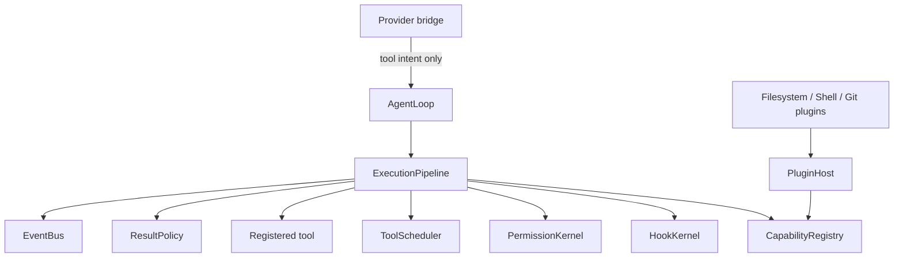
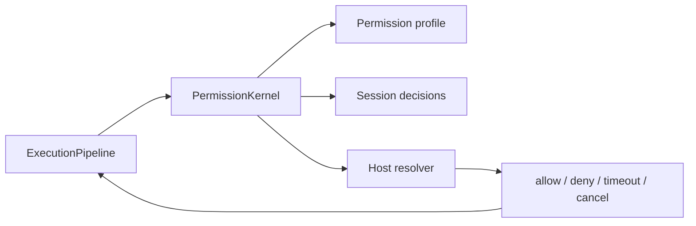
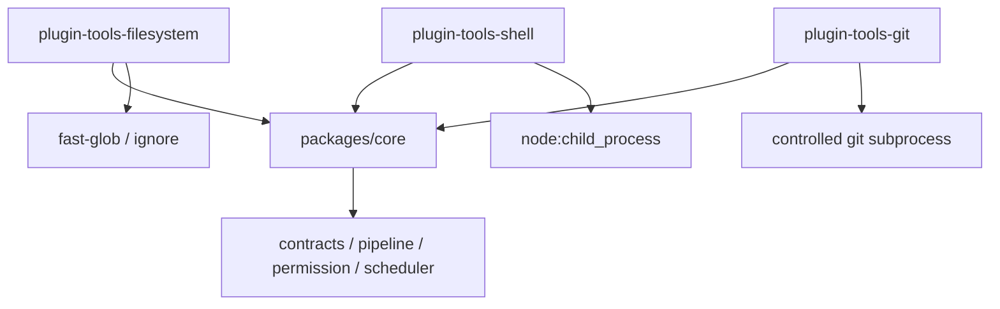
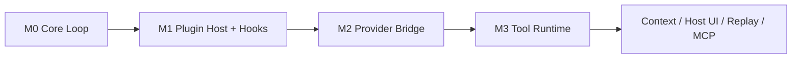
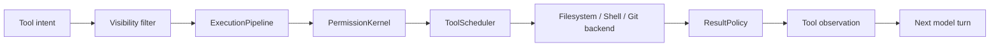

# 从 0 到 1 构建 Agent：M3 Tool Plugins 与权限运行时

M0 里，我们先证明了一个最小闭环：

```text
user -> model -> tool -> model -> final
```

那时的 tool 是测试工具。它不会真的读文件，不会写磁盘，不会跑 shell，也不会碰 git。这个阶段故意很克制，因为 M0 要证明的是 core loop，而不是证明机器已经能替你干活。

但 Agent 终究要走到这一步：

```text
用户说：修一下这个 bug
模型说：我要读文件
模型说：我要改文件
模型说：我要跑测试
模型说：我要看 git diff
模型说：我修好了
```

这时问题就变了。真实工具不再是一个普通函数。它可能读取隐私文件，修改工作区，启动长时间进程，产生巨大输出，甚至在超时后继续留下副作用。

M3 要解决的就是这个转折点：

**当模型开始请求真实宿主动作时，core runtime 必须拥有最终执行权。**

这篇文章只讲 M3 范围内的设计：tool runtime contract、`ExecutionPipeline`、`PermissionKernel`、tool hooks、`ToolScheduler`、result budget、tool visibility，以及 filesystem、shell、git 三个 first-party tool plugin 为什么放在 core 外面。

## 一、为什么真实工具不能直接执行

最容易想到的实现是这样：

```ts
registry.registerTool({
  name: "fs_write",
  execute(input) {
    return fs.writeFile(input.path, input.content);
  }
});
```

模型返回 tool call，loop 从 registry 找到工具，然后直接 `execute()`。

这个写法在 M0 是可以接受的，因为 M0 的 test tool 没有真实副作用。但一旦工具变成 filesystem、shell、git，这条路径马上不够了。

假设模型要做一件很普通的事：

```text
读 src/foo.ts
把某个函数改掉
运行 pnpm test
查看 git diff
```

在这条链路里，runtime 至少要回答这些问题：

- 这个工具现在可用吗？
- 这个工具应该暴露给模型吗？
- 输入参数符合 schema 吗？
- 这次调用需要用户授权吗？
- headless/background 模式下能不能执行？
- 两个文件写入能不能并发？
- shell 超时后进程是否真的停了？
- 输出太大时模型应该看到什么？
- hook 阻断或失败时要不要 fail closed？
- 被拒绝、取消、超时后，模型会不会收到 tool result？

如果这些判断散落在每个工具自己的 `execute()` 里，core 就失去了运行时控制权。每个工具会各自实现一套权限、超时、错误格式和日志，最后 Agent 看起来有很多能力，但没有统一的安全边界。

所以 M3 的第一条原则是：

**模型只能表达意图，插件只能贡献能力，真实动作必须经过 core-owned execution pipeline。**

## 二、M3 把 tool call 拆成一条管线

M0 的 loop 可以直接执行工具。M3 之后，loop 不再直接碰真实工具，而是把 provider 返回的 tool intent 交给 `ExecutionPipeline`。



这条管线看起来比 M0 复杂很多，但它做的是一件朴素的事：在真实执行前，把所有必须由 runtime 统一判断的事情排好顺序。

大致流程是：

```text
lookup tool
-> validate input schema
-> run tool.call.before hook
-> prepare input
-> ask PermissionKernel
-> run tool.execute.before hook
-> execute with timeout / abort signal
-> normalize result or exception
-> run tool.execute.after hook
-> run tool.result.before hook
-> apply result budget
-> emit lifecycle events
-> return model-visible tool result
```

注意这里的最后一步。无论成功、失败、拒绝、取消、超时，pipeline 都要返回一个结构化 tool result。因为对模型来说，tool result 是下一轮推理的上下文。如果 runtime 只是在 host 侧抛异常，conversation state 就会出现孤儿 tool call：模型请求了工具，但消息里没有对应的 tool observation。

M3 的设计判断是：**工具失败通常是模型可见 observation，runtime 控制面失败才是 run failure。**

比如 shell 超时，模型看到的不是一个未捕获异常，而是类似：

```text
SHELL_COMMAND_TIMEOUT: Shell command timed out
```

这样模型可以解释、换命令、收束，或者把失败报告给用户。

## 三、contracts：工具不再只有 name 和 execute

M0 里的 `ToolDefinition` 很轻：名字、描述、输入 schema、effect、execute。

M3 之后，工具定义需要表达更多运行时事实。不是为了把类型做复杂，而是因为真实工具必须把自己的风险边界告诉 core。

一个工具现在大致要说明：

- `inputSchema`：模型输入应该长什么样。
- `effect`：它是 read、write，还是 execute。
- `runtime.permission`：默认 allow、ask、deny，在哪些 profile 下覆盖。
- `runtime.executionMode`：是否 interactive。
- `runtime.scheduler`：能否并发，需要锁住哪些资源。
- `runtime.timeoutMs`：最长执行多久。
- `runtime.resultBudget`：输出超过预算怎么办。
- `runtime.source`：能力来自 first-party、host 还是外部插件。
- `runtime.backend`：背后是 local filesystem、local shell，还是未来 sandbox。
- `runtime.availability`：当前 session 是否真的可用。
- `runtime.visibility`：是否应该暴露给模型。

这带来一个很重要的变化：tool contract 不只是给 provider 看的 schema，它也是给 runtime 做决策的 metadata。

比如 `shell_exec` 可以告诉 runtime：

```text
effect: execute
permission.defaultAction: ask
profileActions.headless: deny
profileActions.background: deny
executionMode: interactive
scheduler.concurrency: serial
timeoutMs: 30000
```

这句话翻译成人话就是：

**shell 能力很危险。默认要问用户，headless/background 不给模型看，也不能并发执行。**

## 四、provider 仍然不能执行工具

M2 已经引入了 AI SDK provider bridge。很多 provider SDK 都支持 tool calling，有些还允许你把 executable tool handler 直接传进去。

但 Guga 在 M3 继续坚持一件事：

**provider bridge 只负责把工具 schema 投影给模型，不负责执行工具。**

也就是说，provider 可以看到：

```text
有一个工具叫 fs_read
它的 description 是什么
它的 input schema 是什么
```

但 provider 拿不到：

```text
fs_read.execute
shell_exec.execute
git_diff.execute
```

原因很简单：如果 provider SDK 直接执行工具，core 的 permission、hook、scheduler、timeout、result budget、audit events 就全部绕过去了。

所以 M3 的路径是：

```mermaid
sequenceDiagram
  participant Loop as AgentLoop
  participant Provider
  participant Pipeline as ExecutionPipeline
  participant Tool

  Loop->>Provider: messages + visible tool schemas
  Provider-->>Loop: tool_calls
  Loop->>Pipeline: execute tool intent
  Pipeline->>Tool: execute after gates
  Tool-->>Pipeline: raw result
  Pipeline-->>Loop: normalized tool result
  Loop->>Provider: messages + tool result
```

provider 只产生意图。core 决定意图能不能变成动作。

这也是 tool visibility 要放在 provider call 之前的原因。headless 模式下，`shell_exec` 不应该先暴露给模型、等模型调用后再拒绝。更好的行为是：一开始就不给 provider 投影这个工具。

## 五、PermissionKernel：权限不是一个 hook 约定

有些系统会把权限做成一个 pre-tool hook。这样当然能拦住一部分调用，但它有一个问题：权限变成了插件约定，而不是 runtime invariant。

M3 把权限收进 `PermissionKernel`：



它支持几类最小语义：

- `allow`：本次允许。
- `deny`：本次拒绝。
- `ask`：交给 host resolver 询问用户或宿主。
- session 级 always allow / always reject。
- `headless`、`background`、`ask-on-write`、`trusted-session` 等 profile 默认策略。
- permission timeout、abort、resolver failure 的结构化结果。

这里刻意没有做企业 policy engine，也没有做 plugin signing、trust tier、allowlist 这些更重的东西。M3 只做运行时必需的最小 permission contract。

仍然用前面的例子：

```text
模型想执行 pnpm test
```

`shell_exec` 的默认策略是 `ask`。在普通 interactive session 里，host 可以弹一个确认框；在 headless/background 里，profile 直接 deny，而且这个工具不会投影给模型。

这样，权限不是“某个 UI 是否弹窗”的问题，而是 core runtime 对所有宿主都一致的执行边界。

## 六、hooks：插件可以参与，但危险阶段必须 fail closed

M1 已经有 HookKernel。M3 在工具执行链路上扩展了几个 phase：

- `tool.call.before`
- `tool.execute.before`
- `tool.execute.after`
- `tool.result.before`

它们的用途不同：

- call-before 可以观察或调整输入。
- execute-before 可以在真实执行前阻断。
- execute-after 可以检查执行后的结果和 metadata。
- result-before 可以在结果进入模型上下文前做最后检查。

但 hook 有一个很容易被忽略的问题：hook 自己也会失败。

如果一个安全 hook 原本负责检查 shell 输出里有没有敏感内容，结果它超时了，runtime 应该怎么做？

M3 的答案是：危险阶段 fail closed。也就是说，hook failure 或 block decision 不能被悄悄吞掉。尤其是 post-execution 阶段，如果 `tool.execute.after` 或 `tool.result.before` 说要 block，pipeline 必须返回 blocked observation，而不是继续把原始结果喂给模型。

这让 hook 的地位很清楚：

**插件可以参与策略，但 core 负责执行这些策略的最终语义。**

## 七、ToolScheduler：默认不并发，除非证明安全

真实工具的第二个麻烦是并发。

模型一次可能返回多个 tool call。看起来可以 `Promise.all`，但真实世界很快会出问题：

```text
call A: fs_edit src/foo.ts
call B: fs_write src/foo.ts
```

如果这两个调用并发，最后写入顺序就不确定。更麻烦的是 symlink、父子路径、workspace root overlap 这些情况。两个路径字符串不同，也可能落到同一个真实资源。

所以 M3 的 scheduler 采用保守规则：

```text
默认 serial
显式 read-only 才能 read parallel
显式 resource-scoped 且 scope 不冲突，才允许 scoped parallel
interactive / ask-required / unknown scope 一律 serial
```

可以把它记成一句话：

**工具默认不可并发，除非 metadata 能证明它安全。**

这和很多“先乐观并发，出问题再加锁”的实现相反。Agent runtime 更适合保守一点，因为模型发出的工具调用不是普通业务代码，它们往往来自推理结果，顺序本身就是语义的一部分。

例如两个 `fs_read` 如果都显式声明 `read-only`，可以放进同一个 parallel batch。两个写不同文件的 `fs_write`，如果资源 scope 明确且不重叠，也可以并行。但缺少 scheduler metadata 的 read 工具，M3 仍然按 serial 处理，因为它没有证明自己线程安全。

## 八、ResultPolicy：输出不是越完整越好

真实工具还会产生大输出。

比如：

```text
fs_read 一个 5MB 文件
shell_exec 打出 20000 行测试日志
git_diff 输出整个 lockfile
```

如果这些内容原样进模型上下文，会带来几个问题：

- prompt 太大，下一轮 provider call 失败或变贵。
- 关键信息被噪声淹没。
- 敏感 metadata 和 model-visible content 混在一起。
- 后续 context compaction 很难还原发生过什么。

M3 引入 result budget。第一版很克制，只实现当前 runtime 真正支持的 contract：

```text
maxContentChars
strategy: truncate | reference
```

也就是说，工具可以声明模型可见内容的预算。超过预算时，runtime 会截断，或者返回一个 reference-style observation。M3 还没有实现 durable artifact store，所以不会假装已经能长期保存所有大结果。

这里的原则和前面一样：contract 只承诺 runtime 真正做到的事。

## 九、为什么 filesystem、shell、git 是插件包

M3 交付了三个 first-party tool plugin：

- `@guga-agent/plugin-tools-filesystem`
- `@guga-agent/plugin-tools-shell`
- `@guga-agent/plugin-tools-git`

它们不是放在 `packages/core` 里，而是作为依赖 core 的插件包存在。



这个边界很关键。

`packages/core` 应该拥有运行时控制面，但不应该内置真实宿主工具。否则 core 很快会带上 glob、ignore、git wrapper、shell helper、平台差异处理等一堆依赖。到那时，core 不再是小内核，而是一个工具大包。

M3 的做法是：

- core 定义 tool contract、permission、pipeline、scheduler、events。
- first-party plugin 实现 filesystem、shell、git 的本地 backend。
- 成熟 npm 包可以用，但只能停留在 plugin backend 内。
- 后续 sandbox 或 remote backend 可以替换 plugin backend，而不改 core contract。

这也是为什么 filesystem 插件可以用 `fast-glob` 和 `ignore`，但 workspace containment、symlink 策略、权限、resource scope、result budget 仍然由 Guga 自己控制。

## 十、三个 first-party tools 的边界

filesystem 插件提供的是受控文件能力，不是任意磁盘 API。

它覆盖：

- read
- write
- exact single-occurrence edit
- search
- file discovery

它必须保证 workspace/root containment。写入和编辑默认保守，尤其是 symlink alias 可能让两个不同路径指向同一个真实文件时，不能因为字符串看起来不同就乐观并发。

shell 插件提供的是受控命令执行，不是一个无限制终端。

它的默认策略是 ask，headless/background deny。它会过滤环境变量，只保留 allowlist 内的变量。它还要处理 timeout 和 AbortSignal。M3 最后把本地 backend 改成自己管理 `spawn` 进程组，因为仅仅杀掉 shell 父进程不够，后台子进程可能继续写文件或占资源。

git 插件提供的是 helper，不是任意 git command 通道。

它覆盖：

- status
- diff
- commit assistance

它刻意排除危险历史改写、push、credentials 和复杂 git workflow automation。因为 M3 的目标不是做一个完整 git agent，而是让模型能在安全边界里理解当前工作区状态。

## 十一、事件：为审计和 replay 留下事实

M0 已经有 `EventBus`。M3 把工具生命周期事件扩展得更细：

```text
tool visibility filtered
tool queued
tool permission requested
tool permission decided
tool started
tool completed
tool failed
tool denied
tool cancelled
tool timeout
tool result budget applied
hook decision
```

这些事件不是为了把日志写热闹，而是为了后续几个能力：

- host UI 可以显示工具为什么没出现。
- debug 面板可以解释一次调用在哪个 gate 被挡住。
- audit 可以看到谁允许了什么动作。
- replay 可以根据 runId、turn、toolCallId、attempt、batchId 重建执行顺序。
- context policy 可以知道哪些大结果被截断或引用。

所以 M3 里 lifecycle、permission、hook、result event 都尽量携带 correlation fields。比如同一个 provider response 里有多个 tool call，它们会共享 batch 语义，但每个 tool call 又有自己的 toolCallId 和 attempt。

一句话：**事件记录的是 runtime 已经发生的事实，不是给模型看的故事。**

## 十二、把 M3 放回整条演化链

到这里，我们可以回头看 M0 到 M3 的变化。

M0 证明了 core loop：

```text
model asks tool -> tool result returns -> model final
```

M1 加入 plugin host 和 hooks，让能力可以被外部贡献，让生命周期可以被扩展。

M2 加入 provider bridge，让真实模型可以接入，但仍然保持 provider-neutral core，并且不让 provider 执行工具。

M3 则让真实工具进入系统，但不让真实工具绕过 runtime。



如果只看功能，M3 好像是在“加文件工具、shell 工具、git 工具”。但真正重要的不是这三个工具本身，而是它们都被迫经过同一条执行管线。

这条管线让 Guga 保持了一个核心判断：

**Agent 可以行动，但行动不是模型直接拥有的能力，而是 runtime 授权后的结果。**

## 十三、M3 刻意不做什么

和 M0 一样，M3 也有边界。

它不做：

- browser tools。
- MCP tool integration。
- remote sandbox provider。
- enterprise policy engine。
- plugin signing 和 marketplace trust tier。
- durable artifact/result store。
- 具体 CLI/Web/IDE permission dialog。
- 完整 context compaction。
- multi-agent delegation。
- 危险 git history rewrite、remote push、credential management。

这些都重要，但如果在 M3 一起做，tool runtime contract 反而会被太多宿主细节淹没。

M3 要先钉住的是更底层的东西：工具调用进入系统后，必须能被验证、授权、调度、执行、预算、审计，并且无论结果如何，都能闭环回 conversation state。

## 结语：M3 的一句话

M3 不是简单地给 Agent 加了几个工具。

它把真实宿主动作从“registry 里的函数调用”升级成了“core runtime 负责裁决的执行事务”。

这条事务从 provider tool intent 开始，经过 schema、hook、permission、scheduler、timeout、backend、result policy 和 lifecycle events，最后变成模型可见的 tool observation。

把它连起来，就是 M3 的最小安全链路：



有了 M3，Guga 才真正从“能聊、能调用测试工具”走到了“能安全地请求真实动作”。后面的 context policy、host permission UI、MCP tools、replay 和 sandbox backend，都可以站在这条管线上继续长出来。
