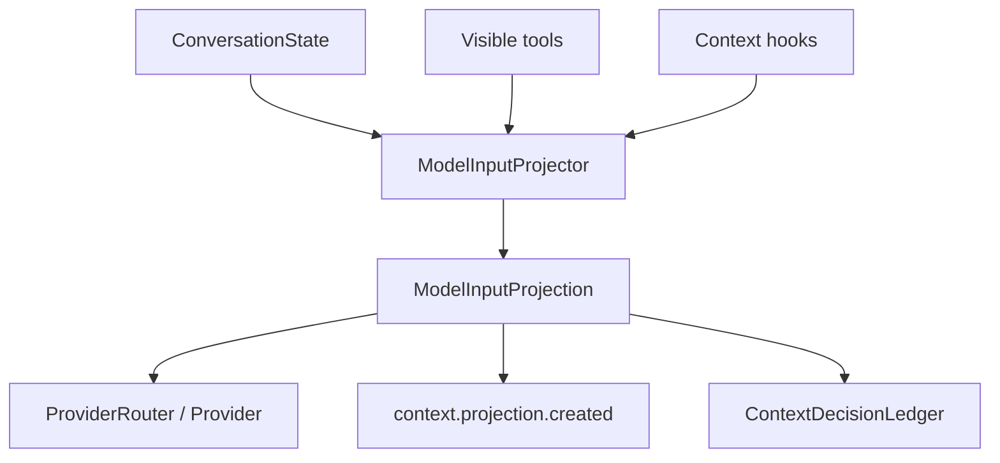
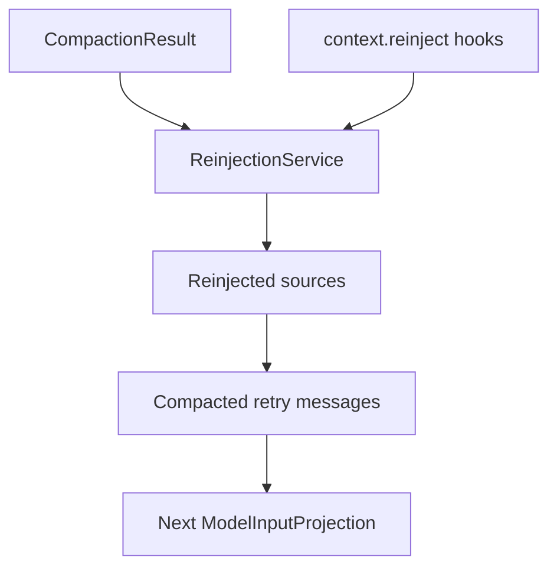
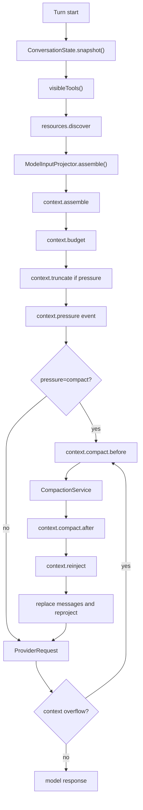

# 从 0 到 1 构建 Agent：M4 Context Policy Plugins 与模型输入投影

M0 里，我们证明了最小闭环：

```text
user -> model -> tool -> model -> final
```

M1 把能力注册、插件生命周期和 HookKernel 接进来。M2 把 provider bridge 拆出去，让 core 不依赖真实模型 SDK。M3 又把真实工具执行收回 core-owned pipeline：模型只能表达 tool intent，真正的读文件、跑 shell、看 git diff，都要经过权限、hook、调度、超时和 result budget。

到这里，Agent 已经能干活了。

但只要任务稍微长一点，另一个问题马上出现：

```text
用户说：登录后跳转失败，帮我找原因并修好。
Agent 读项目结构。
Agent 搜索 auth/router/session。
Agent 读取多个文件。
Agent 跑测试。
Agent 拿到几千行日志。
Agent 改代码。
Agent 再跑测试。
Agent 总结。
```

这些信息都很有用，但它们不应该以同一种形态挤在 `messages` 里。

项目规则、当前用户目标、旧历史、工具输出、测试日志、文件片段、压缩摘要、可用工具、权限模式、宿主上下文，它们的权威性、生命周期和可压缩性都不一样。如果 `AgentLoop` 每轮只是把 `ConversationState.snapshot()` 原样传给 provider，短期看很简单，长期看会把 context 管理变成一团线。

M4 要解决的就是这个转折点：

**模型输入不再等于聊天历史，而是一次可审计的 projection。**

这篇文章只讲 M4 范围内的设计：`ModelInputProjection`、`ContextSourceDescriptor`、`ContextBudgeter`、工具结果多视图、pairing safety、reactive/proactive compaction、post-compact reinjection、context hook phases、默认 context policy plugin，以及为什么 M4 先做 ledger 边界，而不急着做长期记忆。

## 一、为什么不能继续直接传 messages

M3 之后，`AgentLoop` 已经知道如何执行真实工具。每轮大概是：

```text
state.snapshot()
-> visible tools
-> provider.generate(messages, tools)
-> tool calls
-> ExecutionPipeline
-> append tool result
-> next turn
```

这条路径在短任务里没问题。问题是，`messages` 这个结构太粗了。

还是登录跳转 bug 的例子。Agent 在修复过程中可能拿到这些信息：

- 用户目标：登录后跳转失败，要修好。
- 用户约束：不要改 public API。
- 项目规则：不要手改生成文件。
- 文件内容：`auth.ts`、`router.ts`、`session-store.ts`。
- 搜索结果：所有 `redirectTo` 的引用。
- 测试日志：几千行，只中间一段有失败原因。
- 工具结果：shell、grep、read file、git diff。
- 当前状态：已经改了哪个文件，下一步要跑哪条测试。
- 权限模式：shell 是否允许执行。
- 可用工具：当前 runtime 暴露了哪些工具。

如果这些东西全都变成普通消息，系统很快会遇到几类失败。

第一，token 爆炸。真正撑爆窗口的常常不是用户多说了几句话，而是工具输出和文件内容。

第二，上下文污染。历史里可能保留旧版本文件内容，但工作区已经被修改。模型下一轮看似在分析，实际分析的是过时现场。

第三，约束丢失。用户一开始说“不要改 public API”，压缩后如果这句话没被保留下来，模型后面可能越界。

第四，压缩失忆。粗糙摘要只写“读了文件、跑了测试”，却没有保留目标、阻塞点、关键文件、下一步和用户约束。

第五，审计断裂。出问题时 host 想知道“这一轮模型到底看到了什么”，但系统只有一串被不断修改的消息数组。

所以 M4 的第一条原则是：

**ConversationState 是事实来源之一，ProviderRequest 是投影结果，中间必须有显式边界。**

## 二、ModelInputProjection：给模型输入一个边界

M4 引入的核心对象是 `ModelInputProjection`。

它不是另一种聊天消息格式，也不是 memory。它更像一次模型调用前的“装箱清单”：

```text
这次 provider request 里有哪些 messages？
有哪些 tools？
这些内容来自哪些 source？
每个 source 估算多少 token？
哪些 source 是 protected？
预算和 pressure 怎么判断？
哪些 policy decision 参与了这次组装？
projection hash 是什么？
目标 provider/model 的 context window 是多少？
```

可以把它理解成：

```text
事实源
-> context source descriptors
-> budget / policy / pairing / pressure
-> ModelInputProjection
-> ProviderRequest
```

M4 之后，`AgentLoop` 不再直接把 `state.snapshot()` 当成 provider request，而是先调用 `ModelInputProjector`：



`ModelInputProjection` 里仍然包含 provider-visible `CoreMessage[]` 和 `ToolDefinition[]`，因为最终 provider 需要的还是 messages 和 tools。但它额外记录了 source、budget、pressure、policy decisions 和 hash。

这个设计的重点是：**模型输入可以被解释。**

如果某一轮模型犯错，host 不需要猜它是不是看到了测试日志，也不需要从一整串历史里手工翻。projection 自己就能说明：

- 哪些消息进入了模型。
- 哪些工具被投影给模型。
- 哪些工具结果被预览、截断或引用。
- 哪些历史被 compact。
- 哪些 source 是 post-compact reinjection。
- 这次输入对应哪个 hash。

这为后面的 M5 replay、session resume 和 audit 留了口子。

## 三、ContextSource：不要把所有上下文都叫 history

`messages` 最大的问题，是它只能粗略表达 role：system、user、assistant、tool。

但 context 管理需要更细的分类。

M4 定义了一组 `ContextSourceKind`：

```text
system_prompt
developer_prompt
history
pending_turn
tool_result_preview
artifact_reference
resource_file
skill_body
plan_todo
compaction_summary
host_context
active_tool
permission_mode
```

这组分类不是为了把名词列整齐，而是为了告诉 runtime：这块信息来自哪里、权威性多高、能不能压缩、能不能只保留引用，以及 compact 后要不要恢复。

| Kind | 是什么 | 通常怎么处理 |
| --- | --- | --- |
| `system_prompt` | 系统级规则，比如 agent 身份、工具协议、安全边界 | 最高优先级，不能压缩，不能被 summary 替代 |
| `developer_prompt` | 开发者或宿主注入的运行规则，比如项目工作流、代码规范 | 高优先级，通常 protected |
| `history` | 已完成的历史对话、旧的 assistant/user/tool 上下文 | 可裁剪、可摘要、可 compact |
| `pending_turn` | 当前用户这轮意图，或者当前未完成的 turn | 必须保护，不能被压缩掉 |
| `tool_result_preview` | 工具结果给模型看的短预览，比如测试日志 head/tail | 可预算、可截断、可替换为引用 |
| `artifact_reference` | 大文件、日志、diff、artifact 的外部引用 | 通常只给路径、id、重读方式，不贴全文 |
| `resource_file` | 由 host 或插件发现的资源文件，如项目规则、配置片段 | 按优先级进入模型，可由 policy 控制 |
| `skill_body` | 当前任务需要的 skill 内容，比如写作规范、工具使用说明 | 只在相关时注入，避免长期污染 context |
| `plan_todo` | 当前计划、任务清单、下一步、已完成事项 | compact 后常需要 reinject，帮助任务不断线 |
| `compaction_summary` | 压缩历史后的摘要 | 是历史摘要，不是新指令；不能升级成 system prompt |
| `host_context` | 宿主提供的上下文，如 cwd、项目名、当前文件、UI 状态 | 可注入，但要低于系统/开发者规则 |
| `active_tool` | 当前暴露给模型的工具 schema/能力描述 | provider request 前生成，随权限和环境变化 |
| `permission_mode` | 当前权限模式，如 interactive/headless/background/trusted | compact 后也要恢复，影响工具可见性和执行 |

这些 source 的优先级和保护规则不同。

`system_prompt` 是 critical，不能压缩。`pending_turn` 是当前用户意图，不能被历史摘要吞掉。`tool_result_preview` 可以被预算治理。`resource_file` 和 `host_context` 可以由插件发现。`compaction_summary` 是历史任务上下文，但它不能升级成 system instruction。`permission_mode` 是 runtime 状态，压缩后要恢复。

这对应 `docs/research/agent-context-management.md` 里反复强调的一句话：

**summary 是续航手段，不是事实源；messages 是模型输入投影，不是完整账本。**

M4 在实现上没有一次性重写完整 session store，但先把 source descriptor 立住：

```text
id
kind
priority
provenance
tokenEstimate
contentHash
messageIndexes
references
modelVisible
protected
metadata
```

这比直接传 messages 多走了一步，但这一步非常关键。因为一旦 source 被类型化，后续才能讨论：

- 哪些可以 snip？
- 哪些只能引用？
- 哪些需要出现在 UI audit？
- 哪些能被插件贡献？
- 哪些必须在 compact 后 reinject？

否则，压缩策略只能对一串字符串下手。

## 四、ContextBudgeter：先知道什么时候快满了

做 context 管理，不能只在 provider 报错后才反应。

M4 引入 `ContextBudgeter`，根据模型 metadata 和 projection 内容估算本轮输入：

```text
contextWindow
- reservedOutputTokens
= usableInputTokens

estimatedInputTokens / usableInputTokens
-> none / warning / compact
```

默认阈值很保守：

```text
warningThreshold: 0.70
compactThreshold: 0.85
reserved output: 优先用 model.maxOutputTokens，否则用默认保留值
```

当 projection 接近阈值时，runtime 会发出结构化 `context.pressure` event。到 compact 阈值时，`AgentLoop` 可以在 provider call 前主动 compact，而不是等 provider 返回 prompt too long。

这就是 proactive compaction。

```mermaid
sequenceDiagram
  participant Loop as AgentLoop
  participant Projector as ModelInputProjector
  participant Budgeter as ContextBudgeter
  participant Compactor as CompactionService
  participant Provider

  Loop->>Projector: assemble(messages, tools, sources)
  Projector->>Budgeter: estimate
  Budgeter-->>Projector: pressure=compact
  Projector-->>Loop: projection
  Loop->>Compactor: compact(proactive-threshold)
  Compactor-->>Loop: summary + boundary
  Loop->>Projector: reassemble compacted retry messages
  Loop->>Provider: generate(compacted projection)
```

M4 仍然支持 reactive compaction：如果 provider 或 router 返回 `context-overflow`，loop 会把它当作可恢复分支，compact 后重试当前用户意图。

这里有一个重要边界：

**overflow recovery 属于 loop，不属于 provider bridge。**

provider bridge 只负责把请求发给模型、把响应翻译回 core contract。它不应该偷偷吞掉 prompt too long，也不应该自己拼 compact prompt。否则 context 账本、hook decision、pressure event 和 retry 限制都会断掉。

## 五、工具结果不能只有一份字符串

M3 已经有了 result budget，但 M4 把工具结果治理往前推进了一步：

```text
raw result
LLM preview
UI projection
audit metadata
reference / reread instruction
```

为什么要拆？

因为不同消费者需要不同形态。

模型需要的是短、准、能继续推理的 preview。UI 可能需要更完整的展示。审计需要知道原始结果有多长、是否省略、引用在哪里。后续 replay 需要 source ref，而不是每次都把 5MB 日志塞进 projection。

例如 shell/test 输出适合 head/tail：

```text
前面保留命令启动、环境和开头错误
中间省略
后面保留最终失败栈、退出码和 summary
```

search/grep 输出适合保留匹配位置和少量 snippet。file read 输出适合保留 path、range、hash 和 excerpt。diff 输出适合保留文件列表和关键 hunk。

M4 的 `createToolResultPreview()` 先落了最小策略：

- execute 类工具走 head/tail。
- search 类工具按行数和字符数收敛。
- read/git/edit/custom 先做 capped preview。
- 超预算时明确告诉模型省略了多少字符。
- 如果有 reference，告诉模型后续如何 reread。

这背后的原则是：

**大工具结果不应该作为普通聊天历史进入模型。**

它应该进入 `ToolResultStore`，然后只把可解释 preview 和 reread reference 投影给模型。

## 六、Pairing Safety：tool call/result 不能被压坏

Agent 的消息不是普通聊天消息。assistant 可以发 tool calls，后面必须有对应的 tool result。

如果 compaction 或 truncation 把其中一半剪掉，就会出现孤儿：

```text
assistant: call tool A
assistant: call tool B
tool: A result
// B result 被剪掉了
```

很多 provider 对这种结构非常敏感。即使 provider 不报错，模型也会误解现场。

M4 在 projection 前先跑 `ensureToolPairingSafety()`：

- 识别 assistant tool call batch。
- 把同一 assistant message 里的多个 tool call 当成不可分割批次。
- 如果发现缺失 result，补 synthetic placeholder。
- 如果发现 orphan tool result，记录 pairing refuse decision。
- 把 repair/refuse 写进 policy decisions。

这件事看起来很底层，但它是 compaction 的安全基础。

因为 context 管理不能只问“这段文字能不能删”，还要问：

```text
删了以后，provider message protocol 还合法吗？
删了以后，模型还能理解工具生命周期吗？
删了以后，UI/replay 能解释这次变化吗？
```

## 七、CompactionService：压缩不是把历史总结成一段话

M4 的 compaction 首版故意不依赖真实 summarizer。

它先做 local skeleton summary，保留固定八类字段：

```text
objective
completedWork
currentBlockers
nextSteps
keyFilesAndSymbols
toolResultReferences
unresolvedQuestions
userConstraints
```

每次 compact 还会记录：

```text
trigger
boundary
preTokenEstimate
postTokenEstimate
retainedSourceIds
compactedSourceIds
cutoffSourceId
parentSummaryRef
iterationNo
preprocessingApplied
strippedRoundIds
degradedTo
```

这里最重要的是 boundary 和 lineage。

boundary 说明这次压缩从哪里切、保留了什么、压缩了什么。lineage 说明如果已经压缩过一次，下一次 summary 要接住上一份 summary，而不是重新生成一个互相漂移的故事。

M4 先把 `iterationNo`、`parentSummaryRef`、`degradedTo`、`strippedRoundIds` 这些字段放进 contract。即使首版没有真实 LLM summarizer，也要让结果形态从一开始就支持多次 compact。

这避免后面出现一个常见问题：

```text
第一版只存 summary string。
第二版想做 replay，发现不知道 summary 压了哪些 source。
第三版想做多次 compact，发现不知道 parent summary 是谁。
第四版想做评测，发现没有 pre/post token 和 degraded mode。
```

M4 的取舍是：

**LLM summary 可以晚一点接，但 compaction result 的账本形态要先对。**

## 八、Reinjection：压缩后要把工作台摆回来

压缩历史之后，模型不应该只看到一段 summary。

继续登录跳转 bug 的例子。compact 后，模型还需要知道：

- 当前仍可用哪些工具。
- 权限模式是什么。
- 当前活跃的资源或宿主上下文是什么。
- 计划/待办、活跃技能、关键文件引用是否还在。
- summary 只是历史上下文，不是新的系统指令。

这就是 post-compact reinjection。

M4 引入 `ReinjectionService`，把 `ReinjectionSource` 转成低权威的 context source descriptor。`AgentLoop` 在 compaction 完成后跑 `context.reinject` hook，然后把默认 active tools、permission mode，以及插件贡献的 host/resource/plan/skill sources 重新投影进 retry messages。



这里有两个边界。

第一，reinjection 不能提升权限。低优先级历史摘要不能变成 system/developer instruction。M4 会把 compaction summary 和 reinjected host context 识别成 typed sources，而不是把它们当成新的根规则。

第二，旧 runtime context 不能复用。`ReinjectionSource` 可以带 `runtimeContextId`。如果 session reload、fork、switch 后 context id 不匹配，`ReinjectionService` 会把它变成 stale descriptor：不 model-visible，并记录 rejected metadata。

这对应 context 管理里的 Boundary 维度：不同 session、fork、权限模式之间，不能把旧现场直接搬过去。

## 九、Context hooks：插件可以参与策略，但不能直接改事实源

M1 已经有 HookKernel。M4 不是另起一套插件机制，而是把 context policy 作为新的 hook 能力接进来。

M4 支持这些 phase：

```text
resources.discover
context.assemble
context.budget
context.truncate
context.compact.before
context.compact.after
context.reinject
```

这些名字很像生命周期，但它们的设计重点是权限边界。

Context hook 可以返回：

- source contribution
- typed patch
- gate decision
- reinjection decision
- annotation

但它不能直接 mutate event log、conversation state 或 final provider request。

换句话说，插件可以说：

```text
我发现了一个 resource source。
我建议这个 source 参与 assembly。
我观察到了 budget。
我拒绝这次 compact。
我建议 reinject 这份 host context。
```

但插件不能偷偷：

```text
直接改 ConversationState。
直接往 provider messages 里塞系统指令。
直接删除 event history。
绕过 AgentLoop 做 compact retry。
```

这就是 M4 的 policy plugin 边界：

**插件参与 context 决策，但事实源和最终投影仍由 core 统一组装。**

M4 还让 `ContextPolicy` 声明：

```text
phase
effect
priority
timeoutMs
permissionScope
auditIdentity
```

`HookKernel` 会按 policy priority 排 context hooks，用 policy timeout 约束 hook 执行，并用 permission scope 限制 decision 类型。比如 read-only policy 只能 annotation；需要 gate compaction 的 hook 必须有更高的 `compaction-gate` scope。

这样，context policy 不只是 metadata，而是进入了运行时控制路径。

## 十、默认 context plugin：证明策略可以替换

M4 新增了 first-party package：

```text
@guga-agent/plugin-context-default
```

它做的事情不复杂，但意义很大。

它注册一个默认 context policy：

```text
id: guga-default-context-policy
phases:
  - resources.discover
  - context.assemble
  - context.budget
  - context.truncate
  - context.compact.before
  - context.compact.after
  - context.reinject
priority: 0
timeoutMs: 1000
permissionScope: context-write
```

然后提供一组默认 hook：

- `resources.discover`：贡献默认 host context source。
- `context.assemble`：记录 source assembly annotation。
- `context.budget`：记录默认阈值。
- `context.truncate`：观察 truncation candidates。
- `context.compact.before`：用 gate 允许 pairing-safe compaction。
- `context.compact.after`：记录 compact boundary 和 degraded mode。
- `context.reinject`：声明 reinjected sources 低于 system/developer authority。

这不是为了让默认插件多聪明，而是为了证明：

**host 可以不改 core，就替换 context policy。**

后续可以把默认插件拆成多个包：

```text
basic
tool-results
truncation
compaction
reinjection
```

但 M4 先保持一个包。因为第一版更重要的是证明 capability shape，而不是提前做插件市场。

## 十一、ContextDecisionLedger：M4 先做最小账本

M4 没有完成完整 session store。

这很克制，也很必要。因为 M5 才会做 append-only session event store、artifact store、resume、fork 和 tree navigation。

但 M4 不能完全没有账本。否则 projection、compaction 和 policy decisions 都只存在内存临时变量里，M5 无法 replay。

所以 M4 做了一个最小 `ContextDecisionLedger`：

```text
projectionId
runId
turn
sourceRefs
sourceDescriptors
policyDecisions
compactionBoundary
projectionHash
```

它不存 raw artifact content，也不承担 session resume。它只记录“足够解释这次 projection 的 descriptor 和 decision”。

这相当于先给未来的 M5 留下接口：

```text
完整事实源仍在 event / tool result / artifact / session store。
M4 ledger 只记录本轮模型输入是如何从这些事实源投影出来的。
```

这个边界很重要。

如果 M4 试图一口气做完 durable session store，很容易把目标拉爆。反过来，如果 M4 完全不记录 projection decision，后面再补 replay 会发现关键上下文已经丢了。

## 十二、M4 之后，AgentLoop 发生了什么变化

M4 之后，`AgentLoop` 的 provider 前路径大致变成：

```text
state.snapshot()
-> visibleTools()
-> resources.discover hooks
-> ModelInputProjector.assemble()
-> context.assemble hooks
-> context.budget hooks
-> optional context.truncate
-> emit context.pressure
-> proactive compact if pressure=compact
-> provider request
-> reactive compact if provider context-overflow
-> post-compact reinjection
-> retry current intent
```

完整一点可以画成：



这条路径比 M3 多了不少步骤，但它解决的是一个更长期的问题：

**每一轮模型输入都变成了可解释、可预算、可压缩、可替换策略的 runtime artifact。**

## 十三、M4 没做什么

为了避免误解，M4 有几件事明确没做。

第一，M4 不做长期记忆。没有用户偏好自动提炼，没有跨 session semantic memory，没有向量搜索。

第二，M4 不做完整 session resume。它只准备 projection ledger 和 source refs，完整 append-only event store 留给 M5。

第三，M4 不接真实 LLM summarizer。`CompactionService` 支持 summary contract、iteration、parent、degraded mode，但首版用 local skeleton fallback。

第四，M4 不做 enterprise context policy。敏感信息过滤、trust model、summary quality eval、audit export 都是后续 M8 级别的事情。

第五，M4 不让 provider bridge 承担 context assembly。provider bridge 仍然只消费 projection 后的 request。

这几个“不做”反而让 M4 的边界更清楚：

```text
M4 不是 memory 系统。
M4 不是完整持久化系统。
M4 不是高级摘要平台。
M4 是模型输入投影和 context policy 控制平面。
```

## 十四、把 M4 放回整个系列

现在可以把 M0 到 M4 串起来看：

```text
M0: 证明 user -> model -> tool -> model -> final 的最小闭环。
M1: 让 provider/tool/hook 可以通过 plugin host 注册。
M2: 把真实 provider SDK 隔离到 bridge 外壳。
M3: 把真实工具执行收回 core-owned pipeline。
M4: 把模型输入从 messages 数组升级为可审计 projection。
```

每一层都在回答一个更底层的问题。

M0 问：Agent loop 能不能跑？

M1 问：能力能不能从 core 外部进来？

M2 问：模型提供商能不能替换？

M3 问：真实动作能不能被 runtime 控制？

M4 问：模型每轮看到的现场能不能被解释、压缩和治理？

这就是为什么 M4 不是“加一个自动摘要功能”。自动摘要只是 context 管理里的一小块。真正的核心是：

```text
facts 留在事实源。
projection 决定本轮模型看什么。
policy hooks 参与决策但不篡改事实。
compaction 有 boundary 和 lineage。
reinjection 让压缩后任务不断线。
ledger 为 replay 和 audit 留证据。
```

如果用一句话记住 M4：

**不要把上下文当成一条越堆越长的聊天记录；把它当成每轮模型调用前，由 runtime 生成的一次可审计工作台投影。**

## 参考

- [Agent Context 管理：从最小可运行演进到商业级复刻](../docs/research/agent-context-management.md)
- [Context Policy Plugins](../docs/research/context-policy-plugins.md)
- [M4 Context Policy Plugins Plan](../docs/plans/2026-05-27-001-feat-context-policy-plugins-plan.md)
