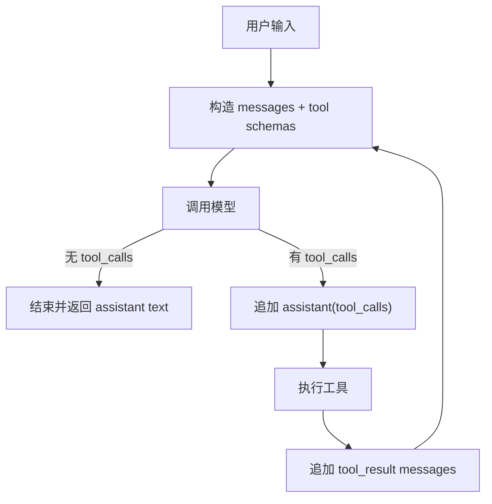

# Agent ReAct 模式：从最小可运行到商业级复刻的阶段路线图

ReAct 最容易被低估的地方，是它看起来像一个 prompt 技巧：让模型写出 Thought、Action、Observation，然后外层用正则解析。真实的商业级 agent 几乎不会停在这里。`blade-agent-sdk`、`blade-code`、`opencode`、`deepagentsjs`、`deer-flow` 给出的共同答案是：ReAct 的核心不是文本格式，而是一个能维护消息顺序、工具状态、退出条件、压缩恢复和客户端事件投影的 runtime。

所以这篇文章不按“概念解释”来写，而按一条可落地的复刻路线写：从 L0 的一次模型调用开始，到 L1 的最小 ReAct loop，再到 L2 的 LoopController、L3 的 streaming 与 tool state、L4 的压缩/恢复/重复调用防护，最后演进到 L5 的商业级 runtime。每一级只引入一个主要复杂度，做完就有可验收的产物；没有做完上一层，不要急着抄下一层。

本文沿用 `arch-insight` 的 `Article - Deep Dive` 交付模式：不是源码目录导览，而是用真实源码路径建立设计判断。参考项目版本锚点来自 `/Users/lienli/Documents/GitHub/guga-agent/docs/research/intake/source-contract.md`：`blade-agent-sdk@5d67e5e`、`blade-code@ad67f3d`、`opencode@caf1151`、`deepagentsjs@7c33a86`、`deer-flow@84f88b6`、`cc-haha@dbb8c95`、`hermes-agent@dd0923b`。其中 `cc-haha` 只作为远端事件、权限、compact boundary 的桥接参考，不作为 ReAct core 参考；`hermes-agent` 也不适合当 L0/L1 范本，它更像 L5 产品态 runtime 的压力样本。

## 先确定终局：商业级 ReAct 到底长什么样

商业级 ReAct runtime 不是一个 `while (tool_calls) executeTools()` 函数。它至少要稳定维护八条边界：

- `ConversationState`：system prompt、可压缩历史、当前 pending 消息分开管理。
- `PromptBuilder`：每轮从状态投影出模型输入，而不是到处拼 messages。
- `LLMClient`：把不同 provider 的 text/tool/reasoning/usage stream 归一化。
- `ToolRegistry`：声明工具 schema、effect、权限、是否只读、是否并发安全。
- `ToolExecutor`：执行工具，处理权限、锁、超时、取消和结果格式。
- `LoopController`：决定继续、结束、重试、压缩、恢复、取消。
- `EventStore`：保存 run、turn、part、tool call、usage、error、compact boundary。
- `EventProjector`：把内部事件投影给 CLI、Web、IDE、远端协议。

这八个对象不应该在 L1 一口气写完。更稳的路线是：先把模型调用打通，再把 tool call 回流打通，然后把停止条件、streaming、状态恢复、权限和事件投影逐层补上。

## 参考项目应该怎么借

`blade-agent-sdk` 是最适合学习最小 runtime 骨架的项目。它把 `agentLoop` 写成 `AsyncGenerator<AgentEvent, LoopResult>`，循环内部调用 `runTurn`，再把 assistant tool calls、tool results 追加回 `ConversationState`。关键路径是 `/Users/lienli/Documents/GitHub/agent-ref/blade-agent-sdk/src/agent/AgentLoop.ts:122`、`/Users/lienli/Documents/GitHub/agent-ref/blade-agent-sdk/src/agent/loop/runTurn.ts:79`、`/Users/lienli/Documents/GitHub/agent-ref/blade-agent-sdk/src/agent/loop/planToolExecution.ts:29`。

`blade-code` 更像产品态 CLI agent 的路线图。`executeLoopGenerator` 处理 abort、轮次上限、streaming fallback、prompt too long 后的 reactive compaction、JSONL 持久化和 tool result budget；`ConversationState` 则明确把 `systemMessages / history / pending` 拆开。关键路径是 `/Users/lienli/Documents/GitHub/agent-ref/blade-code/packages/cli/src/agent/loop/executeLoopGenerator.ts:436` 和 `/Users/lienli/Documents/GitHub/agent-ref/blade-code/packages/cli/src/agent/loop/ConversationState.ts:40`。

`opencode` 代表 session runtime 的另一种成熟形态：loop 不只处理 messages，还把 assistant 输出拆成 message parts，并给 tool part 建立 `pending / running / completed` 状态。它的 session loop 在 `/Users/lienli/Documents/GitHub/agent-ref/opencode/packages/opencode/src/session/prompt.ts:1625`，tool part 状态投影在 `/Users/lienli/Documents/GitHub/agent-ref/opencode/packages/opencode/src/session/processor.ts:286`、`:333`、`:394`。

`deepagentsjs` 和 `deer-flow` 更适合学习“框架拥有 loop，应用层用 middleware 编排能力”的路线。`deepagentsjs` 的 `createDeepAgent` 最终在 `/Users/lienli/Documents/GitHub/agent-ref/deepagentsjs/libs/deepagents/src/agent.ts:449` 调用 LangChain 的 `createAgent`，不是自己手写主循环；`agent.ts:424` 附近更接近 system prompt 组合。`deer-flow` 的 bootstrap/default 两条 `create_agent(...)` 调用分别在 `/Users/lienli/Documents/GitHub/agent-ref/deer-flow/backend/packages/harness/deerflow/agents/lead_agent/agent.py:416` 和 `:434`，重复调用防护在 `/Users/lienli/Documents/GitHub/agent-ref/deer-flow/backend/packages/harness/deerflow/agents/middlewares/loop_detection_middleware.py:144`。

`cc-haha` 不应被当成 ReAct core。它的价值在远端会话壳：WebSocket 收消息、HTTP 发用户消息、控制权限请求，并把 SDK 消息转成 REPL 可渲染消息。参考 `/Users/lienli/Documents/GitHub/agent-ref/cc-haha/src/remote/RemoteSessionManager.ts:95` 和 `/Users/lienli/Documents/GitHub/agent-ref/cc-haha/src/remote/sdkMessageAdapter.ts:168` 即可。

`hermes-agent` 是最值得放在终局观察位的参考。它的 `AIAgent` 在 `/Users/lienli/Documents/GitHub/agent-ref/hermes-agent/run_agent.py:1028`，主循环 `run_conversation` 在 `:11613`，工具执行分成统一入口、并发执行和顺序执行三段，分别在 `:10410`、`:10564`、`:10965`。它还把共享迭代预算做成 `IterationBudget`，见 `run_agent.py:283`，把中断入口做成 `interrupt()`，见 `run_agent.py:5196`。这类设计不适合第一天照抄，但很适合回答“商业级 ReAct 到底还缺哪些运行时控制权”。

## L0：一次模型调用，先不要叫它 agent

L0 的目标只有一个：在你的代码里建立“模型回合”的最小契约。此时没有工具执行，没有 loop，没有压缩，也没有 UI 事件。你只需要证明：给定 `messages`、模型配置和取消信号，runtime 能得到一次 assistant 输出，并记录基础 usage。

要做什么：

- 定义最小 `Message`：`system | user | assistant`。
- 定义 `ModelTurnInput`：`messages`、`model`、`temperature`、`abortSignal`。
- 选择一个支持 tool calling 的模型接口，但本阶段不执行工具。
- 返回 assistant text，并保留 provider 原始 usage 或 normalized usage。
- 给模型调用加 abort signal，避免后面再补取消语义时推翻接口。

参考源码：

- `/Users/lienli/Documents/GitHub/agent-ref/blade-agent-sdk/src/agent/loop/runTurn.ts:141` 展示非流式模型调用可以非常薄：`turnChatService.chat(messages, tools, signal)`。
- `/Users/lienli/Documents/GitHub/agent-ref/blade-code/packages/cli/src/agent/loop/executeLoopGenerator.ts:615` 到 `:629` 展示 usage 进入事件流的方式。
- `/Users/lienli/Documents/GitHub/agent-ref/opencode/packages/opencode/src/session/prompt.ts:1684` 到 `:1685` 展示 session runtime 在每步 loop 中解析本轮模型。

验收标准：

- 同一组 `messages` 可以稳定得到 assistant text。
- abort 后调用能停止，并返回明确取消错误或结果。
- usage 至少能记录 input/output/total token 中的一部分。
- prompt、模型调用、会话持久化还没有混在一个函数里。

不要提前做什么：

- 不要先抽象多 provider 矩阵。一个 provider 跑通即可。
- 不要做 tool registry。L0 只验证模型 I/O。
- 不要把 UI 事件写进模型调用函数。后面 L3 会统一做事件层。

## L1：最小 ReAct loop，让工具结果回到模型

L1 才是真正的 ReAct 起点。它的核心不是让模型输出 `Action: read_file`，而是维护合法的 `assistant.tool_calls -> tool message` 配对。只要这个配对错了，OpenAI、Anthropic、Moonshot 这类严格消息协议都会在后续轮次报错。

要做什么：

- 支持模型返回 `tool_calls`。
- 先把 assistant 消息连同 `tool_calls` 写入状态。
- 逐个执行工具。
- 把工具结果写成 `role: "tool"`，携带 `tool_call_id` 和工具名。
- 下一轮模型调用使用完整消息：system + history + assistant tool calls + tool results。
- 如果 assistant 没有 tool calls，则结束 loop。

最小主线可以长这样：

参考源码：

- `/Users/lienli/Documents/GitHub/agent-ref/blade-agent-sdk/src/agent/AgentLoop.ts:401` 到 `:430` 是“无工具则结束”的分支。
- `/Users/lienli/Documents/GitHub/agent-ref/blade-agent-sdk/src/agent/AgentLoop.ts:433` 到 `:439` 写入 assistant tool calls。
- `/Users/lienli/Documents/GitHub/agent-ref/blade-agent-sdk/src/agent/AgentLoop.ts:518` 到 `:534` 写入 `role: "tool"` 消息，并保持 `tool_call_id`。
- `/Users/lienli/Documents/GitHub/agent-ref/blade-code/packages/cli/src/agent/loop/executeLoopGenerator.ts:862` 到 `:868`、`:1091` 到 `:1100` 给出同一模式的产品版。

验收标准：

- 一个 `read_file` 或 `search` 工具能被模型调用，工具结果能进入下一轮模型输入。
- 每个 tool result 都能找到对应的 assistant tool call id。
- 工具失败也会作为 observation 回到模型，而不是被 runtime 静默吞掉。
- 无工具输出会正常退出，不会空转。

不要提前做什么：

- 不要用正则解析 `Thought / Action / Observation` 当长期协议。
- 不要让工具直接修改全局 messages；messages 写回应由 loop 统一负责。
- 不要做并发工具执行。先保证顺序和配对完全正确。

## L2：LoopController，让 loop 可以退出、重试和中断

L1 能跑，但还不可靠。商业级 agent 第一个产品化门槛不是 streaming，而是“它必须能停”。用户取消、达到轮数上限、工具要求退出、模型输出不完整、上下文过长，都应该进入统一的 loop decision，而不是散落成一堆 `if`。

要做什么：

- 增加 `maxTurns` 和硬安全上限。
- 贯穿 `AbortSignal` 到模型调用和工具执行。
- 定义 `LoopDecision`：`continue | finish | retry | compact | abort | error`。
- 把 `LoopController` 与 `ToolExecutor` 分开：前者决定下一步，后者只执行工具。
- 输出结构化事件：`agent_start`、`turn_start`、`model_finish`、`tool_start`、`tool_result`、`turn_end`、`agent_end`。
- 给 tool result 留一个 `metadata.shouldExitLoop` 类似的退出通道，支持计划模式、确认模式等工具主动结束 loop。

参考源码：

- `/Users/lienli/Documents/GitHub/agent-ref/blade-agent-sdk/src/agent/AgentLoop.ts:166` 到 `:193` 展示 agent/turn 事件和 abort 检查。
- `/Users/lienli/Documents/GitHub/agent-ref/blade-agent-sdk/src/agent/AgentLoop.ts:492` 到 `:510` 展示工具结果要求退出 loop 的路径。
- `/Users/lienli/Documents/GitHub/agent-ref/blade-agent-sdk/src/agent/AgentLoop.ts:560` 到 `:570` 展示轮次上限决策入口。
- `/Users/lienli/Documents/GitHub/agent-ref/blade-code/packages/cli/src/agent/loop/executeLoopGenerator.ts:512` 到 `:515`、`:543` 到 `:545`、`:1126` 到 `:1128` 展示取消检查需要贯穿多个边界。
- `/Users/lienli/Documents/GitHub/agent-ref/blade-code/packages/cli/src/agent/loop/executeLoopGenerator.ts:1102` 到 `:1122` 展示 `shouldExitLoop` 的产品态返回。

验收标准：

- 用户取消时，模型调用和排队/执行中的工具都能停止。
- 达到最大轮数时，runtime 返回明确原因，而不是继续空转。
- 工具可以通过结构化 metadata 请求退出 loop。
- 单元测试覆盖：无工具结束、有工具继续、工具错误、用户取消、达到轮数上限、工具主动退出。

不要提前做什么：

- 不要先追复杂 UI。没有稳定退出语义，UI 只会放大混乱。
- 不要把退出条件散写在 loop 深处。后面压缩、重试、恢复都会复用同一决策层。
- 不要在 L2 引入长期记忆。先让当前 run 可控。

## L3：Streaming 与 tool state，让用户看到 agent 正在做什么

L3 的关键变化是：runtime 不再只产出最终 assistant message，而是产出可消费、可回放的事件流。模型文本、reasoning、tool input、tool call、tool result、usage 都应该进入统一事件层。UI、CLI、日志、远端协议消费事件，而不是窥探 loop 内部变量。

要做什么：

- 将 provider stream 归一为内部事件：`text_delta`、`reasoning_delta`、`tool_input_start`、`tool_input_delta`、`tool_call`、`tool_result`、`usage`、`finish`。
- 将工具调用升级为状态对象：`pending -> running -> completed | error | cancelled`。
- 每个 tool call 有稳定 `callId`，贯穿 stream、工具执行、tool result、UI 展示和日志。
- streaming 模式下允许“边收集 tool call、边启动工具”，但最终仍要能回放为合法 messages。
- provider SDK 的事件类型只出现在 adapter 层，不泄漏到业务 runtime。

参考源码：

- `/Users/lienli/Documents/GitHub/agent-ref/blade-agent-sdk/src/agent/loop/runTurn.ts:146` 到 `:216` 展示 `runStreamingWithTools`：用 `StreamingToolExecutor` 收集 stream 并把工具执行更新转成 `AgentEvent`。
- `/Users/lienli/Documents/GitHub/agent-ref/blade-agent-sdk/src/agent/loop/runTurn.ts:180` 到 `:188` 展示 content/thinking/tool execution update 进入队列。
- `/Users/lienli/Documents/GitHub/agent-ref/opencode/packages/opencode/src/session/processor.ts:286` 到 `:315` 展示 `tool-input-start` 创建 `state: { status: "pending" }` 的 tool part。
- `/Users/lienli/Documents/GitHub/agent-ref/opencode/packages/opencode/src/session/processor.ts:333` 到 `:364` 展示 `tool-call` 把 tool part 更新为 `running`。
- `/Users/lienli/Documents/GitHub/agent-ref/opencode/packages/opencode/src/session/processor.ts:394` 到 `:430` 展示 tool result 归一化输出。
- `/Users/lienli/Documents/GitHub/agent-ref/opencode/packages/opencode/src/session/processor.ts:562` 到 `:627` 展示 text part 的 start/delta/end。

验收标准：

- UI 可以在工具参数还没完整结束时展示 pending。
- 工具开始、完成、失败都有事件，并能按 `callId` 对齐。
- 文本增量、reasoning 增量、工具事件不会互相覆盖。
- 任意一轮 stream 可以回放成最终 message parts 或 messages。
- streaming 被 provider 降级时，仍能补发完整内容事件。

不要提前做什么：

- 不要把 stream 事件直接绑定到某个前端组件。
- 不要让 provider 原始事件成为全系统协议。
- 不要为了“看起来实时”破坏 assistant tool call 与 tool result 的合法顺序。

## L4：压缩、恢复与重复调用防护，让长任务能活下来

L4 开始处理长任务中的真实故障：上下文溢出、进程重启、模型反复调用同一个工具、输出被截断、压缩后消息结构被破坏。这个阶段的核心不是“加一个 summarize 工具”，而是建立状态恢复和 loop 干预的安全边界。

要做什么：

- 引入 `ConversationState`：把 `systemMessages`、可压缩 `history`、当前轮 `pending` 分开。
- 每轮模型调用只从状态投影 messages，不直接读写散落数组。
- context overflow 时进入 `compact -> retry` 分支，压缩只替换 history，不改写根 system prompt 和当前 pending。
- 保存 event log 或 JSONL：用户消息、assistant 消息、tool use、tool result、compaction 事件都可恢复。
- 加重复 tool call 防护：相同工具+关键参数重复到阈值时先提醒，超过硬限制则强制退出或要求用户确认。
- 加 output length recovery：模型输出被截断时，写入已生成 assistant 内容，再注入继续提示。

参考源码：

- `/Users/lienli/Documents/GitHub/agent-ref/blade-code/packages/cli/src/agent/loop/ConversationState.ts:1` 到 `:22` 明确列出 `systemMessages / history / pending` 和 6 条 invariant。
- `/Users/lienli/Documents/GitHub/agent-ref/blade-code/packages/cli/src/agent/loop/ConversationState.ts:188` 到 `:200` 展示压缩替换 history、writeback 提交 pending。
- `/Users/lienli/Documents/GitHub/agent-ref/blade-code/packages/cli/src/agent/loop/executeLoopGenerator.ts:517` 到 `:536` 展示进入每轮前的压缩检查与状态同步。
- `/Users/lienli/Documents/GitHub/agent-ref/blade-code/packages/cli/src/agent/loop/executeLoopGenerator.ts:588` 到 `:610` 展示 prompt too long 后 reactive compaction 并重试当前轮。
- `/Users/lienli/Documents/GitHub/agent-ref/blade-code/packages/cli/src/agent/loop/executeLoopGenerator.ts:657` 到 `:700` 展示 output token limit recovery。
- `/Users/lienli/Documents/GitHub/agent-ref/opencode/packages/opencode/src/session/prompt.ts:1637` 到 `:1711` 展示 session loop 过滤 compacted messages、处理 compaction task 和 overflow 自动压缩。
- `/Users/lienli/Documents/GitHub/agent-ref/opencode/packages/opencode/src/session/processor.ts:366` 到 `:390` 展示 doom loop 检测：最近 tool parts 工具名和输入重复时触发权限确认。
- `/Users/lienli/Documents/GitHub/agent-ref/deer-flow/backend/packages/harness/deerflow/agents/middlewares/loop_detection_middleware.py:231` 到 `:341` 展示 hash-based 与 frequency-based 两层重复调用检测。
- `/Users/lienli/Documents/GitHub/agent-ref/deer-flow/backend/packages/harness/deerflow/agents/middlewares/loop_detection_middleware.py:380` 到 `:425` 展示 warning/hard stop 如何避免破坏 tool-call/tool-message 配对。

验收标准：

- 进程重启后能恢复主要会话历史，并继续投影下一轮模型输入。
- context overflow 不直接失败，能触发 compact/retry。
- 压缩不会丢失根 system prompt，也不会把当前 pending tool result 压坏。
- 连续重复相同工具和参数时，runtime 能提醒、停止或请求用户确认。
- 输出截断时，agent 能继续完成，而不是丢掉半截 assistant 内容。

不要提前做什么：

- 不要把 summary 当成唯一历史。结构化 tool call、tool result、文件路径和 compact boundary 必须保留。
- 不要先做长期记忆系统。先保证当前会话可恢复。
- 不要在 `after_model` 随便插入额外消息。`deer-flow` 的注释已经说明，AIMessage(tool_calls) 和 ToolMessage 之间插入非工具消息会破坏严格配对。

## L5：商业级 runtime，把 ReAct 变成可审计、可扩展、可远端协作的系统

到 L5，ReAct loop 已经不是“模型调用器”，而是产品 runtime。它要能服务 CLI、Web、IDE、远端会话；要能处理权限、并发、审计、回放、组织策略；要能把内部事件投影到多个客户端，而不让客户端反过来污染核心 loop。

要做什么：

- 工具调度：只读且并发安全的工具可以并行，写入/执行类工具串行或加锁。
- 权限系统：按工具 effect、路径、用户模式、组织策略、远端授权结果决定是否执行。
- 多客户端事件投影：CLI、Web、IDE、远端协议都从同一套 runtime event 转换。
- 会话持久化：messages、parts、tool calls、tool results、usage、errors、compact boundary 都可查询。
- 运行观测：记录每轮 latency、token、工具耗时、错误类型、取消原因、压缩次数。
- 回放能力：一次 run 可以从 event log 重建 UI 展示和模型输入。
- 框架路线选择：如果使用 LangChain/LangGraph，则像 `deepagentsjs`/`deer-flow` 一样把能力放进 middleware，而不是再手写一套影子 loop。

参考源码：

- `/Users/lienli/Documents/GitHub/agent-ref/blade-agent-sdk/src/agent/loop/planToolExecution.ts:29` 到 `:93` 展示根据工具行为拆分 parallel/serial/mixed 计划。
- `/Users/lienli/Documents/GitHub/agent-ref/blade-agent-sdk/src/agent/AgentLoop.ts:451` 到 `:483` 展示非 streaming 路径中先规划工具，再发 `tool_start`，再执行工具。
- `/Users/lienli/Documents/GitHub/agent-ref/opencode/packages/opencode/src/session/processor.ts:286` 到 `:430` 展示 tool state 如何成为 session part，而不只是日志。
- `/Users/lienli/Documents/GitHub/agent-ref/opencode/packages/opencode/src/session/prompt.ts:1596` 到 `:1614` 展示 prompt 入口如何设置权限规则并进入 loop。
- `/Users/lienli/Documents/GitHub/agent-ref/deepagentsjs/libs/deepagents/src/agent.ts:140` 到 `:180` 展示 `createDeepAgent` 的参数面：tools、middleware、subagents、checkpointer、store、interruptOn、memory、skills。
- `/Users/lienli/Documents/GitHub/agent-ref/deepagentsjs/libs/deepagents/src/agent.ts:449` 到 `:469` 展示它最终交给 LangChain `createAgent`，并配置 stream transformer 与 recursion limit。
- `/Users/lienli/Documents/GitHub/agent-ref/deer-flow/backend/packages/harness/deerflow/agents/lead_agent/agent.py:394` 到 `:409` 展示 runtime metadata 注入，用于 trace 和运行观测。
- `/Users/lienli/Documents/GitHub/agent-ref/deer-flow/backend/packages/harness/deerflow/agents/lead_agent/agent.py:416` 和 `:434` 是 bootstrap/default 两条 `create_agent(...)` 调用。
- `/Users/lienli/Documents/GitHub/agent-ref/cc-haha/src/remote/RemoteSessionManager.ts:95` 到 `:198` 展示远端会话、权限请求和控制消息桥接。
- `/Users/lienli/Documents/GitHub/agent-ref/cc-haha/src/remote/sdkMessageAdapter.ts:168` 到 `:240` 展示 SDK 消息如何转成本地可渲染消息，包括 stream event、status、compact boundary。
- `/Users/lienli/Documents/GitHub/agent-ref/hermes-agent/run_agent.py:11613` 展示产品级主循环入口；同文件 `:10194` 的 `_compress_context` 是 loop 内上下文恢复分支，`:10410`、`:10564`、`:10965` 展示工具执行如何在统一入口、并发执行和顺序执行之间切换。
- `/Users/lienli/Documents/GitHub/agent-ref/hermes-agent/run_agent.py:4586` 和 `:5130` 展示会话 DB 与 session log 双路径持久化；`run_agent.py:5196` 的 `interrupt()` 说明 L5 runtime 必须提供外部控制入口，而不是只靠前端停止渲染。

验收标准：

- 长任务可取消、可恢复、可审计、可回放。
- 权限请求可以跨 CLI/Web/远端连接完成，并能取消 pending permission。
- 所有 tool call 都能在 UI、日志、模型 observation、持久化记录中按同一 `callId` 对齐。
- 错误被区分为模型错误、工具错误、权限错误、上下文错误、用户取消、远端连接错误。
- 同一套 core runtime 能投影到至少两个客户端，而不是为每个客户端复制一套 loop。
- agent 可以跑真实工程任务：读文件、改文件、执行命令、压缩恢复、继续运行，而不是只完成玩具示例。

不要提前做什么：

- 不要把 `cc-haha` 当核心 ReAct loop 抄。它是远端事件和权限桥，不是决策循环。
- 不要在没有 L4 状态恢复的情况下做多客户端协同。恢复和回放不稳，多客户端只会制造更多竞态。
- 不要让权限 UI 直接调用工具。权限应该返回决策，工具仍由 runtime 执行。

## 一条更实用的实施顺序

如果你要从零复刻，推荐把工程拆成六个里程碑：

1. L0 先写 `LLMClient.chat(messages, tools, signal)`，只返回 text/usage。
2. L1 加 `AgentLoop`、`ToolRegistry`、`ToolExecutor`，保证 assistant tool calls 与 tool results 严格配对。
3. L2 把退出条件收束成 `LoopController`，加 max turns、abort、tool-driven exit。
4. L3 把模型和工具流式事件归一化，建立 tool state，而不是让 UI 读内部变量。
5. L4 引入 `ConversationState`、compaction、JSONL/event log、重复调用防护。
6. L5 再做权限、并发工具计划、多客户端投影、观测、回放和远端桥接；这时再参考 `hermes-agent` 的 `AIAgent.run_conversation`、approval queue、gateway/API/ACP，而不是把这些一开始塞进最小 loop。

这条路线的设计判断是：每一层只解决一种会让下一层崩掉的基础问题。L1 解决消息合法性，L2 解决可控退出，L3 解决可见过程，L4 解决长任务生存，L5 解决产品协作。顺序反过来通常会变成“界面很热闹，loop 很脆弱”。

## 最后评估：ReAct 的难点在 runtime，不在 prompt

`blade-agent-sdk` 告诉我们，最小 ReAct loop 可以很薄：`agentLoop -> runTurn -> planToolExecution -> append tool result`。`blade-code` 和 `opencode` 告诉我们，真正贵的是后半段：压缩、恢复、streaming、tool state、权限、持久化、重复调用防护。`deepagentsjs` 和 `deer-flow` 则提醒另一条路线：如果把 loop 交给 LangChain/LangGraph，应用层就应该把能力做成 middleware，而不是和框架争夺控制权。

因此，商业级复刻的核心不是把所有参考项目的功能一次性搬进来，而是按层锁定控制权：先保证消息结构合法，再保证 loop 能停，再保证事件可见，再保证状态可恢复，最后才做权限、并发、多客户端和远端协议。这样写出来的 ReAct runtime，才有机会从 demo 长成产品。
