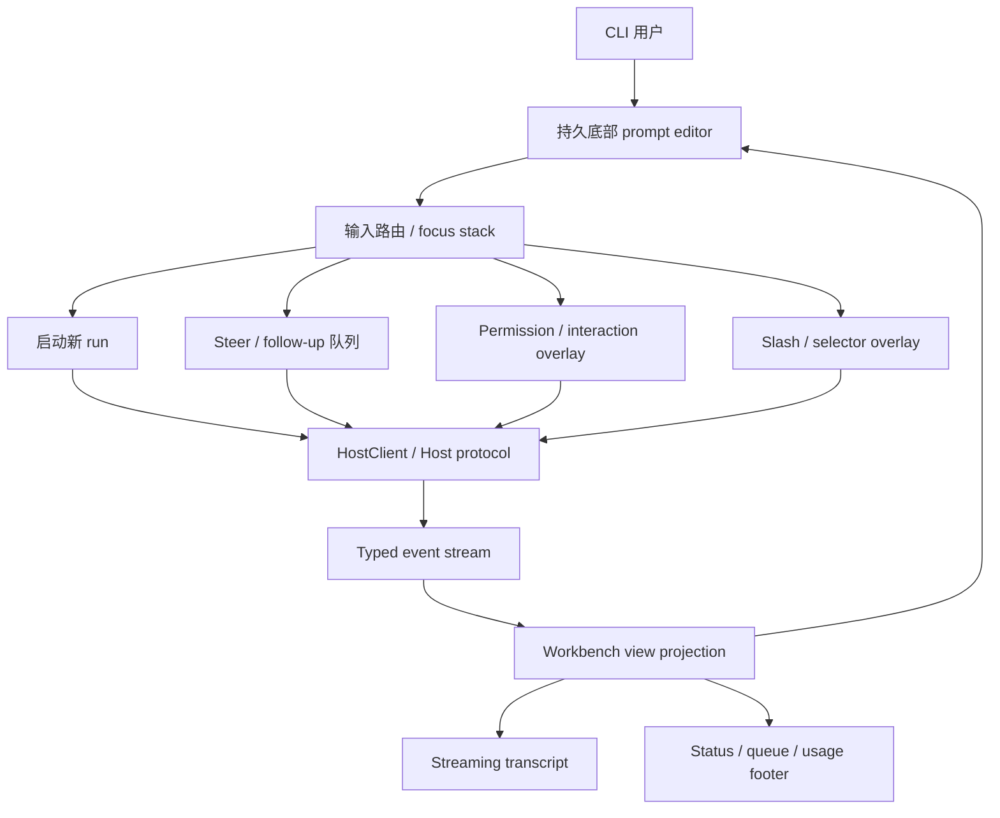

# M42 Ink TUI 工作台交互对齐需求

## 摘要

Guga 的裸 `guga` 入口必须成为 Pi / Claude Code / OpenCode / Gemini CLI 风格的真实 agent 控制台：底部编辑器始终可见、有光标和输入回显，assistant / tool / permission 事件实时进入 transcript，slash、selector、运行中输入队列、focus stack 和 Host protocol 投影共同构成一个可持续工作的终端工作台。

---

## 问题背景

当前交互已经暴露出最小可用性失败：CLI 框内没有光标，用户输入后区域会变成空白，模型的 streaming 返回没有实时显示。这个问题不是单个文本框样式缺陷，而是 agent console 的核心反馈回路断裂：用户无法确认自己正在编辑什么，也无法看到 agent 正在做什么。

既有 M37/M42 已经把方向定为 Pi、Claude Code、OpenCode、Gemini CLI、Blade Code 启发的产品化 CLI workbench。现在需要把 M42 从“启动一个 Ink TUI 壳”升级为“完整交互复刻的验收合同”，让后续计划和实现不再只修补启动路径，而是补齐 prompt editor、transcript、slash/typeahead、active-run routing、permission/interaction overlay、Host protocol 投影、错误恢复和测试矩阵。Gemini CLI 在这里作为开源 terminal-first agent 的产品态基线，重点参考其 core/cli/sdk/protocol 分层、tool scheduler、skills/MCP prompts、checkpointing、sandbox/security 与 telemetry 边界。

---

## 参与者

- A1. CLI 用户：在仓库中用 `guga` 发起、观察、引导、取消和恢复 agent 工作。
- A2. Guga workbench：终端 UI 层，负责输入编排、状态投影、焦点路由和可见反馈。
- A3. HostClient / Host protocol：提供 session、run、event stream、permission、interaction、abort、resume、selector 等结构化能力。
- A4. Agent runtime / provider / tools：产生 assistant delta、tool lifecycle、permission request、error、usage 和 terminal run state。

---

## 交互模型

---

## Pi / Claude Code / OpenCode / Gemini CLI 场景覆盖矩阵

| 场景 | 覆盖状态 | M42 处理方式 |
| --- | --- | --- |
| 裸命令进入交互工作台 | 已覆盖 | `guga` 默认进入 TTY workbench；`guga run` / `guga -p` 保持 headless。 |
| 欢迎首屏 / branded splash | 部分覆盖 | 启动后首屏展示 Guga welcome panel，使用图二吉祥物的像素化企鹅头像作为 logo，并展示 tips、what's new、model/context/cost/cwd。 |
| 底部持久输入框 | 已覆盖 | Editor 始终可见，承担 prompt、run input、permission/interaction response、selector query 等输入目标。 |
| 可见光标与输入回显 | 已覆盖 | 明确要求空 buffer 也有插入标记，输入、粘贴、提交和 stream 更新期间不得 blank editor。 |
| Assistant streaming 实时渲染 | 已覆盖 | Assistant delta 合并到 active assistant block，terminal events finalize，不从 assistant prose 猜状态。 |
| 模型 reasoning/status 过程可见化 | 已覆盖 | 如果 Host/Core 暴露 reasoning/status delta，必须作为独立 typed block 流式展示；不得伪造或泄露未暴露的 hidden chain-of-thought。 |
| Transcript typed events | 已覆盖 | User、assistant、tool、permission、interaction、error、retry/compact、queue、abort 都进入结构化 transcript/status。 |
| Tool 使用过程展示 | 已覆盖 | Tool started/progress/completed/failed/denied/aborted/timed out 必须可见，展示 input 摘要、progress、output preview 或 error。 |
| Token / context window / cost meter | 部分覆盖 | Status/footer 必须展示 token 用量、context window 占比、剩余窗口和费用；provider 不暴露时显示 unknown，不伪造估算。 |
| Slash command palette | 已覆盖 | `/` 立即打开 palette，支持过滤、导航、选择、关闭、selector、未知命令恢复。 |
| Tab 补全 slash 命令 | 已覆盖 | 在 slash palette 打开时，Tab 或等价补全把当前高亮命令补入 editor，并保留可继续编辑的尾随空格。 |
| `/model`、`/profile`、`/resume` selector | 已覆盖 | 作为必须可发现命令和 selector flow；模型、profile、session metadata 有展示要求。 |
| `/new`、`/fork`、`/tree` session 控制 | 已覆盖 | 作为必须可发现命令，并要求 resume/fork/tree 展示 lineage、branch、last status 等信息。 |
| `/tools`、`/mcp`、`/skills`、`/permissions` 能力查看 | 已覆盖 | 要求 capability views 反映当前 host capabilities，不使用静态文档伪装。 |
| 运行中继续输入 | 已覆盖 | Running-state input 区分 steer、follow-up、deferred follow-up、permission/interaction response、slash command 和 abort。 |
| Queue strip / pending input 管理 | 已覆盖 | Queue UI 展示 mode、预览、顺序、active/deferred 状态和取消入口。 |
| Abort 语义 | 已覆盖 | Abort 通过 Host protocol 取消 active run，并清理 run-scoped 状态，不破坏 durable session history。 |
| Permission overlay | 已覆盖 | Permission request 高优先级占焦点，展示工具、动作、风险/来源，支持 allow once / deny 等响应。 |
| Generic interaction prompt | 已覆盖 | Select、confirm、text input、editor-style input、notify/status 通过统一 host-facing response path。 |
| Focus stack / Escape / Enter 路由 | 已覆盖 | 显式 focus stack；Enter 确认当前 owner；Escape 先关 overlay，最后才 abort active run。 |
| Ctrl-C 与 Escape 区分 | 已覆盖 | 要求 Ctrl-C 行为明确，不能同时误触 abort 和退出进程。 |
| Prompt 多行编辑、历史、粘贴、Unicode | 已覆盖 | 覆盖 multiline、soft wrap、cursor movement、history、large paste、CJK width、ANSI/OSC sanitization。 |
| IME 基础可用性 | 部分覆盖 | M42 要求 smoke 级支持；完整 IME 候选窗口定位和多终端兼容矩阵留到 planning 验证。 |
| Context mention / `@` 文件补全 | 部分覆盖 | `@` 作为入口预留并要求共享 overlay 基座；第一版完整候选源与 UI 细节留给 planning 切片。 |
| Tool output / diff / shell inspector | 部分覆盖 | 要求视觉区分、短输出 inline、长输出折叠/摘要；具体 inspector 形态留到 planning。 |
| Session tree 可视化 | 部分覆盖 | `/tree` 和 lineage 信息纳入范围；完整树状导航 UI、搜索、命名和导入导出不作为 M42 完整交付前提。 |
| Crash 后恢复最近 session | 部分覆盖 | 要求 durable state 存在时提供恢复入口；哪些状态可安全恢复留到 planning 验证。 |
| 非 TTY / headless 降级 | 已覆盖 | 非 TTY 友好失败；headless command 不导入 Ink/React。 |
| Real provider streaming smoke | 已覆盖 | 至少一个已配置模型必须能通过 workbench 流式显示响应且不 blank editor。 |
| OpenCode-style Host protocol 作为 UI 事实源 | 已覆盖 | Workbench 必须消费 HostClient / Host protocol，不得直接调用 runtime 私有 API 或解析 assistant prose。 |
| OpenCode-style SSE/event stream 投影 | 已覆盖 | M42 要求 typed event stream、assistant deltas、reasoning/status deltas、tool lifecycle、permission、error、terminal run state 进入 transcript/status。 |
| Session/run/resource 语义 | 已覆盖 | Session、run、resume、fork、tree、abort、permission、interaction 都通过 Host protocol 表达并进入 UI 控制面。 |
| TUI 与 headless 共享同一 runtime/host 语义 | 已覆盖 | `guga`、`guga run`、`guga -p` 分别走交互和 headless 路径，但状态和事件语义不能分叉。 |
| Typed SDK / HostClient client 边界 | 已覆盖 | M42 明确 workbench 是 HostClient consumer，后续 Web/Desktop/IDE 可复用同一 host surface。 |
| OpenCode-style `/session/*` REST API 完整面 | 部分覆盖 | M42 只要求 TUI 消费 session/run/permission 能力；REST 端点完整性属于 M7/M11 host protocol planning。 |
| SSE 断线 replay / sequence continuity | 部分覆盖 | M42 要求 stream error、seq discontinuity、replay-unavailable 和 `/reload` 恢复入口；具体 replay 协议留到 planning。 |
| OpenCode-style `@` context/file mention | 部分覆盖 | `@` 入口和 overlay 基座纳入 M42；完整候选源、文件索引和 artifact mention 交互留到 planning。 |
| OpenCode Desktop/Web 共享本地 server | 后续阶段 | M42 只实现 Ink TUI；Desktop/Web 后续消费 shared Host protocol，不在本轮做产品 UI。 |
| OpenCode mDNS local server discovery | 后续阶段 | 本轮不要求 Desktop 自动发现本地 server；可作为 Web/Desktop 阶段能力。 |
| OpenCode ACP/Zed/IDE 双向协议 | 后续阶段 | M42 保留 Host protocol 边界；ACP/IDE adapter 后续单独规划，不阻塞 TUI parity。 |
| OpenCode LSP Client / codesearch tool UI | 后续阶段 | LSP/codesearch 是 agent capability 和 IDE 级能力，不作为本轮 TUI 交互复刻前提。 |
| OpenCode WebSocket PTY | 明确不做 | Agent 输出优先走 event/SSE-style stream；双向 PTY 不纳入 M42。 |
| Gemini CLI-style terminal-first agent console | 已覆盖 | M42 把裸 `guga` 定义为真实 TTY workbench，并保留 headless/non-interactive 路径。 |
| Gemini CLI-style core / cli / sdk / protocol 分层 | 部分覆盖 | M42 要求 Workbench 只消费 HostClient/typed events；完整 SDK、A2A、ACP 外部接口留到后续协议阶段。 |
| Gemini CLI-style turn lifecycle / streaming / function-call loop | 已覆盖 | M42 要求 user prompt、assistant delta、tool lifecycle、terminal run state 与 failure 都通过 typed stream 投影。 |
| Gemini CLI-style Scheduler / ToolExecutor / ToolRegistry 可见性 | 已覆盖 | Tool started/progress/completed/failed/denied/aborted/timed out 均进入 transcript/status，UI 不解析 assistant prose。 |
| Gemini CLI-style slash commands / skills / MCP prompts 发现 | 部分覆盖 | `/tools`、`/mcp`、`/skills` 与 command source metadata 纳入 M42；完整 loader、prompt registry 和 extension registry 后续实现。 |
| Gemini CLI-style context pipeline / compression / memory injection | 部分覆盖 | `/compact`、retry/compact event、context mention 入口纳入 M42；具体压缩、蒸馏、memory 注入算法属于 runtime planning。 |
| Gemini/OpenCode-style 模型窗口与价格 metadata | 部分覆盖 | 借鉴模型 metadata 中的 context limit、max output、input/output/cache price；M42 只要求 UI 展示 host 暴露的数据，完整模型目录同步后续实现。 |
| Gemini CLI-style checkpointing / crash recovery | 部分覆盖 | M42 要求 durable state 下有恢复入口和可见恢复动作；checkpoint 数据模型和差异恢复策略留到 planning。 |
| Gemini CLI-style sandbox / security / trusted folders | 部分覆盖 | Permission overlay 与 fail-closed 响应纳入 M42；sandbox 执行器、trusted folder policy 和安全配置 UI 不在本轮完整交付。 |
| Gemini CLI-style telemetry / monitoring | 明确不做 | M42 只要求 usage/status/failure 可见；不把产品遥测、监控管线或远端分析作为 TUI parity 前提。 |
| Gemini CLI-style ACP / A2A / SDK clients | 后续阶段 | M42 的 Host protocol 边界为这些接口预留语义，但本轮只定义 Ink TUI。 |
| Gemini CLI-style extension registry / 大型配置面 | 明确不做 | 本轮仅要求 builtin、skills、MCP、plugin/custom 命令来源可区分，不复制完整扩展市场或企业配置 schema。 |
| 隐藏链式思维逐字展示 | 明确不做 | 只展示模型/provider/runtime 明确暴露的 reasoning/status 事件；不把内部 hidden reasoning 当作 UI 内容。 |
| Claude Code teams/tasks/background-agent 平台面 | 明确不做 | 本里程碑不复制完整平台控制面，只保留 agent console 主干交互。 |
| 完整附件/图片/拖入体验 | 后续阶段 | M42 聚焦文本、命令、事件、权限和 session 控制；附件能力后续单独定义。 |
| Vim mode / 高级 history search | 后续阶段 | 基础编辑和历史纳入 M42；高级编辑模式不阻塞本轮 parity。 |
| 多 agent/subagent 专用 UI | 后续阶段 | 当前只要求 transcript/tool/queue/permission 能承载相关事件，专用多 agent 面板另行规划。 |
| IDE / ACP / LSP / Web / Desktop / IM 客户端 | 明确不做 | M42 只定义 Ink TUI；其他客户端后续消费 shared Host protocol。 |
| 完整 renderer 迁移或 OpenTUI 重评 | 明确不做 | 本文档保留 Ink-first 决策；只有 Ink 无法满足 fidelity 时再单独重评。 |
| Pi-compatible JSONL / Claude Code transcript 格式复刻 | 明确不做 | Guga 保持自己的 Host protocol 和 session/event 语义，必要时做 adapter。 |

---

## 关键流程

- F1. 空闲状态提交 prompt
  - **触发：** A1 在空闲 workbench 中输入普通 prompt 并提交。
  - **参与者：** A1, A2, A3, A4
  - **步骤：** 编辑器显示光标与输入回显；提交后 prompt 作为 user block 进入 transcript；A2 通过 A3 启动 run；A4 的 assistant delta、tool event、usage 和 terminal event 实时投影；编辑器保持可见并可继续聚焦。
  - **结果：** 用户看到自己的输入、run 已开始、模型正在流式输出，且不会因为 transcript 更新失去编辑能力。
  - **覆盖：** R1, R4, R5, R8, R9, R10, R13, R14

- F2. Slash 命令发现与执行
  - **触发：** A1 在编辑器中输入 `/` 或 slash 前缀。
  - **参与者：** A1, A2, A3
  - **步骤：** Slash palette 立即打开；候选按输入过滤；方向键移动高亮；Enter 执行命令或进入 selector；Escape 关闭 overlay 并恢复草稿；未知命令给出可恢复反馈。
  - **结果：** 用户不需要记忆命令，也不会因为输入 `/` 误提交普通 prompt。
  - **覆盖：** R25, R26, R27, R28, R29, R30, R31, R35, R36, R37

- F3. 运行中 steer 与 follow-up
  - **触发：** A1 在 agent 正在 streaming、running tool 或等待 tool result 时继续输入。
  - **参与者：** A1, A2, A3, A4
  - **步骤：** 编辑器仍可用；输入目标显示为 steer 或 follow-up；提交进入可见 queue；runtime 支持 mid-run steering 时投递给 active run，不支持时明确标记 deferred；用户可取消 queue item 或 abort active run。
  - **结果：** 运行中输入不丢失、不静默变更语义，用户能持续引导长任务。
  - **覆盖：** R41, R42, R43, R44, R45

- F4. 权限或通用交互请求
  - **触发：** A4 触发工具权限或通用 interaction 请求。
  - **参与者：** A1, A2, A3, A4
  - **步骤：** A2 将 request 提升为高优先级 overlay；焦点路由到 permission/interaction；Enter 确认当前响应；Escape 先处理 overlay，不误 abort run；响应通过 A3 回传；transcript/status 记录结果。
  - **结果：** 安全决策不会被普通 prompt 抢焦点，用户能理解请求来源和后果。
  - **覆盖：** R35, R36, R37, R40, R46, R47, R48, R49, R50

- F5. 恢复与非 TTY 降级
  - **触发：** event stream 断开、provider/tool 出错、workbench crash、非 TTY 环境启动或用户退出。
  - **参与者：** A1, A2, A3
  - **步骤：** A2 显示结构化错误和可选动作；可 replay 时 `/reload` 或等价入口恢复；退出前处理 pending input/run/permission；非 TTY 给出 headless 指引。
  - **结果：** 用户知道失败发生在哪一层、下一步能做什么，脚本化路径不被 TUI 依赖污染。
  - **覆盖：** R2, R3, R55, R56, R57, R58, R61

---

## 需求

**入口与运行时边界**

- R1. 裸 `guga` 在交互式 TTY 中必须默认进入 workbench，而不是旧的行式 prompt。
- R2. `guga run`、`guga -p` 等脚本化路径必须保持 headless，并且启动时不得加载交互式 renderer。
- R3. 非 TTY 交互式启动必须友好失败，提示使用 headless 命令，而不是渲染损坏的 UI。
- R4. Workbench 必须消费 HostClient / Host protocol 的状态与事件，不得调用 runtime 私有 API，也不得通过解析 assistant 文本推断状态。
- R5. Workbench 必须在启动区或状态区可见展示 session/run identity、model/profile metadata、cwd、branch、config source 和 active state。
- R5A. Workbench 必须在交互式 TTY 启动时展示欢迎首屏：左侧为欢迎语、Guga 像素 logo、当前模型/context/cost/cwd 摘要；右侧为 tips、what's new、常用入口或 release notes。Logo 来源为图二的“咕咕嘎嘎”吉祥物，但终端中只展示像素化企鹅头像/头部轮廓，不展示整张角色设定图。
- R5B. 欢迎首屏必须是终端安全的：优先使用 ANSI/Unicode block 像素头像或预生成文本资产，而不是把插画 PNG 直接渲染进终端；默认欢迎页可以使用更大的 24-40 列 logo 来建立品牌识别，窄终端再降级为 12-20 列紧凑 logo 或短文本 logo，不得遮挡 prompt editor 或阻塞用户输入。
- R5C. 像素 logo 必须针对黑底终端重新配色：避免大面积深灰/黑色轮廓消失在背景里，使用高对比 cyan/blue outline、yellow beak、white/light-gray face/eyes 和少量 coral accent；视觉复杂度要低到能用 block glyph 矩阵表达。

**终端布局与视觉稳定性**

- R6. 终端壳层必须拥有稳定区域：transcript、status/footer、overlay、queue/notification surface，以及持久底部 prompt editor。
- R7. 终端 resize 后不得隐藏 editor、破坏边框、造成 overlay 重叠，或丢失当前草稿。
- R8. Prompt editor 聚焦时必须始终显示可见光标或等价插入标记，包括 buffer 为空时。
- R9. 用户输入必须立即回显，在正常输入、粘贴、提交或 stream 更新期间不得让 prompt 区域变成空白。
- R10. Assistant streaming 输出必须增量渲染到 transcript，同时保持 editor 可见并保留草稿。
- R11. Transcript 默认应跟随最新 run，但不得在用户手动滚动或编辑时强行抢走位置或焦点。
- R12. Status/footer 必须持续展示 run status、当前 model/profile、pending permission/interaction、queue count、disconnected state，以及可用时的 usage 提示。
- R12A. Status/footer 必须提供紧凑的 token/context/cost meter：至少展示当前 run 或 session 的 input/output/total token、context window 已用/上限/百分比、剩余窗口、费用或费用 unknown 状态，并在接近 auto-compact / truncation 阈值时给出可见提示。短格式可参考 `154k / 40.2k / 470k ($1.190, auto)`，但字段语义必须可解释。

**Transcript 与事件投影**

- R13. Transcript 必须渲染 typed blocks：user、assistant、system/status、tool lifecycle、permission、interaction、error、retry/compact、queue 和 abort events。
- R14. Assistant delta events 必须合并到当前 assistant block，terminal events 必须 finalize 或标记该 block，不能重复或丢失文本。
- R15. Tool execution 必须展示生命周期状态：pending、running、completed、failed、denied、aborted、timed out。
- R16. Tool output 必须可扫描：短输出可 inline，长输出必须折叠或摘要，同时保留后续查看完整结果的入口。
- R17. Shell、diff、file edit、test、lint、git、MCP 和 skill events 必须和 assistant prose 在视觉上可区分。
- R18. Provider/network/permission/tool/runtime failures 必须成为结构化 transcript/status events，不能只表现为不可见 console error 或 assistant prose。
- R18A. 当 Host/Core 暴露 model reasoning、status、planning 或类似 delta 时，Workbench 必须把它作为独立 reasoning/status block 展示，表达“模型正在分析、计划或等待工具”的过程；不得伪造、推测或展示未暴露的 hidden chain-of-thought。
- R18B. Tool lifecycle block 必须在可用时展示 tool name、input 摘要、progress message/percentage、output preview、error message 和 terminal status，使用户能看到工具从开始到结束的过程。
- R18C. Usage / context block 必须来自 typed usage、model metadata 或 operational status：展示 input、output、cached input、reasoning、total token，context limit、max output reserve、context used percent、auto-compact threshold、cost amount/currency/source；缺失字段必须显式显示 unknown 或 unavailable，不能按 assistant 文本或固定价格猜测。

**Prompt editor**

- R19. Editor 必须支持多行输入、软换行、明确的 submit vs newline 行为，并为 modifier 支持有限的终端提供可发现 fallback。
- R20. Editor 必须支持光标移动、backspace/delete、行首/行尾、删除词或等价高效编辑、历史导航和空提交保护。
- R21. 粘贴必须安全保留内容，包括大段粘贴、多行文本、非 ASCII 文本、CJK 宽字符，以及 ANSI/OSC 清理。
- R22. Editor 必须具备 IME smoke 级支持，保证组合输入不破坏 buffer，overlay feedback 不出现在错误区域。
- R23. 打开/关闭 slash palette、selector、permission prompt、interaction prompt、错误、abort 尝试和 resize 时，草稿必须保留。
- R24. Editor 必须暴露当前输入目标：普通 prompt、run steer、follow-up、permission response、interaction response、selector query 或 slash query。

**Slash 命令与 selector**

- R25. 在 prompt context 中输入 `/` 必须先打开 slash palette，Enter 不得把 slash 前缀文本误提交成普通 prompt。
- R26. Slash palette 必须支持 fuzzy/filtering、键盘导航、Enter 选择、Escape 关闭，以及合适场景下的 Tab 或等价补全。
- R27. 命令行项必须展示足够安全选择的信息：trigger/name、title、short description、source、keybind，以及是否需要参数或确认。
- R28. Builtin、profile、skill、MCP、plugin/custom 和未来 host capabilities 提供的命令必须共享同一个发现界面，并具备稳定冲突处理。
- R29. 需要进一步选择的命令必须打开 selector flow，而不是执行不完整或有破坏性的操作。
- R30. `/model`、`/profile`、`/resume`、`/new`、`/fork`、`/tree`、`/status`、`/clear`、`/help`、`/tools`、`/mcp`、`/skills`、`/permissions`、`/compact`、`/abort`、`/exit`、`/quit` 必须在 palette 中可发现，即使部分实现仍受 host capability 可用性限制。
- R31. 未知或不可用命令必须可见且可恢复地失败，不得丢失草稿。

**Context mention 与 autocomplete 基座**

- R32. `@` 必须预留为 context mention 入口，并应复用 slash commands 的 overlay/fuzzy-list 交互基座。
- R33. 第一版完整 mention surface 应优先支持 workspace 文件/目录、最近文件、active session artifacts、skills/resources，以及未来 MCP resources，并区分候选来源。
- R34. 选中的 mention 必须以可读、可编辑的引用插入 editor，不能变成隐藏的 renderer-only state。

**焦点模型与键盘语义**

- R35. Workbench 必须维护显式 focus stack，覆盖 editor、slash palette、selector、permission overlay、interaction overlay、help/status views 和 transcript scroll。
- R36. Enter 必须确认当前 focus owner：提交 editor text、选择高亮 command/option，或确认 permission/interaction response。
- R37. Escape 必须先关闭最上层 overlay，再在适用时取消当前 prompt target，只有在没有更高优先级 focus target 时才能 abort active run。
- R38. Ctrl-C 必须有区别于 Escape 的明确行为，不得同时误触 abort run 和退出进程。
- R39. Arrow keys 必须按 focus owner 路由到编辑、历史、selector 移动、slash 移动或 transcript scroll。
- R40. Focus restoration 必须稳定：任何 overlay 关闭后都回到先前 editor/selector 状态，并保留草稿。

**运行中输入与队列**

- R41. Active run 期间 editor 必须保持可用，并通过明确 active-run routing 提交，而不是被禁用或静默当成新 run。
- R42. Running-state input 必须区分 steer、follow-up、deferred follow-up、permission response、interaction response、slash command 和 abort。
- R43. Queue UI 必须展示 pending items 的 mode、短预览、顺序、active/deferred 状态和取消入口。
- R44. 如果 runtime 暂不支持 mid-run steering，workbench 必须把该输入标记为 deferred，而不是假装已立即生效。
- R45. Abort 必须通过 Host protocol 取消 active run，并清理 run-scoped steer/follow-up/permission/interaction state，同时不得破坏 durable session history。

**Permission 与 interaction overlay**

- R46. Permission request 必须渲染 tool name、action summary、可用时的 risk/source context，以及 allow once、deny 和未来 session-scoped allow 等选择。
- R47. 当无法交互响应或 stream state disconnected 时，permission response 必须 fail-closed。
- R48. Generic interaction 必须至少通过同一 host-facing response path 支持 select、confirm、text input、editor-style input、notify/status 和未来 custom prompts。
- R49. 多个 pending permission/interaction requests 必须有排序或堆叠策略，不能互相覆盖。
- R50. Permission/interaction 的完成、拒绝、取消或超时必须反映到 transcript/status。

**模型、profile、session 与能力控制**

- R51. Model selector 必须展示 alias、provider、model id、availability、default status 和可用时的 config source。
- R52. Profile selector 必须解释可用 profile，并清楚标记变更是立即生效、next turn、新 session 生效，还是需要 restart。
- R53. Resume/fork/tree flows 必须展示可用时的 session title/summary、cwd、branch/lineage、model/profile、last status 和 updated time。
- R54. Tools、MCP、skills、permissions 的 capability views 必须反映当前 host capabilities，而不是静态文档。
- R54A. Slash command 与 capability views 必须区分 builtin、profile、skill、MCP prompt/tool、plugin/custom 和 host-provided capability 的来源、可用性与冲突状态，参考 Gemini CLI 的 command/service loader 边界，但不得把未实现能力伪装成可执行。
- R54B. 当 runtime 暴露 checkpoint、context compression、memory/context injection、sandbox 或 trusted-folder 状态时，Workbench 必须以 typed status/capability row 展示，并给出可执行的下一步；具体策略实现不属于 M42 UI 合同。
- R54C. `/status` 或等价详情视图必须能展开 token/context/cost meter，显示模型窗口、当前上下文预算、缓存命中 token、reasoning token、压缩/截断策略、费用估算依据和 provider usage 支持状态；当模型 metadata 暴露 input/output/cache 单价时，应标明价格来源与是否为估算。

**错误处理与恢复**

- R55. Stream errors、sequence discontinuity、replay-unavailable state、provider failure、auth/config failure、permission denial、tool failure、timeout、abort 和 cancellation 必须有互相区分的可见状态。
- R56. 可恢复状态必须暴露下一步动作，例如 reload/replay、retry、switch model、fix config、resume、fork、abort 或 exit。
- R57. 当 durable state 存在时，crash/restart 应提供恢复最近 session 的入口。
- R58. 退出行为必须保护 pending drafts、active runs、queued input 和 pending permission/interaction，不能静默丢失。

**测试与验收**

- R59. 单元测试必须覆盖 prompt buffer 编辑、光标移动、多行 submit/newline、历史、粘贴、Unicode width、slash open/filter/select、selector navigation、focus stack 和 active-run routing。
- R60. Projection 测试必须覆盖 message delta merge、tool lifecycle、permission/interaction lifecycle、queue events、stream errors、replay/reload、abort 和 terminal run states。
- R61. Import-boundary 测试必须证明 headless commands 不会静态导入 Ink/React 或 renderer-only modules。
- R62. Interactive smoke tests 必须覆盖 `guga --mock` startup、可见光标/输入回显、slash palette、model/profile/resume selector paths、streaming mock run、active-run input、permission response、abort 和 clean exit。
- R63. Real-provider smoke coverage 必须验证至少一个已配置模型能通过 workbench 流式显示响应，且不会 blank editor。
- R64. 终端可用性测试必须覆盖小尺寸终端、resize、无颜色渲染，以及不完整支持 modifier keys 的终端。

---

## 验收示例

- AE1. **覆盖 R1, R6, R8, R9, R10。** 给定 TTY 和 mock provider，当用户运行 `guga --mock`、输入 `hello` 并在提交前停顿时，prompt editor 显示可见插入点和文本 `hello`；当用户提交后，editor 不会永久空白，assistant deltas 会增量出现在 transcript。
- AE1A. **覆盖 R5A, R5B, R5C。** 给定 TTY 和足够宽的黑底终端，当用户运行 `guga --mock` 时，首屏展示 Guga welcome panel、24-40 列高对比 block-glyph 企鹅头像、模型/context/cost/cwd 摘要和 tips；给定窄终端或无颜色环境时，欢迎页降级为紧凑 logo 或文本，不影响底部输入框可见与可输入。
- AE2. **覆盖 R13, R14, R15, R18, R18A, R18B。** 给定一个 run 依次发出 reasoning delta、assistant delta、tool started、tool progress、tool completed 和 run completed events，当 workbench 收到这些 events 时，transcript 展示独立 reasoning block、连贯 assistant block、结构化 tool lifecycle rows 和最终 run status。
- AE2A. **覆盖 R12A, R18C, R54C。** 给定 Host 暴露模型 context limit、usage recorded、cost 和 auto-compact threshold，当 workbench 收到这些数据时，footer 显示紧凑 token/context/cost meter，`/status` 展开 input/output/cached/reasoning、已用百分比、剩余窗口、费用来源；当 cost 或 context limit 缺失时显示 unknown，而不是猜测。
- AE3. **覆盖 R25, R26, R29, R31。** 给定 editor 聚焦，当用户输入 `/mod` 时，slash palette 打开并过滤到 `/model`；按 Enter 打开 model selector；按 Escape 关闭 selector 并恢复草稿，不提交未知 prompt。
- AE4. **覆盖 R35, R36, R37, R40, R46。** 给定 permission request pending 且 slash palette 打开，当用户输入 `allow` 并按 Enter 时，permission response 被发送；该状态下 Escape 不会 abort active run。
- AE5. **覆盖 R41, R42, R43, R44, R45。** 给定 assistant response 正在 streaming，当用户提交 follow-up 时，如果 mid-run steering 不可用，queue 显示 pending/deferred item；当用户 abort 时，active run input 和 pending permission/interaction state 被清理，但 session history 不被删除。
- AE6. **覆盖 R2, R3, R61。** 给定非 TTY 进程或 `guga run`，当命令启动时，不导入 Ink workbench，并返回 headless output 或友好指引。
- AE7. **覆盖 R55, R56。** 给定 event stream 在 seq N 后断开，当 replay 可用时，workbench 提供 reload/replay；当 replay 不可用时，input 被锁定并显示原因，用户仍可 clean exit。
- AE8. **覆盖 R28, R30, R54, R54A, R54B。** 给定 Host 暴露 builtin command、skill command、MCP prompt、tool capability、checkpoint status 和 sandbox/trusted-folder status，当用户打开 `/help`、`/skills`、`/mcp` 或 `/status` 时，workbench 必须展示来源、可用性、冲突/禁用原因和可执行下一步，且不会执行 unsupported capability。

---

## 成功标准

- 用户可以在真实仓库中运行 `guga`，先看到有品牌识别的 Guga welcome panel，再把它当作 agent console 使用，而不是脆弱的文本 prompt。
- 已报告的失败被消除：editor 有可见光标，输入文本保持可见，提交 prompt 后 UI 不空白，模型 streaming 在 transcript 中可见。
- Pi/Claude Code/OpenCode/Gemini CLI parity 体现在行为层：persistent editor、live transcript、slash discovery、selectors、running-state input、permission overlays、abort/recovery、durable session awareness、token/context/cost meter，以及 terminal-first agent 的 capability/status 可见性。
- 下游 planning 可以把这份需求拆成实现切片，不需要重新发明产品行为、焦点规则或最小验收测试。

---

## 范围边界

- 本里程碑不复制完整 Claude Code teams/tasks/background-agent platform surface。
- M42 不要求实现 Web/Desktop workbench；这些客户端后续继续消费 shared host protocol。
- 本需求更新不迁移出当前 Ink-first Node MVP；如果 Ink 后续无法满足终端 fidelity，再单独重评 renderer。
- Provider OAuth/login 不作为 workbench interaction parity 的 blocker；login surface 可作为现有 host capability 支持的命令/selector 继续存在。
- 不在本里程碑实现完整 ACP/LSP/IM clients。
- 不在本里程碑实现 Gemini CLI 等参考项目的完整 SDK、A2A server、extension registry、遥测监控管线、sandbox 执行器或 trusted-folder policy；M42 只要求 TUI 对这些 host/runtime 暴露状态具备可见降级。
- 不把 Pi-compatible JSONL 或 Claude Code transcript format 作为内部 UI protocol；Guga 保持自己的 Host protocol，并在需要时对外适配。

---

## 关键决策

- MVP workbench 继续采用 Ink-first：这符合当前 Node/pnpm CLI runtime，并保护 headless commands 的 dynamic import boundary。
- Welcome logo 使用抽象化 block-glyph 吉祥物头像，而不是直接加载原始 PNG 或高细节像素插画：终端首屏应稳定、轻量、可降级；原始图二只作为视觉源，落地资产应是 ANSI/Unicode block 文本或可测试的像素矩阵，并以黑底终端高对比配色为准。
- 将 `PromptEditor` 视为输入编排器，而不是 textarea：它拥有 target state、draft retention、focus-aware submit behavior、slash/mention entry points 和 active-run routing。
- 将 transcript 和 status/footer 视为 typed event projection：assistant text、tool state、permissions、errors、queue、usage、context budget 和 cost 来自 Host events、model metadata 或 operational status，而不是解析 assistant prose。
- 将 running-state input 作为一等能力：用户可以在长任务期间持续输入，UI 必须揭示输入是 steer、follow-up、deferred，还是被 permission 阻塞。
- 参考项目对齐停留在 interaction contract 层：吸收 Pi/Claude Code 中提升用户控制感的模式，吸收 OpenCode 的 typed host/event surface，吸收 Gemini CLI 的 terminal-first 产品态分层、tool scheduler 和 capability discovery 边界，但不继承其完整 renderer stack、SDK/server 平台面或无关产品 surface。

---

## 依赖与假设

- Host protocol 已暴露或可以暴露足够 typed events，用于 assistant deltas、tool lifecycle、permissions、interactions、stream state、usage、queue、session、model/profile 和 capabilities。
- 当前 Ink/React runtime 对 Guga 开发者目标终端上的 cursor rendering、raw input、resize 和 keyboard routing 仍然可行。
- 某些 host capabilities 初期可能不可用；workbench 必须可见降级，而不是隐藏命令入口或假装 unsupported actions 已成功。
- 既有 M37 productized CLI workbench requirements 仍是更大的产品框架；本 M42 文档定义具体 Ink TUI parity 切片。

---

## 待解决问题

### 留到 Planning 阶段

- [影响 R8, R19, R22, R64][技术] 最小兼容矩阵需要覆盖哪些终端，以验证 cursor、IME、宽字符和 modifier-key 行为？
- [影响 R41, R42, R44][技术] 当前 runtime 已支持哪些 active-run steering 语义？哪些地方 UI 必须明确展示 deferred follow-up？
- [影响 R16, R17][技术] 长 tool output、file diff 和 shell output 第一版应采用哪种 renderer pattern：collapsible blocks、preview/tail rows，还是独立 inspector views？
- [影响 R57, R58][技术] 当前哪些 durable session states 可以安全 crash 后恢复？哪些需要额外 host/session-store 工作？

---

## 研究依据

- 事实：`docs/research/context-packs/ui-protocol.md` 将 Claude Code 定位为 in-process terminal agent console，并建议渐进采用 TUI/CLI host 语义。
- 事实：`docs/research/source-analysis/claude-code-analysis/analysis/components/02-core-interaction-components.md` 描述 Claude Code `PromptInput` 是输入编排器，而不是简单文本输入框。
- 事实：`docs/brainstorms/2026-05-28-m37-productized-cli-workbench-requirements.md` 已要求 persistent bottom editor、slash discovery、running-state input、permission handling 和真实 streaming/tool visibility。
- 事实：`docs/research/repomix/pi-token-tree.txt` 以及既有 M37 notes 将 Pi 定位为 editor、autocomplete、queue、steer/follow-up、abort 和 session tree 语义参考。
- 事实：`docs/research/context-packs/gemini-cli-reference.md` 将 Gemini CLI 定位为成熟 TypeScript terminal-first agent 参考，确认其 core/cli/sdk/a2a-server 边界、Turn/GeminiClient、Scheduler/ToolExecutor/ToolRegistry、context/compression pipeline、skills/MCP prompt loader、ACP/A2A/SDK 等关键抽象。
- 事实：`docs/research/source-analysis/claude-code-analysis/analysis/08-competitive-comparison.md` 基于 2026-03-31 官方 README 总结 Gemini CLI 公开强调 built-in tools、MCP、checkpointing、sandboxing & security、trusted folders、telemetry & monitoring 和 terminal-first。
- 事实：`docs/research/context-packs/context-compression.md` 将上下文预算、压缩触发、工具结果截断和 session resume 归为长任务 agent 的核心工程问题，并记录 Claude Code / Hermes / DeerFlow 等项目用窗口阈值或 token 阈值触发压缩。
- 事实：`docs/research/source-analysis/learn-opencode/docs/internals/provider.md` 记录 OpenCode 模型 metadata 包含 context window、max output tokens、input/output/cache pricing 和 capabilities，可作为 Guga token/context/cost meter 的数据形态参考。
- 推断：截图中的失败属于 M37/M42 parity 的同一产品合同，因此修复应作为 workbench interaction pass 规划，而不是一次性的 CSS/rendering patch。
