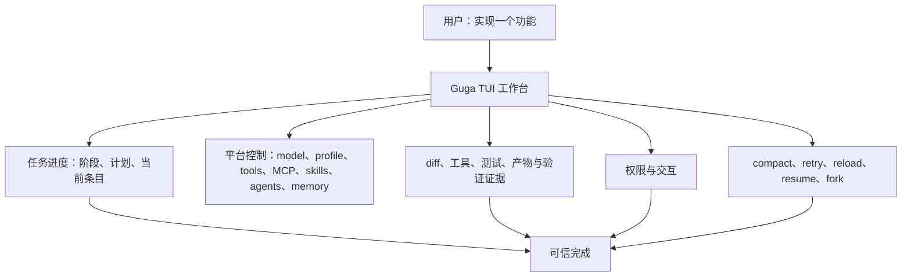

# Claude Code 平台级 TUI 对齐需求

## 摘要

Guga TUI 应覆盖 Claude Code 的平台级工作台体验：用户可以要求 Guga 实现某个功能，观察完整 coding workflow 的推进，只在真正需要时批准关键决策，并在同一个终端控制平面中管理相关的平台能力。

---

## 问题框架

Guga 已经具备严肃 coding agent 所需的许多运行时要素：host protocol、事件流、任务状态、工具治理、会话存储、compaction、provider 配置、memory 能力、MCP、skills 和 delegation。现在用户侧的压力集中在 TUI：如果这些能力散落在命令、日志和不可见的运行时状态里，即使底座已经存在，产品体感仍然会弱于 Claude Code。

具体的信任时刻是一类 coding task：用户说“实现这个功能”，随后预期 agent 能规划、改文件、跑测试、修失败，并带着证据收尾；用户主要负责看状态和批准敏感动作。如果终端不能清晰展示进度、决策、证据、权限、工具状态和恢复路径，用户就必须盯着整个过程，而不是监督它。

---

## 参与者

- A1. CLI 用户：要求 Guga 执行 coding 工作，并在终端中监督进度、审批、恢复和平台状态。
- A2. Guga TUI 工作台：渲染 transcript、状态、命令面板、selector、overlay、任务进度、证据和恢复控制。
- A3. Host protocol / HostClient：提供类型化的 session、run、event、capability、permission、interaction、task、model 和 operation 表面。
- A4. Agent runtime 与一方插件：执行 provider 调用、工具、compaction、memory retrieval、MCP/skills、delegation 和任务 workflow。
- A5. 未来 client adapter：desktop、IDE、ACP/LSP 或 stdio client，应复用同一套平台语义，而不是发明另一套控制模型。

---

## 关键流程

- F1. 功能实现监督
  - **触发：** A1 在 TUI 中要求 Guga 实现一个功能。
  - **参与者：** A1, A2, A3, A4
  - **步骤：** 工作台启动 coding run，展示当前阶段，显示任务计划，在工具运行时更新条目状态，只在需要时请求权限，展示变更文件和测试证据，并在 run 被标记完成前让完成标准可见。
  - **结果：** A1 能判断 Guga 正在做什么、为什么做、改了什么，以及任务是否真的完成。
  - **覆盖需求：** R1, R2, R3, R4, R5, R6

- F2. 平台能力发现与控制
  - **触发：** A1 需要理解或调整当前 agent 能做什么。
  - **参与者：** A1, A2, A3, A4
  - **步骤：** A1 打开 slash command 或 selector，用于 model、profile、tools、MCP、skills、agents、memory、permissions、sessions 或 status；工作台展示可用、不可用和有风险的能力，并说明来源和原因；动作通过 host 拥有的 command 或 interaction 路由。
  - **结果：** 终端成为主要的平台控制平面，而不只是 chat transcript。
  - **覆盖需求：** R7, R8, R9, R10, R11, R12

- F3. 不打断心流的审批
  - **触发：** A4 在 coding task 中请求权限或通用用户交互。
  - **参与者：** A1, A2, A3, A4
  - **步骤：** TUI 将请求提升为聚焦 overlay，保留用户正在输入的草稿，展示动作、风险、来源和作用域，接受用户决策，并在不隐藏整体任务状态的前提下把结果记录到 transcript/status。
  - **结果：** A1 能安全批准或拒绝，同时不丢上下文，也不会意外改变任务流程。
  - **覆盖需求：** R13, R14, R15

- F4. 上下文压力、compaction 与恢复
  - **触发：** run 遇到上下文压力、手动 compact、provider overflow、stream disconnect、工具失败、verification 被拒或会话中断。
  - **参与者：** A1, A2, A3, A4
  - **步骤：** 工作台展示压力或失败，显示 compact/retry/reload/resume 是否可用，在恢复后保留当前目标和任务状态，并明确展示任何降级状态。
  - **结果：** 长 coding task 仍然可监督、可恢复，而不是坍缩成不透明失败。
  - **覆盖需求：** R16, R17, R18

- F5. 跨 client 的平台语义
  - **触发：** A5 后续需要构建 desktop、IDE、ACP/LSP 或 stdio adapter。
  - **参与者：** A2, A3, A5
  - **步骤：** TUI 需求依赖 run、task state、permission、interaction、capability、session、memory、compaction 和 evidence 等类型化 host 概念，而不是 TUI 私有行为。
  - **结果：** 未来 client 能继承 Guga 的平台语义，而不必反向解析终端字符串。
  - **覆盖需求：** R19, R20

---

## 需求

**Coding workflow 可见性**
- R1. TUI 必须展示持久的 coding-task 阶段模型，至少覆盖 planning、editing、testing、repairing、blocked 和 completed 状态。
- R2. TUI 必须展示任务计划或等价的工作拆解，并包含每个条目的状态、当前条目、阻塞项和完成进度。
- R3. TUI 必须展示工作进展证据，包括变更文件摘要、工具活动、验证尝试、测试结果，以及适用时的用户确认。
- R4. TUI 必须提供实时工作日志，把 assistant 输出、工具生命周期、权限、错误、重试、compaction 和 verification 串成一个便于扫描的 transcript。
- R5. TUI 必须区分模型声明与运行时已验证进度；任务条目不能仅因为 assistant 文本声称完成就看起来已经完成。
- R6. TUI 必须在完成前后展示任务完成标准，尤其是在必要验证被跳过、失败或不可用时。

**平台控制表面**
- R7. Slash command 与 selector 体验必须暴露以下平台表面：model、profile、sessions、tools、MCP、skills、permissions、memory、agents/delegation、status、compact、abort、resume、fork 和 task inspection。
- R8. Capability view 必须展示能力来源、可用性、风险或权限姿态，并在能力不可用或受限时展示原因。
- R9. Model 和 provider view 必须展示当前选择、可用替代项、不可用原因，以及变更会立即生效、下一轮生效还是新会话后生效。
- R10. Session view 必须让 resume、fork、branch/tree、active run 和 last task state 足够可发现，以支撑长任务工作。
- R11. Memory 表面必须把受治理的 memory 与 session transcript 区分开，并展示 memory 当前只是可用、已检索、已注入，还是被 policy 阻止。
- R12. Agent/delegation 表面必须暴露现有 delegated-task 能力和未来 coordinator-style 控制，但不能暗示第一阶段已经具备完整 swarm/team parity。

**审批、安全与中断**
- R13. Permission overlay 必须展示动作、目标、来源能力、风险、作用域和可选决策，同时不清空用户输入草稿或当前任务上下文。
- R14. 高风险的文件、shell、git、外部系统、MCP、memory-write、credential-bound 和 delegation 动作必须默认 fail-closed，除非显式 policy 或用户决策允许。
- R15. TUI 必须支持多个 pending permission 或 interaction，并保留它们的顺序、run 关联，以及与当前任务的可见关系。

**Compaction 与恢复**
- R16. 手动 compact、自动 compact、overflow recovery 和 post-compact reinjection 必须有可见的 TUI 状态，包括保留了什么、总结了什么，以及恢复是否降低了任务连续性。
- R17. TUI 必须为 stream disconnect、aborted run、failed tool、rejected permission、failed verification 和 interrupted session 展示可恢复失败路径。
- R18. 在 resume、reload、fork 或 compaction 之后，TUI 必须恢复足够的目标、计划、当前条目、证据、pending permission、queue 和 context status，让用户能够继续监督任务。

**共享平台语义**
- R19. TUI 行为必须由类型化 host/runtime event 和 resource 驱动，而不是通过解析 assistant 文本推断隐藏状态。
- R20. 任何在 TUI 中成为一等概念的平台能力，都应该有 host 层语义对应物，以便未来 desktop、IDE、ACP/LSP 或 stdio adapter 复用。

---

## 验收示例

- AE1. **覆盖 R1, R2, R3, R5, R6。** 给定用户要求 Guga 实现一个功能，当 agent 开始规划和编辑时，TUI 展示当前阶段、计划条目、当前条目、变更文件证据和验证状态，而不是只展示 assistant 文本。
- AE2. **覆盖 R4, R13, R15。** 给定用户正在输入后续消息时某个 shell 命令需要审批，当权限请求出现时，TUI 保留草稿，展示工具动作和风险，接受批准或拒绝，并把焦点返回到正确位置。
- AE3. **覆盖 R7, R8, R9, R10, R11, R12。** 给定用户在会话中打开 command palette，当他们查看 tools、MCP、skills、memory、model、profile、sessions 或 agents 时，每个 view 都从 host capabilities 报告当前状态，而不是展示静态 help text。
- AE4. **覆盖 R14。** 给定一个高风险工具动作在非交互或尚未批准的上下文中被请求，当 runtime 无法获得明确 allow 决策时，该动作不执行，并且 TUI 展示结构化拒绝或 blocked 状态。
- AE5. **覆盖 R16, R18。** 给定长 coding task 中上下文压力触发 compaction，当下一轮开始时，TUI 仍然展示目标、活动计划条目、保留证据，以及 compact 后状态是完整还是降级。
- AE6. **覆盖 R17, R18。** 给定发生 stream disconnect 或 interrupted session，当用户 reload 或 resume 时，TUI 展示什么可以安全继续、什么需要用户决策，以及恢复了哪些任务状态。
- AE7. **覆盖 R19, R20。** 给定未来 desktop 或 IDE adapter 消费同一个 host session，当它渲染任务进度和权限时，不需要抓取终端输出也能复现同一语义状态。

---

## 成功标准

- 用户可以从 TUI 运行真实 coding task，并一眼理解当前阶段、计划进度、证据、审批和恢复状态。
- TUI 感觉像平台工作台，而不是流式 chat log：model/profile、sessions、tools、MCP、skills、memory、permissions 和 agents 都可发现、可操作。
- 用户可以监督而不是盯梢：审批清晰、进度可信、失败可恢复，完成状态由证据支撑。
- 后续 planning 可以把这个总 parity 目标映射到现有模块文档上，而不需要发明产品行为，也不需要扩大到完整 enterprise/remote platform 范围。

---

## 范围边界

- 本文档不要求复制 Claude Code 的视觉设计、精确命令名或私有实现模型。
- 本文档不要求第一阶段对齐 Claude Code teams、swarm、background agents、enterprise policy、remote service surfaces 或 hosted collaboration。
- 本文档不要求实现完整 IDE、LSP、ACP、desktop 或 web client，不过 TUI 不应阻塞这些未来 client。
- 本文档不把 provider credential pools、remote sandbox backends、完整 memory auto-write 或 marketplace 作为第一阶段阻塞项。
- 本文档不定义 TypeScript contract、endpoint shape、file layout、package boundary 或 rendering component；这些属于 planning。
- 本文档不展示隐藏 chain-of-thought。TUI 只能展示 provider/runtime 暴露的 reasoning 或 status signal。
- 本文档不把每个 skill 都变成工具，也不把每个 delegated task 都变成 swarm。它要求平台表面的可发现性与治理，而不是无限 agent topology。

---

## 关键决策

- **平台级 parity，而不只是 workflow parity：** 用户在先考虑 coding workflow parity 后，明确选择了更宽的平台控制解释。
- **任务进度是第一信任锚点：** 阶段、计划、证据和工作日志被优先处理，因为它们决定用户是否相信 Guga 能在不持续人工检查的情况下实现功能。
- **Coding workflow 仍是 demo path：** 即使目标是平台级 parity，代表性证明点仍然是真实功能实现：改文件、跑测试、请求审批，并带证据收尾。
- **现有模块文档继续作为子系统细节权威：** 本文档协调 compaction、TUI、tools、delegation、provider、memory 和 long-task 工作的体验目标与优先级，而不是复制它们的完整需求。
- **类型化 host 语义属于产品需求：** TUI parity 应该沉淀为未来 desktop/IDE/adapter 工作的基础，而不是变成终端私有行为。

---

## 依赖与假设

- 依赖 `docs/brainstorms/2026-05-27-m4-context-policy-plugins-requirements.md` 和 `docs/plans/2026-06-03-001-feat-context-attention-os-plan.md` 中的 context 与 compaction 方向。
- 依赖 `docs/brainstorms/2026-05-28-m37-productized-cli-workbench-requirements.md` 和 `docs/brainstorms/2026-05-28-m42-ink-tui-workbench-parity-requirements.md` 中的 productized CLI 与 Ink TUI 方向。
- 依赖 `docs/brainstorms/2026-05-28-m14-multi-agent-delegation-requirements.md` 中的 multi-agent 边界。
- 依赖 `docs/brainstorms/2026-05-28-m40-multi-provider-login-switch-ai-sdk-requirements.md` 和 `docs/providers.md` 中的 provider/model/auth 方向。
- 依赖 `docs/brainstorms/2026-06-03-tool-manager-action-os-requirements.md` 和 `docs/plans/2026-06-03-002-feat-tool-manager-action-os-plan.md` 中的 Action OS 工具治理方向。
- 依赖 `docs/brainstorms/2026-05-28-guga-home-config-session-memory-requirements.md` 和 `docs/brainstorms/2026-05-28-m18-scoped-memory-retrieval-requirements.md` 中的 memory governance 与 retrieval 边界。
- 依赖 `docs/plans/2026-05-30-001-feat-super-long-code-task-runtime-plan.md` 中的 long-task state 与 evidence 概念。
- 假设 Guga 应继续偏向小 runtime core，并通过 host protocol、profiles、plugins 和 capabilities 组合平台表面。

---

## 未决问题

### 延后到 Planning

- [影响 R1, R2, R3][技术] 哪些现有 task/verification/progress facts 已经足够持久，可用于 TUI 展示？哪些需要更强的 host 语义后才能被渲染为事实？
- [影响 R7, R8][技术] 哪些 platform view 应作为第一阶段可导航 panel，哪些应作为 command-output view？
- [影响 R11][技术] 为了达到 parity，最小 memory 可见性是什么？如何避免让用户误以为 memory auto-injection 默认开启？
- [影响 R12][技术] 基于 `delegate_task` 的第一个有用 coordinator-style agents view 应该是什么，同时不暗示 swarm parity？
- [影响 R16, R18][技术] 当前 runtime 能安全恢复哪些 compaction 和 resume 状态？哪些应该展示为 degraded 或 blocked？
- [影响 R19, R20][技术] 哪些 host protocol 语义缺失，或目前过于 TUI-local，无法被未来 desktop/IDE/stdio 复用？
