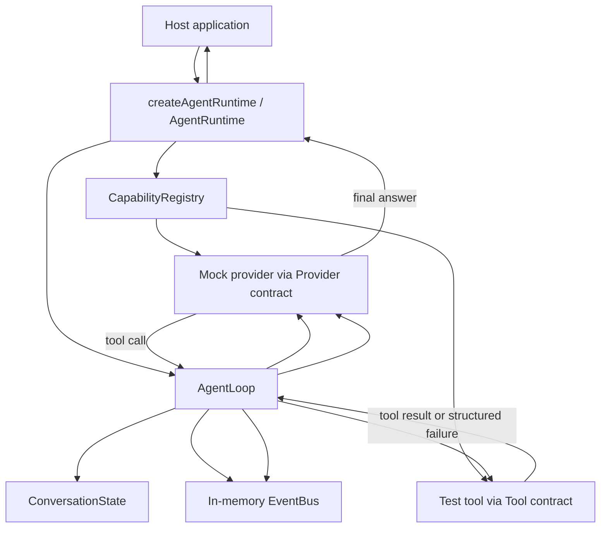

# feat: Build M0 core kernel runtime

## Summary

本计划把 M0 落成一个最小 TypeScript core workspace：建立 `packages/core` 的 contracts、in-memory registry、event bus、conversation state、agent loop 和面向宿主应用的公开 runtime facade，并用 mock provider/test tool + Vitest 覆盖 core loop 的关键验收路径。

---

## Problem Frame

M0 的产品范围已经由 origin PRD 确认：先证明无产品外壳的 core 可以独立完成最小 agent loop。当前计划的重点是把这个范围拆成可执行的工程单元，同时避免把 M1+ 的 plugin host、hooks、真实 provider、真实工具和持久化能力提前并入第一阶段。

---

## Requirements

- R1. Core runtime 必须提供面向宿主应用的公开接口，用于创建 runtime、注册 provider/tool、运行 user turn、结束或停止 run，并释放资源。
- R2. Core runtime 不得依赖 CLI、Web、IDE、server API、worker process 等具体 host。
- R3. Provider、message、tool call、tool result、usage、event 等 core contracts 不得泄漏任何真实 provider SDK 类型。
- R4. Agent loop 必须支持最小 tool-calling 生命周期：user input -> provider response -> tool execution -> tool result 回流 -> final answer。
- R5. Conversation state 必须保持 model tool call 与 tool result 的合法配对。
- R6. Tool failure 必须作为结构化 observation 回流给 provider。
- R7. Loop 必须发布 run、model、tool、error、usage 等关键事件。
- R8. M0 必须包含 in-memory capability registry，至少支持注册并解析一个 provider 和一个 tool。
- R9. 缺失 provider/tool 时必须显式失败并可观察。
- R10. M0 必须包含 mock provider 和 test tool，以无外部服务方式验证闭环。
- R11. 自动化测试必须覆盖成功 tool-calling run、tool failure run、缺失 capability 行为、provider SDK 不泄漏。
- R12. 实现必须排除 M1+ 范围，除非某项能力是满足最小 loop 和测试的必要条件。

**Origin actors:** A1 Host application, A2 Core runtime, A3 Mock provider, A4 Test tool, A5 Implementer

**Origin flows:** F1 Successful tool-calling run, F2 Tool failure remains model-visible

**Origin acceptance examples:** AE1 successful tool-calling run, AE2 no real provider SDK required, AE3 structured tool failure, AE4 explicit missing capability failure

---

## Scope Boundaries

- 不实现真实 OpenAI、Anthropic、Gemini、OpenAI-compatible 或其他 provider SDK 集成。
- 不实现 filesystem、shell、browser、git、MCP 或其他真实工具。
- 不实现 plugin manifest、plugin loader、HookKernel、namespace、reload 或 stale context guard。
- 不实现 persistent session store、event replay、fork、artifact store 或 durable event log。
- 不实现 CLI、Web、IDE、server API、UI projection 或 streaming UI。
- 不实现 context compaction、skills、long-term memory、multi-agent orchestration 或 eval infrastructure。

### Deferred to Follow-Up Work

- M1 plugin host + hook kernel：后续在 M0 的 registry/event/runtime 边界稳定后追加。
- M2 provider plugins：后续把真实 provider transport 作为 first-party plugins 接入。
- M3 tool plugins + permission runtime：后续把真实副作用工具、permission kernel 和 execution pipeline 纳入 runtime。
- M5 session store + replay：后续把 M0 的内存事件升级为 append-only durable event log。

---

## Context & Research

### Relevant Code and Patterns

- 当前仓库没有已有 `package.json`、`tsconfig.json`、`pnpm-workspace.yaml`、`go.mod`、`Cargo.toml` 或 `pyproject.toml`，因此本计划需要先引入最小工程脚手架。
- `docs/roadmap.md` 明确推荐 `packages/core` 边界，并把 M0 限定为 core message/tool/provider/event 类型、AgentLoop、CapabilityRegistry、EventBus、mock provider/test tool 和 `createAgentRuntime()`。
- `docs/research/context-packs/agent-loop.md` 提醒 M0 不应照搬完整商业 loop；当前阶段只需要最小状态机、tool call/result 配对、停止条件和可观察事件。
- `docs/research/context-packs/tool-registry.md` 明确工具失败应回流给模型，registry 应当让模型看到的工具与 runtime 可执行工具一致。
- `docs/research/context-packs/provider-abstraction.md` 明确 provider SDK 类型必须封装在 transport/adapter 边界外，agent loop 只依赖内部统一 contracts。
- `docs/agent-react-pattern.md` 把 L1 最小 ReAct loop 的核心定义为合法维护 `assistant.tool_calls -> tool message` 配对。
- `docs/agent-tool-management.md` 支持在早期就把工具声明和执行结果集中到 runtime 管理，但插件生态与权限系统应晚于 M0。
- `docs/agent-llm-integration.md` 支持早期固定 provider boundary，不让 SDK 类型污染 loop。

### Institutional Learnings

- 未发现 `docs/solutions/` 目录或既有实施经验沉淀；本计划主要依赖 roadmap、strategy、context packs 和 agent 系列设计文档。

### External References

- 未使用外部网络资料。M0 主要依据本仓库已整理的参考项目研究材料，符合 `AGENTS.md` 的研究漏斗要求。

---

## Key Technical Decisions

- 使用 TypeScript + Node workspace：roadmap 和参考项目主线偏 TypeScript，后续 provider/plugin 生态也更适合 npm package 边界。
- 使用 `pnpm` 管理 monorepo workspace：当前仓库没有既有包管理约束，`pnpm-workspace.yaml` 能用较少配置表达后续 `packages/*` 扩展方向。
- 使用 Vitest：M0 需要快速覆盖纯 runtime contracts 和 in-memory behavior，不需要浏览器或端到端测试框架。
- 将 `packages/core` 作为唯一代码包：第一阶段只产出 core，不提前创建 app 或 plugin 包。
- 将 mock provider/test tool 放在 core 的 testing 支撑层：它们服务 M0 验收，不是 runtime 默认内建能力。
- EventBus 先做 in-memory observer/recorder：满足可观察性和测试断言，但不承诺 durable log、replay 或 projection schema。
- Provider contract 先做 normalized model step：core 只需要区分 final answer、tool calls、usage 和 provider failure，不提前设计完整 streaming transport。
- Tool execution 先由 AgentLoop 调度 registered test tools：不建立完整 ExecutionPipeline、permission kernel、timeout policy 或 concurrency scheduler。

---

## Open Questions

### Resolved During Planning

- 语言和 package layout：采用 TypeScript + `packages/core`，与 roadmap 类型示例和后续 plugin/provider 包边界一致。
- 测试框架：采用 Vitest，优先覆盖 core unit/integration tests。
- 术语表述：计划中统一写为“面向宿主应用的公开接口”。

### Deferred to Implementation

- 最终 npm package metadata：实现时根据实际包名、发布策略和 TypeScript module target 决定。
- 具体 event 字段命名：实现时保持 M0 最小可测，但不得阻碍后续 replay/audit 扩展。
- ConversationState 内部存储细节：实现时以 tool call/result 配对正确性为首要标准。

---

## Output Structure

```text
package.json
pnpm-workspace.yaml
tsconfig.base.json
packages/
  core/
    package.json
    tsconfig.json
    vitest.config.ts
    src/
      index.ts
      contracts/
      registry/
      events/
      state/
      loop/
      runtime/
      testing/
```

---

## High-Level Technical Design

> *This illustrates the intended approach and is directional guidance for review, not implementation specification. The implementing agent should treat it as context, not code to reproduce.*



---

## Implementation Units

- U1. **Workspace and package foundation**

**Goal:** 引入最小 TypeScript monorepo/workspace，使 `packages/core` 可以独立 typecheck 和 test。

**Requirements:** R1, R2, R11, R12

**Dependencies:** None

**Files:**
- Create: `package.json`
- Create: `pnpm-lock.yaml`
- Create: `pnpm-workspace.yaml`
- Create: `tsconfig.base.json`
- Create: `packages/core/package.json`
- Create: `packages/core/tsconfig.json`
- Create: `packages/core/vitest.config.ts`
- Create: `packages/core/src/index.ts`

**Approach:**
- 保持 workspace 只包含 `packages/core`，为 M1+ 预留 `packages/*` 形态但不创建其他包。
- Root scripts 只代理 core 的 typecheck/test/build 能力，避免提前引入 app-level workflow。
- Core package exports 只暴露 M0 需要的 public contracts/runtime facade。

**Patterns to follow:**
- `docs/roadmap.md` 的 `packages/core` 推荐布局。
- `.trellis/spec/backend/index.md` 当前没有细化语言规范，因此以最小、可维护、可测试为优先。

**Test scenarios:**
- Test expectation: none -- 此单元是工程脚手架；通过 typecheck/test runner 能启动来验证。

**Verification:**
- Core package 可以被 workspace 识别。
- TypeScript 配置不会要求任何 real provider SDK。
- Vitest 能发现并执行 core package 下的测试文件。

---

- U2. **Core contracts**

**Goal:** 定义 M0 的稳定 contracts，使 runtime、loop、registry、mock provider 和 tests 都依赖同一组内部类型。

**Requirements:** R1, R3, R4, R5, R6, R7, R10, R11

**Dependencies:** U1

**Files:**
- Create: `packages/core/src/contracts/messages.ts`
- Create: `packages/core/src/contracts/provider.ts`
- Create: `packages/core/src/contracts/tools.ts`
- Create: `packages/core/src/contracts/events.ts`
- Create: `packages/core/src/contracts/runtime.ts`
- Create: `packages/core/src/contracts/errors.ts`
- Modify: `packages/core/src/index.ts`
- Test: `packages/core/src/contracts/contracts.test.ts`

**Approach:**
- Contracts 表达内部 message、provider step、tool call/result、usage、agent event、runtime options 和 runtime result。
- Provider contract 只表达 M0 需要的 final/tool-call/failure 能力，不引入真实 SDK 类型或 provider-specific metadata。
- Tool result contract 明确区分 success、structured failure 和 missing capability 类错误。
- Event contract 覆盖 run/model/tool/error/usage 的最小事实，不承诺 durable replay schema。

**Patterns to follow:**
- `docs/research/context-packs/provider-abstraction.md` 的 provider boundary 原则。
- `docs/agent-llm-integration.md` 的“SDK 类型不得穿透 runtime”原则。
- `docs/agent-react-pattern.md` 对 tool call/result 配对的要求。

**Test scenarios:**
- Happy path: contract helper 或 fixture 能表达一个 user message、一个 assistant tool call、一个 matching tool result 和一个 final assistant answer。
- Error path: contract fixture 能表达 tool failure observation，并且该 observation 可作为下一轮 provider 输入的一部分。
- Integration: mock provider/test tool fixtures 只依赖 core contracts，不 import 任何真实 provider SDK。

**Verification:**
- Public exports 中没有真实 provider SDK 类型。
- Tests 能构造 F1/F2 所需的消息和事件 fixtures。

---

- U3. **In-memory capability registry and event bus**

**Goal:** 建立 M0 的能力注册与事件观察基础，让 provider/tool 注册、解析、缺失错误和 runtime events 都有统一入口。

**Requirements:** R7, R8, R9, R10, R11

**Dependencies:** U2

**Files:**
- Create: `packages/core/src/registry/capability-registry.ts`
- Create: `packages/core/src/registry/capability-registry.test.ts`
- Create: `packages/core/src/events/event-bus.ts`
- Create: `packages/core/src/events/event-bus.test.ts`
- Modify: `packages/core/src/index.ts`

**Approach:**
- CapabilityRegistry 支持注册/解析 provider 和 tool，缺失或重复注册走显式错误路径。
- Registry 暂不实现 plugin namespace、enable/disable、reload、capability diff 或 priority。
- EventBus 支持订阅、发布和 in-memory recording，便于 runtime host 和 tests 观察 run。
- EventBus 不做持久化、不做 replay、不做 UI projection。

**Patterns to follow:**
- `docs/research/context-packs/tool-registry.md` 的“模型看到的工具必须和 runtime 可执行工具一致”原则。
- `docs/roadmap.md` 对 M0 EventBus/CapabilityRegistry 的范围定义。

**Test scenarios:**
- Happy path: 注册一个 provider 和一个 tool 后，可以按 id/name 解析到对应能力。
- Error path: 解析缺失 provider 时返回显式 failure，测试能断言该 failure。
- Error path: 解析缺失 tool 时返回显式 failure，测试能断言该 failure。
- Edge case: 重复注册同名 tool/provider 时不会静默覆盖。
- Happy path: EventBus 订阅者能收到发布事件，recorder 能保留事件顺序。

**Verification:**
- Registry 行为不依赖任何 app host。
- Missing capability failure 能被 AgentLoop/Runtime 转成 observable error event。

---

- U4. **Conversation state and minimal AgentLoop**

**Goal:** 实现最小状态机，负责 user input、provider step、tool execution、tool result 回流、final answer 和 tool failure observation。

**Requirements:** R4, R5, R6, R7, R9, R11, R12

**Dependencies:** U2, U3

**Files:**
- Create: `packages/core/src/state/conversation-state.ts`
- Create: `packages/core/src/state/conversation-state.test.ts`
- Create: `packages/core/src/loop/agent-loop.ts`
- Create: `packages/core/src/loop/agent-loop.test.ts`
- Modify: `packages/core/src/index.ts`

**Approach:**
- ConversationState 负责追加 user、assistant tool call、tool result/failure observation 和 final assistant answer。
- AgentLoop 按 M0 需求执行非 streaming 循环：provider step -> execute requested registered tools -> append observations -> continue or finish。
- Loop 有最小安全上限，避免 mock/provider bug 导致无限循环。
- Tool failure 归一化为 structured observation 并继续交给 provider，而不是默认抛出到 host。
- Missing tool/provider 产生 error event 和明确 runtime failure。

**Execution note:** 优先写集成式单元测试，让 F1/F2 先失败再实现 loop 行为。

**Patterns to follow:**
- `docs/agent-react-pattern.md` 的 L1 最小 ReAct loop。
- `docs/research/context-packs/agent-loop.md` 的 turn lifecycle 和 tool dispatch 边界。
- `docs/research/context-packs/tool-registry.md` 的“工具失败返回模型”共识。

**Test scenarios:**
- Covers F1 / AE1. Happy path: mock provider 第一次返回 tool call、第二次返回 final answer；loop 返回 final answer，state 中存在配对 tool call/result。
- Covers F2 / AE3. Error path: test tool 抛出或返回 failure；loop 将 failure 写成 structured observation，并允许 provider 继续产出 final answer。
- Covers AE4. Error path: provider 请求未注册 tool；loop 返回 explicit failure，并发布 error event。
- Edge case: provider 持续请求工具超过 max turns；loop 以明确原因停止。
- Integration: 每次 model request/response、tool call/result、run end 都产生可断言事件。

**Verification:**
- AgentLoop 不 import 真实 provider SDK。
- Tool result 必须能追溯到对应 tool call。
- Failure 不只存在于 thrown exception，也存在于模型可见 observation 和 event stream 中。

---

- U5. **AgentRuntime facade and M0 test fixtures**

**Goal:** 提供面向宿主应用的公开 runtime 入口，并建立 mock provider/test tool fixtures 来验证 M0 端到端闭环。

**Requirements:** R1, R2, R3, R4, R7, R8, R10, R11, R12

**Dependencies:** U2, U3, U4

**Files:**
- Create: `packages/core/src/runtime/agent-runtime.ts`
- Create: `packages/core/src/runtime/create-agent-runtime.ts`
- Create: `packages/core/src/runtime/agent-runtime.test.ts`
- Create: `packages/core/src/testing/mock-provider.ts`
- Create: `packages/core/src/testing/test-tool.ts`
- Modify: `packages/core/src/index.ts`

**Approach:**
- Runtime facade 组合 CapabilityRegistry、EventBus、ConversationState 和 AgentLoop，向 host 暴露创建 runtime、注册能力、运行 user turn、订阅事件和释放资源的最小 API。
- Mock provider 支持脚本化响应序列，以覆盖 success、tool failure recovery、missing capability 和 max-turns behavior。
- Test tool 支持 success 和 failure 两种模式，避免引入真实 filesystem/shell/browser 工具。
- Public exports 清晰区分 runtime API、contracts 和 testing fixtures。

**Execution note:** 端到端 runtime tests 应先覆盖 origin AE1-AE4，再补底层单元测试缺口。

**Patterns to follow:**
- `docs/roadmap.md` 的 `createAgentRuntime()` M0 要求。
- `STRATEGY.md` 的“从一个能工作的最小循环开始”原则。

**Test scenarios:**
- Covers AE1. Happy path: host 创建 runtime、注册 mock provider/test tool、运行 user turn，得到 final answer 和 ordered events。
- Covers AE2. Integration: runtime tests 不安装、不配置、不 import 真实 provider SDK。
- Covers AE3. Error path: test tool failure 被 mock provider 看见并转成 final answer。
- Covers AE4. Error path: host 未注册 provider 或 tool 时，runtime 返回 explicit failure 并记录 error event。
- Edge case: host 释放 runtime 后，订阅者不会继续收到旧 runtime 的事件。

**Verification:**
- 面向宿主应用的公开 API 不引用任何 CLI/Web/server 概念。
- Runtime test 能证明 M0 的完整闭环。
- Testing fixtures 不被误导为 runtime 默认内建 provider/tool。

---

- U6. **Documentation and export boundary cleanup**

**Goal:** 让 M0 的 public surface、使用方式和非目标范围对后续 implementer/reviewer 清楚可见。

**Requirements:** R1, R2, R3, R11, R12

**Dependencies:** U1, U2, U3, U4, U5

**Files:**
- Create: `packages/core/README.md`
- Modify: `packages/core/src/index.ts`

**Approach:**
- Core README 说明 M0 能力、最小 usage shape、scope exclusions 和 testing fixture 的用途。
- `src/index.ts` 只导出 M0 public contracts/runtime API，避免暴露内部 test-only 或 implementation-only helpers。
- Core README 记录 M0 的 public surface 和非目标范围；roadmap 维护留给独立文档更新，不作为本实现单元的一部分。

**Patterns to follow:**
- `docs/roadmap.md` 的 core 边界和不做事项。
- `.trellis/spec/guides/agent-reference-projects-guide.md` 的证据分级和迁移判断风格。

**Test scenarios:**
- Test expectation: none -- 文档和 export 边界清理通过 review、typecheck 和现有 tests 间接验证。

**Verification:**
- README 不承诺真实 provider、plugin、permission、persistence 或 UI。
- Public exports 与 M0 PRD 对齐，不把内部结构变成不必要的长期 API。

---

## System-Wide Impact

- **Interaction graph:** 新增 root workspace 与 `packages/core`；当前文档不应被 runtime 代码反向依赖。
- **Error propagation:** Missing capability、tool failure、max-turns failure 和 provider failure 都需要同时进入 runtime result 与 event stream。
- **State lifecycle risks:** ConversationState 必须避免 orphan tool result；AgentLoop 必须避免无限循环。
- **API surface parity:** 当前只需要 TypeScript public API；CLI/Web/server parity 明确不在 M0。
- **Integration coverage:** U5 runtime tests 是 M0 最重要的跨层验证，覆盖 host facade + registry + loop + state + events + mock capability。
- **Unchanged invariants:** `docs/roadmap.md` 的 M1+ plugin/hook/provider/tool roadmap 不因 M0 改变；M0 只是为这些阶段提供 core baseline。

---

## Risks & Dependencies

| Risk | Mitigation |
|------|------------|
| 从零引入 TypeScript workspace 可能扩大 PR 范围 | U1 只创建最小 root/core 配置，不创建 app/plugin 包 |
| Event shape 设计过度，提前绑定 replay/audit | EventBus 只表达 M0 runtime facts，durable replay 留给 M5 |
| Tool execution 过早演变成完整 permission pipeline | U4 只执行 registered test tools；permission/execution pipeline 留给 M3 |
| Mock provider 逻辑过强，掩盖真实 provider 差异 | U5 明确 mock provider 只服务 M0 contracts；真实 provider 差异留给 M2 |
| Public exports 暴露太多内部细节 | U6 单独清理 export boundary，并用 tests/typecheck 保证外部使用面足够 |

---

## Documentation / Operational Notes

- `packages/core/README.md` 应以中文或中英混合描述 M0 usage，保持和 roadmap/strategy 的中文语境一致。
- `docs/roadmap.md` 不在本计划中主动修改；M0 完成后的路线图更新可作为后续整理任务处理。
- 不需要部署、环境变量、credential 或运行时服务配置。
- 不需要更新用户文档、CLI 帮助或 UI 文案。

---

## Sources & References

- **Origin document:** `.trellis/tasks/05-26-05-26-core-kernel-spike/prd.md`
- `docs/roadmap.md`
- `STRATEGY.md`
- `docs/research/context-packs/agent-loop.md`
- `docs/research/context-packs/tool-registry.md`
- `docs/research/context-packs/provider-abstraction.md`
- `docs/agent-react-pattern.md`
- `docs/agent-tool-management.md`
- `docs/agent-llm-integration.md`
- `.trellis/spec/backend/index.md`
- `.trellis/spec/guides/agent-reference-projects-guide.md`
