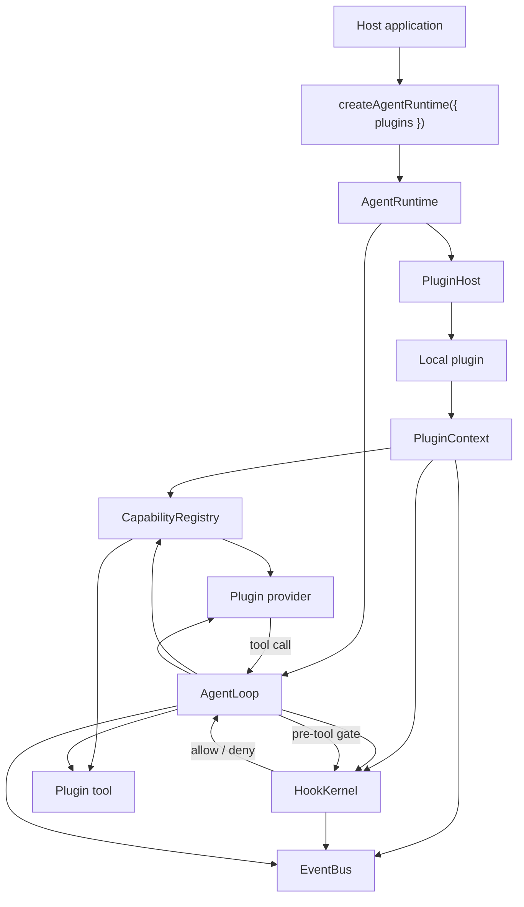
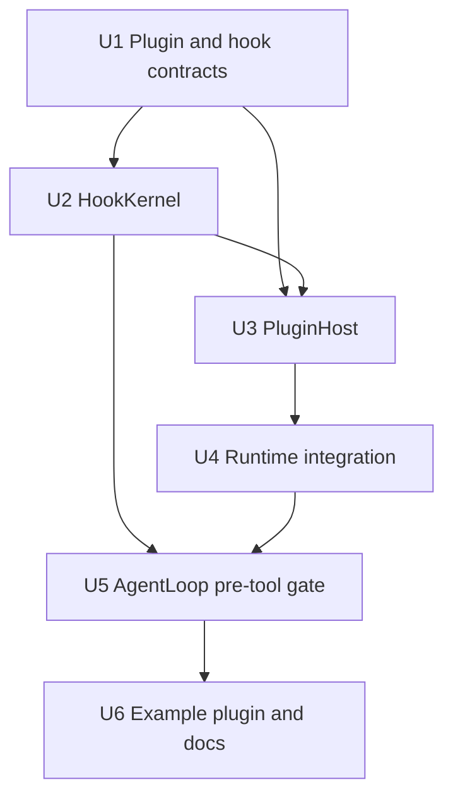

# feat: Add plugin host and hook kernel

## Summary

本计划在现有 `packages/core` runtime 边界内增加最小本地插件闭环：宿主在创建 runtime 时挂载可信本地插件，插件通过同一个初始化契约注册 provider、tool 和 M1 hook，core 复用现有 registry/event/runtime 机制完成最小 agent run，并在 dispose/shutdown 时清理插件生命周期状态。

---

## Problem Frame

M0 已经证明 core 可以用内建 mock provider/test tool 跑完最小 tool-calling loop。M1 的工程风险转向扩展边界：如果 provider、tool、hook 仍要靠宿主逐项手动接入 core，Guga 会退回 first-party 特例集合，无法支撑 roadmap 中“小内核 + 插件生态”的方向。

本计划把 M1 收窄为本地、可信、启动时挂载的插件宿主与最小 Hook Kernel，不提前解决真实 provider transport、reload、namespace 治理或 marketplace trust。

---

## Requirements

- R1. 宿主应用必须能在创建或配置 Guga runtime 时挂载本地插件。
- R2. 宿主侧路径不能要求宿主手动把每个插件提供的 provider、tool 或 hook 接入 core 内部细节。
- R3. 带插件的 runtime 必须能使用插件注册的能力完成一个最小 agent run。
- R4. M1 必须定义本地插件的最小形态，让插件作者能够提供初始化和 shutdown 行为。
- R5. 本地插件必须能注册 provider 能力。
- R6. 本地插件必须能注册 tool 能力。
- R7. 本地插件必须能为 M1 的 hook surface 注册 hook 能力。
- R8. M1 必须包含一个综合示例插件，在同一个插件内注册 provider、tool 和 hook。
- R9. M1 必须支持 session/runtime start 与 shutdown 生命周期 hook。
- R10. M1 必须支持 pre-tool gate hook，可以在工具执行前允许或阻断模型提出的 tool call。
- R11. Hook 执行必须对 M1 测试足够受控：对当前插件集合有确定性顺序，与直接 core state mutation 隔离，并且在产生 gate decision 或失败时可观察。
- R12. 插件初始化、能力注册、hook decision、hook failure 和插件 shutdown 必须对自动化测试与 debug inspection 足够可观察。
- R13. 插件 shutdown 必须为加载它的 runtime 实例清理插件生命周期状态。
- R14. 插件在初始化、hook 执行或 shutdown 中失败时，必须以结构化 runtime failure 或事件暴露，不能静默消失。

**Origin actors:** A1 宿主应用开发者, A2 插件作者, A3 Guga core runtime, A4 规划 / 实施 agent

**Origin flows:** F1 宿主应用启动带插件的 runtime, F2 插件作者贡献最小能力集, F3 Hook 在工具执行前阻断 tool call, F4 Runtime 关闭插件状态

**Origin acceptance examples:** AE1 插件 provider/tool 完成最小 run, AE2 pre-tool gate 阻断且 decision 可观察, AE3 shutdown 与 shutdown failure 可观察, AE4 示例插件展示 provider/tool/hook 注册路径

---

## Scope Boundaries

- 不实现真实 OpenAI、Anthropic、Gemini 或 OpenAI-compatible provider 插件。
- 不实现 provider fallback、stream normalization、usage normalization、cost normalization、credential routing 或 provider-specific error taxonomy。
- 不实现 plugin reload 或 hot reload。
- 不把 namespace 规则、同名冲突处理或能力覆盖治理作为 M1 硬验收；现有 duplicate capability fail-fast 行为保持即可。
- 不实现 command 注册。
- 不实现 resource discovery、model input patching、tool result post-processing、context compaction hook 或 projection hook。
- 不实现 plugin marketplace、remote install、sandboxing、signing、trust policy 或 enterprise allowlist。
- 不实现 MCP、skills、session store、replay 或 host adapter。

### Deferred to Follow-Up Work

- M2 provider plugins：在本计划证明本地插件 provider 注册后，再引入真实 provider transport、streaming、usage/cost/error normalization。
- M3 tool plugins + permission runtime：在 pre-tool gate 证明控制流切点后，再扩展真实副作用工具、permission kernel 和完整 execution pipeline。
- M6 skills/MCP/capability discovery：在 plugin host 边界稳定后，再处理 resource discovery、skills 渐进加载和 MCP 工具统一注册。

---

## Context & Research

### Relevant Code and Patterns

- `packages/core/src/runtime/create-agent-runtime.ts` 目前无参创建 `AgentRuntime`，是宿主侧挂载插件 API 的最自然入口。
- `packages/core/src/runtime/agent-runtime.ts` 目前拥有 `CapabilityRegistry` 与 `EventBus`，并通过 `registerProvider` / `registerTool` 暴露宿主注册能力；插件初始化应复用这条注册路径而不是绕开 registry。
- `packages/core/src/loop/agent-loop.ts` 在 `ToolCalled` 事件后、实际 `tool.execute` 前解析工具并执行，是 M1 pre-tool gate 的控制流接入点。
- `packages/core/src/registry/capability-registry.ts` 已有 provider/tool 注册、解析、重复注册失败路径；M1 不需要重新定义 provider/tool registry 语义。
- `packages/core/src/events/event-bus.ts` 是当前 runtime 可观察性事实通道；hook decision/failure、plugin lifecycle、capability registration 应通过事件或等价 core-observable output 暴露。
- `packages/core/src/testing/mock-provider.ts` 与 `packages/core/src/testing/test-tool.ts` 已支持无外部服务的 core tests；综合示例插件应复用这些测试支撑，避免引入真实 provider SDK。
- `docs/roadmap.md` 把 M1 定义为 Plugin Host + Hook Kernel，但当前 origin 文档有意收窄了 roadmap 中 reload、namespace、resources/model patches 等更完整生态能力。
- `docs/research/agent-hook.md` 明确 EventBus 发布已经发生的事实，HookKernel 参与会改变行为的决策；pre-tool gate 不能实现成普通事件订阅。
- `.trellis/spec/backend/directory-structure.md` 要求 `packages/core` 保持小内核，不放真实 provider SDK、真实工具、CLI/Web/UI projection。
- `.trellis/spec/backend/error-handling.md` 要求 runtime failures 结构化且可观察，tool failures 作为模型可见 observation 回流。
- `.trellis/spec/backend/quality-guidelines.md` 要求 runtime 行为单元 test-first，并保持 public exports 与 host-facing API 边界清晰。

### Institutional Learnings

- 未发现 `docs/solutions/` 下的既有实施经验沉淀；本计划主要依赖 M0 实现、Trellis spec、roadmap、agent hook 设计文档和 reference context packs。

### External References

- 未使用实时外部网络资料。参考项目判断来自仓库内整理的 research packs 与 source-analysis 文档，符合 `AGENTS.md` 的研究漏斗规则。
- `docs/research/context-packs/tool-registry.md` 支持 provider/tool 进入统一能力池，并要求工具失败回流给模型而非直接终止。
- `docs/research/context-packs/provider-abstraction.md` 支持 M1 不引入真实 provider transport，但要保持 provider SDK 类型不穿透 core。
- `docs/research/source-analysis/learn-opencode/docs/flow/plugin_loading.md` 支持 plugin context injection + registration 的本地插件激活模式。
- `docs/research/source-analysis/hermes-wiki/concepts/hook-system-architecture.md` 支持 pre-tool hook 可阻断工具执行，并要求 hook failure 可观察。

---

## Key Technical Decisions

- 在 `createAgentRuntime()` 增加可选插件配置，而不是要求宿主先手动创建 runtime 再逐个调用 register：这直接满足 R1/R2，并保留当前无插件 runtime 用法。
- M1 插件采用可信本地对象契约，不做 manifest 文件、目录扫描或动态 import：origin 明确把 marketplace、remote install、sandbox、trust policy 后置，当前测试和示例需要的是 authoring contract。
- 插件初始化拿到受限 `PluginContext`，只暴露 `registerProvider`、`registerTool`、`registerHook` 和必要的 observable helper：插件不能直接拿到 `ConversationState`、`AgentLoop` 或 mutable registry internals。
- Provider/tool 注册复用 `CapabilityRegistry`：M1 证明插件能力进入现有 runtime 能力集合，不另建平行插件 registry。
- 新增 `HookKernel` 处理控制流决策，`EventBus` 只记录 hook/lifecycle facts：这延续 `docs/research/agent-hook.md` 的分工，避免把 gate 语义塞进事件订阅。
- M1 hook ordering 使用插件加载顺序 + hook 注册顺序的确定性顺序，暂不引入 priority、load tiers 或 namespace：满足 R11 的可测顺序，同时不提前承诺完整生态治理。
- 插件配置在 `createAgentRuntime({ plugins })` 传入，但插件初始化在首次 `run()` 前懒执行：这让宿主有机会先注册 event listener，也让 init failure 能按 run failure/result 语义结构化暴露。
- Pre-tool gate 拒绝时不执行工具，并产生模型可见 tool observation 与 hook decision event：这让 provider 可以继续解释/收敛，同时让 AE2 可测试。
- 插件 init 或 pre-tool hook failure 按结构化 run failure 暴露；shutdown failure 通过 dispose/shutdown 结果与事件暴露：init/gate 影响运行正确性，shutdown 发生在 lifecycle close path，应可观察但不能被吞掉。
- Runtime dispose 后应使插件生命周期状态失效，并清理 event listeners/hook registrations/registry state：这比 M0 仅清空 event bus 更符合 R13，但不承诺跨 process durable cleanup。

---

## Open Questions

### Resolved During Planning

- 宿主侧插件挂载 API：选择 `createAgentRuntime({ plugins: [...] })` 方向，贴合现有 runtime factory，并避免宿主逐项接入插件能力。
- 最小插件 packaging 形态：选择本地 TypeScript object/function 契约，满足测试和示例，manifest/dynamic loading 后置。
- M1 可观察性粒度：记录 plugin init/shutdown、capability registration、hook decision、hook failure、plugin failure 等最小事件，不承诺未来 audit schema。
- 清理保证：当前 M0 runtime 是 in-memory 生命周期，因此 M1 强制清理当前 runtime 实例内的 plugin/hook/registry/event listener 状态，不承诺 durable session store 或 reload cleanup。

### Deferred to Implementation

- 插件 context 的最终类型命名与文件拆分：实现时应保持 public contract 小而清晰，避免泄漏实现 helper。
- Hook failure 的具体 error code 名称：实现时应与 `CoreError` 现有风格一致，并覆盖 init/gate/shutdown 三类路径。
- Gate denial 的 tool observation 文案：实现时只需稳定可测，不应把文案作为长期用户体验承诺。
- Dispose 是否返回 `Promise` 或新增显式 async shutdown API：实现时根据 hook shutdown 是否需要 async 决定，但必须让 shutdown failure 可观察。

---

## Output Structure

```text
packages/core/src/
  contracts/
    hooks.ts
    plugins.ts
  hooks/
    hook-kernel.ts
    hook-kernel.test.ts
  plugin-host/
    plugin-host.ts
    plugin-host.test.ts
  testing/
    example-plugin.ts
```

---

## High-Level Technical Design

> *This illustrates the intended approach and is directional guidance for review, not implementation specification. The implementing agent should treat it as context, not code to reproduce.*



---

## Implementation Units



- U1. **Plugin and hook contracts**

**Goal:** 定义 M1 本地插件、plugin context、hook phase/effect/decision、lifecycle result 和插件相关事件的最小 public contracts。

**Requirements:** R1, R4, R7, R9, R10, R11, R12, R14

**Dependencies:** None

**Files:**
- Create: `packages/core/src/contracts/plugins.ts`
- Create: `packages/core/src/contracts/hooks.ts`
- Modify: `packages/core/src/contracts/events.ts`
- Modify: `packages/core/src/contracts/errors.ts`
- Modify: `packages/core/src/contracts/runtime.ts`
- Modify: `packages/core/src/index.ts`
- Test: `packages/core/src/contracts/contracts.test.ts`

**Approach:**
- 定义可信本地插件的最小形态：插件有 stable id/name，提供 init 行为，可选提供 shutdown 行为。
- Plugin context 只允许注册 provider、tool、hook，并发布/记录 M1 所需 observable facts；不暴露 mutable `AgentLoop`、`ConversationState` 或 registry internals。
- Hook contract 只覆盖 M1 phase：runtime/session start、pre-tool gate、runtime/session shutdown。
- Pre-tool gate result 只表达 allow/deny，deny 带可测试 reason；不包含 tool arg patch、pause、permission ask 或 post-tool transform。
- Event contract 增加 plugin lifecycle、capability registered、hook decision、hook failure、plugin failure 的最小 discriminated union。

**Execution note:** 先补 contract tests，再让实现单元使用这些类型；M1 是公共扩展边界，contract drift 成本高。

**Patterns to follow:**
- `packages/core/src/contracts/provider.ts` 的小型 discriminated union 风格。
- `packages/core/src/contracts/events.ts` 的 `AgentEventType` 常量 + union event 风格。
- `.trellis/spec/backend/quality-guidelines.md` 的 public exports 边界要求。
- `docs/research/agent-hook.md` 的 effect/decision 与 state mutation 隔离原则。

**Test scenarios:**
- Happy path: contract fixture 能表达一个插件 init 注册 provider/tool/hook，并产生 capability registered 与 lifecycle events。
- Happy path: contract fixture 能表达 pre-tool gate allow 与 deny 两种 decision。
- Error path: contract fixture 能表达 plugin init failure、hook failure、shutdown failure 的结构化 error payload。
- Edge case: plugin context 类型不能提供直接 mutate conversation state 或直接执行 tool 的入口。
- Integration: public `packages/core/src/index.ts` 导出插件作者需要的 contracts，但不导出内部 helper。

**Verification:**
- 插件作者可以只依赖 public contracts 理解最小本地插件形态。
- Provider/tool/hook 仍使用 core normalized types，不引入真实 provider SDK 类型。

---

- U2. **HookKernel**

**Goal:** 实现 M1 HookKernel，按确定性顺序执行 lifecycle observe hooks 与 pre-tool gate hooks，并把 decision/failure 交给 runtime 可观察通道。

**Requirements:** R7, R9, R10, R11, R12, R14

**Dependencies:** U1

**Files:**
- Create: `packages/core/src/hooks/hook-kernel.ts`
- Create: `packages/core/src/hooks/hook-kernel.test.ts`
- Modify: `packages/core/src/index.ts`

**Approach:**
- HookKernel 维护当前 runtime 实例内的 hook registrations，每个 registration 带 plugin id、phase、effect、registration index。
- 执行顺序使用 plugin load order + hook registration order；M1 不引入 priority 或 load tier，但结果必须稳定可断言。
- Lifecycle start/shutdown hooks 使用 observe-style 执行，收集 failure 并发布可观察事件；pre-tool gate 使用 first-deny-wins reducer。
- Hook 函数接收只读 event/context 输入，返回 typed decision 或 completion result；不接收 core mutable objects。
- Hook failure 不应被吞掉：pre-tool gate failure 归一化为 structured runtime failure，shutdown failure 进入 shutdown/dispose result 与事件。

**Execution note:** 实现新 kernel 前先写排序、first-deny-wins、failure isolation 的单元测试。

**Patterns to follow:**
- `packages/core/src/events/event-bus.ts` 的 in-memory deterministic recording。
- `docs/research/agent-hook.md` 的 reducer 语义：observeAll 与 firstDenyWins。
- `docs/research/source-analysis/hermes-wiki/concepts/hook-system-architecture.md` 中 pre-tool block 的可观察阻断模式。

**Test scenarios:**
- Happy path: 给定两个插件按顺序注册 pre-tool gate，两个都 allow 时，HookKernel 返回 allow 且记录两个 hook decision。
- Happy path: 给定第一个 gate deny，HookKernel 返回 deny，后续 gate 不执行，decision 包含 plugin/hook identity 与 reason。
- Edge case: 没有注册 hook 时，pre-tool gate 默认 allow。
- Error path: gate hook throw/reject 时，HookKernel 返回结构化 hook failure，事件中包含 phase、plugin id、message。
- Error path: shutdown hook failure 被收集并暴露，不阻止其他 shutdown hook 尝试执行。
- Integration: lifecycle hook 与 gate hook 使用同一 ordering metadata，但 reducer 语义不同。

**Verification:**
- Hook execution order 可由 tests 稳定断言。
- Gate decision 与 failure 可通过 events/debug inspection 观察。
- Hook 不能直接 mutate core state。

---

- U3. **PluginHost**

**Goal:** 实现本地插件宿主，负责初始化插件、提供受限 plugin context、把插件贡献的能力接入 registry/hook kernel，并追踪 runtime-scoped lifecycle cleanup。

**Requirements:** R1, R2, R4, R5, R6, R7, R8, R11, R12, R13, R14

**Dependencies:** U1, U2

**Files:**
- Create: `packages/core/src/plugin-host/plugin-host.ts`
- Create: `packages/core/src/plugin-host/plugin-host.test.ts`
- Modify: `packages/core/src/index.ts`

**Approach:**
- PluginHost 接收插件列表、`CapabilityRegistry`、`HookKernel`、`EventBus`，在 runtime setup 阶段按数组顺序初始化。
- PluginContext 的 `registerProvider` / `registerTool` 直接委托到现有 registry，并为每次注册发布 capability registered event。
- PluginContext 的 `registerHook` 委托到 HookKernel，并保留 plugin id 与 load index。
- PluginHost 保存已初始化插件的 shutdown handles；runtime dispose/shutdown 时按相反顺序或稳定顺序执行 shutdown，顺序需在 contract/test 中固定。
- 初始化失败走结构化 failure：已初始化插件需要被 shutdown/cleanup，失败事件要包含 plugin id 与 error 信息。

**Execution note:** 先覆盖 init 部分失败的 characterization-style tests，避免后续 runtime integration 时遗漏半初始化清理。

**Patterns to follow:**
- `packages/core/src/runtime/agent-runtime.ts` 持有 registry/event bus 的 composition 模式。
- `packages/core/src/registry/capability-registry.ts` 的 duplicate registration fail-fast 行为。
- `docs/research/source-analysis/learn-opencode/docs/flow/plugin_loading.md` 的 context injection + registration 模式。

**Test scenarios:**
- Happy path: 插件 init 通过 context 注册 provider、tool、hook，registry 与 HookKernel 都能解析到对应能力。
- Happy path: capability registered events 按 provider/tool/hook 注册顺序出现，并包含 plugin id。
- Edge case: 空插件列表初始化成功，行为等价于无插件 runtime。
- Error path: 插件 init 抛错时，PluginHost 返回结构化 failure，发布 plugin failure event，并 shutdown 已初始化插件。
- Error path: 插件注册重复 provider/tool 时沿用 `CAPABILITY_ALREADY_REGISTERED`，并标记失败来源 plugin。
- Error path: shutdown hook 或 plugin shutdown 抛错时，failure 可观察且不吞掉后续 cleanup。
- Integration: PluginHost 不要求宿主手动调用 runtime.registerProvider/registerTool 来接入插件能力。

**Verification:**
- 插件能力进入现有 registry/hook kernel。
- 插件初始化、注册、shutdown 都可通过事件或 result 断言。
- 插件生命周期状态被限制在加载它的 runtime 实例内。

---

- U4. **Runtime integration and lifecycle API**

**Goal:** 把 PluginHost 接入 `createAgentRuntime` / `AgentRuntime`，让宿主可以创建带插件的 runtime，并获得清晰的 shutdown/cleanup 行为。

**Requirements:** R1, R2, R3, R8, R9, R12, R13, R14

**Dependencies:** U3

**Files:**
- Modify: `packages/core/src/contracts/runtime.ts`
- Modify: `packages/core/src/runtime/create-agent-runtime.ts`
- Modify: `packages/core/src/runtime/agent-runtime.ts`
- Modify: `packages/core/src/runtime/agent-runtime.test.ts`
- Modify: `packages/core/src/index.ts`

**Approach:**
- 扩展 runtime factory options，允许传入 `plugins`；无 options 时保持 M0 行为。
- `AgentRuntime` 构造时创建 `HookKernel` 与 `PluginHost`，但插件 init/lifecycle start 在首次 `run()` 前懒执行；这样宿主可以先调用 `onEvent` 订阅 plugin init/register events。
- 如果插件 setup 失败，首次 `run()` 返回结构化 `AgentRunFailure` 并包含 plugin failure/error events；不要让 init failure 只表现为普通 constructor throw。
- 将 `dispose` 扩展为可等待的 cleanup path，返回或解析出 shutdown failure 信息；如果保留 fire-and-forget 兼容用法，仍必须提供一个可测试、可等待的 shutdown path。
- dispose 后应清理 event listeners、hook registrations、plugin state 和 registry state，并阻止旧 runtime 继续 run 或明确返回 structured failure。

**Execution note:** 先补 runtime facade tests，再改 factory/constructor；这是宿主 public API 单元。

**Patterns to follow:**
- `packages/core/src/runtime/agent-runtime.test.ts` 的宿主视角测试风格。
- `.trellis/spec/backend/error-handling.md` 的 host-facing `AgentRunFailure` 结构化失败要求。
- M0 计划中的 runtime facade 边界：不依赖 CLI/Web/IDE/server API。

**Test scenarios:**
- Covers AE1. Happy path: 宿主用综合插件创建 runtime 后，不手动注册 provider/tool，也能 run 成功。
- Happy path: 宿主在第一次 run 前订阅 events，可以观察到插件 init 与 capability registration events。
- Happy path: 无插件 runtime 仍可通过现有 `registerProvider` / `registerTool` 跑通 M0 测试。
- Covers AE3. Happy path: dispose/shutdown 调用插件 shutdown 与 lifecycle shutdown hook，并发布 shutdown event。
- Edge case: dispose 后再次 run 返回明确 failure 或被禁止，旧插件能力不可继续使用。
- Error path: plugin init failure 对宿主可见，并发布 plugin failure/error event。
- Error path: shutdown failure 对宿主可见，不会被 `eventBus.dispose()` 清空到无法断言。
- Integration: runtime result events 只包含当前 run 的事件，不泄漏先前 run 的历史事件；插件 lifecycle events 的归属策略在 tests 中固定。

**Verification:**
- 宿主侧挂载插件 API 满足 R1/R2。
- Runtime lifecycle 有明确 cleanup 语义。
- 无插件 M0 行为保持兼容。

---

- U5. **AgentLoop pre-tool gate integration**

**Goal:** 在 `AgentLoop` 的工具执行前接入 HookKernel，让插件 pre-tool gate 可以 allow 或 deny tool call，并保持模型可见 observation 与 runtime 可观察性。

**Requirements:** R3, R7, R10, R11, R12, R14

**Dependencies:** U2, U4

**Files:**
- Modify: `packages/core/src/loop/agent-loop.ts`
- Modify: `packages/core/src/loop/agent-loop.test.ts`
- Modify: `packages/core/src/contracts/events.ts`
- Modify: `packages/core/src/contracts/errors.ts`

**Approach:**
- `AgentLoop` 接收可选 HookKernel；无 HookKernel 时维持 M0 行为。
- 每个 provider 提出的 tool call 在 `ToolCalled` event 后、`tool.execute` 前调用 pre-tool gate。
- Gate allow 后继续现有 `executeTool` 流程。
- Gate deny 后跳过真实 tool execution，向 conversation state 添加 `isError: true` 的 tool observation，并发布 hook decision 与 tool result/blocked event；provider 下一轮能看到阻断原因。
- Gate failure 归一化为 structured runtime failure，不伪装成 tool execution failure；这样实现 R14 的“不能静默消失”。

**Execution note:** 添加 failing integration test：被 gate 的 tool 带 side-effect counter，deny 后 counter 不变，provider 仍收到 tool observation。

**Patterns to follow:**
- `packages/core/src/loop/agent-loop.ts` 现有 tool failure normalization：tool failure 作为模型可见 observation 回流。
- `docs/research/agent-hook.md` 的“工具 hook 要在 execution pipeline 控制路径上”原则。
- `docs/research/context-packs/tool-registry.md` 的错误返回模型而非直接丢失上下文模式。

**Test scenarios:**
- Covers AE2. Happy path: pre-tool gate deny 指定 tool call，真实 tool execute 未运行，result/events 中能观察 gate decision。
- Happy path: pre-tool gate allow 时，现有 successful tool-calling run 行为不变。
- Edge case: 多个 tool calls 中第一个 allow、第二个 deny 时，已允许的工具执行，被 deny 的工具不执行，conversation state 保持合法 tool call/result 配对。
- Error path: gate hook 抛错时，run 返回 hook failure 结构化错误，并发布 error/hook failure event。
- Error path: gate deny 后 provider 如果返回 final answer，runtime 正常完成，并保留 blocked tool observation。
- Integration: missing tool 的错误仍发生在 gate 允许之后的 registry 解析路径；gate deny 不要求工具已注册即可阻断该 call 的副作用。

**Verification:**
- 被 gate deny 的 tool 不会执行。
- Provider 可以看到 gate denial observation。
- Hook decision/failure 可通过 events 断言。
- AgentLoop 仍维护 assistant tool call 与 tool result 的合法配对。

---

- U6. **Comprehensive example plugin and authoring docs**

**Goal:** 提供一个综合示例插件与端到端测试，展示插件作者如何在同一个本地插件内注册 provider、tool 和 hook，并证明宿主不改 core 代码即可消费这些能力。

**Requirements:** R3, R4, R5, R6, R7, R8, R12

**Dependencies:** U5

**Files:**
- Create: `packages/core/src/testing/example-plugin.ts`
- Modify: `packages/core/src/runtime/agent-runtime.test.ts`
- Modify: `packages/core/README.md`
- Modify: `packages/core/src/index.ts`

**Approach:**
- 示例插件放在 `testing/` 或 README 示例支撑层，作为 M1 authoring contract 的可运行例子，不作为默认内建插件自动加载。
- 示例插件注册一个 mock provider、一个 test tool、一个 pre-tool gate hook，并可配置 gate allow/deny。
- Runtime integration test 使用 `createAgentRuntime({ plugins: [examplePlugin] })` 完成 AE1/AE2/AE3/AE4。
- README 增补最小 authoring path：插件形态、init/shutdown、registerProvider/registerTool/registerHook，以及 M1 明确不包含的能力。

**Execution note:** 端到端测试优先于 README 文案，文档只描述已由 tests 证明的 contract。

**Patterns to follow:**
- `packages/core/src/testing/mock-provider.ts` 与 `packages/core/src/testing/test-tool.ts` 的 test-only fixture 边界。
- `packages/core/README.md` 的 core package 说明方式。
- origin 文档对“一个综合示例插件，而不是多个示例插件”的决策。

**Test scenarios:**
- Covers AE1. Happy path: example plugin 注册的 provider 发出 tool call，example plugin 注册的 tool 返回结果，provider 最终回答成功。
- Covers AE2. Happy path: example plugin gate deny 时，tool 不执行，decision 可观察。
- Covers AE3. Happy path: runtime dispose/shutdown 触发 example plugin shutdown，并可断言状态已清理。
- Covers AE4. Integration: README/API 示例与测试中的插件形态一致，插件作者能从一个示例识别 provider/tool/hook 三类注册。
- Edge case: example plugin 不应被无插件 runtime 自动加载。
- Error path: example plugin 可配置 init/hook/shutdown failure，测试能验证对应 failure 可观察。

**Verification:**
- M1 e2e 测试覆盖插件 provider/tool 路径和 pre-tool gate 路径。
- 示例插件是插件作者入口，而不是 core 默认能力。
- README 不承诺 reload、namespace、真实 provider transport 或 marketplace 能力。

---

## System-Wide Impact

- **Interaction graph:** `createAgentRuntime` 会新增 plugin setup 路径；`AgentRuntime` 会组合 `PluginHost` 与 `HookKernel`；`AgentLoop` 会在 tool execution 前调用 gate hook；`CapabilityRegistry` 与 `EventBus` 继续作为能力与事实通道。
- **Error propagation:** Plugin init/gate failures 应归一化为 `CoreError` / `AgentRunFailure` 风格的结构化 failure；shutdown failure 必须通过 shutdown/dispose result 或事件保留给宿主和 tests。
- **State lifecycle risks:** 半初始化插件、dispose 后旧 runtime 继续 run、shutdown failure 被清空、hook registrations 残留是主要风险；PluginHost 需要集中管理 runtime-scoped cleanup。
- **API surface parity:** 现有无插件 `createAgentRuntime()`、`runtime.registerProvider()`、`runtime.registerTool()`、`runtime.run()` 行为必须保持；新插件 API 是 additive。
- **Integration coverage:** Unit tests 不足以证明闭环；必须有 runtime-level tests 覆盖插件 init -> capability registration -> run -> pre-tool gate -> shutdown。
- **Unchanged invariants:** Core 仍不 import 真实 provider SDK；tool failure 仍作为模型可见 observation；provider/tool contracts 仍由 `packages/core/src/contracts` 拥有；EventBus 不承担会改变 runtime 行为的决策。

---

## Risks & Dependencies

| Risk | Mitigation |
|------|------------|
| 插件 contract 过早膨胀成完整生态 | 只支持本地可信 object/plugin function、init/shutdown、provider/tool/hook 注册；manifest、reload、namespace、trust 明确后置。 |
| Hook 被误实现为 EventBus listener，无法控制执行顺序和阻断语义 | 新增 `HookKernel` 并把 pre-tool gate 接入 `AgentLoop` 控制路径；EventBus 只记录 facts。 |
| Gate deny 破坏 tool call/result 配对 | Deny 也写入 tool observation，保持 provider 下一轮看到合法 tool result。 |
| Plugin init 失败留下半注册能力 | PluginHost 集中追踪 init 顺序与 cleanup，失败时 shutdown 已初始化插件并发布 failure event。 |
| Dispose 清空事件太早导致 shutdown failure 不可测试 | 先执行插件 shutdown 并保留/返回 shutdown failure，再处理 event listener cleanup；具体顺序由 tests 固定。 |
| Public API 兼容性受影响 | 无插件 factory 和手动 register provider/tool 测试必须继续通过。 |

---

## Documentation / Operational Notes

- 更新 `packages/core/README.md`，说明 M1 本地插件 authoring contract、示例插件、host mounting API、pre-tool gate 行为和明确非目标。
- 不需要迁移、部署、feature flag 或运维 rollout；这是 in-memory core library API 扩展。
- 如果实现发现 runtime shutdown 必须 async，README 与 contracts 需要同步解释宿主如何等待 cleanup 和处理 shutdown failure。

---

## Sources & References

- **Origin document:** [docs/brainstorms/2026-05-26-m1-plugin-host-hook-kernel-requirements.md](docs/brainstorms/2026-05-26-m1-plugin-host-hook-kernel-requirements.md)
- **Related M0 plan:** [docs/plans/2026-05-26-001-feat-core-kernel-runtime-plan.md](docs/plans/2026-05-26-001-feat-core-kernel-runtime-plan.md)
- **Strategy:** [STRATEGY.md](STRATEGY.md)
- **Roadmap:** [docs/roadmap.md](docs/roadmap.md)
- **Hook design:** [docs/research/agent-hook.md](docs/research/agent-hook.md)
- **Core runtime:** [packages/core/src/runtime/agent-runtime.ts](packages/core/src/runtime/agent-runtime.ts)
- **Runtime factory:** [packages/core/src/runtime/create-agent-runtime.ts](packages/core/src/runtime/create-agent-runtime.ts)
- **Agent loop:** [packages/core/src/loop/agent-loop.ts](packages/core/src/loop/agent-loop.ts)
- **Capability registry:** [packages/core/src/registry/capability-registry.ts](packages/core/src/registry/capability-registry.ts)
- **Event bus:** [packages/core/src/events/event-bus.ts](packages/core/src/events/event-bus.ts)
- **Backend spec:** [.trellis/spec/backend/directory-structure.md](.trellis/spec/backend/directory-structure.md), [.trellis/spec/backend/error-handling.md](.trellis/spec/backend/error-handling.md), [.trellis/spec/backend/quality-guidelines.md](.trellis/spec/backend/quality-guidelines.md)
- **Research:** [docs/research/context-packs/tool-registry.md](docs/research/context-packs/tool-registry.md), [docs/research/context-packs/provider-abstraction.md](docs/research/context-packs/provider-abstraction.md), [docs/research/source-analysis/learn-opencode/docs/flow/plugin_loading.md](docs/research/source-analysis/learn-opencode/docs/flow/plugin_loading.md), [docs/research/source-analysis/hermes-wiki/concepts/hook-system-architecture.md](docs/research/source-analysis/hermes-wiki/concepts/hook-system-architecture.md)
