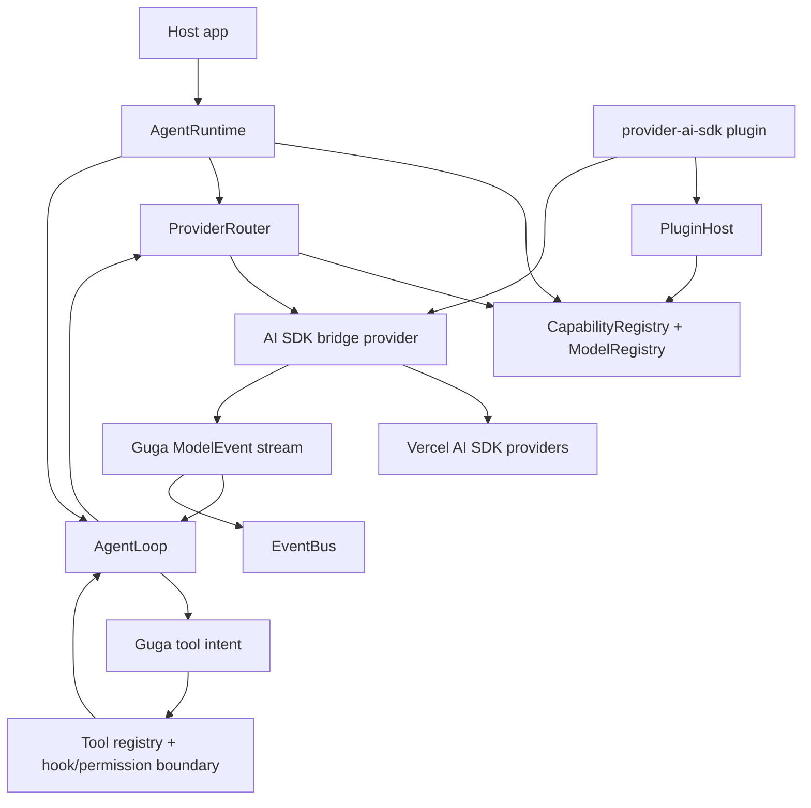
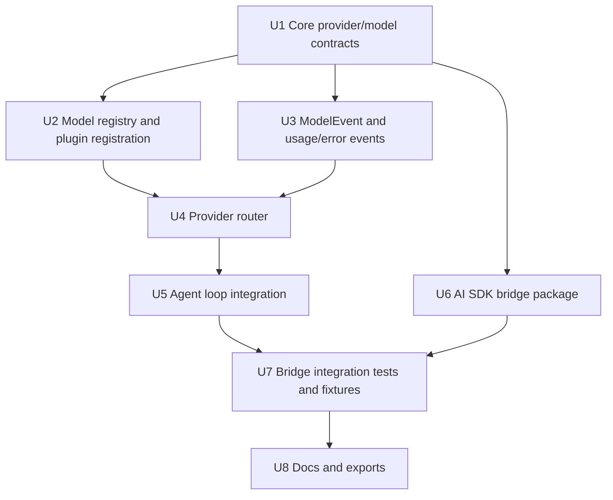

# feat: Add provider runtime and AI SDK bridge

## Summary

本计划把 M2 落成一个 core-owned provider runtime 闭环：`packages/core` 拥有 model registry、provider router、ModelEvent、usage/error/tool-intent 语义和 hooks contract-first 边界；新的 `packages/provider-ai-sdk` bridge package 负责把 Vercel AI SDK 的 provider/model 调用转换回 Guga contract。AI SDK 作为默认真实模型 backend，但不会泄漏进 core public API。

---

## Problem Frame

M1 已证明本地插件可以注册 provider、tool 和 hook，但当前 provider contract 仍是 M0/M1 的非 streaming `generate()` 形态。M2 的风险是：真实模型接入会带来 provider stream、tool call、usage、error、fallback、credential 与 metadata 差异；如果这些差异直接进入 agent loop，Guga 会失去自己的 runtime 语义和审计边界。

本计划按已确认的“核心闭环 + hooks contract-first”范围推进：先把真实 provider bridge、router、events、usage/error 与 tool intent 边界跑通；`model.request.before` / `model.response.after` 只定义 contract 与测试夹具，完整 hook 执行管线延后。

---

## Requirements

- R1. Core 必须定义 Guga-owned provider runtime contract，独立于 Vercel AI SDK、LangChain、OpenAI SDK、Anthropic SDK 或任意 vendor SDK 类型。
- R2. Provider 插件必须能注册 provider、model metadata 和模型调用能力；runtime 能查询当前可用模型及其能力。
- R3. Provider contract 必须覆盖主模型和辅助模型路由所需的最小信息：模型标识、能力、context window、tool support、reasoning/thinking support 和 usage 可用性。
- R4. Core 必须只消费统一 `ModelEvent` 或等价事件流，不直接处理 provider-specific stream part。
- R5. Streaming 与 non-streaming 调用必须进入同一套 runtime 事件语义，agent loop 不出现 provider-specific 分支。
- R6. M2 first-party 真实 provider bridge 必须是 AI SDK bridge，而不是拆分的 OpenAI/Anthropic/OpenAI-compatible 原生 transport。
- R7. AI SDK bridge 必须接入至少 OpenAI、Anthropic 和一个 OpenAI-compatible 或 AI Gateway 路径，并把结果转换为 Guga provider contract。
- R8. Provider bridge 必须输出归一化 usage；pricing metadata 缺失或不可靠时，成本状态必须明确为 unknown。
- R9. Provider error taxonomy 至少覆盖 `auth`、`rate-limit`、`context-overflow`、`payment`、`retryable`、`fatal`，并携带 provider/model/request metadata。
- R10. Guga provider router 必须拥有模型选择、fallback 和 retry policy 的最终决策权；bridge 只执行 router 选定的单次调用。
- R11. 每次 model selection、retry、fallback、final failure 都必须以 runtime 可观察事件呈现。
- R12. 模型产生的 tool call 必须转换为 Guga tool intent 并回到 Guga tool pipeline；bridge 不得自动执行工具或绕过 hook/permission/tool registry。
- R13. `model.request.before` / `model.response.after` 在 M2 采用 contract-first：定义 phase、effect、context、patch/annotation/failure/result shape 和测试夹具，不接入完整执行管线。
- R14. Core public exports、core contracts、agent loop、registry、runtime 和 hook kernel 不得 import 或 expose AI SDK/vendor SDK 类型。

**Origin actors:** A1 宿主应用开发者, A2 插件作者, A3 Guga core runtime, A4 Guga provider router, A5 规划 / 实施 agent

**Origin flows:** F1 宿主启用默认 AI SDK provider bridge, F2 Core 消费统一模型事件流, F3 Router 控制 fallback 与 retry, F4 模型 tool intent 回到 Guga 工具管线, F5 Model hooks 观察和补充模型调用

**Origin acceptance examples:** AE1 AI SDK bridge 不泄漏 SDK 类型, AE2 OpenAI/Anthropic 路径通过统一 ModelEvent, AE3 usage/cost unknown 可观察, AE4 rate-limit error 由 router 决策, AE5 tool intent 不绕过 Guga tool pipeline, AE6 model hooks contract-first 安全边界, AE7 主模型和辅助模型 registry/debug 输出

---

## Scope Boundaries

- 不实现单独的原生 `plugin-provider-openai`、`plugin-provider-anthropic` 或 `plugin-provider-openai-compatible` transport。
- 不把 Vercel AI SDK 类型设为 Guga core public contract。
- 不实现 provider marketplace、动态 provider 安装、插件签名、远程插件信任模型或 enterprise allowlist。
- 不实现完整 credential pool、OAuth、企业密钥轮换或 provider health pool。
- 不实现 M3 的真实 tool permission runtime，但必须保持 tool execution 边界可接管。
- 不实现完整 `model.request.before` / `model.response.after` hook execution pipeline；M2 只做 contract-first 定义和测试边界。
- 不实现 context compaction、session replay、host adapters 或 UI projection。
- 不实现 LangChain bridge，只保留后续可接入空间。
- 不引入完整成本定价表；pricing metadata 缺失时记录 unknown。
- 不要求支持所有 AI SDK providers，只要求覆盖 OpenAI、Anthropic 和一个 OpenAI-compatible 或 Gateway 路径。

### Deferred to Follow-Up Work

- Model hook execution：后续任务把 `model.request.before` / `model.response.after` 接入 HookKernel、runtime ordering、patch application、audit 和 failure semantics。
- Provider operations：后续任务引入 credential pool、models.dev metadata、provider health pool、pricing policy 和成本仪表盘。
- Permission runtime：后续 M3 把 tool intent 接入完整 permission kernel，而不是只依赖当前 pre-tool gate。
- Streaming UI/session projection：后续把 ModelEvent 投影到 CLI/Web/IDE/session store，而不是在 M2 做产品 UI。

---

## Context & Research

### Relevant Code and Patterns

- `packages/core/src/contracts/provider.ts` 当前只有 `Provider.generate()`、`ProviderResponse` 和基础 `Usage`；M2 需要扩展 provider/model/usage/error/event contract，但仍保持 SDK-neutral。
- `packages/core/src/contracts/events.ts` 当前已有 `model.requested`、`model.responded`、`usage.recorded`、tool/plugin/hook events；M2 应在此延展 model-call 事实，而不是另建平行 event channel。
- `packages/core/src/registry/capability-registry.ts` 当前只注册 provider/tool；M2 应复用 registry 思路增加 model registry 能力，而不是做单独 global registry。
- `packages/core/src/loop/agent-loop.ts` 当前同步调用 provider、记录 model response、执行 tool calls；M2 的 router、ModelEvent、tool intent 和 provider error 需要在这个控制路径上落地。
- `packages/core/src/plugin-host/plugin-host.ts` 当前 plugin context 只注册 provider/tool/hook；M2 需要让 provider bridge 能贡献 provider 与 model metadata，同时保留 restricted context。
- `packages/core/src/hooks/hook-kernel.ts` 当前只执行 runtime lifecycle 与 pre-tool gate；M2 只扩展 model hook contract，不把执行接入 critical path。
- `packages/core/src/testing/mock-provider.ts` 和 `packages/core/src/testing/example-plugin.ts` 是 contract/integration tests 的主要 fixture 模式；M2 应新增 mock streaming/provider/router fixtures，而不依赖真实 API keys。
- `docs/plans/2026-05-26-002-feat-plugin-host-hook-kernel-plan.md` 是 M1 的直接前序计划，已建立 plugin host、HookKernel、restricted plugin context 和 lifecycle cleanup 形态。

### Institutional Learnings

- 未发现 `docs/solutions/` 下的既有实施经验沉淀；本计划依赖当前源码、Trellis specs、roadmap、context packs 和 M2 research artifacts。

### External References

- `docs/research/context-packs/provider-abstraction.md`：跨项目 provider abstraction 研究，支持 SDK 类型封装在 transport/adapter 边界外，agent loop 只依赖内部统一 contracts。
- `.trellis/tasks/05-26-m2-provider-ai-sdk-bridge/research/ai-sdk-provider-bridge.md`：AI SDK 当前 provider/model bridge API、版本隔离、Gateway/OpenAI-compatible 测试路径、usage/pricing 和 tool execution 边界。
- `docs/research/agent-llm-integration.md`：Guga LLM 接入路线图，支持 contract-first provider boundary、streaming event adapter、capability adaptation 和 error recovery 分阶段推进。
- `docs/roadmap.md` / `STRATEGY.md`：确认 Guga 目标是小内核、强插件、可恢复、可审计 runtime，不把真实 provider SDK 或真实工具内置进 core。
- AI SDK docs from the research file：provider management、provider registry、custom provider、Gateway、OpenAI、Anthropic、OpenAI-compatible 和 tool calling / `stopWhen`。

---

## Key Technical Decisions

- **Core contract first, bridge second**：先在 `packages/core` 固定 provider/model/event/router/tool-intent/hook contracts，再让 `packages/provider-ai-sdk` 适配这些 contracts。这样 AI SDK API churn 只影响 bridge package。
- **Model registry extends the existing capability boundary**：provider/model metadata 进入 runtime registry 能力池，沿用 duplicate fail-fast、plugin contribution cleanup 和 debug visibility 思路，不创建独立外部配置平台。
- **ModelEvent is the runtime fact source**：AI SDK stream/generate chunks、usage、finish、provider metadata、raw references 和 errors 都转换为 Guga model-call events；agent loop 不判断 provider 名称或 SDK chunk type。
- **Router owns selection/retry/fallback**：bridge 只执行单次 provider/model call；router 根据 host-configurable 最小 policy、provider errors 和 model purposes 决定 retry/fallback/final failure。
- **OpenAI-compatible smoke + Gateway production path**：默认 CI/smoke 以 OpenAI-compatible fake/local/proxy endpoint 验证 message/tool/usage mapping；Gateway 作为 production-facing 默认路径；OpenAI/Anthropic 作为 focused compatibility path。
- **Usage token-level, cost unknown in M2**：core 记录 token usage、cache/reasoning token 可选字段和 cost unknown 状态；Gateway pricing/generation metadata 留在 bridge metadata/events 或 host logs，不进入完整 billing contract。
- **AI SDK tool execution disabled by construction**：bridge 不传 AI SDK `execute`，M2 不使用 SDK-managed `stopWhen` multi-step loop，避免模型工具绕过 Guga runtime。
- **Model hooks are contract-first**：M2 定义 `model.request.before` / `model.response.after` 的类型边界、安全约束和测试夹具，但不把它们接入 HookKernel execution path。

---

## Open Questions

### Resolved During Planning

- M2 MVP 范围：采用“核心闭环 + hooks contract-first”，完整 model hook execution pipeline 后置。
- AI SDK package placement：新增独立 `packages/provider-ai-sdk`，不把 AI SDK dependency 放入 `packages/core`。
- OpenAI-compatible vs Gateway：两者都保留；OpenAI-compatible 作为确定性 smoke/CI 路径，Gateway 作为 production-facing 默认路径。
- Cost boundary：M2 只记录 usage 与 cost unknown，不引入完整 pricing policy。
- Router policy shape：采用最小 host-configurable policy，以支持主模型、至少一种辅助模型用途、retry/fallback 测试，不进入 provider health pool。

### Deferred to Implementation

- `ModelEvent` 的最终字段命名和事件粒度：实现时应由 contract tests 驱动，保持 text/reasoning/tool intent/finish/usage/error/raw reference 可表达即可。
- AI SDK 版本 pin 的精确 dependency range：以 bridge package 落地时的 package manager resolution 为准，计划只要求版本隔离和锁文件稳定。
- OpenAI-compatible fake/local endpoint 具体实现：可用 test double、local fixture server 或 provider mock，要求默认 CI 不依赖真实外部 API key。
- Router retry backoff 细节：M2 验收只要求可观察 selection/retry/fallback/failure，不要求生产级退避算法。

---

## Output Structure

```text
packages/
  core/
    src/
      contracts/
        provider.ts
        model-events.ts
        model-registry.ts
        provider-router.ts
        hooks.ts
        events.ts
      registry/
        capability-registry.ts
        model-registry.test.ts
      router/
        provider-router.ts
        provider-router.test.ts
      loop/
        agent-loop.ts
        agent-loop.test.ts
      testing/
        mock-provider.ts
        mock-model-event-provider.ts
  provider-ai-sdk/
    package.json
    tsconfig.json
    src/
      index.ts
      ai-sdk-provider.ts
      ai-sdk-message-mapper.ts
      ai-sdk-tool-mapper.ts
      ai-sdk-usage-error-mapper.ts
      ai-sdk-provider.test.ts
      ai-sdk-mapper.test.ts
```

The exact file split may adjust during implementation, but the package boundary is fixed: real AI SDK dependencies live under `packages/provider-ai-sdk`, not `packages/core`.

---

## High-Level Technical Design

> *This illustrates the intended approach and is directional guidance for review, not implementation specification. The implementing agent should treat it as context, not code to reproduce.*



M2 should preserve one control principle: model providers may describe intent, errors, usage and metadata, but Guga runtime decides model selection, retry/fallback, tool execution, event emission and future permission handling.

---

## Implementation Units



- U1. **Core provider, model, usage, error, and hook contracts**

**Goal:** Upgrade core contracts so provider plugins can describe models, usage/cost state, provider errors, tool intent, and model hook boundaries without importing AI SDK or vendor SDK types.

**Requirements:** R1, R3, R4, R8, R9, R12, R13, R14; covers AE1, AE3, AE5, AE6

**Dependencies:** None

**Files:**
- Modify: `packages/core/src/contracts/provider.ts`
- Modify: `packages/core/src/contracts/hooks.ts`
- Modify: `packages/core/src/contracts/events.ts`
- Modify: `packages/core/src/contracts/runtime.ts`
- Modify: `packages/core/src/contracts/messages.ts`
- Modify: `packages/core/src/contracts/tools.ts`
- Modify: `packages/core/src/index.ts`
- Test: `packages/core/src/contracts/contracts.test.ts`

**Approach:**
- Extend the provider contract from final/tool_calls/failure-only responses into model-call semantics that can express model metadata, usage details, normalized provider errors, raw metadata references, finish state and tool intent.
- Add vendor-neutral model metadata/capability types for provider id, model id, purpose, context/output windows, tool support, reasoning support and usage availability.
- Add usage/cost types that distinguish known token counts from unknown pricing; do not introduce a pricing table or billing contract.
- Add `ProviderError` taxonomy as a core contract, not as raw AI SDK error passthrough.
- Add model hook phase contracts for `model.request.before` and `model.response.after`, but only as type-level phase/context/patch/annotation/failure/result shapes.
- Keep the old M0/M1 behavior representable during migration so current mock providers and tests can be adapted without provider-specific branches.

**Execution note:** Start with contract tests that assert SDK-neutral public exports and representative fixtures for final response, stream events, tool intent, usage unknown cost, provider error and model hook contracts.

**Patterns to follow:**
- `packages/core/src/contracts/provider.ts` discriminated-union style.
- `packages/core/src/contracts/events.ts` `AgentEventType` + union shape.
- `packages/core/src/contracts/hooks.ts` phase/effect/result separation.
- `.trellis/spec/backend/quality-guidelines.md` forbidden provider SDK leakage rule.

**Test scenarios:**
- Happy path: a contract fixture expresses a model final response with usage and unknown cost without vendor SDK types.
- Happy path: a contract fixture expresses a model tool intent that can be passed to the existing tool pipeline.
- Happy path: a contract fixture expresses `model.request.before` patch and `model.response.after` annotation shapes without executable hook behavior.
- Edge case: reasoning/cache usage fields are optional and can be absent without forcing fake values.
- Error path: normalized provider errors can represent auth, rate-limit, context-overflow, payment, retryable and fatal categories with metadata.
- Integration: public exports expose only Guga-owned types and do not expose AI SDK names such as `LanguageModel`, `ModelMessage`, `ToolCallPart` or provider option types.

**Verification:**
- Core contracts compile as SDK-neutral public API.
- Existing M0/M1 contract tests can be migrated without losing current final/tool_call behavior.

---

- U2. **Model registry and provider registration metadata**

**Goal:** Extend the existing capability boundary so providers can register models and runtime/debug paths can inspect model metadata for routing.

**Requirements:** R2, R3, R6, R10, R14; covers AE7

**Dependencies:** U1

**Files:**
- Modify: `packages/core/src/registry/capability-registry.ts`
- Modify: `packages/core/src/contracts/plugins.ts`
- Modify: `packages/core/src/plugin-host/plugin-host.ts`
- Modify: `packages/core/src/runtime/agent-runtime.ts`
- Modify: `packages/core/src/index.ts`
- Test: `packages/core/src/registry/capability-registry.test.ts`
- Test: `packages/core/src/plugin-host/plugin-host.test.ts`
- Test: `packages/core/src/runtime/agent-runtime.test.ts`

**Approach:**
- Add model metadata registration alongside provider registration, while keeping duplicate handling and cleanup consistent with existing provider/tool contributions.
- Let plugin-provided providers register model metadata through the restricted plugin context or provider registration payload, without exposing mutable registry internals.
- Represent model purpose minimally: primary model plus at least one auxiliary purpose, enough for M2 router tests.
- Add query/list APIs that tests and debug-style callers can use to inspect provider id, model id, capabilities and usage availability.
- Preserve existing host-side `registerProvider` behavior where practical; hosts that do not need model metadata should still have a clear migration path.

**Execution note:** Add characterization coverage around existing provider/tool duplicate registration before extending registry behavior.

**Patterns to follow:**
- `packages/core/src/registry/capability-registry.ts` duplicate fail-fast style.
- `packages/core/src/plugin-host/plugin-host.ts` contribution tracking and cleanup.
- M1 plugin lifecycle tests in `packages/core/src/plugin-host/plugin-host.test.ts`.

**Test scenarios:**
- Happy path: a plugin registers a provider and two model metadata entries, and registry listing returns both with provider/capability details.
- Happy path: a host configures a primary model and an auxiliary model purpose, and runtime can inspect both.
- Edge case: duplicate model ids or duplicate provider/model pairs fail explicitly rather than silently overriding.
- Error path: plugin init failure after partial model registration cleans up provider/model metadata for that plugin but preserves host-registered capabilities.
- Integration: plugin capability registration events include enough information to explain provider/model contributions without exposing SDK config.

**Verification:**
- Model registry behavior is available through core public API or runtime-facing inspection paths.
- Plugin cleanup removes contributed provider/model metadata consistently.

---

- U3. **ModelEvent, usage, and provider error event semantics**

**Goal:** Define runtime-observable model-call events so streaming and non-streaming provider calls share one event language for text, reasoning, tool intent, finish, usage, metadata and errors.

**Requirements:** R4, R5, R8, R9, R11, R12, R14; covers AE2, AE3, AE4, AE5

**Dependencies:** U1

**Files:**
- Create: `packages/core/src/contracts/model-events.ts`
- Modify: `packages/core/src/contracts/events.ts`
- Modify: `packages/core/src/events/event-bus.ts`
- Modify: `packages/core/src/testing/mock-provider.ts`
- Create: `packages/core/src/testing/mock-model-event-provider.ts`
- Test: `packages/core/src/contracts/contracts.test.ts`
- Test: `packages/core/src/events/event-bus.test.ts`

**Approach:**
- Add `ModelEvent` as a provider-call level event model distinct from but projectable into `AgentEvent`.
- Include event variants for request/selection, text delta, reasoning delta, tool intent, usage, provider metadata/raw reference, finish and provider error.
- Make non-streaming providers produce the same semantic events as streaming providers, even if all events are synthesized after a single response.
- Keep raw provider response references opaque and non-authoritative; core behavior must use normalized fields.
- Extend `AgentEventType` only where model-call facts need to be observable outside the provider/router path.

**Patterns to follow:**
- Existing `UsageRecorded` and `ModelRequested`/`ModelResponded` events as compatibility anchors.
- `EventBus` append/subscribe behavior.
- `docs/research/agent-llm-integration.md` L2 streaming event adapter framing.

**Test scenarios:**
- Happy path: a non-streaming final provider call emits request, text/final, usage and finish semantics through the model event path.
- Happy path: a tool-intent provider call emits a tool intent event before the existing tool pipeline executes the tool.
- Happy path: usage with unknown cost records token counts and an explicit unknown cost state.
- Edge case: reasoning and raw metadata references can be absent without breaking event processing.
- Error path: a normalized provider error emits a provider error event with category and provider/model metadata.
- Integration: `AgentRunResult.events` still returns only current-run events after model event additions.

**Verification:**
- Agent loop and tests can consume model-call events without provider-specific chunk handling.
- Existing event bus behavior remains stable for current plugin/tool/runtime events.

---

- U4. **Provider router with minimal retry and fallback policy**

**Goal:** Add a Guga-owned router that selects provider/model calls, handles normalized provider errors, and emits observable retry/fallback/final failure facts.

**Requirements:** R2, R3, R9, R10, R11; covers AE4, AE7

**Dependencies:** U1, U2, U3

**Files:**
- Create: `packages/core/src/contracts/provider-router.ts`
- Create: `packages/core/src/router/provider-router.ts`
- Create: `packages/core/src/router/provider-router.test.ts`
- Modify: `packages/core/src/contracts/runtime.ts`
- Modify: `packages/core/src/runtime/agent-runtime.ts`
- Modify: `packages/core/src/index.ts`

**Approach:**
- Introduce a minimal host-configurable router policy that can express primary model, at least one auxiliary model purpose, retry count and fallback candidates.
- Router resolves provider/model metadata through the registry and invokes exactly one selected provider/model per attempt.
- Router reacts only to normalized provider errors, not raw SDK exceptions.
- Retry/fallback/final failure are emitted as model-call/runtime-observable events with provider/model metadata.
- Keep policy intentionally small; do not add health scoring, credential rotation, latency/cost optimization or provider pool management.

**Patterns to follow:**
- `AgentLoop.fail()` structured failure style.
- `CapabilityRegistry.requireProvider()` explicit missing capability behavior.
- `.trellis/spec/backend/error-handling.md` structured observable errors.

**Test scenarios:**
- Happy path: router selects the configured primary model and records a model selection event.
- Happy path: router selects an auxiliary model purpose when requested by runtime options or test fixture.
- Error path: rate-limit error on primary model triggers configured fallback and records failure + fallback events.
- Error path: fatal provider error does not retry when policy marks it non-retryable.
- Error path: all fallback candidates exhausted returns structured final failure with provider/model attempt metadata.
- Edge case: missing model metadata or provider id returns a structured registry/router error rather than an unknown provider failure.
- Integration: router does not call bridge fallback internally; the selected provider sees one call per attempt.

**Verification:**
- Router owns all retry/fallback decisions needed for M2 acceptance.
- Provider bridge remains a single-call adapter from the router's perspective.

---

- U5. **Agent loop integration for model events, router, usage, and tool intent**

**Goal:** Replace the direct provider call path in `AgentLoop` with router-mediated model calls while preserving current tool execution behavior and adding ModelEvent/tool-intent semantics.

**Requirements:** R4, R5, R8, R9, R10, R11, R12; covers AE2, AE3, AE4, AE5

**Dependencies:** U2, U3, U4

**Files:**
- Modify: `packages/core/src/loop/agent-loop.ts`
- Modify: `packages/core/src/runtime/agent-runtime.ts`
- Modify: `packages/core/src/contracts/runtime.ts`
- Modify: `packages/core/src/state/conversation-state.ts`
- Modify: `packages/core/src/testing/mock-provider.ts`
- Test: `packages/core/src/loop/agent-loop.test.ts`
- Test: `packages/core/src/runtime/agent-runtime.test.ts`
- Test: `packages/core/src/state/conversation-state.test.ts`

**Approach:**
- Agent loop should ask router for model output instead of resolving a provider directly by id.
- Existing conversation-state pairing rules remain authoritative: tool calls become assistant tool-call messages, tool results become model-visible observations.
- Model tool intent maps into the existing Guga `ToolCall` shape before any tool execution happens.
- Provider usage/error/finish facts flow through ModelEvent/AgentEvent without provider-specific branches.
- Preserve max-turns, missing tool, tool failure and pre-tool gate semantics from M1.
- Keep backward compatibility for simple host-registered mock providers where feasible, but do not let compatibility create provider-specific if-statements.

**Execution note:** Add characterization tests for current successful tool-calling, tool failure, gate deny and provider failure paths before changing the call path.

**Patterns to follow:**
- Existing `AgentLoop` event ordering tests.
- `ConversationState` tool call/result pairing.
- `HookKernel.runPreToolGate()` allow/deny/failure behavior.

**Test scenarios:**
- Covers AE2. Happy path: two different provider fixtures produce final text through the same model event path and agent loop returns final answer without provider-specific branches.
- Covers AE3. Happy path: provider usage records usage event with unknown cost when pricing is absent.
- Covers AE4. Error path: router fallback after rate-limit error lets the loop complete from fallback model and records selection/failure/fallback events.
- Covers AE5. Happy path: model tool intent enters Guga tool pipeline and executes a registered tool only after pre-tool gate passes.
- Error path: bridge/provider returns a normalized fatal error and loop returns structured run failure.
- Edge case: provider emits multiple tool intents; loop preserves current multi-tool-call behavior and executes through registry order.
- Integration: existing M1 pre-tool gate denial still blocks actual tool execution and returns a model-visible observation.

**Verification:**
- Agent loop has no provider-name or AI SDK type checks.
- Existing M0/M1 runtime behavior remains covered while M2 model events and router are active.

---

- U6. **AI SDK bridge package**

**Goal:** Create `packages/provider-ai-sdk` as the first-party real provider bridge, with all AI SDK dependencies isolated outside `packages/core`.

**Requirements:** R1, R6, R7, R8, R9, R12, R14; covers AE1, AE2, AE3, AE5

**Dependencies:** U1, U3

**Files:**
- Create: `packages/provider-ai-sdk/package.json`
- Create: `packages/provider-ai-sdk/tsconfig.json`
- Create: `packages/provider-ai-sdk/src/index.ts`
- Create: `packages/provider-ai-sdk/src/ai-sdk-provider.ts`
- Create: `packages/provider-ai-sdk/src/ai-sdk-message-mapper.ts`
- Create: `packages/provider-ai-sdk/src/ai-sdk-tool-mapper.ts`
- Create: `packages/provider-ai-sdk/src/ai-sdk-usage-error-mapper.ts`
- Create: `packages/provider-ai-sdk/src/ai-sdk-provider.test.ts`
- Create: `packages/provider-ai-sdk/src/ai-sdk-mapper.test.ts`
- Modify: `package.json`
- Modify: `pnpm-lock.yaml`

**Approach:**
- Bridge package depends on `@guga-agent/core`, `ai`, and selected AI SDK provider packages; `packages/core` gains no runtime dependency.
- Provide bridge-local factories/config types that return Guga provider/plugin objects; do not export AI SDK model/provider option types through core.
- Map Guga core messages to AI SDK messages inside the bridge only.
- Map Guga tool definitions to AI SDK tool specs without `execute`; do not use SDK-managed multi-step `stopWhen` for M2.
- Map AI SDK text/final/tool calls/usage/provider metadata/errors back into Guga provider/model event semantics.
- Support Gateway as production-facing path, OpenAI-compatible as deterministic smoke path, and direct OpenAI/Anthropic as compatibility slices.

**Patterns to follow:**
- `packages/core/package.json` and `tsconfig.json` package layout.
- `packages/core/src/testing/mock-provider.ts` provider fixture style for adapter tests.
- AI SDK research file guidance on `customProvider`, Gateway, OpenAI-compatible and disabled tool execution.

**Test scenarios:**
- Covers AE1. Happy path: bridge factory returns a Guga provider/plugin without exposing AI SDK types to core exports.
- Covers AE2. Happy path: mocked AI SDK final/text result maps to Guga final model events.
- Covers AE5. Happy path: mocked AI SDK tool call maps to Guga tool intent and includes stable tool call id/name/input.
- Happy path: OpenAI-compatible config path can be built with local/proxy endpoint settings without real OpenAI/Anthropic account semantics.
- Error path: AI SDK rate-limit-like error maps to normalized provider error category and retryable metadata.
- Edge case: AI SDK usage missing pricing maps to token usage with unknown cost state.
- Integration: AI SDK tool specs generated by the bridge do not include executable tool functions.

**Verification:**
- Bridge package compiles independently and keeps AI SDK imports out of `packages/core`.
- Package-level tests prove mapping behavior without real external API keys.

---

- U7. **End-to-end M2 fixtures and acceptance coverage**

**Goal:** Add integration tests that prove the M2 contract works across core runtime, provider router, plugin host, model events, AI SDK bridge fixtures, usage/error normalization and tool intent boundary.

**Requirements:** R1-R14; covers AE1-AE7

**Dependencies:** U4, U5, U6

**Files:**
- Create: `packages/core/src/testing/mock-model-event-provider.ts`
- Create: `packages/provider-ai-sdk/src/testing/fake-ai-sdk-model.ts`
- Test: `packages/core/src/runtime/agent-runtime.test.ts`
- Test: `packages/core/src/loop/agent-loop.test.ts`
- Test: `packages/provider-ai-sdk/src/ai-sdk-provider.test.ts`
- Test: `packages/provider-ai-sdk/src/ai-sdk-mapper.test.ts`
- Modify: `packages/core/src/testing/example-plugin.ts`

**Approach:**
- Use fake/local provider fixtures for default tests; no default test should require real provider API keys.
- Add acceptance-shaped tests that map directly to AE1-AE7, with bridge tests proving AI SDK isolation and core tests proving runtime control.
- Add a provider plugin fixture that registers model metadata and a provider, allowing runtime to inspect provider/model capabilities.
- Add a tool-intent fixture proving bridge/provider output returns to Guga tool pipeline and does not execute inside bridge.
- Add router fallback fixtures for rate-limit and fatal errors.

**Execution note:** Keep acceptance tests behavior-focused rather than snapshotting every event field; event shape details should be covered by contract/unit tests.

**Patterns to follow:**
- M0/M1 `AgentLoop` and `AgentRuntime` integration tests.
- M1 `createExamplePlugin()` style.
- `docs/brainstorms/2026-05-26-m2-provider-ai-sdk-bridge-requirements.md` AE1-AE7.

**Test scenarios:**
- Covers AE1. Runtime with AI SDK bridge plugin receives model events while core imports no AI SDK/vendor SDK types.
- Covers AE2. OpenAI-like and Anthropic-like bridge fixtures produce text/finish through the same ModelEvent semantics.
- Covers AE3. Usage returns token counts and unknown cost state when pricing is unavailable.
- Covers AE4. Rate-limit error triggers router fallback or final termination according to policy and records selection/failure events.
- Covers AE5. Tool intent from bridge enters registered Guga tool pipeline; bridge-side fake proves no provider-executed tool occurred.
- Covers AE6. Model hook contract fixtures can express request patch/response annotation/failure/timing without runtime execution.
- Covers AE7. Runtime debug/test output can explain primary and auxiliary models, provider id, capability and usage availability.

**Verification:**
- M2 acceptance examples are traceable to automated tests.
- Default verification path remains hermetic and API-key-free.

---

- U8. **Public exports, README updates, and planning handoff**

**Goal:** Update public exports and documentation so host developers and plugin authors understand the M2 provider bridge boundary and what remains deferred.

**Requirements:** R1, R2, R6, R10, R12, R13, R14

**Dependencies:** U1-U7

**Files:**
- Modify: `packages/core/src/index.ts`
- Modify: `packages/core/README.md`
- Create: `packages/provider-ai-sdk/README.md`
- Modify: `.trellis/tasks/05-26-m2-provider-ai-sdk-bridge/prd.md`
- Modify: `.trellis/tasks/05-26-m2-provider-ai-sdk-bridge/implement.jsonl`
- Modify: `.trellis/tasks/05-26-m2-provider-ai-sdk-bridge/check.jsonl`

**Approach:**
- Export only Guga-owned contracts from `@guga-agent/core`.
- Document that `packages/provider-ai-sdk` is the first-party bridge and owns AI SDK dependency/version churn.
- Document the M2 runtime boundary: router owns selection/fallback, bridge owns single-call transport mapping, tool execution returns to Guga runtime.
- Document hook status clearly: model hook contracts exist, execution pipeline is deferred.
- Update Trellis task context if implementation creates additional spec/research files that future agents must load.

**Patterns to follow:**
- Current `packages/core/README.md` style for public API and scope exclusions.
- M1 README/API examples that distinguish test fixtures from default runtime capabilities.

**Test scenarios:**
- Test expectation: none for prose-only docs updates; public export changes are covered by contract/package tests in earlier units.

**Verification:**
- README and public exports describe the same package boundary as the implementation.
- Docs do not imply provider marketplace, credential pool, complete pricing, permission runtime or model hook execution exists in M2.

---

## System-Wide Impact

- **Interaction graph:** `AgentRuntime` will compose registry, router, event bus, plugin host, hook kernel and agent loop more tightly. `packages/provider-ai-sdk` introduces a new package-level integration point but must remain downstream of core contracts.
- **Error propagation:** Raw AI SDK/vendor errors stop at bridge mapping. Core sees normalized provider errors, router decisions and structured run failures.
- **State lifecycle risks:** Plugin-contributed provider/model metadata must clean up with plugin lifecycle, just like M1 provider/tool contributions. Router attempts must not leave partial conversation state before the selected model output is accepted.
- **API surface parity:** Host manual provider registration, plugin provider registration and AI SDK bridge registration should all resolve through the same provider/model registry semantics.
- **Integration coverage:** Unit tests cover contracts/mappers/router; integration tests must prove runtime + plugin + router + bridge fixtures work together and preserve current tool execution behavior.
- **Unchanged invariants:** Core still does not import real provider SDKs; tools still execute through Guga registry/hook path; provider failure remains structured and observable; event slices still belong only to the current run.

---

## Risks & Dependencies

| Risk | Mitigation |
|------|------------|
| Core contract churn breaks M0/M1 tests | Add characterization coverage before loop/router changes and keep old final/tool-call behavior representable during migration. |
| AI SDK types leak into core through convenience exports | Make `packages/provider-ai-sdk` the only AI SDK dependency owner and add public export/import checks in contract tests. |
| Streaming scope expands into UI/session projection | Keep M2 ModelEvent as runtime facts only; projection and UI are deferred. |
| Router becomes production provider platform too early | Limit policy to primary/auxiliary purpose, retry count and fallback candidates; defer health pool, cost optimization and credential rotation. |
| Tool execution accidentally happens inside AI SDK | Bridge mapper must omit `execute`, avoid `stopWhen`, and test generated tool specs for no executable callbacks. |
| Usage/cost semantics become misleading | Record token usage and explicit cost unknown; do not synthesize pricing without a billing contract. |
| Model hook contract creates false expectation of execution | README and scope boundaries must state hooks are contract-first in M2 and execution is deferred. |

---

## Documentation / Operational Notes

- Update `packages/core/README.md` to distinguish core provider runtime contracts from bridge packages.
- Add `packages/provider-ai-sdk/README.md` with setup examples for Gateway, OpenAI-compatible smoke path and direct OpenAI/Anthropic compatibility, while warning that real credentials are optional outside smoke/manual verification.
- Keep API-key-based provider calls out of default CI; document optional manual smoke env vars if implementation adds them.
- Note that AI SDK dependency upgrades are bridge-package maintenance work, not core breaking changes.
- If implementation discovers reusable provider patterns, capture them later through `/trellis-update-spec`; do not update specs from the plan alone.

---

## Alternative Approaches Considered

- **Thin LLMClient first**：faster to make one real call, but under-specifies model registry, router, usage/error and tool intent boundaries that M2 explicitly needs.
- **Full provider platform early**：would include models.dev, credential pool, provider profiles, pricing policy and health pool, but exceeds M2 and conflicts with the strategy of validating boundaries before provider operations.
- **Vendor-native first-party plugins**：OpenAI/Anthropic/OpenAI-compatible native packages would add transport maintenance burden immediately and duplicate what AI SDK already solves.
- **AI SDK as core contract**：reduces bridge mapping work but makes Guga runtime semantics depend on external library types, undermining audit/replay/router/hook ownership.

---

## Sources & References

- **Origin document:** `docs/brainstorms/2026-05-26-m2-provider-ai-sdk-bridge-requirements.md`
- **Task PRD:** `.trellis/tasks/05-26-m2-provider-ai-sdk-bridge/prd.md`
- **AI SDK research:** `.trellis/tasks/05-26-m2-provider-ai-sdk-bridge/research/ai-sdk-provider-bridge.md`
- **Provider abstraction research:** `docs/research/context-packs/provider-abstraction.md`
- **LLM integration roadmap:** `docs/research/agent-llm-integration.md`
- **Guga roadmap:** `docs/roadmap.md`
- **Strategy:** `STRATEGY.md`
- **Backend directory spec:** `.trellis/spec/backend/directory-structure.md`
- **Backend quality spec:** `.trellis/spec/backend/quality-guidelines.md`
- **Backend error handling spec:** `.trellis/spec/backend/error-handling.md`
- **M1 plan precedent:** `docs/plans/2026-05-26-002-feat-plugin-host-hook-kernel-plan.md`
