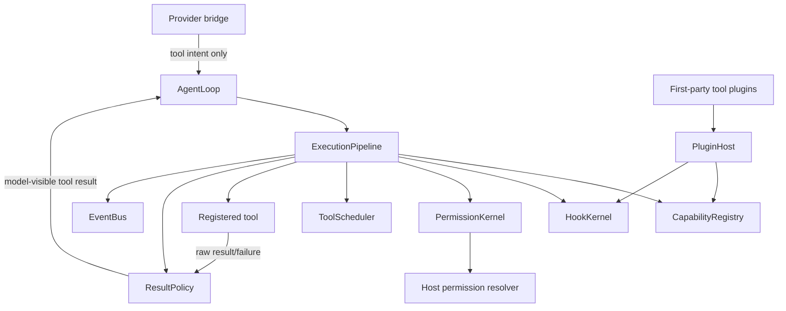
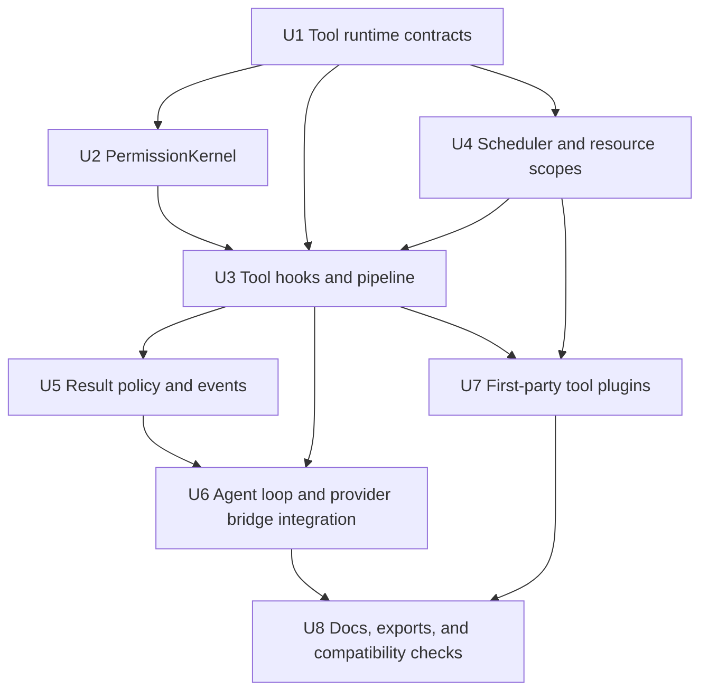
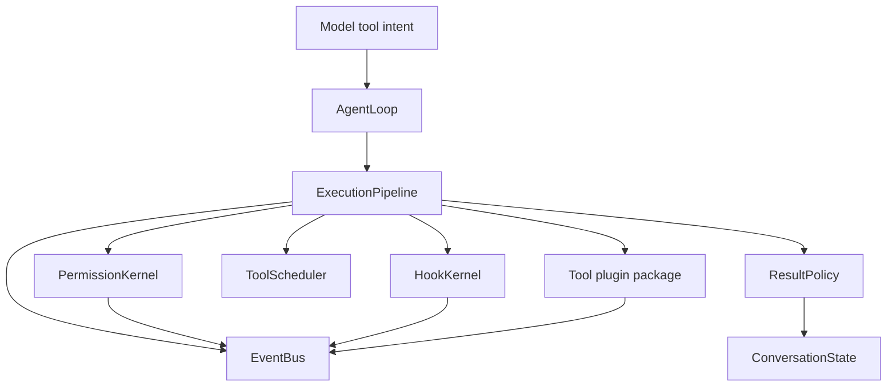

# feat: Add tool plugins and permission runtime

## Summary

本计划将当前 Guga runtime 扩展为一个 core 拥有最终执行权的工具运行时：每个模型产生的 tool intent 都必须进入统一路径，依次完成工具契约校验、hook gate、权限决策、保守调度、真实执行、结果预算和生命周期/audit 事件。Filesystem、shell、git 等 first-party 能力应作为插件包交付，通过与自定义工具相同的 registry 和 pipeline 接入；插件可以采用成熟 npm 包降低 glob、ignore、diff、git wrapper 和 process execution 的基础设施风险，但这些依赖必须停留在 tool plugin backend 内，不能进入 `packages/core` 的 public/runtime boundary。

---

## Problem Frame

M0-M2 已经证明 core loop、plugin host、HookKernel、provider router 和 AI SDK bridge 可以在不泄漏 provider SDK 类型到 core 的前提下工作。M3 进入真实宿主动作阶段：filesystem 写入、shell 命令和 git 操作都不能再被当成普通 registry 函数直接执行，而必须具备权限、审计、预算控制和 fail-closed 行为。

---

## Requirements

- R1. 定义 core-owned tool runtime contract，作为 core、provider bridge 与工具插件之间的稳定边界。
- R2. 扩展 tool definition，使其包含 schema、effect、permission needs、execution mode、resource/concurrency metadata、result budget 和 renderer metadata。
- R3. 确保工具插件通过统一 capability registry 注册，并让 source、enabled/debug metadata 可被 runtime inspection 解释。
- R4. 同名工具覆盖必须显式；外部工具不得静默替换 first-party 工具。
- R5. 实现统一 ExecutionPipeline，覆盖 lookup、schema validation、argument preparation、tool hooks、permission、timeout/abort、execution、normalization、result hooks、result return 和 audit events。
- R6. 保持 provider 边界：provider bridge 只返回 tool intent，绝不执行工具。
- R7. 增加 `tool.call.before`、`tool.execute.before`、`tool.execute.after`、`tool.result.before` hook phase，并定义受控 patch/block/annotation 语义。
- R8. 所有 mutating、blocking 或 permission-relevant hook decision 都必须进入 audit；危险 phase 在 hook 执行不确定时必须 fail closed。
- R9. Schema validation failure、rejection、cancellation、timeout、tool exception 和 oversized output 都必须转换成结构化 tool result，而不是未处理 loop failure。
- R10. 保持 model-visible content 与 runtime/audit metadata 的边界。
- R11. 所有 side-effecting tools 都必须在真实执行前经过 allow / ask / deny 权限语义。
- R12. 支持一次性 allow/deny，以及 session 级 always allow / always reject。
- R13. 被拒绝、取消或 permission timeout 的请求必须回流为 model-visible structured tool result。
- R14. 插件可以参与 permission ask/gate phase，但最终执行权和决策落账属于 core PermissionKernel。
- R15. 工具默认不可并发，除非 metadata/policy 能证明安全。
- R16. 支持 read-only parallel、serial-only、path/resource-scoped 三类调度；重叠写 scope 不得并发。
- R17. 交付 first-party filesystem tools，覆盖 read、write、edit、search、file discovery，并具备 workspace/root containment。
- R18. 交付 first-party shell execution，默认 ask 权限，并具备 workdir/environment safety boundaries。
- R19. 交付 first-party git helpers，覆盖 status、diff 和 commit assistance；排除危险历史改写、push、credentials 和复杂 git workflow automation。
- R20. 应用 result budgets，保证大工具输出被截断、摘要化或转换为最小 artifact/reference，并在模型可见结果中清楚提示。
- R21. 产出足以支撑未来 context policy、host adapters 和 replay 重建行为的 lifecycle/audit events。
- R22. 保持现有 M0/M1/M2 行为：provider-neutral core、plugin lifecycle cleanup、hook failure semantics、model routing 和 AI SDK no-execute tool mapping。
- R23. 在 provider bridge 投影工具给模型前，runtime 必须应用 tool availability / visibility filter；被禁用、缺少 backend、越权或 host policy 不允许的工具不可默认暴露给模型。
- R24. First-party filesystem、shell、git 插件必须定义可替换 execution backend 边界；M3 只实现 local/workspace backend，但 contract 不应把工具长期绑定到单一本地执行环境。
- R25. Interrupt / cancel / batch downgrade 后，每个 accepted tool call 都必须产生真实或 synthetic tool result，保证 conversation state 不出现 orphan tool_call/tool_result。
- R26. M3 必须定义最小 permission mode/profile，用于 default、headless/background deny-all、ask-on-write、trusted-session 等宿主默认策略；不得进入企业 policy engine。
- R27. Tool lifecycle、permission、hook、result event 必须携带足够 correlation fields，例如 runId、turn、toolCallId、attempt、batchId，以支撑 audit、debug 和后续 replay。
- R28. First-party filesystem、git、shell 插件可以引入成熟 npm 包承担 glob、ignore、diff、git wrapper、spawn/output cleanup 等通用能力，但这些依赖必须停留在插件 package 内，不能成为 `packages/core` public/runtime dependency。
- R29. Filesystem 插件应优先复用成熟库处理 glob、ignore、search 和 diff 类基础设施，同时由 Guga 自己控制 workspace containment、symlink 策略、permission、resource scope 和 result budget。
- R30. Git 插件应优先复用受控 git wrapper、diff parser 或薄 subprocess backend 来实现安全 helper，但 runtime 对模型只暴露明确命名的 status、diff、commit assistance 等受控工具，不暴露任意 git command 通道。
- R31. Shell 插件可以复用 process execution / spawn / output cleanup 辅助库，但 AbortSignal、timeout、进程清理、environment policy、permission、result budget 和 lifecycle events 仍由 Guga runtime/tool backend 明确控制。
- R32. 引入第三方库时必须保留可替换 backend 边界；后续宿主应能替换为 sandbox 或 remote backend，而不修改 core contract、provider bridge 或 agent loop。

**Origin actors:** A1 宿主应用开发者, A2 插件作者, A3 Guga core runtime, A4 Permission resolver, A5 模型 provider bridge, A6 规划 / 实施 agent

**Origin flows:** F1 插件贡献工具能力, F2 模型提出工具调用并进入执行管线, F3 敏感工具请求用户或宿主授权, F4 多个工具调用安全调度, F5 工具失败、超时或 hook 失败

**Origin acceptance examples:** AE1 自定义插件工具通过 registry 和 pipeline 执行, AE2 provider tool intent 进入 runtime permission flow, AE3 pre-tool gate 阻断执行, AE4 oversized file read 被预算处理且不隐藏成功状态, AE5 always reject 避免重复 ask, AE6 重叠路径 edit 不并发, AE7 filesystem/shell/git 安全边界, AE8 lifecycle 和 budget events 可重建, AE9 成熟 npm 包只作为 first-party plugin backend 实现细节存在

---

## Scope Boundaries

- M3 不实现 browser tools。
- M3 不实现 MCP tool integration；本阶段只保持 registry/pipeline 形态对后续 MCP 友好。
- M3 不实现 remote sandbox providers、sandbox marketplace 或完整 execution-environment provider system。
- M3 不实现 enterprise policy engine、plugin signing、trust tiers、allowlists 或 marketplace governance。
- M3 不实现完整 context compaction、durable tool result store、semantic memory 或 cross-session replay。
- M3 不实现具体 CLI/Web/IDE permission dialog；只定义 runtime protocol 和事件。
- M3 不实现 multi-agent delegation。
- M3 不实现危险 git history rewrite、remote push、credential management 或复杂 git workflow automation。
- Real provider SDK dependencies 必须继续保持在 `packages/core` 之外。
- Filesystem、git、shell 的成熟 npm 依赖属于 first-party tool plugin backend 选择；本计划不允许这些依赖泄漏进 `packages/core`，也不把任意 shell/git wrapper 直接暴露为模型工具。

### Deferred to Follow-Up Work

- Durable artifact/result store：M3 可定义预算结果所需的最小 reference metadata，但持久化存储属于后续 context/session milestone。
- Host permission UI：M3 暴露 request/response protocol 和事件；具体 adapter 后续渲染 dialog。
- Context policy integration：M3 产出足够的 result-budget facts 给 M4，但不实现 compaction 或 model-input projection policy。
- MCP tools：后续 milestone 应将 MCP tools 适配进本 registry/pipeline，而不是新增平行执行路径。

---

## Context & Research

### Relevant Code and Patterns

- `packages/core/src/contracts/tools.ts` 当前只有 M0/M1 最小形态：name、description、input schema、effect 和 execute。M3 应演进这个 contract，而不是把权限 metadata 分散到别处。
- `packages/core/src/loop/agent-loop.ts` 当前内联执行 `ToolCalled`、`pre_tool.gate`、registry lookup、direct execute 和 `ToolResult`。M3 应抽取 dedicated execution pipeline，让 loop 把每个 tool intent 委托给 pipeline。
- `packages/core/src/hooks/hook-kernel.ts` 当前支持 lifecycle hooks 和 `pre_tool.gate`，具备确定顺序与 fail-closed hook failure 行为。M3 应沿用这个模式扩展 tool call/execute/result phases。
- `packages/core/src/plugin-host/plugin-host.ts` 已追踪 plugin contributions 并在 shutdown 时清理 registry/hook state。Tool plugin metadata 应基于这套 contribution tracking，让 source 和 cleanup 可观察。
- `packages/core/src/registry/capability-registry.ts` 当前对重复 provider/tool/model 注册 fail-fast。M3 应继续禁止静默覆盖，并在需要覆盖时引入显式 override policy metadata。
- `packages/core/src/contracts/events.ts` 当前只有 `tool.called` 和 `tool.result`；M3 需要 queued、permission、started、progress、completed、failed、denied、cancelled、timeout、budget 和 audit-adjacent facts，并为每个 tool event 提供稳定 correlation fields。
- `packages/provider-ai-sdk/src/ai-sdk-tool-mapper.ts` 将 Guga tool definitions 映射为 AI SDK tool specs，但不传 `execute`，这正是 M2 “bridge 不执行工具”规则。
- `.trellis/spec/backend/directory-structure.md` 明确 real tools 不属于 `packages/core`；first-party tools 应是依赖 core 的 packages/plugins。
- `.trellis/spec/backend/error-handling.md` 规定 tool failures 是 model-visible observations，而 hook/control-plane failures 是 runtime failures。
- `.trellis/spec/backend/quality-guidelines.md` 要求 feature-bearing runtime units 有行为测试，并禁止 real provider SDK types 进入 core。
- 根 `package.json` 使用 pnpm workspace 和 TypeScript/Vitest；first-party tool packages 可以拥有自己的 package dependencies，但 root scripts 应继续通过 `pnpm -r typecheck/test/build` 覆盖它们。

### Institutional Learnings

- 当前没有 `docs/solutions/` 目录，因此没有可套用的项目级实施复盘。

### External References

- `docs/research/context-packs/tool-registry.md` 支持统一 tool pool、fail-closed defaults、allow/ask/deny permissions、显式冲突处理、JSON Schema input shape、model-visible tool errors 和 result truncation。
- `docs/research/context-packs/agent-loop.md` 支持保守工具调度：read-only、serial、path-scoped conflict detection，以及工具失败回流给模型。
- `docs/roadmap.md` 定义目标架构：小 core、first-party capabilities as plugins、core-owned PermissionKernel、事件作为 audit/replay facts，以及 core 不内置 real tools。
- `STRATEGY.md` 将本工作锚定在 “tool and permission system” 轨道：agent 必须能行动，但外部行动必须由 runtime 授权并可审计。
- Origin requirements 的成熟库采用约束要求 filesystem、git、shell 插件优先复用成熟 npm 生态，但把这些库限制在 plugin backend 内；本计划因此需要把依赖选型视为 U7 的 backend 决策，而不是 core contract 决策。

---

## Key Technical Decisions

- `packages/core` 保留执行权：contracts、PermissionKernel、ExecutionPipeline、scheduling、result budgeting 和 lifecycle events 属于 core control plane。
- Real first-party tool implementations 放在 `packages/core` 之外：filesystem、shell、git 应作为 plugin packages，通过同一 plugin host 和 capability registry 注册。
- 先扩展 contracts，再实现 runtime behavior：tool metadata、permission request/decision、result budget、renderer metadata 和 resource scope contract 是 pipeline、scheduler 与 first-party tools 的前置基础。
- 用 pipeline delegate 替换 loop 内联执行：`AgentLoop` 继续负责 turn state machine 和 conversation state，`ExecutionPipeline` 负责工具执行生命周期。
- Permission 是 runtime kernel，不是 hook-only convention：插件可以建议或 gate，但 core PermissionKernel 决定并记录是否执行工具。
- 调度优先保守而不是乐观并发：unknown effect、unknown scope、interactive execution 或 path/resource ambiguity 都降级为 serial 或 permission ask/deny。
- Oversized results 采用最小 artifact/reference metadata：M3 支持 model-visible truncation/reference notices，但不承诺 durable result store。
- 保持 M2 bridge no-execute 行为：provider mapping 继续只向模型暴露 tool schemas，不传 executable AI SDK tool handlers。
- Tool pool projection 必须先过滤再给 provider：tool availability / visibility filter 属于 runtime/tool projection 责任，不能让模型默认看到当前 session 不可执行的工具。
- Accepted tool call 必须最终闭环：真实执行、拒绝、取消、跳过、批次降级或中断都要生成对应 tool result，避免后续 provider call 或 context compaction 遇到 orphan tool_call/tool_result。
- First-party tool packages 内部使用 backend interface：local/workspace backend 是 M3 默认实现，后续 sandbox/remote backend 可替换而不改 core contract。
- Permission mode/profile 是 M3 最小策略层：用于宿主和 headless/background agent 的默认行为；复杂 policy engine、trust tier、enterprise governance 继续后置。
- 成熟 npm 包采用“插件内实现细节”策略：filesystem 可采用 glob/ignore/diff/search 辅助库，git 可采用受控 wrapper 或薄 subprocess backend，shell 可采用 spawn/output cleanup 辅助库；core contracts 只表达工具能力、scope、permission、events 和 backend 可替换边界。
- 第三方库不得替代 Guga runtime 的安全控制：workspace containment、permission resolution、AbortSignal/timeout、result budgeting、lifecycle events 和 provider-facing tool schema 仍由 core/pipeline contracts 驱动。

---

## Open Questions

### Resolved During Planning

- First-party tool placement：real filesystem/shell/git capabilities 作为 plugin packages 实现，不放进 `packages/core`；core 保留 runtime contracts 和 pipeline。
- Permission shape：采用 allow / ask / deny，支持 once 和 session-level remembered decisions；enterprise policy out of scope。
- Concurrency model：采用三类 core scheduling modes：read-only parallel、serial-only、path/resource-scoped with overlap detection。
- Result handling：实现 budgeted model-visible output 加最小 reference metadata；durable storage deferred。
- Event direction：扩展当前 `AgentEvent` 模型，而不是在 M3 新增独立 audit channel。
- Tool visibility：在 provider call 前做 tool availability / visibility filter，默认不把不可执行工具暴露给模型。
- Backend boundary：first-party tool 插件内部引入 backend abstraction，M3 默认 local/workspace backend。
- Permission profile：定义最小 profiles 支撑 default/headless/ask-on-write/trusted-session，不进入企业策略。

### Deferred to Implementation

- Exact type and event names：实现时应沿用现有 discriminated-union style，但最终命名由 contract tests 约束。
- JSON Schema validator choice：实现时选择小型 TypeScript-friendly validator，并避免无意导出到 public contracts。
- Symlink handling details：实现时基于平台 API 和测试验证 realpath/root containment 行为。
- Shell command summarization details：实现时选择稳定、适合 permission prompt 的摘要格式，但不要把 UI 文案变成长约束。
- Git commit helper shape：实现时决定 “commit assistance” 是 dry-run message preparation 加显式 commit execution，还是更窄 helper set；必须保留 M3 对危险操作的排除。
- Missing-tool compatibility：实现时决定 unknown tool intents 继续作为 run failure，还是改为 structured tool observation；无论选择哪种，都要用 regression tests 锁定。
- Default shell environment policy：实现时决定第一版环境变量 allowlist/filtering 行为，并写入测试和 README。
- Visibility reason shape：实现时决定被过滤工具的 debug reason 是否进入 event、inspection API 或两者都进入。
- Synthetic result wording：实现时决定 interrupted/cancelled/skipped synthetic tool result 的模型可见文案，并避免把文案变成长约束。
- Backend interface naming：实现时确定 filesystem/shell/git backend interface 名称与文件拆分，保持 public contract 小而清晰。
- Filesystem npm dependency mix：实现时在 fast glob/search、ignore、diff 等候选中选择满足 ESM/TS、维护状态、体积和测试可控性的组合；无论选择哪组库，containment 和 permission 不外包给库默认行为。
- Git backend choice：实现时在 simple git 类 wrapper、diff parser、薄 `git` subprocess backend 之间做最终取舍，标准是安全边界、安装体积、测试可控性和宿主环境假设，而不是最大 git 能力覆盖。
- Shell process helper choice：实现时决定使用 execa/nano-spawn/tree-kill/strip-ansi 类组合还是 Node child_process 加小型清理工具；必须保留 runtime 对 AbortSignal、进程清理、输出预算和事件的控制。

---

## Dependencies / Prerequisites

- M1 plugin host 和 HookKernel 行为必须可用：plugin initialization、capability registration、deterministic hook ordering、hook failure events 和 plugin cleanup 都复用，不重新设计。
- M2 provider runtime 行为必须可用：provider bridge 只把 tool intent 暴露给 core，不向 provider SDK 传 executable tool handlers。
- 当前 TypeScript workspace 和 package boundary 必须保持：`packages/core` 不依赖任何 first-party tool package，而 tool packages 可以依赖 `@guga-agent/core`。
- 默认验证应保持 credential-free：测试使用 mock providers、local fixtures 和临时 workspaces，而不依赖真实 provider credentials 或用户仓库。

---

## Output Structure

```text
packages/
  core/
    src/
      contracts/
        tools.ts
        permissions.ts
        tool-runtime.ts
        events.ts
        hooks.ts
      permissions/
        permission-kernel.ts
        permission-kernel.test.ts
      tools/
        execution-pipeline.ts
        execution-pipeline.test.ts
        tool-scheduler.ts
        tool-scheduler.test.ts
        result-policy.ts
        result-policy.test.ts
        resource-scope.ts
        resource-scope.test.ts
  plugin-tools-filesystem/
    src/
      filesystem-plugin.ts
      filesystem-backend.ts
      filesystem-tools.test.ts
      path-containment.test.ts
      dependency-boundary.test.ts
  plugin-tools-shell/
    src/
      shell-plugin.ts
      shell-backend.ts
      shell-tools.test.ts
      dependency-boundary.test.ts
  plugin-tools-git/
    src/
      git-plugin.ts
      git-backend.ts
      git-tools.test.ts
      dependency-boundary.test.ts
```

具体文件拆分可在实现时微调。固定边界是：core 拥有 pipeline 与 contracts；real tools 位于 first-party plugin packages。

---

## High-Level Technical Design

> *This illustrates the intended approach and is directional guidance for review, not implementation specification. The implementing agent should treat it as context, not code to reproduce.*



控制原则：模型描述意图，插件贡献能力，core 决定真实动作是否执行、何时执行、如何执行。

---

## Implementation Units



- U1. **Tool runtime contracts**

**Goal:** 扩展 core contracts，让 tools、permissions、hooks、scheduler、result budgeting、renderer metadata 和 audit events 共享同一套稳定词汇。

**Requirements:** R1, R2, R3, R4, R7, R10, R15, R20, R21, R23, R24, R26, R27, R32; covers F1, F2, AE1, AE8, AE9

**Dependencies:** None

**Files:**
- Modify: `packages/core/src/contracts/tools.ts`
- Create: `packages/core/src/contracts/permissions.ts`
- Create: `packages/core/src/contracts/tool-runtime.ts`
- Modify: `packages/core/src/contracts/events.ts`
- Modify: `packages/core/src/contracts/hooks.ts`
- Modify: `packages/core/src/contracts/plugins.ts`
- Modify: `packages/core/src/contracts/runtime.ts`
- Modify: `packages/core/src/index.ts`
- Test: `packages/core/src/contracts/contracts.test.ts`

**Approach:**
- 演进 `ToolDefinition`，加入 permission metadata、execution mode、resource scope declaration、result budget、renderer metadata 和 source/debug metadata，同时保留 provider-facing schema mapping。
- 为 tool availability / visibility 增加 metadata 和 filter result contract，让 runtime 能解释工具为什么可见、不可见、禁用或缺少 backend。
- 为 first-party tool backend 增加最小 contract vocabulary，表达 local/workspace backend 能力，但不提前承诺 remote sandbox provider。
- 为 first-party tool backend 增加 dependency boundary vocabulary：core contract 只表达 backend capability/readiness/version metadata，不表达具体 npm package、CLI wrapper 或 process helper。
- 为 permission mode/profile 增加最小 contract vocabulary，表达 default、headless/background deny-all、ask-on-write、trusted-session 等宿主默认策略。
- 增加 permission request/decision/result contracts，表达 tool name、effect、resource/command summary、session/run/turn/call relationship 和 host-renderable metadata。
- 增加 tool hook phase contracts，覆盖 call、execute、result boundaries，并定义 typed patch/block/annotation results 与显式 effect declarations。
- 为 hook phases 增加 timeout 和 abort metadata，确保危险 gate 在 hook 卡住或 run 被取消时可以 fail closed。
- 增加 event contracts，覆盖 tool lifecycle、permission request/decision、hook decision/failure、result budget handling、plugin tool source inspection 和 tool event correlation fields。
- UI rendering 与 durable artifact contracts 不进入 core；renderer metadata 只需足够让未来 host adapter 分类 tool categories。

**Execution note:** 先补 contract tests 和 fixture updates，再改行为；这是其他 package 消费的 public boundary。

**Patterns to follow:**
- `packages/core/src/contracts/provider.ts` 的 compact discriminated unions 与 optional metadata。
- `packages/core/src/contracts/hooks.ts` 的 phase/effect separation。
- `packages/core/src/contracts/events.ts` 的 runtime fact events。
- `.trellis/spec/backend/quality-guidelines.md` 的 public export discipline。

**Test scenarios:**
- Happy path: plugin-contributed tool definition 可以表达 schema、read effect、resource scope、result budget 和 renderer category，且不 import implementation modules。
- Happy path: shell-like tool definition 可以表达 execute effect、ask-by-default permission metadata 和 command summary metadata。
- Happy path: tool definition / registry inspection 可以表达 visibility filter reason，例如 disabled by policy、missing backend、outside workspace。
- Happy path: first-party backend metadata 可以表达 local/workspace backend readiness，而不把 fast-glob、simple-git、execa 等具体实现库类型暴露到 core contracts。
- Happy path: permission profile contract 可以表达 headless/background auto-deny ask behavior。
- Edge case: 缺少 permission/concurrency metadata 的工具仍可表达，但 runtime interpretation 默认 fail-closed。
- Edge case: tool lifecycle event fixture 带有 runId、turn、toolCallId、attempt、batchId 等 correlation fields。
- Error path: tool hook phase 可以表达 timeout/abort 行为，而不依赖 host UI 或 plugin-local conventions。
- Error path: duplicate tool registration 仍为显式错误，而不是静默覆盖 existing first-party tool。
- Integration: `packages/provider-ai-sdk` tool mapper 仍能消费 tool names/descriptions/schemas，且看不到 executable handlers。

**Verification:**
- Core public exports 包含 plugin authors 和 hosts 所需的新 contracts。
- `packages/core/src/contracts` 中没有 real tool implementation 或 provider SDK type。

---

- U2. **PermissionKernel**

**Goal:** 实现 core-owned allow / ask / deny permission evaluation，支持 session-level remembered decisions 和 model-visible denial results。

**Requirements:** R11, R12, R13, R14, R18, R21, R26; covers F3, AE2, AE5, AE7

**Dependencies:** U1

**Files:**
- Create: `packages/core/src/permissions/permission-kernel.ts`
- Create: `packages/core/src/permissions/permission-kernel.test.ts`
- Modify: `packages/core/src/contracts/permissions.ts`
- Modify: `packages/core/src/contracts/runtime.ts`
- Modify: `packages/core/src/contracts/events.ts`
- Modify: `packages/core/src/index.ts`
- Test: `packages/core/src/runtime/agent-runtime.test.ts`

**Approach:**
- 增加 runtime-owned kernel，综合 tool permission defaults、host/runtime policy、plugin gate inputs 和 remembered session decisions 做判断。
- 增加 permission mode/profile 解析，将 default/headless/background/ask-on-write/trusted-session 等最小 profile 映射为 runtime decision defaults。
- 增加 host-supplied permission resolver API，可返回 allow once、deny once、always allow for session、always deny for session。
- 将 deny、cancel 和 permission timeout 归一化为 structured tool results，而不是 run failures，让模型可以选择替代方案。
- 发出 permission-requested 和 permission-resolved events，携带足够 metadata 给 hosts、audit 和未来 replay。
- Enterprise rules、trust tiers、signed plugins 和 marketplace governance 保持 out of scope。

**Execution note:** 在接入真实 shell/filesystem/git tools 前，先实现 permission-deny 和 permission-timeout tests。

**Patterns to follow:**
- `packages/core/src/hooks/hook-kernel.ts` 的 deterministic decisions 和 failure isolation。
- `packages/core/src/runtime/agent-runtime.ts` 的 host-facing options 与 run-scoped event slices。
- `.trellis/spec/backend/error-handling.md` 关于 model-visible tool failures 与 runtime control-plane failures 的边界。

**Test scenarios:**
- Happy path: read-only tool with default allow 不 ask 即执行，并发出 permission decision event。
- Happy path: execute-effect tool with ask default 调用 host resolver，且只在 allow once 后执行。
- Happy path: session 中 always allow 会跳过同一 permission scope 的重复 ask。
- Error path: deny once 返回 structured denied tool result，且不调用 tool execute handler。
- Error path: always reject 对后续匹配 call 直接返回 structured denied tool result，且不再调用 resolver。Covers AE5.
- Error path: permission resolver timeout 或 cancellation 返回 structured not-executed tool result，并发出 timed-out/cancelled permission event。
- Error path: headless/background profile 遇到 ask 型工具时不会等待 UI，按 profile auto-deny、受限 auto-allow，或返回 structured not-executed result。
- Integration: plugin participation 可以影响 ask/gate metadata，但最终 recorded decision 由 PermissionKernel 发出。

**Verification:**
- Side-effecting tools 不经过 PermissionKernel 就无法进入 execution。
- Permission outcomes 同时出现在 returned run events 和相关 model-visible tool observations 中。

---

- U3. **ExecutionPipeline and tool hook phases**

**Goal:** 将工具执行从 `AgentLoop` 中抽出为单一 pipeline，负责 lookup、validation、argument preparation、hooks、permission、execution、normalization、result hooks 和 audit events。

**Requirements:** R5, R6, R7, R8, R9, R10, R14, R21, R22, R25, R27; covers F2, F5, AE1, AE2, AE3, AE4

**Dependencies:** U1, U2, U4

**Files:**
- Create: `packages/core/src/tools/execution-pipeline.ts`
- Create: `packages/core/src/tools/execution-pipeline.test.ts`
- Modify: `packages/core/src/hooks/hook-kernel.ts`
- Modify: `packages/core/src/hooks/hook-kernel.test.ts`
- Modify: `packages/core/src/contracts/hooks.ts`
- Modify: `packages/core/src/contracts/events.ts`
- Modify: `packages/core/src/contracts/tools.ts`
- Modify: `packages/core/src/index.ts`
- Test: `packages/core/src/loop/agent-loop.test.ts`

**Approach:**
- 将 tool lookup 和 execution semantics 放到 `ExecutionPipeline` 后面，让 `AgentLoop` 只负责 turn sequencing 和 conversation state。
- 在 permission 和 execution 前做 schema validation / argument normalization；invalid args 产生 structured tool results。
- 在 permission-sensitive execution planning 前执行 `tool.call.before`，再在真实执行前最后 gate 执行 `tool.execute.before`。
- 在 raw tool result normalization 后执行 `tool.execute.after` 和 `tool.result.before`；post hooks 可 annotate、truncate 或 reference outputs，但不得隐藏真实 failure status。
- 危险 phase 中的 hook failures、hook timeouts 和 run aborts 都按 phase safety requirements fail closed。
- 对 accepted tool call 建立 completion invariant：无论执行、拒绝、取消、跳过、批次降级或中断，都要产出真实或 synthetic tool result。
- 为同一 tool call 的 pipeline events 维护 attempt/batch correlation，使 debug/audit 能串起完整链路。

**Execution note:** 替换 inline execution 前，先围绕当前 `pre_tool.gate` allow/deny 行为添加 characterization tests。

**Patterns to follow:**
- `packages/core/src/loop/agent-loop.ts` 当前 model-visible tool-failure behavior。
- `packages/core/src/hooks/hook-kernel.ts` 当前 deterministic hook ordering。
- `docs/research/context-packs/tool-registry.md` 的 unified validate/permission/hook/execute/result pipeline。

**Test scenarios:**
- Happy path: custom plugin tool 在 registry 中被找到，完成 validation、permission、execution、post-processing，并回流给模型。Covers AE1.
- Happy path: `tool.call.before` 可在执行前应用 allowed argument patch。
- Happy path: `tool.execute.after` 可给成功结果附加 annotation metadata，且不改变 success status。
- Error path: schema validation failure 返回 structured tool result，且不调用 permission resolver 或 execute handler。
- Error path: `tool.execute.before` block 阻止执行，发出 hook decision，并返回 model-visible blocked result。Covers AE3.
- Error path: stalled `tool.execute.before` hook timeout 后发出 hook failure/timeout event，并阻止危险执行。
- Error path: aborted run 将 abort 传播到 hook execution，并且取消后不继续进入 tool execution。
- Error path: tool batch 在部分执行后被 interrupt，剩余 queued calls 获得 synthetic cancelled/skipped result，conversation state 不出现 orphan tool_call/tool_result。
- Error path: tool exception 被归一化为 structured failure，并仍然经过 result policy / observable events。
- Error path: post-tool hook failure 追加 failure annotation/event，但不把底层 tool success 变成无关 runtime failure。
- Integration: provider bridge tool intent 进入此 pipeline；没有 provider-specific branch 执行工具。

**Verification:**
- `AgentLoop` 除了调用 pipeline 外不直接调用 tool handler。
- 所有 pipeline exits 都产出带 status 和 reason 的 tool results/events。

---

- U4. **ToolScheduler and resource scopes**

**Goal:** 增加保守调度，让同一 model turn 中多个 tool calls 能在安全批次中执行，同时避免 path/resource-scoped mutations 冲突。

**Requirements:** R15, R16, R17, R21; covers F4, AE6

**Dependencies:** U1

**Files:**
- Create: `packages/core/src/tools/tool-scheduler.ts`
- Create: `packages/core/src/tools/tool-scheduler.test.ts`
- Create: `packages/core/src/tools/resource-scope.ts`
- Create: `packages/core/src/tools/resource-scope.test.ts`
- Modify: `packages/core/src/contracts/tool-runtime.ts`
- Modify: `packages/core/src/contracts/tools.ts`
- Test: `packages/core/src/loop/agent-loop.test.ts`

**Approach:**
- 定义 scheduler metadata，覆盖 read-only parallel、serial-only 和 resource/path-scoped calls。
- 通过 tool-provided scope extractors 或 declarative metadata，从 validated arguments 解析 tool resource scopes。
- Policy 允许时，将 read-only calls 放进并发 batch；unknown、interactive 或 serial-only calls 顺序执行。
- 检测重叠 path/resource write scopes，阻止并发执行。
- 当 resource scope、effect 或 concurrency safety 无法确定时 fail safe。

**Patterns to follow:**
- `docs/research/context-packs/agent-loop.md` 的 Hermes-style read-only / serial / path-scoped scheduling。
- `docs/research/context-packs/tool-registry.md` 的 fail-closed concurrency defaults。

**Test scenarios:**
- Happy path: 两个没有 side effects 的 read-only tools 在同一 scheduler batch 中执行。
- Happy path: 两个写入 disjoint path scopes 的调用，在 policy 允许 scoped parallelism 时可进入安全批次。
- Edge case: parent/child paths overlap 被视作冲突。
- Edge case: unknown resource scope 降级为 serial execution。
- Error path: interactive/ask-required tools 在 permission resolution 前不并发。
- Integration: 单个 model response 中的 overlapping edit calls 被串行化，而不是并发执行。Covers AE6.

**Verification:**
- Scheduler behavior 可由 tool definitions 加 call arguments 确定性测试。
- 没有重叠 scope 的 path-scoped mutating calls 会并发执行。

---

- U5. **Result policy, budgeting, and lifecycle events**

**Goal:** 归一化工具输出和 lifecycle events，让大输出、失败、partial/progress updates、permission results 和 audit metadata 都能被重建。

**Requirements:** R9, R10, R20, R21, R25, R27; covers F5, AE4, AE8

**Dependencies:** U1, U3

**Files:**
- Create: `packages/core/src/tools/result-policy.ts`
- Create: `packages/core/src/tools/result-policy.test.ts`
- Modify: `packages/core/src/contracts/events.ts`
- Modify: `packages/core/src/contracts/tools.ts`
- Modify: `packages/core/src/contracts/tool-runtime.ts`
- Test: `packages/core/src/events/event-bus.test.ts`
- Test: `packages/core/src/loop/agent-loop.test.ts`

**Approach:**
- 在 raw execution 和 post-execute annotations 后、model-visible result return 前应用 result budgets。
- 将真实 tool status 与 model-visible content、runtime/audit metadata 分开保存。
- 当输出超过预算时，增加 truncation notices 或最小 reference metadata。
- 适用时发出 queued、permission requested/resolved、started、partial/progress、completed、failed、denied、cancelled、timed out、budgeted 等 lifecycle events，并带上稳定 correlation fields。
- 为 synthetic cancelled/skipped results 应用同一 result policy，使中断后的模型可见结果与真实工具结果结构一致。
- Durable storage out of scope；reference metadata 应明确后续可由 host/runtime 管理。

**Patterns to follow:**
- `packages/core/src/events/event-bus.ts` 的 in-memory event recording 和 run-specific slices。
- `packages/core/src/state/conversation-state.ts` 的 model-visible tool result conversion。
- `docs/research/context-packs/tool-registry.md` 的 output truncation/reference guidance。

**Test scenarios:**
- Happy path: 小型成功结果原样通过，并发出 completed lifecycle events。
- Happy path: oversized successful result 被截断或引用，model-visible notice 清楚，且 success status 被保留。Covers AE4.
- Error path: oversized failed result 保留 failure status，并对可见 details 应用 budget policy。
- Error path: denied/cancelled/timed-out results 发出对应 lifecycle events，并成为 model-visible not-executed observations。
- Error path: synthetic interrupted/skipped result 保持 tool_call pairing，并可通过 event correlation fields 与原始 call 对上。
- Integration: event slices 可重建单个 call 的 queued -> permission -> started -> completed -> budgeted 状态。Covers AE8.

**Verification:**
- Model-visible content 不会包含 unbounded tool output。
- Runtime metadata 与发回模型的 content 保持可区分。

---

- U6. **Agent loop, runtime, plugin host, and provider bridge integration**

**Goal:** 将 pipeline 接入现有 runtime，同时不回归 M0/M1/M2 行为和 provider bridge 边界。

**Requirements:** R3, R5, R6, R8, R9, R11, R21, R22, R23, R25, R26, R27; covers F1, F2, F3, F5, AE1, AE2, AE3

**Dependencies:** U1, U2, U3, U4, U5

**Files:**
- Modify: `packages/core/src/loop/agent-loop.ts`
- Modify: `packages/core/src/loop/agent-loop.test.ts`
- Modify: `packages/core/src/runtime/agent-runtime.ts`
- Modify: `packages/core/src/runtime/create-agent-runtime.ts`
- Modify: `packages/core/src/runtime/agent-runtime.test.ts`
- Modify: `packages/core/src/plugin-host/plugin-host.ts`
- Modify: `packages/core/src/plugin-host/plugin-host.test.ts`
- Modify: `packages/core/src/registry/capability-registry.ts`
- Modify: `packages/core/src/registry/capability-registry.test.ts`
- Modify: `packages/provider-ai-sdk/src/ai-sdk-tool-mapper.ts`
- Test: `packages/provider-ai-sdk/src/ai-sdk-mapper.test.ts`
- Test: `packages/provider-ai-sdk/src/ai-sdk-provider.test.ts`

**Approach:**
- 从 runtime-owned registry、HookKernel、PermissionKernel、scheduler、result policy 和 EventBus 构造 ExecutionPipeline。
- 让 `AgentLoop` 通过 scheduler/pipeline 处理一个或多个 tool intents，并把 normalized tool results 追加到 conversation state。
- 扩展 runtime options，让 hosts 可以提供 permission resolver/policy 和 workspace/tool plugin configuration，而不暴露 internals。
- 在 provider call 前应用 tool availability / visibility filter，只把当前 session 可用工具投影给 provider bridge，同时保留 debug/inspection reason。
- 确保 plugin contribution/debug metadata 能解释 builtin、plugin 和 host-injected tool sources。
- 保持 AI SDK bridge mapping 不含 executable handlers，并增加 tool schema projection compatibility tests。

**Execution note:** 先 characterization 现有 M0/M1/M2 tests，再替换 inline tool execution；这里的回归是跨 milestone failure。

**Patterns to follow:**
- `packages/core/src/runtime/agent-runtime.ts` 的 factory/facade pattern。
- `packages/core/src/plugin-host/plugin-host.ts` 的 contribution cleanup。
- `packages/provider-ai-sdk/src/ai-sdk-tool-mapper.ts` 的 no-execute tool mapping。

**Test scenarios:**
- Happy path: 当前 mock provider/test tool run 仍能通过新 pipeline 完成。
- Happy path: plugin provider/tool/hook run 仍能 initialize、execute、dispose 并 cleanup。
- Happy path: AI SDK tool mapper 仍导出 schema-only tool specs，没有 executable handler。Covers AE2's provider boundary.
- Happy path: 被 host policy 禁用、缺少 backend 或 workspace 不允许的工具不会进入 provider-facing tool schema list，并能在 inspection/debug 中解释原因。
- Error path: missing tool behavior 是显式且被 regression-tested 的：要么保留为 `TOOL_NOT_FOUND` run failure，要么有意改为 structured tool observation。
- Error path: dangerous pre-execute phase 的 hook failure 以可观察 runtime error fail closed。
- Error path: headless/background permission profile 下的 ask 型工具不会卡住 run。
- Error path: interrupt/cancel 后所有 accepted tool calls 都有对应 result 进入 conversation state。
- Integration: provider tool intent for shell 进入 PermissionKernel，ask，并且只在 allow 后执行。
- Integration: 同一 runtime 多次 run 后，run events 仍只包含当前 run slice。

**Verification:**
- Existing M0/M1/M2 tests 在 integration 后继续通过。
- Provider packages 不 import 或触发 tool execution。

---

- U7. **First-party filesystem, shell, and git tool plugins**

**Goal:** 将 M3 first-party real-action tools 作为 plugin packages 交付，并使用与 custom tools 相同的 contracts、permission runtime、scheduler 和 result policy。

**Requirements:** R17, R18, R19, R9, R11, R13, R16, R20, R21, R23, R24, R28, R29, R30, R31, R32; covers AE4, AE5, AE6, AE7, AE9

**Dependencies:** U1, U2, U3, U4, U5, U6

**Files:**
- Create: `packages/plugin-tools-filesystem/package.json`
- Create: `packages/plugin-tools-filesystem/tsconfig.json`
- Create: `packages/plugin-tools-filesystem/vitest.config.ts`
- Create: `packages/plugin-tools-filesystem/src/filesystem-plugin.ts`
- Create: `packages/plugin-tools-filesystem/src/filesystem-backend.ts`
- Create: `packages/plugin-tools-filesystem/src/filesystem-tools.test.ts`
- Create: `packages/plugin-tools-filesystem/src/path-containment.test.ts`
- Create: `packages/plugin-tools-filesystem/src/dependency-boundary.test.ts`
- Create: `packages/plugin-tools-shell/package.json`
- Create: `packages/plugin-tools-shell/tsconfig.json`
- Create: `packages/plugin-tools-shell/vitest.config.ts`
- Create: `packages/plugin-tools-shell/src/shell-plugin.ts`
- Create: `packages/plugin-tools-shell/src/shell-backend.ts`
- Create: `packages/plugin-tools-shell/src/shell-tools.test.ts`
- Create: `packages/plugin-tools-shell/src/dependency-boundary.test.ts`
- Create: `packages/plugin-tools-git/package.json`
- Create: `packages/plugin-tools-git/tsconfig.json`
- Create: `packages/plugin-tools-git/vitest.config.ts`
- Create: `packages/plugin-tools-git/src/git-plugin.ts`
- Create: `packages/plugin-tools-git/src/git-backend.ts`
- Create: `packages/plugin-tools-git/src/git-tools.test.ts`
- Create: `packages/plugin-tools-git/src/dependency-boundary.test.ts`
- Modify: `package.json`
- Modify: `pnpm-lock.yaml`
- Test: `packages/core/src/runtime/agent-runtime.test.ts`

**Approach:**
- Filesystem plugin：注册 read、write、edit、search、list/find tools，带 workspace/root containment 和 path-scoped resource metadata。
- Shell plugin：注册 shell execution，默认 ask 权限，带 workspace workdir constraints、command summary metadata、environment filtering policy、timeout/abort handling 和 output budgeting。
- Git plugin：在 workspace 内注册 status、diff 和 commit assistance；默认 M3 tools 排除 push、reset hard、rebase、history rewrite、credentials 和 remote mutations。
- 每个 first-party tool plugin 内部定义 backend interface；M3 提供 local/workspace backend，后续 sandbox/remote backend 可替换。
- 在 plugin package 内选择成熟 npm 包作为 backend 实现细节：filesystem 优先复用 glob/ignore/diff/search 库，git 优先复用受控 wrapper、diff parser 或薄 subprocess backend，shell 可复用 spawn/output cleanup/process-tree cleanup 辅助库。
- 将第三方库包裹在 backend adapter 后面；tool schema、permission effect、resource scope、result budget 和 lifecycle events 仍由 Guga contract/pipeline 生成，不能由第三方库默认行为决定。
- 在 package manifests 和 dependency-boundary tests 中锁定依赖方向：`packages/plugin-tools-*` 可以依赖这些库和 `@guga-agent/core`，`packages/core` 不能依赖或 re-export first-party tool backend dependencies。
- Tool availability 与 backend readiness 进入 plugin registration/inspection：缺少 workspace、backend unavailable 或 host policy 禁用时，工具不应默认投影给模型。
- 所有 first-party tools 都声明 renderer category metadata，方便未来 host adapter 表达 read/edit/search/execute/git categories。
- 复用 core result budget 和 lifecycle events，不引入 tool-local truncation/event conventions。

**Execution note:** 先实现 filesystem containment 和 shell permission tests，再扩展 broad happy-path coverage；这些是最高风险安全边界。

**Patterns to follow:**
- `packages/provider-ai-sdk` package boundary：first-party package depends on `@guga-agent/core`，core 不依赖它。
- `packages/core/src/testing/example-plugin.ts` 的 plugin authoring style。
- `.trellis/spec/backend/directory-structure.md` 中 real tools 不进入 `packages/core` 的规则。

**Test scenarios:**
- Happy path: filesystem read inside workspace 返回 content 和 read renderer metadata。
- Happy path: filesystem plugin 使用 local/workspace backend 执行，测试可替换 backend double 而不改 core。
- Happy path: filesystem search/list 通过 plugin-local glob/ignore backend 工作，但 containment 在 Guga adapter 层先执行，outside-root path 不会交给底层库扩展。
- Happy path: filesystem write/edit inside workspace 使用 path-scoped write metadata，并在 permission policy allow 后成功。
- Happy path: search/list tools 在 workspace 下发现文件，并遵守 result budgets。
- Happy path: git status/diff 通过受控 backend 执行，模型只看到 Guga 定义的 status/diff tool schema，看不到任意 git command surface。
- Edge case: relative paths、`..` traversal、symlinks resolving outside root、platform path separators、hidden files 和 absolute outside-root paths 都遵循已文档化的 containment policy。Covers AE7.
- Error path: shell command 默认 ask，deny 时不执行。
- Error path: shell backend unavailable 时工具从 provider-facing tool pool 过滤，或返回明确不可用 reason。
- Error path: shell execution 只接收已文档化的 environment variables，默认不能静默继承敏感 host environment。
- Error path: shell timeout/abort 返回 structured result 和 lifecycle events。
- Error path: shell process helper timeout、abort 或 cleanup failure 不会绕过 Guga result policy，并产生对应 lifecycle/error metadata。
- Happy path: git status 和 diff 是 read-only，默认 policy 下不要求危险权限。
- Error path: dangerous git operations 不出现在 default tools 中，或被 metadata/policy deny。Covers AE7.
- Integration: package dependency checks 证明 mature npm dependencies 只存在于 `packages/plugin-tools-*`，`packages/core` public exports 不泄漏这些库的 types。Covers AE9.
- Integration: overlapping filesystem edits 不被并发调度。Covers AE6.
- Integration: oversized file read 或 shell output 被预算处理，并带可见 truncation/reference notice。Covers AE4.
- Integration: host 禁用 git commit helper 时，status/diff 仍可见，commit assistance 不投影给模型或带明确 disabled reason。

**Verification:**
- First-party tools 可作为 plugins 启用，无需修改 core loop code。
- Safety tests 证明 workspace containment、shell ask behavior、git boundaries 和 path conflict behavior。

---

- U8. **Docs, exports, compatibility, and milestone verification**

**Goal:** 更新 public documentation、package exports 和 regression coverage，让 M3 可理解、可移植，并可交给实现阶段。

**Requirements:** R1, R3, R4, R6, R10, R20, R21, R22, R23, R24, R25, R26, R27, R28, R29, R30, R31, R32; covers AE1-AE9

**Dependencies:** U1, U2, U3, U4, U5, U6, U7

**Files:**
- Modify: `packages/core/README.md`
- Modify: `packages/provider-ai-sdk/README.md`
- Create: `packages/plugin-tools-filesystem/README.md`
- Create: `packages/plugin-tools-shell/README.md`
- Create: `packages/plugin-tools-git/README.md`
- Modify: `.trellis/spec/backend/directory-structure.md`
- Modify: `.trellis/spec/backend/error-handling.md`
- Modify: `.trellis/spec/backend/quality-guidelines.md`
- Test: `packages/core/src/contracts/contracts.test.ts`
- Test: `packages/core/src/loop/agent-loop.test.ts`
- Test: `packages/core/src/runtime/agent-runtime.test.ts`
- Test: `packages/provider-ai-sdk/src/ai-sdk-mapper.test.ts`

**Approach:**
- 文档化 M3 runtime boundary：provider intent -> core pipeline -> permission -> scheduler -> tool plugin -> result policy -> conversation state。
- 文档化 tool visibility filter、permission profiles、backend boundaries、synthetic results 和 event correlation invariants。
- 文档化 first-party tool package usage 和 security boundaries，但不暗示 host UI 或 enterprise policy 已完成。
- 文档化成熟 npm 包采用原则：依赖在 first-party plugin backend 内，core 不依赖、不 re-export、不用第三方库决定权限、scope、budget 或 audit 语义。
- 仅在实现确认实际约定后更新 backend specs，尤其是 package boundaries 和 error/result handling。
- 增加映射 AE1-AE9 的 milestone-level regression coverage。

**Patterns to follow:**
- `packages/core/README.md` 当前 milestone scope language。
- `.trellis/spec/backend/*` 作为 actual-convention documents，而不是 aspirational architecture docs。

**Test scenarios:**
- Integration: custom plugin tool 和 first-party tool 都通过同一 registry/pipeline 执行。
- Integration: provider bridge tool intent 在 runtime pipeline 接管前保持 schema-only。
- Integration: 分别覆盖 permission deny、hook block、tool failure、timeout/abort、result budget、path conflict、visibility filter、synthetic cancelled result、permission profile 和 lifecycle reconstruction。
- Integration: dependency boundary verification 覆盖 plugin-local mature npm dependencies 不进入 `packages/core`，且 docs 清楚说明第三方库只是 backend implementation detail。Covers AE9.
- Regression: existing M0/M1/M2 tests 继续通过。

**Verification:**
- Docs 解释 hosts 如何启用 first-party tool plugins，以及 plugin authors 如何贡献 custom tools。
- Package exports 暴露 public contracts，但不泄漏 implementation helpers 或 real provider SDK types 到 core。

---

## System-Wide Impact

- **Interaction graph:** ProviderRouter 和 provider bridges 产出 tool intent；AgentLoop 委托 ExecutionPipeline；ExecutionPipeline 协调 CapabilityRegistry、HookKernel、PermissionKernel、ToolScheduler、ResultPolicy、EventBus 和 ConversationState。
- **Error propagation:** Tool validation/execution/permission failures 应成为 model-visible tool results；dangerous phases 的 hook failures 和 provider failures 保持 structured runtime failures。
- **State lifecycle risks:** Session-level remembered permissions 必须限定在 runtime/session 内，并随 runtime disposal 清理；plugin-contributed tools/hooks 仍必须由 PluginHost shutdown 清理。
- **Visibility lifecycle risks:** 工具启用状态、backend readiness 和 host policy 变化会影响 provider-facing tool pool；runtime 必须能解释过滤原因，避免模型看到不可执行工具。
- **Interrupt lifecycle risks:** 中断可能发生在 queued、permission、started 或 post-processing 任一阶段；每个 accepted tool call 都需要最终 result 才能保持 message pairing。
- **API surface parity:** Core contracts、provider tool mapping、plugin context、runtime options 和 first-party plugin packages 都需要相同的 expanded metadata vocabulary。
- **Dependency boundary:** Mature npm dependencies for glob/ignore/diff/git/spawn belong to first-party plugin backend packages only; core surfaces backend capability metadata and runtime decisions, not library-specific types or behavior.
- **Integration coverage:** 单元测试不足以证明 M3；milestone tests 应覆盖 provider intent -> visibility filter -> permission -> tool execution/cancel -> result return -> final answer 和 event reconstruction。
- **Unchanged invariants:** `packages/core` 必须继续不含 provider SDK 和 real tool implementation；provider bridges 不执行工具；plugin lifecycle cleanup 必须保持 deterministic。



---

## Risks & Dependencies

| Risk | Mitigation |
|------|------------|
| Contract expansion breaks M0/M1/M2 callers | 先补 contract/characterization tests，并保留 schema-only provider mapper behavior。 |
| First-party tools accidentally bloat core | 将 real tools 保持在 `packages/plugin-tools-*`；core 只拥有 contracts 和 runtime kernels。 |
| Permission ask semantics become host UI design | Permission request metadata 保持 host-renderable 但 UI-neutral；具体 dialogs 留给 adapters。 |
| Symlink/root containment bugs allow workspace escape | 在 broad filesystem happy paths 前增加 focused realpath/path traversal tests。 |
| Parallel scheduling races mutating tools | Unknowns 默认 serial，并测试 parent/child path overlap。 |
| Result budgeting hides true tool status | 将 raw status/runtime metadata 与 model-visible content 分离，并测试 success/failure budget cases。 |
| Hook/plugin failures obscure safety decisions | 发出 hook decision/failure events，并在 dangerous pre-execute phases fail closed。 |
| 模型看到当前 session 不可执行的工具 | 在 provider call 前应用 visibility filter，并记录 disabled/missing-backend/policy-denied reason。 |
| 中断后留下 orphan tool_call/tool_result | 对 queued/running/cancelled/skipped calls 生成真实或 synthetic result，并用 pairing regression test 锁定。 |
| Backend 抽象不足导致后续 sandbox/remote 改动破坏插件 contract | M3 只实现 local/workspace backend，但 first-party 插件内部先通过 backend interface 调用。 |
| 成熟 npm 包把安全语义外包给第三方默认行为 | 只把库用作 backend helpers；containment、permission、timeout、budget、events 和 schema projection 由 Guga adapter/runtime 测试锁定。 |
| Plugin dependency 泄漏进 core public surface | 增加 dependency-boundary checks，确保 `packages/core` 不依赖、不 re-export、不暴露 fast-glob/simple-git/execa 等库类型。 |

---

## Documentation / Operational Notes

- 更新 package READMEs，展示 first-party tools 通过 plugins 启用，而不是由 core import。
- README 应说明 tool visibility filter、permission profiles、backend boundary 和 synthetic cancelled/skipped results 的行为边界。
- First-party tool package README 应记录所选成熟 npm 包的职责边界：哪些能力由库处理，哪些安全与 runtime 语义必须由 Guga adapter 控制。
- 仅在 implementation 确认 actual conventions 后更新 backend specs。
- M3 默认测试不应要求真实 provider API keys；provider/tool integration 可使用 mock providers 和 local tool fixtures。
- CI verification 应覆盖 core、provider bridge 和新 first-party tool packages 的 workspace typecheck、tests、build。

---

## Alternative Approaches Considered

- 将 first-party tools 直接放进 `packages/core`：拒绝，因为 roadmap 和 backend specs 将 core 限定为 contracts/control plane，real tools 应作为 plugins。
- 将 permissions 仅当作另一类 hook phase：拒绝，因为 origin 要求 core-owned PermissionKernel 拥有最终执行权和 auditable decisions。
- M3 中所有 tools 都 serial：拒绝，因为 origin 要求 safe concurrency；采用 fail-closed defaults 的 conservative batching。
- 现在加入 durable artifact store：拒绝，因为 M3 只需要 minimal result reference semantics；durable store 属于 context/session milestones。
- 让 provider bridge 直接看到所有 registry tools：拒绝，因为不可用工具会诱导模型发起必失败调用；provider-facing tool pool 必须按 session/policy/backend 过滤。
- 将 filesystem/shell/git 直接绑定本地 Node APIs：拒绝，因为 deepagentsjs 类架构证明 backend/sandbox 边界会成为后续替换点；M3 只实现 local backend，但保留接口边界。
- 完全自研 glob、ignore、diff、git wrapper 和 process cleanup 基础设施：拒绝，因为 origin 明确要求 first-party tool plugin 优先采用成熟库降低踩坑风险；Guga 的差异化在 runtime 权限、审计、调度和边界，而不是重写通用底层工具。
- 直接向模型暴露任意 shell/git wrapper：拒绝，因为第三方库只应提供 backend 原语；模型可见工具必须是 Guga 定义的明确 effect、scope 和 permission surface。

---

## Success Metrics

- AE1-AE9 可通过不依赖真实外部 provider credentials 的自动化测试证明。
- 每次真实工具执行都有 observable lifecycle，并在适用时具备 permission decision。
- 所有 side-effecting first-party tools 在执行前都经过 PermissionKernel。
- 大工具输出不能不受限地进入 model-visible content。
- Provider-facing tool pool 已经过 visibility filter，且 runtime inspection 能解释每个过滤原因。
- Interrupt/cancel 后 conversation state 中没有 orphan tool_call/tool_result。
- Headless/background permission mode 不会因 ask 型工具卡住 run。
- Tool lifecycle events 可通过 correlation fields 重建单次 call 的完整链路。
- Mature npm dependencies 只出现在 first-party tool plugin packages；`packages/core` 不依赖、不 re-export、不暴露这些依赖的 public types。
- Filesystem/git/shell backend tests 证明第三方库只是实现细节，Guga adapter 仍控制 containment、permission、timeout、budget 和 lifecycle semantics。
- Existing M0/M1/M2 regression tests 继续通过。

---

## Sources & References

- **Origin document:** [docs/brainstorms/2026-05-26-m3-tool-plugins-permission-runtime-requirements.md](../brainstorms/2026-05-26-m3-tool-plugins-permission-runtime-requirements.md)
- **Task PRD:** [.trellis/tasks/05-26-m3-tool-plugins-permission-runtime/prd.md](../../.trellis/tasks/05-26-m3-tool-plugins-permission-runtime/prd.md)
- **Strategy:** [STRATEGY.md](../../STRATEGY.md)
- **Roadmap:** [docs/roadmap.md](../roadmap.md)
- **M1 plan:** [docs/plans/2026-05-26-002-feat-plugin-host-hook-kernel-plan.md](2026-05-26-002-feat-plugin-host-hook-kernel-plan.md)
- **M2 plan:** [docs/plans/2026-05-26-003-feat-provider-ai-sdk-bridge-plan.md](2026-05-26-003-feat-provider-ai-sdk-bridge-plan.md)
- **Backend spec:** [.trellis/spec/backend/directory-structure.md](../../.trellis/spec/backend/directory-structure.md)
- **Backend error handling:** [.trellis/spec/backend/error-handling.md](../../.trellis/spec/backend/error-handling.md)
- **Backend quality:** [.trellis/spec/backend/quality-guidelines.md](../../.trellis/spec/backend/quality-guidelines.md)
- **Tool registry research:** [docs/research/context-packs/tool-registry.md](../research/context-packs/tool-registry.md)
- **Agent loop research:** [docs/research/context-packs/agent-loop.md](../research/context-packs/agent-loop.md)
