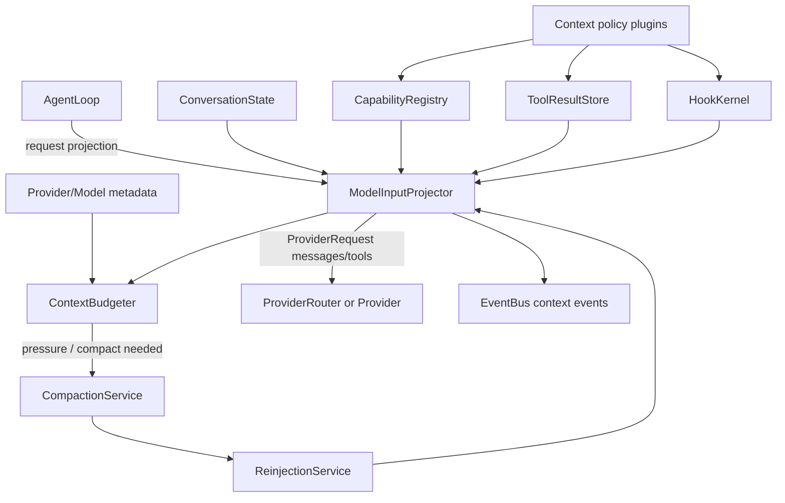
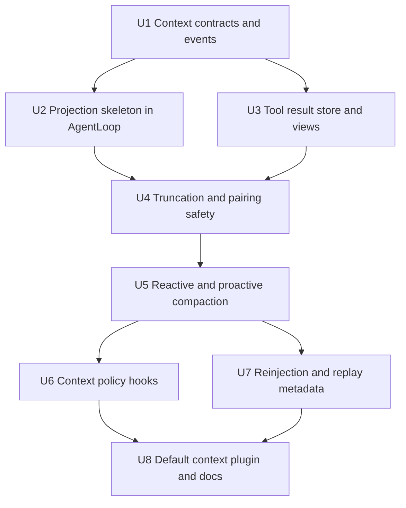
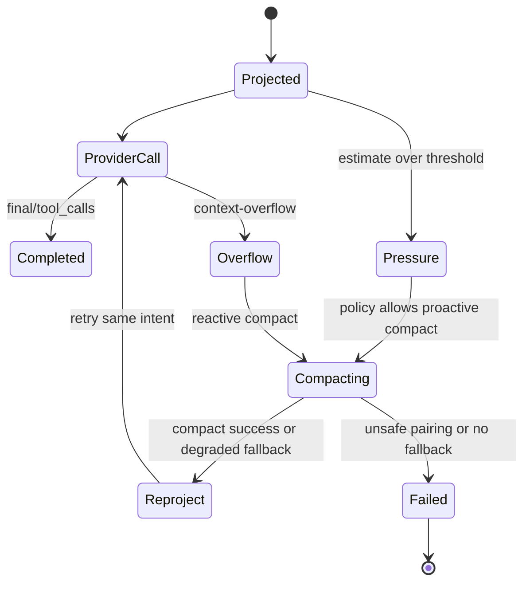

# feat: Add context policy plugins

## Summary

本计划将 M4 落成一个可审计的模型输入投影系统：`AgentLoop` 不再直接把 `ConversationState.snapshot()` 作为 provider request，而是通过 context contracts、projection assembler、tool result views、budget/compaction/reinjection policies 生成 `ModelInputProjection`。实现按 M4a-M4e 分阶段推进，但收窄首版范围：M4a/M4b 保守落地 projection skeleton、tool result store/views 和 pairing safety；M4c 明确 compaction 默认阈值与 summary contract；M4d 只用一个 first-party default context plugin 证明可替换策略边界；M4e 增加最小 projection/context decision 账本，为 M5 replay 做准备。

---

## Problem Frame

M0-M3 已经让 Guga 具备 core loop、provider bridge、plugin host、HookKernel、tool pipeline、permission runtime 和 result budget 的基础。M4 的风险在于：如果模型输入仍由 loop 临时拼装，工具输出、history、pending、resources、skills、summary 和 host context 会混在同一个 messages 数组里，后续 compaction、replay、audit 和 session recovery 都缺少可信边界。

---

## Assumptions

*本计划没有经过单独的写入前同步确认；以下内容是为填补 planning gap 做出的推断，实施前应重点复核。*

- M4 的第一版落在当前 TypeScript workspace 内，主要修改 `packages/core` 并新增一个 first-party default context plugin；不引入真实 provider credential、远端对象存储或 UI adapter。
- M4 不等待 M5 artifact/session store 完成；先定义可替换 `ToolResultStore` / `ContextDecisionStore` 边界，并提供内存或 workspace-safe reference adapter。
- M4 不完成完整 session store，但会持久记录最小 projection/context ledger：projection descriptor、policy decisions、compaction boundary、projection hash 和 source refs。
- LLM summary 不是 M4 的唯一成功路径；compaction service 必须支持 auxiliary model summary 可用时使用，不可用时降级为结构化 local truncation/snip summary。
- Projection hash 默认基于 source id、kind、priority、content hash、policy decision hash 和 model metadata 生成，不把完整敏感内容直接写入 hash/audit payload。

---

## Requirements

- R1. 定义 `ModelInputProjection` 作为 provider request 前的唯一模型输入边界。
- R2. 区分 durable facts 与 model-visible messages，summary 不替代 event、tool result 或 artifact。
- R3. Projection 记录 source metadata、token estimate、reserved output budget、policy decisions、projection hash 和 provider/model context 信息。
- R4. Projection sources 覆盖 system/developer prompt、history、pending、tool result preview、artifact reference、resource file、skill body、plan/todo、compaction summary 和 host context。
- R5. `AgentLoop` 的模型输入统一通过 projection 生成，不再散落 prompt 拼接。
- R6. Projection 超预算产生结构化 context-pressure event。
- R7. 工具结果拆成 raw result、LLM preview、UI projection 和 audit metadata。
- R8. 大工具结果进入模型前经过 budget、截断、摘要化或 artifact reference。
- R9. Tool preview 说明省略内容、保留内容和重读方式。
- R10. shell/test、search、file read、diff 等工具类型可使用不同 preview 策略。
- R11. 工具结果治理保留 tool call/result 配对和 lifecycle correlation。
- R12. 支持 provider context overflow / prompt too long 后 compact 并重试当前用户意图。
- R13. 支持基于 usage 或 projection estimate 的 proactive compaction。
- R14. Compaction 保护 system messages、pending turn、未闭合工具轮次和 recent tail。
- R15. Compaction 避免 orphan tool call/tool result；非法配对必须修复、保守保留或拒绝压缩。
- R16. Compaction result 包含 summary、boundary、trigger、pre/post token、retained sources、cutoff/parent 和失败信息。
- R17. Compact 失败产生可见 error event，并可降级到更保守的 local truncation。
- R18. Compact 后恢复活动文件/资源、plan/todo、active skills、active tools、permission mode 和 host context。
- R19. Reinjection 不把低优先级历史摘要提升为 system/developer instruction。
- R20. Compact boundary、summary 和 reinjected sources 可投影给 UI/replay/audit consumer。
- R21. 压缩后 agent 能继续当前任务，保留下一步操作上下文。
- R22. 支持 `resources.discover`、`context.assemble`、`context.budget`、`context.truncate`、`context.compact.before`、`context.compact.after`、`context.reinject` hook phase。
- R23. Context policy hook 声明 phase、effect、priority、timeout、permission scope 和可审计身份。
- R24. Context policy hook 只能贡献 source、返回 typed patch、gate decision 或 annotation，不直接 mutate event log、conversation state 或 provider request。
- R25. Mutating、blocking 或 compaction-relevant hook decision 进入 runtime/audit event。
- R26. Session reload、fork、switch 或 replacement 后旧 hook context 失效。
- R27. M4 拆成 M4a-M4e：projection skeleton、tool result budget、reactive compaction、policy hooks、post-compact reinjection/replay readiness。
- R28. M4a 只需预算检查和最近窗口保护，不要求 LLM summary。
- R29. M4b 先解决大工具结果落盘/preview/reference，再进入通用 compaction。
- R30. M4c 将 context overflow 变成可恢复分支，并定义 `warningThreshold`、`compactThreshold`、`minCompressionGain`、`maxCompactFailures`、`cooldownTurns` 和 `reactiveRetryLimit` 的保守默认值。
- R31. M4c 的 summary contract 至少覆盖目标、已完成、当前阻塞、下一步、关键文件/符号、工具结果引用、未解决问题和用户约束。
- R32. M4d 用一个 first-party default context plugin 证明不改 core 也能新增/替换 context policy；多插件拆包后置。
- R33. M4e 为 M5 projection replay 准备最小 ledger、source list、projection hash 和 context decisions。
- R34. Compaction 之前必须先跑本地预处理流水线（content-hash 去重、Smart Collapse 已完成 tool round、parameter truncation），无论 LLM summarizer 是否可用；预处理足以将 estimate 降到阈值以下时，不再调用 summarizer，并在 compact result 中标记 `degradedTo = "none"`。
- R35. Summarizer 自身返回 context-overflow / prompt-too-long 时，按 `summaryStripFraction` 增量剥离最老可压缩 round 重试，最多 `summaryStripRetryLimit` 次；超出后降级到 local skeleton fallback。该循环独立于 `reactiveRetryLimit`。
- R36. 每条 summary 记录携带 `iterationNo`、`parentSummaryRef`、`preprocessingApplied`、`strippedRoundIds` 和 `degradedTo`；多次 compact 时 summarizer 输入必须包含上一份 summary descriptor，保证 multi-compact session 的摘要单调延续且 projection hash 可复现。
- R37. 并行 tool batch 的 pairing 不可分割：同一 assistant 响应内的 N 个 tool_call/tool_result 必须整批保留或整批 snip；snip 时为缺失 sibling 补 synthetic placeholder result 以维持 pairing 合法，并落带 batchId、retained/snipped tool_call_id 的 typed decision event。

**Origin actors:** A1 宿主应用开发者, A2 插件作者, A3 Guga core runtime, A4 Tool runtime, A5 Provider bridge / router, A6 Host UI / replay consumer, A7 规划 / 实施 agent

**Origin flows:** F1 组装一次模型输入 projection, F2 大工具结果进入模型前被治理, F3 Context overflow 后恢复当前用户意图, F4 压缩后恢复工作台状态, F5 Context policy 作为插件参与而不篡改事实源

**Origin acceptance examples:** AE1 projection 可解释来源, AE2 5MB 工具结果只进入 preview/reference, AE3 overflow 后 compact 且 pairing 合法, AE4 compact 失败可见并降级, AE5 auto compact 后复灌当前工作状态, AE6 context hook decision 可审计, AE7 stale hook context 被拒绝, AE8 分阶段交付支撑 M5 replay

---

## Scope Boundaries

- M4 不实现长期记忆、用户偏好自动提炼、跨 session semantic memory。
- M4 不实现 vector search、FTS/session search 或历史会话检索 UI。
- M4 不完成 M5 append-only session event store、artifact store、session resume、fork 或 tree navigation；但必须提供最小 projection/context ledger，用于持久记录 projection descriptor、policy decisions、compaction boundary、projection hash 和 source refs。
- M4 不实现 M6 skills/MCP marketplace；只允许 context policy 接收 resource discovery contributions。
- M4 不实现 M8 enterprise context policy 管理、trust model、summary quality eval、sensitive data filtering 或 audit export。
- M4 不新增真实 provider SDK dependency 到 `packages/core`。
- M4 不把 first-party context plugin 的实现细节反向耦合进 `packages/core`。

### Deferred to Follow-Up Work

- Durable artifact/session store：M4 定义接口和最小 adapter，并只持久化 projection/context ledger；M5 负责完整 session persistence、resume、fork 和 tree navigation。
- Summary quality evaluation：M4 记录 summary metadata 和 failure，M8 再做质量评分、回归 eval 和 enterprise audit export。
- Sensitive data filtering：M4 的 hook/audit 形态给过滤器留入口，具体企业策略后置。
- Session search / memory：等 projection、compaction、event replay 稳定后再引入检索式上下文。

---

## Context & Research

### Relevant Code and Patterns

- `packages/core/src/loop/agent-loop.ts` 当前在每轮 provider call 前直接使用 `state.snapshot()` 和 visible tool list；M4 应在这里插入 projection assembler，并让 `ModelRequested` 事件关联 projection metadata。
- `packages/core/src/state/conversation-state.ts` 当前是单一 messages 数组；M4 不需要一次性完成完整 L1 system/history/pending 重构，但必须提供 pending/recent-tail/tool-pairing projection 边界。
- `packages/core/src/contracts/provider.ts` 已有 `ModelMetadata.contextWindow`、`maxOutputTokens`、`Usage` 和 `ProviderErrorCategory.ContextOverflow`，可直接支撑 budget、pressure 和 overflow recovery。
- `packages/core/src/tools/result-policy.ts` 已有 `BudgetedToolResult`、`ToolResultReference` 和 `ToolResultBudgeted` 事件；M4 应升级为 raw/preview/UI/audit 多视图和可替换 result store。
- `packages/core/src/contracts/hooks.ts` 与 `packages/core/src/hooks/hook-kernel.ts` 已有 deterministic ordering、effect、timeout、failure event 和 tool/model hook 模式；context hooks 应沿用这套 discriminated-union 风格。
- `packages/core/src/contracts/plugins.ts`、`packages/core/src/plugin-host/plugin-host.ts` 和 `packages/core/src/registry/capability-registry.ts` 当前支持 provider/model/tool/hook capability；M4 应扩展 context policy capability，而不是让插件绕过 registry。
- `packages/provider-ai-sdk/src/ai-sdk-provider.ts` 将 core `ProviderRequest` 映射给 AI SDK；M4 应保持 provider bridge 只消费 projection 后的 request，不让 provider bridge 承担 context assembly。
- M3 plan 已明确 `ResultPolicy` 只是最小 reference metadata，durable result store 属于后续 context/session milestone；M4 正是该边界的落点。

### Institutional Learnings

- 当前没有 `docs/solutions/` 目录，因此没有可套用的项目级实施复盘。

### External References

- `docs/agent-context-management.md`：确认 context 的主线是 L1 分层、L2 工具输出治理、L3 compaction、L4 event/replay，且 summary 不是事实源。
- `docs/research/context-packs/context-compression.md`：确认 context budget、工具结果截断、tool pairing safety、compact boundary 和 post-compact reinjection 是跨项目共同模式。
- `docs/research/context-packs/agent-loop.md`：确认 overflow recovery、pre-request message cleaning、retry 当前意图和 tool call/result 配对修复属于 loop 集成风险点。
- `docs/research/context-packs/tool-registry.md`：确认工具输出预算、progressive skills loading、hook interception 和 fail-closed permission 是 context 的上游约束。
- `docs/research/context-packs/provider-abstraction.md`：确认 context window、reserved output、auxiliary model routing 和 overflow taxonomy 应从 provider/model metadata 进入 budgeter。
- `STRATEGY.md`：将本计划锚定在“上下文与提示词平台”工作轨道，目标是 projection、compression、source tracking 和 replay。

---

## Key Technical Decisions

- Projection belongs in core; policy behavior can be plugins：`packages/core` 拥有 `ModelInputProjection`、source ordering、budget pressure event 和 provider request boundary；M4 首版只提供一个 first-party default context plugin 贡献 sources、preview、truncate、compact 和 reinject decisions，多插件生态后置。
- Extend `ResultPolicy` into a view-producing result governance path：M3 的 single-string budget 是基础，M4 将其升级为 raw result store + LLM preview + UI projection + audit metadata，避免把工具输出当作一种通用字符串。
- Pairing safety runs before provider request and before compaction：provider request 前保证合法 messages，compaction 前再做一次更保守的修复/保留/拒绝，以覆盖历史替换和 hook patch 的副作用。
- Reactive overflow is handled at loop recovery boundary：provider 返回 `context-overflow` 后，loop 记录失败事件，调用 compaction/reprojection，再重试同一用户意图；不能由 provider bridge 私自吞掉。
- Proactive pressure is policy-driven with conservative defaults：默认根据 `contextWindow - reservedOutputBudget`、上一轮 `Usage` 和 projection estimate 触发 pressure event；M4c 固化一组可覆盖的默认阈值、防抖和重试限制，context policy 只能在安全边界内调整。
- Context hooks use typed decisions, not mutation：context hooks 和现有 tool hooks 一样通过 contribution/patch/gate/annotation 返回结果，HookKernel 记录 mutating/blocking/compaction-relevant decisions。
- Replay metadata records source identity and hashes, not raw everything：M4 记录 enough-to-replay 的 source list、policy decisions、projection hash、parent/cutoff/boundary，并写入最小 projection/context ledger；完整 artifact/session persistence 交给 M5。
- One default context plugin proves the ecosystem shape：`plugin-context-default` 以插件方式注册默认 context policy，不改 core 即可替换策略；`basic/tool-results/truncation/compaction/reinjection` 的多包拆分延后到后续工作。
- Pre-summary preprocessing 是 first-class step，不是 fallback：dedup + Smart Collapse + parameter truncation 默认开启，目的是在调用 LLM summarizer 前先免费砍 30%-50% token，避免首版 compaction 又贵又慢。
- Summarizer overflow 是独立的可恢复分支：summarizer 自身爆窗时按 `summaryStripFraction` 增量剥离最老 round 重试，避免出现"想压缩压缩不动"的死循环；外层用户意图重试由 `reactiveRetryLimit` 单独管理。
- Iterative summary 必须显式延续：每条 summary 携带 `iterationNo` 和 `parentSummaryRef`，下一次 compaction 把上一份 summary 作为种子；这是 R33 projection hash 可复现性的必要条件，不能依赖 summarizer 自发保持一致。
- 并行 tool batch 是不可分割的 pairing 单位：snip 必须整批进行，部分剪裁要么补 synthetic placeholder 要么拒绝压缩，避免 N-of-M parallel orphan。

---

## Open Questions

### Resolved During Planning

- `ModelInputProjection` 最小字段如何与现有 contracts 对齐：使用 `CoreMessage[]` 和 `ToolDefinition[]` 作为 provider-visible payload，新增 source metadata、budget、policy decision 和 hash，而不是发明第二套 provider message 类型。
- Proactive compaction 阈值采用什么策略：采用 policy-configured 组合策略，默认基于 provider/model context window、reserved output、projection estimate 和上一轮 usage；低风险阶段只发 pressure event，高风险阶段由 compaction plugin gate。
- `ToolResultStore` 是否依赖 M5 artifact store：M4 先定义可替换接口和内存/workspace-safe adapter，M5 再替换为 durable artifact store。
- 不同工具 preview 策略如何默认：shell/test 用 exit/status + head/tail + error focus，search/grep 用 matched locations + capped snippets，file read 用 path/range/hash + excerpt，diff 用 file summary + hunks cap。
- Summary 使用主模型还是辅助模型：优先通过 provider router 的 auxiliary purpose 或 context plugin 提供 summary executor；不可用时必须 fallback 到 local truncation/snip summary。M4c summary contract 采用 Hermes action-log 简化版，固定字段为目标、已完成、当前阻塞、下一步、关键文件/符号、工具结果引用、未解决问题和用户约束。
- Tool call/result 配对修复在哪一阶段做：provider request 前做合法性修复，compaction 前做保护性检查，compact 后做验证，三处共享同一 pairing utility。
- Reinjection facts 来自哪里：活动资源和 host context 来自 context source contributors，plan/todo 和 active skills/tools 来自 registered context policies 或 host-injected sources，permission mode 来自 runtime availability/permission profile。
- Context hook patch 语义如何组合：按 deterministic ordering 作用于 source list 或 source metadata，不允许直接 patch final provider request；冲突通过 typed conflict event 或 fail-closed gate 处理。
- Projection hash 粒度如何服务 M5：hash 由 projection envelope、ordered source descriptors、source content hashes、policy decisions、model id 和 tool names 组成，避免在 audit hash 中暴露完整内容。
- Summarizer 自身爆窗如何处理：采用增量 strip-and-retry，每次按 `summaryStripFraction` 剥离最老可压缩 round，达到 `summaryStripRetryLimit` 后降级到 local skeleton fallback；skeleton 必须保持 summary 八字段 schema 不变。
- 多次 compaction 摘要漂移如何避免：summary 强制携带 `iterationNo` 和 `parentSummaryRef`，下一次 compaction 把上一份 summary descriptor 喂给 summarizer，保证 multi-compact session 的摘要单调延续。
- 并行 tool batch 部分剪裁如何处理：pairing safety 把 batch 视为不可分割单位，要么整批保留、要么整批 snip 并补 synthetic placeholder result，禁止 N-of-M partial 决策。
- 是否需要 pre-summary 本地预处理：需要且默认开启；dedup + Smart Collapse + parameter truncation 是 first-class step 而非 fallback，足够独立完成压缩时不再调用 LLM。

### Deferred to Implementation

- Exact type names and file splits：实现时应沿用当前 `contracts/*.ts` + focused runtime class 的风格，但最终命名由 tests 和 export surface 约束。
- Token estimate algorithm：M4 可先用 provider metadata + deterministic text estimate，后续再引入 provider-specific tokenizer。
- Workspace-safe artifact path policy：第一版 result store 的 file reference 是否写入临时目录或 host-provided artifact backend，需实现时结合工具包现状确定。
- Compaction prompt/template wording：计划只约束 summary 必须保留的事实类别，不规定最终文案。
- Manual compact API：如果当前 runtime 没有外部 command/session API，M4 先用 internal service/test hook 覆盖 manual trigger 语义，CLI/UI 入口后续补。
- Context policy plugin package granularity：M4 固定为一个 `plugin-context-default`，多包拆分后置；实现时必须保留 capability 和 replaceability 边界。

---

## Output Structure

```text
packages/
  core/
    src/
      contracts/
        context.ts
        events.ts
        hooks.ts
        plugins.ts
        provider.ts
        tool-runtime.ts
      context/
        model-input-projection.ts
        context-budgeter.ts
        context-source-ordering.ts
        context-pressure.ts
        tool-result-store.ts
        tool-result-views.ts
        tool-pairing-safety.ts
        compaction-service.ts
        reinjection-service.ts
        context-decision-ledger.ts
      loop/
        agent-loop.ts
      registry/
        capability-registry.ts
      hooks/
        hook-kernel.ts
  plugin-context-default/
```

具体拆分可在实现时微调。固定边界是：core 定义 projection/context control plane 和最小 ledger；first-party default context plugin 提供首版可替换策略，多插件拆分后置。

---

## High-Level Technical Design

> *This illustrates the intended approach and is directional guidance for review, not implementation specification. The implementing agent should treat it as context, not code to reproduce.*



关键控制点：facts 保留在 state/event/tool result/artifact/source contributors 中；provider request 只消费某次 projection；policy hooks 只能返回 typed decisions；compaction 后重新投影，而不是原地修改 provider request。

---

## Implementation Units



- U1. **Context contracts and event surface**

**Goal:** 定义 M4 的 stable contract：context source、projection、budget、policy decision、compaction result、reinjection source 和 context event 类型，并把 context policy capability 纳入 plugin/registry 边界。

**Requirements:** R1, R2, R3, R4, R6, R16, R20, R22, R23, R24, R25, R27, R32

**Dependencies:** None

**Files:**
- Create: `packages/core/src/contracts/context.ts`
- Modify: `packages/core/src/contracts/events.ts`
- Modify: `packages/core/src/contracts/hooks.ts`
- Modify: `packages/core/src/contracts/plugins.ts`
- Modify: `packages/core/src/contracts/provider.ts`
- Modify: `packages/core/src/contracts/tool-runtime.ts`
- Modify: `packages/core/src/index.ts`
- Test: `packages/core/src/contracts/context.test.ts`
- Test: `packages/core/src/contracts/contracts.test.ts`

**Approach:**
- Introduce discriminated unions for context source kinds, source provenance, model-visible priority, token estimates, policy decisions and compaction metadata.
- Extend `AgentEventType` with context pressure, projection created, compact started/completed/failed, reinjection and context hook decision events.
- Keep provider-visible messages as existing `CoreMessage[]`; projection metadata is an envelope, not a replacement for provider contracts.
- Add `ContextPolicy` capability declarations without allowing direct mutation of event log or conversation state.

**Patterns to follow:**
- `packages/core/src/contracts/events.ts` discriminated union event style.
- `packages/core/src/contracts/hooks.ts` phase/effect/control pattern.
- `packages/core/src/contracts/tool-runtime.ts` metadata/reference types.
- `packages/core/src/index.ts` explicit export surface.

**Test scenarios:**
- Happy path: constructing a projection with system, history, pending, tool preview and resource sources produces a typed envelope with provider-visible messages and source metadata.
- Happy path: context pressure and compact events carry runId, turn, source ids, trigger and token estimates without requiring raw source content.
- Edge case: a source with artifact reference but no inline preview is still valid if it includes a reread instruction or reference metadata.
- Error path: a context policy hook with an unsupported effect for its phase is rejected at registration or contract validation.
- Integration: `contracts.test.ts` imports all newly exported context types from package root without using internal file paths.

**Verification:**
- Core contracts compile without provider SDK dependencies.
- Existing M0-M3 tests still compile against package root exports.
- Context events contain enough correlation fields for later audit/replay.

---

- U2. **Model input projection skeleton in the loop**

**Goal:** Implement M4a by routing every provider call through a projection assembler that collects state, visible tools, model metadata and source decisions before calling `ProviderRouter` or direct provider.

**Requirements:** R1, R2, R3, R4, R5, R6, R13, R27, R28, AE1, AE8

**Dependencies:** U1

**Files:**
- Create: `packages/core/src/context/model-input-projection.ts`
- Create: `packages/core/src/context/context-budgeter.ts`
- Create: `packages/core/src/context/context-source-ordering.ts`
- Create: `packages/core/src/context/context-pressure.ts`
- Modify: `packages/core/src/loop/agent-loop.ts`
- Modify: `packages/core/src/router/provider-router.ts`
- Modify: `packages/core/src/runtime/agent-runtime.ts`
- Test: `packages/core/src/context/model-input-projection.test.ts`
- Test: `packages/core/src/context/context-budgeter.test.ts`
- Test: `packages/core/src/loop/agent-loop.test.ts`
- Test: `packages/core/src/router/provider-router.test.ts`

**Approach:**
- Add a `ModelInputProjector` service owned by core runtime dependencies and invoked by `AgentLoop` immediately before model routing.
- Build the initial source list from conversation state, current user input/pending turn, tool result previews already present in messages and visible tools; U6 lands host/plugin source contributors on the same projection path.
- Estimate input tokens using a deterministic first-pass estimator and provider/model metadata; reserve output budget from model metadata or runtime defaults.
- Emit context pressure events when estimates exceed configured warning/compact thresholds, even when no compaction runs yet.
- Preserve the existing provider path by passing projection messages/tools into `ProviderRouter` or direct provider call; provider bridge remains unaware of source assembly internals.

**Execution note:** Start with characterization tests that prove existing one-turn final answer and tool-calling flows still work when projection is inserted.

**Patterns to follow:**
- `packages/core/src/loop/agent-loop.ts` current direct provider/router branching.
- `packages/core/src/router/provider-router.ts` model metadata lookup and result shape.
- `packages/core/src/tools/execution-pipeline.ts` pattern of injecting small services through loop/runtime options.

**Test scenarios:**
- Covers AE1. Happy path: a run with a user message and no tools creates one projection and the provider receives the projection messages.
- Covers AE1. Integration: a tool-calling run creates a second projection after tool results are appended; source metadata identifies user, assistant tool call and tool result sources separately.
- Happy path: direct provider and router-backed provider both receive projection-derived messages/tools.
- Edge case: model metadata lacks `contextWindow`; budgeter marks estimate as partial/unknown but still allows projection.
- Edge case: estimate exceeds warning threshold but no compaction policy is installed; runtime emits context-pressure and proceeds conservatively.
- Error path: projection assembly failure becomes a structured run failure with an error event, not an uncaught exception.

**Verification:**
- `AgentLoop` has a single model input boundary before every provider request.
- `ModelRequested` or related context events can explain source ids and pressure decisions.
- M0-M3 loop/provider/tool tests continue to pass with projection enabled.

---

- U3. **Tool result store and multi-view result governance**

**Goal:** Implement M4b's raw/preview/UI/audit split by upgrading result governance from a single truncated string to a typed tool result record with LLM preview, artifact/reference metadata and UI/audit projections.

**Requirements:** R7, R8, R9, R10, R11, R29, AE2

**Dependencies:** U1, U2

**Files:**
- Create: `packages/core/src/context/tool-result-store.ts`
- Create: `packages/core/src/context/tool-result-views.ts`
- Modify: `packages/core/src/tools/result-policy.ts`
- Modify: `packages/core/src/tools/execution-pipeline.ts`
- Modify: `packages/core/src/contracts/tool-runtime.ts`
- Modify: `packages/core/src/contracts/tools.ts`
- Test: `packages/core/src/context/tool-result-store.test.ts`
- Test: `packages/core/src/context/tool-result-views.test.ts`
- Test: `packages/core/src/tools/result-policy.test.ts`
- Test: `packages/core/src/tools/execution-pipeline.test.ts`

**Approach:**
- Introduce a minimal `ToolResultStore` interface that can persist or buffer raw results and return stable references.
- Extend result budgeting so a `ToolResult` can carry LLM preview content while raw content remains available through a reference.
- Make default preview strategies category-aware using existing tool renderer/category metadata where present.
- Include reread instructions in model-visible previews, and keep full details available to UI/audit projections through reference metadata.
- Preserve lifecycle correlation (`runId`, `turn`, `toolCallId`, `attempt`, `batchId`) in stored records and budget events.

**Patterns to follow:**
- `packages/core/src/tools/result-policy.ts` current budget application and `ToolResultBudgeted` event.
- `packages/core/src/tools/execution-pipeline.ts` normalized success/failure result handling.
- `packages/core/src/contracts/tool-runtime.ts` `ToolResultReference` shape.

**Test scenarios:**
- Covers AE2. Happy path: a 5MB shell/test result stores raw content, returns an LLM preview with head/tail/error-focused content and emits a reference.
- Happy path: a short tool result remains inline and marks budget as not applied.
- Edge case: a failed tool result with huge error details stores raw details and gives the model a concise failure preview.
- Edge case: search/grep result uses match-oriented preview rather than simple first-N characters.
- Error path: store write failure falls back to conservative truncation and emits a diagnostic budget/context event.
- Integration: ExecutionPipeline returns model-visible preview to `ConversationState` while UI/audit metadata can still access the stored raw result reference.

**Verification:**
- Large tool outputs cannot enter model-visible messages as raw full content.
- Preview text states what was omitted and how to reread.
- Tool result lifecycle correlation survives budgeting and storage.

---

- U4. **Truncation policy and tool-pairing safety**

**Goal:** Add lightweight context truncation and pairing validation that can reduce pressure before LLM summary exists, while guaranteeing provider request and compaction inputs do not contain orphan tool call/result pairs.

**Requirements:** R8, R10, R11, R14, R15, R17, R28, R29, R37, AE3, AE4

**Dependencies:** U2, U3

**Files:**
- Create: `packages/core/src/context/tool-pairing-safety.ts`
- Create: `packages/core/src/context/context-truncation.ts`
- Modify: `packages/core/src/context/model-input-projection.ts`
- Modify: `packages/core/src/context/context-budgeter.ts`
- Modify: `packages/core/src/contracts/context.ts`
- Test: `packages/core/src/context/tool-pairing-safety.test.ts`
- Test: `packages/core/src/context/context-truncation.test.ts`
- Test: `packages/core/src/context/model-input-projection.test.ts`

**Approach:**
- Implement shared pairing inspection for assistant tool calls and tool results, returning repair/retain/refuse decisions rather than mutating state directly.
- 对并行 tool batch（一次 assistant 响应内的 N 个 tool_call 与其对应 tool_result）采用"整批保留或整批 snip"的不可分割原则：禁止部分剪裁，必要时为已发生但被 snip 的 sibling 补 synthetic placeholder result 以保 pairing 合法；任何 partial 决策必须落 typed decision event 并附 batchId、retained/snipped tool_call_id 列表。
- Apply pairing validation before provider request projection and as a precondition for compaction.
- Add deterministic truncation policies for old tool rounds, old previews and low-priority sources before LLM summary is required.
- Keep system/developer sources, pending turn, unresolved tool rounds and recent tail protected.
- Emit typed pressure/truncation decisions with enough metadata for audit without exposing full omitted content.

**Execution note:** Use characterization tests around current tool loop behavior before adding repair/truncation decisions.

**Patterns to follow:**
- `packages/core/src/state/conversation-state.ts` tool message shape.
- `packages/core/src/loop/agent-loop.test.ts` existing tool-calling flows.
- Research-backed pairing repair and snip compaction patterns from `docs/research/context-packs/context-compression.md`.

**Test scenarios:**
- Happy path: complete assistant tool call + tool result pair passes unchanged into projection.
- Edge case: old completed tool rounds can be snipped while recent tail remains intact.
- Edge case: pending assistant tool call without result is protected and blocks unsafe compaction.
- Error path: orphan tool result without matching call is conservatively retained or removed according to policy and emits a diagnostic decision.
- Error path: a hook-supplied source patch that would create illegal tool pairing is rejected before provider request.
- Edge case: 一次 assistant 响应包含 3 个并行 tool_call，compaction 试图只 snip 其中 2 个；pairing safety 强制整批保留或整批 snip + 补 synthetic placeholder，并发出携带 batchId、retained/snipped tool_call_id 的 typed decision event。
- Integration: local truncation reduces estimate below threshold without changing raw tool result records.

**Verification:**
- Provider-facing messages remain structurally legal after truncation.
- Compact inputs never silently drop pending or unresolved tool turns.
- Context decisions explain what was retained, snipped, or rejected.

---

- U5. **Reactive and proactive compaction runtime**

**Goal:** Implement M4c by adding a compaction service and loop recovery path that handles context overflow, proactive pressure and compaction failures as visible runtime branches.

**Requirements:** R12, R13, R14, R15, R16, R17, R18, R21, R30, R31, R34, R35, R36, AE3, AE4

**Dependencies:** U1, U2, U3, U4

**Files:**
- Create: `packages/core/src/context/compaction-service.ts`
- Create: `packages/core/src/context/compaction-summary.ts`
- Modify: `packages/core/src/loop/agent-loop.ts`
- Modify: `packages/core/src/router/provider-router.ts`
- Modify: `packages/core/src/contracts/provider.ts`
- Modify: `packages/core/src/contracts/events.ts`
- Test: `packages/core/src/context/compaction-service.test.ts`
- Test: `packages/core/src/loop/agent-loop.test.ts`
- Test: `packages/core/src/router/provider-router.test.ts`

**Approach:**
- Add a compaction service that receives a projection plus trigger and returns summary, boundary, retained tail, source decisions, token estimates and failure metadata.
- Treat provider `ProviderErrorCategory.ContextOverflow` and prompt-too-long normalized failures as recoverable when a safe compaction path exists.
- On reactive overflow, record the provider failure, compact, rebuild projection, and retry the same turn/user intent within retry guard limits.
- On proactive pressure, allow policy to compact before the next provider call only when pairing safety and pending protection pass.
- Provide local deterministic fallback when summary execution fails, and emit compact failed/degraded events instead of silently continuing.
- 在调用任何 LLM 摘要之前先跑一条本地预处理流水线：对重复 tool result 做 content-hash 去重、对 recent tail 之外的已完成 tool round 做 Smart Collapse（例如 `[shell] ran <cmd> -> exit 0, 47 lines`）、对超长参数 blob 做 parameter truncation。无论 summarizer 是否可用都要跑，**不是 fallback**，目的是先免费砍 30%-50% token。
- 把 summarizer 自身的 overflow 当作独立的可恢复分支：当 summary 调用返回 `ProviderErrorCategory.ContextOverflow` 或 prompt-too-long 时，按 `summaryStripFraction` 增量剥离最老的可压缩 round 再重试，直到达到 `summaryStripRetryLimit` 才降级到结构化 local skeleton fallback。这条重试循环独立于 `reactiveRetryLimit`，后者只管外层用户意图的重试。
- 向前串联 iterative summary 谱系：每次 compact result 携带 `iterationNo` 和 `parentSummaryRef`；下一次 compaction 把上一份 summary descriptor 作为种子喂给 summarizer，保证多次压缩后的摘要是单调延续而不是相互漂移的复述，并让 projection hash 在长会话下仍可复现。

**Default policy values:**
- `warningThreshold`: 0.70 of usable input budget.
- `compactThreshold`: 0.85 of usable input budget, or provider overflow/error signal.
- `minCompressionGain`: 0.10. If post-compact estimate improves by less than 10%, count it as low-value compaction and do not immediately compact again.
- `maxCompactFailures`: 3 consecutive failures before proactive compaction is circuit-broken for the run.
- `cooldownTurns`: 2 turns after a successful proactive compaction before another proactive compaction may run, unless a reactive provider overflow occurs.
- `reactiveRetryLimit`: 1 compact/retry attempt per provider request; repeated overflow after retry fails visibly with diagnostic metadata.
- `summaryStripFraction`: 0.20，summarizer 自身 overflow 时每次剥离最老可压缩 round 的比例。
- `summaryStripRetryLimit`: 3，summarizer overflow strip-and-retry 的最大次数，超出后降级到 local skeleton fallback。
- `preSummaryDedup`: 默认开启。相同 content hash 的重复 tool result 折叠为首次出现 + 引用计数。

**Summary contract:** M4c summary 采用简化 Hermes 风格 action log。compact result 必须包含目标、已完成、当前阻塞、下一步、关键文件/符号、tool result 引用、未解决问题和用户约束八个结构化字段；模型可见的 summary 必须标记为 historical/task context，不得提升为 system/developer instruction。每条 summary 记录还必须携带 `iterationNo`、`parentSummaryRef`、`preprocessingApplied`（dedup/collapse/param-trunc 标志位）、`strippedRoundIds`（summarizer overflow strip-and-retry 触发时填充）和 `degradedTo`（取值 `llm` / `local-skeleton` / `none`）。local skeleton fallback 也必须填充同样的八个结构化字段——内容允许为空或 `unknown`，但 schema 形状必须保持一致，以保证 projection hash 在降级路径下仍稳定。

**Technical design:** Directional state flow:



**Patterns to follow:**
- `packages/core/src/loop/agent-loop.ts` existing failure/result return style.
- `packages/core/src/contracts/provider.ts` `ProviderErrorCategory.ContextOverflow`.
- `docs/research/context-packs/context-compression.md` compact boundary, pre/post token, recent tail and failure fallback patterns.

**Test scenarios:**
- Covers AE3. Happy path: provider returns context-overflow once, compaction succeeds, projection is rebuilt, and the same user intent is retried successfully.
- Covers AE4. Error path: summary executor throws; runtime emits compact failed/degraded event and uses local truncation fallback when safe.
- Happy path: proactive threshold reached from projection estimate; compaction runs before provider call and produces boundary metadata.
- Happy path: default thresholds emit pressure at 70%, compact at 85%, respect `cooldownTurns`, and record `minCompressionGain` in the compaction decision.
- Happy path: summary result includes objective, completed work, current blockage, next step, key files/symbols, tool result references, unresolved questions and user constraints.
- Edge case: no context policy installed; overflow fails visibly with context failure details rather than looping forever.
- Edge case: compaction would orphan a tool result; service refuses or conservatively retains the pair and records the decision.
- Error path: repeated overflow after compaction respects retry guard and fails with a diagnostic reason.
- Error path: three consecutive compact failures circuit-break proactive compaction while still allowing reactive overflow handling to fail visibly.
- Edge case: 预处理流水线（dedup + Smart Collapse + parameter truncation）单独运行就能把 projection estimate 砍到阈值以下时，compaction 不再调用 LLM summarizer，并在 compact result 中标记 `degradedTo = "none"` 与 `preprocessingApplied` 标志位。
- Error path: summarizer 自身返回 context-overflow，runtime 按 `summaryStripFraction` 增量剥离最老 round 并重试，最多 `summaryStripRetryLimit` 次；每次重试记录 `strippedRoundIds`，全部失败后降级到 local skeleton，并保持 summary 八字段 schema 不变。
- Happy path: 同一会话连续触发两次 compact 时，第二次 summary 携带 `iterationNo = 2` 和指向第一次 summary 的 `parentSummaryRef`，且 summarizer 输入中包含前一份 summary descriptor；对同样的源序列，两次实施的 projection hash 一致。
- Integration: compact result includes parent/cutoff, retained source ids, pre/post estimate and trigger.

**Verification:**
- Context overflow is no longer an unconditional run failure.
- Compaction events are visible to event consumers.
- Compaction never hides unsafe pairing or summary failures.

---

- U6. **Context policy hooks and plugin capability**

**Goal:** Implement M4d by adding context hook phases and plugin registration paths so context behavior can be contributed, patched, gated or annotated without changing core.

**Requirements:** R22, R23, R24, R25, R26, R32, AE6, AE7

**Dependencies:** U1, U2, U5

**Files:**
- Modify: `packages/core/src/contracts/hooks.ts`
- Modify: `packages/core/src/hooks/hook-kernel.ts`
- Modify: `packages/core/src/contracts/plugins.ts`
- Modify: `packages/core/src/plugin-host/plugin-host.ts`
- Modify: `packages/core/src/registry/capability-registry.ts`
- Modify: `packages/core/src/runtime/agent-runtime.ts`
- Test: `packages/core/src/hooks/hook-kernel.test.ts`
- Test: `packages/core/src/plugin-host/plugin-host.test.ts`
- Test: `packages/core/src/registry/capability-registry.test.ts`
- Test: `packages/core/src/runtime/agent-runtime.test.ts`

**Approach:**
- Extend `HookPhase` with context phases from the origin requirements and map allowed effects per phase.
- Add context-specific hook contexts that expose projection/source/compaction envelopes and a stale-safe runtime context id.
- Record context hook decisions as auditable events, especially source patches, compaction gates and reinjection annotations.
- Extend plugin host contribution tracking so context policies and hooks are removed on shutdown/reload.
- Ensure old hook contexts fail after runtime dispose/session replacement by reusing and tightening existing stale context guard patterns.

**Patterns to follow:**
- Existing `HookKernel.runToolHook` ordering, timeout and failure handling.
- Existing `PluginHost` contribution cleanup tests.
- Roadmap hook effect model: observe, transform/patch, gate, contribute/annotate.

**Test scenarios:**
- Covers AE6. Happy path: a plugin registers `context.compact.before` gate hook and cancels compaction; runtime records plugin id, phase, decision and reason.
- Happy path: a plugin registers `resources.discover` or `context.assemble` contribution and a new source appears in projection metadata.
- Edge case: two context hooks patch the same source priority; deterministic ordering is applied and conflict metadata is emitted if required.
- Error path: a context hook times out in a compaction-relevant phase; dangerous phase fails closed and records hook failure.
- Covers AE7. Error path: plugin shutdown or runtime replacement invalidates stale hook context; later hook attempt is rejected and diagnosed.
- Integration: adding a context policy plugin changes projection source list without modifying `AgentLoop`.

**Verification:**
- Context policy plugins can affect model input only through typed decisions.
- Mutating/blocking context decisions are auditable.
- Plugin reload/shutdown does not leave stale context hooks or capabilities behind.

---

- U7. **Post-compact reinjection and minimal projection ledger**

**Goal:** Implement M4e's post-compact recovery and replay readiness by reintroducing active working state into projection and persistently recording the minimum projection/context decisions M5 needs.

**Requirements:** R18, R19, R20, R21, R25, R26, R33, AE5, AE7, AE8

**Dependencies:** U5, U6

**Files:**
- Create: `packages/core/src/context/reinjection-service.ts`
- Create: `packages/core/src/context/projection-hash.ts`
- Create: `packages/core/src/context/context-decision-ledger.ts`
- Modify: `packages/core/src/context/model-input-projection.ts`
- Modify: `packages/core/src/context/compaction-service.ts`
- Modify: `packages/core/src/contracts/context.ts`
- Modify: `packages/core/src/contracts/events.ts`
- Test: `packages/core/src/context/reinjection-service.test.ts`
- Test: `packages/core/src/context/projection-hash.test.ts`
- Test: `packages/core/src/context/context-decision-ledger.test.ts`
- Test: `packages/core/src/context/model-input-projection.test.ts`
- Test: `packages/core/src/context/compaction-service.test.ts`

**Approach:**
- Add reinjection sources with explicit priority lower than system/developer instructions and higher than old compressed history when appropriate.
- Define first-class source categories for active resources, plan/todo, active skills, active tools, permission mode and host context.
- Attach compact boundary/summary parent/cutoff metadata to projections after compaction.
- Compute stable projection hashes from ordered source descriptors and policy decisions.
- Emit projection replay metadata in event stream and persist it through a minimal ledger so M5 can rebuild what a model saw without rerunning nondeterministic hooks by default.
- Keep the ledger deliberately narrow: projection descriptor, policy decisions, compaction boundary, projection hash and source refs only. Do not store raw artifact content or implement session resume semantics in M4.

**Patterns to follow:**
- `docs/agent-context-management.md` post-compact file/plan/skill/tool reinjection sequence.
- `docs/research/context-packs/context-compression.md` compact boundary and source parent/cutoff patterns.
- Existing provider/router test style with mock providers and deterministic inputs.

**Test scenarios:**
- Covers AE5. Happy path: after auto compact, projection contains summary plus reinjected plan/todo, active resource and active tool declarations.
- Covers AE5. Edge case: reinjected summary stays user/history-level and cannot become system/developer instruction.
- Covers AE8. Happy path: two identical source lists and policy decisions produce the same projection hash.
- Covers AE8. Happy path: ledger persists projection descriptor, policy decisions, compaction boundary, projection hash and source refs for a provider request.
- Edge case: same source content with different provider/model metadata produces a different projection hash when context budget semantics differ.
- Edge case: ledger entry can reference artifact/source ids without requiring raw content to be present.
- Error path: a stale reinjection source from a previous runtime/session is rejected and recorded.
- Integration: replay metadata includes source list, parent boundary, compaction trigger and policy decisions without requiring raw artifact content.

**Verification:**
- A compacted run can continue with task-relevant working state restored.
- Projection replay metadata and ledger entries are stable enough for M5 to consume.
- Reinjection does not alter durable conversation facts.

---

- U8. **Default context plugin and documentation**

**Goal:** Prove M4's plugin-first shape with one first-party default context plugin and update documentation/examples so implementers and host apps know how to adopt or replace context behavior.

**Requirements:** R22, R23, R24, R25, R27, R28, R29, R32, R33, AE6, AE8

**Dependencies:** U1, U2, U3, U4, U5, U6, U7

**Files:**
- Create: `packages/plugin-context-default/package.json`
- Create: `packages/plugin-context-default/src/default-context-plugin.ts`
- Create: `packages/plugin-context-default/src/default-context-policy.ts`
- Modify: `package.json`
- Modify: `tsconfig.base.json`
- Modify: `docs/roadmap.md`
- Create: `docs/context-policy-plugins.md`
- Test: `packages/plugin-context-default/src/default-context-plugin.test.ts`
- Test: `packages/plugin-context-default/src/default-context-policy.test.ts`

**Approach:**
- `plugin-context-default` validates projection skeleton, budget pressure and recent window protection without summary for M4a.
- The same package installs category-aware preview/reference behavior backed by `ToolResultStore` for M4b.
- The same package contributes deterministic snip/head-tail policies, pairing-safe truncation, compaction before/after behavior, summary executor integration, local fallback and post-compact active state sources.
- Documentation explains the source hierarchy, hook safety rules, staged rollout, default policy values, summary contract, minimal ledger and what remains deferred to M5/M8.
- Document the future split points (`basic`, `tool-results`, `truncation`, `compaction`, `reinjection`) as follow-up work, not as M4 deliverables.

**Patterns to follow:**
- `packages/plugin-tools-filesystem`, `packages/plugin-tools-shell` and `packages/plugin-tools-git` package layout.
- `packages/core/src/testing/example-plugin.ts` for lightweight plugin test setup.
- M3 dependency-boundary tests that keep implementation dependencies out of `packages/core`.

**Test scenarios:**
- Covers AE8. Happy path: installing only `plugin-context-default` gives projection metadata and pressure events but no LLM summary in M4a mode.
- Happy path: default plugin prevents oversized tool output from entering the next model input through preview/reference behavior.
- Covers AE6. Happy path: default plugin allows `context.compact.before` to gate or annotate a compaction event.
- Covers AE5. Happy path: default plugin restores active state after compaction.
- Edge case: plugin order changes source priority deterministically according to load order/priority.
- Error path: disabling a plugin removes its context sources/hooks and projections no longer include stale contributions.
- Integration: first-party default context plugin depends on `@guga-agent/core`; `packages/core` does not depend on plugin packages.

**Verification:**
- M4 can be demonstrated by swapping the default context policy plugin without changing `AgentLoop`.
- Documentation gives host developers a clear adoption path.
- Workspace typecheck/test covers core and the default context plugin package.

---

## System-Wide Impact

- **Interaction graph:** `AgentLoop`, `ProviderRouter`, `HookKernel`, `CapabilityRegistry`, `ExecutionPipeline`, `ResultPolicy`, `ConversationState`, `ContextDecisionLedger` and the first-party default context plugin all participate in the model input path.
- **Error propagation:** Projection, hook, compaction and store failures must become structured runtime failures or degraded context decisions; provider overflow becomes a recovery branch when safe.
- **State lifecycle risks:** Projection must not become the fact store. Tool raw results, conversation state, minimal ledger entries and compaction decisions remain separate so M5 can introduce durable event/artifact storage.
- **API surface parity:** Direct provider and router-backed provider paths must use the same projection path; plugin and host registration paths must expose the same context policy capability.
- **Integration coverage:** Unit tests alone will not prove M4; loop tests must cover provider calls before/after tool results, overflow retry and plugin-driven source contribution.
- **Unchanged invariants:** Provider bridge still receives `ProviderRequest`; tools still execute only through core pipeline; permission decisions remain owned by `PermissionKernel`; `packages/core` still has no real provider SDK or first-party plugin dependency.

---

## Risks & Dependencies

| Risk | Mitigation |
|------|------------|
| Projection becomes a second mutable conversation state | Treat projection as an immutable per-call envelope; raw state stays in conversation/events/tool result store. |
| Context hooks make model input nondeterministic and hard to replay | Record hook decisions, source descriptors and projection hash; replay defaults to recorded decisions. |
| Compaction creates invalid tool call/result sequences | Run shared pairing safety before provider request, before compaction and after compaction. |
| Large tool results still leak into messages through old paths | Route all tool results through upgraded result governance and add regression tests around `ExecutionPipeline` and `AgentLoop`. |
| M4 overreaches into M5 storage | Keep the ledger narrow: projection descriptor, policy decisions, compaction boundary, projection hash and source refs only; durable session/artifact persistence remains follow-up work. |
| Summary quality is poor in first version | Prioritize structural safety, recent tail, boundary metadata and local fallback; defer quality eval to M8. |
| Default context plugin grows too large | Keep policy seams explicit inside `plugin-context-default`, document future split points, and defer multi-package context plugin ecology. |
| Summarizer 自身爆窗导致 compaction 死循环 | summarizer overflow 独立走 strip-and-retry 分支（`summaryStripFraction` + `summaryStripRetryLimit`），超出后降级到 local skeleton fallback，避免与外层 `reactiveRetryLimit` 互相纠缠。 |
| 多次 compaction 摘要漂移破坏 projection hash 可复现性 | 强制 `iterationNo` + `parentSummaryRef`，并把上一份 summary descriptor 作为下次 summarizer 的种子；local skeleton fallback 也用同一八字段 schema。 |
| 并行 tool batch 被部分剪裁产生 N-of-M orphan | pairing safety 把并行 batch 视为不可分割单位，仅允许整批保留或整批 snip 并补 synthetic placeholder；任何部分决策必须落 typed event 拒绝执行。 |
| 首版 compaction 因为完全依赖 LLM summarizer 而过慢/过贵 | 默认开启 pre-summary 本地预处理（dedup + Smart Collapse + parameter truncation），并允许在 estimate 已降到阈值以下时跳过 summarizer，`degradedTo = "none"`。 |

---

## Documentation / Operational Notes

- Update `docs/roadmap.md` only to link the plan or clarify completed/deferred M4 pieces; do not rewrite the roadmap during implementation unless scope changes.
- Add `docs/context-policy-plugins.md` as the user-facing architecture doc for hosts and plugin authors.
- Document M4c default thresholds, summary contract, minimal ledger shape and the future multi-package context plugin split.
- Keep tests credential-free with mock providers and deterministic stores.
- For rollout, land units in M4a-M4e order; later units should not assume durable M5 storage exists.

---

## Sources & References

- **Origin document:** [docs/brainstorms/2026-05-27-m4-context-policy-plugins-requirements.md](docs/brainstorms/2026-05-27-m4-context-policy-plugins-requirements.md)
- Roadmap: [docs/roadmap.md](docs/roadmap.md)
- Context research: [docs/agent-context-management.md](docs/agent-context-management.md)
- Context compression pack: [docs/research/context-packs/context-compression.md](docs/research/context-packs/context-compression.md)
- Agent loop pack: [docs/research/context-packs/agent-loop.md](docs/research/context-packs/agent-loop.md)
- Tool registry pack: [docs/research/context-packs/tool-registry.md](docs/research/context-packs/tool-registry.md)
- Provider abstraction pack: [docs/research/context-packs/provider-abstraction.md](docs/research/context-packs/provider-abstraction.md)
- Current loop code: `packages/core/src/loop/agent-loop.ts`
- Current result policy: `packages/core/src/tools/result-policy.ts`
- Current hook contracts: `packages/core/src/contracts/hooks.ts`
