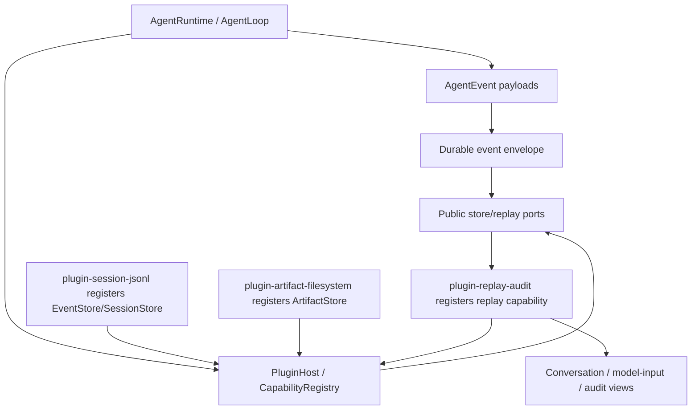
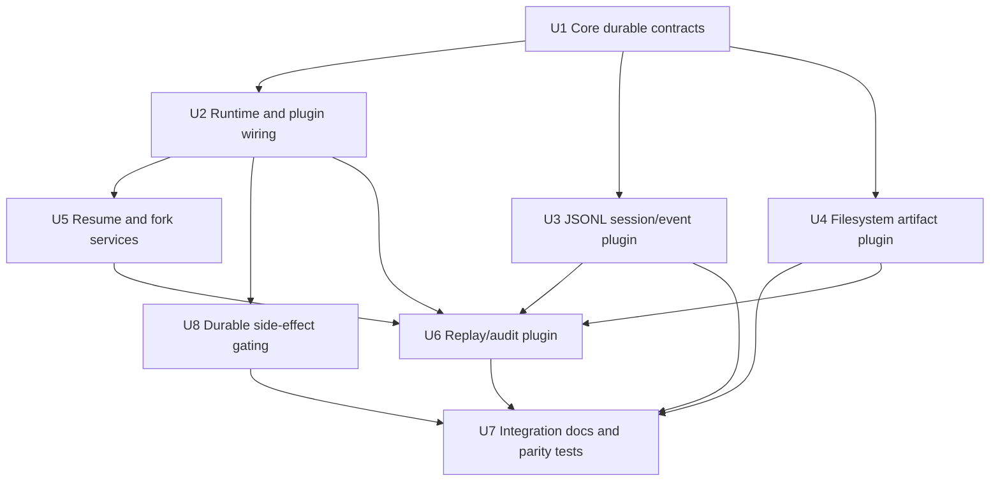
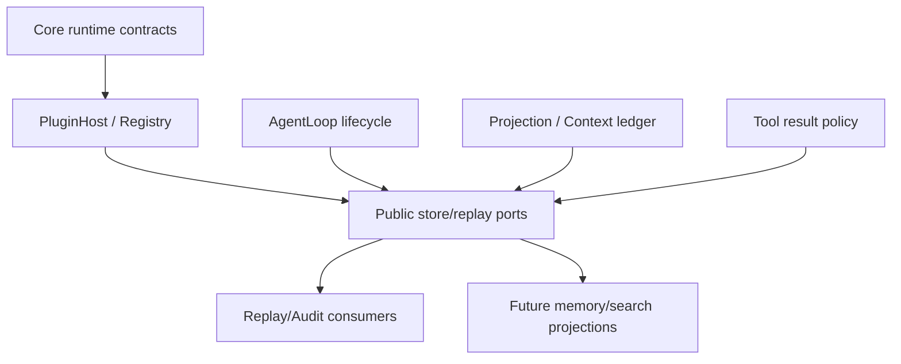

# feat: Add session store and replay plugins

## Summary

本计划将 M5 落成 durable workbench substrate：`packages/core` 定义可替换的 session/event/artifact store、durable event envelope、resume/fork/replay contracts；first-party `plugin-session-jsonl`、`plugin-artifact-filesystem`、`plugin-replay-audit` 通过插件注册 public capability 来证明本地优先实现。实现会复用 M4 的 projection、context decision ledger、tool pairing safety 和 tool result reference 边界，不把长期记忆、搜索或 RL 放进 M5。

---

## Problem Frame

M0-M4 已经让 Guga 具备 core loop、plugin host、provider bridge、tool/permission runtime 和 context projection，但运行事实仍主要停留在内存中。M5 要把 session、event、artifact、projection replay 和 provenance 持久化，确保进程重启、context overflow、工具中断、hook/permission 决策和模型实际输入都能被恢复、审计、回放和安全分叉。

---

## Requirements

- R1. 定义可替换的 session、event 和 artifact store 契约，让 first-party 插件和未来宿主实现接入同一 runtime 边界。
- R2. Durable event log 采用 append-only 语义；正常运行中不得通过覆盖历史表达状态变化。
- R3. Durable event envelope 至少携带 event id、schema version、session id、branch id、parent event id、stream revision 或 sequence、created_at、actor/source。
- R4. Schema 演进默认采用加性兼容和 read/replay-time upcaster，正常运行不得为了适配新 schema 改写历史事件。
- R5. Event append 支持 expected revision 或 idempotency key，避免 retry、崩溃恢复或并发 append 重复写入事实。
- R6. Artifact reference 携带 artifact id、content hash、size、mime/type、created_at，并预留 privacy tag、retention、redaction state 等治理字段。
- R7. Store 层区分小型结构化事件和大型 artifact 内容；大工具输出、文件片段、原始 provider payload 或敏感 blob 不默认内联进 session event。
- R8. 支持进程重启后恢复 session，恢复结果至少包含可继续的 conversation state、session tree/leaf 状态和相关 projection records。
- R9. 检测 interrupted run / turn / model request / tool execution / compaction，并以结构化状态暴露给宿主。
- R10. 在关键生命周期前后持久化 marker，使恢复逻辑能区分 completed、failed、cancelled、timeout、denied 和 interrupted。
- R11. 未完成 provider、tool 或 mutating hook 的默认恢复策略必须保守：标记 interrupted 或要求宿主决策，不自动重跑副作用。
- R12. 恢复过程保护 tool call / tool result 配对，不生成会让 provider API 拒绝的非法对话链。
- R13. 恢复过程发现 event log 读取异常或尾部损坏，并提供可诊断、可隔离的失败状态。
- R14. 支持从历史节点 fork 或切换 active leaf，并把 branch/fork/leaf 变化作为 durable fact 记录。
- R15. Fork 不修改原始历史；原 session 或原 branch 保持 append-only 可审计。
- R16. Replay/audit view 能解释 session 或 branch 从哪里 fork、当前 leaf 是什么、哪些事件属于当前可见路径。
- R17. 从 durable events 和 recorded projection decisions 重建 conversation view、model input view 和 audit view。
- R18. Model input replay 能说明某一 turn 中模型实际可见的 messages、tools、context sources、policy decisions、compaction summaries、artifact refs 和 projection hash。
- R19. Audit replay 能解释工具调用、权限决策、hook 决策、context pressure、截断/预算、compaction boundary、usage 和错误事件。
- R20. Replay 默认不得重跑 provider、tool execution 或 mutating hook；未来 simulation replay 必须作为新 fork/trajectory。
- R21. Projection 和 replay records 必须可序列化，不把 runtime 函数、AbortSignal、native Error 对象或不可稳定 JSON 化的数据写入持久层。
- R22. Projection records 作为可重建事实或索引存在；快照可以优化加载，但不能取代 event log 的 source-of-truth 地位。
- R23. 保留未来 curated memory 所需 provenance：来源事件、actor/source、scope、时间、session/branch lineage、compaction boundary 和 projection decision。
- R24. 长期记忆、session search、semantic retrieval、RL dataset export 是后续 projection，不是 M5 store 的隐藏副作用。
- R25. Session/fork/resume/compaction/replay 事件足够稳定，使未来 memory plugin 能在不重写 core 历史的情况下提取和治理长期事实。
- R26. 在 compaction commit 前、session switch 和 fork 时发布可订阅生命周期事件，为未来 memory plugin 提供抢救事实、更新 session identity、避免 stale context 写入的窗口。
- R27. 提供本地优先 JSONL session/event store 插件，证明 append-only、resume、fork 和 replay 能通过 public store contract 实现。
- R28. 提供 filesystem artifact store 插件，证明大结果可通过 artifact reference 跨进程重读。
- R29. 提供 replay/audit 插件或等价 first-party capability，证明 conversation/model-input/audit 三类 view 能从 durable facts 派生。
- R30. First-party plugins 使用与 third-party 插件相同的 store/replay contract，不依赖 core 私有捷径。

**Origin actors:** A1 宿主应用开发者, A2 插件作者, A3 Guga core runtime, A4 Context / projection consumer, A5 Future memory plugin, A6 规划 / 实施 agent

**Origin flows:** F1 创建并持久化一个 session, F2 重启后恢复 session, F3 从历史节点 fork, F4 回放模型实际输入和审计轨迹, F5 为未来长期记忆准备事实来源

**Origin acceptance examples:** AE1 durable resume and pairing, AE2 interrupted run detection, AE3 dangling tool call safety, AE4 fork lineage audit, AE5 fork before compaction preserves source path, AE6 model input replay without provider rerun, AE7 large output uses artifact refs, AE8 memory-ready provenance, AE9 no automatic memory writes, AE10 JSONL corruption detection

### Acceptance Trace

| AE | Origin scenario | Primary units |
| --- | --- | --- |
| AE1 | 完成多轮 user/model/tool 交互后，进程重启仍能从本地 durable store 恢复 session，且保留合法对话和工具配对。 | U1, U2, U3, U5, U7 |
| AE2 | 一次 run 已记录开始但没有完成 marker 时，恢复将其标记为 interrupted，而不是 failed 或 completed。 | U2, U5 |
| AE3 | 存在 tool call started 但没有对应 tool result / finished event 时，恢复生成 conversation view 不暴露悬空 `tool_use`。 | U1, U5, U6 |
| AE4 | 用户从历史 turn fork 时，新 branch/session lineage 被创建，原始历史不变，audit view 显示 fork 来源。 | U3, U5, U6, U7 |
| AE5 | 已发生 compaction 后从 compaction 前 turn fork，新 branch 能引用或恢复 compaction 前原始事件路径。 | U5, U6 |
| AE6 | 回放某一 turn 的模型输入时，replay 使用 recorded projection 和 durable events 重建模型可见输入，并且不调用 provider。 | U1, U2, U6, U7 |
| AE7 | 工具返回超大输出时，event log 只保存 bounded preview 和 artifact reference，audit view 解释完整输出位置和 metadata。 | U4, U6 |
| AE8 | 后续 memory plugin 能从 M5 events 找到来源和 scope，并订阅 compaction/session switch/fork 生命周期，但 M5 不写长期记忆。 | U1, U2, U5, U7 |
| AE9 | 完整 turn 后，durable store 中不存在对 `MEMORY.md`、`USER.md` 或 curated memory store 的自动写入。 | U6, U7 |
| AE10 | JSONL session 文件尾部损坏时，store 识别最长合法前缀并暴露 corruption 状态，而不是静默产生错误 replay。 | U3, U5, U6 |

---

## Scope Boundaries

- 不做 `MEMORY.md` / `USER.md` 或其他 curated memory 文件实现。
- 不做自动 memory extraction、用户画像更新、跨 session memory injection。
- 不做 FTS/session search、向量记忆、图谱记忆或 semantic retrieval。
- 不做自我进化/RL loops、trajectory compression、batch runner 或自主 skill creation。
- 不做远端同步、多人协作、多 writer conflict resolution。
- 不做完整 privacy/retention/redaction 产品面；M5 只保留必要 tag/reference/tombstone 方向，并实现 store-level tombstone/read-deny primitive，具体治理 UX 和 policy 后置。
- 不做 replay 时默认重跑 provider、tool 或 mutating hook。
- 不把 SQLite SessionDB 作为 M5 默认主存储；SQLite/search 可以作为后续 projection 或替代 store 研究。
- 不新增 CLI/Web replay UI；M5 只提供可被 UI、eval、debug 或 replay tooling 消费的 first-party capability。

### Deferred to Follow-Up Work

- SQLite/FTS session index：后续作为 projection 或替代 store 研究，不进入 local-first JSONL MVP。
- Remote sync / multi-writer conflict handling：需要独立 source-of-truth 和合并策略，超出 M5。
- Full privacy product surface：retention policy UI、enterprise redaction workflow、hard-delete UX 和 audit export 后置。
- Simulation replay：未来如需重跑 provider/tool/hook，必须写入新 fork/trajectory，而不是覆盖 M5 历史。

---

## Context & Research

### Relevant Code and Patterns

- `packages/core/src/contracts/events.ts` 已有 runtime facts：run/model/tool/permission/hook/context/usage/error events。M5 应包装为 durable envelope，而不是发明第二套 transcript。
- `packages/core/src/contracts/runtime.ts`、`packages/core/src/runtime/agent-runtime.ts` 和 `packages/core/src/loop/agent-loop.ts` 是 store 注入、生命周期 marker、run event slicing 和 resume/fork facade 的主要接入点。
- `packages/core/src/contracts/plugins.ts`、`packages/core/src/plugin-host/plugin-host.ts` 和 `packages/core/src/registry/capability-registry.ts` 已支持 provider/model/tool/hook/context-policy capability；M5 应扩展 store/replay capability，而不是给 first-party plugin 私有捷径。
- `packages/core/src/contracts/context.ts`、`packages/core/src/context/model-input-projection.ts`、`packages/core/src/context/context-decision-ledger.ts` 和 `packages/core/src/context/projection-hash.ts` 已提供 model input replay 的核心素材。
- `packages/core/src/context/tool-pairing-safety.ts` 已有 provider request 前的 pairing repair/refuse 规则；resume 和 replay 需要复用它来处理悬空 tool_use。
- `packages/core/src/context/tool-result-store.ts`、`packages/core/src/tools/result-policy.ts` 和 `ToolResultReference` 已证明大工具结果可以从 model-visible preview 中分离；M5 把该边界升级为 durable `ArtifactStore`。
- `packages/plugin-context-default` 是当前 first-party plugin package 形态参考；新的 M5 插件应沿用 package layout、dependency-boundary tests、runtime-integration tests 和 public core contract 注册方式。

### Institutional Learnings

- 当前没有 `docs/solutions/` 条目可复用；本计划主要依赖 M5 task research、roadmap 和现有 Trellis backend spec。

### External References

- `docs/roadmap.md`：M5 明确包含 `SessionStore`、`EventStore`、`ArtifactStore`、append-only event log、resume、fork、tree navigation、projection replay、interrupted run detection，以及三个 first-party plugins。
- `docs/agent-memo.md`：确认 durable session substrate 应先于 curated memory、session search 和 retrieval injection。
- `.trellis/tasks/05-27-m5-session-store-replay-plugins/research/current-codebase-constraints.md`：确认当前缺 store seams、durable envelope、resume/fork identity 和 serializable projection replay 边界。
- `.trellis/tasks/05-27-m5-session-store-replay-plugins/research/session-replay-reference-patterns.md`：Pi、Claude Code、OpenCode、Hermes 均支持 append-only log、tree/fork、interrupted detection 或 replay projection 方向。
- `.trellis/tasks/05-27-m5-session-store-replay-plugins/research/event-sourcing-replay-best-practices.md`：建议 narrow event sourcing、expected revision/idempotency、schema upcasters、JSONL corruption prefix/quarantine 和 artifact indirection。
- `.trellis/tasks/05-27-m5-session-store-replay-plugins/research/hermes-memory-learning-boundaries.md`：确认 M5 应 memory-ready but not memory-driven，保留 provenance 和 lifecycle hooks，后置 MemoryManager/FTS/RL。
- `STRATEGY.md`：长期记忆和向量搜索应等待 session recovery、event log 和 context projection 稳定。

---

## Key Technical Decisions

| Decision | Rationale |
| --- | --- |
| Core owns contracts; plugins own concrete storage | `packages/core` 必须保持 store-agnostic，但 store/replay 是 runtime contract，不应藏在 first-party plugin 私有类型里。 |
| Durable event envelope wraps existing `AgentEvent` payloads | 现有 events 已覆盖大部分 runtime facts；M5 需要增加 identity、revision、schema、causation、idempotency 和 provenance，而不是复制一份业务事件模型。 |
| Durable EventStore contract is the source of truth | Event log source-of-truth 是 core contract，不是 JSONL 文件格式；JSONL 只是 first-party local implementation，SessionStore、snapshot、index 和 replay cache 都是派生层或优化。 |
| Artifact store is content/reference oriented | 大工具输出和 provider raw payload 不应进入 event log；event 保存 bounded preview、artifact refs、hash/size/mime/治理 metadata。 |
| Provider input needs a committed durable fact | Model input replay 不能从当前 registry 或完整 `ToolDefinition` 重新拼；每次 provider call 前必须记录 provider 实际收到的序列化 messages、provider-visible tool descriptors/schema、model identifiers、projection hash、policy decisions 和 artifact refs。 |
| EventBus uses dual channels | 现有 `EventBus.publish` 继续作为同步 observation channel，保持调用方 ordering 和无 durable error 语义不变；新增 awaitable durable channel 只用于白名单 recovery-sensitive 边界，由 contract tests 枚举。 |
| Durability gates side effects | Provider call、tool execution 和 mutating hook 这类副作用边界必须先 durable append start marker；start marker append 失败不得进入副作用，terminal marker append 失败要暴露 uncertain/interrupted，而不是报告 durable completed。 |
| Resume is conservative by default | 未完成 provider/tool/mutating hook 无法可靠判断副作用状态，恢复时标记 interrupted 或交给 host 决策。 |
| Fork records lineage instead of copying mutable state | Fork/leaf movement 是 durable fact；原 branch/history 保持 append-only，new branch 只追加新事件或引用 source path。 |
| Replay derives views from recorded facts | Conversation/model-input/audit view 消费 events、projection records 和 decisions；默认不重跑 provider、tool 或 mutating hook。 |
| Projection records are replayable facts, snapshots are optimizations | `ProjectionLedgerEntry`、source refs、policy decisions、projection hash 和 compaction boundary 必须可从 event log 重建；快照失效时丢弃并重放。 |
| Memory provenance is prepared, memory behavior is deferred | M5 记录 actor/source/scope/session lineage/compaction/projection provenance，但不写 curated memory，也不做 retrieval injection。 |

---

## Recovery Marker Matrix

| Boundary | Start marker | Terminal marker/statuses | Append timing | Resume classification |
| --- | --- | --- | --- | --- |
| Run | `run.started` | `run.finished`: completed, failed, cancelled, timeout, interrupted | Start before loop work; terminal after final event slice is durable | Open run is interrupted unless log is corrupt, then corrupt/repair-required |
| Turn | `turn.started` | `turn.finished`: completed, failed, cancelled, timeout, interrupted | Start before projection/model request; terminal after model/tool turn settles | Open turn is interrupted and may offer fork/abandon |
| Provider request | `model.requested` plus provider-input committed fact | `model.responded`, provider failure, cancelled, timeout, interrupted | Request marker and provider-input fact before provider call | Open request is interrupted/uncertain; never auto-rerun |
| Tool execution | `tool.started` | `tool.completed`, `tool.failed`, `tool.denied`, `tool.cancelled`, `tool.timeout`, interrupted | Start marker before executing the tool side effect | Open tool is interrupted/uncertain; host decides retry/repair |
| Permission request | `tool.permission.requested` | `tool.permission.resolved`: allow, ask, deny, unavailable | Request marker before resolver; resolution before side effect | Open permission is interrupted; no tool execution inferred |
| Hook decision | phase-specific hook decision/failure marker | decision recorded, hook failure, timeout, interrupted | Durable marker before mutating/blocking hook effects affect runtime | Open mutating hook is interrupted/uncertain |
| Compaction | `context.compact.started` / pre-commit lifecycle | `context.compact.completed`, `context.compact.failed`, interrupted | Start before compaction; pre-commit event before committing summary/projection | Open compaction is interrupted; source path remains authoritative |
| Fork / leaf movement | `fork.created` / `leaf.moved` | append success or conflict/corrupt diagnostic | Append lineage fact before switching active runtime identity | Failed append leaves old active leaf authoritative |

---

## Runtime Contract Shape

> *This table fixes host-facing semantics for planning. Exact TypeScript names can still change during implementation, but these operations and return states should not be invented ad hoc inside implementation units.*

| Host operation | Required semantics | Failure / unavailable shape |
| --- | --- | --- |
| Create or configure session identity | Host can provide session id/branch id through runtime options or run options; absent values are generated and published as durable session facts. | Missing store keeps in-memory run usable, but durable resume/fork/replay reports unavailable. |
| Run within active session | `run()` records lifecycle markers and provider-input committed facts under the active session/branch before side effects. | Durable start append failure stops before side effect; terminal append failure returns uncertain/interrupted persistence status. |
| Resume session | Host can request a resume report for session id and optional branch/leaf, receiving conversation state, active leaf, projection records, interruption/corruption diagnostics and allowed host actions. | Corrupt middle/hash mismatch returns repair-required; missing session returns not-found; missing store returns unavailable. |
| Fork historical event | Host can fork from a visible historical event, producing new branch lineage and active leaf movement as append-only durable facts. | Non-visible source, nonexistent event, duplicate branch id or cycle returns diagnostic conflict without changing active leaf. |
| Switch active leaf | Host can move active leaf to an existing branch/event and publish session switch lifecycle facts. | Invalid leaf target returns conflict and preserves the previous active leaf. |
| Replay views | Host or replay plugin can request conversation, model-input and audit views for a session/branch/turn from durable facts. | Missing artifact, interrupted operation, upcaster failure or corruption appears in the replay diagnostics rather than crashing or rerunning side effects. |

---

## Open Questions

### Resolved During Planning

- Envelope 字段第一版范围如何定：M5 包含 event id、event type、schema version、stream id/revision、session id、branch id、parent event id、run/turn/attempt correlation、actor/source、created_at、payload hash、previous event hash、artifact refs、privacy tags；exact optionality 在 contract tests 中收紧。
- Schema upcaster 如何设计：先定义 registry/read-time upcaster contract、golden fixture 和失败状态，不做历史 rewrite 或完整 migration framework；raw durable record/hash 不因 upcast 改变，upcasted view 带 `from_schema` / `to_schema` diagnostics。
- Artifact governance 粒度如何定：artifact ref 第一版包含 hash/size/mime/created_at/privacy tags/retention/redaction/tombstone metadata；tombstone/redaction/retention transition 本身必须是 append-only audit record 或 versioned manifest entry，治理 UI 和 policy engine 后置。
- Resume 如何复用 pairing safety：从 durable events 重建 conversation state 后，在 model input replay/provider resume boundary 复用 `ensureToolPairingSafety`，并把 repair/refuse decision 写入 replay/audit output。
- Interrupted 状态如何表达：定义 host-facing resume report，按 run/turn/model/tool/compaction marker 归类 completed、failed、cancelled、timeout、denied、interrupted、corrupt。
- Fork 是同 session branch 还是新 session lineage：M5 contract 支持 session tree/branch lineage；first-party JSONL 可以先支持同 session branch + active leaf，保留 fork-to-new-session metadata。
- Persisted model input projection 保存什么：保存 provider 实际收到的序列化 messages、provider-visible tool descriptors/schema、source descriptors、policy decisions、projection hash、context budget、compaction boundary、artifact refs 和 model identifiers；完整 sensitive content 只在事件或 artifact 中按可治理引用存在。
- JSONL corruption handling：读取最后一个完整可信 record 之前的最长合法前缀，并区分 partial tail、middle corruption、hash chain mismatch；middle corruption 或 hash chain break 阻断自动 resume，显式 repair/truncate command 后续再做。
- `plugin-replay-audit` 第一版输出哪些 view：conversation view、model input view、audit timeline，足以覆盖 provider input、tool/permission/hook/context/artifact/fork/interrupted 解释。
- Provider raw payload persistence 默认策略：默认只写 descriptor 和 hash/reference metadata；完整 raw payload artifact persistence 必须由 host policy opt in。
- Flush/durability 最低语义：M5 承诺 process restart 后可恢复到最后成功 append/flush 的 durable marker；不承诺断电级 durability，强 fsync/flush 作为 JSONL 插件可配置策略。

### Deferred to Implementation

- Exact type/file names：计划指定 contract/package boundaries，最终命名应随 TypeScript export surface 和 tests 微调。
- Snapshot/index format：计划允许 session tree/projection index snapshot，但 source-of-truth 仍是 event log；具体格式可在实现中按测试驱动收敛。

---

## Output Structure

```text
packages/
  core/
    src/
      contracts/
        persistence.ts
        events.ts
        runtime.ts
        plugins.ts
        context.ts
      persistence/
        durable-event-envelope.ts
        session-replay.ts
        resume-report.ts
      runtime/
        agent-runtime.ts
      loop/
        agent-loop.ts
      registry/
        capability-registry.ts
      plugin-host/
        plugin-host.ts
      index.ts
  plugin-session-jsonl/
  plugin-artifact-filesystem/
  plugin-replay-audit/
```

具体文件名是 proposed path；固定边界是：core 定义 public contracts、runtime wiring 和 replay-safe services；三个 first-party plugins 只通过 public contract 注册能力。实施时可以微调文件拆分，但不能把 first-party plugin 私有类型反向变成 core contract。

---

## High-Level Technical Design

> *This illustrates the intended approach and is directional guidance for review, not implementation specification. The implementing agent should treat it as context, not code to reproduce.*



---

## Implementation Units



U5 intentionally uses fake/in-memory store contract fixtures for core reducer work; JSONL corruption and artifact-backed acceptance are proven later by U7's end-to-end conformance over U3/U4/U8.

- U1. **Define durable store contracts and event envelope**

**Goal:** Add the public M5 contracts that describe durable events, append/read semantics, session tree operations, artifact references, schema upcasting, corruption status, resume reports, and replay view inputs.

**Requirements:** R1, R2, R3, R4, R5, R6, R7, R21, R22, R23, R24, R25

**Dependencies:** None

**Files:**
- Create: `packages/core/src/contracts/persistence.ts`
- Create: `packages/core/src/persistence/durable-event-envelope.ts`
- Create: `packages/core/src/persistence/resume-report.ts`
- Modify: `packages/core/src/contracts/events.ts`
- Modify: `packages/core/src/contracts/runtime.ts`
- Modify: `packages/core/src/index.ts`
- Test: `packages/core/src/contracts/contracts.test.ts`
- Test: `packages/core/src/persistence/durable-event-envelope.test.ts`

**Approach:**
- Define `EventStore`, `SessionStore`, `ArtifactStore`, replay capability, upcaster, corruption, append result, expected revision, idempotency, session branch/leaf, artifact ref and resume report contracts under core.
- Wrap existing `AgentEvent` payloads in a durable envelope that carries schema version, stream identity, session/branch/run/turn correlation, parent/previous hash and actor/source metadata.
- Define provider-input committed facts as serializable records of the exact provider-visible messages, tool descriptors/schema, model identifiers, projection hash, policy decisions and artifact refs used for a model request.
- Bind idempotency to stream, key and event identity/payload hash: same key and same payload returns the existing result; same key with different payload is a conflict.
- Define schema upcaster diagnostics and fixture expectations: raw durable record/hash remains stable, while the upcasted view records source and target schema versions.
- Define session lineage invariants for branch id uniqueness, source event visibility, active leaf validity and cycle prevention.
- Keep payload serialization rules explicit: records must be JSON-safe and must not contain executable tool definitions, native errors, abort signals or unstable unknown blobs.
- Export the contracts as public API while keeping concrete storage outside `packages/core`.

**Execution note:** Implement contract tests first; this unit defines the surface all later plugin/runtime work depends on.

**Patterns to follow:**
- `packages/core/src/contracts/context.ts`
- `packages/core/src/contracts/events.ts`
- `packages/core/src/contracts/runtime.ts`
- `packages/core/src/contracts/contracts.test.ts`

**Test scenarios:**
- Happy path: appending a durable event envelope with expected revision produces a monotonic stream revision and preserves the original `AgentEvent` payload.
- Happy path: an idempotency key replay returns the existing append result instead of duplicating a tool result or projection record.
- Edge case: the same idempotency key with a different event id or payload hash returns a conflict, including after store restart.
- Edge case: an envelope without session id, schema version, event id or actor/source is rejected by contract validation.
- Edge case: JSON-safe normalization strips or serializes native `Error` details into stable data without throwing.
- Error path: an unknown schema version returns an upcaster failure status rather than silently replaying incompatible data.
- Error path: an old-schema fixture upcasts to the current view without changing the raw record hash and reports `from_schema` / `to_schema` diagnostics.
- Error path: an active leaf pointing at a nonexistent event, non-visible fork source or cyclic branch lineage returns a diagnostic conflict.
- Integration: `packages/core/src/index.ts` exports all public store/replay contracts without exporting first-party plugin internals.

**Verification:**
- Core public API exposes store contracts and durable envelope types.
- Contract tests prove append-only identity, expected revision, idempotency and JSON-safe serialization rules.

- U2. **Wire store capability surface through plugin host and runtime**

**Goal:** Allow hosts and plugins to register persistence/replay capabilities through the same capability registry and runtime construction path used by providers, tools, hooks and context policies, without changing event delivery semantics yet.

**Requirements:** R1, R5, R8, R9, R10, R11, R26, R30; enables R27, R28, R29 through public capability registration

**Dependencies:** U1

**Files:**
- Modify: `packages/core/src/contracts/plugins.ts`
- Modify: `packages/core/src/registry/capability-registry.ts`
- Modify: `packages/core/src/plugin-host/plugin-host.ts`
- Modify: `packages/core/src/contracts/runtime.ts`
- Modify: `packages/core/src/runtime/agent-runtime.ts`
- Modify: `packages/core/src/contracts/events.ts`
- Test: `packages/core/src/plugin-host/plugin-host.test.ts`
- Test: `packages/core/src/registry/capability-registry.test.ts`
- Test: `packages/core/src/runtime/agent-runtime.test.ts`

**Approach:**
- Extend plugin capability kinds and `PluginContext` with session/event/artifact store and replay capability registration.
- Add optional store injection to `AgentRuntimeOptions`, with plugin-provided stores resolved through the registry when direct options are absent.
- Define lifecycle event types and runtime option shape needed by U8, U5 and U6, including session switch, fork and compaction-pre-commit facts.
- Keep existing `EventBus.publish` behavior unchanged in this unit; downstream units can still use fire-and-forget observation until U8 introduces the durable channel.
- Keep core behavior usable without a store: in-memory runtime still works, but resume/fork/replay APIs return explicit unavailable status unless stores are configured.

**Execution note:** Add characterization coverage for current runtime-without-store behavior before wiring store capability registration.

**Patterns to follow:**
- `packages/core/src/plugin-host/plugin-host.ts`
- `packages/core/src/registry/capability-registry.ts`
- `packages/core/src/runtime/agent-runtime.ts`
- `packages/core/src/loop/agent-loop.ts`

**Test scenarios:**
- Happy path: a local plugin registers an event store, session store and artifact store, and `PluginCapabilityRegistered` events name the new capability kinds.
- Happy path: `createAgentRuntime({ plugins })` resolves registered store capabilities and exposes unavailable resume/fork/replay states when stores are absent.
- Happy path: session/fork/compaction lifecycle event types are exported without requiring existing publish call sites to change.
- Edge case: duplicate store capability registration fails or requires explicit replacement semantics matching existing capability rules.
- Integration: existing provider/tool/hook/context-policy plugin tests still pass when no store capability exists.

**Verification:**
- Store capabilities are registered through the public plugin surface.
- Runtime and plugin host expose the public ports U3/U4/U6 can implement without private shortcuts.

- U8. **Add durable side-effect gating**

**Goal:** Introduce the awaitable durable append + publish channel and migrate recovery-sensitive provider, tool, permission, hook and compaction boundaries to durable start/terminal marker semantics without changing ordinary observation publish behavior.

**Requirements:** R5, R9, R10, R11, R18, R19, R20, R26, R30

**Dependencies:** U2

**Files:**
- Modify: `packages/core/src/events/event-bus.ts`
- Modify: `packages/core/src/runtime/agent-runtime.ts`
- Modify: `packages/core/src/loop/agent-loop.ts`
- Modify: `packages/core/src/router/provider-router.ts`
- Modify: `packages/core/src/tools/execution-pipeline.ts`
- Modify: `packages/core/src/permissions/permission-kernel.ts`
- Modify: `packages/core/src/hooks/hook-kernel.ts`
- Test: `packages/core/src/events/event-bus.test.ts`
- Test: `packages/core/src/runtime/agent-runtime.test.ts`
- Test: `packages/core/src/loop/agent-loop.test.ts`
- Test: `packages/core/src/tools/execution-pipeline.test.ts`
- Test: `packages/core/src/permissions/permission-kernel.test.ts`
- Test: `packages/core/src/hooks/hook-kernel.test.ts`

**Approach:**
- Add an awaitable durable append + publish adapter alongside the existing synchronous `EventBus.publish` observation path.
- Preserve legacy observation ordering: old `publish` call sites remain synchronous and do not throw durable append errors.
- Enumerate durable-channel call sites in contract tests: provider request, provider-input committed fact, tool execution start/terminal, permission request/resolution, mutating/blocking hook decision, compaction start/pre-commit/terminal, fork/leaf movement.
- Gate side effects on durable start markers: if provider/tool/mutating-hook start marker append fails, do not enter the side effect.
- Treat terminal marker append failure after a side effect as uncertain/interrupted persistence status, never durable completed.
- Migrate side-effect boundaries gradually in one unit with focused tests per kernel, instead of hiding the behavior change inside capability registration.

**Execution note:** Characterize existing `EventBus.publish` ordering before adding the durable channel.

**Patterns to follow:**
- `packages/core/src/events/event-bus.ts`
- `packages/core/src/loop/agent-loop.ts`
- `packages/core/src/tools/execution-pipeline.ts`
- `packages/core/src/hooks/hook-kernel.ts`

**Test scenarios:**
- Happy path: legacy `EventBus.publish` listeners still run synchronously in order and do not observe durable-store failures.
- Happy path: the durable channel publishes the same observable event and returns append success before a provider/tool side effect begins.
- Happy path: provider input committed fact is durably appended before provider execution and replay can consume it instead of current registry state.
- Error path: durable start marker append failure prevents provider/tool/mutating-hook side effects.
- Error path: terminal marker append failure after a side effect returns uncertain/interrupted persistence status and does not report durable completed.
- Integration: `ProviderRouter`, `ExecutionPipeline`, `PermissionKernel`, mutating/blocking `HookKernel`, and compaction paths use durable channel only at the enumerated recovery-sensitive boundaries.

**Verification:**
- Existing observation publish semantics remain compatible.
- Recovery-sensitive side effects are gated by durable markers and have focused regression coverage.

- U3. **Implement local JSONL session and event store plugin**

**Goal:** Provide the first-party local-first store that persists session metadata, branch/leaf movement and durable event streams as append-only JSONL.

**Requirements:** R1, R2, R3, R4, R5, R8, R9, R10, R13, R14, R15, R16, R22, R23, R26, R27, R30

**Dependencies:** U1, U2

**Files:**
- Create: `packages/plugin-session-jsonl/package.json`
- Create: `packages/plugin-session-jsonl/tsconfig.json`
- Create: `packages/plugin-session-jsonl/vitest.config.ts`
- Create: `packages/plugin-session-jsonl/src/index.ts`
- Create: `packages/plugin-session-jsonl/src/jsonl-session-plugin.ts`
- Create: `packages/plugin-session-jsonl/src/jsonl-event-store.ts`
- Create: `packages/plugin-session-jsonl/src/jsonl-session-store.ts`
- Create: `packages/plugin-session-jsonl/src/jsonl-corruption.ts`
- Create: `packages/plugin-session-jsonl/src/jsonl-session-plugin.test.ts`
- Create: `packages/plugin-session-jsonl/src/jsonl-event-store.test.ts`
- Create: `packages/plugin-session-jsonl/src/jsonl-session-store.test.ts`
- Create: `packages/plugin-session-jsonl/src/runtime-integration.test.ts`
- Create: `packages/plugin-session-jsonl/src/dependency-boundary.test.ts`
- Modify: `pnpm-workspace.yaml`
- Test: `packages/plugin-session-jsonl/src/*.test.ts`

**Approach:**
- Store one newline-terminated JSON object per durable event and session tree fact, with a single writer queue per stream.
- Use expected revision and idempotency keys to make retries safe, including durable idempotency records that survive process restart.
- Persist session header, branch/fork lineage, active leaf movement and event stream references as durable facts rather than mutable-only metadata.
- Validate per-record revision/hash chain. Partial final line can recover to the last complete trusted record; middle corruption or hash chain mismatch blocks automatic resume and reports a diagnostic.
- Persist branch/leaf facts with DAG invariants: fork source must exist on the visible source path, branch ids must be unique, active leaf must target an existing event and parent/child links must not cycle.
- Keep filesystem paths host-configured and package-local; do not depend on `.trellis/`, docs, or generated `dist/`.

**Execution note:** Implement file-format and corruption tests before runtime integration.

**Patterns to follow:**
- `packages/plugin-context-default/package.json`
- `packages/plugin-tools-filesystem/src/dependency-boundary.test.ts`
- `packages/plugin-tools-filesystem/src/runtime-integration.test.ts`

**Test scenarios:**
- Covers AE1. Happy path: a completed multi-turn session is appended to JSONL, reopened, and read back with the same session id, branch id, stream revisions and event ordering.
- Happy path: active leaf movement is appended as a durable fact and survives process restart.
- Covers AE4. Happy path: fork from a historical event creates a new branch lineage while the original branch remains unchanged.
- Edge case: concurrent or retry append with the same idempotency key does not duplicate permission or tool result events.
- Edge case: same idempotency key with changed payload after restart returns conflict rather than reusing or appending the mismatched event.
- Edge case: invalid active leaf target, duplicate branch id, non-visible fork source or cyclic lineage returns diagnostic/conflict status.
- Covers AE10. Error path: a JSONL file with a corrupt tail returns the longest valid prefix plus corruption diagnostics.
- Error path: a corrupt middle record or hash chain mismatch blocks automatic resume instead of trusting later records.
- Error path: expected revision mismatch returns a conflict result rather than appending out of order.
- Integration: registering `plugin-session-jsonl` through `createAgentRuntime({ plugins })` persists runtime lifecycle events without importing core internals.

**Verification:**
- JSONL plugin proves append-only event/session storage through public core contracts.
- Corruption, idempotency, branch/leaf and runtime registration behavior are covered by package tests.

- U4. **Implement filesystem artifact store plugin and durable result references**

**Goal:** Persist large tool outputs, provider payload descriptors and replay artifacts outside the event log while keeping model-visible previews bounded and verifiable.

**Requirements:** R6, R7, R18, R19, R21, R23, R28, R30

**Dependencies:** U1, U2

**Files:**
- Create: `packages/plugin-artifact-filesystem/package.json`
- Create: `packages/plugin-artifact-filesystem/tsconfig.json`
- Create: `packages/plugin-artifact-filesystem/vitest.config.ts`
- Create: `packages/plugin-artifact-filesystem/src/index.ts`
- Create: `packages/plugin-artifact-filesystem/src/filesystem-artifact-plugin.ts`
- Create: `packages/plugin-artifact-filesystem/src/filesystem-artifact-store.ts`
- Create: `packages/plugin-artifact-filesystem/src/artifact-manifest.ts`
- Create: `packages/plugin-artifact-filesystem/src/filesystem-artifact-store.test.ts`
- Create: `packages/plugin-artifact-filesystem/src/runtime-integration.test.ts`
- Create: `packages/plugin-artifact-filesystem/src/dependency-boundary.test.ts`
- Modify: `packages/core/src/context/tool-result-store.ts`
- Modify: `packages/core/src/tools/result-policy.ts`
- Modify: `packages/core/src/contracts/tool-runtime.ts`
- Test: `packages/core/src/tools/result-policy.test.ts`
- Test: `packages/core/src/context/tool-result-store.test.ts`
- Test: `packages/plugin-artifact-filesystem/src/*.test.ts`

**Approach:**
- Add a durable artifact store adapter path that can back `ToolResultReference` without changing the model-visible preview contract.
- Write artifact bytes/content plus manifest metadata including id, hash, size, mime/type, created_at, privacy tag, retention and redaction/tombstone state.
- Record artifact create/redact/tombstone/retention transitions as append-only audit records or versioned manifest entries, preserving actor, time, reason and original artifact metadata.
- Verify reads by hash and expose not-found/hash-mismatch/tombstone states as structured failures.
- Keep event log entries bounded: durable events reference artifacts and previews, not full large outputs.
- Default provider raw payload persistence to descriptor-only metadata; full raw payload artifact storage requires host opt-in policy.

**Execution note:** Start with existing `ResultPolicy` tests, then add artifact-backed references as a second store implementation.

**Patterns to follow:**
- `packages/core/src/context/tool-result-store.ts`
- `packages/core/src/tools/result-policy.ts`
- `packages/plugin-tools-filesystem/src/filesystem-plugin.ts`
- `packages/plugin-tools-filesystem/src/path-containment.test.ts`

**Test scenarios:**
- Covers AE7. Happy path: a large tool output is stored as an artifact; the event/model-visible result contains bounded preview plus artifact id/hash/size/mime metadata.
- Happy path: artifact content can be reopened across a new runtime process and hash verification succeeds.
- Edge case: redacted or tombstoned artifact metadata prevents normal content read while preserving non-sensitive audit structure.
- Edge case: tombstone/redaction transition is itself replayable and explains who made content unreadable, when and why.
- Edge case: provider raw payload records default to descriptor/hash/reference metadata unless host policy explicitly opts into full artifact persistence.
- Error path: hash mismatch returns a diagnostic failure and does not return corrupted content as trusted.
- Error path: missing artifact returns a replay-visible missing-artifact state rather than crashing replay.
- Integration: `ResultPolicy` can use artifact-backed references while preserving tool call/result pairing and `ToolResultBudgeted` audit events.

**Verification:**
- Large output storage is durable, verifiable and separate from event log payloads.
- Core result governance remains store-agnostic and works with both in-memory and filesystem artifact stores.

- U5. **Add resume, interruption detection, and fork/tree services**

**Goal:** Rebuild session state from durable events, classify interrupted work, preserve legal provider conversations and support branch/fork navigation without mutating history.

**Requirements:** R8, R9, R10, R11, R12, R13, R14, R15, R16, R20, R23, R25, R26

**Dependencies:** U1, U2

**Files:**
- Create: `packages/core/src/persistence/session-replay.ts`
- Create: `packages/core/src/persistence/session-tree.ts`
- Create: `packages/core/src/persistence/interruption-detector.ts`
- Modify: `packages/core/src/runtime/agent-runtime.ts`
- Modify: `packages/core/src/contracts/runtime.ts`
- Modify: `packages/core/src/context/tool-pairing-safety.ts`
- Test: `packages/core/src/persistence/session-replay.test.ts`
- Test: `packages/core/src/persistence/session-tree.test.ts`
- Test: `packages/core/src/persistence/interruption-detector.test.ts`
- Test: `packages/core/src/runtime/agent-runtime.test.ts`

**Approach:**
- Build session tree/active leaf by reducing session and branch events from the event store.
- Rehydrate conversation state, projection ledger references, artifact refs and resume candidates from the visible branch path.
- Detect open lifecycle markers: run/turn/model/tool/permission/hook/compaction started without terminal completed/failed/cancelled/timeout/denied marker.
- Reuse tool pairing safety to repair or refuse unsafe conversation views, and expose those decisions as replay/resume diagnostics.
- Implement fork as append-only lineage and active leaf events; new branch continues from selected historical node without rewriting source history.
- Implement core reducers against public store interfaces and fake/in-memory contract fixtures; JSONL/filesystem plugins are used later for conformance and end-to-end integration, not as core dependencies.
- Validate snapshot/index records by base stream revision/hash; stale or mismatched snapshots are discarded and rebuilt from the event log.

**Execution note:** Add characterization tests for existing `ensureToolPairingSafety` behavior before expanding resume-specific diagnostics.

**Patterns to follow:**
- `packages/core/src/state/conversation-state.ts`
- `packages/core/src/context/tool-pairing-safety.ts`
- `packages/core/src/context/context-decision-ledger.ts`
- `.trellis/tasks/05-27-m5-session-store-replay-plugins/research/session-replay-reference-patterns.md`

**Test scenarios:**
- Covers AE1. Happy path: a completed session restores conversation state and legal tool call/result pairs after reducing durable events from a fake or JSONL-backed event store.
- Covers AE2. Error path: a run with `run.started` but no terminal marker is reported as interrupted, not failed or completed.
- Covers AE3. Error path: an assistant tool call without a corresponding result is repaired/refused according to pairing safety and not exposed to provider as a dangling `tool_use`.
- Covers AE4. Happy path: fork from a historical turn appends new branch lineage and active leaf without modifying original branch events.
- Covers AE5. Edge case: fork before a compaction boundary can still reference the original pre-compaction event path instead of only the summary.
- Covers AE10. Error path: corruption status from the event store is surfaced in resume report and prevents unsafe continuation from untrusted events.
- Error path: corrupt middle/hash-chain mismatch status blocks automatic continuation and classifies the resume report as repair-required.
- Error path: stale snapshot, snapshot revision mismatch or snapshot pointing at an invalid leaf is discarded and rebuilt from the event log.
- Integration: resume report includes host-facing actions such as continue, fork, mark abandoned, or repair-required without auto-rerunning side effects.

**Verification:**
- Runtime can restore safe state from durable stores and identify interrupted/corrupt/incomplete work.
- Fork and active leaf behavior is append-only and auditable.

- U6. **Implement replay/audit projection plugin**

**Goal:** Provide first-party replay capability that derives conversation, model-input and audit views from durable facts without rerunning provider, tools or mutating hooks.

**Requirements:** R16, R17, R18, R19, R20, R21, R22, R23, R24, R25, R29, R30

**Dependencies:** U1, U2, U3, U4, U5, U8

**Files:**
- Create: `packages/plugin-replay-audit/package.json`
- Create: `packages/plugin-replay-audit/tsconfig.json`
- Create: `packages/plugin-replay-audit/vitest.config.ts`
- Create: `packages/plugin-replay-audit/src/index.ts`
- Create: `packages/plugin-replay-audit/src/replay-audit-plugin.ts`
- Create: `packages/plugin-replay-audit/src/conversation-view.ts`
- Create: `packages/plugin-replay-audit/src/model-input-view.ts`
- Create: `packages/plugin-replay-audit/src/audit-view.ts`
- Create: `packages/plugin-replay-audit/src/replay-audit-plugin.test.ts`
- Create: `packages/plugin-replay-audit/src/conversation-view.test.ts`
- Create: `packages/plugin-replay-audit/src/model-input-view.test.ts`
- Create: `packages/plugin-replay-audit/src/audit-view.test.ts`
- Create: `packages/plugin-replay-audit/src/runtime-integration.test.ts`
- Create: `packages/plugin-replay-audit/src/dependency-boundary.test.ts`
- Test: `packages/plugin-replay-audit/src/*.test.ts`

**Approach:**
- Implement the replay capability defined in U1/U2; U6 should not introduce new core contract shape except small conformance fixes discovered by tests.
- Derive conversation view from branch-visible user/assistant/tool/message events plus pairing diagnostics.
- Derive model input view from provider-input committed facts, recorded `ProjectionLedgerEntry`, source descriptors, policy decisions, provider-visible tool descriptors/schema, compaction summaries, artifact refs and projection hash.
- Derive audit view from tool lifecycle, permission decisions, hook decisions, context pressure/truncation/compaction, usage, provider errors, fork lineage and corruption/interruption diagnostics.
- Keep simulation replay out of scope; any future rerun mode must write a new fork/trajectory.

**Execution note:** Implement replay tests as pure projection tests first; runtime integration should prove the plugin works through public stores.

**Patterns to follow:**
- `packages/core/src/context/model-input-projection.ts`
- `packages/core/src/context/context-decision-ledger.ts`
- `packages/core/src/context/projection-hash.ts`
- `packages/plugin-context-default/src/default-context-plugin.ts`

**Test scenarios:**
- Covers AE6. Happy path: replaying a turn reconstructs model-visible messages, tool descriptors, context sources, policy decisions, artifact refs and projection hash without invoking a provider.
- Covers AE6. Edge case: tool registry changes after the original run do not alter replayed model input because replay uses the committed provider-input fact.
- Covers AE7. Happy path: audit view explains where a large output lives, its hash/size/mime metadata, and what preview the model saw.
- Happy path: audit timeline includes permission decisions, hook decisions, context pressure, compaction boundary, usage and errors in event order.
- Covers AE4. Happy path: branch view explains fork source, current leaf and visible event path.
- Edge case: replay of a branch with compaction shows both compaction summary and source lineage/provenance.
- Edge case: old-schema fixture replays through registered upcaster while preserving raw record hash diagnostics.
- Error path: missing artifact, corrupt tail or interrupted operation appears as explicit replay diagnostic.
- Covers AE9. Integration: completing a turn produces no automatic curated memory write events or writes to `MEMORY.md` / `USER.md`.

**Verification:**
- Replay/audit plugin proves all three required views can be derived from durable facts through public contracts.
- Replay never calls provider/tool/hook execution paths.

- U7. **Add package parity, documentation, and end-to-end milestone coverage**

**Goal:** Tie the M5 packages together with workspace-level tests, README guidance and roadmap-aligned verification so implementers and future plugin authors know the contract boundary.

**Requirements:** R1, R8, R12, R14, R17, R23, R24, R26, R27, R28, R29, R30

**Dependencies:** U2, U3, U4, U5, U6, U8

**Files:**
- Create: `packages/plugin-session-jsonl/README.md`
- Create: `packages/plugin-artifact-filesystem/README.md`
- Create: `packages/plugin-replay-audit/README.md`
- Modify: `packages/core/README.md`
- Modify: `docs/roadmap.md`
- Test: `packages/core/src/runtime/agent-runtime.test.ts`
- Test: `packages/plugin-session-jsonl/src/runtime-integration.test.ts`
- Test: `packages/plugin-artifact-filesystem/src/runtime-integration.test.ts`
- Test: `packages/plugin-replay-audit/src/runtime-integration.test.ts`
- Test: `scripts/package-esm-smoke.mjs`

**Approach:**
- Document how host apps configure local JSONL session/event store, filesystem artifact store and replay/audit plugin.
- Add package dependency-boundary tests proving first-party plugins import only public core exports.
- Add workspace integration coverage for the core acceptance path: run -> persist -> reopen -> resume -> fork -> replay model input/audit.
- Update roadmap only to reflect M5 implementation notes, not to widen scope into memory/search.

**Patterns to follow:**
- `packages/plugin-tools-filesystem/README.md`
- `packages/plugin-tools-shell/src/dependency-boundary.test.ts`
- `scripts/package-esm-smoke.mjs`

**Test scenarios:**
- Covers AE1. Integration: create a runtime with all three M5 plugins, complete a tool-calling run, dispose, create a new runtime, and resume the same session with legal conversation state.
- Covers AE4 / AE6. Integration: fork from a historical turn and replay model input for both original and fork branch without mutating original events.
- Covers AE8. Integration: compaction/session switch/fork lifecycle events are visible to subscribers with provenance, but no memory plugin behavior runs.
- Covers AE10. Integration: JSONL corrupt tail, corrupt middle record and hash-chain mismatch flow through resume and replay diagnostics.
- Edge case: plugin packages build as ESM and pass smoke import checks without relying on `dist/` being committed.
- Edge case: stale snapshot/index, artifact tombstone and active leaf movement after snapshot are all resolved from the event log as source of truth.
- Error path: disabling one required store produces an explicit unavailable capability status for resume/replay instead of a runtime crash.

**Verification:**
- Workspace tests and smoke checks cover the milestone end-to-end.
- Documentation explains how to use M5 stores and what remains deferred.

---

## System-Wide Impact



- **Interaction graph:** `AgentRuntime`, `AgentLoop`, `PluginHost`, `CapabilityRegistry`, context projection, tool result policy and first-party plugin packages all interact through the new store/replay contracts.
- **Error propagation:** Store append/read/corruption failures must surface as structured runtime or replay statuses, never raw filesystem exceptions or silent skipped history.
- **Durability boundary:** side-effecting provider/tool/hook work starts only after U8's durable start marker append succeeds; failed terminal append is reported as uncertain/interrupted.
- **State lifecycle risks:** Duplicate appends, corrupt JSONL tails, stale active leaf pointers, interrupted provider/tool work and artifact tombstones are first-class lifecycle states.
- **API surface parity:** Core direct options and plugin-provided stores should share the same contract so host apps and first-party plugins do not diverge.
- **Integration coverage:** Unit tests alone will not prove M5; integration tests must persist a real session, reopen it, resume, fork and replay.
- **Unchanged invariants:** Provider bridges still consume projected messages/tools; tool execution still goes through permission/result policy; context summary remains a projection, not the durable source of truth.

---

## Risks & Dependencies

| Risk | Likelihood | Impact | Mitigation |
| --- | --- | --- | --- |
| Durable envelope overfits first-party JSONL | Medium | High | Keep contracts storage-agnostic; JSONL plugin proves one implementation only. |
| Resume accidentally reruns side effects | Medium | High | Default to interrupted/host-decision for uncertain provider/tool/hook states; tests cover no automatic rerun. |
| Event payloads include non-serializable runtime data | High | High | Add JSON-safe normalization and contract tests for Error, AbortSignal, functions and unknown details. |
| Tool pairing repair during resume diverges from provider request safety | Medium | High | Reuse `ensureToolPairingSafety` and record pairing decisions in replay diagnostics. |
| Artifact refs become hidden mutable state | Medium | Medium | Store hash/size/mime/created metadata, verify reads, expose tombstone/missing/hash mismatch states. |
| JSONL corruption handling hides data loss | Medium | High | Return longest valid prefix plus corruption diagnostics; do not silently continue from corrupt tail. |
| Idempotency masks conflicting writes | Medium | High | Bind idempotency to stream/key/payload hash and return conflict for same key with different payload. |
| Replay drifts when tools/providers change | Medium | High | Persist provider-input committed facts and replay those instead of current registry objects. |
| Plan grows into memory/search milestone | Low | High | Keep memory/search/RL in Scope Boundaries and test absence of automatic memory writes. |

---

## Documentation / Operational Notes

- New plugin READMEs should explain local storage layout, append-only behavior, corruption diagnostics and how to configure store roots in host apps.
- Core README should describe the store/replay contract boundary and make clear that first-party plugins use public APIs.
- Do not commit generated `packages/*/dist/` output as part of this work.
- Verification should include `pnpm typecheck`, `pnpm test`, `pnpm build`, plus package smoke import coverage after implementation.

---

## Alternative Approaches Considered

- **SQLite as M5 primary store:** rejected for M5 because roadmap and requirements prefer local-first JSONL, while SQLite/search/concurrency are better as later projection or alternative store research.
- **Replay by rerunning providers/tools:** rejected because replay must explain what happened, not create new side effects; future simulation belongs in new fork/trajectory.
- **Put memory extraction into M5:** rejected because origin explicitly chooses Memory-Ready Substrate over Memory MVP; provenance is in scope, curated memory behavior is not.
- **First-party plugins using private core imports:** rejected because R30 requires first-party and third-party plugins to share the same contract.

---

## Success Metrics

- A real session can be persisted, reopened and resumed with completed/interrupted states clearly classified.
- A historical turn can be forked without mutating the original event path.
- A model input view can be replayed to show exactly what messages/tools/context sources/policy decisions/artifact refs the model saw.
- Large tool output is available through durable artifact reference while event log entries remain bounded.
- No M5 path writes curated memory or performs retrieval/search as a hidden side effect.

---

## Phased Delivery

### Phase 1: Contract and Runtime Boundary

- Land U1 and U2 so store/replay capabilities are public, exported and wired through runtime/plugin host.

### Phase 2: First-Party Durable Stores

- Land U3 and U4 to prove append-only JSONL and filesystem artifact storage through public contracts.

### Phase 3: Resume, Fork, Replay

- Land U5, U8 and U6 to make durable facts operational: resume reports, durable side-effect gates, fork lineage and replay/audit views.

### Phase 4: Milestone Hardening

- Land U7 to add docs, package parity, smoke tests and end-to-end acceptance coverage.

---

## Sources & References

- **Origin document:** `docs/brainstorms/2026-05-27-m5-session-store-replay-plugins-requirements.md`
- Related code: `packages/core/src/contracts/events.ts`
- Related code: `packages/core/src/contracts/runtime.ts`
- Related code: `packages/core/src/contracts/plugins.ts`
- Related code: `packages/core/src/context/model-input-projection.ts`
- Related code: `packages/core/src/context/context-decision-ledger.ts`
- Related code: `packages/core/src/context/tool-pairing-safety.ts`
- Related code: `packages/core/src/tools/result-policy.ts`
- Related code: `packages/plugin-context-default/src/default-context-plugin.ts`
- Research: `.trellis/tasks/05-27-m5-session-store-replay-plugins/research/current-codebase-constraints.md`
- Research: `.trellis/tasks/05-27-m5-session-store-replay-plugins/research/session-replay-reference-patterns.md`
- Research: `.trellis/tasks/05-27-m5-session-store-replay-plugins/research/event-sourcing-replay-best-practices.md`
- Research: `.trellis/tasks/05-27-m5-session-store-replay-plugins/research/hermes-memory-learning-boundaries.md`
- Strategy: `STRATEGY.md`
- Roadmap: `docs/roadmap.md`
