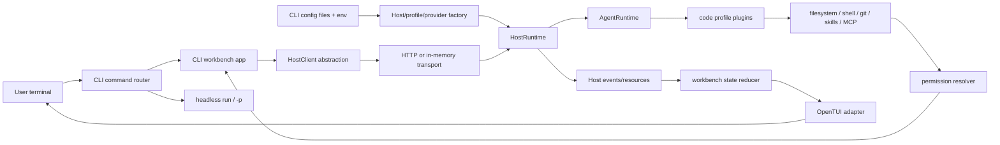

# Productized CLI Coding Workbench Plan

## 一句话结论

把 `@guga-agent/cli` 从“`run` 命令 + 协议 demo”升级成像 Pi、Claude Code、OpenCode、Blade Code 那样的产品化 coding-agent 入口：裸 `guga` 默认进入终端工作台，默认使用真实 `code` profile 和模型配置；`guga run` / `guga -p` 保留 headless 路径；renderer 主路径改为引入 OpenTUI 以节约开发成本；CLI 和未来桌面端继续共享 Host protocol，不在终端 UI 内另造一套 agent loop。

## Problem Frame

当前 Guga 已经有 Host runtime、Host SDK、Host protocol、stdio adapter、code-agent profile、filesystem/shell/git 插件、权限内核和基础 CLI streaming 输出，但 CLI 第一体验仍然偏向命令执行。用户期望的体验是：安装包后在项目里输入 `guga`，直接进入一个可持续工作的 coding-agent terminal workbench，可以选模型、读配置、跑真实工具、排队 follow-up、abort、回答权限请求，并且这些交互语义未来能被桌面端复用。

本计划以 `docs/brainstorms/2026-05-28-m37-productized-cli-workbench-requirements.md` 为源文档。计划不实现代码，只明确实现边界、模块拆分、测试场景和跨层风险。

## Research Findings

### Pi 如何处理

- Fact: Pi 将产品拆成 `pi-coding-agent`、`pi-agent-core`、`pi-ai`、`pi-tui`；裸 `pi` 进入 interactive mode，`-p` 和 `--list-models` 是稳定的 one-shot / 配置入口。
- Fact: Pi TUI 不是 React/Ink，而是小接口组件模型：组件输出 `render(width): string[]`，TUI 管 raw terminal、virtual terminal、focus、overlay、resize、cursor、diff redraw。
- Fact: Pi runtime 支持 `steer`、`followUp`、`nextTurn`、`abort` 和 `queue_update`；运行中输入不是丢弃，而是进入不同队列，并在运行生命周期内被清晰呈现。
- Guga 落点：采用 OpenTUI / Pi-style renderer 和 queue/control 语义；第一版把 Guga adapter 放在 `packages/cli` 内，不先抽独立 TUI 包。

### Claude Code 如何处理

- Fact: Claude Code TUI 是一个终端 agent 工作台，不是简单聊天 UI；主轴是 `Messages + PromptInput`，外围才是 permissions、MCP、tasks、agents、settings 等控制面。
- Fact: `PromptInput` 不只是文本框，而是组织历史、slash command、补全、模型/权限模式、排队命令、快捷面板的输入编排层。
- Fact: Claude Code 使用 append-only JSONL transcript 支撑 resume/session restore，UI 只渲染已发生事件和当前输入意图。
- Guga 落点：MVP 只做 Claude Code 工作台主轴：transcript、prompt editor、状态条、slash command、permission prompt、tool events、queue/abort。不要照搬完整 permissions/teams/tasks/agents 控制台。

### OpenCode/Host Protocol 参照

- Fact: `docs/research/context-packs/ui-protocol.md` 推荐 local server/SDK/SSE 使 CLI、Desktop、IDE 共享协议。
- Fact: OpenCode 用 server + SDK + event stream 让 TUI、Desktop、编辑器共享同一 agent 后端。
- Guga 落点：Host protocol 是 canonical。CLI 可以为了 MVP 进程内启动 `HostRuntime`，但 UI 状态必须来自 Host events / resources / controls；不要让 terminal renderer 反推 agent 状态。协议依据见 `docs/solutions/architecture-patterns/host-ui-protocol-v1.md`。

### OpenTUI 当前判断

- Fact: OpenTUI 提供 TypeScript terminal UI core、renderable/input/layout、keymap、React/Solid bindings，并以高性能 terminal UI 为目标。
- Fact: 当前文档显示 OpenTUI packages 偏 Bun-exclusive，Deno/Node 支持仍是计划项。
- Guga 落点：OpenTUI 可以作为 renderer 主路径，但 U3 必须先做 runtime/packaging spike；如果 Node CLI 发行目标无法直接兼容，要明确选择 Bun runtime、条件依赖，或保留一个极小 fallback renderer。

## Requirements Traceability

- R1 Bare workbench: 裸 `guga` 默认进入 interactive terminal workbench，`chat`/`interactive` 只作为兼容 alias。
- R2 Headless preserved: `guga run "<prompt>"` 保持脚本化输出；`guga -p "<prompt>"` 增加为 Pi/Claude-style one-shot alias。
- R3 Config/model: 支持 `GUGA_CONFIG`、项目 `.guga/config.json`、用户 `~/.guga/config.json`、env/default 的优先级；支持 model aliases、默认模型、provider mode、base URL、API key env。
- R4 Default coding profile: workbench 默认 `code` profile，并加载 `packages/profile-code-agent/src/bundle.ts` 聚合的 filesystem、shell、git、skills、MCP、ops/audit/eval 能力。
- R5 OpenTUI renderer: 在 `packages/cli` 内实现 Guga workbench adapter，引入 OpenTUI 作为 renderer 主路径，不新增 Ink/React 作为主路线，并保留 deterministic state/view 测试 seam。
- R6 Workbench UI: startup screen、transcript、streaming assistant text、tool lifecycle、permission/interaction prompt、queue 状态、abort 状态都从 Host events 渲染。
- R7 Running control: 运行中输入进入 queue/follow-up/steering；Escape/Ctrl-C 能 abort 当前 run 且不破坏 session。
- R8 Shared interaction protocol: 权限和 interaction request/response 走 Host protocol / Host runtime 语义，CLI 只是 client/workbench。
- R9 Session controls: `/new`、`/resume`、`/fork`、`/status`、`/clear`、`/permissions`、`/mcp`、`/exit` 具备最小路由。
- R10 Docs/tests: CLI 行为、配置、模型选择、slash routing、renderer frame、mock interactive run、真实 code profile 工具/权限路径都有覆盖。

## Scope Boundaries

In scope:

- CLI command surface、配置加载、模型选择、默认 profile 选择。
- `packages/cli` 内 OpenTUI workbench adapter 和 workbench state reducer。
- Host runtime/SDK/protocol 对 queue、abort、session、interaction、permission 的必要补齐。
- 真实 code profile 的 terminal permission bridge。
- README / CLI 文档和 smoke 验证说明。

Out of scope:

- 桌面端 UI 本体。
- ACP/LSP/IDE 深度集成。
- Ink/React renderer 路线。
- 第一版抽 `@guga-agent/tui` 包。
- Claude Code 规模的完整 teams/tasks/agents/MCP 控制台。
- Provider marketplace、自动 provider discovery。
- 持久 transcript/session storage 的全面重构；只做 workbench 所需的可恢复 session/control 语义。

## Key Technical Decisions

1. **裸 `guga` 是产品入口**

   `guga` 进入 workbench，`guga run` 和 `guga -p` 是脚本化路径。实现时应替换或吸收 `packages/cli/src/commands/run.ts` 里现有 line REPL scratch，不把它作为最终交互形态。

2. **Host protocol 是唯一 UI 协议边界**

   Workbench 的 transcript、tool、permission、interaction、queue、usage、run 状态全部来自 Host events/resources。Renderer 不直接读取 core internals，不解析 assistant 文本猜状态。CLI workbench 必须经 HostClient 抽象访问 host surface；可以使用 in-memory HostClient，但不能让 workbench 直接调用 `HostRuntime` 私有方法。

3. **Renderer 采用 OpenTUI 主路径**

   第一版引入 OpenTUI，Guga 自己只实现 workbench state、OpenTUI adapter、主题、command/input routing 和必要的测试 seam。不要引 Ink/React，也不要先抽 `@guga-agent/tui`。

4. **真实 code profile 进 MVP**

   默认 profile 是 `code`，使用 `packages/profile-code-agent/src/bundle.ts` 的 bundle 能力。Mock 只用于确定性测试，不能作为产品完成标准。

5. **权限桥接是关键路径，不是后续优化**

   `packages/profile-code-agent/src/permissions.ts` 在无 delegate 时会 deny write/execute ask 请求。Workbench 必须向 code-agent permission policy 提供 resolver，并把请求投射为 terminal prompt；未来桌面端也应通过同一 Host protocol 能响应 permission。

6. **Queue 语义先产品可用，再逐步深化**

   运行中输入必须可见、可控、不会丢。MVP 至少要支持 `follow_up` 在当前 run 完成后进入下一轮，同步更新 queue 状态；`steer` 如果 core runtime 尚无中途注入点，统一标记为 `deferred`，不得自动转换为 `follow_up`，也不得静默丢弃。

7. **先验证 OpenTUI 的运行时发布边界**

   OpenTUI 能节省 renderer 自研成本，但如果当前版本对 Bun 有强依赖，Guga 需要在 U3 明确 Node CLI 是否可发布、是否切换 Bun runtime、是否做条件加载，或是否保留最小 fallback。这个 spike 是 renderer 实现前置条件。

8. **协议兼容性由 contract suite 兜底**

   CLI/OpenTUI 和未来桌面端都必须能跑同一套 Host UI Protocol contract tests。HTTP HostClient 和 in-memory HostClient 要使用同一组场景验证 run lifecycle、permission response、queue、abort、SSE replay 和 protocol versioning。

9. **首跑缺配置不应破坏 workbench**

   裸 `guga` 可以在 provider/model/API key 缺失时启动 workbench，但 startup/status 必须明确显示缺失项。真实 run 应 fail-fast 并给出配置指引；`--mock` 和纯本地状态命令仍可用。

## High-Level Design

## Expected Output Structure

- `packages/cli/src/index.ts`：入口和 command dispatch。
- `packages/cli/src/commands/run.ts`：headless `run` / `-p` path，或拆出后保留兼容 facade。
- `packages/cli/src/config.ts`：配置文件、模型 alias、provider selection。
- `packages/cli/src/host-factory.ts`：CLI profile/provider/permission host factory。
- `packages/cli/src/workbench/`：workbench app、state reducer、Host session bridge、slash commands、permission/interaction bridge。
- `packages/cli/src/tui/`：OpenTUI adapter、terminal lifecycle bridge、editor/input bridge、overlay/layout/theme utilities。
- `packages/host-protocol/src/`：必要的 permission/interaction/control resources 补齐。
- `packages/host-sdk/src/`：workbench 所需 client methods。
- `packages/host-local-server/src/`：未来桌面端复用的 local server control routes。
- `packages/host-runtime/src/`：queue consumption、abort/session/control、permission response bridge。
- `packages/host-protocol-tests/` 或 `packages/host-sdk/src/contract/`：跨 transport 的 Host UI Protocol contract suite。
- `packages/cli/README.md` 或等价 CLI 文档：使用方式、配置、权限、模型切换。
- `docs/solutions/architecture-patterns/host-ui-protocol-v1.md`：CLI/OpenTUI 和未来桌面端共享的 Host UI Protocol v1。

## Implementation Units

### U1. CLI command router and config foundation

Files:

- `packages/cli/src/index.ts`
- `packages/cli/src/commands/run.ts`
- `packages/cli/src/config.ts`
- `packages/cli/src/run.test.ts`
- `packages/cli/src/config.test.ts`
- `packages/cli/src/commands/router.test.ts`

Approach:

- 将 command parsing 和 execution 分离，明确四条入口：裸 `guga`、`guga run`、`guga -p`、`guga --list-models`。
- 保留 `run` 的 headless 行为和当前 Host streaming 输出，但不要让 line REPL 成为最终 interactive 形态。
- 配置读取返回“值 + 来源”，供 startup screen 显示项目配置、用户配置、env/default 来源。
- `defaultProfile` 默认 `code`，但仍允许 CLI flag 和 slash command 覆盖。

Test scenarios:

- 裸 argv 进入 workbench launcher，而不是提示 usage。
- `run` 和 `-p` 对同一 prompt 走 headless path。
- `--list-models` 在有/无 models 配置时输出稳定。
- `GUGA_CONFIG` 优先于项目和用户配置。
- 项目 `.guga/config.json` 优先于用户配置。
- env overrides 能覆盖文件里的 provider/model 选择。
- 无效 model alias、缺失 prompt、未知 profile、无效 JSON 都返回可操作错误。
- 缺 provider/model/API key 时，bare workbench 可启动并显示配置缺失；真实 run fail-fast，`--mock` 仍可运行。

### U2. Host/profile/provider factory

Files:

- `packages/cli/src/host-factory.ts`
- `packages/cli/src/commands/run.ts`
- `packages/cli/src/workbench/host-session.ts`
- `packages/profile-code-agent/src/bundle.ts`
- `packages/cli/src/host-factory.test.ts`

Approach:

- 把当前 `createCliHost` 从 `run.ts` 中抽出，让 headless 和 workbench 共用。
- 默认 `code` profile 使用 `createCodeAgentPlugins()` / `createCodeAgentRuntimeOptions()` 的既有模式，workspace root 取当前项目路径。
- Mock provider 仍用于 deterministic test，但真实 provider 由 config/model selection 注入。
- Skills/MCP roots/server config 先透传给 code profile factory；不在 CLI 重写工具注册逻辑。

Test scenarios:

- 默认 workbench factory 创建 `code` profile。
- `--profile deep-research` / `review` 能切换到对应 profile。
- `--mock` 注册 mock provider 且不要求 API key。
- 文件配置模型能生成 provider plugin config。
- 无 provider/model/API key 时 headless 给出清晰失败或 mock-only 指引。

### U3a. OpenTUI compatibility spike and runtime decision

Files:

- `packages/cli/package.json`
- `docs/solutions/architecture-patterns/host-ui-protocol-v1.md`
- `docs/plans/2026-05-28-037-feat-productized-cli-workbench-plan.md`
- `packages/cli/src/tui/opentui-compat.test.ts`

Approach:

- Verify whether current `@opentui/*` packages work with Guga's Node/pnpm build, test, and package smoke.
- Capture a short decision record in this plan or a follow-up architecture note before implementing the adapter.
- The decision must choose exactly one runtime path: Node-compatible OpenTUI, Bun runtime for CLI workbench, conditional OpenTUI loading with fallback, or minimal fallback renderer.
- U3a is a go/no-go gate for U3b. U4 reducer work may proceed in parallel only because it must remain renderer-agnostic.

Test scenarios:

- OpenTUI dependency passes CLI package build/test smoke, or the chosen fallback/runtime path is covered by an automated smoke.
- Non-TTY fallback behavior remains defined regardless of OpenTUI outcome.
- `packages/cli/src/workbench/*` typechecks without importing `@opentui/*`.

### U3b. OpenTUI renderer adapter

Files:

- `packages/cli/src/tui/opentui-adapter.ts`
- `packages/cli/src/tui/terminal.ts`
- `packages/cli/src/tui/keys.ts`
- `packages/cli/src/tui/editor.ts`
- `packages/cli/src/tui/overlay.ts`
- `packages/cli/src/tui/theme.ts`
- `packages/cli/src/tui/*.test.ts`

Approach:

- Build only after U3a has selected the runtime path.
- 在 Guga 内保留 renderer port：workbench state/view model 不直接依赖 OpenTUI 类型，OpenTUI 只在 adapter 层出现。
- 使用 OpenTUI core 的 layout/input/renderable 能力承载 transcript、status、editor、overlay、select。
- Editor 支持 multiline input、history 基础能力、slash command prefix routing、Escape/Ctrl-C 快捷键。
- Overlay 支持 permission prompt、model/profile select、help/status 等最小面板。

Test scenarios:

- Workbench view model 到 OpenTUI adapter 的映射可用 mock renderer 测试。
- Editor 的 Enter、Shift/Meta newline 策略稳定。
- Escape/Ctrl-C 被路由为 abort intent。
- Overlay focus 时输入不会误发给 agent。
- 非 TTY 启动返回可读错误或 headless 指引。

### U4. Workbench state reducer and transcript views

Files:

- `packages/cli/src/workbench/state.ts`
- `packages/cli/src/workbench/event-reducer.ts`
- `packages/cli/src/workbench/views.ts`
- `packages/cli/src/workbench/workbench.ts`
- `packages/cli/src/render/events.ts`
- `packages/cli/src/workbench/*.test.ts`
- `packages/cli/src/workbench/dependency-boundary.test.ts`

Approach:

- 以 HostEvent 为唯一输入，把 run/message/tool/permission/interaction/queue/usage/context/artifact 事件规约成 terminal state。
- Workbench reducer/view model 必须 renderer-agnostic：`packages/cli/src/workbench/*` 禁止 import `@opentui/*`，OpenTUI 类型只允许出现在 `packages/cli/src/tui/*`。
- Startup screen 展示 project path、session、profile、model、config source、常用 slash commands。
- Transcript 区分 assistant streaming text、final answer、tool started/completed/failed、permission pending/resolved、queue update、abort/cancel/error。
- `packages/cli/src/render/events.ts` 的现有 line renderer 可作为 headless 输出，但 headless 和 workbench 必须共享 HostEvent 消费/normalization 层，避免协议漂移。

Test scenarios:

- `message.delta` 合并为同一 assistant streaming block。
- tool lifecycle 渲染为可折叠/可扫描记录。
- permission pending 后 resolved 更新同一项状态。
- queue.updated 显示 pending steer/follow-up 数量和预览。
- run.failed / run.cancelled / abort 后状态条一致。
- `/clear` 只清 UI transcript，不删除 session/run 资源。
- Dependency boundary test fails if `workbench/*` imports `@opentui/*`.

### U5. Slash commands and model/profile/session controls

Files:

- `packages/cli/src/workbench/commands.ts`
- `packages/cli/src/workbench/model-control.ts`
- `packages/cli/src/workbench/session-control.ts`
- `packages/cli/src/workbench/commands.test.ts`

Approach:

- Slash command router 只处理工作台命令；普通文本交给 run start 或 queue control。
- `/models`、`/model <id>` 读取同一 config/model registry。
- `/profile <id>` 通过 Host/profile factory 切换 profile，并明确 session 行为：新 profile 默认新 session，避免混合 profile transcript；新 session resource 应带 `profileId` / `modelId` 摘要，便于桌面端 sidebar 复用。
- `/new`、`/resume`、`/fork` 通过 Host SDK/session resources 完成。
- `/permissions`、`/mcp` MVP 显示当前 policy/server/tool 状态，不实现完整管理控制台。
- `/permissions` 和 `/mcp` 的数据来源必须是 Host resources：permission snapshot / `/capabilities` / `/operations/status`，不能扫描 renderer 或本地临时状态。

Test scenarios:

- 未知 slash command 给出建议，不发送给 agent。
- `/model` 对未知 alias fail-fast。
- `/profile code` 回到真实 code profile。
- `/new` 创建新 session 并重置 active run。
- `/resume` 对不存在 session 显示错误。
- `/fork` 在同一 session 下创建新 branch，更新 `activeBranchId`，并在 startup/status 中体现 branch 关系。
- `/status` 至少读取一次 `/operations/status`，作为 operations protocol smoke。

### U6. Run lifecycle, queue, follow-up, and abort integration

Files:

- `docs/solutions/architecture-patterns/host-ui-protocol-v1.md`
- `packages/cli/src/workbench/host-session.ts`
- `packages/host-runtime/src/host-runtime.ts`
- `packages/host-sdk/src/client.ts`
- `packages/host-local-server/src/routes.ts`
- `packages/host-runtime/src/host-runtime.test.ts`
- `packages/host-sdk/src/client.test.ts`
- `packages/host-local-server/src/server.test.ts`
- `packages/cli/src/workbench/host-session.test.ts`

Approach:

- 按 Host UI Protocol v1 约定实现 REST resources/control + SSE ordered HostEvents，CLI/OpenTUI 和未来桌面端共享同一 SDK/reducer 边界。
- 补齐协议发现、SDK `getProtocolInfo()`、run cancellation event、waiting-for-interaction 状态和 SSE reconnect/afterSeq 行为。
- Workbench 通过 HostClient abstraction start run、stream events、send run input、abort/cancel active run；HostClient 可由 HTTP transport 或 in-memory transport backed by HostRuntime 提供，但 workbench 不直接调用 HostRuntime。
- 补齐当前 queue 只记录不消费的差距：`follow_up` 至少在当前 run terminal 后自动进入下一轮 run；queue 消费时发出更新事件。
- `steer` 作为独立模式保留在协议中。如果 core runtime 能在安全点注入，则消耗为 steering；否则 MVP 统一标记为 `deferred`，不自动转成 `follow_up`。
- Abort 需要同时取消 active run、更新 run resource、取消 pending queue/permission/interaction，并让 session 保持可继续输入。
- SSE event `id` 使用 `HostEvent.seq`，`afterSeq` 为 exclusive replay cursor；terminal event 后 run 的 `lastSeq` 冻结。

Test scenarios:

- active run 中输入 `follow_up` 会产生 queue.updated，并在当前 run 完成后启动下一轮。
- queue 被消费后 pending 列表清空或更新。
- `RunResource.queuedInputs` 与最新 `queue.updated.pending` 摘要一致，避免 reducer 顺序敏感。
- 无 runtime steering injection hook 时，active run 中输入 `steer` 会保留为 `deferred`，不会自动转换为 `follow_up`。
- run-scoped interaction pending 时 run status 进入 `waiting-for-interaction`；`interaction.resolved` 或 `interaction.cancelled` 后恢复 `running`，除非 run 已 terminal。
- active run 中 abort 会结束 streaming，run resource 进入 cancelled/aborted 可解释状态。
- abort 会把当前 run 的 pending queue、permission、interaction 标记为 cancelled，并在 `run.cancelled` 前发出对应事件。
- abort 不破坏 session，之后可以继续发新 prompt。
- 非 active run 不接受 run input，并返回明确错误。
- HTTP HostClient 和 in-memory HostClient 使用同一组 contract tests 验证协议行为一致。
- `GET /protocol` 返回 version/features；SDK 启动时校验 `version === "1"`，不兼容时 fail-fast。
- SSE reconnect with `afterSeq` replays no missing and no duplicate events.
- SSE event id 等于 `HostEvent.seq`；terminal event 后 `RunResource.lastSeq` 冻结，不再追加该 run 的事件。
- Bounded buffer future case returns a recoverable stale-cursor error, and client falls back to run snapshot.

### U7. Permission and interaction bridge

Files:

- `docs/solutions/architecture-patterns/host-ui-protocol-v1.md`
- `packages/cli/src/workbench/permissions.ts`
- `packages/cli/src/workbench/interactions.ts`
- `packages/host-protocol/src/resources.ts`
- `packages/host-protocol/src/events.ts`
- `packages/host-sdk/src/client.ts`
- `packages/host-local-server/src/routes.ts`
- `packages/host-runtime/src/host-runtime.ts`
- `packages/profile-code-agent/src/permissions.ts`
- `packages/cli/src/workbench/permissions.test.ts`
- `packages/host-runtime/src/host-runtime.test.ts`

Approach:

- 按 Host UI Protocol v1 将 permission 作为一等安全/audit resource，而不是普通 renderer overlay state。
- Workbench host factory 为 `createCodeAgentPermissionPolicy()` 提供 delegate resolver。
- Resolver 将 write/execute ask 请求映射成 terminal permission overlay，并等待 allow/deny 结果。
- Permission request/resolution 继续投射为 Host events，供 CLI 和未来桌面端统一渲染。
- 补齐 `SDK.respondPermission(permissionId, resolution)`、HTTP `POST /permissions/:permissionId/respond`、runtime permission bridge，而不是让 CLI 直接绕过协议。
- 错误语义按协议固定：missing `404 NOT_FOUND`、non-pending `409 PERMISSION_NOT_PENDING`、invalid resolution `400 BAD_REQUEST`。
- Headless/非交互模式继续 fail-closed，不能静默 approve ask-required 操作。

Test scenarios:

- filesystem write 或 shell execute 触发 permission prompt。
- 用户 allow 后工具继续执行并发出 resolved event。
- 用户 deny 后工具失败且原因可见。
- destructive shell command 仍由 code profile policy 直接 deny。
- permission prompt 超时或 abort 时 fail-closed。
- Host SDK/local server 的 permission response 能驱动同一 runtime resource。
- Duplicate permission response returns `409 PERMISSION_NOT_PENDING`.
- CLI workbench permission overlay resolves through HostClient/SDK, not direct runtime calls.

### U8. Product smoke, documentation, and regression coverage

Files:

- `packages/cli/README.md`
- `packages/cli/src/run.test.ts`
- `packages/cli/src/workbench/smoke.test.ts`
- `docs/brainstorms/2026-05-28-m37-productized-cli-workbench-requirements.md`
- `docs/plans/2026-05-28-037-feat-productized-cli-workbench-plan.md`

Approach:

- 文档覆盖 `guga`、`guga run`、`guga -p`、`--list-models`、配置文件、模型切换、profile 切换、权限语义、mock smoke。
- CLI README 与 `docs/solutions/architecture-patterns/host-ui-protocol-v1.md` 必须同步列出共享 controls/events/permission/queue 语义；协议变更 PR 需要检查两边是否一致。
- 自动化测试以 mock provider + temporary workspace 为主，避免修改真实仓库。
- 至少保留一条真实 code profile 工具路径的集成验证：读文件、尝试写文件/跑命令、approve/deny 权限。
- 最终质量门槛覆盖 workspace typecheck、test、build。

Test scenarios:

- `guga --help` 暴露 productized CLI 入口。
- `guga --list-models` 与 `/models` 使用同一 registry。
- `guga -p "Say exactly: ok" --mock` 输出确定性结果。
- 裸 `guga --mock` 能启动 workbench 并完成一轮 mock prompt。
- code profile 工具事件在 workbench transcript 中可见。
- permission approve/deny 路径端到端可观察。
- README 中的 controls/events 表与 protocol 文档保持一致。

### U9. Host protocol contract suite

Files:

- `packages/host-protocol-tests/` or `packages/host-sdk/src/contract/`
- `packages/host-protocol/src/resources.ts`
- `packages/host-protocol/src/events.ts`
- `packages/host-sdk/src/client.ts`
- `packages/host-local-server/src/server.test.ts`
- `packages/host-runtime/src/host-runtime.test.ts`
- `packages/cli/src/workbench/event-reducer.test.ts`

Approach:

- Create a shared protocol contract suite that can run against both HTTP HostClient and in-memory HostClient.
- Use the suite as the compatibility guard for CLI/OpenTUI and future desktop GUI.
- Keep scenarios at protocol level: REST controls, resource snapshots, ordered HostEvents, reducer-visible state.
- Golden reducer fixtures should be renderer-agnostic and contain no OpenTUI types.

Test scenarios:

- Protocol discovery returns version/features and SDK rejects unsupported versions.
- Run lifecycle emits ordered events and updates `RunResource.lastSeq`.
- SSE reconnect with `afterSeq` has no missing or duplicated events.
- Queue contract covers `follow_up` consumption and `steer` deferred behavior.
- Abort cancels pending queue, permission, and interaction before `run.cancelled`.
- Permission response covers allow, deny, duplicate response, expired/cancelled, and invalid resolution errors.
- Fork creates a branch within the same session, not a child session.
- CLI reducer consumes the same contract fixtures as the transport tests.
- Headless `run` / `-p` and workbench share HostEvent normalization fixtures so event vocabulary changes cannot drift silently.

## Dependencies And Sequencing

1. U1 先落 command/config 边界，避免 workbench 建在临时 line REPL 上。
2. U2 抽 Host/profile/provider factory，让 headless 和 workbench 共用 runtime composition。
3. U3a 必须先完成 OpenTUI runtime/packaging spike 和 go/no-go 判决；U3b 只能在 U3a 通过后开始。
4. U4 的 HostEvent reducer 可与 U3a 并行推进，但必须保持 renderer-agnostic。
5. U6/U7 必须在真实交互前补齐协议发现、queue/abort/session、permission response 和 interaction 生命周期。
6. U9 contract suite 应在 U6/U7 初期建立，作为协议变更的回归保护，而不是最后补。
7. U5 在 U4 state model 和 U6 session/fork semantics 稳定后接入 slash commands。
8. U8 收口文档、smoke 和跨层回归。

## Risks And Mitigations

- **权限安全风险**：真实 shell/write 工具进入 MVP。缓解：headless fail-closed、destructive command 继续 deny、terminal prompt 必须显式 approve。
- **OpenTUI 兼容风险**：当前文档显示 OpenTUI 偏 Bun-exclusive，而 Guga CLI 目前是 Node/pnpm 包。缓解：U3a 先做 packaging spike 和 go/no-go 判决，再进入 U3b adapter 实现。
- **Renderer 绑定风险**：直接把业务状态绑到 OpenTUI API 会影响未来桌面端或 renderer 替换。缓解：HostEvent reducer 和 workbench view model 保持 renderer-agnostic，OpenTUI 只在 adapter 层出现。
- **Queue 语义风险**：Host runtime 当前能记录 queue，但消费语义不足。缓解：先把 follow-up 消费作为明确 MVP；无注入 hook 时 `steer` 固定为 `deferred`，不自动转 follow-up。
- **协议分裂风险**：CLI 进程内使用 runtime 容易绕过 Host protocol。缓解：workbench 只能依赖 HostClient abstraction，并用 HTTP/in-memory contract suite 双跑。
- **配置错误体验风险**：模型/provider/API key 缺失会让裸 `guga` 失败。缓解：startup/status 展示 config source 和具体缺失项，mock path 保持可测。
- **现有 scratch 代码风险**：`packages/cli/src/commands/run.ts` 和 `packages/cli/src/config.ts` 已有 exploratory edits。缓解：实现时先审阅并吸收有价值逻辑，不直接在 scratch line REPL 上继续堆功能。

## Assumptions

- 第一版不要求桌面端 UI 同步交付，但 Host protocol/SDK/server 的新增能力必须为桌面端保留可复用边界。
- 第一版接受引入 OpenTUI，但不把 Host protocol、workbench state 或权限/queue 语义绑定到 OpenTUI。
- 第一版的 `steer` 在没有 core 中途注入 hook 时统一标记为 `deferred`；不会自动转成 `follow_up`，也不能在 UI 上谎称已实时注入。
- 真实 provider 的端到端 smoke 可由用户环境配置驱动；自动化测试默认使用 mock provider 和 temporary workspace。

## Evidence

- Fact: `docs/research/context-packs/ui-protocol.md` 将 CLI/TUI、local server、Desktop/IDE 视为共享 agent UI protocol 的不同客户端形态。
- Fact: `docs/research/context-packs/tool-registry.md` 总结了 builtin + MCP + plugin tools 统一工具池，以及 allow/ask/deny 的 fail-closed 权限模型。
- Fact: `docs/research/source-analysis/claude-code-analysis/analysis/components/01-component-architecture-overview.md` 说明 Claude Code TUI 的核心是 `Messages + PromptInput` 工作台主轴。
- Fact: `docs/research/source-analysis/claude-code-analysis/analysis/components/02-core-interaction-components.md` 说明 PromptInput 负责 slash/typeahead、queued commands、model/permission mode 等输入编排。
- Fact: `docs/research/source-analysis/claude-code-analysis/analysis/04i-session-storage-resume.md` 说明 Claude Code 用 append-only transcript 支撑 session resume。
- Fact: `docs/research/repomix/pi-focused-context.xml` 说明 Pi 有 `pi-coding-agent`、`pi-agent-core`、`pi-ai`、`pi-tui` 分层，裸 `pi` 进入 interactive mode，`-p` 和 `--list-models` 是 release smoke 入口。
- Fact: `docs/research/repomix/pi-focused-context.xml` 说明 Pi runtime 支持 `steer`、`followUp`、`nextTurn`、`abort`、`queue_update`。
- Fact: `docs/research/repomix/pi-focused-context.xml` 说明 `pi-tui` 的组件模型以 `render(width): string[]` 为核心，TUI 负责 terminal/diff/render/input。
- Fact: OpenTUI 当前文档说明其提供 TypeScript terminal UI core、renderable/input/layout、keymap 与 React/Solid bindings，并被定位为高性能 terminal UI 框架。
- Fact: OpenTUI 当前文档说明其 packages 当前偏 Bun-exclusive，Node 支持仍需验证。
- Fact: `packages/profile-code-agent/src/bundle.ts` 已聚合 filesystem、shell、git、skills、MCP、ops、audit、eval 插件。
- Fact: `packages/profile-code-agent/src/permissions.ts` 在没有 delegate resolver 时会 deny write/execute ask 请求。
- Fact: `packages/host-runtime/src/host-runtime.ts` 已支持 queue resource/event，但当前计划需要补齐 queue 消费语义。
- Inference: Guga 最合适的路线是 Pi-style terminal product surface + OpenCode/Host-style shared protocol，而不是复制 Claude Code 的完整 Ink 控制台。
