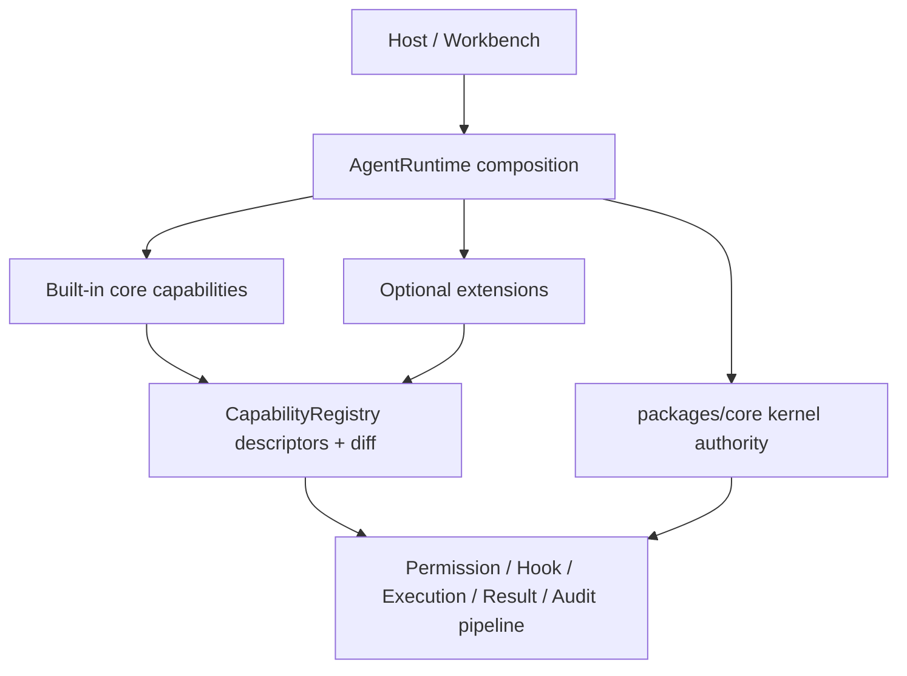
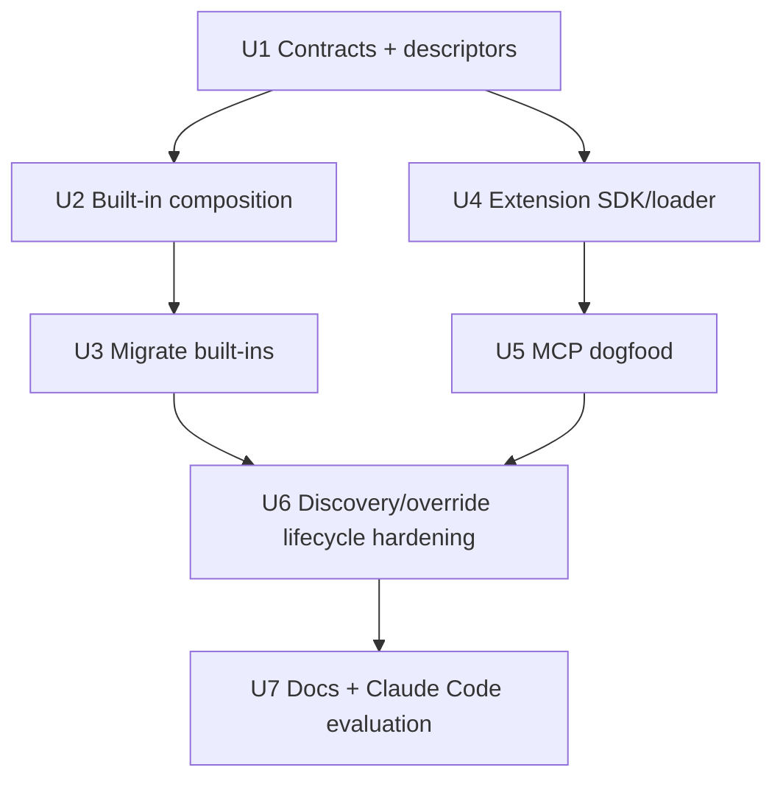

# feat: 建立 Extension 规范与 Built-in Core Capabilities

## 摘要

本计划把 Guga 的 runtime capability 体系收拢为三层：`packages/core` 包含 core kernel 与默认 built-in core capabilities，filesystem/git/shell/provider-ai-sdk 直接作为 core 默认能力提供，MCP/skills/memory 等可选生态能力迁移到统一 extension spec。实现上优先复用现有 `CapabilityRegistry`、`PluginHost`、permission/hook/execution pipeline 和 discovery/diff 机制，避免引入第二套注册系统。

---

## 问题背景

现有 Guga 已经有 plugin-oriented runtime，但 first-party 默认能力与可选生态能力都以 plugin 形态出现，容易让 host、作者和审计面难以判断某项 capability 是默认 coding-agent substrate，还是项目/用户主动启用的扩展。M38 的目标是在 `packages/core` 默认拥有基础 coding-agent 能力的前提下，保持 core kernel 子层与 built-in implementation modules 的清晰边界，并建立类似 pi 的 built-in 与 extension 分层。

---

## 需求

- R1. 定义三层 runtime 边界：core kernel、built-in core capabilities、extensions。
- R2. `packages/core` 保持小内核，只拥有 contracts、registry、hook、permission、execution、event/audit 与 runtime composition authority。
- R3. Filesystem、git、shell、provider-ai-sdk 作为 built-in core capabilities，而不是普通 optional extensions。
- R4. Built-in core capabilities 通过同一 registry 注册，并通过与 extension capabilities 相同的 permission、hook、execution、result、audit pipeline 执行。
- R5. Capability discovery 区分 built-in core capabilities 与 extension-provided capabilities。
- R6. 为 optional ecosystem capabilities 定义统一 extension authoring spec。
- R7. Extension spec 支持 metadata、ownership、source、namespace、declared effects、permission requirements、dependencies 和 lifecycle behavior。
- R8. Extension spec v1 覆盖 optional tools、providers/models、skills/resources、MCP configurations、hooks、context policies、operations 和 capability metadata。
- R9. Commands、UI components、shortcuts、renderers 不作为 extension v1 runtime scope 的硬要求。
- R10. First-party optional packages 与未来 external packages 使用同一 public contract。
- R11. Extension setup context 清楚声明可用 runtime powers，不暴露绕过 core authority 的 escape path。
- R12. Extension 只能通过显式 override declaration 增强或替换 built-in core capabilities。
- R13. Built-in override behavior 可 discovery、可 diff、可 audit。
- R14. Extension 不得静默替换 built-in core capability 或 trusted capability。
- R15. Extension-provided tools 和 overridden tools 仍通过 core permission、hook、execution、result、audit pipeline。
- R16. Extension hooks 声明 phase 和 effect，mutating/blocking decisions 可审计。
- R17. 现有 first-party packages 分类为 built-in core capability 或 optional extension。
- R18. Filesystem、git、shell、provider-ai-sdk 迁入 `packages/core` 的 built-in core capability implementation modules，但不把具体实现耦合进 core kernel 子层。
- R19. MCP、skills、memory、artifact、replay/audit、ops/eval、delegation、future workflow integrations 逐步迁移到统一 extension spec。
- R20. Migration 保留现有 capability behavior，除非有明确产品决策改变行为。
- R21. Runtime capability discovery 解释 source layer、owner、namespace、capability type、trust metadata 和 registration status。
- R22. Capability diff 解释 built-ins、extension-added capabilities、removed capabilities、overrides 和 skipped conflicts。
- R23. Extension enable、disable、reload、shutdown 不留下 stale callable capabilities 或 active hook contexts。
- R24. Extension context 在 unload、reload、runtime shutdown 或 session replacement 后失效。

**Origin actors：** A1 Guga core/runtime 维护者；A2 built-in capability 维护者；A3 extension 作者；A4 host/workbench 开发者；A5 规划/实施 agent。

**Origin flows：** F1 Runtime 启动并加载 built-ins；F2 Extension 贡献可选能力；F3 Extension override 或增强 built-in capability；F4 First-party 可选 plugins 迁移到 extension spec。

**Origin acceptance examples：** AE1 built-ins discovery 与统一 pipeline；AE2 optional extension metadata 注册；AE3 override 显式声明与 diff；AE4 first-party 分类迁移；AE5 disable/reload 清理 stale capabilities。

---

## 范围边界

- 不把 core kernel internals 变成 extensions。
- 不把 filesystem/git/shell/provider-ai-sdk 实现混入 `packages/core/src/contracts`、registry、hook、permission、execution pipeline 等 kernel 子层；它们应作为独立 built-in modules 存放。
- 不在 extension v1 中强制支持 commands、shortcuts、UI components 或 renderers。
- 不建设 marketplace、signing、remote install、plugin scoring 或 package search。
- 不要求所有 optional first-party packages 在一个 PR 内完成迁移。
- 不允许任何 extension 绕过 core permission、hook、execution、result、audit 或 replay authority。

### 留待后续工作

- Package rename 或旧包下线：`packages/plugin-tools-*` 和 `packages/provider-ai-sdk` 应先作为 compatibility wrappers 或 re-export path 保留，等下游 import 稳定后再单独处理移除。
- Host/workbench UI extension surface：等 host UI protocol 稳定后再规划 commands、shortcuts、renderers、widgets。
- External extension package distribution：marketplace、签名、远程安装和版本信任策略留到 extension v1 runtime contract 之后。

---

## 上下文与调研

### 相关代码与模式

- `packages/core/src/contracts/plugins.ts` 已经有 `CapabilitySource = "host" | "plugin" | "mcp" | "built-in"`、`CapabilityDescriptor`、`ToolRegistrationOptions.override`、`PluginContext` 和 plugin lifecycle contracts。
- `packages/core/src/registry/capability-registry.ts` 已记录 descriptors、diff descriptors，并支持 tool override；这是 M38 应扩展的主路径。
- `packages/core/src/plugin-host/plugin-host.ts` 已跟踪 plugin contributions，并在 shutdown 时移除 providers/models/tools/skills/hooks/policies/stores/replay/operations。
- `packages/core/src/tools/execution-pipeline.ts`、`packages/core/src/permissions/permission-kernel.ts`、`packages/core/src/hooks/hook-kernel.ts` 已经是工具执行 authority；built-in 和 extension tools 都必须走这条路径。
- `packages/plugin-tools-filesystem/src/filesystem-plugin.ts`、`packages/plugin-tools-git/src/git-plugin.ts`、`packages/plugin-tools-shell/src/shell-plugin.ts` 当前提供默认工具实现，但 metadata 仍标识为 first-party plugin package。
- `packages/provider-ai-sdk/src/ai-sdk-provider.ts` 当前通过 `createAiSdkProviderPlugin` 贡献 provider/model，适合迁入 built-in capability registration 形态。
- `packages/plugin-mcp/src/mcp-plugin.ts` 与 `packages/plugin-mcp/src/mcp-tool-adapter.ts` 是 optional extension spec 的首个 dogfood 候选，因为 MCP 明确属于可选生态能力。

### 项目经验

- `docs/solutions/architecture-patterns/core-kernel-runtime.md`：core 应保持 host-neutral，不引入 provider SDK、CLI、UI 或真实工具实现。
- `docs/solutions/architecture-patterns/tool-permission-runtime.md`：真实工具必须通过 core-owned permission、scheduler、timeout、result 和 hook pipeline。
- `docs/solutions/architecture-patterns/provider-ai-sdk-bridge.md`：AI SDK 是默认真实 backend adapter，但 SDK 类型不能泄漏进 core public API。
- `docs/solutions/architecture-patterns/plugin-capability-discovery.md`：descriptor 是数据化解释面，不能包含 executable functions、child processes 或 runtime-only objects。

### 外部参考

- pi reference research in `docs/research/repomix/pi-focused-context.xml`：pi 将 built-in tools/providers 与 extension API 区分，extensions 通过 `ExtensionAPI` 注册 tools/providers/hooks/resources，并可显式 override built-in tools。
- pi reference research in `docs/research/repomix/pi-token-tree.txt`：pi repo 同时存在 built-in provider/tool registration 和 extension examples/docs，说明内部默认能力与 extension 生态不是同一层。
- 本计划会用命令行 Claude Code 对方案做只读评估，作为规划质量验证来源。

---

## 关键技术决策

| 决策 | 理由 |
|---|---|
| 扩展现有 registry/plugin-host，而不是新增 extension registry | 当前 registry 已经承载 descriptor、diff、override、cleanup；新增并行注册系统会制造 authority 分裂。 |
| Built-ins 直接作为 `packages/core` 默认能力 | 用户希望 core 默认就有 filesystem/git/shell/provider-ai-sdk；实现时用 internal built-in modules 保持 kernel 子层边界。 |
| Extension v1 先做 runtime capabilities，不做 UI/command surface | 需求明确 commands/UI/renderers 后置，且 host/workbench 协议仍在演进。 |
| Override 允许但需要显式声明与 audit metadata | 继承 pi 的灵活性，但比静默替换更适合 Guga 的 permission/audit/replay 模型。 |
| v1 override 拒绝多重/链式替换 | 多个 extension 同时替换同一 built-in，或 B 再替换 A 的结果，会让 restore、audit 和 permission 语义复杂化；v1 先 fail closed。 |
| Host-level built-in replacement 不等同于 extension override | Host 为沙箱、远程执行或企业策略替换默认 shell/git/filesystem/provider 时，应走 runtime composition policy，并产生 audit；不要求伪装成 extension override。 |
| `plugin-mcp` 作为 optional extension dogfood 首选 | MCP 不是默认 coding-agent substrate，且已有 source/namespace metadata 与 runtime integration tests。 |
| 增加非 MCP dogfood fixture | MCP 形态偏 child-process/remote-tools，不能单独代表 extension spec；U5 需要增加 hook-only 或 in-process tool fixture 验证 spec 不被 MCP 绑架。 |
| `provider-ai-sdk` 的 built-in 身份限定为 adapter bridge | Built-in 的是 AI SDK bridge/adapter 与默认组合路径，不代表所有具体 provider package、credentials 或 remote endpoint 都属于 built-in。 |
| Claude Code 评估作为计划/架构校验，不作为实现依赖 | 用户明确要求命令行 Claude Code 评估；它应验证方案完整性，而不是替代 Guga 自己的测试。 |

---

## 待定问题

### 规划阶段已解决

- Built-in core capabilities 是否应该直接进入 `packages/core`？结论：进入。filesystem、git、shell、provider-ai-sdk 作为 `packages/core` 内的 built-in modules 默认注册，但 core kernel 子层不直接依赖具体实现。
- Extension v1 是否包括 UI commands/renderers？结论：不包括强制 runtime scope，等 host/workbench protocol 稳定后再追加。
- 哪个 optional package 最适合 dogfood extension spec？结论：`packages/plugin-mcp`，因为它明确代表可选外部集成，且已有 runtime integration 和 source metadata。
- 多个 extension 是否可以同时 override 同一个 built-in？结论：v1 不允许。多重 override 和链式 override 都应 reject/skip，并进入 conflict/diff/audit 输出。
- Override allow/deny policy 放在哪里？结论：规划为 core runtime/extension policy contract，而不是普通 tool permission profile；registration 时决定是否允许 override，execution 时仍走正常 permission/hook/pipeline。

### 留待实施阶段确认

- Built-in modules 的内部目录命名：建议从 `packages/core/src/builtins/*` 开始，实施时可根据现有导出风格微调。
- Compatibility exports 的保留周期：旧 `packages/plugin-tools-*` 和 `packages/provider-ai-sdk` import path 需要根据下游实际使用决定 deprecated alias 的保留策略。
- Extension manifest 的具体字段命名：计划定义字段类别与约束，最终字段名可在实现中按 TypeScript ergonomics 调整。
- LocalPlugin 与 Extension 的长期 deprecation 节奏：本计划只建立兼容迁移路径，移除旧 API 需要等 optional first-party packages 完成迁移后另行决策。
- Built-in 第三方依赖声明方式：实施时需要决定 AI SDK、provider SDK 或其它可选依赖放在 `dependencies`、`peerDependencies` 还是 `optionalDependencies`，并确保缺失时有明确降级诊断。

---

## 高层技术设计

> *这只是用于评审的方向性设计说明，不是实现规格。实施 agent 应把它当作上下文，而不是需要逐字复现的代码。*

实施依赖关系：

---

## 实施单元

- U1. **Core contracts for capability layers and extension metadata**

**目标：** 扩展 core public contracts，让 runtime 能表达 core kernel、built-in core capability、extension 三层来源，以及 extension v1 的 metadata、permission、effect、dependency、lifecycle 与 override 意图。

**需求：** R1, R2, R5, R6, R7, R8, R9, R10, R11, R12, R13, R16, R21, AE2, AE3

**依赖：** 无

**文件：**
- 修改: `packages/core/src/contracts/plugins.ts`
- 修改: `packages/core/src/contracts/hooks.ts`
- 修改: `packages/core/src/contracts/tools.ts`
- 修改: `packages/core/src/contracts/runtime.ts`
- 修改: `packages/core/package.json`
- 修改: `packages/core/src/index.ts`
- 测试: `packages/core/src/contracts/contracts.test.ts`
- 测试: `packages/core/src/registry/capability-registry.test.ts`

**方案：**
- 保留现有 `LocalPlugin` 兼容面，同时新增或扩展 extension-facing contract，明确 extension v1 可贡献的 capability kinds。
- 在 descriptor 层增加足够表达 built-in vs extension 的字段或约束：source layer、owner、namespace、trust、declared effects、registration status、override metadata。
- 定义合法 source/layer/owner 组合矩阵：built-in 不应带 ordinary extension owner；extension-provided MCP tool 需要同时表达 extension owner 与 MCP namespace/source。
- 定义 v1 override policy contract：默认拒绝 trusted/built-in override；允许时必须声明 target、reason、effect/trust metadata；多重 override 和链式 override 在 v1 fail closed。
- 定义 host-level built-in replacement contract：host 可以在 runtime composition 阶段替换默认 built-in backend 或 provider bridge，这与 extension override 分开建模，并需要独立 audit metadata。
- 将 hook phase/effect 的 audit metadata 纳入 extension registration contract，避免 extension hook 成为不可解释的 callback。
- 不在 contract 中暴露执行函数以外的 runtime internals；descriptor 输出保持 serializable。

**遵循模式：**
- `packages/core/src/contracts/plugins.ts` 中现有 `CapabilityDescriptor`、`CapabilitySource`、`ToolRegistrationOptions`。
- `docs/solutions/architecture-patterns/plugin-capability-discovery.md` 的 descriptor-only 原则。

**测试场景：**
- 正常路径：注册 built-in descriptor 后，discovery 返回 built-in source/layer、name、type、namespace/trust metadata。
- 正常路径：注册 extension descriptor 后，discovery 返回 owner、source、declared effect 和 permission metadata。
- 边界情况：descriptor 不包含 executable function、AbortSignal、child process 或非序列化 runtime object。
- 错误路径：未声明 override 的重复 tool/capability 继续 fail closed。
- 错误路径：第二个 extension 尝试 override 已被 override 的 built-in 时被 reject/skip，并进入 conflict descriptor。
- 边界情况：source/layer/owner 三维组合不合法时不能注册 descriptor。
- 覆盖 AE2 / AE3：extension metadata 与 override intent 能被 descriptor 表达。

**验证：**
- Core contracts 编译通过，descriptor serialization/diff 测试覆盖 built-in 与 extension 两种来源。

---

- U2. **Built-in core modules inside packages/core**

**目标：** 在 `packages/core` 内建立 built-in core capability modules，使 runtime 默认拥有 filesystem/git/shell/provider-ai-sdk，同时保持 kernel 子层与具体实现模块的边界。

**需求：** R1, R2, R3, R4, R5, R18, R21, AE1

**依赖：** U1

**文件：**
- 新建: `packages/core/src/builtins/index.ts`
- 新建: `packages/core/src/builtins/default-core-capabilities.ts`
- 新建: `packages/core/src/builtins/filesystem.ts`
- 新建: `packages/core/src/builtins/git.ts`
- 新建: `packages/core/src/builtins/shell.ts`
- 新建: `packages/core/src/builtins/provider-ai-sdk.ts`
- 修改: `packages/core/package.json`
- 修改: `packages/core/src/contracts/runtime.ts`
- 修改: `packages/core/src/runtime/agent-runtime.ts`
- 修改: `packages/core/src/runtime/create-agent-runtime.ts`
- 修改: `packages/core/src/index.ts`
- 测试: `packages/core/src/runtime/agent-runtime.test.ts`
- 测试: `packages/core/src/builtins/default-core-capabilities.test.ts`
- 测试: `packages/core/src/builtins/dependency-boundary.test.ts`

**方案：**
- 在 `packages/core/src/builtins` 下新增 built-in modules，负责把 filesystem/git/shell/provider-ai-sdk 作为默认 core capability set 组合出来。
- Kernel 子层只依赖 built-in capability factories/descriptors 的抽象入口；`contracts`、`registry`、`hooks`、`permissions`、`tools/execution-pipeline` 不 import 具体 filesystem/git/shell/provider-ai-sdk implementation。
- 为 built-ins 设计明确 export surface：root `packages/core/src/index.ts` 只导出稳定 factory/composition 入口；具体 implementation module 不通过 root barrel 随意暴露，必要时使用 `@guga-agent/core/builtins` 这类明确子入口。
- 对 `packages/core` 的 dependency 声明做分级：必须默认可用的本地能力进入普通依赖；provider SDK 或可替换 backend 依赖优先用 peer/optional 方式表达，并提供缺失诊断。
- Runtime option 应能选择默认启用、显式禁用或由 host 提供 built-in set；禁用 built-ins 时 optional extensions 仍可加载。
- Built-ins 与 extensions 使用不同 lifecycle class：built-ins 可由 runtime composition 启用/禁用，但不参与 extension reload/unload，也不由 extension shutdown 清理。
- Built-in registration 使用 `source: "built-in"`，并使用稳定 namespace/owner metadata 便于 discovery/diff。

**遵循模式：**
- `packages/core/src/runtime/agent-runtime.ts` 的 runtime composition。
- `packages/core/src/plugin-host/plugin-host.ts` 的 contribution tracking，但 built-ins 不应伪装成普通 plugin owner。

**测试场景：**
- 覆盖 AE1：普通 runtime 加载 default core capabilities 后，discovery 显示 filesystem/git/shell/provider-ai-sdk 为 built-in。
- 正常路径：built-in tools 通过 existing registry 可见，并能由 execution pipeline 执行。
- 边界情况：禁用 default built-ins 时，runtime 不注册 built-in descriptors，但 optional extension capabilities 仍可注册。
- 边界情况：extension reload 不移除 built-in descriptors；runtime shutdown 才释放 built-in composition。
- 错误路径：built-in 与 host/extension capability 命名冲突时，冲突可解释且不会静默覆盖。
- 错误路径：provider SDK、`git` executable 或 shell backend 不可用时，built-in capability 进入 unavailable descriptor 或返回明确诊断，而不是让 runtime 初始化崩溃。
- 依赖边界：`packages/core/src/contracts`、registry、hook、permission、execution pipeline 不 import built-in implementation modules；具体依赖只允许出现在 `packages/core/src/builtins` 或其内部 helpers。
- 依赖边界：root barrel 不直接 re-export 具体 implementation helpers；公共导出仅暴露稳定 built-in composition API。

**验证：**
- Core runtime tests 与 builtins tests 证明 built-in 默认组合存在，且 kernel 子层 dependency boundary 未被破坏。

---

- U3. **Migrate filesystem/git/shell/provider-ai-sdk into built-in capability role**

**目标：** 将现有默认工具和 AI SDK provider bridge 的实现迁入 `packages/core/src/builtins/*`，从“普通 first-party plugin package”身份迁移为 core 默认 built-in capability，同时保留当前工具行为和 provider mapping。

**需求：** R3, R4, R5, R15, R17, R18, R20, R21, AE1, AE4

**依赖：** U2

**文件：**
- 新建: `packages/core/src/builtins/filesystem.test.ts`
- 新建: `packages/core/src/builtins/git.test.ts`
- 新建: `packages/core/src/builtins/shell.test.ts`
- 新建: `packages/core/src/builtins/provider-ai-sdk.test.ts`
- 修改: `packages/plugin-tools-filesystem/src/filesystem-plugin.ts`
- 修改: `packages/plugin-tools-filesystem/src/index.ts`
- 修改: `packages/plugin-tools-filesystem/README.md`
- 修改: `packages/plugin-tools-git/src/git-plugin.ts`
- 修改: `packages/plugin-tools-git/src/index.ts`
- 修改: `packages/plugin-tools-git/README.md`
- 修改: `packages/plugin-tools-shell/src/shell-plugin.ts`
- 修改: `packages/plugin-tools-shell/src/index.ts`
- 修改: `packages/plugin-tools-shell/README.md`
- 修改: `packages/provider-ai-sdk/src/ai-sdk-provider.ts`
- 修改: `packages/provider-ai-sdk/src/index.ts`
- 修改: `packages/provider-ai-sdk/README.md`
- 修改: `packages/core/package.json`
- 测试: `packages/plugin-tools-filesystem/src/runtime-integration.test.ts`
- 测试: `packages/plugin-tools-git/src/runtime-integration.test.ts`
- 测试: `packages/plugin-tools-shell/src/runtime-integration.test.ts`
- 测试: `packages/provider-ai-sdk/src/ai-sdk-provider.test.ts`
- 测试: `packages/provider-ai-sdk/src/ai-sdk-mapper.test.ts`

**方案：**
- 将每个现有 package 的核心实现迁入 `packages/core/src/builtins/*`；旧 `create*Plugin` 和 provider package API 作为 compatibility wrapper/re-export，默认 runtime composition 使用 core built-in path。
- 旧 `create*Plugin` compatibility wrapper 在检测到同名 built-in 已注册时必须 no-op 或返回可解释 conflict，不能造成同一 capability 二次注册。
- 工具的 permission、scheduler、resource scope、timeout、resultBudget、renderer metadata 保持不变，source metadata 从 first-party plugin 语义调整为 built-in core capability 语义。
- `provider-ai-sdk` 的实现进入 core built-in module，但仍保持 SDK adapter 边界：core contracts 不暴露 AI SDK 类型；provider/model registration 以 built-in provider bridge 进入 runtime。
- 明确 `provider-ai-sdk` 的 built-in 身份只代表 AI SDK bridge/adapter 与默认组合路径；具体 credentials、remote endpoints 和 provider package configuration 仍由 host 或 extension 提供。
- README 明确旧 packages 属于 compatibility import paths，不再代表 extension authoring pattern。

**执行提示：** 先补 characterization coverage，再改 registration metadata，防止工具行为在迁移中漂移。

**遵循模式：**
- 当前 `filesystem-plugin.ts`、`git-plugin.ts`、`shell-plugin.ts` 的 tool definitions。
- `docs/solutions/architecture-patterns/tool-permission-runtime.md` 与 `provider-ai-sdk-bridge.md`。

**测试场景：**
- 覆盖 AE1：filesystem/git/shell/provider-ai-sdk capabilities 在 discovery 中显示为 built-in，不显示为 ordinary optional extension。
- 正常路径：`fs_read`、`git_status`、`shell_exec` 行为与迁移前保持一致。
- 错误路径：filesystem outside-workspace、shell timeout/cancelled、dangerous git helper blocking 行为保持一致。
- 集成场景：built-in shell tool 仍通过 permission profile deny/ask/allow 规则，不绕过 `PermissionKernel`。
- 集成场景：AI SDK provider tool call mapping 仍返回 Guga `ToolCall`，后续执行仍由 Guga pipeline 处理。
- 边界情况：未配置具体 provider credentials 或 provider package 时，built-in AI SDK adapter 优雅降级为不可用 descriptor 或明确诊断，而不是污染 core provider contract。
- 错误路径：旧 plugin compatibility wrapper 与默认 built-in 同时启用时，不会静默双注册同名 capability；discovery/diff 能解释 no-op 或 conflict。

**验证：**
- 各 package runtime integration tests 通过，README 与 public exports 描述 built-in role。

---

- U4. **Extension v1 SDK and loader compatibility layer**

**目标：** 提供统一 extension authoring surface，让 optional first-party packages 和未来 external packages 用同一 contract 注册 runtime capabilities。

**需求：** R6, R7, R8, R9, R10, R11, R16, R19, R23, R24, AE2, AE5

**依赖：** U1

**文件：**
- 新建: `packages/extension-sdk/package.json`
- 新建: `packages/extension-sdk/tsconfig.json`
- 新建: `packages/extension-sdk/vitest.config.ts`
- 新建: `packages/extension-sdk/src/index.ts`
- 新建: `packages/extension-sdk/src/extension-spec.ts`
- 新建: `packages/extension-sdk/src/extension-loader.ts`
- 新建: `packages/extension-sdk/src/extension-context.ts`
- 修改: `packages/core/src/plugin-host/plugin-host.ts`
- 修改: `packages/core/src/contracts/plugins.ts`
- 测试: `packages/extension-sdk/src/extension-loader.test.ts`
- 测试: `packages/extension-sdk/src/extension-context.test.ts`
- 测试: `packages/core/src/plugin-host/plugin-host.test.ts`

**方案：**
- 新增 extension SDK package，依赖 core contracts，但不把 optional integrations 拉进 core。
- Extension factory 接收受限 setup context，只能通过声明式 registration methods 贡献 tools/providers/models/skills/resources/MCP configs/hooks/context policies/operations。
- Extension context 绑定 lifecycle token；unload/reload/shutdown 后 context 失效，后续注册或异步 callback 必须被拒绝或 no-op 并产生可解释诊断。
- Extension unload 时若存在 in-flight hook 或 async registration，应采用 await + bounded timeout + invalidation 的策略；不能让旧 context 在 reload 后继续产生可调用 capability。
- Loader 将 extension contributions 适配为现有 registry/plugin-host 能理解的 capability contributions，避免并行 lifecycle。

**遵循模式：**
- `packages/core/src/plugin-host/plugin-host.ts` 的 init/shutdown/cleanup。
- pi 的 `ExtensionAPI` 形态只作为作者体验参考，不照搬其 UI/command surface。

**测试场景：**
- 覆盖 AE2：extension 注册 tool、skill/resource、hook 时 descriptor 带 owner/source/namespace/effect/permission metadata。
- 覆盖 AE5：disable/reload 后旧 context 失效，旧 tool/hook 不再可调用。
- 错误路径：extension 尝试使用未开放 runtime power 时被拒绝，并返回结构化错误。
- 错误路径：extension hook 未声明 phase/effect 时不能注册或进入 skipped conflict/invalid descriptor。
- 边界情况：extension unload 时存在 pending hook，runtime 等待到边界后失效旧 context，后续返回不得重新注册旧 capability。
- 集成场景：extension-provided tool 调用仍经过 execution pipeline、permission 和 hooks。

**验证：**
- extension-sdk tests 与 plugin-host lifecycle tests 证明 authoring surface 可用且不绕过 core authority。

---

- U5. **Dogfood optional extension spec with MCP and non-MCP fixture**

**目标：** 将 `packages/plugin-mcp` 迁移为 extension spec 的首个 first-party dogfood，并增加一个非 MCP fixture，证明 optional package、in-process tool/hook 以及 future external extension 使用同一 authoring model。

**需求：** R8, R10, R17, R19, R20, R21, R22, R23, R24, AE2, AE4, AE5

**依赖：** U4

**文件：**
- 修改: `packages/plugin-mcp/src/mcp-plugin.ts`
- 修改: `packages/plugin-mcp/src/mcp-tool-adapter.ts`
- 修改: `packages/plugin-mcp/src/index.ts`
- 修改: `packages/plugin-mcp/README.md`
- 测试: `packages/plugin-mcp/src/runtime-integration.test.ts`
- 测试: `packages/plugin-mcp/src/mcp-tool-adapter.test.ts`
- 测试: `packages/plugin-mcp/src/dependency-boundary.test.ts`
- 测试: `packages/extension-sdk/src/non-mcp-extension-fixture.test.ts`

**方案：**
- MCP package 改为实现 extension v1 authoring contract，同时可保留 compatibility plugin adapter 方便增量迁移。
- MCP tools 继续注册为普通 `ToolDefinition`，source/namespace 明确标记为 MCP/extension contribution。
- MCP server lifecycle 纳入 extension unload/shutdown；child process cleanup 与 descriptor cleanup 必须一起验证。
- 在 extension-sdk 测试中增加 hook-only 或 in-process tool fixture，验证 extension v1 不依赖 MCP child-process 形态。
- 记录 MCP 作为 optional extension 的 migration notes，作为后续 skills/memory/artifact/delegation packages 的样板。

**执行提示：** 先覆盖现有 MCP runtime behavior，再切换 registration path。

**遵循模式：**
- `packages/plugin-mcp/src/mcp-tool-adapter.ts` 的 stable `mcp__server__tool` naming。
- `docs/solutions/architecture-patterns/plugin-capability-discovery.md` 的 MCP 工具普通化原则。

**测试场景：**
- 覆盖 AE2：MCP extension 注册 tools 时 discovery 显示 extension owner、MCP namespace 和 source metadata。
- 覆盖 AE5：MCP extension shutdown 后 child process 关闭，tools 从 discovery 和 registry 移除。
- 错误路径：MCP/local/built-in name collision 不静默覆盖，diff 显示 skipped conflict 或 rejected conflict。
- 错误路径：MCP child process 不响应 shutdown 时，extension lifecycle 使用 bounded timeout 和 force cleanup，并记录诊断。
- 集成场景：非 MCP fixture 能注册 hook 或 in-process tool，并与 MCP extension 共享同一 loader/context contract。
- 集成场景：调用 MCP tool 仍通过 Guga execution pipeline，而不是由 MCP client 绕过 runtime 执行。

**验证：**
- `plugin-mcp` tests 证明 optional first-party package 已可作为 extension spec dogfood。

---

- U6. **Discovery, diff, override, and lifecycle hardening**

**目标：** 强化 registry/plugin-host/runtime 的 explainability，确保 built-in 与 extension capabilities 的 discovery、diff、override、disable/reload/shutdown 行为可审计且无 stale callable surface。

**需求：** R12, R13, R14, R15, R16, R21, R22, R23, R24, AE3, AE5

**依赖：** U2, U3, U4, U5

**文件：**
- 修改: `packages/core/src/registry/capability-registry.ts`
- 修改: `packages/core/src/plugin-host/plugin-host.ts`
- 修改: `packages/core/src/runtime/agent-runtime.ts`
- 修改: `packages/core/src/contracts/events.ts`
- 测试: `packages/core/src/registry/capability-registry.test.ts`
- 测试: `packages/core/src/plugin-host/plugin-host.test.ts`
- 测试: `packages/core/src/runtime/agent-runtime.test.ts`
- 测试: `packages/core/src/tools/execution-pipeline.test.ts`

**方案：**
- Descriptor identity/diff 应能表达 built-in、extension-added、removed、changed、override、restore、skipped conflict。
- Override policy 对 built-in/trusted capability 默认 fail closed，除非 extension 明确声明 override target、reason、effect/trust metadata，且 host policy 允许。
- v1 override policy 拒绝多 extension 同时 override 同一 built-in，也拒绝链式 override；这些情况进入 skipped conflict 或 rejected conflict descriptor。
- Host-level built-in replacement 使用 runtime composition policy，而不是 extension override；replacement 需要 discovery/diff/audit 说明 replacement source 与 target。
- Override 不改变 execution authority：replacement tool/provider 仍通过 registry + pipeline 执行。
- Audit events 至少应覆盖 built-in registered、extension loaded/unloaded、override granted/denied/restored、descriptor conflict、extension context invalidated。
- Runtime shutdown/reload/session replacement 时统一清理 extension-owned descriptors、hook contexts、context policies 和 callable tools。

**遵循模式：**
- 当前 `diffCapabilityDescriptors`、`PluginContribution`、tool override restore 行为。
- `packages/core/src/tools/execution-pipeline.test.ts` 的 permission/hook/result lifecycle tests。

**测试场景：**
- 覆盖 AE3：未声明 override 的 extension 替换 built-in filesystem tool 被 reject/skip，并产生 conflict descriptor。
- 覆盖 AE3：允许 override 时 discovery/diff 显示 override owner、target、reason 和 effective capability。
- 覆盖 AE3：第二个 extension 或链式 override 被拒绝，diff/audit 说明冲突原因。
- 集成场景：host-level shell/filesystem/provider replacement 不走 extension override，但 discovery/diff/audit 显示替换关系，执行仍通过 pipeline。
- 覆盖 AE5：extension reload 后旧 callable tool name 不再解析到旧 implementation。
- 错误路径：override restore 后 built-in descriptor 恢复为 built-in source，而不是 host/plugin source。
- 集成场景：override granted/denied/restored 和 descriptor conflict 都产生 audit/event 记录。
- 集成场景：overridden tool 的 permission denial、hook block、result policy 仍与普通 tool 一致。

**验证：**
- Core registry/plugin-host/runtime tests 覆盖 diff、override、restore、cleanup 和 pipeline invariants。

---

- U7. **Docs, migration matrix, and Claude Code evaluation**

**目标：** 记录 M38 架构边界、first-party package 分类、迁移顺序和评估结果，让后续 `ce-work` 或多人实现不重新争论产品边界。

**需求：** R17, R18, R19, R20, R21, R22, AE4

**依赖：** U1, U2, U3, U4, U5, U6

**文件：**
- 新建: `docs/solutions/architecture-patterns/extension-spec-built-in-core-capabilities.md`
- 修改: `docs/plans/2026-05-28-038-feat-extension-spec-built-in-capabilities-plan.md`
- 修改: `.trellis/spec/backend/quality-guidelines.md`
- 修改: `packages/core/README.md`
- 修改: `packages/extension-sdk/README.md`
- 修改: `packages/plugin-mcp/README.md`

**方案：**
- 写清三层边界：core kernel、built-in core capabilities、extensions。
- 写清 built-in 准入准则：默认 coding-agent substrate、credential 中立、host 可替换、必须走 core authority、实现位于 `packages/core/src/builtins` 且不污染 kernel 子层。
- 增加 first-party package classification matrix：built-in core capabilities、optional extensions、deferred/host-surface packages。
- 记录 package migration order 与 compatibility strategy。
- 更新 `.trellis/spec/backend/quality-guidelines.md` 中“real tools 不进 packages/core”的旧约束，使其改为“real tools 只能进 `packages/core/src/builtins`，不得进入 kernel 子层”。
- 记录 LocalPlugin 与 Extension 的兼容/迁移策略，避免长期形成两套作者 API。
- 使用命令行 Claude Code 对计划和最终方案做只读评估，重点检查：是否误把 kernel 变成 extension、是否让 heavy deps 污染 kernel 子层、override 是否可审计、optional plugin migration 是否可增量。

**遵循模式：**
- `docs/solutions/architecture-patterns/core-kernel-runtime.md` 的简洁架构记录格式。
- 当前计划文档与需求文档的中文表述约定。

**测试场景：**
- 测试期望：无 -- 该单元主要是文档与评估工件；行为由前序单元测试覆盖。

**验证：**
- 文档中所有路径使用 repo-relative path。
- Claude Code 评估无 P0/P1 架构阻断；若存在阻断，先回写计划或方案再进入实施。
- Claude Code 评估结果在本计划或对应 architecture-pattern 文档中归档，不能只停留在终端输出。

---

## Claude Code CLI 评估结果

已使用命令行 `claude -p` 对本计划做只读评估。第一次评估结论：计划没有 P0 阻断，也没有把 core kernel 错误地变成 extension；主要 P1 风险集中在 built-in 与 extension lifecycle 差异、多重/链式 override 策略、provider-ai-sdk 的 built-in 边界、audit event 枚举、以及 MCP dogfood 过窄。上述 P1 已回写到 U1、U2、U3、U4、U5、U6、U7。

在用户将方向调整为“filesystem/git/shell/provider-ai-sdk 直接进入 `packages/core/src/builtins`”后，又使用命令行 `claude -p` 做了第二次复评。复评结论：无 P0，但新增 P1 风险包括 packages/core 依赖面扩张、root barrel/export surface 过宽、旧 plugin compatibility wrapper 与默认 built-in 双注册、host-level replacement 与 extension override 混淆。上述 P1 已回写到 U1、U2、U3、U6、U7。

---

## 系统影响

- **Interaction graph:** Host/runtime composition 会新增 built-in capability set；extension loader 会进入现有 registry/plugin-host lifecycle；tools/providers/hooks 仍由 core pipeline 执行。
- **Error propagation:** Duplicate/override/conflict 应继续通过 `CoreError` 或 descriptor conflict 表达，不能退化为 silent overwrite。
- **State lifecycle risks:** Extension reload/shutdown/session replacement 后，旧 context、hook、tool、MCP child process 或 provider registration 不能残留。
- **API surface parity:** Built-in 与 extension capabilities 在 discovery/diff 输出上需要同一 descriptor shape，但 source/layer/owner/trust metadata 必须不同。
- **Integration coverage:** 需要覆盖 built-in default runtime、extension-provided tool、MCP dogfood、override restore、permission denial 与 hook block 这些跨层场景。
- **Unchanged invariants:** `packages/core/src/contracts`、registry、hook、permission、execution pipeline 不导入真实 filesystem/shell/git/provider SDK implementation；model tool intent 不绕过 `ExecutionPipeline`；provider SDK types 不泄漏到 core public API。

---

## 风险与依赖

| 风险 | 缓解方式 |
|---|---|
| Built-in 名义导致 heavy dependencies 污染 core kernel 子层 | 将实现限制在 `packages/core/src/builtins`，用 dependency-boundary test 防止 `contracts`、registry、hook、permission、execution pipeline import 具体 built-ins。 |
| `packages/core` 安装依赖面变重 | 对 provider SDK、AI SDK、外部 executable/backend 做依赖分级和缺失降级；root export surface 不默认暴露具体 implementation helpers。 |
| 旧 plugin wrapper 与默认 built-in 双注册 | compatibility wrapper 检测已注册 built-in 后 no-op 或产生可解释 conflict，不静默覆盖。 |
| Extension spec 与现有 LocalPlugin 分裂成两套作者 API | 保留 compatibility adapter，但将 optional first-party dogfood 迁到 extension SDK，文档明确新作者 API。 |
| Override 过于宽松导致 trusted capability 被静默替换 | 默认 fail closed，必须显式 override declaration、host policy 允许、descriptor/diff/audit 可见。 |
| 一次性迁移所有 plugin-* 过大 | 先迁 built-ins 身份与 MCP dogfood，其它 optional packages 进入 migration matrix 后续推进。 |
| Claude Code 评估依赖本地认证或 CLI 状态 | 评估失败不阻断计划保存；失败原因写入 handoff，方案仍以本地代码和需求为主。 |

---

## 文档与运维说明

- 所有新增/修改文档使用中文，但保留 `extension`、`built-in core capabilities`、`core kernel`、`capability descriptor` 等已确认术语。
- README 需要明确：`packages/core/src/builtins` 是默认 runtime substrate，不是 external extension authoring template；旧 `packages/plugin-tools-*` 只是兼容入口。
- 后续实施前应先检查当前 worktree dirty changes，避免覆盖已有 CLI/workbench 相关改动。

---

## 来源与参考

- **Origin document：** [docs/brainstorms/2026-05-28-m38-extension-spec-built-in-core-capabilities-requirements.md](docs/brainstorms/2026-05-28-m38-extension-spec-built-in-core-capabilities-requirements.md)
- 相关代码: `packages/core/src/contracts/plugins.ts`
- 相关代码: `packages/core/src/registry/capability-registry.ts`
- 相关代码: `packages/core/src/plugin-host/plugin-host.ts`
- 相关代码: `packages/core/src/runtime/agent-runtime.ts`
- 相关代码: `packages/core/src/builtins/default-core-capabilities.ts`
- 相关代码: `packages/plugin-tools-filesystem/src/filesystem-plugin.ts`
- 相关代码: `packages/plugin-tools-git/src/git-plugin.ts`
- 相关代码: `packages/plugin-tools-shell/src/shell-plugin.ts`
- 相关代码: `packages/provider-ai-sdk/src/ai-sdk-provider.ts`
- 相关代码: `packages/plugin-mcp/src/mcp-plugin.ts`
- 项目经验: [docs/solutions/architecture-patterns/core-kernel-runtime.md](docs/solutions/architecture-patterns/core-kernel-runtime.md)
- 项目经验: [docs/solutions/architecture-patterns/tool-permission-runtime.md](docs/solutions/architecture-patterns/tool-permission-runtime.md)
- 项目经验: [docs/solutions/architecture-patterns/provider-ai-sdk-bridge.md](docs/solutions/architecture-patterns/provider-ai-sdk-bridge.md)
- 项目经验: [docs/solutions/architecture-patterns/plugin-capability-discovery.md](docs/solutions/architecture-patterns/plugin-capability-discovery.md)
- 参考研究: `docs/research/repomix/pi-focused-context.xml`
- 参考研究: `docs/research/repomix/pi-token-tree.txt`
