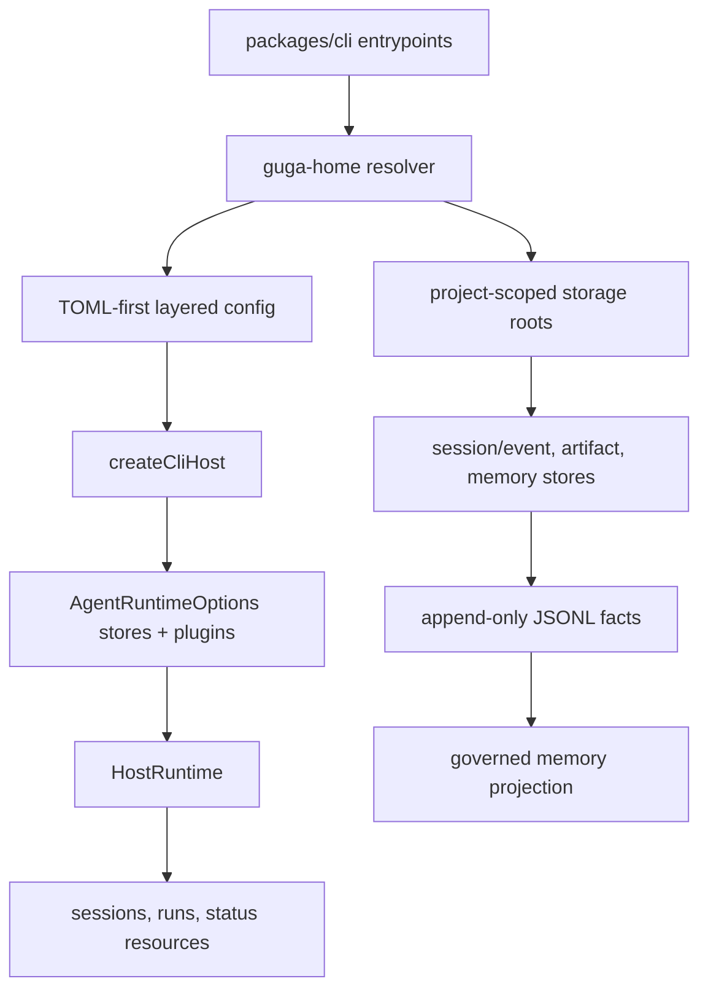
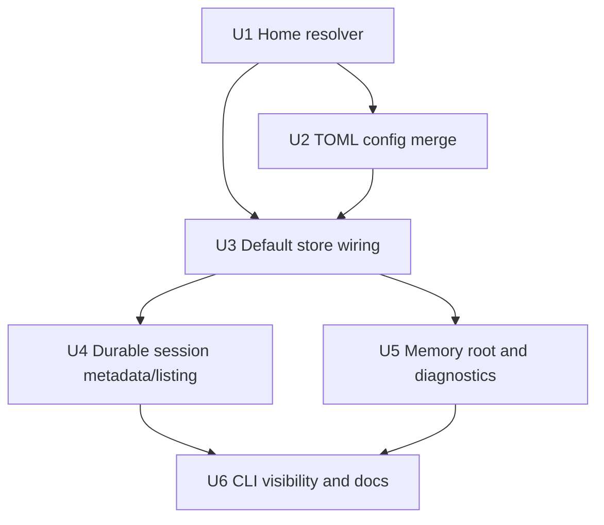

# feat: Add Guga Home config and durable history defaults

## Summary

本计划把现有 CLI 配置、durable session/event store、artifact store 和 governed memory JSONL store 产品化地收敛到默认 `~/.guga` 本地工作区。实现上保持持久化逻辑不进入 `packages/core`，在 `packages/cli` 增加 TOML-first layered config，通过 CLI host 边界注入默认本地 stores，并补强 host session metadata/listing，使历史会话可恢复、可列出，同时不把 transcript 当作长期记忆。

---

## Problem Frame

Guga 已经有 M5 的 durable substrate，也有 M15-M36 的 memory governance substrate，但 `packages/cli` 仍像是在使用可选 demo 能力：配置、会话历史、artifact、memory 各自存在，却没有默认用户 home 把它们组织成产品体验。用户需要一个可预测的本地状态目录；开发者则需要实现继续遵守 core / plugin / host 的分层边界。

---

## Assumptions

本计划基于 upstream brainstorm 编写，没有再进行一次单独的 plan-time synthesis 确认。以下是规划阶段的推断，实施前应重点复核。

- 本里程碑沿用现有 `events/` + `sessions/` JSONL 分层作为 Guga 的 session history 形态，不迁移为 Pi 风格的单文件 transcript tree。
- CLI 默认 stores 在 host factory 中直接创建并注入，因为 HostRuntime 在 first run 之前就需要创建和列出 session；first-party plugin package 仍保持可复用，不让 `packages/core` 理解 `~/.guga`。
- `JsonlMemoryStore` 作为默认本地 memory root，`createMemoryJsonlPlugin()` 作为 discoverability surface；但不做自动 memory extraction 或 prompt injection。
- TOML 迁移期间保留 legacy JSON config fallback，不做强制迁移，也不删除现有 JSON 支持。

---

## Requirements

- R1. 定义 Guga Home resolver：默认 `~/.guga`，允许 `GUGA_HOME` 覆盖，并支持稳定 project partition。
- R2. 支持 TOML-first 用户级和项目级配置：`~/.guga/config.toml` 与 `.guga/config.toml`。
- R3. 将 config loading 从 first-hit 改成 layered merge：defaults、user、project、explicit config、environment、CLI flags。
- R4. 保留 model aliases、default model/profile、provider id/mode/model id、API-key env、base URL 和 source diagnostics。
- R5. Project config 可以覆盖或新增 user config，不应删除无关 user model aliases。
- R6. 优先推荐 API key 环境变量，并在 diagnostics 中隐藏 secret。
- R7. `guga --list-models` 和 workbench `/models` 基于 merged config。
- R8. CLI 创建的 runtime 默认使用 Guga Home 下的 session/event storage。
- R9. CLI 创建的 runtime 默认使用 Guga Home 下的 filesystem artifact storage。
- R10. Session 和 artifact roots 按 project key 分区。
- R11. Project key 稳定、可读、路径安全。
- R12. 默认 session/artifact storage 不写入仓库目录，除非用户显式配置。
- R13. 历史会话保持 append-only event/session facts，不变成可变 message array。
- R14. Session records 保留 M5 已有的 lineage / active-leaf 语义。
- R15. Session metadata 可以轻量列出，不需要解析大型 event transcript。
- R16. Compaction、branch summary、model/profile changes、tool/error facts 继续作为 additive events 或 session facts。
- R17. CLI 创建的 runtime 暴露默认 governed memory JSONL root。
- R18. 长期 memory 保持 candidate/decision/review/health/retrieval/curated projection，与 transcript 分离。
- R19. 不从每个会话自动抽取 memory。
- R20. 不自动把 memory 注入 prompt。
- R21. CLI diagnostics 展示 resolved home、config source stack、selected model、session root、artifact root、memory root。
- R22. Invalid TOML、missing explicit config、unsafe project key、store read failures 都给出可操作诊断。
- R23. 文档说明 `.guga` 里的 session/artifact/memory 是敏感本地状态。
- R24. `packages/core` 不依赖 CLI 或 first-party storage plugin packages。
- R25. First-party stores/plugins 继续支持 host-provided roots，保持可测试、可替换。
- R26. 完整 named-profile lifecycle 后置。

**Origin actors:** A1 Guga CLI user, A2 CLI/workbench host, A3 runtime/plugin system, A4 plugin/host developer, A5 future planning/implementation agent

**Origin flows:** F1 user config resolution, F2 default durable session, F3 governed memory read/review, F4 Guga Home diagnostics

**Origin acceptance examples:** AE1 layered model aliases, AE2 default user-home session/artifact roots, AE3 branch lineage facts, AE4 lightweight session listing, AE5 `GUGA_HOME` override, AE6 transcript is not memory, AE7 config diagnostics, AE8 third-party host override

---

## Scope Boundaries

- 不做自动 memory extraction。
- 不做默认 memory prompt injection。
- 不做 SQLite、FTS、vector DB、graph DB、remote sync 或 multi-writer conflict resolution。
- 不做完整历史会话搜索；只补 metadata/list/resume 基础，供后续 search projection 使用。
- 不迁移已有 project `.guga` 数据，除了低风险 JSON config fallback。
- 默认 session/artifact state 不写入 project-local `.guga`。
- 不做完整 profile lifecycle，例如 create、clone、export、import、delete。
- 不让 `packages/core` import CLI、filesystem home resolver 或 concrete first-party store packages。

### Deferred to Follow-Up Work

- Pi 风格完整 tree picker 和可视化 session navigation：等 durable listing/resume roots 稳定后再做。
- Session search projection：后续基于现有 JSONL facts 增加 SQLite/FTS 或 semantic projection。
- JSON 到 TOML 的 config migration command：有价值，但不是 TOML-first loading 的 MVP 条件。
- `~/.guga/profiles/<name>` profile-isolated homes：本次最多保留 layout 概念，不实现 lifecycle。

---

## Context & Research

### Relevant Code and Patterns

- `packages/cli/src/config.ts` 当前读取 JSON config，使用 first-hit semantics，并已支持 provider/model aliases。
- `packages/cli/src/host-factory.ts` 集中处理 profile、provider 和 runtime construction，是注入 Guga Home 的自然边界。
- `packages/profile-code-agent/src/bundle.ts` 只组合 code profile plugins，不理解 persistence；默认 storage 应由 CLI host 追加，而不是嵌进 profile。
- `packages/core/src/contracts/persistence.ts` 已定义 `EventStore`、`SessionStore`、`ArtifactStore`、session branch/leaf lineage 和 replay types。
- `packages/plugin-session-jsonl/src/jsonl-event-store.ts` 与 `packages/plugin-session-jsonl/src/jsonl-session-store.ts` 已实现 append-only events、session facts、active leaf movement、fork lineage 和 corruption diagnostics。
- `packages/plugin-artifact-filesystem/src/filesystem-artifact-store.ts` 已负责 filesystem-backed artifact content / manifest persistence。
- `packages/plugin-memory-jsonl/src/jsonl-memory-store.ts` 已负责 governed memory JSONL records，以及 review/health/retrieval/curated projections。
- `packages/host-runtime/src/host-runtime.ts` 与 `packages/host-runtime/src/in-memory-run-store.ts` 当前保存 in-memory host session resources；durable session metadata 需要 bridge，而不是另一套 runtime loop。
- `packages/host-protocol/src/resources.ts` 已定义 session/run resources 和 optional branches，可承载 profile/model/storage metadata，而不改变 core execution semantics。
- `packages/cli/src/commands/run.ts` 与 `packages/cli/src/workbench/commands.ts` 已暴露 config source、`/models`、`/status`、`/new`、`/resume`、`/fork`。

### Institutional Learnings

- `docs/solutions/architecture-patterns/session-store-replay-substrate.md`: events 是 source of truth；artifacts 避免大 blob 进入 history；memory 是 prepared，不是 hidden side effect。
- `docs/solutions/architecture-patterns/memory-candidate-ledger.md`: governed memory candidates 不是 committed memory，且每个 candidate 需要 provenance。
- `docs/solutions/architecture-patterns/memory-jsonl-store.md`: memory JSONL append-only；corrupt middle records fail closed；core 保持不变。
- `docs/solutions/architecture-patterns/host-protocol-cli-workbench.md`: CLI 是 host client surface，不是第二套 runtime；durable replay 应绑定 M5 stores。

### External References

- `docs/research/source-analysis/claude-code-analysis/analysis/04i-session-storage-resume.md`: Claude Code 使用 append-only JSONL transcripts 和 robust resume pipeline。
- `docs/research/repomix/pi-focused-context.xml`: Pi 使用带 `id` / `parentId` 的 session JSONL tree，支持 branch/fork/clone、compaction summaries 和 `session_info`。
- `docs/research/source-analysis/learn-opencode/docs/internals/session.md`: OpenCode 将 session metadata、message parts、state 和 parent sessions 作为 host/server fact surface。
- `docs/research/source-analysis/learn-opencode/docs/internals/config.md`: OpenCode 使用 global/project/runtime surfaces 的 layered configuration。
- `docs/research/source-analysis/hermes-wiki/concepts/configuration-and-profiles.md`: Hermes 通过 home resolver 统一迁移 config、sessions、memory、skills、logs 和 profiles。

---

## Key Technical Decisions

| Decision | Rationale |
| --- | --- |
| 新增 `packages/cli/src/guga-home.ts` 作为 home/path resolver | 路径规则是 CLI/host 产品策略，不是 core runtime 行为。小模块能让 config、host factory、diagnostics 和 tests 保持一致。 |
| TOML 作为首选配置格式，同时保留 JSON fallback | TOML 更适合用户手写和注释；JSON fallback 避免同一里程碑破坏现有 `.guga/config.json` 用户。 |
| `models` 按 `id` merge | 满足 AE1：project config 可以覆盖共享 alias，而不删除其他 user aliases。 |
| Project partition 优先使用 git root，否则 cwd | 仓库内子目录保持同一 project key；非 git 目录也可用。使用 sanitized basename + short hash 兼顾可读性和路径安全。 |
| 保留 event source 与 session metadata projection 的分离 | Guga 当前已有 `events/` 与 `sessions/`；保持该分层避免存储迁移风险，同时因 session fact files 较小，仍满足 lightweight listing。 |
| CLI 默认 stores 采用 eager injection | HostRuntime 在 first run 前就会 create/list sessions，而 plugin-registered stores 是 runtime execution 时 lazy initialize；eager stores 避免 startup/listing gap。 |
| Memory operations 不自动写入 | 需求明确区分 transcript 与 memory；默认 memory root 只让 governed memory capabilities 可用、可诊断。 |
| Diagnostics 展示 paths 和 sources，不展示 secrets | API keys 可来自 env 或 config，但 status/config output 绝不能回显原始 key。 |

---

## Open Questions

### Resolved During Planning

- Config merge depth：scalars override，objects 按 section merge，`models` 按 `id` merge；除 `models` 外的 arrays 默认 replace，除非后续字段明确需要 keyed merge。
- Legacy JSON strategy：user/project config 优先读 TOML，再 fallback JSON；explicit `GUGA_CONFIG` 按 extension 或 parser detection 解析，missing/invalid 都 fail。
- Project key strategy：有 git root 用 git root，否则 cwd；用 sanitized basename + canonical absolute project root 的 short hash 生成 path-safe key。
- Session layout：保留 `sessions/projects/<project-key>/events/` 与 `sessions/projects/<project-key>/sessions/`；event logs 是 source of truth，session files/index 是 tree/metadata projection facts。
- Lightweight metadata strategy：在 session store surface 和 JSONL session facts 中增加 session metadata/listing，不解析 event transcripts。
- Guga Home visibility：优先扩展 startup/config source text、`/status` 和 `--ops` 风格输出，不先引入单独 `guga config doctor` 命令。
- Profile reservation：文档中保留 top-level `profiles/` 概念即可；MVP 不创建或管理 `profiles/default`。

### Deferred to Implementation

- 具体 TOML parser package：实施时选择小型维护良好的 parser，并把使用封装在 `packages/cli/src/config.ts`。
- JSON fallback warning 的具体呈现位置：根据当前 CLI 输出体验决定是仅 status/diagnostics 展示，还是 startup 也提示。
- `SessionStore` metadata/list methods 是 mandatory 还是 optional：实施时选择对现有 contract 扰动最小、同时能让 HostRuntime list durable sessions 的方案。

---

## Output Structure

```text
packages/
  cli/
    src/
      guga-home.ts
      guga-home.test.ts
      config.ts
      config.test.ts
      host-factory.ts
      host-factory.test.ts
      commands/run.ts
      run.test.ts
      workbench/commands.ts
      workbench/commands.test.ts
    README.md
  core/
    src/contracts/persistence.ts
    src/persistence/session-tree.ts
    src/persistence/session-tree.test.ts
  host-protocol/
    src/resources.ts
  host-runtime/
    src/host-runtime.ts
    src/host-runtime.test.ts
    src/in-memory-run-store.ts
  plugin-session-jsonl/
    src/jsonl-session-store.ts
    src/jsonl-session-store.test.ts
```

---

## High-Level Technical Design

> *此图只说明计划中的实现方向，供 review 理解架构关系；不是 implementation specification。实施 agent 应把它当作上下文，而不是要逐字复刻的代码。*



Active units 的依赖关系：



---

## Implementation Units

- U1. **Guga Home resolver and project partitions**

**Goal:** 提供一个经过测试的 CLI 模块，用于解析 `GUGA_HOME`、默认 home、project root/key 和标准 storage/config paths。

**Requirements:** R1, R10, R11, R12, R21, R22

**Dependencies:** None

**Files:**
- Create: `packages/cli/src/guga-home.ts`
- Create: `packages/cli/src/guga-home.test.ts`
- Modify: `packages/cli/src/config.ts`
- Modify: `packages/cli/src/host-factory.ts`

**Approach:**
- 如果设置了 `GUGA_HOME`，优先使用；否则使用 `homeDir/.guga`。
- `~` 和 relative path 只在 CLI path resolution 中，基于相关 config/home context 解析。
- 通过向上查找 `.git` 发现 project root；没有 git root 时 fallback 到 cwd。
- Project key 使用 sanitized basename + canonical project root 的 short hash。
- 暴露 config candidates、`sessions/projects/<project-key>`、`artifacts/projects/<project-key>`、`memory`、`cache`、`logs`、`profiles` 等派生 roots。
- 对 unsafe overrides 或 path traversal attempts 给出 diagnostics，不静默归一化成意外路径。

**Patterns to follow:**
- `packages/cli/src/config.ts` 中 env/cwd/homeDir 注入测试的模式。
- `packages/plugin-session-jsonl/src/jsonl-corruption.ts` 中 path-safe segment 的思路。
- `.trellis/spec/backend/directory-structure.md` 中 keeping user-home logic out of core 的边界。

**Test scenarios:**
- Happy path: 未设置 `GUGA_HOME`，cwd 在 git repo 内，home 解析到 `home/.guga`，project roots 使用稳定 project key。
- Happy path: `GUGA_HOME` 指向 absolute temp dir，所有派生 roots 都使用该目录。
- Edge case: cwd 不在 git repo 中时，仍能基于 cwd 生成稳定 project key。
- Edge case: 两个同 basename 但 absolute roots 不同的项目，生成不同 keys。
- Error path: malicious 或 malformed project path 不会在派生 paths 中产生 `..` segments。
- Error path: invalid home override 返回 actionable diagnostic，并指出 source，不暴露 secrets。

**Verification:**
- Home/path tests 覆盖 cwd/home/env 组合下的 deterministic root derivation。
- `packages/cli` 之外的 production code 不认识 `~/.guga`。

---

- U2. **TOML-first layered config loading**

**Goal:** 用 TOML-first layered config 替换 first-hit JSON config loading，同时保留 model selection 行为和 legacy JSON compatibility。

**Requirements:** R2, R3, R4, R5, R6, R7, R22

**Dependencies:** U1

**Files:**
- Modify: `packages/cli/package.json`
- Modify: `packages/cli/src/config.ts`
- Modify: `packages/cli/src/config.test.ts`
- Modify: `packages/cli/src/workbench/model-control.ts`
- Modify: `packages/cli/src/workbench/commands.ts`
- Modify: `packages/cli/src/workbench/commands.test.ts`
- Modify: `packages/cli/src/commands/run.ts`
- Modify: `packages/cli/src/run.test.ts`

**Approach:**
- 增加一个小型 TOML parser dependency，并通过 `parseConfigFile()` 包装，使 CLI 其他部分只接触 normalized `CliConfig`。
- Config candidates 按 layer order 定义：built-in defaults、user TOML/JSON、project TOML/JSON、explicit `GUGA_CONFIG`、environment overrides、command flags。
- 扩展 `CliConfigWithSources`，携带 source stack；同时保留现有 rendering 使用的 `filePath` / `fileSource` 兼容字段。
- Objects 按 section merge；`models` 按 `id` merge；高优先级 scalar 覆盖低优先级值。
- 为 storage/memory settings 扩展 config shape，但不要求每个字段在 MVP 都有行为。
- 保持 `apiKeyEnv` 推荐路径，并在 display-oriented diagnostics 中 redacted raw `apiKey`。
- 无 model 错误提示改为提及 `config.toml`，同时保留 legacy JSON fallback 的可发现性。

**Patterns to follow:**
- `packages/cli/src/config.ts` 中现有 `selectCliModel()` / `listCliModels()` 行为。
- 现有 config tests 对 env override 和 invalid config diagnostics 的覆盖。
- `docs/plans/2026-05-28-037-feat-productized-cli-workbench-plan.md` 中 CLI/workbench model control trace。

**Test scenarios:**
- Covers AE1. Happy path: user `config.toml` 定义 `sonnet` 和 `fast`；project `config.toml` 只覆盖 `sonnet`；`--list-models` 仍显示两个 aliases。
- Happy path: explicit `GUGA_CONFIG` 覆盖 user/project layers，并记录 source。
- Happy path: `GUGA_MODEL`、`GUGA_PROVIDER`、`GUGA_PROVIDER_MODE`、`GUGA_BASE_URL`、`GUGA_API_KEY` 覆盖 file config。
- Edge case: project config 新增 model alias，同时保留 user defaults。
- Edge case: TOML 中 invalid provider mode 按现有 JSON normalization 一致地忽略或诊断。
- Error path: invalid TOML 抛出 `CliConfigError`，包含 file path 和 parser summary。
- Error path: missing explicit `GUGA_CONFIG` 明确失败。
- Compatibility: 当 TOML 不存在时，project `.guga/config.json` 和 user `~/.guga/config.json` 仍可读取。
- Security: config/status/list output 不包含 raw API key。

**Verification:**
- CLI config tests 覆盖 merge order、model merge、source attribution、invalid TOML、JSON fallback 和 env overrides。
- 现有 `/models` 与 `--list-models` 行为继续使用同一 normalized model registry。

---

- U3. **Default local store wiring in the CLI host**

**Goal:** 让 CLI 创建的 hosts 默认使用 Guga Home 下的 session/event、artifact 和 governed memory roots，同时保留显式 host-provided stores 和 mock tests。

**Requirements:** R8, R9, R10, R12, R17, R21, R24, R25

**Dependencies:** U1, U2

**Files:**
- Modify: `packages/cli/package.json`
- Modify: `packages/cli/src/host-factory.ts`
- Modify: `packages/cli/src/host-factory.test.ts`
- Modify: `packages/cli/src/commands/run.ts`
- Modify: `packages/cli/src/run.test.ts`
- Modify: `packages/profile-code-agent/src/bundle.ts` *(仅当 plugin composition 需要 pass-through seam；如果 host factory 可干净追加 plugins，应避免修改)*
- Test: `packages/plugin-session-jsonl/src/runtime-integration.test.ts`
- Test: `packages/plugin-artifact-filesystem/src/runtime-integration.test.ts`

**Approach:**
- 扩展 `CliHostFactoryOptions`，支持测试注入 cwd/home/env roots，并预留 optional store override hooks 以保持 third-party host parity。
- 在 `createCliHost()` 中只解析一次 storage roots，并把 redaction-safe diagnostics 放入 `CliHost`。
- CLI default path 中创建 first-party session/event 和 artifact stores，并通过 `AgentRuntimeOptions.stores` 传入，使 HostRuntime 在 first run 前也可访问。
- 注册 memory JSONL operation descriptors，并暴露 rooted `JsonlMemoryStore` 供 diagnostics 和未来显式 memory commands 使用。
- Profile bundles 继续只关注 tools/permissions；不要把 user-home storage 烘进 `createCodeAgentRuntimeOptions()`。
- `--mock` 保持 deterministic，同时默认也覆盖 store roots，除非测试显式 opt out。

**Patterns to follow:**
- `packages/core/src/runtime/agent-runtime.ts` 中 direct store precedence over plugin-registered stores。
- `packages/plugin-session-jsonl/src/jsonl-session-plugin.ts` 和 store constructors 的 rootDir semantics。
- `packages/plugin-artifact-filesystem/src/filesystem-artifact-plugin.ts` 的 artifact root ownership。
- `packages/plugin-memory-jsonl/src/memory-jsonl-plugin.ts` 的 operation descriptor registration。

**Test scenarios:**
- Covers AE2. Happy path: `createCliHost({ mock: true })` + temp `homeDir` 创建 session/run 后，在 user-home project partition 下写出 session/event JSONL，而不是 project `.guga`。
- Covers AE5. Happy path: `GUGA_HOME` temp override 使 session/event、artifact、memory diagnostics 使用覆盖目录。
- Integration: CLI host capability listing 包含 first-party storage/operation capabilities，或 diagnostics 能识别 configured roots。
- Edge case: 测试中的 explicit store override 被保留，不被 default Guga Home stores 替换。
- Error path: storage root create/read failure 作为 structured host factory 或 operational diagnostic 暴露。
- Security: diagnostics 包含 paths，但不包含 API key。

**Verification:**
- Host factory tests 证明 default roots 和 store injection。
- Mock run 在预期 project partition 中产生 durable session/event facts。
- Core 仍没有 first-party plugin imports。

---

- U4. **Durable session metadata and lightweight listing**

**Goal:** 把 HostRuntime 的 in-memory session resources 与 durable session store 连接起来，使 session title/profile/model/project metadata 能跨进程恢复，并且不解析 event transcripts 也能列出。

**Requirements:** R13, R14, R15, R16, R21, R22

**Dependencies:** U3

**Files:**
- Modify: `packages/core/src/contracts/persistence.ts`
- Modify: `packages/core/src/persistence/session-tree.ts`
- Modify: `packages/core/src/persistence/session-tree.test.ts`
- Modify: `packages/plugin-session-jsonl/src/jsonl-session-store.ts`
- Modify: `packages/plugin-session-jsonl/src/jsonl-session-store.test.ts`
- Modify: `packages/host-protocol/src/resources.ts`
- Modify: `packages/host-runtime/src/host-runtime.ts`
- Modify: `packages/host-runtime/src/in-memory-run-store.ts`
- Modify: `packages/host-runtime/src/host-runtime.test.ts`
- Modify: `packages/host-sdk/src/client.test.ts`
- Modify: `packages/cli/src/workbench/session-control.ts`
- Modify: `packages/cli/src/workbench/commands.test.ts`

**Approach:**
- 以 optional methods 或小型 additive contract 的方式扩展 session store surface，加入 lightweight list/metadata capability，不改变 event-store source-of-truth。
- 增加 JSONL session facts 来记录 title、project key/path、profile id、selected model id、token/cost summary、fork/source summary 等 metadata updates。
- Session fact files 位于 `sessions/`，作为 cheap metadata/tree source；基础列表不解析 `events/`。
- HostRuntime create session 时，如果 session store 可用，就写入 durable session metadata；不可用时保持当前 in-memory 行为。
- List/resume 时，从 durable session summaries 加载 host projection，并通过 host protocol 返回稳定 `SessionResource` fields。
- 保留现有 branch/leaf/fork 行为，不重写历史 facts。

**Patterns to follow:**
- `packages/plugin-session-jsonl/src/jsonl-session-store.ts` 中 append-only `session.created`、`branch.forked`、`leaf.moved` facts。
- `packages/host-runtime/src/in-memory-run-store.ts` 的 host projection shape。
- `docs/solutions/architecture-patterns/host-ui-protocol-v1.md` 的 session/resource semantics。

**Test scenarios:**
- Covers AE3. Happy path: fork/branch metadata append lineage facts，original branch facts 不变。
- Covers AE4. Happy path: 使用同一 Guga Home root 进程重启后，`listSessions()` 返回 title、active branch、profile/model metadata、updated time，且不读取 event stream files。
- Happy path: `createSession({ title })` 将 title 写入 durable session facts。
- Edge case: metadata updates append-only，最后一个 valid metadata fact 生效。
- Edge case: corrupt 或 partial session fact tail 返回 recoverable diagnostics，不解析 event transcripts。
- Error path: durable session store unavailable 时，in-memory host sessions 仍可用，并对 resume/list durability 暴露 diagnostic。
- Integration: `/resume <sessionId>` 可定位 default store 中列出的 durable session。

**Verification:**
- Session store tests 证明 list/metadata behavior 独立于 event transcript size。
- HostRuntime tests 证明 durable session summaries 被投影到 host resources。
- 现有 M5 session tree/fork tests 仍通过。

---

- U5. **Governed memory root and explicit projection access**

**Goal:** 让默认 memory JSONL root 可见、可用于 governed memory projections，但不创建隐藏的 transcript-to-memory 行为。

**Requirements:** R17, R18, R19, R20, R21, R23

**Dependencies:** U1, U3

**Files:**
- Modify: `packages/cli/src/host-factory.ts`
- Modify: `packages/cli/src/host-factory.test.ts`
- Modify: `packages/cli/src/workbench/commands.ts`
- Modify: `packages/cli/src/workbench/commands.test.ts`
- Modify: `packages/cli/src/commands/run.ts`
- Modify: `packages/plugin-memory-jsonl/src/memory-jsonl-plugin.test.ts` *(仅当 descriptor metadata 变化时)*
- Test: `packages/plugin-memory-jsonl/src/jsonl-memory-store.test.ts`

**Approach:**
- 将 Guga Home 下的 `memory/` 解析为默认 `JsonlMemoryStore` root。
- 在 CLI-created runtimes 中注册 memory JSONL operation descriptor family，用于 discoverability。
- 增加 status/diagnostic wiring，报告 memory root 和 memory JSONL health/read diagnostics，但不读取 session transcripts。
- 写入必须显式：本单元不增加 run completion hook、transcript scanner 或 auto-candidate generation。
- Memory retrieval/review/curated Markdown 保持 governed store operation，不自动进入 model context。

**Patterns to follow:**
- `docs/solutions/architecture-patterns/memory-candidate-ledger.md` 的 candidate/provenance boundaries。
- `docs/solutions/architecture-patterns/memory-jsonl-store.md` 的 JSONL corruption 和 projection semantics。
- `packages/plugin-memory-jsonl/src/jsonl-memory-store.ts` 的 review/health/retrieval readers。

**Test scenarios:**
- Covers AE6. Happy path: 普通 CLI run 后，session/event files 存在，但 memory JSONL 没有自动新增 candidate，除非显式 memory action 写入。
- Happy path: status diagnostics 显示 memory root 和 operation descriptors。
- Edge case: empty memory JSONL root 返回 healthy empty review/projection diagnostics。
- Error path: `memory.jsonl` partial tail 报告 recoverable；corrupt middle record fail closed。
- Security: memory diagnostics 不包含 raw transcript content，除非显式 memory projection 返回 governed items。

**Verification:**
- Host factory 和 workbench command tests 证明 default memory root visibility。
- Memory JSONL store tests 继续证明 governed projections 和 corruption behavior。

---

- U6. **CLI visibility, docs, and operational diagnostics**

**Goal:** 通过 CLI startup/status/model surfaces 让 Guga Home 行为可发现，并更新文档说明敏感本地状态的存放位置。

**Requirements:** R6, R7, R21, R22, R23, R26

**Dependencies:** U2, U3, U4, U5

**Files:**
- Modify: `packages/cli/src/commands/run.ts`
- Modify: `packages/cli/src/run.test.ts`
- Modify: `packages/cli/src/workbench/views.ts`
- Modify: `packages/cli/src/workbench/views.test.ts`
- Modify: `packages/cli/src/workbench/commands.ts`
- Modify: `packages/cli/src/workbench/commands.test.ts`
- Modify: `packages/cli/README.md`
- Modify: `docs/solutions/architecture-patterns/host-protocol-cli-workbench.md` *(仅当 durable default 使记录的 pattern 发生实质变化时)*

**Approach:**
- 扩展 startup/config-source text，展示 source stack，而不是只显示单个 file path。
- 扩展 `/status` 或 operational status output，展示 resolved home、selected model、profile、session root、artifact root、memory root 和 storage diagnostics。
- `--list-models` 保持专注模型列表，但内部使用 TOML-layered config。
- 文档补充默认目录结构、配置优先级、TOML 示例、API-key env 推荐、JSON fallback、session/memory 区别和 privacy/commit risk。
- Named profiles 只作为 reserved/future 概念记录，不描述为已实现行为。

**Patterns to follow:**
- `packages/cli/src/commands/run.ts` 中当前 `describeConfigSource()` 和 `printOperationalStatus()`。
- `packages/cli/src/workbench/views.ts` 中 workbench startup/status rendering。
- 现有 CLI README 风格。

**Test scenarios:**
- Covers AE7. Error path: invalid project TOML 打印 config path 和 actionable parse summary，不暴露 secrets。
- Happy path: startup/status 显示 `GUGA_HOME`、config source stack、selected model、session root、artifact root、memory root。
- Happy path: `/models` 和 `--list-models` 使用 merged TOML config，并正确展示 default marker。
- Edge case: 没有 config file 但设置 env model 时，正确报告 env/default source。
- Security: configured raw `apiKey` 在所有 display-oriented paths 中被 redacted。
- Documentation: README 包含 TOML sample、JSON fallback note、directory tree、session-vs-memory explanation。

**Verification:**
- CLI/workbench tests 覆盖 display strings 和 redaction。
- README 足以让新用户一次配置模型，并安全找到本地状态。

---

## System-Wide Impact

- **Interaction graph:** CLI config 和 home resolution 输入 `createCliHost()`，后者配置 HostRuntime/AgentRuntime stores，并把 root diagnostics 暴露给 workbench commands。
- **Error propagation:** config parse errors 保持 `CliConfigError`；host factory 包装为 `CliHostFactoryError`；store read/corruption issues 应作为 operational/session diagnostics 暴露，而不是 raw thrown exceptions。
- **State lifecycle risks:** HostRuntime 当前有 in-memory session resources，AgentRuntime 有 durable event/session facts。U4 必须避免 title/active branch 分叉：durable session summaries 可用时，应作为 listing/resume 的来源。
- **API surface parity:** `HostClient`、HTTP host、in-memory host session resources 继续使用同一 DTO；避免 CLI-only session fields，使未来 desktop 能复用。
- **Integration coverage:** 单元测试不足以证明 default roots；至少需要一个 CLI host integration test 创建 session/run 并检查 Guga Home partition。
- **Unchanged invariants:** `packages/core` 保持 store-agnostic；replay 不重跑 providers/tools；memory candidates 保持 explicit governed records。

---

## Risks & Dependencies

| Risk | Mitigation |
| --- | --- |
| TOML parser dependency 引入 ESM/build friction | 将 parser 使用封装在 `parseConfigFile()`，并验证 CLI package build/typecheck。 |
| Config merge 改动破坏现有 JSON 用户 | 保留 JSON fallback tests 和 compatibility errors；文档解释 TOML-first transition。 |
| HostRuntime 与 durable session store 产生分叉 | 增加跨进程 restart 的 durable session metadata/list tests，并让 host projection 在可用时从 durable summaries 读取。 |
| Store plugins lazy initialize 太晚，影响 session listing | CLI defaults 使用 eager store injection，同时保留 plugin packages 给 third-party hosts。 |
| Repo move 后 project key 变化 | 使用 canonical path hash 保证唯一性，并在 metadata 存储 original project path 供用户检查。接受 moved repo 可能产生新 partition，后续再做 aliasing。 |
| 敏感 `.guga` state 泄漏到仓库或日志 | 默认 storage 只在 user-home；docs 和 diagnostics 明确敏感性；展示 paths，但 redacts secrets/content。 |
| Memory scope creep 成自动 extraction | Tests 断言普通 runs 不写 memory records；docs 保持 memory 为 explicit governed projection。 |

---

## Documentation / Operational Notes

- 更新 `packages/cli/README.md`，包含 `~/.guga` layout、TOML config examples、config precedence、API-key env recommendations 和 JSON fallback。
- 明确 Guga Home 下的 `sessions/`、`artifacts/`、`memory/` 可能包含敏感本地状态，不应随意 commit 或同步。
- 说明 compaction/branch summaries 属于 session history，不是 long-term memory。
- 说明 `GUGA_HOME` 会迁移整个 local workspace；project `.guga/config.toml` 只是 config layer，除非后续显式配置 project-local storage。

---

## Sources & References

- **Origin document:** [docs/brainstorms/2026-05-28-guga-home-config-session-memory-requirements.md](../brainstorms/2026-05-28-guga-home-config-session-memory-requirements.md)
- Related plan: [docs/plans/2026-05-27-002-feat-session-store-replay-plugins-plan.md](2026-05-27-002-feat-session-store-replay-plugins-plan.md)
- Related plan: [docs/plans/2026-05-28-037-feat-productized-cli-workbench-plan.md](2026-05-28-037-feat-productized-cli-workbench-plan.md)
- Related code: `packages/cli/src/config.ts`
- Related code: `packages/cli/src/host-factory.ts`
- Related code: `packages/core/src/contracts/persistence.ts`
- Related code: `packages/plugin-session-jsonl/src/jsonl-session-store.ts`
- Related code: `packages/plugin-artifact-filesystem/src/filesystem-artifact-store.ts`
- Related code: `packages/plugin-memory-jsonl/src/jsonl-memory-store.ts`
- Related solution: `docs/solutions/architecture-patterns/session-store-replay-substrate.md`
- Related solution: `docs/solutions/architecture-patterns/memory-jsonl-store.md`
- Related solution: `docs/solutions/architecture-patterns/memory-candidate-ledger.md`
- Reference research: `docs/research/source-analysis/claude-code-analysis/analysis/04i-session-storage-resume.md`
- Reference research: `docs/research/repomix/pi-focused-context.xml`
- Reference research: `docs/research/source-analysis/learn-opencode/docs/internals/session.md`
- Reference research: `docs/research/source-analysis/learn-opencode/docs/internals/config.md`
