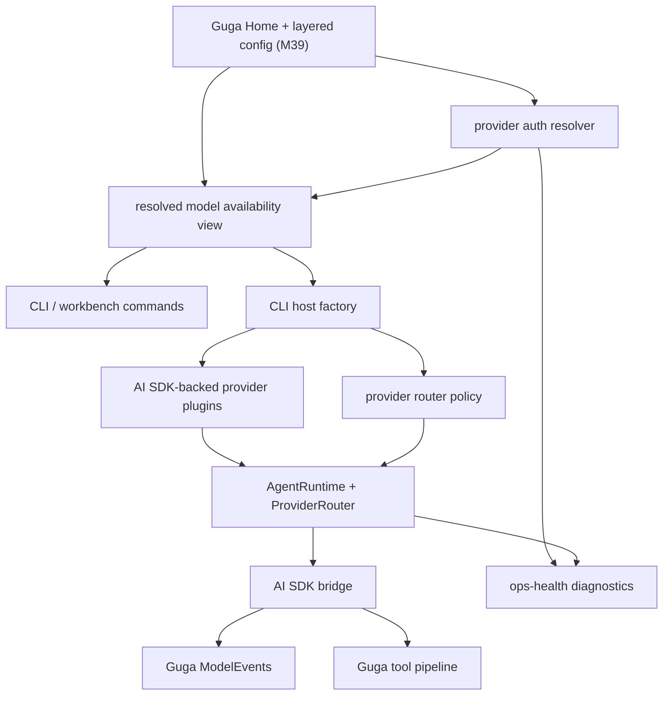
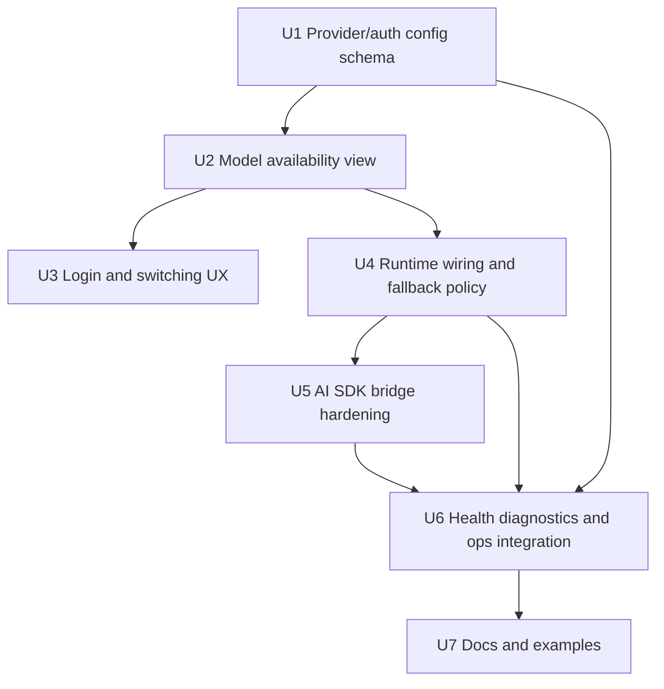

# feat: Add multi-provider login, switching, and AI SDK adaptation

## 摘要

本计划在 M39 的 Guga Home、TOML layered config 和默认本地 storage 基础上，补齐多 provider 的 auth/config、模型可用性、登录与切换、provider health/fallback，以及 AI SDK bridge 的多 provider 适配硬化。M40 不重做 `~/.guga` 基础设施，而是把 provider 登录、模型 registry 和 runtime routing 作为 Guga Home 配置体系上的下一层产品能力。

---

## 问题背景

Guga 已经拥有 core provider contract、model metadata、provider router、model events、CLI model aliases、AI SDK-backed provider bridge，以及 M39 规划并已落地的 Guga Home/TOML 配置基础。现在的问题不是“能不能调用一个模型”，而是用户无法把 Guga 当作一个可靠的多 provider agent 使用：凭证来源、provider 可用性、模型 alias、当前选择、辅助模型、fallback 行为和诊断信息还没有统一成一个可理解的本地工作流。

M40 的目标是采用 Pi 式用户链路和 OpenCode 式 provider 广度，但保留 Guga 自己的 runtime authority：credential policy 在 CLI/host 层，模型选择和 fallback 在 router/policy 层，tool intent 回到 Guga tool pipeline，AI SDK 只作为 bridge backend，不变成 core public contract。

---

## 与 M39 的关系

M39 已经提供本计划的前置基建：

- `packages/cli/src/guga-home.ts` 解析 `GUGA_HOME`、默认 `~/.guga`、project key 和 config/storage roots。
- `packages/cli/src/config.ts` 已支持 TOML-first user/project/explicit/env layered config，以及按 id merge model aliases。
- `packages/cli/src/host-factory.ts` 已把 CLI host 默认接到 Guga Home 下的 session/event/artifact/memory roots。
- `/models`、`--list-models` 和 `/status` 已经有 basic config/storage visibility。

M40 只扩展这些 surface：

- 在现有 config schema 上增加 provider/auth/fallback/model availability 信息。
- 让 `/login`、`guga login`、`/models`、`/model` 使用同一 resolved provider/model 视图。
- 让 host factory 从 resolved model selection 生成 provider plugins、registered models 和 router policy。
- 复用 M39 的 redacted diagnostics 风格，不引入第二套 home/config/session 机制。

### 与 M37 workbench 输入面的关系

M40 的 provider 登录和模型切换会直接暴露在 workbench `/login`、`/models`、`/model` 上，因此不能把当前 line REPL 当成最终交互载体。当前 `guga` 仍显示裸 `>` prompt 和 `home/project` diagnostic 的状态，只能作为临时 fallback。M40 可以先实现 top-level `guga login` / `--list-models` 的命令能力，但 workbench 侧验收必须等待或同步落成 M37 的持久 bottom prompt editor、slash command popover、model/provider selector 和 focus stack。

---

## 需求

- R1. 支持多个命名 provider，每个 provider 可声明类型、mode、base URL、auth 来源、默认模型和诊断 metadata。
- R2. Provider auth 至少支持 env API key 和 Guga-managed local credential 来源；若允许明文 config secret，必须明确提示风险。
- R3. Auth 状态必须展示为 configured、missing、invalid 或 unknown，且不能输出 secret 原文。
- R4. 登录 / 配置流程必须 provider-aware，不把所有 provider 强迫成同一个裸 key prompt。
- R5. Provider/auth 配置必须组合到 M39 的 Guga Home layered config，而不是另起一次性机制。
- R6. Guga 必须维护一个 model availability view，将 built-in models、用户/项目 config、extension-registered models 和 auth/health 状态合并。
- R7. 模型列表必须能说明模型不可用原因，例如 missing auth、invalid config、provider unhealthy 或 unsupported capability。
- R8. 模型 alias 必须映射到 provider id、provider mode、model id 和 purpose，并支持 primary 与 auxiliary。
- R9. 模型选择优先级必须确定：CLI flag/session switch > env > project config > user config > built-in default。
- R10. 运行记录、status 和 debug events 必须能看到实际使用的 provider/model，不只看到 alias。
- R11. Workbench `/models`、`/model` 和 CLI `--list-models` 必须基于同一 resolved model view。
- R12. AI SDK bridge 必须保持实现细节，不把 AI SDK/OpenAI/Anthropic SDK 类型暴露到 core public contract。
- R13. 默认 bridge 支持 OpenAI、Anthropic、OpenAI-compatible 和 AI Gateway mode。
- R14. AI SDK-backed provider 必须归一化 text、tool calls、finish reason、usage、raw metadata 和 error taxonomy。
- R15. AI SDK tool calls 必须回到 Guga tool intent，不在 bridge 内执行工具。
- R16. Bridge 接收 host/auth 层解析后的 credential/config，不拥有 credential storage policy。
- R17. Provider-specific quirks 必须隔离在 bridge 或 provider factory，不污染 agent loop。
- R18. Raw provider metadata 必须 redacted 或限定为安全 reference，不把 secret/请求 payload 泄漏到普通诊断。
- R19. Bridge 必须有 hermetic tests，不需要真实 provider credentials 或真实网络。
- R20. Health diagnostics 不应默认发起真实网络请求；真实检查必须显式注入或显式命令触发。
- R21. Health/error 分类必须区分 auth/config、rate-limit、payment、context overflow、retryable transport 和 fatal failure。
- R22. Fallback/retry 由 Guga router 或 runtime policy 拥有，不隐藏在 AI SDK bridge。
- R23. selection、retry、fallback、failure 必须可观察。
- R24. 第一版 fallback policy 保持最小显式：primary-to-backup 和 auxiliary routing，不做 credential pool。
- R25. Extension 可以注册额外 provider/model/auth metadata，并进入同一个 availability/selection flow。
- R26. 预留 OAuth、credential pool、外部 app config projection 和 provider marketplace 空间，但不作为 MVP。

**Origin actors:** A1 Guga CLI/workbench user, A2 CLI/workbench host, A3 Guga runtime/router, A4 provider bridge maintainer, A5 plugin/extension author

**Origin flows:** F1 provider 登录与配置, F2 模型发现与切换, F3 AI SDK bridge 执行模型调用, F4 provider health/fallback

**Origin acceptance examples:** AE1 provider auth redaction, AE2 model alias + availability, AE3 AI SDK normalization, AE4 tool intent 回到 Guga pipeline, AE5 health/fallback 可观察, AE6 no real credentials in tests, AE7 extension-registered provider/model 进入同一视图

---

## 范围边界

- 不实现 OAuth 登录。
- 不实现完整 credential pool、lease、cooldown、quota governance 或 enterprise key rotation。
- 不实现 CC Switch 式跨应用 provider config projection。
- 不实现 provider marketplace、动态安装或远程信任模型。
- 不构建 pricing/cost dashboard；usage 缺少 pricing metadata 时继续显示 cost unknown。
- 不把 AI SDK 或 vendor SDK 类型放进 `packages/core/src/contracts` 或 root public API。
- 不重做 M39 的 Guga Home、TOML merge、session/artifact/memory default storage。
- 不把 provider health 变成默认网络探测；真实健康检查必须显式 opt in。
- 不要求同一 running session 动态热刷新所有 extension/provider；MVP 可以要求新 session 或 host rebuild。

### 留待后续工作

- OAuth provider flows。
- Credential pools、cooldown recovery 和 multi-key routing。
- Provider pricing policy 与成本预算。
- CC Switch 式外部 app projection。
- 完整 extension marketplace/provider marketplace。
- Running session 内 provider/model hot reload。

---

## 上下文与调研

### 相关代码与模式

- `packages/cli/src/guga-home.ts` 已解析 Guga Home、project root/key、user/project config paths 和 storage roots。
- `packages/cli/src/config.ts` 已支持 TOML-first layered config、model alias by id merge、env override、source stack 和 `selectCliModel()`。
- `packages/cli/src/host-factory.ts` 是把 config/model selection 转为 runtime provider/model/router wiring 的自然边界。
- `packages/cli/src/workbench/model-control.ts` 与 `packages/cli/src/workbench/commands.ts` 当前支持 `/models` 和 `/model`，但还没有 auth-aware availability。
- `packages/core/src/contracts/provider.ts` 已有 provider/model/usage/error/tool-call response 的 SDK-neutral contract。
- `packages/core/src/contracts/model-events.ts` 与 `packages/core/src/router/provider-router.ts` 已支持 selected、retry、fallback、usage、metadata、provider_error 等事件。
- `packages/core/src/registry/capability-registry.ts` 已支持 provider/model registration 和 capability descriptors。
- `packages/core/src/builtins/provider-ai-sdk.ts` 当前包含 AI SDK bridge 实现；`packages/provider-ai-sdk/src/index.ts` 主要 re-export `@guga-agent/core/builtins`，这是 M38 built-in 迁移后的 compatibility 形态。
- `packages/provider-ai-sdk/src/ai-sdk-provider.test.ts` 和 `packages/provider-ai-sdk/src/ai-sdk-mapper.test.ts` 已有 hermetic generateText/modelFactory fixtures。
- `packages/plugin-ops-health/src/config-resolver.ts` 已有 redacted credential view；`packages/plugin-ops-health/src/provider-health.ts` 已有 injectable health checks。
- `docs/plans/2026-05-28-039-feat-guga-home-config-session-memory-plan.md` 已定义本计划依赖的 Guga Home/config/session/memory 默认行为。

### 项目经验

- `docs/solutions/architecture-patterns/provider-ai-sdk-bridge.md`：AI SDK 是 adapter，不是 architecture；router、events、tool intent 和 errors 属于 Guga runtime。
- `docs/solutions/architecture-patterns/production-operations-runtime.md`：credential/config view 必须 redacted，ops 行为通过 plugin-first substrate 暴露，tests 保持 hermetic。
- `docs/plans/2026-05-26-003-feat-provider-ai-sdk-bridge-plan.md`：M2 已确立 core provider contract、router owns fallback、bridge disables tool execution。
- `docs/plans/2026-05-28-038-feat-extension-spec-built-in-capabilities-plan.md`：provider-ai-sdk 作为 built-in core capability 的 identity 只代表 adapter bridge，不代表 credentials、remote endpoints 或所有 provider policy。

### 参考项目证据

- `docs/research/context-packs/provider-abstraction.md`：跨项目 provider abstraction 研究，支持 credential/config/routing 与 transport adapter 分层。
- `docs/research/source-analysis/learn-opencode/docs/internals/provider.md`：OpenCode 通过 AI SDK provider registry、auth hooks 和 provider metadata 扩展 provider 覆盖。
- `docs/research/repomix/pi-focused-context.xml`：Pi 的 `/login`、auth storage、model registry、自定义 provider 和 model selector 是 M40 UX 的主要参考。
- `docs/research/source-analysis/claude-code-analysis/analysis/03d-llm-api-integration.md`：Claude Code 的 provider/model priority 与 provider-specific defaults 支持 Guga 定义确定性选择优先级。
- `docs/research/context-packs/provider-abstraction.md` 与 CC Switch 相关材料说明外部 app projection 有价值，但不应进入 M40 runtime MVP。

---

## 关键技术决策

| 决策 | 理由 |
|---|---|
| 在 M39 layered config 上扩展 provider/auth schema | 用户配置、项目覆盖、env override 和 source diagnostics 已有基础；另起机制会破坏 Guga Home 的单一心智模型。 |
| Auth resolver 位于 CLI/host 层，不位于 AI SDK bridge | Bridge 只消费解析后的 credential/config；credential storage、redaction 和 policy 属于 host/product surface。 |
| 建立 resolved model availability view，而不是只扩展 `selectCliModel()` | `selectCliModel()` 只回答“选哪个”，M40 还需要回答“为什么可用/不可用、来自哪里、能做什么、会 fallback 到哪里”。 |
| Workbench `/login` 与 CLI `guga login` 写入同一种 config/credential material | 交互入口可以不同，但最终状态必须能被 `readCliConfigWithSources()` 和 host factory 一致消费。 |
| Fallback policy 由 host factory 从 resolved config 生成，再交给 core router 执行 | Core router 已有 candidate/retry/fallback events；M40 不需要在 bridge 或 workbench 中另写 fallback。 |
| AI SDK bridge 保持 Guga contract-first | M38 把 provider-ai-sdk 放入 core built-ins，但 public contract 仍不能暴露 SDK 类型；M40 只补 bridge behavior 和 package boundary，不把 SDK 变成 architecture。 |
| Provider health 默认静态/注入式，不默认联网 | 保障普通 CLI 启动快、可测试、无 credential 泄漏；真实 health check 后续可通过显式命令或 ops plugin 注入。 |
| Extension/provider refresh 第一版要求 host rebuild 或新 session | running session hot reload 会牵涉 router policy、active model state、credentials 和 audit，MVP 先保持确定性。 |

---

## 待定问题

### 规划阶段已解决

- 是否重做 Guga Home/config：不重做，依赖 M39。
- 模型优先级：CLI flag/session switch > env > project config > user config > built-in default。
- Provider health 是否默认联网：不默认联网，只做 injected/explicit checks。
- Fallback MVP：primary candidates + auxiliary purpose candidates + maxRetries，不做 credential pool。
- AI SDK package 版本：当前 workspace 使用 `ai@6.0.191`、`@ai-sdk/openai@3.0.65`、`@ai-sdk/anthropic@3.0.79`、`@ai-sdk/openai-compatible@2.0.48`；M40 tests 以当前 pinned versions 为准。

### 留待实施阶段确认

- Guga-managed credential 的本地文件名与权限策略：建议落在 Guga Home 下并 fail closed，但实施时需根据已有 fs helpers 和平台权限处理确定。
- `packages/core/src/builtins/provider-ai-sdk.ts` 与 `packages/provider-ai-sdk/src/*` 的长期 ownership：M40 应至少补测试和文档说明，是否反向抽回 provider package 需避免打破 M38 built-in 约定。
- CLI `guga login` 的精确 prompt 文案与写入策略：计划只固定行为边界，不规定最终 UX copy。
- Auth invalid 的判定来源：无网络时只能判断 missing/malformed；真实 invalid 需要 explicit health/check 结果。
- Extension-registered auth metadata 的初版 contract 字段：M40 可先用 capability descriptor metadata，不必一次设计完整 extension auth API。

---

## 输出结构

```text
packages/
  cli/
    src/
      config.ts
      config.test.ts
      provider-auth.ts
      provider-auth.test.ts
      model-registry.ts
      model-registry.test.ts
      host-factory.ts
      host-factory.test.ts
      commands/run.ts
      run.test.ts
      workbench/model-control.ts
      workbench/commands.ts
      workbench/commands.test.ts
  core/
    src/
      contracts/provider.ts
      contracts/provider-router.ts
      contracts/model-events.ts
      router/provider-router.ts
      router/provider-router.test.ts
      registry/capability-registry.ts
      registry/capability-registry.test.ts
      builtins/provider-ai-sdk.ts
      builtins/ai-sdk-message-mapper.ts
      builtins/ai-sdk-tool-mapper.ts
      builtins/ai-sdk-usage-error-mapper.ts
      builtins/default-core-capabilities.ts
      builtins/default-core-capabilities.test.ts
  provider-ai-sdk/
    src/
      index.ts
      ai-sdk-provider.test.ts
      ai-sdk-mapper.test.ts
    README.md
  plugin-ops-health/
    src/
      config-resolver.ts
      provider-health.ts
      plugin-ops-health.test.ts
```

---

## 高层技术设计

> 该图是计划方向，不是实现规格。实施时应沿用现有模块命名和测试反馈微调。



实施依赖关系：



---

## 实施单元

- U1. **Provider auth/config schema on top of Guga Home**

**目标：** 扩展 CLI config schema，使多个 provider、auth 来源、provider mode、base URL、默认模型和 fallback/auxiliary 配置能通过 M39 layered config 解析。

**需求：** R1, R2, R3, R4, R5, R9, R16

**依赖：** M39

**文件：**
- 修改: `packages/cli/src/config.ts`
- 修改: `packages/cli/src/config.test.ts`
- 新建: `packages/cli/src/provider-auth.ts`
- 新建: `packages/cli/src/provider-auth.test.ts`
- 修改: `packages/plugin-ops-health/src/config-resolver.ts`
- 修改: `packages/plugin-ops-health/src/plugin-ops-health.test.ts`

**方案：**
- 在 `CliConfig` 上增加 provider collection，支持 named provider id、mode、baseURL、apiKeyEnv、static apiKey、credential reference、display label 和 provider-specific metadata。
- 保留当前 top-level `providerId`、`modelId`、`providerMode`、`apiKeyEnv`、`apiKey` 作为 compatibility shorthand，并 normalize 到 resolved provider 视图。
- 继续使用 M39 的 merge 顺序：user config < project config < explicit `GUGA_CONFIG` < env。
- Provider objects 按 id merge，model aliases 按 id merge；project config 覆盖同 id provider/model 的字段，但不删除 user-level 其它 provider/model。
- `provider-auth.ts` 负责把 env/static/local credential reference 解析成 redacted auth state 和 bridge-call material。
- 明文 static secret 允许但 diagnostics 标记 warning；普通 list/status 输出只展示 redacted form。
- Auth resolver 只做本地结构判断；没有 explicit health check 时不声称 key valid。

**遵循模式：**
- `packages/cli/src/config.ts` 中 TOML/JSON normalization、source stack 和 model merge。
- `packages/cli/src/guga-home.ts` 的 home/cwd/homeDir/env 注入测试模式。
- `packages/plugin-ops-health/src/config-resolver.ts` 的 redaction helpers。

**测试场景：**
- 正常路径：user config 定义 `openai` 和 `anthropic` providers，project config 覆盖 `openai.baseURL`，resolved config 保留两个 provider。
- 正常路径：legacy top-level `GUGA_PROVIDER`、`GUGA_MODEL`、`GUGA_API_KEY` 仍能生成一个可用 provider/model selection。
- 正常路径：`apiKeyEnv` 从 env 解析为 configured，输出 redacted，不包含原始 secret。
- 边界情况：static `apiKey` 可解析，但 diagnostics 包含明文风险 warning。
- 边界情况：provider id 重复时按 layer merge；同 layer 重复 id fail 或 last-write behavior 必须有测试固定。
- 错误路径：unknown provider mode 被标记为 invalid config，不静默变成 openai。
- 安全：`JSON.stringify()` resolved auth/model diagnostics 不包含 raw key。

**验证：**
- `pnpm --filter @guga-agent/cli test`
- `pnpm --filter @guga-agent/plugin-ops-health test`

---

- U2. **Unified model availability and selection view**

**目标：** 提供一个 CLI/host 层统一 model registry view，把 config aliases、registered/built-in models、auth state、health state、purpose 和 capability 合并成 `/models`、`--list-models`、host factory 都能复用的数据。

**需求：** R6, R7, R8, R9, R10, R11, R21, R25

**依赖：** U1

**文件：**
- 新建: `packages/cli/src/model-registry.ts`
- 新建: `packages/cli/src/model-registry.test.ts`
- 修改: `packages/cli/src/config.ts`
- 修改: `packages/cli/src/workbench/model-control.ts`
- 修改: `packages/cli/src/workbench/commands.ts`
- 修改: `packages/cli/src/workbench/commands.test.ts`
- 修改: `packages/cli/src/commands/run.ts`
- 修改: `packages/cli/src/run.test.ts`
- 可选修改: `packages/core/src/registry/capability-registry.ts`
- 可选测试: `packages/core/src/registry/capability-registry.test.ts`

**方案：**
- 新建 resolved view 类型，表达 alias id、display label、providerId、mode、modelId、purpose、capabilities、source、auth status、health status、availability 和 unavailable reasons。
- `listCliModels()` 和 `selectCliModel()` 逐步收敛到这个 view，保留旧函数作为 thin compatibility wrapper。
- `/models` 和 `--list-models` 显示所有 configured models，并用状态标记 missing auth / invalid config / unknown health / unavailable capability。
- `/model <alias>` 只允许选择 available 或 explicitly allowed unknown-health model；对 missing auth/invalid config 给出 actionable suggestions。
- `primary` 与 auxiliary purpose model 分开表示，允许 config 中声明 fallback candidates。
- Extension-registered models 第一版可以通过 registry/capability descriptors 输入到 view；如果运行时注册发生在 host build 之后，可要求 rebuild/new session。

**遵循模式：**
- `packages/cli/src/workbench/model-control.ts` 的 command-facing selection helper。
- `packages/core/src/contracts/provider.ts` 的 `ModelMetadata`、`ModelPurpose`、`ModelCapability`。
- `packages/core/src/registry/capability-registry.ts` 的 provider/model registration identity。

**测试场景：**
- 正常路径：两个 configured providers，三个 aliases，其中一个缺 key；model view 显示两个 available、一个 unavailable。
- 正常路径：project config 覆盖 alias modelId 后，`/models` 和 `--list-models` 展示同一个 resolved result。
- 正常路径：`/model sonnet` 选择 alias，并返回 providerId/modelId/mode，而不是只返回 alias。
- 边界情况：auth unknown 但 config complete 时允许列出并标记 unknown，不误报 healthy。
- 边界情况：unsupported tool-calling model 在需要 tool purpose 时标记 unavailable reason。
- 错误路径：unknown alias 给出候选 suggestions。
- 覆盖 AE7：extension-registered model metadata 可以进入同一 view，至少以 available unknown-health 或 missing-auth 状态展示。

**验证：**
- `pnpm --filter @guga-agent/cli test`
- Core registry tests 仅在需要扩展 descriptor query 时运行。

---

- U3. **Provider-aware login and switching UX**

**目标：** 增加 provider-aware 登录/配置入口，并让 workbench model switching 与 CLI one-shot run 使用同一 resolved model/auth view。

**需求：** R2, R3, R4, R5, R7, R9, R10, R11

**依赖：** U1, U2

**文件：**
- 修改: `packages/cli/src/commands/run.ts`
- 修改: `packages/cli/src/run.test.ts`
- 修改: `packages/cli/src/workbench/commands.ts`
- 修改: `packages/cli/src/workbench/commands.test.ts`
- 修改: `packages/cli/src/workbench/model-control.ts`
- 新建或修改: `packages/cli/README.md`

**方案：**
- 增加 `guga login <provider>` 或等价 subcommand，负责 provider-aware API key/env/static credential setup。
- 增加 workbench `/login <provider>`，输出 provider-specific guidance；可写入 Guga-managed credential 或提示 env var。
- Workbench `/login` 不能只依赖用户手写完整命令后按 Enter；真实 UI 路径应通过 `/` command popover 发现 login command，并在 provider 缺失时打开 provider selector 或补参数状态。
- 不在普通 command output 打印 raw key；写入前提示 static secret 风险。
- `/models` 展示 provider/auth/health 状态；`/model` 在 workbench 中应打开 selector 并展示 alias/provider/model id/auth state/source，选择后重建 host 或新 session，延续当前 workbench 已有 profile switch pattern。
- CLI one-shot `-p` 和 interactive session 使用同一个 model selector 解析逻辑。
- 登录完成后不自动验证真实网络；可以提示 `/status` 或后续 explicit health check。

**遵循模式：**
- `packages/cli/src/commands/run.ts` 现有 command dispatch。
- `packages/cli/src/workbench/commands.ts` slash command parser/result pattern。
- M39 `/status` storage diagnostics 的 redacted display style。

**测试场景：**
- 正常路径：`guga login openai` 在 temp `GUGA_HOME` 写入 credential reference 或 config material，随后 `--list-models` 看到 openai models configured。
- 正常路径：`/login anthropic` 返回 provider-aware guidance，且不包含 raw key。
- 正常路径：在真实 workbench editor 中输入 `/log` 时 command popover 可以发现 `/login`，选择后进入 provider selector 或补参数状态。
- 正常路径：`/model fast` 选择 available alias 后 workbench host rebuild 使用对应 provider/model。
- 正常路径：`/model` 无参数时不直接报错结束；workbench UI 打开 model selector，line fallback 才返回 actionable usage/suggestions。
- 边界情况：用户登录 unknown provider，提示 supported/configured providers。
- 错误路径：缺少 stdin/非 TTY 时 login 返回 actionable diagnostic，而不是 hang。
- 安全：login/test writers 和 command result snapshots 不包含 raw key。

**验证：**
- `pnpm --filter @guga-agent/cli test`

---

- U4. **Runtime wiring and explicit fallback policy**

**目标：** 让 host factory 根据 resolved model view 注册多个 provider/model，并把 primary/fallback/auxiliary policy 交给 core `ProviderRouter`，使 model events 记录实际 provider/model、retry 和 fallback。

**需求：** R8, R9, R10, R22, R23, R24

**依赖：** U2

**文件：**
- 修改: `packages/cli/src/host-factory.ts`
- 修改: `packages/cli/src/host-factory.test.ts`
- 修改: `packages/core/src/contracts/provider-router.ts`
- 修改: `packages/core/src/router/provider-router.ts`
- 修改: `packages/core/src/router/provider-router.test.ts`
- 修改: `packages/core/src/contracts/model-events.ts`
- 可选修改: `packages/host-runtime/src/host-runtime.ts`
- 可选测试: `packages/host-runtime/src/host-runtime.test.ts`

**方案：**
- `createCliHost()` 从 selected primary alias 和 configured fallback candidates 生成 `ProviderRouterPolicy`。
- 对每个 distinct provider id 注册一个 provider adapter；对每个 available model 注册 model metadata。
- 保持 bridge `maxRetries: 0`，router policy 才拥有 retry/fallback。
- 将 auxiliary purpose candidates 放进 `purposes` policy，而不是隐藏在 bridge config。
- 如果 fallback candidate 缺 auth 或 invalid config，host factory fail closed 或将其从 candidates 中剔除并产生 warning diagnostics；不能在运行时才静默失败。
- 确保 run/start events 和 host projection 能看到实际 providerId/modelId。

**遵循模式：**
- `packages/core/src/router/provider-router.ts` 当前 candidates/retry/fallback event flow。
- `packages/core/src/router/provider-router.test.ts` 中 retry/fallback mock provider tests。
- `packages/cli/src/host-factory.ts` 当前 selected model -> `createAiSdkProviderPlugin()` wiring。

**测试场景：**
- 正常路径：primary 失败为 retryable，router 根据 policy retry 后成功，events 包含 retry scheduled。
- 正常路径：primary auth/payment/rate-limit failure 后 fallback 到 backup model，events 包含 fallback selected 和最终 model。
- 正常路径：auxiliary purpose 使用 summarizer candidate，不影响 primary default。
- 边界情况：fallback candidate 未配置 auth 时，不进入 router candidates，并在 diagnostics 中解释。
- 错误路径：全部 candidates unavailable 时 host factory 或 router 返回 structured failure。
- 安全：provider error metadata 不包含 raw credential/config material。

**验证：**
- `pnpm --filter @guga-agent/core test`
- `pnpm --filter @guga-agent/cli test`

---

- U5. **AI SDK bridge multi-provider hardening**

**目标：** 补强 AI SDK bridge 对 OpenAI、Anthropic、OpenAI-compatible 和 AI Gateway 的 mode/config/model/error/tool/usage normalization，并清理 `packages/core/builtins` 与 `packages/provider-ai-sdk` 的边界说明和测试覆盖。

**需求：** R12, R13, R14, R15, R16, R17, R18, R19, R22

**依赖：** U4

**文件：**
- 修改: `packages/core/src/builtins/provider-ai-sdk.ts`
- 修改: `packages/core/src/builtins/ai-sdk-message-mapper.ts`
- 修改: `packages/core/src/builtins/ai-sdk-tool-mapper.ts`
- 修改: `packages/core/src/builtins/ai-sdk-usage-error-mapper.ts`
- 修改: `packages/core/src/builtins/default-core-capabilities.ts`
- 修改: `packages/core/src/builtins/default-core-capabilities.test.ts`
- 修改: `packages/provider-ai-sdk/src/index.ts`
- 修改: `packages/provider-ai-sdk/src/ai-sdk-provider.test.ts`
- 修改: `packages/provider-ai-sdk/src/ai-sdk-mapper.test.ts`
- 修改: `packages/provider-ai-sdk/README.md`
- 修改: `packages/provider-ai-sdk/package.json`
- 可选修改: `packages/core/package.json`

**方案：**
- 固定四种 mode 的 factory behavior：gateway、openai、anthropic、openai-compatible。
- 每种 mode 使用 injected `generateText` 和 `modelFactory` fixtures 覆盖，不依赖真实 API key。
- 继续不传 AI SDK tool `execute`，只返回 Guga `ToolCall` intent。
- usage mapping 覆盖 input/output/total/cached/reasoning tokens，cost 缺失时明确 unknown。
- error mapping 覆盖 auth、rate-limit、payment、context-overflow、retryable transport、fatal，并保留 providerId/modelId/requestId/statusCode。
- raw provider metadata 通过 `ProviderRawReference` 返回，但 tests 证明不会包含 apiKey/header authorization。
- 明确 `packages/provider-ai-sdk` 是 compatibility/public import path；若实现仍在 core builtins，README 解释 M38 built-in 边界；若迁回 provider package，必须保持 core lazy import 和 no root SDK exposure。
- 加 dependency-boundary tests，确保 `packages/core` root public API 不暴露 AI SDK types，`@guga-agent/core/builtins` 是显式子入口。

**遵循模式：**
- `packages/core/src/builtins/provider-ai-sdk.ts` 当前 `createAiSdkProvider()` 和 lazy built-in provider pattern。
- `packages/provider-ai-sdk/src/ai-sdk-provider.test.ts` 的 injected `generateText` fixture。
- `docs/solutions/architecture-patterns/provider-ai-sdk-bridge.md` 的 adapter boundary。
- M38 中 `packages/core/src/builtins/dependency-boundary.test.ts` 的 dependency-surface 约束。

**测试场景：**
- 正常路径：四种 mode 都能通过 injected modelFactory 调用 generateText，生成 Guga final response。
- 正常路径：AI SDK tool call 返回 Guga `tool_calls`，没有 `execute` 进入 AI SDK tool spec。
- 正常路径：usage/cached/reasoning token 字段归一化。
- 正常路径：providerMetadata 返回 raw reference，但 secret-like headers/apiKey 被过滤或不进入普通 metadata。
- 错误路径：401/403 映射 auth，429 映射 rate-limit，402 映射 payment，context window 文案映射 context-overflow，5xx/408 映射 retryable。
- 边界情况：unknown finish reason 映射 unknown，不崩溃。
- 边界测试：core root barrel 不导出 AI SDK value/types；provider package import path 仍可用。

**验证：**
- `pnpm --filter @guga-agent/core test`
- `pnpm --filter @guga-agent/provider-ai-sdk test`
- `pnpm --filter @guga-agent/core typecheck`
- `pnpm --filter @guga-agent/provider-ai-sdk typecheck`

---

- U6. **Provider health and redacted diagnostics integration**

**目标：** 把 auth/config/model availability、provider health 和 runtime provider failures 投影到 CLI/workbench/status，同时保证默认不联网、不泄漏 secrets。

**需求：** R3, R7, R10, R18, R20, R21, R23

**依赖：** U1, U2, U4, U5

**文件：**
- 修改: `packages/plugin-ops-health/src/config-resolver.ts`
- 修改: `packages/plugin-ops-health/src/provider-health.ts`
- 修改: `packages/plugin-ops-health/src/plugin-ops-health.test.ts`
- 修改: `packages/cli/src/workbench/commands.ts`
- 修改: `packages/cli/src/workbench/commands.test.ts`
- 修改: `packages/cli/src/commands/run.ts`
- 修改: `packages/cli/src/run.test.ts`
- 修改: `packages/host-runtime/src/event-projector.ts`
- 修改: `packages/host-runtime/src/host-runtime.test.ts`

**方案：**
- `/status` 和 `--ops` 输出 provider config/auth summary、selected model、fallback candidates、health unknown/healthy/degraded/unavailable。
- 默认 health 使用 unknown + diagnostic，不发真实请求。
- Runtime provider failure events 投影为 operational diagnostics，保留 providerId/modelId/category/statusCode/requestId，过滤 secret。
- `checkProviderHealth()` 继续支持 injected check；未来真实网络 check 可挂到 explicit command。
- Model availability view 与 ops health 使用同一 auth/config classification，避免 `/models` 和 `/status` 说法不同。

**遵循模式：**
- `packages/plugin-ops-health/src/provider-health.ts` injectable check pattern。
- `packages/plugin-ops-health/src/config-resolver.ts` redacted output。
- `packages/cli/src/workbench/commands.ts` `/status` storage diagnostics formatting。
- `packages/host-runtime/src/event-projector.ts` model event projection。

**测试场景：**
- 正常路径：no check configured 时 health unknown，diagnostic 为 info，不联网。
- 正常路径：injected degraded/unavailable health check 进入 `/status` output。
- 正常路径：provider runtime error category 被投影到 ops diagnostics。
- 边界情况：auth missing 时 health 不覆盖 auth 状态，不把 missing key 说成 provider unavailable。
- 安全：status/ops/model output snapshots 不包含 raw API key、Authorization header 或 static secret。

**验证：**
- `pnpm --filter @guga-agent/plugin-ops-health test`
- `pnpm --filter @guga-agent/cli test`
- `pnpm --filter @guga-agent/host-runtime test`

---

- U7. **Documentation, examples, and migration notes**

**目标：** 给用户和后续实施 agent 留下清晰的多 provider 配置、登录、模型切换、fallback 和 AI SDK bridge 边界说明。

**需求：** R1-R26

**依赖：** U1-U6

**文件：**
- 修改: `packages/cli/README.md`
- 修改: `packages/provider-ai-sdk/README.md`
- 修改: `docs/solutions/architecture-patterns/provider-ai-sdk-bridge.md`
- 新建: `docs/solutions/architecture-patterns/multi-provider-login-switching.md`
- 可选修改: `docs/plans/2026-05-28-039-feat-guga-home-config-session-memory-plan.md` *(只在需要补充 cross-link 时修改，避免改变已完成计划语义)*

**方案：**
- CLI docs 展示 env-key、Guga-managed credential、OpenAI-compatible local endpoint、Gateway、Anthropic 示例。
- 写明 config layer 优先级和 model selection 优先级。
- 写明 `/login`、`/models`、`/model`、`/status` 各自用途。
- 写明 fallback policy 是 explicit candidates，不是 credential pool。
- Provider AI SDK README 写清 M38/M40 后的 package identity：adapter bridge、built-in compatibility、no SDK types in core contract、no tool execution in bridge。
- 新增 architecture pattern，记录 Pi UX + OpenCode provider breadth + Claude priority + CC Switch deferred projection 的 Guga 落点。

**测试场景：**
- 文档示例 config 能被 `readCliConfigWithSources()` fixture 解析。
- 文档提到的 env vars 与 implementation constants 一致。
- README 不建议把 secrets commit 到 project `.guga/config.toml`。

**验证：**
- 文档示例纳入 CLI config tests 或 snapshot fixture。
- 手动 grep 确认 docs 不包含真实 secret。

---

## 风险与缓解

| 风险 | 缓解 |
|---|---|
| M40 与 M39 config work 重叠 | 明确依赖 M39，M40 只扩展 provider/auth/model schema 和 resolved view。 |
| AI SDK implementation 在 core builtins 与 provider package 之间边界不清 | 保持 contract-first；用 README 和 dependency-boundary tests 固定 public import surface。 |
| 登录流程意外泄漏 secret | Redaction helpers、snapshot tests、`JSON.stringify()` negative assertions 和 static secret warning。 |
| Health check 让普通 CLI 启动变慢或需要网络 | 默认 unknown，不联网；真实 check 只通过 injected/explicit path。 |
| Fallback policy 过早演变成 credential pool | MVP 只支持 explicit candidates 和 maxRetries；credential pool 留后续计划。 |
| Extension-registered providers 的 refresh 语义复杂 | 第一版要求 host rebuild/new session；running hot reload 后置。 |
| Provider-specific quirks 污染 agent loop | Quirks 留在 bridge/provider factory；core router 只看 normalized `ProviderError` 与 `ProviderResponse`。 |

---

## 验证策略

优先运行以下 focused gates：

```bash
pnpm --filter @guga-agent/cli test
pnpm --filter @guga-agent/core test
pnpm --filter @guga-agent/provider-ai-sdk test
pnpm --filter @guga-agent/plugin-ops-health test
pnpm --filter @guga-agent/host-runtime test
```

完成所有实施单元后运行：

```bash
pnpm test
pnpm typecheck
```

所有 provider/auth/AI SDK tests 必须 hermetic：不依赖真实 API key、不触发真实网络、不要求本机存在外部 provider 服务。

---

## 成功标准

- 用户可以在 Guga Home/TOML config 中配置多个 provider 和 model aliases，并通过 env 或 Guga-managed credential 让模型可用。
- `--list-models`、`/models`、`/model` 和 host factory 使用同一个 resolved model availability view。
- `/login` 或 `guga login` 能 provider-aware 地引导配置 credential，且不输出 secret。
- 一次 run 的 events/status 可以解释实际 provider/model、retry/fallback 和 provider failure category。
- AI SDK bridge 在 OpenAI、Anthropic、OpenAI-compatible、Gateway mode 下表现为同一个 Guga provider contract。
- Tool calls 不在 bridge 内执行，仍回到 Guga tool registry、hook、permission pipeline。
- 默认 health diagnostics 不联网，真实 health check 可注入并 redacted。
- Core public contract 不暴露 AI SDK/vendor SDK 类型。

---

## 交付后复核清单

- [ ] Plan 所有文件路径均为 repo-relative。
- [ ] M39 相关能力没有被重复规划为新实现。
- [ ] CLI config docs 与 tests 的 schema 示例一致。
- [ ] Provider/model selection priority 有测试固定。
- [ ] Secret redaction 有 positive 与 negative assertions。
- [ ] AI SDK bridge tests 覆盖四种 mode 和关键 error taxonomy。
- [ ] Router fallback events 在 core tests 与 CLI/host integration tests 中可见。
- [ ] Workbench-facing `/login`、`/models`、`/model` 验收运行在真实 prompt editor / selector / slash popover 上；line REPL 只能作为 fallback，不得作为产品完成证据。
- [ ] README 明确 M40 不包含 OAuth、credential pool 和 external app projection。
