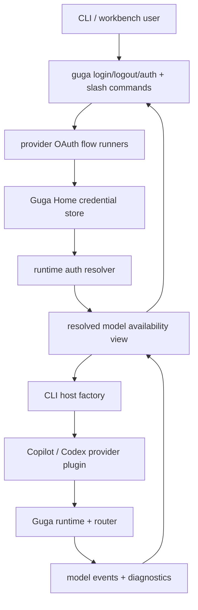
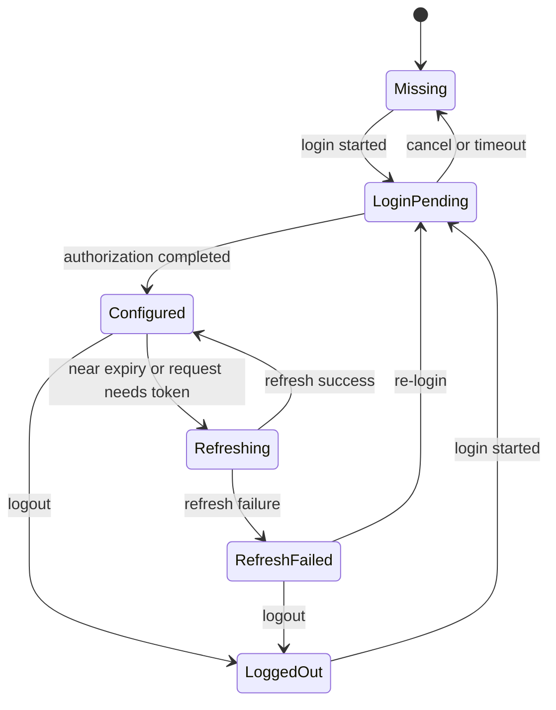
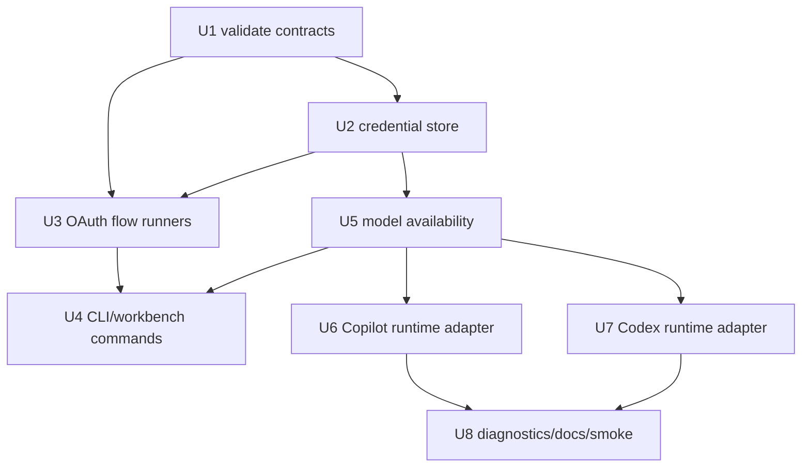
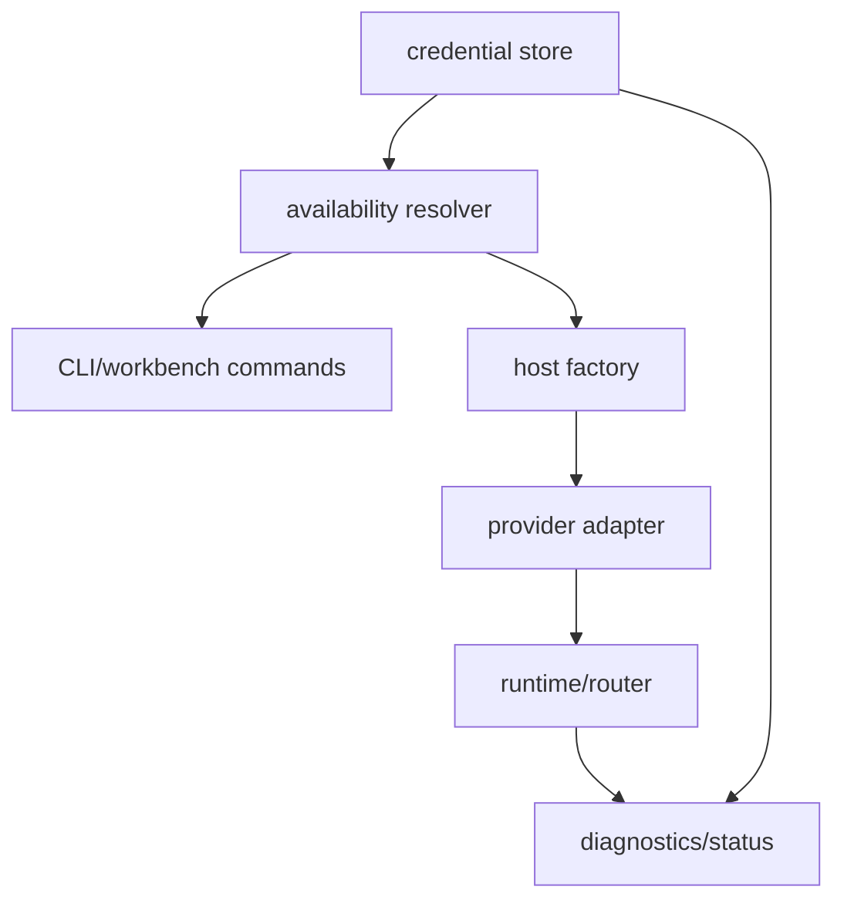

# feat: Add Pi-style Copilot and Codex OAuth login

## Summary

本计划在 M40 的 provider/auth/model availability 基础上，新增 Guga-owned OAuth session 层，让 GitHub Copilot 与 OpenAI/Codex 可以像 Pi 一样从 Guga 登录、存储、刷新、登出、进入模型可用性视图，并最终通过 Guga runtime 发起真实调用。

---

## Problem Frame

M40 会解决多 provider 配置、模型选择和 AI SDK bridge 的基础，但仍把 OAuth 登录留到后续。M41 要补齐已有 Copilot 或 Codex 账号用户最在意的闭环：不是把 token 存起来就结束，而是登录后模型立刻变得可理解、可选择、可运行。

本计划保留 Guga 的 runtime authority：OAuth session、redaction 和 login UX 属于 CLI/host 层；模型可用性属于 M40 resolved model view；tool execution、router events、fallback 和 provider error normalization 仍由 Guga runtime 拥有。

---

## Requirements

- R1. Guga 必须提供 provider-aware 登录入口，让用户可以选择 GitHub Copilot 或 OpenAI/Codex，而不需要手动编辑 config。
- R2. GitHub Copilot 必须支持适合 CLI 使用的 device-code OAuth flow，包括可见 URL/code、尝试打开浏览器、等待状态、取消、超时和成功/失败反馈。
- R3. OpenAI/Codex 必须支持适合 CLI 使用的浏览器 OAuth flow，包括可用时的 local callback，以及 callback 无法完成时的手动 code 或 redirect URL 粘贴 fallback。
- R4. 登录状态必须足够可见，让用户能区分 unconfigured、configured、expired/refresh-failed 和 logged-out，且不暴露 token 值。
- R5. Guga 必须拥有这些 provider 的 OAuth session state，而不是依赖 GitHub CLI、Copilot CLI、Codex CLI 或其他外部工具的登录状态。
- R6. OAuth credentials 必须存储在 Guga-owned local storage 中，并符合 Guga Home 模型；本地文件权限必须收紧，或使用等价的安全存储路径。
- R7. Credential storage 必须支持 token refresh 和并发 Guga 进程安全，避免多个 session 同时 refresh 时损坏或竞争 refresh state。
- R8. Logout 必须移除所选 provider 的 Guga stored credential，并立即更新 provider/model availability。
- R9. Diagnostics、status、logs 和 runtime metadata 绝不能打印 access token、refresh token、raw auth payload 或包含 secret 的 headers。
- R10. Copilot 和 Codex 模型必须进入与 M40 provider 相同的 resolved model availability view，而不是维护独立模型列表。
- R11. 登录前可以展示 Copilot/Codex 模型为 unavailable，但 UI 必须解释阻塞原因是 missing auth 或 failed auth。
- R12. 登录成功后，Copilot/Codex 模型必须能通过其他 provider 使用的同一套 CLI/workbench model selection surface 被选择。
- R13. 使用 Copilot/Codex 模型的 run 必须记录实际 provider/model identity，而不只是用户可见 alias。
- R14. 被选中的 Copilot 或 Codex 模型必须能通过 Guga 正常 runtime/provider contract 运行，包括 text output、tool intent handling、可用时的 usage/error normalization，以及可观察 provider events。
- R15. 运行中发生 credential refresh 或 auth failure 时，必须表现为 router 与 diagnostics 可观察的 auth/provider failure，而不是 opaque bridge crash。
- R16. Copilot 或 Codex 所需的 provider-specific details 必须隔离在 provider/auth/bridge 层，不得变成 Guga core public contract types。
- R17. GitHub Copilot OAuth 与 OpenAI/Codex 登录是本里程碑第一批优先路径。
- R18. Anthropic/Claude 在本里程碑继续以官方 API key / Workload Identity Federation 为主；consumer Claude OAuth 不是默认产品承诺。
- R19. DeepSeek 与 Kimi/Moonshot OAuth 不属于本里程碑；它们继续通过 API key 或 OpenAI-compatible provider 配置接入。

**Origin actors:** A1 Guga CLI / workbench 用户, A2 Guga CLI / workbench host, A3 Guga runtime/router, A4 Provider bridge 维护者, A5 规划 / 实施 agent

**Origin flows:** F1 GitHub Copilot 登录, F2 OpenAI / Codex 登录, F3 Auth-aware 模型发现与选择, F4 使用 OAuth-backed 模型运行, F5 登出与 stale credential 恢复

**Origin acceptance examples:** AE1 Copilot device authorization 后 configured 且不泄漏 token, AE2 Codex local callback 登录成功, AE3 Codex callback fallback, AE4 expired credential refresh/failure, AE5 `/models` auth-aware availability, AE6 runtime diagnostics 记录实际 provider/model 且不泄漏 internals, AE7 logout 后模型不可用

---

## Scope Boundaries

- 不实现 DeepSeek 或 Kimi/Moonshot OAuth。
- 不把 consumer Claude OAuth 作为本里程碑默认支持路径。
- 不实现 credential pools、account rotation、quota governance、cooldown recovery、team billing 或 enterprise key management。
- 不同步 GitHub CLI、Copilot CLI、Codex CLI、Claude Code 或其他外部工具 credential stores。
- 不在 `packages/core/src/contracts` 或 root public API 中暴露 OAuth token formats、provider SDK types 或 provider-specific auth payloads。
- 不构建 provider marketplace 或动态 third-party OAuth provider installation。
- 不默认做真实网络 health check；真实账号 smoke test 只能显式运行。

### Deferred to Follow-Up Work

- OS keychain 作为默认 credential backend：本计划第一版以 Guga Home 安全文件存储为可测 MVP，保留 keychain adapter 边界。
- Workbench 完整登录 UI parity：本计划会让 `/login`、`/logout`、`/models` 可用；更完整的交互式登录弹窗可在后续增强。
- Codex Cloud/task 账号能力：本计划只覆盖本地模型调用路径，不接入 Codex Cloud delegated tasks。
- Provider quota/rate-limit dashboard：本计划只把 auth/rate-limit/payment 分类成可观察错误，不做额度面板。

### Workbench UI dependency

OAuth/device-code 登录比 M40 static/env credential 更依赖交互面。当前 line REPL 只能承载 top-level `guga login` 和 slash fallback，不能算 Pi-style 登录体验完成。M41 的 workbench 侧验收必须依赖 M37 的真实 prompt editor、slash command popover、provider/model selector、confirm/notify overlay 和焦点恢复；如果这些还没落地，实施只能先交付 top-level CLI flow，并把 `/login` 标记为 fallback command surface。

---

## Context & Research

### Relevant Code and Patterns

- `packages/cli/src/guga-home.ts` 已提供 Guga Home、project key、cache/log/profile/session roots；M41 应在这里扩展 credential root，而不是另起 home 目录。
- `packages/cli/src/config.ts` 已提供 TOML-first layered config、model alias merge、env override 和 `selectCliModel()`；M41 应在 M40 的 resolved model availability 上扩展 auth source，而不是让 OAuth 写入裸 API key 字段。
- `packages/cli/src/commands/run.ts` 是 `guga init`、`guga run`、interactive 和 `--list-models` 的入口；`guga login/logout/auth` 应从这里进入，但实现逻辑应留在独立 auth 模块中。
- `packages/cli/src/workbench/commands.ts` 与 `packages/cli/src/workbench/model-control.ts` 已承载 `/models` 和 `/model`；M41 应复用同一个 availability view 显示 missing auth、configured、expired 等状态。
- `packages/cli/src/host-factory.ts` 是把 CLI config/model selection 转成 runtime provider plugin 的自然边界；M41 应在这里解析 OAuth credential 并把 redacted provider config 交给 provider plugin。
- `packages/core/src/provider-ai-sdk/index.ts` 已支持 `apiKey`、`baseURL`、`headers` 和 `providerOptions`，适合消费 host 层解析结果，但不应拥有 credential storage policy。
- `packages/core/src/provider-ai-sdk/usage-error-mapper.ts` 已有 auth/rate-limit/payment/context-overflow/retryable/fatal taxonomy；M41 应扩展 OAuth-backed provider failure 到同一 taxonomy。
- `packages/core/src/contracts/provider.ts`、`packages/core/src/contracts/model-events.ts`、`packages/core/src/router/provider-router.ts` 已定义 provider/model identity、events 和 failure surfaces；M41 不应让 provider SDK 类型越过这些 contract。

### Institutional Learnings

- `docs/solutions/architecture-patterns/provider-ai-sdk-bridge.md`：AI SDK 是 adapter，不是 architecture；routing、events、tool intent 和 errors 属于 Guga runtime。
- `docs/solutions/architecture-patterns/production-operations-runtime.md`：credential/config view 必须 redacted，ops 行为通过可观察能力暴露，tests 保持 hermetic。
- `docs/solutions/architecture-patterns/extension-spec-built-in-core-capabilities.md`：built-in provider bridge 可以存在真实 provider 依赖，但不得污染 core contracts、registry、hooks、permissions 或 execution pipeline。
- `.trellis/spec/backend/error-handling.md`：provider failures 必须结构化、可观察，不能作为 raw thrown exceptions 泄漏出 runtime。
- `.trellis/spec/backend/quality-guidelines.md`：行为单元需要测试；不要提交 `packages/*/dist/`；不要把真实 provider SDK 类型导入 core kernel 或 contracts。

### Reference Project Evidence

- `docs/research/repomix/pi-focused-context.xml`：Pi 的 host/harness 会在 provider request 前调用 `getApiKeyAndHeaders()`，将 auth 解析与 stream/provider adapter 分离，并用 `/login`、auth storage、model selector 形成产品闭环。
- `docs/research/context-packs/provider-abstraction.md`：Hermes、OpenCode、DeerFlow 都证明 provider transport、credential policy、routing policy 应分层；credential pool 很有价值，但不属于 Guga M41 MVP。
- `docs/research/source-analysis/hermes-agent-anatomy/docs/04-多Provider适配.md`：Codex OAuth token 与 API 端点能力存在差异，且独立 OAuth session 比共享外部 CLI session 更稳，因为 refresh token 生命周期可能互相踩踏。
- `docs/research/source-analysis/learn-opencode/docs/internals/provider.md`：OpenCode 将 provider metadata、auth 和 model catalog 作为 provider surface 的一部分，让 `/models` 与 provider availability 保持一致。

### External References

- GitHub Copilot SDK OAuth docs：GitHub 官方说明 Copilot SDK 可用 GitHub OAuth/App user token 调用 Copilot，用户使用自己的 Copilot subscription，应用负责 token storage、refresh 和 expiration handling。https://docs.github.com/en/copilot/how-tos/copilot-sdk/set-up-copilot-sdk/github-oauth
- GitHub OAuth device flow docs：GitHub OAuth 支持 device authorization grant，适合 CLI/headless apps，并要求尊重 polling interval、timeout 和 `slow_down` 等错误。https://docs.github.com/en/apps/oauth-apps/building-oauth-apps/authorizing-oauth-apps
- OpenAI Codex CLI docs：官方 Codex CLI 首次运行会提示用户用 ChatGPT account 或 API key 登录，ChatGPT Plus/Pro/Business/Edu/Enterprise 计划包含 Codex。https://developers.openai.com/codex/cli
- OpenAI Codex app-server README：官方 app-server 暴露 `account/read`、`account/login/start`、`account/login/cancel`、`account/logout`、`account/updated`，并支持 ChatGPT browser flow 与 device-code flow；这是 M41 Codex auth 状态面的主要形状参考。https://github.com/openai/codex/blob/main/codex-rs/app-server/README.md
- AI SDK docs：`createOpenAI` 和 `createOpenAICompatible` 支持 `apiKey`、`baseURL`、`headers` 等 provider settings，`generateText` 也支持 request headers 和 `providerOptions`；credential lifecycle 应在 Guga host 层解决。https://ai-sdk.dev/providers/openai-compatible-providers

---

## Key Technical Decisions

| Decision | Rationale |
|---|---|
| 新增 Guga-owned OAuth session layer，而不是读取外部 CLI 登录态 | 满足 R5，并避免 refresh token 或外部工具状态变化让 Guga 的 availability view 失真。 |
| Credential storage 第一版使用 Guga Home 安全文件 backend，并定义可替换 backend interface | 这能 hermetic 测试并满足 M39/M40 的本地 storage 心智模型；OS keychain 后续可替换，不阻塞 MVP。 |
| 登录 flow、storage、refresh、logout 位于 CLI/host 层 | Bridge 只消费已解析 credential/config；core public contract 不承载 OAuth token shape。 |
| Copilot 优先按官方 Copilot SDK OAuth 路径规划 | GitHub 官方文档明确用户 OAuth token 可用于 SDK，应用负责 token lifecycle；这比兼容非公开 endpoint 更稳。 |
| Codex 先实现 contract validation + adapter decision，再接 runtime | Codex/ChatGPT auth route 变化快；第一单元必须锁定当前可接受的官方契约，防止实现时写死过期行为。 |
| Auth state 并入 M40 resolved model availability view | 用户看到的是模型是否可选、为何不可选；独立 OAuth 状态页不足以满足 R10-R12。 |
| Refresh 采用 provider-scoped lock + atomic write | R7 的并发安全要求需要跨进程保护；不做 credential pool，但必须避免并发 refresh 损坏 session。 |
| Tests 默认 hermetic，真实网络 smoke 显式 opt-in | OAuth/provider 集成高风险且依赖用户账号；主测试套件不能要求真实 credentials 或网络。 |

---

## Open Questions

### Resolved During Planning

- GitHub Copilot 应优先走哪条路径：优先官方 Copilot SDK OAuth path；若实施发现 SDK 不能满足 Guga provider contract，再用薄 adapter 包装 SDK session，而不是直接把非公开 REST 兼容路由作为默认设计。
- Codex 登录是否应共享官方 Codex CLI credential：不共享。Guga 拥有自己的 session state；官方 Codex app-server 的 account/auth 状态面只作为契约参考或可选 adapter 输入。
- Credential storage 第一版是否必须 OS keychain：不必须。第一版以 Guga Home 安全文件 backend 落地，并定义 backend seam，后续可替换为 keychain。
- Auth failure 是否直接让 provider crash：不允许。必须映射为 auth-classified provider failure，并更新 model availability。

### Deferred to Implementation

- Copilot SDK 具体 npm package、版本与 license 约束：实施第一单元重新验证并固定，因为 SDK 仍是 technical preview。
- Codex 当前可接受的 browser/device auth endpoint 与本地调用 route：实施第一单元重新验证官方文档、release notes 或 SDK/app-server contract 后再落地。
- 首批 Copilot/Codex alias 的最终模型 id：按实施时官方可用模型与 M40 alias 结构确定，计划只固定 alias 需要 provider/model identity。
- 文件权限在 Windows 上的等价策略：实施时根据 Node fs 支持与平台行为做 fail-closed 或警告处理。

---

## Output Structure

```text
packages/
  cli/
    src/
      provider-auth.ts
      provider-auth.test.ts
      provider-credential-store.ts
      provider-credential-store.test.ts
      provider-oauth.ts
      provider-oauth.test.ts
      provider-model-availability.ts
      provider-model-availability.test.ts
      provider-runtime-auth.ts
      provider-runtime-auth.test.ts
      commands/
        run.ts
        run.test.ts
      workbench/
        commands.ts
        commands.test.ts
        model-control.ts
        model-control.test.ts
      guga-home.ts
      guga-home.test.ts
      host-factory.ts
      host-factory.test.ts
  core/
    src/
      provider-ai-sdk/
        index.ts
        provider.test.ts
        usage-error-mapper.ts
        mappers.test.ts
      router/
        provider-router.test.ts
docs/
  research/
    oauth-provider-contracts.md
  providers.md
  plans/
    2026-05-28-041-feat-pi-style-copilot-codex-oauth-login-plan.md
```

---

## High-Level Technical Design

> *This illustrates the intended approach and is directional guidance for review, not implementation specification. The implementing agent should treat it as context, not code to reproduce.*



Credential lifecycle state:



Implementation dependency graph:



---

## Implementation Units

- U1. **Validate provider auth contracts and dependency choices**

**Goal:** 在写核心 OAuth 逻辑前，确认 Copilot 与 Codex 当前可接受的官方契约、SDK/package 选择、模型调用 route、错误分类边界和测试替身形状。

**Requirements:** R2, R3, R14, R16, R17

**Dependencies:** M40 complete

**Files:**
- Create: `docs/research/oauth-provider-contracts.md`
- Modify: `packages/cli/package.json`
- Test: `packages/cli/src/provider-oauth.test.ts`
- Test: `packages/core/src/provider-ai-sdk/provider.test.ts`

**Approach:**
- Treat GitHub Copilot SDK OAuth documentation as the preferred path and record whether the implementation will depend directly on SDK client objects or wrap them behind a Guga provider adapter.
- Treat OpenAI/Codex official Codex CLI/app-server auth surface as the preferred contract reference, then decide whether Guga should implement a native flow, shell out to no external tool, or wrap a documented local app-server interface. The default posture remains Guga-owned credentials.
- Decide dependency placement conservatively: provider SDK dependencies should live in CLI/host/provider-adapter packages or optional built-ins, not in core contracts.
- Record exactly which behaviors are official, technical-preview, or compatibility-only, so future plan reviewers can see which risks are accepted.

**Execution note:** Start with a short research spike and hermetic contract fixtures before wiring product commands.

**Patterns to follow:**
- `docs/solutions/architecture-patterns/provider-ai-sdk-bridge.md`
- `packages/core/src/provider-ai-sdk/provider.test.ts`
- `scripts/ai-sdk-bridge-demo.test.ts`

**Test scenarios:**
- Happy path: a mocked Copilot SDK/client contract accepts a GitHub user token and produces a Guga `ProviderResponse` without exposing SDK types outside the adapter.
- Happy path: a mocked Codex auth contract returns account/auth state that can be reduced to configured/missing/expired without storing raw provider payload in public metadata.
- Error path: SDK/package absence or unsupported contract is represented as a planning/adapter error, not as a silent fallback to an undocumented endpoint.
- Integration: package dependency choice does not make `packages/core/src/contracts` import provider SDK types.

**Verification:**
- The implementation has a small research note with official/preview/compatibility distinctions and tests proving chosen adapter boundaries can be mocked.

---

- U2. **Add Guga Home credential storage and auth state model**

**Goal:** Provide the local credential substrate for OAuth sessions: provider-scoped records, redacted status, atomic writes, provider-scoped locks, refresh metadata, logout removal, and safe diagnostics.

**Requirements:** R4, R5, R6, R7, R8, R9, R16

**Dependencies:** U1

**Files:**
- Modify: `packages/cli/src/guga-home.ts`
- Modify: `packages/cli/src/guga-home.test.ts`
- Create: `packages/cli/src/provider-auth.ts`
- Create: `packages/cli/src/provider-auth.test.ts`
- Create: `packages/cli/src/provider-credential-store.ts`
- Create: `packages/cli/src/provider-credential-store.test.ts`

**Approach:**
- Extend Guga Home diagnostics with a credentials root such as `credentialsRoot`, using provider-scoped files under Guga Home and preserving project partitioning only where needed for status display.
- Define SDK-neutral auth state values: missing, login-pending, configured, expired, refresh-failed, logged-out, and unknown. These states should be display-safe and usable by model availability.
- Store raw credential material only inside the credential store module. Public return values should expose redacted status, provider id, account hints when safe, expiry timestamps, and failure categories.
- Use atomic write and provider-scoped lock semantics for refresh/update/logout. The first implementation can use file locking or lockfile-style coordination, but must not allow two processes to corrupt refresh state.
- Fail closed on parse errors or weak permissions: mark auth invalid/refresh-failed and instruct re-login rather than trying to continue with ambiguous secrets.

**Execution note:** Implement storage test-first because auth state corruption is high blast radius.

**Patterns to follow:**
- `packages/cli/src/guga-home.ts`
- `packages/cli/src/config.ts`
- `docs/solutions/architecture-patterns/production-operations-runtime.md`

**Test scenarios:**
- Covers AE1 / AE2. Happy path: saving a Copilot or Codex credential produces configured redacted status and no token value in diagnostics.
- Covers AE7. Happy path: logout removes only the selected provider credential and returns missing/logged-out state.
- Edge case: malformed credential file yields invalid or refresh-failed status without throwing raw JSON parse details into user-facing output.
- Edge case: missing credentials root is created with restricted permissions where the platform supports them.
- Error path: attempted write failure preserves the previous valid credential or fails without leaving a partially written file.
- Error path: concurrent refresh attempts for the same provider are serialized; one writer wins and the loser rereads state rather than overwriting stale refresh data.
- Integration: `resolveGugaHome()` diagnostics include credential storage location but never include secret material.

**Verification:**
- Credential storage is hermetically testable with temp homes, exposes only redacted auth views, and supports provider-scoped save/read/refresh-update/logout operations.

---

- U3. **Implement Copilot and Codex OAuth flow runners**

**Goal:** Add injectable OAuth flow runners for GitHub Copilot device-code login and OpenAI/Codex browser/device fallback login, including cancellation, timeout, polling interval handling, and normalized login errors.

**Requirements:** R1, R2, R3, R4, R5, R6, R7, R9, R17

**Dependencies:** U1, U2

**Files:**
- Create: `packages/cli/src/provider-oauth.ts`
- Create: `packages/cli/src/provider-oauth.test.ts`
- Modify: `packages/cli/src/provider-auth.ts`
- Modify: `packages/cli/src/provider-auth.test.ts`

**Approach:**
- Represent each login attempt as a provider-specific flow object with a common Guga result: login id, user-visible URL/code when applicable, status updates, cancel handle, final redacted credential state, and normalized errors.
- For GitHub Copilot, implement device-code behavior around GitHub OAuth semantics: show verification URL and user code, respect polling interval and slow-down responses, support expiry/cancel, then store the resulting GitHub user token in the Guga credential store.
- For OpenAI/Codex, implement browser OAuth as the primary UX when the validated contract supports local callback; provide manual paste/device-code fallback when local callback cannot be completed.
- Keep all provider-specific token payload parsing in this module or provider-specific helpers. Public auth state should only expose safe fields.
- Make network calls injectable so tests use fake transports and fake clocks.

**Execution note:** Use fake timers and fake transport fixtures before adding interactive CLI output.

**Patterns to follow:**
- `packages/cli/src/config.test.ts`
- `docs/research/repomix/pi-focused-context.xml`
- `docs/research/source-analysis/hermes-agent-anatomy/docs/04-多Provider适配.md`

**Test scenarios:**
- Covers AE1. Happy path: Copilot device flow returns URL/code, polls until authorization succeeds, writes credential, and reports configured.
- Covers AE2. Happy path: Codex browser flow receives callback, exchanges it through the validated contract, stores credential, and reports configured.
- Covers AE3. Happy path: Codex local callback failure falls back to manual pasted code or redirect URL and can still complete.
- Edge case: user cancels Copilot login before authorization; no credential file is written and state remains missing/logged-out.
- Edge case: provider returns slow-down or polling interval changes; runner adjusts polling without busy-looping.
- Error path: device code expires; runner returns actionable expired-login result and no partial credential.
- Error path: callback state mismatch or missing PKCE verifier fails closed and never stores credential.
- Error path: provider returns malformed token payload; raw payload is not included in error output or logs.

**Verification:**
- Both providers can complete, cancel, timeout, and fail through a common login result shape while keeping raw OAuth details private.

---

- U4. **Expose login, logout, auth status, and workbench commands**

**Goal:** Add the user-facing Pi-style entry points: `guga login`, `guga logout`, `guga auth status`, `/login`, `/logout`, and auth-aware command messages that integrate with existing CLI/workbench flows.

**Requirements:** R1, R2, R3, R4, R8, R9, R11, R12

**Dependencies:** U2, U3, U5

**Files:**
- Modify: `packages/cli/src/commands/run.ts`
- Modify: `packages/cli/src/commands/run.test.ts`
- Modify: `packages/cli/src/workbench/commands.ts`
- Modify: `packages/cli/src/workbench/commands.test.ts`
- Modify: `packages/cli/src/workbench/model-control.ts`
- Create: `packages/cli/src/workbench/model-control.test.ts`

**Approach:**
- Add top-level CLI commands without moving unrelated run/chat behavior: auth commands should parse provider selectors and delegate to provider auth modules.
- Add slash commands with the same state changes as CLI commands. Workbench command handlers should return display-safe messages and structured data for future richer UI.
- In the real workbench path, `/login` must be discoverable from the slash popover and provider choice must use selector/confirm overlays. The line-oriented `/login <provider>` path is acceptable only as a fallback until the M37 editor/overlay stack is complete.
- Attempt browser open as a convenience, but always print URL/code or manual fallback instructions so remote/headless terminals work.
- Keep `/models` and `/model` behavior consistent after login/logout by rebuilding or rereading the resolved availability view.
- Ensure non-TTY behavior is explicit: device-code URLs can print in non-TTY mode, but flows requiring interactive paste should fail with a clear message unless explicitly provided.

**Patterns to follow:**
- `packages/cli/src/commands/run.ts`
- `packages/cli/src/workbench/commands.ts`
- `packages/cli/src/workbench/model-control.ts`

**Test scenarios:**
- Covers AE1. Happy path: `guga login copilot` prints verification URL/code from a fake flow and exits success after configured state.
- Covers AE2 / AE3. Happy path: `guga login codex` handles callback success and manual fallback success through the same command surface.
- Happy path: in the workbench UI, `/login` is selectable from the slash popover, provider choice opens a selector, and cancel/complete returns focus to the prompt editor without losing draft text.
- Covers AE7. Happy path: `guga logout codex` removes stored Codex credential and subsequent status shows missing/logged-out.
- Edge case: unknown provider selector returns suggestions for `copilot` and `codex`.
- Edge case: non-TTY Codex browser flow without fallback input fails clearly rather than hanging.
- Error path: flow cancellation returns a non-success status without writing credentials.
- Error path: auth command output and structured data do not contain token-like strings from fake credentials.
- Integration: `/login`, `/logout`, `/models`, and `/model` observe the same underlying auth state as top-level CLI commands.

**Verification:**
- Users can log in/out and inspect status from both top-level CLI and workbench slash commands, with no raw secret output.

---

- U5. **Merge OAuth state into model availability and selection**

**Goal:** Make Copilot/Codex models appear in the same M40 resolved model availability view as other providers, with unavailable reasons before login and selectable models after login.

**Requirements:** R10, R11, R12, R13, R16, R17

**Dependencies:** U2

**Files:**
- Create: `packages/cli/src/provider-model-availability.ts`
- Create: `packages/cli/src/provider-model-availability.test.ts`
- Modify: `packages/cli/src/config.ts`
- Modify: `packages/cli/src/config.test.ts`
- Modify: `packages/cli/src/workbench/model-control.ts`
- Create or Modify: `packages/cli/src/workbench/model-control.test.ts`
- Modify: `packages/cli/src/host-factory.ts`
- Modify: `packages/cli/src/host-factory.test.ts`

**Approach:**
- Extend the M40 model view with auth-aware availability inputs: provider id, provider mode, model id, auth source, auth status, unavailable reason, and safe account hints.
- Add built-in Copilot/Codex model aliases as metadata entries, not as separate command-specific lists. Alias defaults should be conservative and easy to adjust as official model availability changes.
- Keep selection priority aligned with M40: explicit session/CLI selector wins, then env/project/user/built-in defaults. Auth state only decides whether the selected model is runnable.
- Make missing auth a selectable explanation, not a crash. Users should see what to log in to unlock a model.
- Ensure actual runtime uses provider/model identity, while UI can display friendly aliases.

**Patterns to follow:**
- M40 planned `provider-auth.ts` / `model-registry.ts` pattern, if already present after M40 lands.
- `packages/cli/src/config.ts`
- `packages/cli/src/workbench/model-control.ts`

**Test scenarios:**
- Covers AE5. Happy path: before login, `/models` includes Copilot/Codex aliases as unavailable with missing-auth reason.
- Covers AE5. Happy path: after storing fake Copilot/Codex credentials, the same aliases become available and selectable.
- Covers AE6. Happy path: selecting an OAuth-backed alias resolves to actual provider id and model id for runtime metadata.
- Edge case: provider auth status is refresh-failed; models become unavailable with a re-login/refresh failure reason.
- Edge case: user config overrides a built-in alias; source stack and provider/model identity remain explainable.
- Error path: selecting an unavailable OAuth-backed model fails before runtime provider construction and suggests login.
- Integration: `--list-models`, `/models`, `/model`, status, and host factory consume the same availability result.

**Verification:**
- There is one source of truth for auth-aware model availability, and every user-facing model surface agrees on availability and provider/model identity.

---

- U6. **Wire GitHub Copilot runtime adapter**

**Goal:** Make a logged-in Copilot model runnable through the Guga provider contract, with text output, tool intent behavior where supported, usage/error normalization, and model events.

**Requirements:** R13, R14, R15, R16, R17

**Dependencies:** U1, U2, U5

**Files:**
- Create: `packages/cli/src/provider-runtime-auth.ts`
- Create: `packages/cli/src/provider-runtime-auth.test.ts`
- Modify: `packages/cli/src/host-factory.ts`
- Modify: `packages/cli/src/host-factory.test.ts`
- Modify: `packages/core/src/provider-ai-sdk/index.ts`
- Modify: `packages/core/src/provider-ai-sdk/provider.test.ts`
- Modify: `packages/core/src/provider-ai-sdk/usage-error-mapper.ts`
- Modify: `packages/core/src/provider-ai-sdk/mappers.test.ts`
- Modify: `packages/core/src/router/provider-router.test.ts`

**Approach:**
- Resolve Copilot credential at host construction or request time through the credential store. If the token is near expiry and refresh support is available, refresh under provider lock before constructing the provider.
- Prefer an adapter around the official Copilot SDK/client chosen in U1. The adapter should return Guga `ProviderResponse` and `ProviderError`, not SDK-specific types.
- If Copilot request headers or metadata are needed, keep them in provider adapter config and redact them in diagnostics.
- Map Copilot auth failures to auth category; rate limits to rate-limit; billing/subscription failures to payment or provider-specific fatal only when classification is clear.
- Ensure tool calls, if the SDK path supports them, return Guga tool intents; if not supported in the first slice, declare unsupported capability in metadata rather than attempting tool execution inside the adapter.

**Execution note:** Start with hermetic adapter tests using mocked SDK/client responses before any real Copilot smoke test.

**Patterns to follow:**
- `packages/core/src/provider-ai-sdk/index.ts`
- `packages/core/src/provider-ai-sdk/usage-error-mapper.ts`
- `packages/core/src/router/provider-router.test.ts`

**Test scenarios:**
- Covers AE6. Happy path: a fake Copilot client final response becomes a Guga final provider response and emits selected/finished events through a host run.
- Happy path: Copilot usage metadata, when present, maps to Guga usage without pricing assumptions.
- Edge case: Copilot tool capability unavailable; model metadata reflects the limitation and runtime does not execute tools inside the adapter.
- Error path: missing Copilot credential prevents provider construction with missing-auth availability, not a raw SDK error.
- Error path: expired credential refresh succeeds before request and runtime records actual provider/model identity.
- Covers AE4 / AE6. Error path: refresh failure or Copilot 401/403 becomes auth-classified provider failure with re-login guidance.
- Integration: host factory registers the Copilot provider/model only when the selected model is auth-available.

**Verification:**
- A logged-in Copilot alias can be resolved to a Guga provider plugin and exercised through mock runtime events without leaking SDK internals or secrets.

---

- U7. **Wire OpenAI/Codex runtime adapter**

**Goal:** Make a logged-in Codex/OpenAI account model runnable through Guga, using the validated official contract from U1 and preserving Codex-specific auth details behind host/provider boundaries.

**Requirements:** R3, R13, R14, R15, R16, R17

**Dependencies:** U1, U2, U5

**Files:**
- Modify: `packages/cli/src/provider-runtime-auth.ts`
- Modify: `packages/cli/src/provider-runtime-auth.test.ts`
- Modify: `packages/cli/src/host-factory.ts`
- Modify: `packages/cli/src/host-factory.test.ts`
- Modify: `packages/core/src/provider-ai-sdk/index.ts`
- Modify: `packages/core/src/provider-ai-sdk/provider.test.ts`
- Modify: `packages/core/src/provider-ai-sdk/usage-error-mapper.ts`
- Modify: `packages/core/src/provider-ai-sdk/mappers.test.ts`
- Test: `scripts/ai-sdk-bridge-demo.test.ts`

**Approach:**
- Use U1's validated Codex contract to decide whether runtime calls go through an AI SDK OpenAI/Responses configuration, a thin Codex app-server/client adapter, or another official local contract.
- Preserve the distinction between ChatGPT/Codex managed auth and OpenAI API key auth. A Codex OAuth-backed model should not silently fall back to `OPENAI_API_KEY` unless the user selected an API-key model.
- Refresh Codex credentials through the Guga credential store and update auth state on refresh failure.
- Map Codex-specific rate-limit/plan/billing failures to existing provider error categories where possible. Unknown provider failures should remain safe, structured, and observable.
- Keep raw account tokens, generated API keys, refresh tokens, and provider payloads out of diagnostics, event metadata, and config output.

**Execution note:** Characterize the selected official Codex contract with fake responses before integrating with host factory.

**Patterns to follow:**
- `packages/core/src/provider-ai-sdk/index.ts`
- `packages/cli/src/host-factory.ts`
- OpenAI Codex app-server account/auth status surface documented in external references.

**Test scenarios:**
- Covers AE6. Happy path: logged-in Codex alias resolves to a provider/model identity and a fake model response completes through Guga runtime.
- Covers AE4. Happy path: expired Codex credential refreshes and the run continues with updated stored credential.
- Edge case: Codex OAuth account exists but selected model requires API-key mode; availability explains mismatch rather than silently changing provider.
- Error path: local callback or account state missing after login attempt keeps model unavailable with missing-auth reason.
- Error path: plan/usage limit failure maps to payment/rate-limit/fatal according to provider evidence, with no raw token output.
- Error path: unknown Codex provider payload shape becomes structured provider failure, not an uncaught exception.
- Integration: `scripts/ai-sdk-bridge-demo.test.ts` remains hermetic and can exercise a Codex-shaped fake without real OpenAI network calls.

**Verification:**
- A logged-in Codex alias can run through Guga's normal host/runtime/provider contract using fake credentials and fake transport, with clear separation from OpenAI API key models.

---

- U8. **Add diagnostics, documentation, and optional smoke coverage**

**Goal:** Make the OAuth feature supportable: docs explain login/logout/status/model availability, diagnostics stay redacted, and optional real-account smoke tests are isolated from normal CI.

**Requirements:** R4, R8, R9, R10, R11, R13, R15, R18, R19

**Dependencies:** U4, U5, U6, U7

**Files:**
- Modify: `packages/cli/README.md`
- Create or Modify: `docs/providers.md`
- Modify: `scripts/ai-sdk-bridge-real-demo.test.ts`
- Modify: `packages/cli/src/commands/run.test.ts`
- Modify: `packages/cli/src/workbench/commands.test.ts`
- Modify: `packages/cli/src/host-factory.test.ts`

**Approach:**
- Document the user path: `guga login copilot`, `guga login codex`, `/login`, status, logout, model selection, and how auth states affect `/models`.
- Document what is intentionally not supported: external CLI credential reuse, Claude consumer OAuth, DeepSeek/Kimi OAuth, credential pools, and quota dashboards.
- Add optional smoke test hooks guarded by env flags and explicit credentials. Normal test and typecheck must not require network or real accounts.
- Add redaction assertions around auth status, command output, run metadata, and provider errors.
- Record operational notes for token revocation: Guga logout removes local session; provider-side app revocation may still require provider dashboard settings.

**Patterns to follow:**
- `scripts/ai-sdk-bridge-real-demo.test.ts`
- `packages/cli/README.md`
- `docs/solutions/architecture-patterns/production-operations-runtime.md`

**Test scenarios:**
- Covers AE1 / AE6. Happy path: auth status and run metadata include provider/model identity and safe account hints but no token-like strings.
- Covers AE7. Happy path: after logout, docs-described model availability behavior is covered by command/workbench tests.
- Edge case: optional smoke env vars are absent; smoke tests skip without failing CI.
- Error path: fake provider returns auth failure containing a token-like substring; renderer/redaction strips it from user-visible output.
- Integration: README/provider docs examples match actual command names and provider ids accepted by parser tests.

**Verification:**
- Docs and diagnostics describe the feature accurately, normal tests remain hermetic, and real-network checks are opt-in only.

---

## System-Wide Impact

- **Interaction graph:** Auth commands write credential state; model availability reads it; host factory resolves it; provider adapters consume it; router/events expose safe provider outcomes.
- **Error propagation:** OAuth flow errors stay in CLI/workbench command results; runtime credential/refresh failures become auth-classified provider failures and normal run failures/events.
- **State lifecycle risks:** Login-pending, refresh, and logout can happen in separate processes. Provider-scoped locks and atomic writes are required to avoid stale refresh token corruption.
- **API surface parity:** `--list-models`, `/models`, `/model`, status output, host factory, and run metadata must all consume the same availability/auth state.
- **Integration coverage:** Unit tests must cover storage and flow runners; host/runtime tests must prove selected OAuth-backed models can run through provider plugins; command tests must prove user surfaces stay aligned.
- **Unchanged invariants:** Core contracts stay SDK-neutral; AI SDK bridge remains an adapter; tool intent execution remains in Guga pipeline; M40 API-key/provider modes continue working.

System interaction view:



---

## Risks & Dependencies

| Risk | Mitigation |
|------|------------|
| GitHub Copilot SDK is technical preview and may change | U1 records official/preview/compatibility surfaces and adapter tests isolate SDK specifics. |
| Codex/ChatGPT auth endpoints or policy change | U1 validates current official contract before implementation; U7 avoids hard-coding unofficial behavior as architecture. |
| OAuth credential leakage through logs or command output | U2/U4/U8 add redaction-first status shapes and explicit token-like output tests. |
| Concurrent refresh corrupts refresh state | U2 requires provider-scoped lock and atomic writes before runtime adapters use refresh. |
| OAuth-backed models silently fall back to API-key provider | U5/U7 distinguish auth source and provider id; tests assert mismatch is explained rather than silently rerouted. |
| Workbench and CLI disagree about auth/model state | U4/U5 route both through the same availability/auth modules. |
| Real-account behavior is under-tested | Hermetic tests cover contracts; optional smoke tests can be run manually with explicit env flags and credentials. |
| M40 lands with different file names than expected | Implementation should map U5/U6 to the actual M40 resolved availability modules while preserving plan-level boundaries. |

---

## Documentation / Operational Notes

- Update CLI docs to describe `guga login`, `guga logout`, `guga auth status`, `/login`, `/logout`, `/models`, and `/model` behavior.
- Document that Guga logout deletes local Guga-owned credential state, while provider-side OAuth grant or generated API key revocation may still require provider dashboards.
- Document that Anthropic/Claude remains API-key/WIF in this milestone, and DeepSeek/Kimi remain API-key/OpenAI-compatible paths.
- Add support notes for common failures: missing subscription, expired login, refresh failure, callback port unavailable, remote/headless terminal, and provider rate-limit/payment errors.
- Keep smoke tests opt-in and clearly labeled so CI does not depend on real Copilot/Codex credentials.

---

## Alternative Approaches Considered

- Reuse external CLI credentials from GitHub CLI/Codex CLI: rejected because it violates R5 and creates refresh/session ownership ambiguity.
- Put OAuth storage in `packages/core`: rejected because core contracts must stay provider/SDK-neutral and host policy owns credentials.
- Build generic OAuth provider marketplace first: rejected as scope creep; M41 has two priority providers and must finish a runnable slice.
- Require OS keychain for MVP: rejected as too platform-dependent for first slice; storage backend seam keeps the upgrade path open.
- Treat Codex OAuth as OpenAI API key config: rejected because it hides auth source, revocation semantics, and model availability differences.

---

## Success Metrics

- A user can run Guga login for Copilot or Codex, see configured status, select a corresponding model, and complete a model run without editing config.
- `/models`, `/model`, `--list-models`, status, and run metadata agree on whether Copilot/Codex are missing auth, configured, refresh-failed, or logged out.
- No token-like credential appears in command output, diagnostics, event metadata, snapshots, or test failure output.
- Normal test suites remain hermetic; optional real-account smoke tests are opt-in.
- Implementation agents can start from this plan without re-deciding auth ownership, storage boundaries, model availability routing, or provider adapter placement.

---

## Phased Delivery

### Phase 1: Auth substrate and user login

- U1 validates provider contracts.
- U2 builds credential storage/auth state.
- U3 builds OAuth flow runners.
- U4 exposes user-facing login/logout/status surfaces.

### Phase 2: Model availability and runtime

- U5 merges auth into model availability and selection.
- U6 wires Copilot runtime adapter.
- U7 wires Codex runtime adapter.

### Phase 3: Supportability

- U8 adds docs, redaction assertions, diagnostics coverage, and optional smoke tests.

---

## Sources & References

- **Origin document:** [docs/brainstorms/2026-05-28-m41-pi-style-copilot-codex-oauth-login-requirements.md](../brainstorms/2026-05-28-m41-pi-style-copilot-codex-oauth-login-requirements.md)
- **Depends on:** [docs/plans/2026-05-28-040-feat-multi-provider-login-switch-ai-sdk-plan.md](2026-05-28-040-feat-multi-provider-login-switch-ai-sdk-plan.md)
- Related code: `packages/cli/src/guga-home.ts`
- Related code: `packages/cli/src/config.ts`
- Related code: `packages/cli/src/commands/run.ts`
- Related code: `packages/cli/src/workbench/commands.ts`
- Related plan: `docs/plans/2026-05-28-037-feat-productized-cli-workbench-plan.md` for the prompt editor, slash popover, selector, and focus-stack prerequisites.
- Related code: `packages/cli/src/host-factory.ts`
- Related code: `packages/core/src/provider-ai-sdk/index.ts`
- Related code: `packages/core/src/provider-ai-sdk/usage-error-mapper.ts`
- Related learning: `docs/solutions/architecture-patterns/provider-ai-sdk-bridge.md`
- Related learning: `docs/solutions/architecture-patterns/production-operations-runtime.md`
- Reference research: `docs/research/repomix/pi-focused-context.xml`
- Reference research: `docs/research/context-packs/provider-abstraction.md`
- External docs: GitHub Copilot SDK OAuth, https://docs.github.com/en/copilot/how-tos/copilot-sdk/set-up-copilot-sdk/github-oauth
- External docs: GitHub OAuth device flow, https://docs.github.com/en/apps/oauth-apps/building-oauth-apps/authorizing-oauth-apps
- External docs: OpenAI Codex CLI, https://developers.openai.com/codex/cli
- External docs: OpenAI Codex app-server auth endpoints, https://github.com/openai/codex/blob/main/codex-rs/app-server/README.md
- External docs: AI SDK OpenAI-compatible providers, https://ai-sdk.dev/providers/openai-compatible-providers
