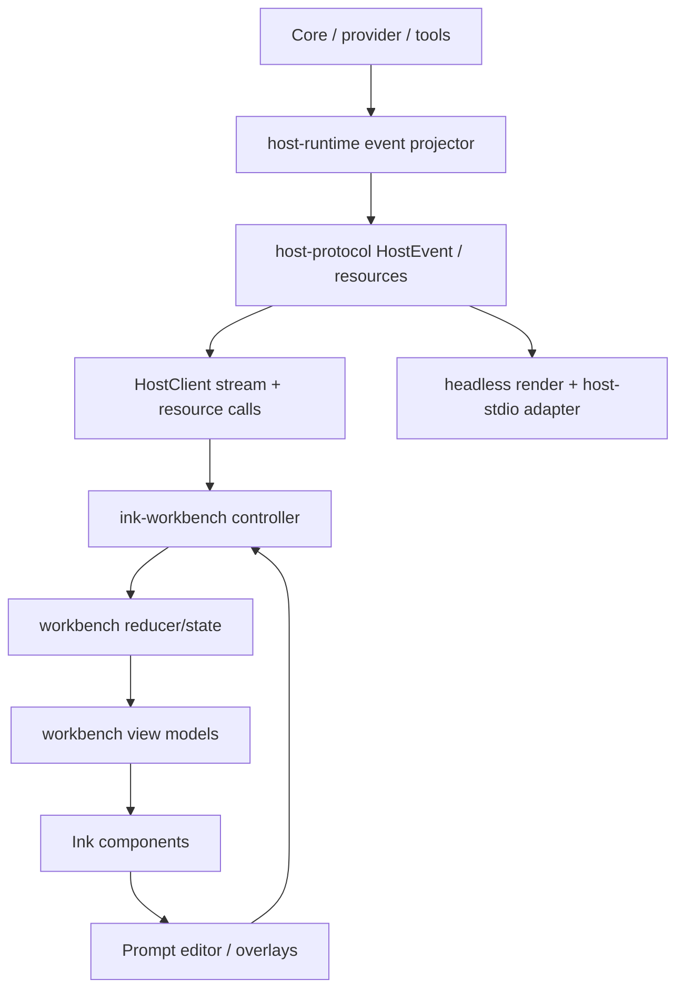
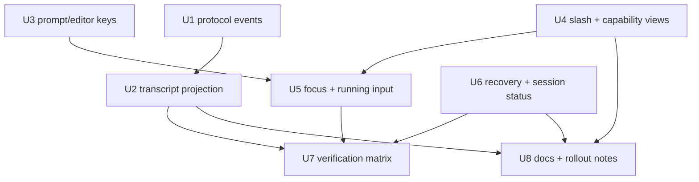

# feat: complete M42 Ink TUI workbench parity

## Summary

本计划把现有已完成的 Ink workbench 基座扩展为 M42 完整交互 parity：继续沿用 `HostClient -> HostEvent -> reducer/view -> Ink components` 边界，在该边界内补齐可见光标、输入回显、user/reasoning/tool transcript、Tab 补全、capability/source 展示、运行中输入、permission/interaction 焦点、断线恢复和测试矩阵。计划不迁移 renderer，不复制 OpenCode/Gemini/Claude/Pi 的完整平台面，而是把它们沉淀为 Guga 的 typed host/workbench 合同。

---

## Problem Frame

当前裸 `guga` 已经有 Ink workbench 雏形，但 M42 origin 把目标提升为真实 agent console：用户必须始终看见自己正在输入什么、agent 正在流式输出什么、工具和权限正在发生什么，以及运行中输入会以哪种语义进入 host。现有 `042` 计划只覆盖早期启动与输入切片，已经不足以承载 Pi / Claude Code / OpenCode / Gemini CLI 对齐后的完整验收面。

---

## Requirements

- R1. 交互入口与 headless 边界保持稳定：裸 `guga`/`guga --mock` 进入 TTY workbench，`guga run`/`guga -p`/非 TTY 路径保持 headless 或友好失败。（origin R1-R5, R61, AE1, AE6）
- R2. Prompt editor 必须始终显示可见光标、输入回显和当前输入目标，支持多行、历史、粘贴、Unicode/CJK、Tab 补全和草稿保留。（origin R6-R12, R19-R24, R25-R26, AE1, AE3）
- R3. Transcript 必须从 typed events 投影 user、assistant、reasoning/status、tool lifecycle、permission、interaction、queue、abort、error、retry、compact、artifact 和 usage，而不是解析 assistant prose。（origin R13-R18B, AE2）
- R4. Slash、selector、capability views 必须覆盖 builtin/profile/skill/MCP/plugin/host capabilities，展示 source、availability、conflict/disabled reason，并支持 `/model`、`/profile`、`/resume`、`/tools`、`/mcp`、`/skills`、`/permissions`、`/status`、`/compact` 等入口。（origin R25-R31, R51-R54B, AE3, AE8）
- R5. Focus stack、permission/interaction overlay、running-state input、queue 和 abort 必须有明确路由，不丢失草稿，不误 abort，不在 disconnected state 下继续向不确定 run 写入。（origin R35-R50, R55-R58, AE4, AE5, AE7）
- R6. Host protocol / HostClient 是 UI 事实源；OpenCode/Gemini 的 SDK/server/ACP/A2A/extension registry 仅作为后续阶段，不进入本计划实现范围。（origin 覆盖矩阵、范围边界、关键决策）
- R7. 测试必须覆盖 renderer-neutral 状态机、protocol projection、controller routing、Ink smoke、import boundary、mock provider streaming、断线/seq、capability views 和至少一个 real-provider smoke 的手动或自动验收路径。（origin R59-R64）

**Origin actors:** A1 CLI 用户, A2 Guga workbench, A3 HostClient / Host protocol, A4 Agent runtime / provider / tools

**Origin flows:** F1 空闲状态提交 prompt, F2 Slash 命令发现与执行, F3 运行中 steer 与 follow-up, F4 权限或通用交互请求, F5 恢复与非 TTY 降级

**Origin acceptance examples:** AE1 光标/回显/stream, AE2 reasoning + assistant + tool lifecycle, AE3 slash selector, AE4 permission focus, AE5 running input queue/abort, AE6 headless boundary, AE7 replay/disconnect, AE8 capability/source/status views

---

## Assumptions

*本计划更新既有 completed 计划文件，并把它重新作为 active 计划。以下是计划期推断，执行前如发现代码已在 worktree 中部分完成，应以实现现状为准合并，而不是重复实现。*

- 当前主干的 Ink workbench 基座是可延展的；本计划优先扩展现有模块，不引入第二套 renderer 或 UI state store。
- M42 首轮只要求 TUI 消费和展示 host/runtime 暴露的状态；不会在本计划内实现完整 REST server、OpenAPI SDK、ACP/A2A server、LSP client、mDNS、Desktop/Web UI 或遥测管线。
- Reasoning/status 只能展示 provider/core 明确暴露的 delta；不得伪造或展示 hidden chain-of-thought。
- Real-provider smoke 可以先作为手动验收或环境门控测试记录，不强制 CI 依赖真实外部模型。

---

## Scope Boundaries

- 不迁移出 Ink-first Node CLI，不重新评估 OpenTUI/Bun，除非后续实现证明 Ink 无法满足终端 fidelity。
- 不复制 Claude Code teams/tasks/background-agent 平台面。
- 不实现 OpenCode Desktop/Web/mDNS/ACP/Zed/LSP/WebSocket PTY。
- 不实现 Gemini CLI 的完整 SDK、A2A server、extension registry、企业配置面、sandbox 执行器、trusted-folder policy 或 telemetry/monitoring pipeline。
- 不把 Pi-compatible JSONL 或 Claude Code transcript format 作为内部 UI protocol；仅在 `packages/host-stdio` 维护 adapter 级映射。

### Deferred to Follow-Up Work

- 完整 `@` mention 候选源、文件索引、artifact mention 和 resource mention：M42 只保留入口与 overlay 基座，完整候选系统另行计划。
- 长输出 inspector、diff inspector、shell output viewer 的完整交互：本计划只要求可扫描摘要、折叠/预览入口和视觉区分。
- 完整 crash checkpoint 数据模型、branch tree 管理 UI、session 搜索/命名/导入导出：本计划只要求恢复入口和可见状态。
- Web/Desktop/IDE/ACP/A2A 客户端 parity：后续复用 Host protocol。

---

## Context & Research

### Relevant Code and Patterns

- `packages/cli/src/commands/run.ts` 已负责 headless 与 interactive route 的分流，Ink workbench 通过动态 import 进入，适合继续保护 import boundary。
- `packages/cli/src/ink-workbench/` 已包含 `app.tsx`、`controller.ts`、`prompt-state.ts`、`focus-state.ts`、`slash-state.ts`、`selector-state.ts` 和 components；这是本计划的主要 UI 层扩展点。
- `packages/cli/src/tui/editor.ts` 和 `packages/cli/src/tui/keys.ts` 是 renderer-neutral 输入原语，应继续承载 Tab、Unicode、paste、history、submit/newline 行为。
- `packages/cli/src/workbench/event-reducer.ts`、`state.ts`、`views.ts` 已把 HostEvents 投影为 transcript/status；新增 user/reasoning/capability/status block 应在这里集中处理。
- `packages/host-protocol/src/events.ts` 和 `packages/host-runtime/src/event-projector.ts` 是 typed event 合同与 core event 投影边界；reasoning/status delta、tool terminal reason、capability/status exposure 需要优先从这里定义。
- `packages/host-stdio/src/index.ts` 是 Pi-compatible adapter 层；新增 HostEvent 类型时应保持 adapter 可解释，但不反向驱动内部 UI protocol。
- `packages/cli/src/run.test.ts`、`packages/cli/src/ink-workbench/*.test.tsx`、`packages/cli/src/workbench/*.test.ts`、`packages/host-protocol/src/events.test.ts`、`packages/host-runtime/src/*test.ts` 和 `packages/host-stdio/src/index.test.ts` 是本计划的主要测试落点。

### Institutional Learnings

- `docs/solutions/architecture-patterns/host-ui-protocol-v1.md` 明确 renderer 是 HostClient consumer，REST/resources/control 是命令面，SSE/HostEvents 是观察面；本计划必须避免 UI 直接调用 HostRuntime 私有 API。
- `.trellis/spec/frontend/state-management.md` 要求 runtime facts 来自 host/runtime，UI 只保留 derived/local state；permission、queue、stream reconnect 都必须同步自 host events 或 SDK 查询。
- `.trellis/spec/frontend/type-safety.md` 要求前端复用 host-protocol types，使用 discriminated unions 和 exhaustive switches，不复制并行协议类型。
- `.trellis/spec/backend/quality-guidelines.md` 要求行为变更有测试、使用 in-memory/mock provider fixture，不让 provider/tool exceptions 逃逸为非结构化失败。
- `.trellis/spec/guides/cross-layer-thinking-guide.md` 强调跨层合同必须映射 source -> transform -> display；本计划的 HostEvent -> WorkbenchState -> ViewModel -> Ink frame 是核心跨层路径。

### Reference Project Context

- `docs/research/context-packs/ui-protocol.md` 支持采用 OpenCode 风格 REST/SSE/SDK 作为长期 host surface，但 M42 只实现 Ink TUI。
- `docs/research/context-packs/gemini-cli-reference.md` 支持借鉴 Gemini CLI 的 core/cli/sdk/protocol 分层、tool scheduler、context pipeline、skills/MCP prompt loader 和 capability discovery 边界。
- `docs/research/source-analysis/claude-code-analysis/analysis/components/02-core-interaction-components.md` 将 PromptInput 视为输入编排器，而不是普通文本框。
- `docs/research/repomix/pi-token-tree.txt` 与 M37 notes 支持 editor、autocomplete、queue、steer/follow-up、abort 和 session tree 语义。

---

## Key Technical Decisions

- Extend current Ink workbench rather than create a parallel TUI: current code already has dynamic import, controller, reducer and state machines; duplication would increase parity drift.
- Keep protocol-first ordering for new runtime facts: add or adjust HostEvent/resource types first, then update projector, reducer, views, components and adapters.
- Represent hidden reasoning safely: only render explicit `message.reasoning_delta` or equivalent typed status events from host/core, with wording that signals status/reasoning without exposing hidden chain-of-thought.
- Treat user prompt as transcript data: `run.started.input` should become a user transcript block so submitted prompts remain visible after editor reset.
- Make Tab completion a key intent: `Tab` should complete highlighted slash command in slash focus and be a no-op in plain editor/selectors unless a future owner explicitly handles it.
- Keep capability views data-driven: slash metadata may provide builtin command descriptions, but `/tools`、`/mcp`、`/skills`、`/permissions`、`/status` must reflect `HostClient` capability/status resources rather than static documentation.
- Prefer structured previews over rich inspectors in M42: tool output and capability data should be scannable inline with truncation/summary, while full inspectors remain follow-up work.
- Preserve fail-closed permission behavior: disconnected or non-interactive states must not silently allow pending permission requests.

---

## Open Questions

### Resolved During Planning

- Should this update create a new plan or modify `042`? Resolved by user choice: update existing `docs/plans/2026-05-28-042-feat-ink-tui-workbench-plan.md`.
- Should external docs be fetched for Ink/React? Resolved: no. The repo already has committed Ink 7 usage, tests, and local architecture docs; current planning risk is cross-layer contract completeness, not API syntax.
- Should M42 implement full OpenCode/Gemini SDK/server surfaces? Resolved: no. The origin document marks those as later phase or out of scope.

### Deferred to Implementation

- Exact HostEvent shape for status/planning deltas: implementation should choose the smallest additive protocol shape that can be projected by CLI, headless render, and stdio adapter without breaking existing tests.
- Exact terminal compatibility matrix: implementation should start with mock/smoke coverage in the repo and record any terminal-specific manual findings separately.
- Exact long-output truncation threshold: implementation should pick a conservative first threshold and cover it in view tests; full inspector UX is deferred.
- Exact durable crash recovery behavior: implementation should expose only states the current host/session store can safely recover, and mark unsupported cases visibly.

---

## High-Level Technical Design

> *This illustrates the intended approach and is directional guidance for review, not implementation specification. The implementing agent should treat it as context, not code to reproduce.*

Implementation should preserve this data flow. If a UI needs a runtime fact, it should be added to the protocol or queried through HostClient, not smuggled through local component state or assistant text.

---

## Implementation Units

- U1. **Extend Host protocol and runtime event projection**

**Goal:** Make all M42-visible runtime facts expressible as typed protocol events/resources before UI consumes them.

**Requirements:** R3, R5, R6, R7; origin R13-R18B, R54B, R55-R56, AE2, AE7

**Dependencies:** None

**Files:**
- Modify: `packages/host-protocol/src/events.ts`
- Modify: `packages/host-protocol/src/index.ts`
- Modify: `packages/host-protocol/src/resources.ts`
- Modify: `packages/host-runtime/src/event-projector.ts`
- Modify: `packages/host-stdio/src/index.ts`
- Modify: `packages/cli/src/render/events.ts`
- Test: `packages/host-protocol/src/events.test.ts`
- Test: `packages/host-runtime/src/event-projector.test.ts`
- Test: `packages/host-stdio/src/index.test.ts`
- Test: `packages/cli/src/run.test.ts`

**Approach:**
- Add additive event/resource fields for explicit model reasoning/status deltas, tool terminal semantics where available, and capability/status rows required by `/status` and capability views.
- Preserve existing event names and consumers where possible; prefer additive union members over changing current payloads.
- Map core `ModelEventType` reasoning/status style events only when they exist; do not synthesize hidden reasoning.
- Keep headless rendering and Pi-compatible stdio adapter aware of new events so non-Ink surfaces do not silently drop important status.

**Patterns to follow:**
- `packages/host-protocol/src/events.ts` discriminated union and `createHostEventSequencer`.
- `packages/host-runtime/src/event-projector.ts` additive projection from core events to HostEvents.
- `packages/host-stdio/src/index.ts` adapter-only mapping.

**Test scenarios:**
- Happy path: explicit reasoning/status model event projects to a host event and serializes with seq/occurredAt.
- Happy path: host-stdio maps reasoning/status into a Pi-compatible event without changing internal protocol names.
- Error path: unknown or unsupported model events still produce no HostEvent rather than throwing.
- Integration: headless debug/event rendering prints a concise status/reasoning line for explicit host events.

**Verification:**
- Host protocol tests prove the new union members are typed and sequenced.
- Runtime projector tests prove explicit core deltas become HostEvents and unrelated events remain ignored.
- Adapter/headless tests prove non-Ink consumers keep parity.

---

- U2. **Complete transcript projection for user, reasoning, and tool lifecycle**

**Goal:** Ensure workbench transcript reflects what the user submitted, what the model is explicitly doing, and what each tool is doing from start through terminal status.

**Requirements:** R3, R7; origin R13-R18B, AE1, AE2

**Dependencies:** U1 for new event types

**Files:**
- Modify: `packages/cli/src/workbench/state.ts`
- Modify: `packages/cli/src/workbench/event-reducer.ts`
- Modify: `packages/cli/src/workbench/views.ts`
- Modify: `packages/cli/src/ink-workbench/components/transcript.tsx`
- Test: `packages/cli/src/workbench/event-reducer.test.ts`
- Test: `packages/cli/src/workbench/views.test.ts`
- Test: `packages/cli/src/ink-workbench/app.test.tsx`

**Approach:**
- Add `user` transcript blocks from `run.started.input`, keeping submitted prompts visible after editor reset.
- Add `reasoning` or `status` transcript blocks for explicit reasoning/status deltas, merging deltas by message/status id and finalizing them on terminal events when applicable.
- Expand tool block view detail to include input summary, progress message/percentage, output preview, error message, artifact ids and terminal status.
- Use previews/truncation for large unknown payloads; leave full inspector UX deferred.

**Patterns to follow:**
- Existing `AssistantTranscriptBlock` merge/finalize logic in `event-reducer.ts`.
- Existing `createTranscriptViewBlock` exhaustive switch in `views.ts`.
- Existing `Transcript` component block rendering.

**Test scenarios:**
- Covers AE1. Happy path: `run.started` adds a user block before assistant deltas.
- Covers AE2. Happy path: reasoning/status deltas merge into one independent transcript block and do not appear as assistant prose.
- Covers AE2. Happy path: tool started/progress/completed remains one scannable block with progress and output preview.
- Error path: tool failed/denied/timeout/cancelled projects to a visible terminal status with error detail when the host exposes it.
- Edge case: `message.completed` without prior assistant delta does not crash or create duplicate unrelated blocks.

**Verification:**
- Workbench reducer/view tests cover each transcript kind and exhaustive rendering remains type-safe.

---

- U3. **Harden prompt editor rendering, key mapping, and Tab completion**

**Goal:** Fix the reported no-cursor/blank-input failure and make the editor reliable under normal terminal editing, slash completion, paste, and Unicode input.

**Requirements:** R2, R7; origin R6-R12, R19-R26, R59, AE1, AE3

**Dependencies:** None

**Files:**
- Modify: `packages/cli/src/tui/keys.ts`
- Modify: `packages/cli/src/tui/editor.ts`
- Modify: `packages/cli/src/ink-workbench/prompt-state.ts`
- Modify: `packages/cli/src/ink-workbench/slash-state.ts`
- Modify: `packages/cli/src/ink-workbench/selector-state.ts`
- Modify: `packages/cli/src/ink-workbench/app.tsx`
- Modify: `packages/cli/src/ink-workbench/components/prompt-editor.tsx`
- Test: `packages/cli/src/tui/opentui-compat.test.ts`
- Test: `packages/cli/src/ink-workbench/prompt-state.test.ts`
- Test: `packages/cli/src/ink-workbench/slash-state.test.ts`
- Test: `packages/cli/src/ink-workbench/selector-state.test.ts`
- Test: `packages/cli/src/ink-workbench/app.test.tsx`

**Approach:**
- Introduce a `complete` key intent for Tab and route it by focus owner.
- In slash focus, Tab completes the highlighted slash command into the editor with a trailing space and closes the palette.
- In plain editor/selector contexts, Tab is a safe no-op unless the owner intentionally supports completion.
- Render an insertion marker even when the buffer is empty, and preserve visible text while streaming updates redraw the frame.
- Keep cursor movement Unicode-aware using existing codepoint-based cursor helpers; do not introduce terminal-specific width logic beyond smoke coverage in this unit.

**Patterns to follow:**
- `mapKeypressToIntent` as the only terminal key normalization layer.
- `applyPromptIntent` and `applySlashPaletteIntent` as pure state transitions.
- Ink component tests through `ink-testing-library`.

**Test scenarios:**
- Covers AE1. Happy path: empty focused editor renders a visible insertion marker.
- Covers AE1. Happy path: typing `hello` shows `hello` before submission and does not blank after submission.
- Covers AE3. Happy path: typing `/mod` opens slash palette; Tab completes `/model ` into the editor.
- Edge case: Tab in plain prompt with no slash palette does not insert a tab character or mutate buffer unexpectedly.
- Edge case: paste containing multi-line text remains visible and submit/newline behavior remains distinct.
- Edge case: Unicode/CJK input cursor movement deletes whole codepoints rather than corrupting buffer.

**Verification:**
- Prompt/editor tests prove key mapping, state transitions and Ink rendering are stable.

---

- U4. **Upgrade slash, selector, and capability/status views**

**Goal:** Make command discovery and capability inspection match the M42 coverage matrix, including OpenCode/Gemini-style source and status visibility.

**Requirements:** R4, R6, R7; origin R25-R31, R51-R54B, AE3, AE8

**Dependencies:** U1 for any new capability/status resource fields

**Files:**
- Modify: `packages/cli/src/workbench/commands.ts`
- Modify: `packages/cli/src/workbench/model-control.ts`
- Modify: `packages/cli/src/workbench/session-control.ts`
- Modify: `packages/cli/src/ink-workbench/controller.ts`
- Modify: `packages/cli/src/ink-workbench/slash-state.ts`
- Modify: `packages/cli/src/ink-workbench/selector-state.ts`
- Modify: `packages/cli/src/ink-workbench/components/slash-palette.tsx`
- Modify: `packages/cli/src/ink-workbench/components/selector-overlay.tsx`
- Test: `packages/cli/src/workbench/commands.test.ts`
- Test: `packages/cli/src/ink-workbench/controller.test.ts`
- Test: `packages/cli/src/ink-workbench/slash-state.test.ts`
- Test: `packages/cli/src/ink-workbench/selector-state.test.ts`
- Test: `packages/cli/src/ink-workbench/app.test.tsx`

**Approach:**
- Enrich slash command metadata with source, selector requirement, availability, conflict/disabled reason and optional keybind/aliases.
- Keep builtin commands static enough for discovery, but populate capability views from `HostClient.listCapabilities()` and operational status resources.
- Ensure `/model`、`/profile`、`/resume` selector rows show the metadata the origin requires: provider/model/config source, restart/next-turn semantics, session branch/updated/last status where available.
- Add `/status` display coverage for checkpoint/context/sandbox/trusted-folder statuses only when host exposes them; unsupported items should show as unsupported rather than executable.

**Patterns to follow:**
- Existing `WORKBENCH_SLASH_COMMAND_METADATA`.
- Existing `listModelOptions`, `formatModelOption`, session helper functions and `summarizeOperationalStatus`.
- Capability source rules in `.trellis/spec/backend/quality-guidelines.md`.

**Test scenarios:**
- Covers AE3. Happy path: `/model`, `/profile`, `/resume` open selector flows and preserve drafts on Escape.
- Covers AE8. Happy path: `/tools`, `/mcp`, `/skills`, `/permissions` show capabilities grouped or filtered by source/type/status.
- Covers AE8. Edge case: disabled or conflicting capability renders reason and is not executed as if supported.
- Error path: `listCapabilities()` failure returns a structured command error and does not clear the prompt draft.
- Edge case: unknown slash command suggests nearest known commands without submitting as normal prompt.

**Verification:**
- Command/controller tests prove command metadata, selector construction and capability rendering are data-driven.

---

- U5. **Stabilize focus stack, overlays, running input, and abort semantics**

**Goal:** Make all input routing explicit and safe while a run is active, waiting on permission, waiting on interaction, disconnected, or inside an overlay.

**Requirements:** R2, R5, R7; origin R35-R50, R55-R58, AE4, AE5

**Dependencies:** U2, U3, U4

**Files:**
- Modify: `packages/cli/src/ink-workbench/focus-state.ts`
- Modify: `packages/cli/src/ink-workbench/prompt-state.ts`
- Modify: `packages/cli/src/ink-workbench/app.tsx`
- Modify: `packages/cli/src/ink-workbench/controller.ts`
- Modify: `packages/cli/src/ink-workbench/components/status-bar.tsx`
- Modify: `packages/cli/src/workbench/event-reducer.ts`
- Modify: `packages/cli/src/workbench/views.ts`
- Test: `packages/cli/src/ink-workbench/focus-state.test.ts`
- Test: `packages/cli/src/ink-workbench/prompt-state.test.ts`
- Test: `packages/cli/src/ink-workbench/controller.test.ts`
- Test: `packages/cli/src/ink-workbench/app.test.tsx`
- Test: `packages/cli/src/workbench/event-reducer.test.ts`

**Approach:**
- Treat focus owner as the sole authority for Enter/Escape/arrow semantics.
- Give permission and interaction prompts higher priority than slash/selector/editor and fail closed when the stream is disconnected.
- Keep running-state editor enabled, with visible mode `steer` or `follow_up`; if host marks steering deferred, render that in queue/status rather than pretending it was injected.
- Ensure Escape closes overlays before aborting active run; Ctrl-C behavior remains distinct and intentional.
- On abort, clear run-scoped prompt targets and pending local overlay state only after host/run state indicates it is safe.

**Patterns to follow:**
- Existing `resolveFocusOwner` priority tests.
- Existing `controller.submitText()` route order and `sendRunInput()` HostClient call.
- Existing disconnected lock state in `WorkbenchState`.

**Test scenarios:**
- Covers AE4. Happy path: pending permission receives `allow` even when slash palette is open.
- Covers AE4. Error path: invalid permission response shows recoverable feedback and does not call HostClient.
- Covers AE5. Happy path: running prompt submission calls `sendRunInput()` with the visible mode.
- Covers AE5. Edge case: Escape with selector open closes selector; Escape with permission pending does not abort active run.
- Error path: disconnected state blocks prompt/run input except `/reload`.
- Integration: queue updated event after running input changes status bar and transcript without local optimistic queue mutation.

**Verification:**
- Focus/controller/app tests prove input routing is deterministic across overlays and active run states.

---

- U6. **Implement recovery, sequence continuity, and durable session affordances**

**Goal:** Make stream failures, sequence discontinuities, reload, resume, fork and crash-adjacent recovery visible and safe.

**Requirements:** R1, R5, R7; origin R53, R55-R58, AE6, AE7

**Dependencies:** U1, U2, U5

**Files:**
- Modify: `packages/cli/src/ink-workbench/controller.ts`
- Modify: `packages/cli/src/workbench/event-reducer.ts`
- Modify: `packages/cli/src/workbench/views.ts`
- Modify: `packages/cli/src/workbench/session-control.ts`
- Modify: `packages/cli/src/workbench/commands.ts`
- Modify: `packages/cli/src/commands/run.ts`
- Test: `packages/cli/src/ink-workbench/controller.test.ts`
- Test: `packages/cli/src/workbench/event-reducer.test.ts`
- Test: `packages/cli/src/workbench/commands.test.ts`
- Test: `packages/cli/src/run.test.ts`

**Approach:**
- Keep `lastSeq` and disconnected reason visible; `/reload` should re-fetch events and resume streaming after the last known safe seq when possible.
- Treat replay-unavailable as a locked input state with clean exit and recovery guidance.
- Improve `/resume` and `/tree` output enough to show session title, branch/lineage, last status and updated time where host data exists.
- When durable state is present at startup, expose resume affordances through command/status text rather than auto-mutating sessions.
- Keep non-TTY/headless behavior isolated from Ink imports.

**Patterns to follow:**
- Existing `stream.error`, `stream.seq_discontinuity`, `stream.replay_unavailable`, `stream.reconnected` reducer actions.
- Existing `listRunEvents()` and `streamRunEvents(...afterSeq)` controller flow.
- Existing session-control helpers.

**Test scenarios:**
- Covers AE6. Happy path: headless commands do not render or import Ink workbench.
- Covers AE7. Happy path: stream error locks input and `/reload` re-fetches events and clears disconnected state.
- Covers AE7. Error path: replay unavailable keeps input locked with visible reason and allows `/exit`.
- Edge case: seq jump from N to N+2 records expected/actual seq in status.
- Happy path: `/resume` selector displays branch/last status metadata when sessions include it.

**Verification:**
- Reducer/controller/run tests prove recovery state is visible, reloadable when possible, and safe when not possible.

---

- U7. **Broaden automated and smoke verification**

**Goal:** Convert M42 acceptance examples into durable tests across protocol, projection, controller, Ink renderer, import boundaries and CLI smoke paths.

**Requirements:** R7; origin R59-R64, AE1-AE8

**Dependencies:** U1-U6

**Files:**
- Modify: `packages/host-protocol/src/events.test.ts`
- Modify: `packages/host-runtime/src/host-runtime.test.ts`
- Modify: `packages/host-runtime/src/event-projector.test.ts`
- Modify: `packages/host-stdio/src/index.test.ts`
- Modify: `packages/cli/src/run.test.ts`
- Modify: `packages/cli/src/host-factory.test.ts`
- Modify: `packages/cli/src/workbench/event-reducer.test.ts`
- Modify: `packages/cli/src/workbench/views.test.ts`
- Modify: `packages/cli/src/workbench/commands.test.ts`
- Modify: `packages/cli/src/workbench/dependency-boundary.test.ts`
- Modify: `packages/cli/src/ink-workbench/app.test.tsx`
- Modify: `packages/cli/src/ink-workbench/workbench-smoke.test.tsx`
- Modify: `packages/cli/src/ink-workbench/controller.test.ts`
- Modify: `packages/cli/src/ink-workbench/focus-state.test.ts`
- Modify: `packages/cli/src/ink-workbench/prompt-state.test.ts`
- Modify: `packages/cli/src/ink-workbench/slash-state.test.ts`
- Modify: `packages/cli/src/ink-workbench/selector-state.test.ts`

**Approach:**
- Add one test cluster per origin acceptance example rather than relying on broad snapshots.
- Use mock providers, fake HostClient and in-memory stores for CI-safe coverage.
- Isolate real-provider smoke as env-gated/manual documentation unless project already has a reliable real-provider test harness.
- Protect local config tests by using temporary `GUGA_HOME` or explicit env so developer machine credentials do not alter expectations.

**Patterns to follow:**
- Existing `captureIo()` and fake TTY tests in `run.test.ts`.
- Existing `ink-testing-library` component tests.
- Existing Trellis guidance to prefer in-memory fixtures and mock provider coverage.

**Test scenarios:**
- Covers AE1-AE8. Integration: each acceptance example maps to at least one automated test or documented manual smoke.
- Edge case: local user config/API keys do not affect no-model and mock-provider tests.
- Error path: unsupported or disconnected host states produce friendly visible failures, not thrown internal class names.
- Integration: import-boundary test proves headless route does not statically import `ink`, `react`, or `packages/cli/src/ink-workbench`.

**Verification:**
- Package-level CLI, host-protocol, host-runtime and host-stdio tests cover all changed feature-bearing units.

---

- U8. **Update documentation and operational notes for the completed parity slice**

**Goal:** Keep architecture docs, CLI docs and plan handoff aligned with the M42 parity contract so future Web/Desktop/IDE work can reuse the same host surface.

**Requirements:** R6, R7; origin success criteria and scope boundaries

**Dependencies:** U1-U7

**Files:**
- Modify: `docs/solutions/architecture-patterns/host-ui-protocol-v1.md`
- Modify: `packages/cli/README.md`
- Modify: `docs/plans/2026-05-28-042-feat-ink-tui-workbench-plan.md`
- Optional Modify: `docs/brainstorms/2026-05-28-m42-ink-tui-workbench-parity-requirements.md` only if implementation discovers a requirements wording correction

**Approach:**
- Document the final HostEvent/view projection model at the architecture level, especially reasoning/status safety and capability source/status rules.
- Update CLI README to describe interactive vs headless entry points, slash/capability commands, permission/interaction behavior and recovery expectations.
- Keep the plan active until execution verifies the units; do not use checkbox progress in the plan body.

**Patterns to follow:**
- Existing `host-ui-protocol-v1.md` protocol-first wording.
- Existing package README style and command examples.

**Test scenarios:**
- Test expectation: none for documentation prose itself; behavior is covered by U1-U7 tests.

**Verification:**
- Documentation references repo-relative paths and does not claim deferred Web/Desktop/ACP/Gemini SDK surfaces are implemented.

---

## System-Wide Impact

- **Interaction graph:** CLI route, HostClient, host-runtime projector, host-protocol events/resources, workbench reducer/view, Ink components, host-stdio adapter and headless renderer all consume the same event vocabulary.
- **Error propagation:** Provider/tool/runtime/permission failures must move through structured HostEvents or command results into status/transcript; component-local exceptions should not become the user-visible error model.
- **State lifecycle risks:** Active run, stream abort controller, disconnected lock, pending permission/interaction and prompt target can drift if host events arrive after local overlay changes; tests must cover stale event and focus priority cases.
- **API surface parity:** New HostEvents affect `@guga-agent/host-protocol`, `@guga-agent/host-runtime`, `@guga-agent/cli`, `@guga-agent/host-stdio` and any future SDK/Desktop clients.
- **Integration coverage:** Unit tests alone will not prove TTY behavior; Ink smoke tests and at least one manual or env-gated real-provider stream smoke are required.
- **Unchanged invariants:** Headless commands remain scriptable, Ink/React stay dynamically imported, hidden chain-of-thought is not rendered, and Host protocol remains the internal UI contract.

---

## Risks & Dependencies

| Risk | Mitigation |
|------|------------|
| Protocol churn breaks adapters | Make event changes additive, update host-stdio/headless render in the same unit, and cover union exhaustiveness in tests. |
| UI shows hidden or invented reasoning | Only project explicit provider/core deltas; document that hidden chain-of-thought remains out of scope. |
| Local component state drifts from host state | Keep runtime facts in reducer/view models and make components consume projections instead of calling runtime internals. |
| Permission UX accidentally allows unsafe actions | Keep permission fail-closed in disconnected/non-interactive states and test invalid responses. |
| Terminal-specific rendering remains flaky | Cover mock TTY, resize/no-color/Unicode smoke where feasible, and record terminal-specific gaps as follow-up rather than changing renderer prematurely. |
| Existing developer config contaminates tests | Use temporary `GUGA_HOME` and explicit env in config-dependent tests. |
| Plan scope expands into Desktop/Web/ACP/Gemini SDK work | Keep these surfaces in Scope Boundaries and only preserve protocol affordances for later. |

---

## Documentation / Operational Notes

- Update CLI-facing docs after implementation, not before, so command descriptions match actual host capability behavior.
- Keep real-provider smoke documented as opt-in if it needs credentials; CI should rely on mock provider and fake HostClient tests.
- If execution discovers that current host/session persistence cannot recover a state safely, expose that as unsupported in UI and record follow-up work rather than pretending recovery works.

---

## Sources & References

- **Origin document:** [docs/brainstorms/2026-05-28-m42-ink-tui-workbench-parity-requirements.md](docs/brainstorms/2026-05-28-m42-ink-tui-workbench-parity-requirements.md)
- Related plan baseline: [docs/plans/2026-05-28-037-feat-productized-cli-workbench-plan.md](docs/plans/2026-05-28-037-feat-productized-cli-workbench-plan.md)
- Related architecture note: [docs/solutions/architecture-patterns/host-ui-protocol-v1.md](docs/solutions/architecture-patterns/host-ui-protocol-v1.md)
- Reference context: [docs/research/context-packs/ui-protocol.md](docs/research/context-packs/ui-protocol.md)
- Reference context: [docs/research/context-packs/gemini-cli-reference.md](docs/research/context-packs/gemini-cli-reference.md)
- Project guidance: `.trellis/spec/frontend/state-management.md`, `.trellis/spec/frontend/type-safety.md`, `.trellis/spec/backend/quality-guidelines.md`, `.trellis/spec/guides/cross-layer-thinking-guide.md`
