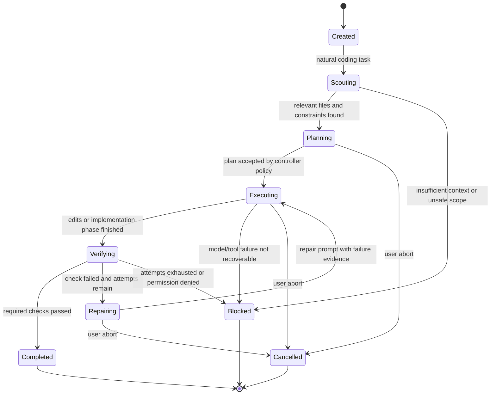
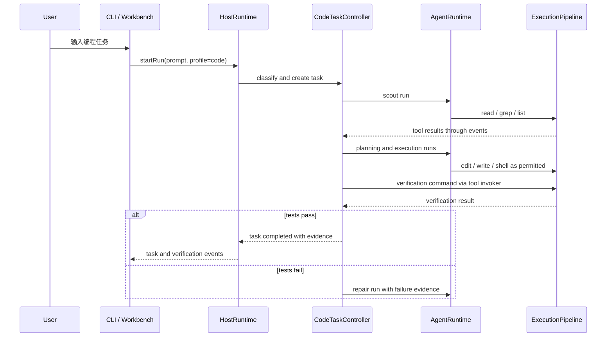
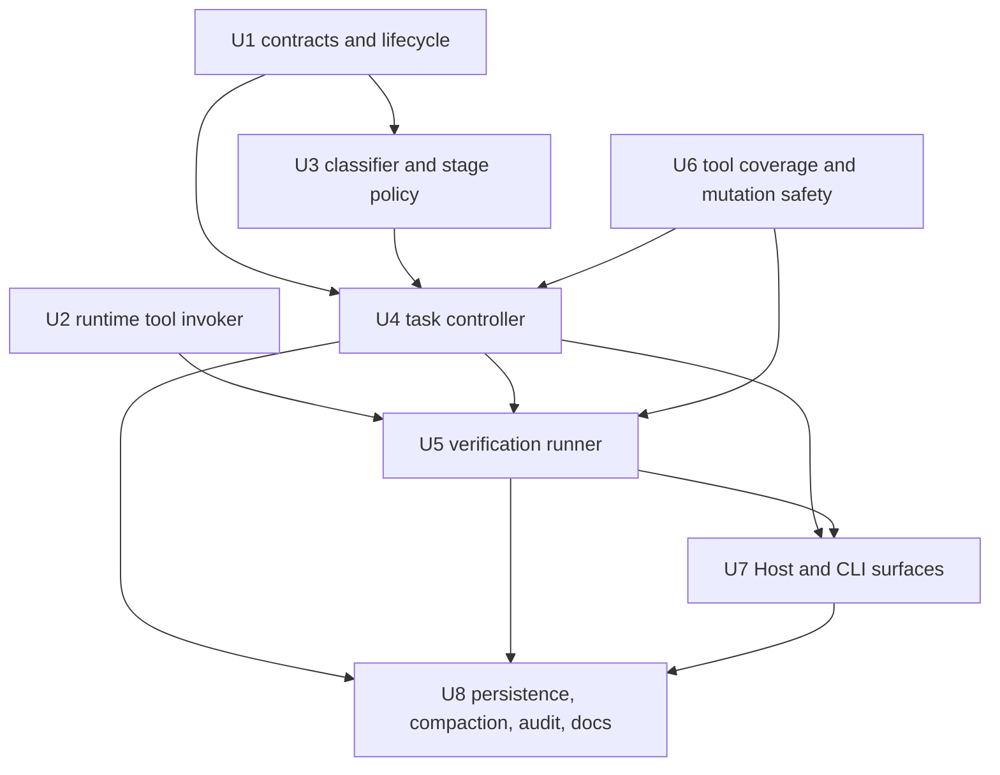
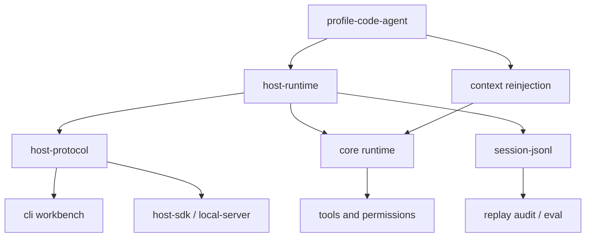

# 自动编程任务闭环实施计划

## 一句话结论

Guga 不需要重写 `AgentLoop`，也不需要新增一个像 `guga code` 这样的强制入口。正确落点是在现有 `code` profile、Host runtime、Host protocol、工具执行管线、会话持久化和 CLI workbench 之上，新增一个可恢复的 `CodeTaskController`：用户仍然自然输入编程任务，控制器自动完成 scout、计划、执行、验证、修复，并且只有测试验证通过才允许任务进入 completed。

这份计划来自 `docs/brainstorms/2026-05-29-autonomous-code-task-loop-requirements.md`，并结合本次对 Guga 当前源码、项目内研究包、Pi / Claude Code / OpenCode 源码摘要与打包上下文的调研。计划阶段不改代码、不运行测试。

## 问题框架

当前 Guga 已经具备很多底座能力：`packages/core/src/loop/agent-loop.ts` 有 turn 循环、provider fallback、上下文压缩和工具调度；`packages/core/src/tools/execution-pipeline.ts` 有权限、hook、schema、result policy 和 durable events；`packages/profile-code-agent/src/bundle.ts` 已经组合 filesystem、shell、git、skills、MCP、ops、audit、eval；`packages/host-runtime/src/host-runtime.ts` 已经有 session、branch、fork、queued input 和 run 管理；`packages/host-local-server/src/routes.ts` 已经提供 REST/SSE 控制面；`packages/cli/src/ink-workbench/controller.ts` 已经支持自然输入、运行中 steer/follow-up、permission/interaction 响应。

缺口不是“有没有 agent”，而是“有没有一个产品级编程任务闭环”。现在一次 run 在 assistant 给出 final answer 时就结束，系统不会强制检查代码是否改对、是否跑过相关测试、失败后是否进入修复轮、恢复会话后是否记得当前任务计划和验证状态。因此用户输入“实现 X”时，Guga 仍更像通用对话式 coding profile，而不是 Pi Code、Claude Code、OpenCode 那种以任务完成为中心的 terminal coding agent。

本计划要补齐的是任务治理层：识别自然编程任务，围绕普通 `AgentRuntime.run()` 编排多轮子 run 和工具调用，把“完成任务”的定义从 assistant 文本改成有状态、有证据、可恢复、可审计的 lifecycle。

## 调研结论

### Guga 当前源码

| 领域 | 事实 / 推断 | 对计划的判断 |
| --- | --- | --- |
| Core loop | 事实：`packages/core/src/loop/agent-loop.ts` 已有 max turns、context projection、reactive/proactive compaction、tool scheduler、tool result 回填和 durable events。 | 不在 core 中新增 coding 专用 while loop；复用它作为每个任务阶段的执行内核。 |
| Tool pipeline | 事实：`packages/core/src/tools/execution-pipeline.ts` 已集中处理 schema、permission、hooks、timeout/cancel、result policy 和 durable tool events。 | 所有自动验证、shell、文件修改都必须继续走这条管线，不能由控制器直接调用 `child_process` 绕过权限。 |
| Scheduler | 事实：`packages/core/src/tools/tool-scheduler.ts` 已支持 read-only 并行、resource-scoped 冲突检测、interactive/unknown 串行。 | 可借鉴 Pi 的 file mutation queue，但优先强化现有 resource scope，而不是重建调度器。 |
| Filesystem tools | 事实：`packages/core/src/builtins/filesystem.ts` 有 read/write/edit/list/search，但 `fs_search` 更接近路径搜索，不是 OpenCode/Claude 级内容 grep。 | P0 需要补真实 `fs_grep` / `fs_glob` 或等价能力；否则 scout 阶段不够稳定。 |
| Shell tool | 事实：`packages/core/src/builtins/shell.ts` 有 workspace cwd、env allowlist、timeout/cancel、输出预算和 headless/background deny。 | 验证 runner 可以复用 shell 工具，但需要一个 core-neutral tool invocation bridge，确保自动测试也受权限和审计约束。 |
| Code profile | 事实：`packages/profile-code-agent/src/profile.ts` 明确 code-agent 是 profile，不拥有第二套 agent loop。 | `CodeTaskController` 应在 profile/host 层编排普通 run，不把 coding 状态机塞进 core。 |
| Test discovery | 事实：`packages/profile-code-agent/src/test-discovery.ts` 已能从 package scripts 和 changed files 推断 test/typecheck/lint/build 候选。 | 自动验证闭环从这个模块扩展，不另起一套项目探测。 |
| Permissions | 事实：`packages/profile-code-agent/src/permissions.ts` 阻断 destructive shell，默认 write/execute 需要 host resolver。 | 自动模式只能预批准低风险验证命令，不能跳过 deny/ask 规则。 |
| Host runtime | 事实：`packages/host-runtime/src/host-runtime.ts` 已有 session fork、run queue、steer/follow_up、abort/cancel 和 permission resolver bridge。 | 任务状态应投射到 Host protocol，CLI/桌面端只消费 events/resources。 |
| CLI workbench | 事实：`packages/cli/src/workbench/commands.ts` 已有 `/new`、`/resume`、`/fork`、`/tree`、`/model`、`/permissions`、`/tools`、`/skills` 等命令。 | 不新增必选入口；直接让默认 code profile 的自然 prompt 能进入任务闭环。 |

### 参考项目源码结论

| 项目 | 事实 / 推断 | 可借鉴点 |
| --- | --- | --- |
| Pi | 事实：`docs/research/repomix/pi-focused-context.xml` 中 `agent-session.ts` 聚合 agent、settings、resource loader、model registry、extension runner、queue、compaction、retry、bash exec、tool registry。 | 采用 session 级任务 runtime 视角，任务切换、fork、resume 要重建 cwd-bound 服务和上下文，而不是只换 prompt。 |
| Pi | 事实：Pi `edit.ts` 和 `file-mutation-queue.ts` 通过同文件队列、diff preview、BOM/line ending 保持来降低文件修改风险。 | Guga 需要强化文件 mutation 安全和多编辑能力，至少保证同一路径写入不会并发踩踏。 |
| Pi | 事实：Pi bash 工具有 streaming update、输出截断、完整输出落临时文件、timeout 和进程树 kill。 | Guga shell 现有基础可用，后续需要补 tool.progress 和完整输出 artifact，尤其用于测试失败诊断。 |
| Claude Code | 事实：`Tool.ts` / `toolExecution.ts` 显示工具协议包含 permission context、read-only/destructive/concurrency、hooks、progress、result mapping，并且 hook allow 不会绕过 deny/ask 规则。 | Guga 自动任务必须把权限作为硬边界；controller 只能请求执行，不能私下决定执行。 |
| Claude Code | 事实：`compact.ts` 在压缩后重新注入 files、plan、invoked skills、tool declarations、async agents，并修复 tool result pairing。 | Guga 的任务计划、验证失败、当前文件集必须参与 compaction reinjection。 |
| OpenCode | 事实：`agent.ts` 中有 build/plan/explore/compaction/title/summary 等静态 agents，`tool/registry.ts` 合并 builtin、plugin、MCP、LSP/codesearch 等工具。 | Guga 可先用任务阶段角色 prompt 实现 scout/plan/executor/verifier，后续再扩展成可配置 static agents。 |
| OpenCode | 事实：`tool/task.ts` 可启动子 agent 并返回结果，`tool/todo.ts` 让进度成为工具状态，`snapshot/index.ts` 用 git-backed snapshot 支撑 revert/diff。 | P1/P2 应补 task/todo/snapshot/worktree，但 P0 先把单任务闭环和验证闸门跑通。 |

### 已有架构学习

- 事实：`docs/solutions/architecture-patterns/code-agent-profile.md` 明确 M9 选择 code-agent profile，而不是新 runtime。
- 事实：`docs/solutions/architecture-patterns/host-protocol-cli-workbench.md` 明确 core runtime、host-protocol、host-runtime、CLI/server 的四层边界。
- 事实：`docs/solutions/architecture-patterns/tool-permission-runtime.md` 明确工具执行和权限集中在 runtime，model intent 不能直接产生副作用。

这些既有决策与本计划一致：任务控制器可以是新产品层，但不能破坏 core role-neutral 和 Host protocol-first 的边界。

## 需求追踪

| 来源领域 | 计划落点 |
| --- | --- |
| R1 自然任务入口 | 默认 `code` profile 下，用户直接输入编程任务即可触发任务闭环；不要求新命令或特殊模式。 |
| R2 agent 角色与规划 | 新增 scout、planner、executor、verifier、repairer 阶段角色；先由 profile prompt 和 controller 状态实现，后续可演进为 OpenCode 风格 static agents。 |
| R3 任务状态机 | 新增 durable task lifecycle：created、scouting、planning、executing、verifying、repairing、completed、blocked、failed、cancelled。 |
| R4 工具体系 | 强化 grep/glob/mutation safety；自动验证通过 core-neutral tool invocation bridge 复用现有 tool pipeline。 |
| R5 权限与安全 | 新增 code-task permission mode，但所有 allow/ask/deny、destructive shell deny、headless/background 策略仍由现有权限内核裁决。 |
| R6 测试闭环 | 扩展 test discovery，新增 verification runner；任务完成必须绑定通过的验证尝试，并在行为变更时写入或更新相关单测。 |
| R7 会话、恢复、分支 | task state 存入 Host/session resources，resume/fork/compaction 后继续携带 plan、current phase、verification history。 |
| R8 上下文压缩 | 新增 code-task context contributor，在 compaction 后重新注入目标、计划、关键文件、失败测试、下一步。 |
| R9 provider/model | 继续使用现有 provider router、fallback、model slash command，不在任务控制器中写死模型。 |
| R10 extensions/MCP/skills | 任务阶段使用统一 tool pool；skills/MCP 仍由 `profile-code-agent` bundle 注入。 |
| R11 CLI/TUI/server/protocol | Host events/resources 增加 task 和 verification 事件，CLI workbench 只是渲染和响应权限。 |
| R12 多 agent | P0 不做 swarm；预留 stage role 和 task sub-run 结构，P1/P2 再接 OpenCode task tool / Claude async agent 模式。 |
| R13 配置和项目规则 | controller 读取现有 profile/config/project rules；不新增第二套 AGENTS.md 解析器。 |
| R14 audit/eval | 新增 task lifecycle 和 verification evidence 到 audit/eval fixtures，支持复盘“为何算完成”。 |

## 假设

- 第一实施波次目标是“产品可用的自动编程任务闭环基础”，覆盖 P0 和部分 P1 架构钩子；LSP/codesearch、snapshot/worktree、ACP、subagent swarm、IDE 深集成作为后续波次。
- `CodeTaskController` 位于 `packages/profile-code-agent` 和 `packages/host-runtime` 的边界上：领域策略在 profile，run 编排和事件资源在 host，core 只新增 role-neutral API。
- 自动验证初期基于 `packages/profile-code-agent/src/test-discovery.ts` 和 changed files；复杂语言级测试选择后续再接 LSP/codesearch。
- 完成判定默认严格：没有通过的 required verification attempt，不进入 completed。用户若强制结束未验证任务，状态应是 `blocked` 或 `cancelled`，并记录未验证原因，而不是任何 completed 变体。
- 不新增必选 CLI 入口。`guga` / workbench / `guga run` 的自然 prompt 仍是入口，任务闭环由 profile/host 决定是否启用。

## 范围边界

范围内：

- 自然编程任务识别和 code-task lifecycle。
- Scout、plan、execute、verify、repair 的可恢复控制器。
- 自动测试发现、运行、失败摘要、修复重试、通过闸门。
- 通过现有 tool pipeline 执行 controller 发起的验证命令。
- Host protocol、Host runtime、CLI workbench 对 task/verification 事件的支持。
- 工具覆盖补齐：内容 grep、glob、文件 mutation safety、必要的多编辑语义。
- 上下文压缩、resume、fork、audit/eval 对 task state 的保存和重新注入。
- 中文/英文文档更新，解释如何使用自然任务闭环和如何判断完成。

首个执行切片不包含：

- 完整复刻 Claude Code 的团队、计费、云端账号、企业策略面板。
- 完整复刻 OpenCode 的 ACP/LSP/codesearch/snapshot/worktree 全量能力。
- 完整复刻 Pi 的 extension UI runtime、RPC 兼容层和所有 TUI 组件。
- 新增第二个 agent core、第二套路由协议或第二套权限内核。
- 自动执行 destructive git 操作，例如 push、reset、clean、force checkout。
- 将所有工具命名改成 Claude/OpenCode/Pi 兼容名。兼容 alias 可以后续做，但 P0 先保证 Guga 自身协议稳定。

## 关键技术决策

### D1. 任务闭环是 profile/host 控制器，不是 core loop

`AgentLoop` 继续只负责单次模型 turn loop。`CodeTaskController` 负责把一个用户任务拆成多个普通 run 和验证尝试，并维护 task lifecycle。这样既保留 core role-neutral，也让未来 deep-research、review、ops profile 能选择自己的控制器。

### D2. 自动验证必须走同一条工具执行管线

controller 需要执行 `pnpm test`、`pnpm typecheck`、`git status` 等命令，但不能直接绕过权限、hook、timeout 和 audit。因此需要新增一个 core-neutral `RuntimeToolInvoker` 或等价 API，让非模型调用者也能以 synthetic tool call 的形式进入 `ExecutionPipeline`。

### D3. completed 是验证状态，不是 assistant 文本

assistant 说“完成了”只表示一个执行阶段结束。`CodeTaskController` 只有在至少一个 required verification attempt 通过后，才能发布普通 completed。失败则进入 repair，耗尽预算则 blocked/failed，并保留失败命令、退出码、摘要和下一步建议。

### D4. 自然入口优先，显式命令只是观测和控制

用户仍然输入“实现 X”。controller 根据 profile、prompt 类型、cwd 状态和用户意图判断是否进入任务闭环。slash command 只用于 `/status`、`/abort`、`/permissions`、`/tasks` 等控制，不是启动任务的必要条件。

### D5. 安全自动化不是 bypass permissions

可增加 `code-task-auto` 之类 permission mode，用于自动允许低风险 read-only scout 和已发现的安全验证命令。但 destructive shell、write、network、git mutation 仍按现有 policy ask/deny。Claude Code 的 hook allow 不绕过 deny/ask 规则这一点应被保留。

### D6. 任务状态必须进入 Host protocol

CLI、local server、SDK、未来桌面端都应从同一套 `task.*` 和 `verification.*` events/resources 看到状态。workbench 不解析 assistant 文本，不从 profile 内部偷读状态。

### D7. 复刻按能力族分期，不按项目逐字搬运

Pi 的 session runtime、Claude 的权限/压缩严谨性、OpenCode 的 server/tool/task 结构都要吸收，但不照搬目录或协议。Guga 已经有 Host protocol 和 profile 架构，计划应在这些基础上加能力。

## 高层设计

## 预期输出结构

- `packages/profile-code-agent/src/task/`：task contracts、classifier、stage prompts、controller、verification runner、context reinjection、permission policy。
- `packages/core/src/runtime/`：core-neutral tool invocation bridge，复用现有 `ExecutionPipeline`。
- `packages/core/src/builtins/filesystem.ts`：补 `fs_grep` / `fs_glob` / mutation safety，或通过相邻文件拆分后重新导出。
- `packages/host-protocol/src/events.ts` 和 `packages/host-protocol/src/resources.ts`：task lifecycle、verification、task plan resource。
- `packages/host-runtime/src/host-runtime.ts` 和 `packages/host-runtime/src/event-projector.ts`：task controller 接入、events/resources 投射、resume/fork 行为。
- `packages/host-local-server/src/routes.ts` 和 `packages/host-sdk/src/client.ts`：task status、verification evidence、task control endpoint/client methods。
- `packages/cli/src/workbench/` 和 `packages/cli/src/ink-workbench/`：渲染 task status、verification progress、repair attempts、completion evidence。
- `docs/solutions/architecture-patterns/autonomous-code-task-loop.md`：沉淀最终架构模式和取舍。

## 实施单元依赖

## 实施单元

### U1. 编程任务契约与生命周期

目标：

Define the durable vocabulary for autonomous coding tasks before building behavior: task identity, state machine, stage runs, plan summary, verification attempts, completion evidence, and failure/blocked reasons.

涉及文件：

- `packages/profile-code-agent/src/task/contracts.ts`
- `packages/profile-code-agent/src/task/contracts.test.ts`
- `packages/profile-code-agent/src/task/lifecycle.ts`
- `packages/profile-code-agent/src/task/lifecycle.test.ts`
- `packages/profile-code-agent/src/index.ts`
- `packages/host-protocol/src/events.ts`
- `packages/host-protocol/src/events.test.ts`
- `packages/host-protocol/src/resources.ts`

实现思路：

- Model `CodeTaskState` as an explicit finite set, not free-form strings.
- Include `taskId`, `sessionId`, `rootRunId`, `activeRunId`, `cwd`, `objective`, `phase`, `attempt`, `maxRepairAttempts`, `createdAt`, `updatedAt`.
- Model `TaskPlan` separately from assistant prose: files to inspect/edit, planned checks, assumptions, risk notes, user-visible summary.
- Model `VerificationAttempt` with command, cwd, status, started/completed timestamps, exit code, truncated output, optional artifact reference, and reason it was selected.
- Add invariant helpers: normal completed requires at least one passing required verification; blocked/failed requires reason; cancelled requires actor.
- Add Host protocol event/resource shapes without yet wiring runtime behavior.

测试场景：

- A newly created task starts in `created` and can transition to `scouting`.
- Invalid transitions, such as `completed` back to `executing`, are rejected.
- `completed` without passing required verification is rejected.
- `blocked` without blocked reason is rejected.
- Verification attempts preserve command, status, exit code, output summary and required/optional flag.
- Host event discriminants include `task.created`, `task.phase_changed`, `task.completed`, `task.blocked`, `verification.started`, `verification.completed`.
- Host resource serialization is stable and does not expose internal class instances.

验收标准：

- Implementers can add controller behavior without inventing lifecycle vocabulary.
- Host protocol tests prove the new DTOs are backward-compatible additions.

### U2. 与 core 角色无关的运行时工具调用桥

目标：

Allow host/profile controllers to execute approved tools through the same `ExecutionPipeline` used by model-generated tool calls, so automatic verification and git/status checks are permissioned, cancellable, observable and auditable.

涉及文件：

- `packages/core/src/runtime/tool-invoker.ts`
- `packages/core/src/runtime/tool-invoker.test.ts`
- `packages/core/src/runtime/agent-runtime.ts`
- `packages/core/src/runtime/agent-runtime.test.ts`
- `packages/core/src/contracts/runtime.ts`
- `packages/core/src/contracts/tool-runtime.ts`
- `packages/core/src/index.ts`

实现思路：

- Add a minimal API such as `invokeTool(call, context)` on `AgentRuntime` or a sibling `RuntimeToolInvoker`.
- The API should build a synthetic `ToolCallCorrelation` with run/task metadata, then call `ExecutionPipeline.execute()`.
- Reuse existing permission resolver, hook kernel, durable event recorder, timeout/cancel and result policy.
- Mark invocations with a source such as `controller` / `verification` for audit, without creating a separate permission path.
- Keep the API generic: it should not know about code tasks, tests, or shell commands.

测试场景：

- Invoking a read-only tool emits the same started/completed durable events as model tool calls.
- Permission ask/deny is honored for controller-originated tool calls.
- Destructive shell remains denied by profile policy even when invoked by the controller.
- Abort signal cancels a long-running shell invocation.
- Result policy truncates large output and preserves artifact/reference behavior.
- Hook denials fail closed and are returned as tool errors, not thrown past the controller unstructured.

验收标准：

- No controller code needs to call filesystem, shell, git or child processes directly.
- Existing tool pipeline tests remain the source of truth for permission semantics.

### U3. 自然任务分类器与阶段策略

目标：

Decide when a natural prompt should enter the autonomous coding task loop, and define the stage roles/prompts used by scout、planner、executor、verifier、repairer.

涉及文件：

- `packages/profile-code-agent/src/task/classifier.ts`
- `packages/profile-code-agent/src/task/classifier.test.ts`
- `packages/profile-code-agent/src/task/stages.ts`
- `packages/profile-code-agent/src/task/stages.test.ts`
- `packages/profile-code-agent/src/task/permission-policy.ts`
- `packages/profile-code-agent/src/task/permission-policy.test.ts`
- `packages/profile-code-agent/src/profile.ts`
- `packages/profile-code-agent/src/bundle.ts`

实现思路：

- Start with deterministic classification signals: imperative coding verbs, file/repo references, bug/fix/test phrasing, current profile, explicit “实现/修复/重构/加测试”等 intent。
- Route explanation-only、research-only、review-only、question-only prompts to normal run unless the user explicitly asks for changes.
- Return a confidence and reason, not just boolean, so CLI/status can explain why task loop was or was not activated.
- Define stage prompt builders that include role, objective, phase contract, allowed output shape, and constraints from project rules.
- Define `code-task-auto` permission posture as a profile policy input, not a core permission mode that bypasses everything.

测试场景：

- “实现 X 并跑单测” enters task loop with high confidence.
- “解释这个文件” stays in normal run unless edit intent appears.
- “review my changes” routes to review/normal behavior, not execute-repair loop.
- Ambiguous prompt returns low confidence and does not silently create a task.
- Stage prompts include objective、phase、completion contract、verification contract。
- Permission policy allows read-only scout tools, asks for writes, denies destructive shell, and can allow safe verification commands only when configured.

验收标准：

- Natural task entry works without a new CLI command.
- False positives are conservative and explainable.

### U4. CodeTaskController 状态机与 Host 集成

目标：

Create the orchestrator that owns the task lifecycle and coordinates multiple ordinary runtime runs: scout、plan、execute、verify、repair，直到 verified completion、blocked、failed 或 cancelled。

涉及文件：

- `packages/profile-code-agent/src/task/controller.ts`
- `packages/profile-code-agent/src/task/controller.test.ts`
- `packages/profile-code-agent/src/task/run-prompts.ts`
- `packages/profile-code-agent/src/task/run-prompts.test.ts`
- `packages/profile-code-agent/src/task/index.ts`
- `packages/host-runtime/src/host-runtime.ts`
- `packages/host-runtime/src/host-runtime.test.ts`
- `packages/host-runtime/src/event-projector.ts`
- `packages/host-runtime/src/event-projector.test.ts`
- `packages/profile-code-agent/src/bundle.ts`

实现思路：

- Host runtime detects code profile task classification before or during run creation and creates a task resource.
- Controller starts stage runs through existing `AgentRuntime.run()` rather than embedding model loop logic.
- Scout stage gathers relevant files and constraints through tools.
- Plan stage produces a structured `TaskPlan` that includes intended implementation edits, unit-test edits and verification commands.
- Execute stage performs implementation and test edits through normal tool calls.
- Verify stage delegates to U5 verification runner.
- Repair stage feeds failure evidence back into a bounded execution run.
- Apply explicit budgets: max stage runs, max repair attempts, max wall-clock, max verification commands, and max consecutive identical failures.
- Cancel/abort from Host runtime must move active task to `cancelled` and propagate abort to active run/tool invocation.

测试场景：

- A happy-path task moves through created、scouting、planning、executing、verifying、completed。
- A failing verification enters repairing and retries with failure evidence.
- Exhausting repair attempts produces `blocked` with verification evidence.
- Permission denial during write produces `blocked` or waits for permission according to existing host behavior.
- User abort cancels active run and emits task cancelled.
- Existing non-code prompt still runs through current Host runtime path unchanged.
- Follow-up input during active task is queued or routed as task steering according to Host runtime semantics.
- Event projector emits stable task phase and verification events for CLI/server consumers.

验收标准：

- `CodeTaskController` is the only component that can mark a code task completed.
- Core loop remains unaware of code-specific phases.

### U5. 验证运行器与修复闸门

目标：

Turn test discovery into an enforceable completion gate: select relevant checks, execute them safely, summarize failures, and decide whether to complete or repair.

涉及文件：

- `packages/profile-code-agent/src/task/verification-runner.ts`
- `packages/profile-code-agent/src/task/verification-runner.test.ts`
- `packages/profile-code-agent/src/task/verification-summary.ts`
- `packages/profile-code-agent/src/task/verification-summary.test.ts`
- `packages/profile-code-agent/src/test-discovery.ts`
- `packages/profile-code-agent/src/profile-code-agent.test.ts`
- `packages/core/src/builtins/git.ts`
- `packages/core/src/builtins/default-core-capabilities.test.ts`

实现思路：

- Extend `discoverTestCommands()` to rank focused unit test, typecheck, lint and build candidates with reasons.
- Require a test plan for behavior-changing tasks. If no focused unit test exists, the controller should ask the execute/repair stage to add or update one when feasible; otherwise the task blocks with an explicit missing-test reason.
- Use U2 tool invoker to execute selected `shell_exec` commands, not direct shell calls.
- Use `git_status` / `git_diff` or equivalent to detect changed files and decide whether at least one changed-file-relevant command is required.
- Capture verification output in structured summaries: command、exit code、failure lines、likely files、truncation/artifact reference。
- Define required vs optional verification commands. Initial default: at least one focused unit test or project-approved equivalent must pass; broader typecheck/lint/build can be optional or required by project config.
- Feed failed verification summaries into repair prompts.

测试场景：

- Node project with `test:unit` and changed `*.test.ts` selects focused unit command first.
- Project with no relevant unit test gets a required test-plan action before completion, or blocks with a missing-test reason when adding one is not feasible.
- Passing required command allows completion.
- Failing command blocks completion and produces repair evidence.
- Repeated identical failure is detected and stops infinite repair loops after configured attempts.
- Verification commands go through permission policy and are denied/asked consistently.
- Large test output is summarized without losing the command, exit code and first meaningful failure.

验收标准：

- A task cannot complete merely because the model says it is done.
- Behavior-changing tasks have completion evidence tied to a focused unit test or an explicit project-approved verification equivalent.
- Verification history is visible through task resources/events.

### U6. 工具覆盖与文件修改安全

目标：

Bring first-party tools closer to Pi、Claude Code、OpenCode baseline for autonomous coding: content search, globbing, safer edits and same-file mutation serialization.

涉及文件：

- `packages/core/src/builtins/filesystem.ts`
- `packages/core/src/builtins/filesystem.test.ts`
- `packages/core/src/tools/resource-scope.ts`
- `packages/core/src/tools/resource-scope.test.ts`
- `packages/core/src/tools/tool-scheduler.ts`
- `packages/core/src/tools/tool-scheduler.test.ts`
- `packages/core/src/builtins/default-core-capabilities.ts`
- `packages/core/src/builtins/default-core-capabilities.test.ts`

实现思路：

- Add `fs_grep` for content search using workspace-safe path constraints, result limits and ignore behavior aligned with project norms.
- Add `fs_glob` for filename/path discovery with explicit max results and workspace root safety.
- Add `fs_multiedit` only if it can reuse the same exact-match safety as `fs_edit`; otherwise leave as P1 with clear alias plan.
- Introduce or strengthen same-path mutation queue so concurrent writes/edits to the same resolved path serialize, while different paths can still proceed when scheduler allows.
- Preserve current `fs_edit` strictness: zero or multiple matches should fail with actionable error, not guess.

测试场景：

- `fs_grep` finds content matches and respects workspace boundary.
- `fs_glob` returns deterministic sorted results with max result truncation.
- Hidden/ignored directories follow existing local convention.
- Two edits to the same file serialize and produce deterministic final content.
- Edits to different files can still be scheduled without unnecessary global serialization.
- `fs_edit` preserves existing zero-match and multiple-match failures.
- Result budgeting prevents large search output from flooding model context.

验收标准：

- Scout and repair phases have enough code search ability without shelling out to `rg` directly.
- File edits remain safe under controller-driven and model-driven tool execution.

### U7. Host 协议、server、SDK 与 CLI 工作台界面

目标：

Expose task lifecycle and verification evidence as typed Host resources/events, and render them in the CLI workbench without parsing assistant text.

涉及文件：

- `packages/host-protocol/src/events.ts`
- `packages/host-protocol/src/events.test.ts`
- `packages/host-protocol/src/resources.ts`
- `packages/host-sdk/src/client.ts`
- `packages/host-sdk/src/client.test.ts`
- `packages/host-sdk/src/contract/host-client-contract.ts`
- `packages/host-local-server/src/routes.ts`
- `packages/host-local-server/src/server.test.ts`
- `packages/cli/src/workbench/event-reducer.ts`
- `packages/cli/src/workbench/event-reducer.test.ts`
- `packages/cli/src/workbench/commands.ts`
- `packages/cli/src/workbench/commands.test.ts`
- `packages/cli/src/ink-workbench/components/status-bar.tsx`
- `packages/cli/src/ink-workbench/components/transcript.tsx`
- `packages/cli/src/ink-workbench/app.test.tsx`

实现思路：

- Add `task.*` and `verification.*` events to protocol and projector.
- Add `TaskResource` and `VerificationAttemptResource` to resources, with `GET`/SDK methods for current task status.
- Add server endpoints only where needed for observability/control, such as list active tasks, view task detail, cancel task, maybe retry verification.
- Add CLI reducer state for active task phase, plan summary, verification progress, repair attempt count and completion evidence.
- Add slash command routing for observability/control, for example `/task`, `/verify`, `/abort`, while preserving natural task entry.
- Keep renderer compact: status bar for phase/progress, transcript entries for major lifecycle events, collapsible output summaries for failed checks.

测试场景：

- Host SDK contract sees the same task events over in-memory and local server transport.
- SSE stream includes task phase changes in order.
- CLI reducer updates task phase from typed events.
- Verification failure appears as a structured transcript/status update.
- `/task` shows current objective, phase, attempts and last verification result.
- Cancelling a task through Host/CLI produces `task.cancelled` and stops active work.

验收标准：

- Users can see what the agent is doing and why it has or has not completed.
- Future desktop/IDE clients can reuse the same protocol.

### U8. 持久化、压缩、审计、评测与文档

目标：

Make the task loop durable across long sessions and reviewable after the fact: resume/fork preserve task state, compaction reinjects task-critical context, audit/eval can replay completion evidence, and docs explain the behavior.

涉及文件：

- `packages/profile-code-agent/src/task/context-plugin.ts`
- `packages/profile-code-agent/src/task/context-plugin.test.ts`
- `packages/core/src/context/reinjection-service.ts`
- `packages/core/src/context/reinjection-service.test.ts`
- `packages/host-runtime/src/host-runtime.ts`
- `packages/host-runtime/src/host-runtime.test.ts`
- `packages/plugin-session-jsonl/src/jsonl-session-store.ts`
- `packages/plugin-session-jsonl/src/jsonl-session-store.test.ts`
- `packages/plugin-replay-audit/src/` if task events need explicit audit rendering
- `packages/eval-fixtures/src/code-task-fixtures.ts`
- `packages/eval-fixtures/src/code-task-fixtures.test.ts`
- `docs/solutions/architecture-patterns/autonomous-code-task-loop.md`
- `packages/profile-code-agent/README.md`
- `packages/cli/README.md`

实现思路：

- Add a code-task context contributor using existing context hook/reinjection mechanisms so compaction preserves objective、plan、active files、verification failures、next step。
- Persist task lifecycle events/resources in the existing session/event store rather than a separate task database.
- Define resume behavior: active task can be resumed as `blocked_needs_user_confirmation` or `ready_to_continue` depending on whether active run/tool was interrupted.
- Define fork behavior: forked branch inherits task objective and history but gets a new active task branch marker.
- Add replay/audit display for task completed/blocked evidence.
- Add eval fixtures for happy path、test failure repair、permission denial、interrupted resume。
- Document user behavior: direct task input, how completion is decided, how to inspect task status, how to override or cancel.

测试场景：

- Compaction output reinjects task objective, plan and last failed verification.
- Resume after interrupted verification does not mark task completed.
- Fork preserves task history but separates future verification attempts.
- JSONL session replay reconstructs task phase events in order.
- Audit output can answer which command proved completion.
- Eval fixture fails if assistant final answer claims done while verification failed.
- README explains no special entry is required and tests gate completion.

验收标准：

- Long-running autonomous code tasks survive compaction, resume and fork without losing their completion contract.
- The team can inspect and evaluate task outcomes after execution.

## 系统影响

- Core impact is intentionally narrow: expose generic tool invocation and maybe strengthen resource scope/mutation safety.
- Profile impact is large: task contracts、classifier、stage prompts、controller、verification、context contributor live here.
- Host impact is medium-large: task lifecycle must be created, stored, projected and cancelled consistently.
- Protocol impact is additive: new event/resource variants should be backward-compatible.
- CLI impact is mostly rendering/control: display task status and verification evidence, but no hidden task logic.
- Docs/eval/audit impact is required because “完成” becomes evidence-backed product semantics.

## 风险与缓解

| 风险 | 影响 | 缓解 |
| --- | --- | --- |
| Controller accidentally becomes a second agent loop | Core/profile boundaries become confused and hard to maintain | Controller only starts ordinary `AgentRuntime.run()` stages and invokes tools through generic bridge. |
| Auto verification bypasses permissions | Security regression | U2 makes controller tool execution go through `ExecutionPipeline`; permission tests cover denial paths. |
| Classifier false positive edits when user wanted explanation | User trust regression | Conservative classifier; ambiguous prompts stay normal; user-visible reason in task status. |
| Infinite repair loops | Wasted tokens/time and bad UX | Max repair attempts、identical failure detection、wall-clock budget、blocked state with evidence. |
| Test discovery picks wrong command | False completion or unnecessary failure | Commands have reasons; required/optional distinction; changed-file awareness; docs/config override path. |
| Task state lost on compaction/resume | Long task becomes incoherent | U8 context contributor and replay tests are required before feature is considered complete. |
| Protocol grows too broad | CLI/server churn | Add only lifecycle/evidence primitives in P0; LSP/snapshot/swarm remain future extensions. |
| Tool search output floods context | Model quality drops | Result budgets, summaries, artifacts and truncation policies mirror existing tool result patterns. |

## 备选方案

| 方案 | 决策 | 原因 |
| --- | --- | --- |
| Put coding state machine inside `AgentLoop` | Reject | Violates existing code-agent profile decision and makes core coding-specific. |
| Rely on prompt instruction “always run tests” | Reject | Not enforceable, cannot prove completion, cannot recover reliably after failure. |
| Build a new OpenCode-style server from scratch | Reject | Guga already has Host protocol、local server、SDK、CLI; reuse them. |
| Add a new mandatory `guga code` entry | Reject for P0 | User explicitly wants Pi/Claude/OpenCode style natural task input; entry can remain optional later. |
| Implement all Claude/Pi/OpenCode features in one PR | Reject | Too much blast radius; use phased replication with P0 completion semantics first. |
| Let controller execute shell directly for tests | Reject | Bypasses permissions、hooks、timeouts、audit and contradicts Guga runtime architecture. |

## 分阶段交付

### 阶段 P0：可验证的自动任务闭环

交付 U1 到 U8，先使用较窄但可靠的工具集和强测试覆盖。成功标准是：用户输入普通实现任务后，Guga 能自动搜索相关代码、制定计划、修改代码和单测、运行相关测试、修复失败，并且只有验证通过才进入完成状态。

最低完成标准：

- Natural coding prompt creates a task without new entry.
- Task lifecycle events are visible through Host/CLI.
- File edits and verification commands go through existing tool permissions.
- Behavior-changing work adds or updates a focused unit test when feasible.
- Failed tests trigger at least one repair cycle.
- Passing required verification is required for completed.
- Resume/compaction preserves active task state.

### 阶段 P1：更接近 Pi / Claude / OpenCode 的能力对齐

- Add richer `task` / `todo` tool semantics for subtask progress.
- Add `fs_multiedit` and better patch/diff previews.
- Add shell progress artifacts and complete output references.
- Add project config for verification policy, safe command allowlist and completion gates.
- Add git-backed snapshot or worktree isolation for revert/restore.
- Add `/tasks` and richer task tree UI.

### 阶段 P2：高级 coding agent 平台能力

- Add LSP/codesearch tools and language server lifecycle.
- Add OpenCode-style static agents and task subagents.
- Add Claude-style async agent / swarm coordination only after single-task state is robust.
- Add ACP/IDE adapter using Host protocol.
- Add stronger eval harness for benchmark tasks and regression suites.

## 验证计划

Do not run validation during this planning task. During implementation, expected commands are:

- `pnpm --filter @guga-agent/core test`
- `pnpm --filter @guga-agent/profile-code-agent test`
- `pnpm --filter @guga-agent/host-runtime test`
- `pnpm --filter @guga-agent/host-protocol test`
- `pnpm --filter @guga-agent/host-sdk test`
- `pnpm --filter @guga-agent/host-local-server test`
- `pnpm --filter @guga-agent/cli test`
- `pnpm -r typecheck`
- `pnpm -r build`

Implementation should add a small end-to-end mock-provider scenario after U4/U5: model proposes an edit, first verification fails, repair run changes the file, second verification passes, task completes with evidence.

## 开放问题

本计划已决策：

- 是否新增入口：不新增必选入口，沿用自然任务输入。
- 是否重写 core loop：不重写，新增 profile/host controller。
- 是否必须跑单测才算完成：是，completed 需要 passing required verification。
- 是否直接照搬参考项目源码：不照搬，按 Guga 现有架构吸收能力。

推迟到实现期或后续阶段：

- Classifier 是否需要额外小模型调用，还是 deterministic signals 足够。
- 默认 required verification 策略是否由项目配置覆盖，以及配置文件位置。
- `fs_multiedit` 是否进入 P0，取决于能否复用 strict edit safety。
- LSP/codesearch 的语言覆盖和生命周期管理。
- Snapshot/worktree 是 P1 还是单独计划。

## 来源与参考

- 需求来源：`docs/brainstorms/2026-05-29-autonomous-code-task-loop-requirements.md`
- 调研摘要包：`docs/research/context-packs/agent-loop.md`
- 调研摘要包：`docs/research/context-packs/tool-registry.md`
- 调研摘要包：`docs/research/context-packs/ui-protocol.md`
- 调研摘要包：`docs/research/context-packs/context-compression.md`
- Pi 打包上下文：`docs/research/repomix/pi-focused-context.xml`
- Claude Code 打包上下文：`docs/research/repomix/claude-code-focused-context.xml`
- OpenCode 打包上下文：`docs/research/repomix/opencode-context.1.xml`
- OpenCode 源码分析：`docs/research/source-analysis/learn-opencode/docs/packages/opencode/01-agents-and-permissions.md`
- OpenCode 源码分析：`docs/research/source-analysis/learn-opencode/docs/packages/opencode/03-tools-and-capabilities.md`
- Guga pattern: `docs/solutions/architecture-patterns/code-agent-profile.md`
- Guga pattern: `docs/solutions/architecture-patterns/host-protocol-cli-workbench.md`
- Guga pattern: `docs/solutions/architecture-patterns/tool-permission-runtime.md`
- 当前代码：`packages/core/src/loop/agent-loop.ts`
- 当前代码：`packages/core/src/tools/execution-pipeline.ts`
- 当前代码：`packages/core/src/tools/tool-scheduler.ts`
- 当前代码：`packages/core/src/builtins/filesystem.ts`
- 当前代码：`packages/core/src/builtins/shell.ts`
- 当前代码：`packages/profile-code-agent/src/bundle.ts`
- 当前代码：`packages/profile-code-agent/src/profile.ts`
- 当前代码：`packages/profile-code-agent/src/test-discovery.ts`
- 当前代码：`packages/profile-code-agent/src/permissions.ts`
- 当前代码：`packages/host-runtime/src/host-runtime.ts`
- 当前代码：`packages/host-local-server/src/routes.ts`
- 当前代码：`packages/cli/src/ink-workbench/controller.ts`
