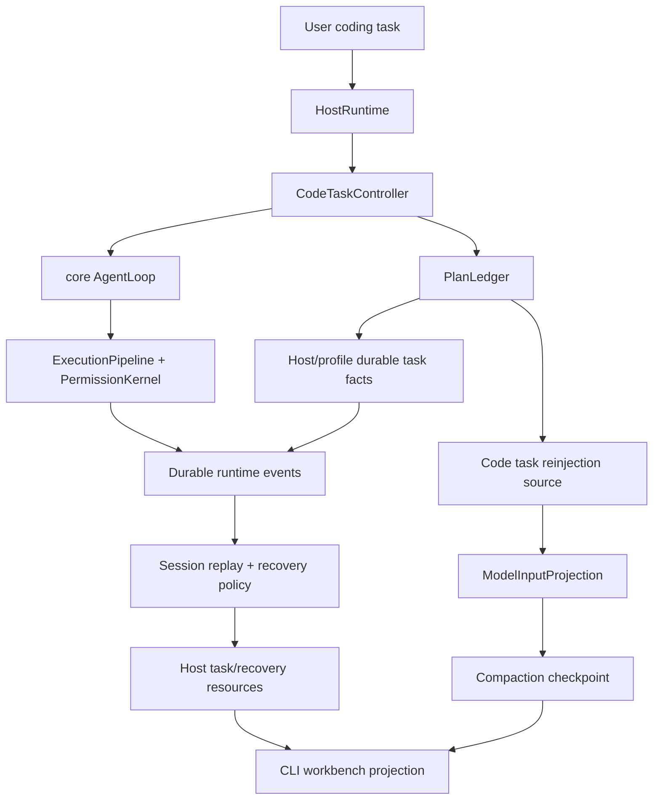

# Super-Long Code Task Runtime Hardening Plan

## Summary

This plan hardens the existing autonomous code-task loop for super-long programming work by turning plans into evidence-settled ledgers, adding a structured planner-to-ledger path, making recovery decisions explicit, preserving active task state through compaction/resume, and projecting that state through Host/CLI surfaces. It extends the current `CodeTaskController`, context projection, JSONL session store, Host protocol, and workbench reducers instead of introducing a separate long-task runtime.

---

## Problem Frame

`docs/research/super-long-task-agent-design-pi-claude-opencode.md` concludes that long programming tasks fail when progress, evidence, context, recovery, and verification live only in prompt text. Guga already has most of the substrate: `packages/profile-code-agent` owns the code-task controller and verification gate, `packages/core` owns durable events, projection, compaction, replay, and interruption detection, `packages/plugin-session-jsonl` owns append-only local persistence, and Host/CLI already project task and verification events.

The remaining gap is contract hardness. The current task plan is a summary plus files/checks/risks; it does not yet settle each item against durable evidence, the production planner path can still fall back to summary-only plans, Host task events currently project live state before proving durable replay, and recovery states are not yet shared as one contract.

---

## Requirements

- R1. Preserve the existing architecture boundary: `profile-code-agent` owns code-task semantics, `core` owns provider/tool/context/session contracts, JSONL stays a store plugin, and Host/CLI remain projections.
- R2. Replace loose task-plan completion with a `PlanLedger`-style settlement contract: plan items have stable IDs, status transitions, evidence references, changed files, verification references, risks, and blocker reasons.
- R3. Require `done` plan items and completed tasks to reference durable evidence, including passing required verification where code behavior changed.
- R4. Emit and persist task/plan/recovery/checkpoint facts through the durable `EventStore` lane, then project them into host resources so resume/replay can rebuild active task state without relying on `InMemoryRunStore`.
- R5. Implement the research recovery matrix as executable policy for overflow, tool pairing damage, pending permission, interrupted tools, compaction failure, JSONL tail/corruption, missing active plan, and rejected verification evidence.
- R6. Ensure compaction and post-compact reinjection preserve active objective, plan ledger progress, current blocker, changed files, verification failures, pending permission/tool state, and next step.
- R7. Expose a minimal host/CLI projection for long tasks: active objective, phase, plan completion, queued input, context pressure, latest checkpoint, pending permission/tool, verification status, blocked reason, and resume hint.
- R8. Keep branch/fork/subagent expansion out of this plan except for preserving existing session tree semantics and ensuring future branch summaries have enough ledger/checkpoint facts.
- R9. Planner stage output must have a structured path into `PlanLedger`; summary-only planner text must not be the only real path for long-task plans.
- R10. Recovery outcomes must have one shared contract consumed by replay/resume, Host resources, and CLI views.

---

## Assumptions

*This plan turns a research document into an implementation plan without a separate confirmation turn. The items below are planning-time inferences to scrutinize before execution.*

- The prior completed plan `docs/plans/2026-05-29-001-feat-autonomous-code-task-loop-plan.md` is treated as already implemented substrate, not as work to redo.
- The first implementation should stay single-agent and single-task within a session branch; subagent sidechains and rich server-push UI remain later work.
- The first `PlanLedger` can live inside `packages/profile-code-agent/src/task/` and only later be extracted if another profile needs the same ledger contract.
- CLI/host projection is the first user-facing target; local-server/SSE gets typed data through Host protocol but does not need a new dedicated UI panel in this plan.

---

## Scope Boundaries

- Do not create a parallel runtime loop outside `AgentLoop`, `ExecutionPipeline`, `ToolScheduler`, or `CodeTaskController`.
- Do not move code-agent-specific plan semantics into `packages/core`.
- Do not make compaction summary the source of truth; event log and task ledger facts remain authoritative.
- Do not implement full Claude Code swarm/team, OpenCode server workbench, or pi-style complete session tree UI.
- Do not add automatic git commit, push, destructive revert, or worktree isolation behavior.

### Deferred to Follow-Up Work

- Branch/fork/tree UX for comparing alternate long-task paths.
- Subagent sidechains for separate research/implementation/verification contexts.
- Rich local-server/SSE task panels beyond the typed Host protocol resources.
- Summary quality evaluation and LLM-based checkpoint auditing.
- Snapshot/revert UX for rolling back individual plan items.

---

## Context & Research

### Relevant Code and Patterns

- `packages/profile-code-agent/src/task/contracts.ts` already defines `CodeTask`, `CodeTaskPlan`, `VerificationAttempt`, terminal evidence, and validation.
- `packages/profile-code-agent/src/task/controller.ts` already runs scout/planner/executor/verifier/repairer stages and only completes after required verification passes.
- `packages/profile-code-agent/src/task/context-plugin.ts` already creates a high-priority `PlanTodo` reinjection source for active code-task state.
- `packages/core/src/contracts/context.ts` already defines `ModelInputProjection`, context source descriptors, compaction summary fields, `ReinjectionSource`, and projection ledger entries.
- `packages/core/src/context/compaction-service.ts` and `packages/core/src/context/reinjection-service.ts` already provide local compaction and reinjection mechanics.
- `packages/core/src/persistence/session-replay.ts` and `packages/core/src/persistence/interruption-detector.ts` already rebuild conversation/projection state and detect interrupted run/model/tool/permission/hook/compaction operations.
- `packages/plugin-session-jsonl/src/` already validates JSONL revision/hash-chain continuity and distinguishes recoverable tail diagnostics from blocking corruption.
- `packages/host-protocol/src/events.ts` and `packages/host-protocol/src/resources.ts` already expose task, verification, context, permission, queue, and run resources.
- `packages/cli/src/workbench/event-reducer.ts`, `packages/cli/src/workbench/state.ts`, and `packages/cli/src/workbench/views.ts` already render active task, context compaction, queue, permission, and verification state.

### Institutional Learnings

- `docs/brainstorms/2026-05-29-autonomous-code-task-loop-requirements.md` establishes that code-task workflow belongs in the profile/host layer and must not bypass runtime permissions.
- `docs/brainstorms/2026-05-27-m4-context-policy-plugins-requirements.md` establishes projection-first context, tool-result governance, reactive/proactive compaction, tool pairing safety, and post-compact reinjection.
- `docs/brainstorms/2026-05-27-m5-session-store-replay-plugins-requirements.md` establishes append-only events, durable session tree facts, replay without rerunning side effects, and conservative interruption recovery.
- `docs/research/super-long-task-agent-design-pi-claude-opencode.md` adds the super-long-task design target: explicit plan ledger, checkpoint, recovery matrix, and verification gate.

### External References

- No new external research is needed for this implementation plan. The referenced research document already followed the repository's 7-layer reference funnel for pi, Claude Code, and OpenCode.

---

## Key Technical Decisions

- Keep `PlanLedger` in `profile-code-agent` first: the ledger is code-task semantics and should not hard-code into core until multiple profiles need it.
- Represent evidence as references, not copied blobs: plan evidence should point to event IDs, tool result IDs, artifact IDs, diff summaries, verification attempt IDs, or user confirmation events.
- Treat settlement as a controller invariant: the model may propose progress, but controller validation decides whether a plan item is `verified` or `done`.
- Persist code-task ledger/recovery facts as host/profile-sourced `DurableEventEnvelope` records appended through the existing `EventStore`; do not add code-agent-specific variants to the core `AgentEvent` union.
- Add the first planner ingestion path as a profile-owned structured JSON block/schema parser. Tool-call planner output can come later, but the first implementation must prove natural planner text can produce ledger items.
- Define `RecoveryPolicyOutcome` in core persistence because replay/resume owns recovery classification; Host protocol mirrors the outcome for UI and command surfaces.
- Extend existing Host protocol task resources rather than inventing a second long-task protocol.
- Model recovery as policy over durable facts: overflow, corruption, interruption, permission pending, and verification rejection should produce explicit events/resources and conservative next actions.
- Keep CLI projection compact: show progress, pressure, checkpoint, blockers, and resume hints without trying to become a full task-management UI.

---

## Open Questions

### Resolved During Planning

- Should `PlanLedger` live in core or code profile? It should start in `packages/profile-code-agent` because it carries code-task semantics; core should only see generic context/event references.
- Are ledger/recovery facts core `AgentEvent`s or Host events? They should be host/profile-sourced durable envelopes with stable `eventType` values, appended to the same `EventStore`; Host events remain UI projection, not the source of truth.
- How does planner output become a ledger? The first pass should use a profile-owned structured planner schema/parser with explicit parse-failure behavior; later tool-call output can replace or supplement it.
- Where does recovery outcome live? Core persistence owns the canonical `RecoveryPolicyOutcome`; Host protocol and CLI only mirror/project it.
- Should branch/fork/tree be P0 for this hardening pass? No. Existing session branch semantics should be preserved, but richer branching belongs after ledger/recovery/checkpoint contracts are stable.
- Should the first host target be CLI or local-server/SSE? CLI/host-runtime projection is first. Host protocol resources should still be typed so SSE clients inherit the facts later.

### Deferred to Implementation

- Exact diff-summary evidence source: use the best existing git/tool result facts first; add a small summary shape only if current events cannot identify changed files reliably.
- How much JSONL diagnostic detail Host should expose: start with recoverable/blocking status and resume hint; expand only if CLI review shows operators need more.

---

## High-Level Technical Design

> *This illustrates the intended approach and is directional guidance for review, not implementation specification. The implementing agent should treat it as context, not code to reproduce.*

`PlanLedger` is the task-level truth for item settlement. Durable events are the system truth for what happened. `ModelInputProjection` is only what the model sees for a turn. Host/CLI state is a projection over task and runtime facts.

---

## Implementation Units

- U8. **Durable Task Fact Boundary And EventStore Bridge**

**Goal:** Make task, ledger, recovery, and checkpoint facts durable before Host/CLI projection depends on them.

**Requirements:** R1, R3, R4, R5, R10

**Dependencies:** None

**Files:**
- Modify: `packages/host-runtime/src/host-runtime.ts`
- Modify: `packages/host-runtime/src/host-runtime.test.ts`
- Modify: `packages/profile-code-agent/src/task/host-runtime.ts`
- Modify: `packages/profile-code-agent/src/task/host-runtime.test.ts`
- Modify: `packages/core/src/persistence/session-replay.ts`
- Test: `packages/plugin-session-jsonl/src/runtime-integration.test.ts`

**Approach:**
- Define the durable source-of-truth boundary: code-task facts are host/profile-sourced durable envelopes with code-task `eventType` values and JSON payloads, not new core `AgentEvent` variants.
- Add a HostRuntime append bridge that writes task/ledger/recovery/checkpoint facts to the runtime `EventStore` when available, while still updating `InMemoryRunStore` for live UI projection.
- Ensure idempotency keys prevent duplicate plan-item/evidence/verification facts when retries or resume repair re-emit events.
- Add replay helpers that can read these host/profile facts alongside core runtime events and reconstruct enough task state for resume and Host resource hydration.

**Execution note:** Build the append/replay walking path before adding more UI fields; otherwise the plan risks making in-memory projections look complete while resume still loses the task.

**Patterns to follow:**
- `DurableEventEnvelope` and `EventStore` in `packages/core/src/contracts/persistence.ts`
- HostRuntime's current task event handling in `packages/host-runtime/src/host-runtime.ts`
- JSONL idempotency and expected-revision behavior in `packages/plugin-session-jsonl/src/jsonl-event-store.ts`

**Test scenarios:**
- Happy path: a task-created fact and a plan-item fact append to JSONL and can be read back as durable envelopes.
- Edge case: re-emitting the same task fact with the same idempotency key returns an idempotent replay rather than a duplicate event.
- Error path: if no `EventStore` is configured, HostRuntime still updates live resources but marks the task resource as non-durable or lacking resume guarantees.
- Integration: a HostRuntime run writes task facts to JSONL and `resumeSessionFromStores()` can see them without reading `InMemoryRunStore`.

**Verification:**
- Runtime integration proves `InMemoryRunStore` is no longer the only place task/ledger facts live.

---

- U1. **PlanLedger Contract And Validation**

**Goal:** Add a structured plan-item ledger to the code-task contract and make settlement rules explicit.

**Requirements:** R1, R2, R3

**Dependencies:** U8

**Files:**
- Modify: `packages/profile-code-agent/src/task/contracts.ts`
- Modify: `packages/profile-code-agent/src/task/lifecycle.ts`
- Modify: `packages/profile-code-agent/src/task/stages.ts`
- Test: `packages/profile-code-agent/src/task/contracts.test.ts`
- Test: `packages/profile-code-agent/src/task/lifecycle.test.ts`
- Test: `packages/profile-code-agent/src/task/stages.test.ts`

**Approach:**
- Extend `CodeTaskPlan` with stable ledger items while preserving the existing `summary`, `files`, `checks`, `assumptions`, and `risks` fields for compatibility.
- Add allowed item statuses matching the research contract: pending, in-progress, evidence-submitted, verified, done, blocked.
- Add validation that prevents direct in-progress-to-done settlement and rejects done items without acceptable evidence.
- Keep ledger transitions profile-owned; core sees the resulting task/context facts only through existing event and projection mechanisms.

**Execution note:** Implement contract and lifecycle validation test-first because these invariants will protect later units from accepting model-prose completion.

**Patterns to follow:**
- `validateCodeTask()` terminal-state validation in `packages/profile-code-agent/src/task/contracts.ts`
- `transitionCodeTask()` invariant enforcement in `packages/profile-code-agent/src/task/lifecycle.ts`

**Test scenarios:**
- Happy path: a plan item moves pending -> in-progress -> evidence-submitted -> verified -> done with a verification attempt reference, and task validation accepts it.
- Edge case: a non-code documentation item can be verified with a durable user/tool/artifact evidence reference and a written residual-risk note when no command applies.
- Error path: a plan item marked done without evidence returns a validation issue naming the missing evidence.
- Error path: a direct in-progress -> done transition is rejected by lifecycle validation.
- Error path: changed files listed on an item without event/tool/diff provenance are rejected or left non-done.
- Integration: existing tasks without ledger items still validate when they are not completed, so old task fixtures do not break before migration logic runs.

**Verification:**
- Contract tests prove item settlement cannot be faked by model text.
- Existing task lifecycle tests continue to pass with old and new plan shapes.

---

- U9. **Structured Planner Output Intake**

**Goal:** Give the real planner path a structured way to produce ledger items instead of relying on summary-only `finalAnswer` fallback.

**Requirements:** R2, R3, R9

**Dependencies:** U1

**Files:**
- Modify: `packages/profile-code-agent/src/task/stages.ts`
- Modify: `packages/profile-code-agent/src/task/host-runtime.ts`
- Modify: `packages/profile-code-agent/src/task/host-runtime.test.ts`
- Create: `packages/profile-code-agent/src/task/planner-output.ts`
- Test: `packages/profile-code-agent/src/task/planner-output.test.ts`
- Test: `packages/profile-code-agent/src/task/stages.test.ts`

**Approach:**
- Define a profile-owned planner output schema that can express plan summary, ledger items, files, checks, assumptions, and risks.
- Update planner stage prompt to request that structured block and explain that summary-only output is insufficient for long-task execution.
- Parse planner `finalAnswer` into `CodeTaskPlan` and ledger items when `result.plan` is not supplied by a test/runtime adapter.
- On parse failure, record a planner-output error and either retry/repair the planner stage within budget or block before execution begins.

**Patterns to follow:**
- Existing `buildCodeTaskStagePrompt()` role contracts in `packages/profile-code-agent/src/task/stages.ts`
- Existing Host stage runner fallback in `packages/profile-code-agent/src/task/host-runtime.ts`

**Test scenarios:**
- Happy path: a realistic planner final answer containing the structured block creates ledger items with stable IDs, checks, files, and risks.
- Edge case: extra prose before/after the structured block is ignored while the block still parses.
- Error path: malformed structured output produces a recoverable planner-output error and does not execute with a summary-only plan.
- Error path: planner output with duplicate item IDs is rejected.
- Integration: `createCodeTaskHostRuntime()` can take natural planner output and pass a ledger-bearing plan into the controller.

**Verification:**
- Host-runtime tests prove the production planner path can create ledger items without a mocked `result.plan`.

---

- U2. **Controller Settlement And Verification Gate Integration**

**Goal:** Make `CodeTaskController` settle ledger items through evidence and verification attempts during execution, repair, and completion.

**Requirements:** R2, R3, R5

**Dependencies:** U1, U9

**Files:**
- Modify: `packages/profile-code-agent/src/task/controller.ts`
- Modify: `packages/profile-code-agent/src/task/verification-runner.ts`
- Modify: `packages/profile-code-agent/src/task/verification-summary.ts`
- Test: `packages/profile-code-agent/src/task/controller.test.ts`
- Test: `packages/profile-code-agent/src/task/verification-runner.test.ts`
- Test: `packages/profile-code-agent/src/task/verification-summary.test.ts`

**Approach:**
- Treat planner output as proposed ledger content, then have the controller own settlement transitions.
- When verification passes, map passing required attempts to relevant ledger items and task completion evidence.
- When verification fails or evidence is insufficient, return affected items to in-progress or blocked instead of completing the task.
- Preserve the current repair-loop behavior and repair budget, but make rejected evidence a first-class repair input.

**Patterns to follow:**
- Current `verifyOrRepair()` flow in `packages/profile-code-agent/src/task/controller.ts`
- Existing `VerificationAttempt` summary/truncation behavior

**Test scenarios:**
- Happy path: a task with two ledger items completes only after both items have accepted evidence and at least one required verification attempt passes.
- Edge case: optional checks can enrich item evidence but cannot satisfy required verification when a required check exists.
- Error path: verification failure records rejected evidence and routes the task into repair.
- Error path: repair budget exhaustion leaves the task blocked with ledger items showing the failed evidence.
- Integration: `RuntimeToolInvoker` remains the only path for verification commands, so permission/result-budget metadata stays present.

**Verification:**
- Controller tests prove task completion still depends on passing required verification and now also depends on ledger settlement.

---

- U10. **Recovery Policy Outcome Contract**

**Goal:** Define one recovery outcome contract before Host resources, replay policy, and CLI views start projecting recovery hints.

**Requirements:** R5, R7, R10

**Dependencies:** U8

**Files:**
- Modify: `packages/core/src/persistence/resume-report.ts`
- Modify: `packages/core/src/persistence/interruption-detector.ts`
- Modify: `packages/core/src/persistence/session-replay.ts`
- Modify: `packages/core/src/persistence/session-replay.test.ts`
- Modify: `packages/host-protocol/src/resources.ts`
- Modify: `packages/host-protocol/src/events.ts`
- Modify: `packages/host-protocol/src/events.test.ts`

**Approach:**
- Add a canonical recovery outcome shape in core persistence with action categories such as auto-retry, compact-and-retry, wait-for-user, repair, fork, truncate, blocked, and read-only-diagnostics.
- Map existing `ResumeInterruptedOperation` and store corruption diagnostics into this outcome instead of leaving only low-level `allowedActions`.
- Mirror the outcome into Host protocol resources/events as a projection, not as the authority.
- Require every recovery hint shown in Host/CLI to cite the durable event or diagnostic that caused it.

**Patterns to follow:**
- `ResumeInterruptedOperation` in `packages/core/src/persistence/resume-report.ts`
- Existing recoverable/non-recoverable store diagnostics in `packages/core/src/contracts/persistence.ts`

**Test scenarios:**
- Happy path: completed sessions produce no recovery outcome beyond normal resumable status.
- Error path: pending permission maps to wait-for-user with the permission event reference.
- Error path: interrupted tool maps to repair or fork, not auto-rerun.
- Error path: partial tail maps to recoverable warning; hash-chain mismatch maps to blocked/read-only-diagnostics.
- Integration: Host protocol resource contains the same outcome category and source reference as core replay.

**Verification:**
- Recovery semantics are defined once and consumed consistently by replay, Host, and CLI units.

---

- U3. **Durable Task And Recovery Event Projection**

**Goal:** Persist and project plan ledger, recovery, and checkpoint-relevant task facts through existing event and Host resource lanes.

**Requirements:** R4, R5, R7

**Dependencies:** U8, U1, U2, U10

**Files:**
- Modify: `packages/host-protocol/src/events.ts`
- Modify: `packages/host-protocol/src/resources.ts`
- Modify: `packages/host-protocol/src/events.test.ts`
- Modify: `packages/profile-code-agent/src/task/host-runtime.ts`
- Modify: `packages/profile-code-agent/src/task/host-runtime.test.ts`
- Modify: `packages/host-runtime/src/host-runtime.ts`
- Modify: `packages/host-runtime/src/host-runtime.test.ts`
- Modify: `packages/host-runtime/src/event-projector.ts`
- Modify: `packages/host-runtime/src/event-projector.test.ts`

**Approach:**
- Extend code-task resources to include ledger item counts, current blocked item, latest evidence summary, and latest recovery hint.
- Emit typed host events when plan items are proposed, evidence is submitted, evidence is verified/rejected, and recovery state changes, but treat those Host events as UI/resource projection over U8 durable facts.
- Keep event payloads bounded; detailed evidence should be referenced through IDs and summaries.
- Preserve existing `task.created`, `task.phase_changed`, `verification.*`, and terminal event behavior for current consumers.

**Patterns to follow:**
- Existing task and verification resources in `packages/host-protocol/src/resources.ts`
- Existing `applyEventEffects()` and task storage paths in `packages/host-runtime/src/host-runtime.ts`

**Test scenarios:**
- Happy path: emitted ledger events update `getTask()` and `listSessionTasks()` resources with completion counts and latest verification.
- Edge case: legacy task events without ledger data still project to valid resources.
- Error path: rejected evidence produces a visible recovery hint without marking the run failed.
- Integration: host event sequence remains monotonic when task, verification, context, and permission events interleave.

**Verification:**
- Host protocol and runtime tests prove the CLI/server-facing resource model can reconstruct long-task status without reading assistant prose.

---

- U11. **Durable Walking-Skeleton Integration**

**Goal:** Prove the fact chain works before recovery, compaction, and CLI polish build on top of it.

**Requirements:** R3, R4, R5, R7, R10

**Dependencies:** U8, U1, U9, U2, U10, U3

**Files:**
- Test: `packages/host-runtime/src/host-runtime.test.ts`
- Test: `packages/profile-code-agent/src/task/host-runtime.test.ts`
- Test: `packages/plugin-session-jsonl/src/runtime-integration.test.ts`
- Test: `packages/core/src/persistence/session-replay.test.ts`

**Approach:**
- Add a minimal end-to-end fixture that creates one ledger item from planner output, appends the durable task/plan facts, records verification evidence, replays from the durable store, and projects the task resource.
- Keep the fixture intentionally small so it can run early and fail fast when the source-of-truth chain breaks.
- Use this test to validate that later units are adding policy/UI behavior on top of durable facts, not on top of in-memory-only state.

**Patterns to follow:**
- Existing host runtime natural code-task test in `packages/host-runtime/src/host-runtime.test.ts`
- Existing JSONL runtime integration test in `packages/plugin-session-jsonl/src/runtime-integration.test.ts`

**Test scenarios:**
- Integration: planner structured output creates a ledger item, HostRuntime persists it, replay rebuilds it, and Host task resource shows the item as pending.
- Integration: verification evidence updates the ledger item, persists a durable fact, and replay projects the item as verified/done.
- Error path: disabling the EventStore keeps live task projection working but the walking-skeleton marks resume/replay durability as unavailable.

**Verification:**
- A single walking-skeleton test proves task -> ledger -> durable event -> replay -> Host resource before advanced recovery behavior lands.

---

- U4. **Recovery Matrix Policy**

**Goal:** Encode the research recovery matrix into reusable policy and attach it to resume/replay and code-task continuation decisions.

**Requirements:** R4, R5, R8, R10

**Dependencies:** U10, U11

**Files:**
- Modify: `packages/core/src/persistence/resume-report.ts`
- Modify: `packages/core/src/persistence/interruption-detector.ts`
- Modify: `packages/core/src/persistence/session-replay.ts`
- Modify: `packages/core/src/persistence/session-replay.test.ts`
- Modify: `packages/host-protocol/src/resources.ts`
- Modify: `packages/host-runtime/src/host-runtime.ts`
- Modify: `packages/plugin-session-jsonl/src/jsonl-event-store.test.ts`
- Modify: `packages/plugin-session-jsonl/src/jsonl-session-store.test.ts`
- Modify: `packages/profile-code-agent/src/task/controller.ts`
- Test: `packages/profile-code-agent/src/task/controller.test.ts`

**Approach:**
- Classify resume/recovery conditions into the shared `RecoveryPolicyOutcome` categories from U10.
- Reuse existing diagnostics for partial JSONL tail versus middle corruption/hash-chain mismatch.
- Keep provider overflow and compaction failure handling aligned with existing context events; this unit should expose policy outcomes rather than rebuild compaction.
- Feed recovery outcomes back to task state so missing active plan, permission pending, interrupted tool, or rejected evidence cannot silently proceed as normal execution.

**Patterns to follow:**
- `ResumeInterruptedOperation` and allowed actions in `packages/core/src/persistence/resume-report.ts`
- Corruption diagnostic behavior in `packages/plugin-session-jsonl/src/jsonl-corruption.ts`
- Current session replay blocking behavior for non-recoverable corruption

**Test scenarios:**
- Happy path: recoverable partial JSONL tail resumes from the last complete event and surfaces a warning.
- Error path: hash-chain mismatch blocks automatic continuation and returns a repair-required status.
- Error path: pending permission resumes as wait-for-user and does not synthesize a tool result.
- Error path: interrupted tool execution preserves captured metadata and requires repair or user decision.
- Error path: compact failure does not adopt a half summary and surfaces blocked/retry guidance.
- Integration: missing active plan after resume attempts reconstruction from task events/checkpoints before blocking.

**Verification:**
- Replay and JSONL tests cover each recovery-matrix row with explicit expected policy outcomes.

---

- U5. **Checkpoint And Reinjection Enrichment**

**Goal:** Ensure compaction checkpoints and post-compact reinjection carry enough active task state for super-long work to continue safely.

**Requirements:** R4, R6

**Dependencies:** U1, U3, U11

**Files:**
- Modify: `packages/profile-code-agent/src/task/context-plugin.ts`
- Modify: `packages/profile-code-agent/src/task/context-plugin.test.ts`
- Modify: `packages/core/src/context/compaction-summary.ts`
- Modify: `packages/core/src/context/compaction-service.ts`
- Modify: `packages/core/src/context/reinjection-service.ts`
- Test: `packages/core/src/context/compaction-service.test.ts`
- Test: `packages/core/src/context/reinjection-service.test.ts`
- Test: `packages/core/src/context/model-input-projection.test.ts`

**Approach:**
- Enrich code-task reinjection content with ledger progress, current item, accepted/rejected evidence, changed files, failed verification, blocker, and next step.
- Ensure compaction summaries can carry active objective, completed work, current blockers, next steps, key files, tool result references, and user constraints from task sources.
- Preserve stale runtime-context rejection in `ReinjectionService` so old task state cannot leak after session replacement.
- Keep summary content bounded and source-linked; do not inline raw tool outputs.

**Patterns to follow:**
- `createCodeTaskReinjectionSource()` and `renderCodeTaskContext()`
- `ContextSourceKind.PlanTodo` and high-priority source descriptors
- Current local skeleton summary behavior

**Test scenarios:**
- Happy path: active ledger state appears as a high-priority `PlanTodo` reinjection source after compaction.
- Edge case: blocked tasks render blocker and needed next action instead of a generic next step.
- Error path: stale runtime context produces a non-visible rejected descriptor.
- Integration: model input projection contains active task source, compacted summary, recent tail, and active tool descriptors without breaking tool pairing.

**Verification:**
- Context tests prove compaction does not drop the plan ledger or verification failure needed for repair.

---

- U6. **CLI Workbench Long-Task Projection**

**Goal:** Make the minimal host/CLI projection from the research document visible and testable.

**Requirements:** R7

**Dependencies:** U3, U5, U10

**Files:**
- Modify: `packages/cli/src/workbench/state.ts`
- Modify: `packages/cli/src/workbench/event-reducer.ts`
- Modify: `packages/cli/src/workbench/views.ts`
- Modify: `packages/cli/src/workbench/commands.ts`
- Test: `packages/cli/src/workbench/event-reducer.test.ts`
- Test: `packages/cli/src/workbench/views.test.ts`
- Test: `packages/cli/src/workbench/commands.test.ts`
- Test: `packages/cli/src/ink-workbench/app.test.tsx`

**Approach:**
- Extend `ActiveTaskProjection` and status-bar view model with plan completion, latest checkpoint/context boundary, current blocker, pending permission/tool, and resume hint.
- Improve `/tasks` formatting so a long task can be inspected without reading the transcript.
- Keep UI dense and operational; no new landing page, marketing copy, or large task dashboard.
- Render unknown context/cost/checkpoint states explicitly rather than fabricating values.

**Patterns to follow:**
- Existing active task and verification handling in `packages/cli/src/workbench/event-reducer.ts`
- Existing status and task command formatting in `packages/cli/src/workbench/views.ts` and `packages/cli/src/workbench/commands.ts`

**Test scenarios:**
- Happy path: task events show active phase, ledger completion, last verification, and queue status in status/view models.
- Edge case: context checkpoint exists without cost data; UI shows checkpoint and keeps cost unknown.
- Error path: blocked task shows blocker and resume hint.
- Integration: `/tasks` lists multiple session tasks with ledger progress and latest verification without needing active run state.

**Verification:**
- Workbench reducer/view tests prove Host events are enough to present long-task state.

---

- U7. **Docs, Compatibility, And End-To-End Coverage**

**Goal:** Document the long-task contract and add cross-package tests that prove the integrated path works.

**Requirements:** R1, R4, R5, R6, R7

**Dependencies:** U8, U1, U9, U2, U10, U3, U11, U4, U5, U6

**Files:**
- Modify: `packages/profile-code-agent/README.md`
- Modify: `packages/core/README.md`
- Modify: `packages/plugin-session-jsonl/README.md`
- Modify: `packages/host-runtime/README.md`
- Modify: `packages/cli/README.md`
- Test: `packages/profile-code-agent/src/task/host-runtime.test.ts`
- Test: `packages/plugin-session-jsonl/src/runtime-integration.test.ts`
- Test: `packages/host-runtime/src/host-runtime.test.ts`
- Test: `packages/cli/src/workbench/event-reducer.test.ts`

**Approach:**
- Update package READMEs to describe ownership boundaries, not implementation internals.
- Add an integration fixture that starts a code task, creates ledger items, verifies them, compacts/reinjects state, and resumes from durable/session facts.
- Keep tests package-local where possible; only add cross-package smoke coverage for the full long-task path.
- Document remaining follow-up work for branch summaries, sidechains, and richer UI.

**Patterns to follow:**
- Existing README boundary sections in `packages/core/README.md` and `packages/profile-code-agent/README.md`
- Existing runtime integration test style in `packages/plugin-session-jsonl/src/runtime-integration.test.ts`

**Test scenarios:**
- Integration: a long code task with ledger items passes through host runtime and appears in CLI resource/view state.
- Integration: compaction followed by reinjection preserves active plan item and failed verification evidence.
- Integration: resume after recoverable tail warns but continues; resume after blocking corruption refuses continuation.
- Compatibility: public exports remain stable for existing task, host-protocol, and core consumers.

**Verification:**
- Package-local tests cover the new behavior, and documentation reflects the final boundaries.

---

## System-Wide Impact

- **Interaction graph:** User prompt enters HostRuntime, code-task runtime classifies it, `CodeTaskController` orchestrates stage runs through core runtime, durable events/reinjection feed context projection, Host/CLI render typed resources.
- **Error propagation:** Provider/tool/permission/context/store failures become recovery policy outcomes before they become task terminal states.
- **State lifecycle risks:** Ledger and Host resource projections must not diverge; event log remains truth, task resource remains projection, model input remains temporary projection.
- **API surface parity:** Host protocol, CLI commands, and code-task README must all describe the same task and verification semantics.
- **Integration coverage:** Unit tests alone are not enough; at least one cross-package path must prove task -> verification -> compaction/reinjection -> host projection.
- **Unchanged invariants:** Core remains provider-neutral; tool execution remains permission-gated; JSONL remains append-only; completion still requires passing required verification.

---

## Risks & Dependencies

| Risk | Mitigation |
|------|------------|
| Ledger shape becomes too code-agent-specific for future profiles | Keep it in `profile-code-agent` first and expose only generic references through core context descriptors. |
| Host protocol grows noisy with too many item-level events | Emit bounded summaries for UI resources and keep detailed evidence as referenced durable facts. |
| Compaction summary starts acting like truth | Validation and resume must always rebuild from ledger/events first, then use summary only as projection input. |
| Recovery matrix over-blocks tasks that could continue | Classify outcomes conservatively but include allowed actions and resume hints so host/user can choose repair or fork. |
| Existing completed-plan tests break from stricter validation | Preserve compatibility for old non-terminal plan shapes and add migration-safe defaults. |
| CLI status becomes cluttered | Keep status line compact and put detailed ledger inspection behind `/tasks`. |
| Durable and live projections diverge | Add the U11 walking-skeleton before advanced recovery/CLI work and make Host resources hydrate from durable facts when available. |
| Structured planner output is brittle | Keep the first schema small, test realistic prose-wrapped output, and block before execution when parsing fails. |

---

## Documentation / Operational Notes

- Update docs to state that super-long-task support is a hardening pass over `docs/plans/2026-05-29-001-feat-autonomous-code-task-loop-plan.md`, not a replacement.
- Document the `PlanLedger` settlement contract in `packages/profile-code-agent/README.md` at a product-boundary level.
- Document that task ledger/recovery facts are host/profile-sourced durable envelopes, while Host events are UI/resource projections.
- Document the planner structured output contract and parse-failure behavior.
- Document JSONL recovery expectations in `packages/plugin-session-jsonl/README.md`: recoverable tail can continue; blocking corruption requires repair/truncation/user decision.
- Document CLI/operator expectations: `/tasks` and status bar are the first inspection surfaces for long tasks.

---

## Sources & References

- **Origin research:** `docs/research/super-long-task-agent-design-pi-claude-opencode.md`
- Related requirements: `docs/brainstorms/2026-05-29-autonomous-code-task-loop-requirements.md`
- Related context requirements: `docs/brainstorms/2026-05-27-m4-context-policy-plugins-requirements.md`
- Related session requirements: `docs/brainstorms/2026-05-27-m5-session-store-replay-plugins-requirements.md`
- Prior implementation plan: `docs/plans/2026-05-29-001-feat-autonomous-code-task-loop-plan.md`
- Related code: `packages/profile-code-agent/src/task/contracts.ts`
- Related code: `packages/profile-code-agent/src/task/controller.ts`
- Related code: `packages/profile-code-agent/src/task/context-plugin.ts`
- Related code: `packages/core/src/context/model-input-projection.ts`
- Related code: `packages/core/src/persistence/session-replay.ts`
- Related code: `packages/plugin-session-jsonl/src/jsonl-event-store.ts`
- Related code: `packages/host-protocol/src/resources.ts`
- Related code: `packages/host-runtime/src/host-runtime.ts`
- Related code: `packages/cli/src/workbench/event-reducer.ts`
