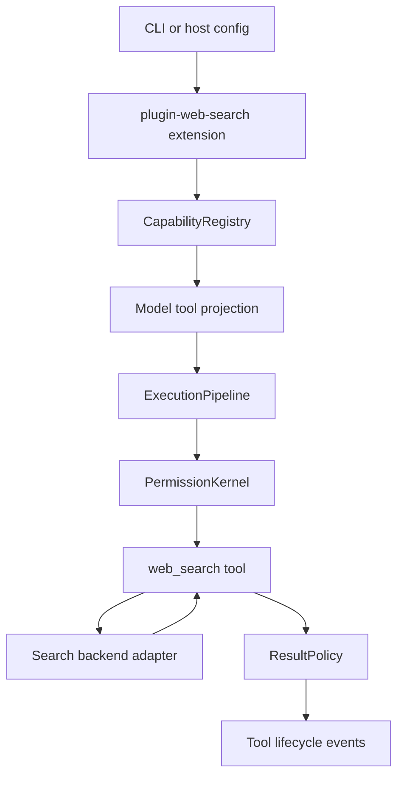

# feat: 添加 web search 能力

## 摘要

为 Guga 增加一个 first-party optional web search extension。实现上创建 `@guga-agent/plugin-web-search`，通过现有 extension 与 tool runtime 路径注册一个模型可见的 `web_search` 工具，并把搜索 backend 做成可替换适配器，避免 Brave、Exa、mock backend 或未来 provider-hosted search 的细节泄漏到工具契约里。

---

## 问题背景

Guga 已经具备工具运行所需的 runtime authority：能力注册、hook gate、权限、调度、结果预算、durable events 和 provider projection。Web search 补齐的是外部知识检索能力，但它会把用户或模型生成的 query 发给第三方网络服务，也可能返回大量或过期内容。因此本计划把 web search 作为可选 extension，而不是 core built-in。

---

## 需求

- R1. 提供模型可见的 `web_search` 工具，用于互联网搜索发现。
- R2. 返回结构化、可溯源的搜索结果，包含 query、provider、title、URL、snippet、rank、fetched timestamp，以及可选 published timestamp 或 metadata。
- R3. 支持有边界的搜索参数：`maxResults`、`allowedDomains`、`blockedDomains`，以及可选 `recencyDays`、`searchType`、`contextMaxCharacters`。
- R4. 搜索 backend 必须可替换。MVP 必须支持 mock/injected backend；真实 backend 优先 Brave 或 Exa。
- R5. 当 credential 缺失或 host policy 禁用 web search 时，工具必须从 model projection 中隐藏，或在被直接调用时返回明确的 unavailable result。
- R6. 将搜索视为外部网络访问。默认权限应为 ask；trusted session 可配置 allow；headless/background profile 默认 deny。
- R7. 每次执行都必须经过 Guga 的 schema validation、permission resolution、timeout/abort handling、result budgeting 和 tool lifecycle events。
- R8. 搜索输出必须遵守配置的 result budget，并保留足够的 URL/source metadata 以支持审计和后续引用。
- R9. 测试必须 hermetic，不依赖真实搜索服务、真实 API key 或实时网络可用性。
- R10. 文档必须说明何时使用 `web_search`、如何配置 provider 和权限，以及该 MVP 与未来 `web_fetch`、provider-hosted search 的关系。

**Origin actors:** A1 用户；A2 模型/agent；A3 Guga runtime；A4 extension 作者；A5 search provider/backend；A6 CLI/host。

**Origin flows:** F1 用户请求最新信息；F2 模型调用 `web_search`；F3 runtime 进行权限与 availability 判断；F4 backend 搜索并返回结构化结果；F5 结果预算化后回流给模型。

**Origin acceptance examples:** AE1 有 mock backend 时完成搜索；AE2 缺 API key 时工具不可见；AE3 权限 deny 时返回 model-visible observation；AE4 超长搜索结果被预算化；AE5 abort/timeout 不产生 orphan tool result。

---

## 范围边界

- MVP 只实现“搜索发现”，不实现完整浏览器控制、页面截图、登录态浏览或任意页面抽取。
- MVP 不把公共搜索结果 HTML scraping 作为默认 backend。
- MVP 不把 web search 加入 `packages/core/src/builtins`；它是可选生态能力。
- MVP 不依赖特定模型 provider 的 hosted web search 功能。
- MVP 不承诺 provider-hosted citations 与 Guga 自有 source metadata 完全等价。

### 延后到后续工作

- `web_fetch`：在单独 PR 中按指定 URL 抓取页面，执行 URL/IP 安全限制，转换 HTML 为 markdown/text，并应用更适合 fetch 的结果预算。
- Provider-hosted search：在 provider bridge surface 准备好后，把 OpenAI、Anthropic、Gemini 或 AI SDK hosted search 接成可选 backend。
- MCP/skill bridge：允许用户通过 MCP 或 skills 增加 Brave、Exa、Tavily、企业搜索或本地搜索，而不改变 first-party MVP 契约。
- Browser tooling：单独规划，因为它需要不同的权限模型、sandbox surface、UI affordance 和 authenticated-session 方案。

---

## 上下文与研究

### 相关代码与模式

- `packages/extension-sdk/src/index.ts` 提供 `defineExtension()` 和 extension-owned tool registration，是 first-party optional capability 的合适入口。
- `packages/plugin-tools-delegation/src/delegate-task-tool.ts` 是本地最接近的模式：external-effect first-party plugin tool，包含 `defaultAction: "ask"`、headless/background deny、serial scheduler metadata、result budget、renderer metadata、backend metadata、availability 和 model visibility。
- `packages/core/src/contracts/tools.ts` 定义 `ToolDefinition`、`ToolResult` 和适合网络能力的 `external` tool effect。
- `packages/core/src/contracts/tool-runtime.ts` 已经建模 availability、visibility、backend requirement、scheduler metadata、renderer category `search`、result budget 和 permission profile。
- `packages/core/src/tools/execution-pipeline.ts` 已经处理 validation 之前的 availability check、hook phases、permission resolution、abort/timeout execution、result policy application 和 durable lifecycle events。
- `packages/core/src/tools/tool-scheduler.ts` 会把 interactive execution 或 `defaultAction: "ask"` 的工具串行化，因此 MVP 可以不新增 scheduler 行为。
- `packages/core/src/tools/result-policy.ts` 会把超预算结果保存为 reference 或截断 preview，并发出 `ToolResultBudgeted`。
- `packages/cli/src/config.ts` 和 `packages/cli/src/host-factory.ts` 是从 CLI 配置启用可选插件的预期 host-side integration points。

### 机构内学习

- `docs/solutions/architecture-patterns/extension-spec-built-in-core-capabilities.md` 指出 built-ins 和 extensions 共用同一个 `CapabilityRegistry` 与 execution pipeline，而可选生态集成应放在 extensions 中。
- `docs/solutions/architecture-patterns/tool-permission-runtime.md` 强调工具不应绕过 runtime authority 自己实现 permission、timeout、output 或 hook logic。
- `docs/solutions/architecture-patterns/plugin-capability-discovery.md` 把 capability discovery 视为 runtime-visible surface，因此 web search 的 availability 和 missing-backend 状态需要成为一等概念。
- `docs/solutions/architecture-patterns/provider-ai-sdk-bridge.md` 将 provider transport concerns 与 Guga tool contract 分离，支持先做 provider-neutral web search tool。

### 外部参考

- OpenCode 将 `websearch` 与 `webfetch` 分离，同时有 provider-specific web search adapters，并围绕这些工具写了测试。
- Claude Code 使用带 backend adapters 的 `WebSearchTool`，支持 API、Bing、Brave、Exa，同时保持统一 result shape 和 UI/progress layer。
- Pi focused context 展示的是 `skill:brave-search` 与 custom `ToolDefinition` registration，而不是 core first-class web search tool，这支持 extension-first 的落点。

---

## 项目对比

| 项目 | 设计 | Guga 借鉴 | 证据 |
|---|---|---|---|
| Pi | Core focused context 未显示 built-in web search tool；它展示 `skill:brave-search` 和 custom `ToolDefinition` registration。 | 保持 extension-first，并把 skill/MCP search 留作未来生态路径。 | Fact: `docs/research/repomix/pi-focused-context.xml`；Inference: focused context 中未发现 first-class core web search。 |
| OpenCode | Native search 与 fetch 分离，同时 provider-side hosted search 是单独的集成路径。 | 先构建 `web_search`，延后 `web_fetch`，避免将契约绑定到 hosted search。 | Fact: `docs/research/repomix/opencode-context.1.xml`；Graphify 命中 `websearch.ts`、`webfetch.ts` 和 provider `web-search.ts`。 |
| Claude Code | `WebSearchTool` 使用 provider adapters 和统一 result/options types。 | 使用 backend adapter interface，并在结果进入模型前完成 normalization。 | Fact: `docs/research/repomix/claude-code-focused-context.xml` 包含 `WebSearchTool/adapters/*` 和工具文档。 |

---

## 关键技术决策

- 将 MVP 实现为 `packages/plugin-web-search`，而不是 core built-in。这符合 Guga 的 extension boundary，也避免把外部网络 credential 和 provider 行为放大到 core runtime。
- MVP 只暴露一个名为 `web_search` 的工具。Search 负责发现候选来源；URL fetching 和页面抽取作为 follow-up，从而让 MVP 的权限与 SSRF 风险保持可控。
- 工具使用 `effect: "external"`，runtime permission 默认 ask。Query 会离开本地 workspace，因此把它当作普通 read-only 会低估隐私风险。
- 使用 provider-neutral backend adapter boundary。工具负责 validation、permission metadata、result formatting 和 runtime integration；backend 负责 request construction 和 provider-specific normalization。
- 包入口使用 `@guga-agent/extension-sdk`。插件仍可向 host 返回普通 `LocalPlugin`，但 extension SDK 能保证 ownership、source 和 lifecycle metadata 与 extension spec 保持一致。
- 仅在 extension 启用且 backend availability 满足时注册工具。Credential 缺失时，默认应从 model projection 中移除 `web_search`，而不是让模型看到一个必然失败的工具。
- MVP 调度保持 serial。当前 scheduler 已经会将 ask permission 或显式 serial metadata 的工具串行化；parallel external search 等首个 provider 安全落地后再考虑。
- 首个真实 backend 可优先 Brave，但实施时需要确认依赖体积和 API surface 足够小。Exa 适合作为 deep/context search 的可选 backend，但 provider 选择不应改变工具契约。

---

## 替代方案

- Core built-in `web_search`：不采用。外部网络集成属于 Guga 的可选生态能力，把 credential/provider behavior 放进 core 会不必要地扩大 kernel surface。
- 只做 hosted provider search：不作为 MVP 基础。模型 provider hosted search 会把行为、citation、成本和 availability 绑定到所选模型 provider；它适合作为未来 backend。
- 只做 Skill/MCP search：不作为首个交付。用户要的是具备权限、availability、audit 和 hermetic tests 的 first-class web search 能力；skills 和 MCP 仍是有价值的扩展路径。

---

## 开放问题

### 规划阶段已解决

- `web_fetch` 是否属于 MVP？不属于。它被 defer，因为任意 URL retrieval 会引入 SSRF/private-network/content-type 风险，超出 search discovery 的边界。
- Web search 是否应该是 core built-in？不应该。现有架构指导将可选生态集成放在 core 之外。
- Hosted provider search 是否应该是唯一实现？不应该。它未来可以成为 backend，但 MVP 应保持 Guga tool contract provider-neutral。

### 延后到实施阶段

- 默认 provider：实施时在确认 package footprint、API ergonomics、价格假设和 key 可用性后，在 Brave 或 Exa 之间最终选择。
- CLI config schema 的最终字段名：计划形态保持 `webSearch.enabled`、`webSearch.provider`、permission default，但最终命名应贴合当前 config parser convention。
- 结果 renderer 文案：实现 `format-result` 时再确定简洁的 model-facing wording，并验证预算行为。

---

## 输出结构

下列 tree 表示预期输出形态。它是方向性的 scope guidance；如果实施时发现本地约定有更好的文件布局，可以调整文件名。

```text
packages/plugin-web-search/
  package.json
  tsconfig.json
  README.md
  src/
    index.ts
    types.ts
    web-search-plugin.ts
    web-search-tool.ts
    input-schema.ts
    domain-policy.ts
    format-result.ts
    backends/
      mock-backend.ts
      brave-backend.ts
    dependency-boundary.test.ts
    web-search-plugin.test.ts
    web-search-tool.test.ts
    domain-policy.test.ts
    format-result.test.ts
    backends/
      mock-backend.test.ts
      brave-backend.test.ts
```

---

## 高层技术设计

> *本节展示预期实现形态，用于 review 时理解方向，不是实现规范。实施 agent 应把它当作上下文，而不是要逐字复刻的代码。*



契约形态：

| Surface | 责任 |
|---|---|
| `createWebSearchPlugin` | 拥有 extension metadata，并在启用时注册 `web_search`。 |
| `createWebSearchTool` | 拥有 tool name、description、schema、runtime metadata、validation handoff、backend invocation 和 result formatting。 |
| `WebSearchBackend` | 报告 availability，并将 provider-specific response 转换为 normalized search result items。 |
| `domain-policy` | 在返回结果前一致地应用 allowed/blocked domain filters。 |
| `format-result` | 生成紧凑的 model-facing content，同时为 audit 保留 provider/query/source metadata。 |

---

## 实施单元

- U1. **Package scaffold 与公开契约**

**目标:** 创建 first-party plugin package 和 public exports，暂不加入 provider-specific behavior。

**需求:** R1, R4, R7, R9.

**依赖:** None.

**Files:**
- Create: `packages/plugin-web-search/package.json`
- Create: `packages/plugin-web-search/tsconfig.json`
- Create: `packages/plugin-web-search/src/index.ts`
- Create: `packages/plugin-web-search/src/types.ts`
- Create: `packages/plugin-web-search/src/web-search-plugin.ts`
- Create: `packages/plugin-web-search/src/dependency-boundary.test.ts`
- Create: `packages/plugin-web-search/src/web-search-plugin.test.ts`

**方案:**
- 参考 `packages/plugin-tools-delegation/package.json` 的 package metadata 与 script conventions。
- 从 `src/index.ts` 导出 `createWebSearchPlugin`、`createWebSearchTool`、backend types 和 normalized result types。
- 使用 `@guga-agent/extension-sdk` 注入一致的 extension metadata，同时向 host 返回普通 runtime plugin。
- 声明对 `@guga-agent/core` 和 `@guga-agent/extension-sdk` 的 workspace dependencies。
- 除类型级契约外，本单元不把 backend dependencies 放进 core 或插件基础层。

**参考模式:**
- `packages/extension-sdk/src/index.ts`
- `packages/plugin-tools-delegation/src/delegate-task-tool.ts`
- `packages/plugin-memory-jsonl/src/public-exports.test.ts`

**测试场景:**
- Happy path: 使用 mock backend 创建插件时，只注册一个名为 `web_search` 的工具。
- Happy path: public exports 暴露下游 package 需要的 plugin factory、tool factory、backend/result types。
- Error path: 没有 backend 且没有 provider config 时，plugin creation 产生 disabled 或 missing-backend availability state，而不是在注册时抛错。
- Integration: 已注册 tool metadata 包含 first-party/plugin source ownership，capability discovery 能正确归因。

**验证:**
- 新 package 可以在 workspace 中 build，并有针对 exports 和 registration metadata 的 hermetic unit tests。

---

- U2. **`web_search` 输入、策略与结果格式化**

**目标:** 实现 provider-neutral `web_search` 工具行为，包括 input validation、domain filtering、backend invocation、normalized output 和 model-visible failures。

**需求:** R1, R2, R3, R7, R8, R9; covers F2, F4; covers AE1.

**依赖:** U1.

**Files:**
- Create: `packages/plugin-web-search/src/web-search-tool.ts`
- Create: `packages/plugin-web-search/src/input-schema.ts`
- Create: `packages/plugin-web-search/src/domain-policy.ts`
- Create: `packages/plugin-web-search/src/format-result.ts`
- Create: `packages/plugin-web-search/src/web-search-tool.test.ts`
- Create: `packages/plugin-web-search/src/domain-policy.test.ts`
- Create: `packages/plugin-web-search/src/format-result.test.ts`

**方案:**
- 为 `query`、`maxResults`、`allowedDomains`、`blockedDomains`、`recencyDays`、`searchType`、`contextMaxCharacters` 定义小型 JSON schema。
- 将默认值和上限集中处理，让 backend adapters 收到已经 bounded 的 options。
- 应用 filters 前先 normalize URL 和 domain name。非法 domain filters 应 validation failure，而不是静默放宽搜索。
- 将结果格式化为紧凑 markdown-like content，包含 rank、title、URL、snippet 和 dates，同时把 raw provider metadata 放入 `ToolResult.metadata`。
- 将 backend exceptions、aborts 和 validation errors 转成带稳定 error code 的 `ToolFailure`。

**参考模式:**
- `packages/plugin-tools-delegation/src/delegate-task-tool.ts`
- `packages/core/src/contracts/tools.ts`
- `packages/core/src/tools/result-policy.ts`

**测试场景:**
- Happy path: 输入 `{ query: "current TypeScript release", maxResults: 3 }`，mock backend 返回 3 条带 URL 和 provider metadata 的 ranked results。
- Happy path: 省略 options 时使用 bounded defaults，并且不会把 backend-specific defaults 暴露给 caller。
- Edge case: 空字符串或只有空白字符的 `query` 被 validation 拒绝，并返回 model-visible invalid-input failure。
- Edge case: 超过上限的 `maxResults` 会按最终 schema 决策被拒绝或 clamp，并通过测试名记录该行为。
- Edge case: `allowedDomains` 只保留匹配 host 的结果，`blockedDomains` 移除匹配 host 的结果。
- Error path: 非法 domain filter values 安全失败，并且不调用 backend。
- Error path: backend 抛出普通错误时，工具返回稳定的 backend-failed `ToolFailure`。
- Error path: signal 被 abort 时返回 cancelled failure，并且不格式化 partial results。
- Edge case: 超大的 normalized results 仍能被确定性格式化，并把 runtime budgeting 留给 U5 的 pipeline integration test。

**验证:**
- 工具行为在 mock backend 下确定性运行，不需要真实网络访问。

---

- U3. **Backend adapters 与 availability**

**目标:** 在 backend contract 后加入 mock 与首个真实 provider adapter，并为 credential 缺失提供明确 availability 行为。

**需求:** R4, R5, R9; covers F3, F4; covers AE1 and AE2.

**依赖:** U1, U2.

**Files:**
- Create: `packages/plugin-web-search/src/backends/mock-backend.ts`
- Create: `packages/plugin-web-search/src/backends/brave-backend.ts`
- Create: `packages/plugin-web-search/src/backends/mock-backend.test.ts`
- Create: `packages/plugin-web-search/src/backends/brave-backend.test.ts`
- Modify: `packages/plugin-web-search/src/index.ts`
- Modify: `packages/plugin-web-search/src/types.ts`

**方案:**
- Mock backend 作为 tests 和 examples 的默认 backend；production 只有显式配置时才使用 mock。
- 第一个真实 adapter 使用 injected fetch/request behavior，让测试能断言 URL、headers、query params、timeout、abort 和 response normalization，而不打真实网络。
- Availability 应区分 configured/available、missing credential、disabled by policy 和 unsupported provider。
- Backend normalization 必须让不同 provider 产出同一 result shape。
- 即使 provider 原生支持 domain filters，也必须在 tool layer 强制执行 domain filtering。

**参考模式:**
- `packages/plugin-mcp/src/mcp-tool-adapter.test.ts`
- `packages/plugin-tools-delegation/src/delegate-task-tool.test.ts`
- `packages/core/src/contracts/tool-runtime.ts`

**测试场景:**
- Happy path: mock backend 对已知 query 返回确定性的 ranked results。
- Happy path: 真实 adapter request builder 通过 fake fetch 发出预期 query、max result bound、domain filters 和 authentication header。
- Edge case: provider response 缺失可选字段时，仍 normalize 成包含 title、URL、rank 和 fetched timestamp 的有效 result item。
- Error path: 缺少 API key 时报告 `missing-backend` availability，并且不发起网络请求。
- Error path: provider 返回 non-2xx response 时，返回 backend failure，details 经过 sanitized，且不泄露 secret。
- Error path: fetch abort 会通过工具传播为 cancelled/timeout-style failure。
- Integration handoff: backend availability 暴露足够状态，让 U4/U5 能通过 runtime 验证 projection 与 unavailable invocation behavior。

**验证:**
- Adapter tests 只用 fake fetch 证明 provider behavior；没有测试依赖 live Brave、Exa 或 public internet。

---

- U4. **Runtime 与 CLI 启用**

**目标:** 将可选插件接入 CLI/runtime 配置，让 host 能显式启用 web search，并确保 unavailable setups 不改变现有 tool surface。

**需求:** R5, R6, R7, R9, R10; covers F1, F2, F3; covers AE2 and AE3.

**依赖:** U1, U2, U3.

**Files:**
- Modify: `packages/cli/src/config.ts`
- Modify: `packages/cli/src/host-factory.ts`
- Modify: `packages/cli/src/config.test.ts`
- Modify: `packages/cli/src/host-factory.test.ts`
- Modify: `packages/cli/package.json`

**方案:**
- 增加小型 `webSearch` 配置块，包含 enabled/disabled state、provider selection 和 permission default，并符合现有 CLI config parser conventions。
- 只有 config 启用 web search，或 host 显式选择 automatic provider-key detection 时，才注册 `createWebSearchPlugin`。
- Web search disabled 或 credentials missing 时，保持当前行为不变。
- 使用与 delegation tool 等价的 runtime permission metadata：默认 ask，headless/background deny，trusted session 只有配置后 allow。
- 确保直接调用 unavailable web search 时返回 runtime unavailable result，而不是绕过 projection logic。

**参考模式:**
- `packages/cli/src/config.ts`
- `packages/cli/src/host-factory.ts`
- `packages/plugin-tools-delegation/src/delegate-task-tool.ts`
- `packages/core/src/tools/execution-pipeline.ts`

**测试场景:**
- Happy path: 带 `webSearch.enabled` 与 mock backend 的 config 会把 `web_search` 注册到 runtime。
- Happy path: 配置 allow 后，trusted-session profile 可以 project 并执行 `web_search`。
- Edge case: 默认 config 不改变 tool surface，也不需要 provider credentials。
- Error path: enabled config 但缺少 provider key 时，工具从 model projection 隐藏，或标记为 `missing-backend` unavailable。
- Covers AE3. Error path: permission deny 返回 `TOOL_PERMISSION_DENIED` 或既有 permission-denied observation shape。
- Integration: host factory 能将 web search 与现有 plugins 组合，并且不改变无关插件的 registration order 或 ownership。

**验证:**
- CLI config 与 host factory tests 覆盖 disabled 和 enabled 路径，包括 profile-specific permission behavior。

---

- U5. **Result budgeting、audit 与 documentation**

**目标:** 让 web search 可观测、受预算约束，并有足够文档支持 implementer 和用户无需读源码即可配置。

**需求:** R2, R7, R8, R10; covers F5; covers AE4 and AE5.

**依赖:** U1, U2, U3, U4.

**Files:**
- Create: `packages/plugin-web-search/README.md`
- Create: `packages/plugin-web-search/src/runtime-integration.test.ts`
- Create: `docs/solutions/architecture-patterns/web-search-capability.md`
- Modify: `docs/research/index.md`

**方案:**
- 围绕 `ExecutionPipeline` 增加 integration tests，证明 budget、availability、permission、abort 和 lifecycle behavior 都通过生产同一路径执行。
- 文档说明 provider setup、permission profiles、missing-backend behavior、mock backend usage、privacy considerations，以及 `web_search` 与 `web_fetch` 的边界。
- Audit metadata 包含 provider id、query、result count、filtered domains 和 sanitized failure reason，但绝不记录 provider secrets。
- 保持当前 plan 与 solution docs 一致，让未来 `ce-work` 或 reviewer 能追溯为什么该能力落在 extension。

**参考模式:**
- `packages/plugin-session-jsonl/src/runtime-integration.test.ts`
- `packages/plugin-artifact-filesystem/src/runtime-integration.test.ts`
- `docs/solutions/architecture-patterns/extension-spec-built-in-core-capabilities.md`
- `docs/solutions/architecture-patterns/tool-permission-runtime.md`

**测试场景:**
- Covers AE4. Integration: mock backend 返回超出配置 budget 的内容时，产生带 preview、reference metadata 和 `ToolResultBudgeted` event 的 budgeted tool result。
- Covers AE5. Integration: search 完成前被 abort 时，产生 cancelled/timeout result 和 terminal lifecycle event，不留下 orphaned tool state。
- Error path: sanitized audit metadata 不包含 API keys、authorization headers 或含 secret 的 raw provider error payloads。
- Happy path: 成功搜索发出 queued、started、result、completed events，并带有 run、turn、tool call correlation。
- Documentation check: README 说明 mock setup、real provider setup、permission defaults 和 follow-up `web_fetch` scope。

**验证:**
- Runtime integration tests 证明该能力使用 Guga 现有 execution path，而不是一条 bespoke network execution path。

---

## 系统级影响

- **Interaction graph:** CLI config 和 host factory 决定是否注册插件；`CapabilityRegistry` 负责 discovery；provider projection 隐藏 disabled/missing-backend tools；`ExecutionPipeline` 负责 invocation、permission、hooks、result budgeting 和 lifecycle events。
- **Error propagation:** Validation errors、missing backend、permission denial、provider failures、aborts 和 result-budget truncation 必须保持为 model-visible `ToolResult` outcomes，而不是未处理异常。
- **State lifecycle risks:** Search 本身不应持久化外部内容，除了通过现有 tool result references/audit metadata。Interrupted searches 应遵循现有 durable terminal event 行为。
- **API surface parity:** CLI/runtime config、capability discovery、provider projection 和 direct runtime invocation 都需要等价的 availability semantics。
- **Integration coverage:** Unit tests 不够。至少一个 runtime integration test 必须通过 `ExecutionPipeline` 执行 `web_search`，覆盖 mock backend、permission behavior 和 result budgeting。
- **Unchanged invariants:** Core built-ins 保持不变；禁用 web search 时，现有 tools 和 plugins 应照常注册；任何测试都不应要求网络 credential。

---

## 风险与依赖

| 风险 | 可能性 | 影响 | 缓解 |
|---|---:|---:|---|
| Query privacy 泄露给外部 provider | Medium | High | 默认 permission ask；permission prompt/reason text 明确说明；audit metadata 记录 provider id；文档提示隐私风险。 |
| Provider lock-in 或 provider churn | Medium | Medium | Provider-neutral backend interface；fake-fetch tests；hosted search 只作为 optional backend。 |
| 过大或低质量结果污染 context | High | Medium | 强制 `maxResults` 与 `contextMaxCharacters`；runtime result budget；compact formatter。 |
| 缺少 credentials 造成模型行为困惑 | Medium | Medium | Availability resolver 报告 `missing-backend`；projection 隐藏 unavailable tool；README 说明 setup。 |
| Secret 泄露到日志或 tool metadata | Low | High | Sanitized provider errors 和 audit metadata；绝不包含 authorization headers 或 raw env values。 |
| `web_fetch` scope 偷偷进入 MVP | Medium | Medium | 将 fetch 保持在“延后到后续工作”；active units 只处理 search result URLs/snippets。 |
| Search backend latency 或 abort handling 不一致 | Medium | Medium | Backend contract 要求支持 AbortSignal；runtime integration tests 覆盖 cancellation。 |

---

## 文档 / 运维说明

- 增加 package README，包含 configuration examples、provider key expectations、mock backend usage、permission defaults 和 privacy notes。
- 增加 architecture-pattern solution note，说明为什么 web search 是 first-party optional extension，而不是 core built-in。
- 如果未来增加 real-provider tests，它们应是 optional/manual；必需 CI tests 保持 hermetic。
- 将 provider-hosted search 和 `web_fetch` 明确标为 follow-up paths，避免 implementer 意外扩大 MVP。

---

## 来源与参考

- **Origin document:** [.trellis/tasks/06-01-web-search-capability/prd.md](../../.trellis/tasks/06-01-web-search-capability/prd.md)
- Research context: `docs/research/context-packs/tool-registry.md`
- Research context: `docs/research/context-packs/agent-loop.md`
- OpenCode evidence: `docs/research/repomix/opencode-context.1.xml`
- Claude Code evidence: `docs/research/repomix/claude-code-focused-context.xml`
- Pi evidence: `docs/research/repomix/pi-focused-context.xml`
- Local extension pattern: `packages/extension-sdk/src/index.ts`
- Local external tool pattern: `packages/plugin-tools-delegation/src/delegate-task-tool.ts`
- Local runtime contracts: `packages/core/src/contracts/tools.ts`
- Local runtime metadata: `packages/core/src/contracts/tool-runtime.ts`
- Local execution path: `packages/core/src/tools/execution-pipeline.ts`
- Local result policy: `packages/core/src/tools/result-policy.ts`
- Architecture note: `docs/solutions/architecture-patterns/extension-spec-built-in-core-capabilities.md`
- Architecture note: `docs/solutions/architecture-patterns/tool-permission-runtime.md`
