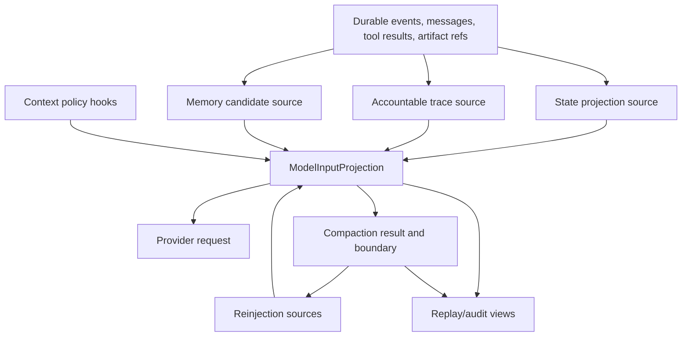

# feat: Upgrade context to Attention OS

## Summary

This plan strengthens the existing M4 context projection implementation into an Attention OS layer by adding explicit context ontology contracts, conservative state/trace/memory-candidate sources, compaction continuity, and replay/audit visibility. It extends the current projection, compaction, reinjection, JSONL durability, and replay patterns rather than replacing the agent loop with a monolithic ContextManager.

---

## Problem Frame

Guga already has a working M4 baseline: `ModelInputProjection`, source descriptors, budget pressure, tool result previews, compaction, reinjection, context hooks, JSONL durable events, and replay model-input views. The updated origin document raises the bar from "model input is projected" to "context is an auditable attention runtime" where facts, state, summaries, traces, memory candidates, artifacts, and policy decisions keep distinct responsibilities.

---

## Requirements

- R1-R5. Preserve the origin's context ontology boundary: raw events/tool results/artifacts are facts; state, trace, summary, and memory candidates are derived projections; hidden chain-of-thought is not a fact source.
- R6-R11. Keep `ModelInputProjection` as the single provider-input boundary, generated from typed sources with budget, pressure, source metadata, policy decisions, hash, and internal/model-visible separation.
- R12-R16. Preserve tool result and artifact governance: raw result, LLM preview, UI projection, audit metadata, references, pairing, lifecycle correlation, and result-type-specific preview behavior.
- R17-R22. Preserve reactive/proactive compaction and failure visibility while adding richer summary lineage, retained/compacted source semantics, and quality/degradation metadata.
- R23-R26. Make post-compact continuity stronger: active resources, plan/todo, tools, permission mode, host context, key facts, open questions, and constraints must survive compaction without becoming system/developer authority.
- R27-R30. Keep context policy plugin hooks auditable and non-mutating; old hook contexts must remain stale after reload/fork/switch.
- R31-R36. Stage the work so projection/state skeleton lands first, then tool/result continuity, compaction/reinjection, policy hooks, and replay/resume readiness.

**Origin actors:** A1 host application developer; A2 plugin author; A3 Guga core runtime; A4 tool runtime; A5 provider bridge/router; A6 host UI/replay consumer; A7 planning/implementation agent.

**Origin flows:** F1 rebuild current work scene from facts; F2 assemble model input projection; F3 govern large tool results; F4 recover current intent after context overflow; F5 restore workbench state after compaction; F6 allow context policies to participate without mutating facts.

**Origin acceptance examples:** AE1 typed projection distinguishes facts, state, summaries, tool previews, artifacts, and decisions; AE2 compact preserves current objective and active state; AE3 large tool results are preview/reference backed; AE4 overflow compaction preserves authority and tool pairing; AE5 compact failure is visible; AE6 reinjection remains below system/developer authority; AE7 stale hook context is rejected; AE8 staged delivery prepares replay/resume.

---

## Scope Boundaries

- Do not implement long-term memory, automatic user-preference extraction, cross-session semantic memory, vector search, or session search.
- Do not implement an enterprise context policy console, trust management UI, sensitive-data filtering product, or summary-quality eval product.
- Do not replace `AgentLoop` or `ConversationState` with a broad monolithic `ContextManager`.
- Do not add real provider-backed LLM summarization in this plan; keep local skeleton behavior and summarizer slots separate.
- Do not commit generated `packages/*/dist/` output.
- Do not use hidden chain-of-thought as trace, resume, or audit input.

### Deferred to Follow-Up Work

- Full M5 resume/fork tree navigation integration: build on the projection ledger and durable event semantics prepared here.
- Real long-term memory retrieval: use M15-M18 memory packages after the context source boundary is stable.
- Summary quality scoring and policy version eval: defer to M8-style operations/eval work.
- UI-specific rendering of the new Attention OS surfaces: expose enough replay/audit data here; product UI can decide presentation later.

---

## Context & Research

### Relevant Code and Patterns

- `packages/core/src/contracts/context.ts` already defines `ContextSourceKind`, `ContextSourceDescriptor`, `ModelInputProjection`, `CompactionResult`, `ReinjectionSource`, and `ProjectionLedgerEntry`.
- `packages/core/src/context/model-input-projection.ts` assembles provider-visible messages/tools with source descriptors, tool-pairing safety, budget pressure, policy decisions, and projection hashes.
- `packages/core/src/context/compaction-service.ts`, `compaction-summary.ts`, and `compacted-projection.ts` implement local compaction results, summary messages, boundary metadata, and retry projections.
- `packages/core/src/context/reinjection-service.ts` converts post-compact runtime state into non-critical model-visible sources and rejects stale runtime context.
- `packages/core/src/loop/agent-loop.ts` already runs context hooks, emits projection/pressure/compaction/reinjection events, records provider input before provider calls, and retries after overflow.
- `packages/core/src/context/tool-result-store.ts` and `tool-result-views.ts` already separate raw tool result content, artifact/buffer references, previews, and reread instructions.
- `packages/plugin-replay-audit/src/model-input-view.ts` reconstructs committed provider input from durable projection facts without using current runtime state.
- `packages/plugin-replay-audit/src/audit-view.ts` already surfaces compaction boundaries, artifact-backed tool results, interrupted operations, and automatic memory-write diagnostics.
- `packages/plugin-context-default/src/default-context-policy.ts` declares all context phases and is the first-party place to document default Attention OS policy semantics.

### Institutional Learnings

- `docs/solutions/architecture-patterns/context-policy-projection.md` says context is a projection, compression is safer when pending turns/tool pairing/recent tail are protected, and M5 gets replay material from projection hashes and source lists.
- `docs/solutions/architecture-patterns/tool-permission-runtime.md` keeps tool intent under runtime authority and treats large tool outputs as governed previews/references.
- `docs/solutions/architecture-patterns/plugin-capability-discovery.md` favors small serializable descriptors and plugin-owned capability metadata over executable objects in discovery surfaces.
- `.trellis/spec/backend/directory-structure.md` keeps public contracts in `packages/core/src/contracts` and implementation helpers in focused runtime modules.
- `.trellis/spec/backend/quality-guidelines.md` requires behavior tests for feature-bearing runtime units and forbids importing real provider SDKs into core runtime layers.

### External References

- No new external documentation is needed. The repo already contains strong local M4 patterns and the origin document carries the reference-agent research and user-provided Attention OS framing.

---

## Key Technical Decisions

- Extend typed context contracts rather than create a monolithic ContextManager: this preserves the small-core shape and lets projection/compaction/replay adopt new semantics incrementally.
- Model state, trace, and memory candidates as context sources plus optional projection metadata: this makes them visible to budget, hash, replay, and audit without turning them into raw facts.
- Keep memory candidate handling read-only in this plan: memory can influence context only as a governed source/candidate; actual storage/retrieval remains outside M4.
- Add accountable trace as public decision/evidence/action metadata, not hidden chain-of-thought: replay and audit can explain behavior without storing private reasoning.
- Reuse the existing durable event and replay audit path: provider-input and projection facts already give the right source of truth for "what the model saw."
- Preserve local skeleton compaction as the default: richer state and trace should improve local summaries, but real LLM summarization remains a later replaceable capability.

---

## Open Questions

### Resolved During Planning

- Should this plan rewrite `AgentLoop` around a new ContextManager? No. The existing loop already owns provider-call boundaries, compaction retry, hooks, and durable provider-input commits. The plan extends its context inputs and events.
- Should memory candidates become automatic long-term memory? No. They remain candidate/source metadata only, aligned with the origin's non-goal and the memory package roadmap.
- Should trace store hidden chain-of-thought? No. The plan uses accountable public trace fields such as assumptions, evidence, decisions, actions, observations, validation, and next steps.
- Should external docs research run? No. The target is repo-local architecture with mature local patterns and existing reference research in the origin document.

### Deferred to Implementation

- Exact naming of the new ontology helper types: implementation should choose names that match `contracts/context.ts` conventions and avoid over-exporting internal helpers.
- Exact extraction heuristics for local state projection: keep first-pass heuristics conservative and testable; avoid pretending to infer facts that are not represented in current messages/sources/decisions.
- Exact metadata shape for trace and memory candidate sources: use the smallest serializable shape that replay/audit needs, then expand only when a test requires it.
- Whether some state projection helpers should remain internal: export only host-facing contracts from `packages/core/src/index.ts`.

---

## High-Level Technical Design

> *This illustrates the intended approach and is directional guidance for review, not implementation specification. The implementing agent should treat it as context, not code to reproduce.*

The key boundary is that only `Projection` is sent to providers. `Facts` remain the audit/replay source; `State`, `Trace`, `Memory`, and `Compact` are derived views that can be rebuilt or replaced.

---

## Implementation Units

- U1. **Context ontology contracts**

**Goal:** Extend the public context contract so Guga can name state projection, accountable trace, and memory candidate sources without changing provider message types.

**Requirements:** R1-R11, AE1.

**Dependencies:** None.

**Files:**
- Modify: `packages/core/src/contracts/context.ts`
- Modify: `packages/core/src/contracts/context.test.ts`
- Modify: `packages/core/src/index.ts`

**Approach:**
- Add source kinds or typed descriptor metadata for state projection, accountable trace, and memory candidate context.
- Add small serializable shapes for state projection, accountable trace, and memory candidate references where they are needed by projection/audit.
- Carry redaction-safe sensitivity, confidence, scope, and intended-usage metadata for memory candidates and trace/state references; never put raw candidate text or raw artifact/tool content into ledger-safe metadata.
- Extend `ReinjectionSource` eligibility only for state/trace source kinds that must survive post-compact continuity; keep memory candidates ineligible for default reinjection unless a future memory policy explicitly promotes them.
- Keep raw facts out of these shapes; references point back to event, tool-result, artifact, resource, or host sources.
- Preserve existing `ModelInputProjection` fields so current providers and replay views continue to work.

**Patterns to follow:**
- Existing `ContextSourceDescriptor`, `ContextSourceReference`, `ReinjectionSource`, and `ProjectionLedgerEntry` contracts in `packages/core/src/contracts/context.ts`.
- Existing export style in `packages/core/src/index.ts`.

**Test scenarios:**
- Happy path: a projection can include state, trace, and memory-candidate descriptors while preserving provider-visible `CoreMessage[]`.
- Edge case: derived sources can be marked internal-only and excluded from model visibility while still appearing in source metadata.
- Edge case: memory-candidate metadata preserves sensitivity/confidence/usage signals while excluding raw candidate text from ledger-safe descriptors.
- Error path: a memory-candidate-like source cannot be treated as critical system/developer authority in contract fixtures.
- Integration: public exports expose only intended contract types and do not require importing implementation modules.

**Verification:**
- Contract tests prove the ontology can distinguish facts, projections, summaries, trace, and memory candidates without replacing provider messages.

---

- U2. **State and trace source projection helpers**

**Goal:** Add conservative helpers that turn current messages, source descriptors, policy decisions, and references into state/trace context sources.

**Requirements:** R1-R5, R9, R23-R26, AE1, AE2.

**Dependencies:** U1.

**Files:**
- Create: `packages/core/src/context/state-projection.ts`
- Create: `packages/core/src/context/state-projection.test.ts`
- Create: `packages/core/src/context/accountable-trace.ts`
- Create: `packages/core/src/context/accountable-trace.test.ts`
- Modify: `packages/core/src/index.ts`

**Approach:**
- Build a small state projection from available local facts: first/current user objective, hard constraints surfaced by system/developer/user sources, tool/artifact references, open questions if explicitly represented, and recent validation or error observations.
- Build accountable trace descriptors from explicit evidence and policy decisions: assumptions, evidence refs, decisions, actions, observations, validation, and next steps.
- Treat all extraction as conservative; if a fact is not represented in messages, sources, or decisions, leave it absent rather than inventing it.
- Keep helper output as `ContextSourceDescriptor` values so existing ordering, budgeting, hashing, and truncation code can handle them.

**Patterns to follow:**
- `packages/core/src/context/compaction-summary.ts` for local projection from a `ModelInputProjection`.
- `packages/core/src/context/reinjection-service.ts` for descriptor creation and stale/ineligible source handling.
- `.trellis/spec/guides/cross-layer-thinking-guide.md` for source -> transform -> projection mapping.

**Test scenarios:**
- Happy path: a user request plus tool result reference produces state descriptors for objective and evidence refs.
- Happy path: policy decisions and tool references produce accountable trace descriptors without hidden reasoning text.
- Edge case: empty or tool-only projections produce minimal descriptors without fake goals or fabricated facts.
- Error path: unsafe memory-like content remains a low-priority candidate/reference and is not promoted to instruction authority.
- Integration: helper descriptors can pass through `ContextBudgeter` and projection hash computation without special cases.

**Verification:**
- Tests prove derived state/trace descriptors are deterministic, serializable, and conservative.

---

- U3. **Projection and agent-loop integration**

**Goal:** Feed state/trace/memory-candidate sources into the existing projection path and durable projection events.

**Requirements:** R6-R11, R23-R30, R31-R36, AE1, AE6, AE7, AE8.

**Dependencies:** U1, U2.

**Files:**
- Modify: `packages/core/src/context/model-input-projection.ts`
- Modify: `packages/core/src/context/model-input-projection.test.ts`
- Modify: `packages/core/src/context/projection-hash.ts`
- Modify: `packages/core/src/context/projection-hash.test.ts`
- Modify: `packages/core/src/context/context-decision-ledger.ts`
- Modify: `packages/core/src/context/context-decision-ledger.test.ts`
- Modify: `packages/core/src/loop/agent-loop.ts`
- Modify: `packages/core/src/loop/agent-loop.test.ts`

**Approach:**
- Introduce the new derived sources through the existing `additionalSources` path or a small projector option, rather than teaching providers about them.
- Avoid circular projection derivation: assemble a base projection from messages/tools/hook sources, derive state/trace/memory-candidate descriptors from that stable base, then reassemble at most once with the derived `additionalSources`.
- Ensure projection hashes include the new source categories and references while still excluding raw sensitive metadata.
- Ensure the context decision ledger records derived source descriptors, source refs, policy decisions, safe sensitivity/usage summaries, and compaction boundaries without raw tool/artifact/candidate content.
- Keep hook decisions auditable and preserve stale context rejection behavior.

**Patterns to follow:**
- Existing `prepareProjection` flow in `packages/core/src/loop/agent-loop.ts`.
- Existing projection hash tests that prove stable hashes for identical source descriptors.
- Existing context hook tests in `packages/core/src/loop/agent-loop.test.ts`.

**Test scenarios:**
- Happy path: a provider request has a projection containing message, tool preview, state, trace, and active-tool descriptors.
- Happy path: `ContextProjectionCreated` durable event includes the new descriptors before provider input is committed.
- Edge case: internal-only derived sources influence audit metadata but do not generate provider-visible messages.
- Error path: stale reinjection/context hook sources remain rejected and cannot enter the retry projection.
- Integration: projection ledger entries include derived descriptors and references but omit raw metadata content.

**Verification:**
- Agent-loop tests show provider calls still receive normal messages/tools, while context events and ledger entries expose Attention OS metadata.

---

- U4. **Compaction and reinjection continuity**

**Goal:** Use state/trace/evidence refs to make local compaction summaries and post-compact reinjection preserve current work state more reliably.

**Requirements:** R17-R26, R31-R36, AE2, AE4, AE5, AE6.

**Dependencies:** U1, U2, U3.

**Files:**
- Modify: `packages/core/src/context/compaction-summary.ts`
- Modify: `packages/core/src/context/compaction-service.ts`
- Modify: `packages/core/src/context/compaction-service.test.ts`
- Modify: `packages/core/src/context/compacted-projection.ts`
- Modify: `packages/core/src/context/model-input-projection.test.ts`
- Modify: `packages/core/src/context/reinjection-service.ts`
- Modify: `packages/core/src/context/reinjection-service.test.ts`
- Modify: `packages/core/src/loop/agent-loop.test.ts`

**Approach:**
- Populate local skeleton summaries from state/trace descriptors when available, especially objective, key facts, user constraints, evidence refs, open questions, and next steps.
- Preserve authority boundaries: summary and reinjected sources stay user/model-visible context, never system/developer instructions.
- Keep compaction boundaries explicit with retained and compacted source IDs, parent/cutoff lineage, failure/degradation fields, and source references.
- Add default reinjection descriptors for current state/trace surfaces only when they are derived from current runtime facts and match the runtime context.

**Patterns to follow:**
- Existing `compactedSummaryContent()` framing that labels summaries as historical/task context.
- Existing `ReinjectionService` priority handling and stale descriptor behavior.
- Existing overflow and proactive compaction tests in `packages/core/src/loop/agent-loop.test.ts`.

**Test scenarios:**
- Covers AE2. Happy path: after compact, retry messages include summary plus active state/trace context and preserve objective, constraints, evidence refs, and next steps.
- Covers AE4. Integration: context overflow compaction still protects system/developer authority, pending turn, and tool call/result pairing.
- Covers AE5. Error path: compaction failure remains visible and does not silently replace state with an incomplete summary.
- Edge case: memory-candidate or old tool-output sources are never reinjected as critical authority.
- Integration: proactive compaction with hook-provided reinjection keeps host context and derived state below system/developer priority.

**Verification:**
- Compaction tests prove the local summary is more informative without relying on LLM summarization.
- Agent-loop tests prove compact/retry still succeeds and provider messages include the expected continuity markers.

---

- U5. **Replay and audit Attention OS visibility**

**Goal:** Make replay/audit consumers explain derived state, trace, memory-candidate boundaries, compaction continuity, and provider-visible input without rerunning runtime hooks.

**Requirements:** R1-R5, R8-R11, R16, R21, R25-R30, R36, AE1, AE5, AE6, AE8.

**Dependencies:** U1, U2, U3, U4.

**Files:**
- Modify: `packages/plugin-replay-audit/src/model-input-view.ts`
- Modify: `packages/plugin-replay-audit/src/model-input-view.test.ts`
- Modify: `packages/plugin-replay-audit/src/audit-view.ts`
- Modify: `packages/plugin-replay-audit/src/audit-view.test.ts`
- Modify: `packages/plugin-replay-audit/src/test-fixtures.ts`
- Modify: `packages/plugin-session-jsonl/src/runtime-integration.test.ts`
- Modify: `packages/core/src/persistence/resume-report.ts`
- Create: `packages/core/src/persistence/resume-report.test.ts`

**Approach:**
- Extend replay model-input fixtures to include state, trace, and memory-candidate descriptors.
- Keep replay deterministic: consume recorded projection facts and committed provider-input facts; do not rerun hook logic or rebuild sources from current registries.
- Add audit diagnostics that identify derived context source categories, compaction continuity metadata, and memory-candidate absence/presence without treating memory candidates as curated writes.
- Ensure resume reports can display projection ledger entries with new source categories while keeping raw artifact content out of the report.

**Patterns to follow:**
- `packages/plugin-replay-audit/src/model-input-view.ts` already reconstructs projection from durable facts.
- `packages/plugin-replay-audit/src/audit-view.ts` already emits diagnostics for artifact-backed tool results, compaction boundaries, interrupted operations, and curated memory writes.
- `packages/plugin-session-jsonl/src/runtime-integration.test.ts` already verifies reopening persisted runs and replaying model input without provider calls.

**Test scenarios:**
- Happy path: replayed provider input includes derived source descriptors and projection hash but does not read current tool registry state.
- Happy path: audit timeline surfaces a compaction boundary with state/trace continuity metadata.
- Edge case: missing projection fact still reports `PROJECTION_FACT_MISSING` rather than trying to reconstruct from current state.
- Edge case: replay/audit can show safe sensitivity/confidence/usage summaries for memory candidates without exposing raw candidate text or artifact/tool content.
- Error path: automatic curated memory writes remain flagged, while memory-candidate sources are reported as candidate context rather than active memory writes.
- Integration: JSONL runtime replay reopens a run containing Attention OS descriptors and returns model input without calling providers.

**Verification:**
- Replay/audit tests prove the new context metadata is visible, deterministic, and not confused with curated memory.

---

- U6. **Default policy, documentation, and plan handoff polish**

**Goal:** Update default policy metadata and architecture docs so plugin authors and future planners understand the Attention OS boundary.

**Requirements:** R27-R36, success criteria from origin, AE6, AE8.

**Dependencies:** U1-U5.

**Files:**
- Modify: `packages/plugin-context-default/src/default-context-policy.ts`
- Modify: `packages/plugin-context-default/src/default-context-policy.test.ts`
- Modify: `docs/research/context-policy-plugins.md`
- Modify: `docs/solutions/architecture-patterns/context-policy-projection.md`
- Modify: `docs/research/index.md`

**Approach:**
- Document that the default context policy observes and annotates Attention OS sources without mutating facts.
- Keep first-party policy package as a single default package; only update metadata/future split notes where they help hosts understand the new source categories.
- Update solution/research docs to distinguish raw facts, state projection, trace, memory candidate, summary, and model-input projection.
- Keep docs implementation-oriented and repo-relative; do not reference local sibling repo paths.

**Patterns to follow:**
- Existing `defaultContextPolicy()` metadata and hook decision tests.
- Existing architecture-pattern docs under `docs/solutions/architecture-patterns/`.
- Existing research index entry style in `docs/research/index.md`.

**Test scenarios:**
- Happy path: default context policy metadata mentions the supported Attention OS source categories and retains all context phases.
- Integration: default context hooks still return auditable decisions and do not mutate event log or provider request.
- Documentation expectation: docs explain what is in M4 and what remains M5/M8/future memory work.

**Verification:**
- Plugin tests verify phase metadata remains intact.
- Docs align with the origin requirements and the implemented public contracts.

---

## System-Wide Impact

- **Interaction graph:** The change touches provider-input projection, compaction retry, context hooks, replay audit, JSONL persistence tests, and default context policy metadata.
- **Error propagation:** Existing `CoreError` and context event paths stay unchanged. New derived sources should not introduce provider failures; invalid or stale sources should be omitted, marked internal-only, or recorded as policy/audit diagnostics.
- **State lifecycle risks:** Derived state and trace must not become new facts. They should be regenerated from messages, source descriptors, policy decisions, and durable records.
- **API surface parity:** Public exports from `packages/core/src/index.ts` must match `contracts/context.ts`. Replay/audit consumers should use recorded projection data, not runtime-only helper APIs.
- **Integration coverage:** Unit tests alone are not enough; agent-loop and JSONL replay integration tests must prove provider-visible input remains stable.
- **Unchanged invariants:** Provider bridges still receive `CoreMessage[]` and `ToolDefinition[]`; tool calls still go through `ExecutionPipeline`; compaction summaries remain lower authority than system/developer instructions.

---

## Alternative Approaches Considered

- Build a new monolithic `ContextManager`: rejected because it would duplicate existing projection, compaction, hook, and replay paths and make core broader than needed.
- Add memory retrieval now: rejected because origin explicitly keeps long-term memory and retrieval out of M4, and memory packages already model candidate/governance work separately.
- Store raw state/trace snapshots as new facts: rejected because state/trace are derived projections. Durable facts remain events, tool results, artifacts, boundaries, and provider-input commits.
- Defer all Attention OS work to M5: rejected because the public contracts and projection descriptors should be ready before replay/resume grows around the older M4 shape.

---

## Risk Analysis & Mitigation

| Risk | Likelihood | Impact | Mitigation |
|------|------------|--------|------------|
| Derived state accidentally becomes a second source of truth | Medium | High | Keep derived sources reference-backed and rebuildable; test that summaries/trace do not replace raw facts. |
| Projection hashes become unstable because metadata includes volatile content | Medium | Medium | Hash only stable descriptor fields and references; add hash stability tests with derived sources. |
| Memory candidates get confused with curated memory writes | Medium | High | Keep candidate sources low authority/read-only and extend audit tests that distinguish candidates from automatic curated writes. |
| Compaction retry changes provider-visible message ordering | Low | High | Extend existing overflow/proactive compaction tests with state/trace/reinjection cases. |
| Public contracts become too broad | Medium | Medium | Export only serializable contracts; keep helper implementations internal unless hosts need them. |

---

## Phased Delivery

### Phase 1: Contract and local projection

- Land U1 and U2 so contracts and conservative helper sources are available without changing provider behavior.

### Phase 2: Runtime projection and continuity

- Land U3 and U4 so agent-loop projection, compaction, and reinjection use the new sources.

### Phase 3: Replay, audit, and documentation

- Land U5 and U6 so durable/replay consumers and plugin authors can understand the Attention OS surface.

---

## Documentation / Operational Notes

- Update docs after contract behavior is settled, not before, so the docs match implemented source categories.
- No migration is expected for existing JSONL sessions because the new fields are additive in projection/source descriptors.
- Host UIs should not assume new source categories are always present; they are optional context metadata.

---

## Sources & References

- **Origin document:** `docs/brainstorms/2026-05-27-m4-context-policy-plugins-requirements.md`
- Related architecture pattern: `docs/solutions/architecture-patterns/context-policy-projection.md`
- Current context research: `docs/research/context-policy-plugins.md`
- Tool runtime pattern: `docs/solutions/architecture-patterns/tool-permission-runtime.md`
- Capability discovery pattern: `docs/solutions/architecture-patterns/plugin-capability-discovery.md`
- Core context contracts: `packages/core/src/contracts/context.ts`
- Projection implementation: `packages/core/src/context/model-input-projection.ts`
- Agent loop integration: `packages/core/src/loop/agent-loop.ts`
- Replay audit implementation: `packages/plugin-replay-audit/src/model-input-view.ts`
