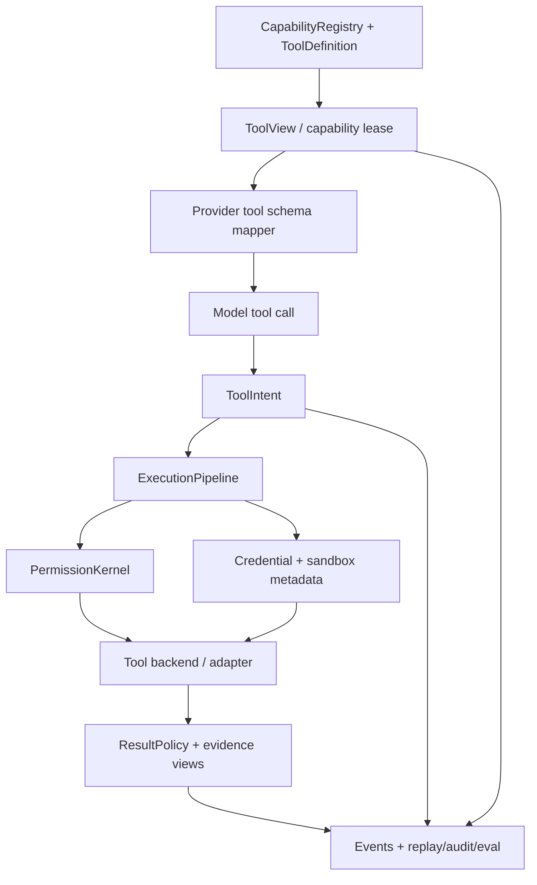

# feat: Upgrade tools to Action OS

## Summary

This plan upgrades the existing tool runtime by extending current contracts, projection, execution, result, MCP/delegation, and eval surfaces into an Action OS layer. It keeps `ExecutionPipeline` and `PermissionKernel` as the authority path while adding ToolView/capability-lease, auditable ToolIntent, action ontology, credential/sandbox metadata, evidence-oriented results, and tool-selection eval coverage.

---

## Problem Frame

Guga already has a strong M3 baseline: tools register through `CapabilityRegistry`, the agent loop filters visible tools, `ExecutionPipeline` enforces hooks/permission/execution/result policy, and large tool outputs can be budgeted into references. The new requirements raise the bar from safe execution to governed action: the runtime must explain why a tool was visible, why it was called, who/what it acts as, where it runs, how results become evidence, and how metadata quality is tested.

---

## Requirements

- R1-R5. Preserve the origin's canonical capability and model projection boundary: provider-facing schemas are compiled views, not the canonical tool facts.
- R6-R13. Add auditable action governance: ToolIntent, richer action/effect semantics, principal/credential/sandbox metadata, and lifecycle correlation through execution.
- R14-R17. Strengthen tool results as evidence: raw fact source, model preview, UI projection, audit metadata, artifact/reference, redaction, and verifier state stay distinct.
- R18-R21. Normalize multi-source capabilities: builtin, first-party/plugin, MCP, host, CLI/backend, skill-like procedure, and subagent delegation share governance metadata.
- R22-R24. Add operability and eval coverage so tool metadata, visibility, unsafe-call behavior, and audit explainability are testable.

**Origin actors:** A1 Guga core runtime; A2 plugin author; A3 host application developer; A4 model provider bridge; A5 context/memory/audit subsystem; A6 downstream planner/implementer.

**Origin flows:** F1 compile model-visible tool view; F2 turn model call into controlled action; F3 turn tool results into evidence; F4 normalize multi-source capability semantics.

**Origin acceptance examples:** AE1 filtered tools are not shown and audit explains why; AE2 permission denial records intent and avoids execution; AE3 credential/API scope failure is fail-closed and secret-safe; AE4 large outputs return preview/reference while audit keeps full evidence; AE5 MCP tools carry namespace/source/trust/effect metadata; AE6 skill/subagent actions are governed as tool-like capabilities; AE7 tool metadata eval exposes misuse; AE8 audit reconstructs dangerous calls.

---

## Scope Boundaries

- Do not replace `ExecutionPipeline`, `PermissionKernel`, `AgentLoop`, or provider bridge architecture.
- Do not implement enterprise policy engine, remote sandbox provider, OAuth refresh flow, secret broker product, marketplace governance, or permission UI.
- Do not turn every skill into a tool; only govern skill-like or subagent capabilities that can perform real actions.
- Do not add all MCP transports; only strengthen MCP tool adaptation into the existing registry and pipeline.
- Do not commit generated `packages/*/dist/` output.

### Deferred to Follow-Up Work

- Full credential broker implementation: this plan creates contract/audit/gate metadata and fail-closed behavior, not token acquisition or refresh.
- Full remote sandbox/container execution backend: this plan records and checks sandbox requirements, while backend provisioning remains future work.
- UI rendering for ToolView, ToolIntent, and evidence views: this plan emits enough typed data for hosts; product UI can decide presentation later.
- Benchmark-scale model evals: this plan adds hermetic local fixtures, not a benchmark platform.

---

## Context & Research

### Relevant Code and Patterns

- `packages/core/src/contracts/tools.ts` defines `ToolDefinition`, `ToolEffect`, and `ToolRuntimeMetadata`.
- `packages/core/src/contracts/tool-runtime.ts` defines source, availability, visibility, backend, scheduler, result budget, result reference, correlation, and projection types.
- `packages/core/src/loop/agent-loop.ts` currently filters visible tools before projection and emits `ToolVisibilityFiltered`; this should become the ToolView/capability-lease boundary.
- `packages/core/src/tools/execution-pipeline.ts` owns schema validation, hooks, permission resolution, durable start/terminal markers, tool execution, and result policy application.
- `packages/core/src/permissions/permission-kernel.ts` centralizes allow/ask/deny decisions, profile defaults, remembered decisions, permission events, and model-visible denials.
- `packages/core/src/tools/result-policy.ts`, `packages/core/src/context/tool-result-views.ts`, and `packages/core/src/context/tool-result-store.ts` already separate preview/reference from raw tool result content.
- `packages/core/src/provider-ai-sdk/tool-mapper.ts` only maps already-selected tools into AI SDK schemas, which is the right boundary for keeping provider schemas as compiled output.
- `packages/plugin-mcp/src/mcp-tool-adapter.ts` namespaces MCP tools but currently defaults them to broad external effects with minimal governance metadata.
- `packages/plugin-tools-delegation/src/delegate-task-tool.ts` already treats delegation as a first-party tool with permissions, scheduler metadata, result budget, and compact delegation metadata.
- `packages/eval-fixtures` and `packages/plugin-eval-runner` provide the existing hermetic eval registry and runner to extend for tool metadata/selection fixtures.

### Institutional Learnings

- `docs/solutions/architecture-patterns/tool-permission-runtime.md` says real tools are not ordinary functions and keeps execution/permission/result boundaries core-owned.
- `docs/research/context-packs/tool-registry.md` shows reference projects converge on unified tool pools, allow/ask/deny permission, fail-closed defaults, hooks, and result truncation.
- `.trellis/spec/backend/quality-guidelines.md` forbids bypassing `ExecutionPipeline`, executing side-effecting tools before `PermissionKernel`, and committing generated dist output.
- `.trellis/spec/guides/cross-layer-thinking-guide.md` applies directly because this work changes contracts, loop projection, pipeline execution, adapters, audit events, and eval.

### External References

- No new external research is needed. The origin document, existing context packs, and local runtime patterns are sufficient; additional library docs would not change the implementation decomposition.

---

## Key Technical Decisions

- Extend existing contracts instead of creating a separate `ToolManager`: the current registry, loop, pipeline, permission, and result code already form the authority path.
- Move ToolView/capability-lease logic out of ad hoc loop filtering: provider mappers should only compile an already-authorized projection.
- Keep ToolIntent public and audit-safe: record explainable action summaries and evidence references, never hidden reasoning.
- Treat credential and sandbox as first-class runtime metadata before implementing full products: the first pass should be enforceable enough to fail closed when requirements are unmet, but not pretend to broker credentials.
- Split effect/action taxonomy from backward-compatible `ToolEffect`: preserve existing tool behavior while adding richer action metadata for policy and eval.
- Reuse existing result policy and tool-result store for evidence: raw/result-preview/UI/audit views should grow from existing budget/reference mechanics.
- Reuse the flywheel eval registry: tool metadata quality becomes a new hermetic fixture category, not a separate eval subsystem.

---

## Open Questions

### Resolved During Planning

- Should this introduce a brand-new ToolManager service? No. Existing code already has the right core-owned seams; the plan adds contracts and services around them.
- Should provider bridges filter tools? No. They should map the runtime-projected tools they receive.
- Should credential/sandbox be fully implemented now? No. The origin explicitly excludes full broker/sandbox products; this plan adds metadata, checks, audit, and fail-closed behavior.
- Should MCP tools be rewritten? No. The adapter should be enriched so MCP tools enter the same registry/pipeline semantics.
- Should external research run? No. Local code and existing research packs already answer the planning questions.

### Deferred to Implementation

- Exact naming of new action taxonomy fields and lease identifiers should follow existing `tool-runtime.ts` naming once implementation starts.
- The first-pass ToolIntent builder should use conservative data available at runtime; if a field cannot be derived without inventing context, omit it.
- Credential/sandbox gate behavior should start with explicit metadata and availability decisions, then grow only where tests prove a need.
- Eval fixture scoring for tool selection may start with deterministic mock tool-call responses before adding model-choice precision/recall metrics.

---

## High-Level Technical Design

> *This illustrates the intended approach and is directional guidance for review, not implementation specification. The implementing agent should treat it as context, not code to reproduce.*

The key invariant is that the provider only sees the lease-compiled schema. The canonical tool descriptor, visibility decisions, intent, permission, environment, result evidence, and audit metadata remain runtime-owned.

---

## Implementation Units

- U1. **Action ontology and runtime metadata contracts**

**Goal:** Extend tool contracts so canonical capabilities can express action taxonomy, risk, credential binding, sandbox requirements, trust/source, and eval hints without changing current execution behavior.

**Requirements:** R1-R5, R8-R12, R18-R20, AE3, AE5.

**Dependencies:** None.

**Files:**
- Modify: `packages/core/src/contracts/tools.ts`
- Modify: `packages/core/src/contracts/tool-runtime.ts`
- Modify: `packages/core/src/contracts/permissions.ts`
- Modify: `packages/core/src/contracts/events.ts`
- Modify: `packages/core/src/contracts/contracts.test.ts`
- Modify: `packages/core/src/index.ts`

**Approach:**
- Keep `ToolEffect` backward-compatible while adding richer action categories and risk/effect metadata under runtime contracts.
- Add serializable metadata for credential binding, principal summary, sandbox/environment requirements, trust/source detail, and tool metadata eval hints.
- Keep all secret-bearing values as references or descriptors; never put token-like values in public contracts.
- Add event payload capacity for lease/intent/environment metadata without forcing every existing event to populate new fields.

**Patterns to follow:**
- Existing `ToolRuntimeMetadata`, `ToolSourceMetadata`, `ToolBackendRequirement`, and `ToolAvailabilityContext` in `packages/core/src/contracts/tool-runtime.ts`.
- `CapabilityDescriptor` and trust/declared-effect conventions in `packages/core/src/contracts/plugins.ts`.

**Test scenarios:**
- Happy path: a tool can declare richer action/risk metadata while old `effect` consumers still compile and pass.
- Edge case: credential binding metadata represents a credential reference/principal summary without exposing a secret string.
- Edge case: sandbox requirements can express workspace, network, backend, timeout, and output constraints as serializable metadata.
- Error path: contract fixtures reject or flag unsafe examples where secret material would become model-visible metadata.
- Integration: public exports include intended new contract types while keeping implementation helpers private.

**Verification:**
- Contract tests prove the new metadata is serializable, backward-compatible, and safe to carry in runtime/audit paths.

---

- U2. **ToolView and capability-lease projection**

**Goal:** Turn per-turn visible tool filtering into an explicit ToolView/capability-lease service that records why tools were included or excluded before provider schema mapping.

**Requirements:** R1-R5, R13, R24, AE1, AE8.

**Dependencies:** U1.

**Files:**
- Create: `packages/core/src/tools/tool-projection.ts`
- Create: `packages/core/src/tools/tool-projection.test.ts`
- Modify: `packages/core/src/loop/agent-loop.ts`
- Modify: `packages/core/src/tools/execution-pipeline.ts`
- Modify: `packages/core/src/tools/execution-pipeline.test.ts`
- Modify: `packages/core/src/provider-ai-sdk/tool-mapper.ts`
- Modify: `packages/core/src/provider-ai-sdk/mappers.test.ts`
- Modify: `packages/core/src/context/model-input-projection.ts`
- Modify: `packages/core/src/context/model-input-projection.test.ts`

**Approach:**
- Extract `toolVisibilityDecision` and loop-local visible-tool logic into a tool projection module.
- Produce a lease-like projection that contains the visible tools, filtered decisions, lease metadata, and enough source context to explain policy/availability decisions.
- Preserve `AgentLoop` behavior by using the new projection service before `ModelInputProjector`.
- Keep provider mappers simple: they map the projected visible tools; they do not inspect hidden tools or policy.
- Emit visibility/lease events where the runtime already emits filtered decisions.

**Patterns to follow:**
- Existing `visibleTools` behavior and `ToolVisibilityFiltered` events in `packages/core/src/loop/agent-loop.ts`.
- Existing `ToolProjection` shape in `packages/core/src/contracts/tool-runtime.ts`.
- Existing `ModelInputProjection` source metadata style in `packages/core/src/context/model-input-projection.ts`.

**Test scenarios:**
- Happy path: available read tools appear in the lease and provider mapper receives only those tools.
- Edge case: hidden/runtime-only tools are excluded with a visible audit decision.
- Edge case: headless/background profiles exclude ask-required tools and preserve the policy-denied reason.
- Error path: missing backend or outside-workspace availability produces a structured filtered decision rather than late provider exposure.
- Integration: `AgentLoop` emits the same model request behavior while adding lease/filter metadata and without exposing hidden tools to `mapToolsToAiSdk`.

**Verification:**
- Loop and mapper tests prove provider-facing schemas are compiled from the lease, not from the raw registry.

---

- U3. **ToolIntent and pipeline governance**

**Goal:** Add an audit-safe ToolIntent boundary so model tool calls carry a public action summary through validation, permission, hooks, execution, and terminal events.

**Requirements:** R6-R13, R24, AE2, AE8.

**Dependencies:** U1, U2.

**Files:**
- Modify: `packages/core/src/contracts/tool-runtime.ts`
- Modify: `packages/core/src/contracts/permissions.ts`
- Modify: `packages/core/src/contracts/events.ts`
- Modify: `packages/core/src/tools/execution-pipeline.ts`
- Modify: `packages/core/src/tools/execution-pipeline.test.ts`
- Modify: `packages/core/src/permissions/permission-kernel.ts`
- Modify: `packages/core/src/permissions/permission-kernel.test.ts`
- Modify: `packages/core/src/loop/agent-loop.ts`
- Modify: `packages/core/src/loop/agent-loop.test.ts`

**Approach:**
- Define a minimal ToolIntent summary that can be built from run input, current call, tool metadata, resource scopes, command/resource summaries, expected effects, and constraints.
- Thread ToolIntent through permission requests and lifecycle events as public audit metadata.
- Keep hidden reasoning out of ToolIntent; if a rationale cannot be explained from public context, omit it or use a short runtime-generated summary.
- Ensure hook-blocked, schema-invalid, permission-denied, unavailable, cancelled, timeout, and successful paths all keep correlation and intent where available.
- Keep `PermissionKernel` the final allow/deny authority and avoid duplicating permission logic in ToolIntent builders.

**Patterns to follow:**
- `permissionRequestFor` and resource scope extraction in `packages/core/src/tools/execution-pipeline.ts`.
- `PermissionRequest.subject` in `packages/core/src/contracts/permissions.ts`.
- Durable start/terminal marker behavior in `ExecutionPipeline`.

**Test scenarios:**
- Happy path: an executed tool emits lifecycle and permission events containing intent metadata and correlation.
- Covers AE2. Error path: a write-like tool denied by permission records ToolIntent and does not execute.
- Edge case: schema-invalid calls produce structured results without permission/execution while preserving call correlation and any safe intent context.
- Edge case: hook-blocked calls include public intent metadata without leaking hook internals beyond the existing decision metadata.
- Integration: remembered permission decisions still work with intent metadata and do not change scope-key behavior unexpectedly.

**Verification:**
- Pipeline and permission tests prove ToolIntent is present on governed paths and absent only where no safe intent can be built.

---

- U4. **Credential, sandbox, and fail-closed environment checks**

**Goal:** Make credential binding and sandbox/environment requirements enforceable enough for first-pass Action OS safety without implementing full credential or sandbox products.

**Requirements:** R9-R12, R13, R18, R20, AE3, AE8.

**Dependencies:** U1, U2, U3.

**Files:**
- Modify: `packages/core/src/contracts/tool-runtime.ts`
- Modify: `packages/core/src/contracts/permissions.ts`
- Modify: `packages/core/src/tools/tool-projection.ts`
- Modify: `packages/core/src/tools/tool-projection.test.ts`
- Modify: `packages/core/src/tools/execution-pipeline.ts`
- Modify: `packages/core/src/tools/execution-pipeline.test.ts`
- Modify: `packages/core/src/runtime/agent-runtime.ts`
- Modify: `packages/core/src/runtime/agent-runtime.test.ts`

**Approach:**
- Extend availability context with credential and sandbox/environment capabilities as descriptors, not secret values.
- Have tool projection hide or mark unavailable tools whose credential or sandbox requirement cannot be satisfied in the current runtime context.
- Have execution pipeline re-check environment requirements before execution so direct `invokeTool` cannot bypass projection-time filtering.
- Return structured unavailable/denied results when credential or sandbox requirements are unmet.
- Treat dangerous/open-world external actions as fail-closed unless host policy or availability context explicitly satisfies the requirement.

**Patterns to follow:**
- Existing dynamic `availability` resolver and `ToolAvailabilityContext` behavior.
- Existing `toolUnavailableResult` and hidden/unavailable tests in `ExecutionPipeline`.
- Existing provider metadata redaction tests in `packages/core/src/provider-ai-sdk/provider.test.ts`.

**Test scenarios:**
- Happy path: a tool with satisfied credential and sandbox descriptors remains visible and executable.
- Covers AE3. Error path: an external API tool requiring an unavailable credential is hidden from model projection and fails closed if invoked directly.
- Error path: a tool requiring a network-restricted sandbox is unavailable when runtime lacks a compatible environment descriptor.
- Edge case: credential descriptors appear in audit metadata without token-like values.
- Integration: `AgentRuntime.invokeTool` enforces the same environment requirement as normal agent-loop execution.

**Verification:**
- Projection and pipeline tests prove credential/sandbox requirements cannot be bypassed by provider projection gaps or direct runtime tool invocation.

---

- U5. **Evidence-oriented result views**

**Goal:** Strengthen result policy so tool output consistently separates raw result storage, model preview, UI projection, audit metadata, evidence references, redaction, and verifier status.

**Requirements:** R14-R17, R24, AE4, AE8.

**Dependencies:** U1, U3.

**Files:**
- Modify: `packages/core/src/contracts/tool-runtime.ts`
- Modify: `packages/core/src/tools/result-policy.ts`
- Modify: `packages/core/src/tools/result-policy.test.ts`
- Modify: `packages/core/src/context/tool-result-views.ts`
- Modify: `packages/core/src/context/tool-result-views.test.ts`
- Modify: `packages/core/src/context/tool-result-store.ts`
- Modify: `packages/core/src/context/tool-result-store.test.ts`
- Modify: `packages/plugin-replay-audit/src/audit-view.ts`
- Modify: `packages/plugin-replay-audit/src/audit-view.test.ts`

**Approach:**
- Extend budget metadata to carry evidence reference metadata, redaction status, verifier status, and separate model/UI/audit view descriptors.
- Keep current truncate/reference behavior but make the view split explicit and easier for replay/audit to inspect.
- Ensure full output stays in `ToolResultStore` or artifact-backed references when over budget.
- Avoid adding memory writes here; only expose evidence metadata that memory/context systems may consume later.

**Patterns to follow:**
- `BudgetedToolResult` and `ToolResultReference` in `packages/core/src/contracts/tool-runtime.ts`.
- `createToolResultPreview` category-specific preview logic.
- `ArtifactToolResultStore` metadata and `plugin-replay-audit` artifact-backed tool result handling.

**Test scenarios:**
- Happy path: small results pass through with no evidence budget applied.
- Covers AE4. Happy path: oversized shell/test output stores full content as a reference and returns only preview/evidence metadata to the model.
- Edge case: failed tool details are budgeted without changing failure status.
- Edge case: redaction/verifier metadata is visible to audit but not forced into model-visible content.
- Integration: replay/audit view can show evidence reference, preview status, and original-content availability for a budgeted result.

**Verification:**
- Result policy, tool-result view, store, and replay-audit tests prove raw, preview, UI, and audit responsibilities remain distinct.

---

- U6. **Multi-source capability metadata for MCP and delegation**

**Goal:** Bring MCP tools and subagent delegation into the unified Action OS capability metadata without rewriting their core behavior.

**Requirements:** R18-R21, R24, AE5, AE6, AE8.

**Dependencies:** U1, U2, U4, U5.

**Files:**
- Modify: `packages/plugin-mcp/src/mcp-tool-adapter.ts`
- Modify: `packages/plugin-mcp/src/mcp-tool-adapter.test.ts`
- Modify: `packages/plugin-mcp/src/mcp-plugin.ts`
- Modify: `packages/plugin-mcp/src/runtime-integration.test.ts`
- Modify: `packages/plugin-tools-delegation/src/delegate-task-tool.ts`
- Modify: `packages/plugin-tools-delegation/src/delegate-task-tool.test.ts`
- Modify: `packages/plugin-tools-delegation/src/runtime-integration.test.ts`
- Modify: `packages/extension-sdk/src/index.ts`
- Modify: `packages/extension-sdk/src/index.test.ts`

**Approach:**
- Enrich MCP tool definitions with stable namespace/source/trust metadata, default risk/effect policy, permission defaults, result budget, and context/result policy hints.
- Keep MCP tool names stable and provider-visible schema behavior unchanged.
- Add a host/plugin policy hook point or adapter option for MCP effect/risk override when a server supplies better metadata.
- Enrich delegation runtime metadata with action category, child context/tool allowance, budget, timeout, and trace/evidence semantics.
- Ensure extension SDK registration preserves new metadata and does not strip it when plugins register tools.

**Patterns to follow:**
- MCP naming and error normalization in `packages/plugin-mcp/src/mcp-tool-adapter.ts`.
- Delegation permission, scheduler, result budget, source, backend, and metadata patterns in `packages/plugin-tools-delegation/src/delegate-task-tool.ts`.
- Extension SDK option enrichment in `packages/extension-sdk/src/index.ts`.

**Test scenarios:**
- Covers AE5. Happy path: MCP adapter creates a namespaced tool with source/trust/action/risk/permission/result metadata and stable name.
- Edge case: MCP tool without declared effect defaults to conservative external/ask/open-world-style governance.
- Error path: MCP server errors still return normal tool failures with enriched metadata intact.
- Covers AE6. Happy path: delegation tool metadata records allowed tools/context/budget/timeout as governance metadata while returning compact child summaries.
- Error path: recursive or unavailable child tools remain blocked and audit metadata cannot be forged by child output.
- Integration: extension SDK registration forwards Action OS metadata into the registry descriptors.

**Verification:**
- MCP, delegation, and extension SDK tests prove multi-source capabilities enter the same governance language while preserving existing execution behavior.

---

- U7. **Tool metadata eval and documentation**

**Goal:** Add hermetic eval coverage and documentation so tool metadata quality, selection expectations, unsafe calls, and audit explainability are visible regressions.

**Requirements:** R22-R24, AE7, AE8.

**Dependencies:** U1, U2, U3, U6.

**Files:**
- Modify: `packages/eval-fixtures/src/manifest.ts`
- Modify: `packages/eval-fixtures/src/roadmap-fixtures.ts`
- Modify: `packages/eval-fixtures/src/eval-fixtures.test.ts`
- Modify: `packages/plugin-eval-runner/src/eval-runner.ts`
- Modify: `packages/plugin-eval-runner/src/eval-runner.test.ts`
- Modify: `docs/eval/flywheel-fixtures.md`
- Modify: `docs/solutions/architecture-patterns/tool-permission-runtime.md`

**Approach:**
- Add a tool-action or tool-selection fixture category to the existing flywheel eval registry.
- Start with deterministic mock-response fixtures that exercise expected tool call, negative prompt, unsafe call, permission trigger, and audit event expectations.
- Extend eval expectations only as much as needed to assert tool-call/event outcomes; avoid building a model benchmark harness.
- Document the Action OS tool metadata contract and eval boundary in the existing architecture pattern and eval docs.

**Patterns to follow:**
- Existing fixture categories and manifest validation in `packages/eval-fixtures/src/manifest.ts`.
- Existing `runEvalFixture` expected event/final-answer checks in `packages/plugin-eval-runner/src/eval-runner.ts`.
- Current docs format in `docs/eval/flywheel-fixtures.md`.

**Test scenarios:**
- Covers AE7. Happy path: a positive prompt fixture expects the selected mock tool call and passes when the runtime emits the expected tool lifecycle events.
- Covers AE7. Negative prompt fixture detects an unsafe or unexpected tool call as a failed eval.
- Edge case: fixture metadata validation catches missing category, covered risk, tags, or stable run id.
- Integration: flywheel manifest includes the new tool-action category without breaking existing M6-M10 categories.
- Integration: eval runner can assert tool-call/event expectations using mock providers and local tools only.

**Verification:**
- Eval package tests prove the new tool metadata fixture category is registered, runnable, hermetic, and able to catch unsafe/incorrect tool selection behavior.

---

## System-Wide Impact

- **Interaction graph:** Registry descriptors feed ToolView; ToolView feeds provider projection; model tool calls feed ToolIntent; ToolIntent flows through pipeline, permission, environment checks, results, events, replay/audit, and eval.
- **Error propagation:** Missing tool, unavailable tool, schema invalid, hook blocked, permission denied/timeout, credential unavailable, sandbox unavailable, execution timeout, and result-budget cases must remain structured tool results or runtime events.
- **State lifecycle risks:** Lease and intent metadata must be correlated with run/turn/toolCallId/attempt so replay and audit can reconstruct what happened after compaction or resume.
- **API surface parity:** `AgentLoop.run` and `AgentRuntime.invokeTool` must enforce the same availability/environment checks.
- **Integration coverage:** Unit tests alone are not enough; loop/runtime/plugin/eval integration tests must prove projection, pipeline, adapters, and events stay aligned.
- **Unchanged invariants:** Provider bridges do not execute tools; tools do not bypass `ExecutionPipeline`; side-effecting tools do not execute before permission/environment gates; generated `dist` files stay out of commits.

---

## Risks & Dependencies

| Risk | Mitigation |
|------|------------|
| Contract expansion makes tool metadata too heavy | Keep new fields optional and serializable; add tests for backward-compatible old tools. |
| ToolIntent accidentally records hidden reasoning | Build intent only from public user goal, call, metadata, resource summaries, and evidence refs. |
| Credential/sandbox metadata creates false safety | Explicitly fail closed only when requirements are declared unmet; document broker/backend implementation as follow-up. |
| Provider mapper starts owning policy | Keep policy in tool projection service and test mapper receives only projected tools. |
| MCP metadata defaults become too permissive | Default unknown MCP effects to conservative external/ask governance unless host policy overrides. |
| Eval fixtures become benchmarks by accident | Keep fixtures hermetic, mock-backed, and regression-oriented. |

---

## Documentation / Operational Notes

- Update `docs/solutions/architecture-patterns/tool-permission-runtime.md` after implementation to record Action OS contract decisions and limits.
- Update `docs/eval/flywheel-fixtures.md` to include the new tool-action/tool-selection fixture category.
- Keep implementation notes clear that credential broker, remote sandbox, and UI are future products, not silently completed by metadata-only support.

---

## Sources & References

- **Origin document:** [docs/brainstorms/2026-06-03-tool-manager-action-os-requirements.md](docs/brainstorms/2026-06-03-tool-manager-action-os-requirements.md)
- Baseline requirements: [docs/brainstorms/2026-05-26-m3-tool-plugins-permission-runtime-requirements.md](docs/brainstorms/2026-05-26-m3-tool-plugins-permission-runtime-requirements.md)
- Existing architecture pattern: [docs/solutions/architecture-patterns/tool-permission-runtime.md](docs/solutions/architecture-patterns/tool-permission-runtime.md)
- Tool registry research: [docs/research/context-packs/tool-registry.md](docs/research/context-packs/tool-registry.md)
- Eval fixture docs: [docs/eval/flywheel-fixtures.md](docs/eval/flywheel-fixtures.md)
