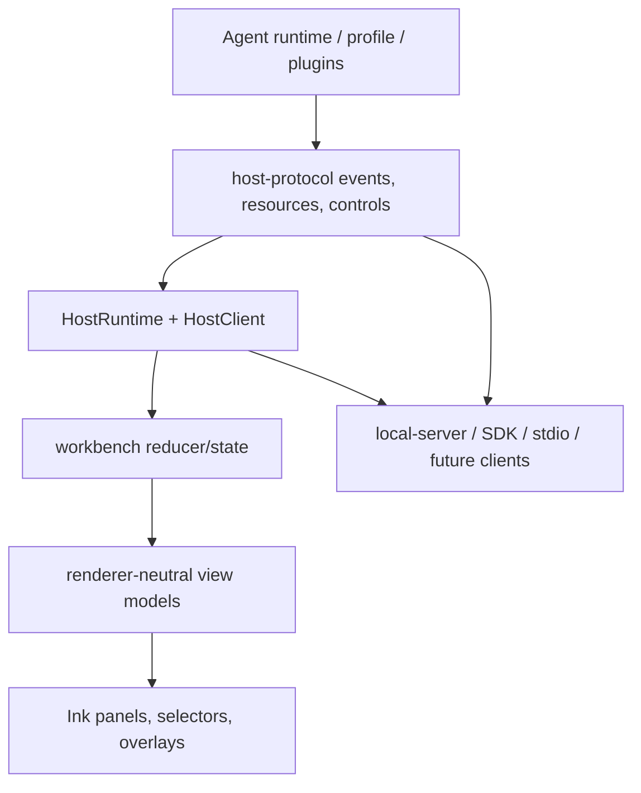
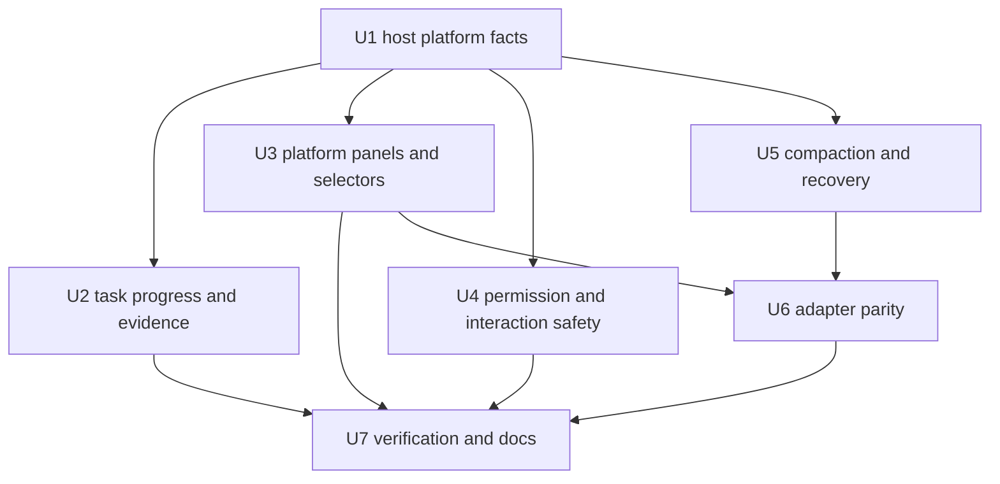
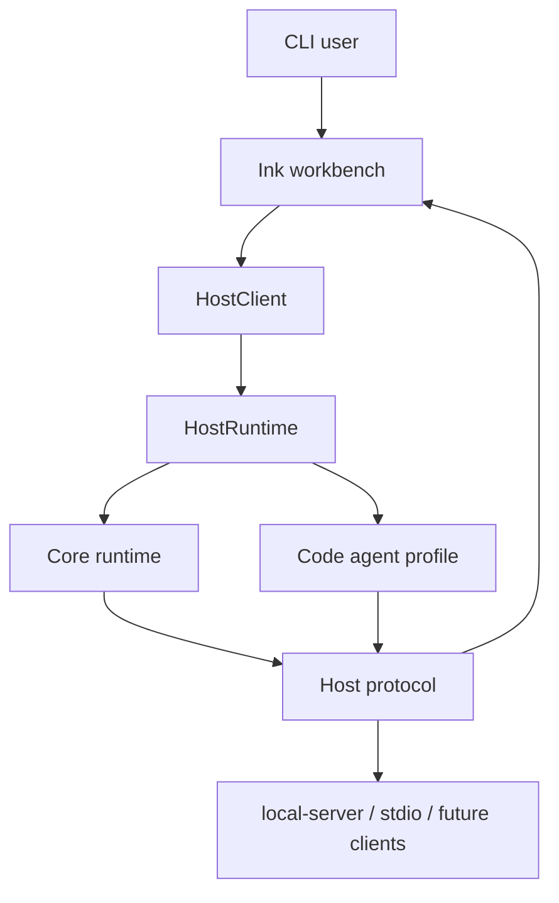

# feat: Claude Code 平台级 TUI 对齐

## Summary

本计划在现有 Ink workbench、HostClient、HostEvent reducer、code-task ledger、capability discovery 和 session/recovery 底座上补齐平台级 TUI parity。实现方式是先硬化 host/runtime 的 typed platform facts，再把任务进度、证据、权限、平台能力、compaction/recovery 和跨 adapter 语义投影为可监督的终端工作台体验。

---

## Problem Frame

Guga 已经有可工作的 TUI 基座和不少运行时事实，但用户体感仍可能停留在“流式 chat log + 若干 slash 输出”。上游需求要求 TUI 成为平台控制台：用户发起“实现这个功能”后，应能看见阶段、计划、证据、审批、恢复和平台状态，而不是靠阅读 assistant 文本判断 agent 是否真的完成。

---

## Assumptions

*本计划由上游 brainstorm 文档直接生成，没有再等待一次同步确认。以下是计划期推断，执行前可由 `ce-doc-review`、`ce-work` 或人工 review 重点审视。*

- 当前 `packages/cli/src/ink-workbench` 的 Ink-first 路线继续保留；本计划不引入第二套 terminal renderer。
- 当前 `packages/host-protocol`、`packages/host-runtime`、`packages/host-sdk`、`packages/host-local-server` 和 `packages/host-stdio` 是平台语义的共享边界；TUI 新行为应尽量从这些边界获得事实。
- 现有 `CodeTaskPlanResource.ledgerItems`、`ledgerSummary`、`VerificationAttemptResource`、`durability` 和 `recoveryOutcome` 是任务进度和证据的第一来源；如果执行期发现 profile 侧事件不够丰富，应优先补 profile/host fact，而不是让 UI 自己推断。
- 第一阶段 memory/agents/provider 偏“可见与可治理”，不实现完整 memory auto-write、credential pool、remote sandbox、swarm/team 或 IDE client。
- `/compact` 可以先落为 host-supported operation/control surface 与可见状态，不要求一次性实现完整 LLM-backed summarization 产品。

---

## Requirements

- R1-R6. TUI 必须展示可信 coding workflow：阶段、任务计划、当前条目、阻塞项、变更文件、验证结果、工作日志和完成标准都来自 runtime facts，而不是 assistant prose。
- R7-R12. TUI 必须成为平台控制表面：model/profile/session/tools/MCP/skills/permissions/memory/agents/status/compact/abort/resume/fork/task inspection 可发现、可操作，并展示 source、availability、risk、reason。
- R13-R15. 审批、安全和中断必须 fail-closed：permission/interaction overlay 不丢草稿，多个 pending 请求可见且有序，高风险文件/shell/git/external/MCP/memory/delegation 动作没有明确 allow 不执行。
- R16-R18. Compaction、overflow、resume、reload、fork、stream disconnect、failed tool、failed verification 等恢复路径必须可见，并恢复足够目标、计划、证据、队列和上下文状态。
- R19-R20. 所有 TUI 一等平台概念必须有 host/runtime typed counterpart，未来 desktop、IDE、ACP/LSP 和 stdio adapter 不需要解析终端字符串。

**Origin actors:** A1 CLI 用户；A2 Guga TUI 工作台；A3 Host protocol / HostClient；A4 Agent runtime 与一方插件；A5 未来 client adapter。

**Origin flows:** F1 功能实现监督；F2 平台能力发现与控制；F3 不打断心流的审批；F4 上下文压力、compaction 与恢复；F5 跨 client 的平台语义。

**Origin acceptance examples:** AE1 coding task 阶段/计划/证据可见；AE2 权限请求保留输入草稿；AE3 command palette/platform view 来自 host capabilities；AE4 高风险动作 fail-closed；AE5 compaction 后目标/计划/证据仍可见；AE6 reload/resume 后恢复状态明确；AE7 future adapter 复用同一语义状态。

---

## Scope Boundaries

- 不复制 Claude Code 的视觉设计、精确命令名或私有实现模型。
- 不实现完整 IDE、LSP、ACP、desktop 或 web client；只确保 host semantics 对这些 future client 可复用。
- 不实现 provider credential pool、remote sandbox backend、marketplace、enterprise policy console 或 hosted collaboration。
- 不把 hidden chain-of-thought 渲染到 TUI；只能展示 provider/runtime 明确暴露的 reasoning/status signal。
- 不把每个 skill 都变成 tool，也不把 delegation 扩展成 swarm/team。第一阶段只做可发现、可治理、coordinator-ready 的 platform surface。
- 不提交生成的 `packages/*/dist/` 输出。

### Deferred to Follow-Up Work

- 完整 desktop/IDE/ACP/LSP adapter UI：本计划只硬化 host semantics 和 stdio/local-server 映射。
- 完整 memory authoring/review UI：本计划只展示 governed memory 的 available/retrieved/injected/blocked 状态入口。
- 完整 shell output inspector、diff inspector、artifact inspector 和 long-output viewer：本计划只要求可扫描摘要与跳转入口。
- 完整 credential pool、真实 provider health probe、remote sandbox 和 worktree isolation policy：这些需要独立运维/安全计划。
- 多 agent swarm/team/background agents：本计划只承接现有 delegation/coordinator 表面。

---

## Context & Research

### Relevant Code and Patterns

- `packages/cli/src/ink-workbench/app.tsx` 已负责 Ink app 组合、focus routing、slash/selector/prompt/permission/interaction 输入路径。
- `packages/cli/src/ink-workbench/controller.ts` 已通过 `HostClient` 启动 run、stream events、queue input、abort、reload，并避免 UI 直接调用 runtime 私有方法。
- `packages/cli/src/workbench/event-reducer.ts`、`state.ts`、`views.ts` 已把 `HostEvent` 投影为 transcript/status/welcome/active task/pending permission。
- `packages/cli/src/workbench/commands.ts` 已覆盖 `/model`、`/profile`、`/resume`、`/tools`、`/mcp`、`/skills`、`/permissions`、`/status`、`/tasks`、`/abort`，但多半还是 command-output 字符串。
- `packages/host-protocol/src/events.ts` 和 `resources.ts` 已有 run/task/verification/permission/interaction/queue/context/usage/capability/recovery 相关类型，是新增 TUI fact 的第一落点。
- `packages/host-runtime/src/host-runtime.ts` 已把 task facts 存到 `InMemoryRunStore`，并对 task/verification event 尝试 durable append；它也是 status/capability/session/task resource 的聚合边界。
- `packages/profile-code-agent/src/task/contracts.ts` 已定义 `ledgerItems`、evidence refs、verification attempts 和 completion validation；任务进度应优先复用这里的 settlement contract。
- `packages/host-sdk/src/client.ts`、`packages/host-local-server/src/routes.ts`、`packages/host-stdio/src/index.ts` 已形成 local HTTP/SSE/SDK/stdio adapter 边界，适合防止 TUI-only 语义漂移。

### Institutional Learnings

- `docs/solutions/architecture-patterns/host-ui-protocol-v1.md` 明确 renderer 是 HostClient consumer，REST/resources/control 是 command surface，SSE/HostEvents 是 observation surface。
- `.trellis/spec/frontend/state-management.md` 要求 runtime facts 来自 host/runtime，UI 只保留 derived/local state，不把 chat messages 当唯一状态。
- `.trellis/spec/frontend/type-safety.md` 要求前端复用 host-protocol types，使用 discriminated unions 和 exhaustive switches，不能复制并行协议。
- `.trellis/spec/backend/quality-guidelines.md` 要求 side-effecting tools 经过 `ExecutionPipeline` 和 `PermissionKernel`，capability discovery 输出 serializable descriptors。
- `docs/solutions/architecture-patterns/tool-permission-runtime.md` 要求权限、环境 gate、tool result evidence 和多来源 tool governance 统一在 runtime authority path。
- `docs/solutions/architecture-patterns/code-agent-profile.md` 要求 coding-specific 行为留在 profile 包，core 保持 role-neutral。

### External References

- 未新增外部 research。当前计划依赖本仓库已提交的 reference research、requirements 文档和本地代码模式；额外查询 Ink/React 或 Claude Code 最新资料不会改变本轮实施拆分。

---

## Key Technical Decisions

- **Protocol-first:** 新 TUI 状态先在 `host-protocol`/`host-runtime`/`HostClient` 中成为 typed event/resource/control，再进入 reducer/view/component。
- **Extend current Ink workbench:** 保留现有 `controller -> reducer -> view model -> Ink components` 路径，不引入第二套 state store 或 renderer。
- **Task progress is evidence-settled:** 计划条目的完成感来自 ledger/evidence/verification/completion criteria，不从 assistant 文本推断。
- **Command output evolves into panels:** 现有 slash command 继续可用，但 platform surfaces 应逐步拥有 renderer-neutral view model 和 Ink panel/selector，而不是只拼接字符串。
- **Permission remains special:** permission 不是普通 interaction；它承载安全/audit 语义，pending、resolution、cancel/timeout、non-interactive 情况都必须 fail-closed。
- **Compaction/recovery is visible state, not hidden retry:** compact/reload/resume/fork 的可用性、保留内容、降级状态和恢复动作必须从 host facts 显示。
- **Adapter parity is a test target:** 每个新的一等平台概念都要检查 SDK/local-server/stdio 是否能消费或明确降级，防止 TUI-only 行为。

---

## Open Questions

### Resolved During Planning

- 是否要重写 TUI renderer？不。现有 Ink workbench 已有输入、focus、selector、transcript 和测试基座，本计划扩展它。
- 是否需要外部文档 research？不。该工作主要是 repo-local contracts 和 UX projection，对库 API 的不确定性很低。
- 是否把平台 parity 一次性扩展到 IDE/desktop？不。本计划只要求 host semantics 复用，不实现新 client。
- 是否把 memory/delegation/provider 运维全做完？不。第一阶段以可见、可治理、可发现为目标，完整运维能力另行计划。
- 是否允许 TUI 解析 assistant 文本来判断任务完成？不。R5/R19 明确禁止，必须依赖 typed facts。

### Deferred to Implementation

- 精确 HostEvent/resource 字段命名：实现时选择最小 additive shape，并保持现有消费者兼容。
- 精确 panel 分组和快捷键：先保证 renderer-neutral view model 和测试覆盖，具体 Ink 布局可在实现期微调。
- Memory “retrieved/injected/blocked” 的第一批数据来源：实现期以现有 memory plugin/capability/context events 为准，不足处显式显示 unavailable。
- `/compact` 的首轮行为：实现期可先支持 host operation 与 visible state，再逐步接入更完整 compaction policy。
- Provider health 的真实性：现有 health 为 unknown/not-run；真实健康检查和 fallback policy 属于后续 provider 运维计划。

---

## High-Level Technical Design

> *This illustrates the intended approach and is directional guidance for review, not implementation specification. The implementing agent should treat it as context, not code to reproduce.*

The invariant: TUI renders platform facts; it does not invent platform facts. When the UI needs a new truth, add it to the host/runtime contract or expose it as an explicit unavailable/degraded state.

---

## Implementation Units

- U1. **Host platform facts and controls**

**Goal:** 补齐平台级 TUI 需要的一等 host facts/control surfaces，让 task、capability、memory、agents、status、compact 和 recovery 都能通过 typed protocol 表达。

**Requirements:** R7-R12, R16-R20; F2, F4, F5; AE3, AE5, AE6, AE7.

**Dependencies:** None.

**Files:**
- Modify: `packages/host-protocol/src/events.ts`
- Modify: `packages/host-protocol/src/resources.ts`
- Modify: `packages/host-protocol/src/index.ts`
- Modify: `packages/host-runtime/src/host-runtime.ts`
- Modify: `packages/host-runtime/src/event-projector.ts`
- Modify: `packages/host-sdk/src/client.ts`
- Modify: `packages/host-local-server/src/routes.ts`
- Test: `packages/host-protocol/src/events.test.ts`
- Test: `packages/host-protocol/src/resources.test.ts`
- Test: `packages/host-runtime/src/host-runtime.test.ts`
- Test: `packages/host-sdk/src/client.test.ts`
- Test: `packages/host-local-server/src/server.test.ts`

**Approach:**
- Audit current `HostEvent` and resources against origin R7-R20; add only missing additive fields/events/resources.
- Promote platform view data into serializable resources: task progress/evidence, capability source/availability/risk, memory governance state, delegation/coordinator state, compact/recovery availability, provider/model/session status.
- Add host controls only where runtime can honor them safely; unsupported controls must return structured unavailable/degraded state rather than pretending success.
- Update SDK/local-server only for the minimum methods/resources needed to make the new host contract consumable; U6 performs the later adapter-wide parity sweep.
- Keep `HOST_PROTOCOL_FEATURES` as the discovery point for new host-level semantics so future clients can fail fast or degrade gracefully.

**Patterns to follow:**
- `packages/host-protocol/src/resources.ts` existing `CodeTaskResource`, `OperationalStatusResource`, `CapabilityResource`, `RecoveryPolicyOutcomeResource`.
- `packages/host-runtime/src/host-runtime.ts` existing resource aggregation and durable host fact handling.
- `docs/solutions/architecture-patterns/host-ui-protocol-v1.md` REST/resource/control vs event stream split.

**Test scenarios:**
- Happy path: host protocol can serialize new platform facts without breaking existing event union and protocol feature discovery.
- Happy path: `HostRuntime.getOperationalStatus()` returns platform capability/status facts with source and unavailable reasons.
- Edge case: unsupported compact or memory injection state appears as unavailable/degraded, not as a successful action.
- Error path: local-server rejects invalid new control payloads with structured errors and does not mutate runtime state.
- Integration: SDK can read the new resource/control surface and local-server exposes the same JSON shape.

**Verification:**
- Protocol, runtime, SDK, and local-server tests prove platform facts are typed before any TUI rendering consumes them.

---

- U2. **Task progress, evidence, and completion projection**

**Goal:** Make the TUI show a trustworthy coding-task progress surface: phase, plan items, current item, blockers, changed files, verification, evidence, and completion criteria.

**Requirements:** R1-R6, R18-R20; F1, F4, F5; AE1, AE5, AE6, AE7.

**Dependencies:** U1.

**Files:**
- Modify: `packages/cli/src/workbench/state.ts`
- Modify: `packages/cli/src/workbench/event-reducer.ts`
- Modify: `packages/cli/src/workbench/views.ts`
- Modify: `packages/cli/src/ink-workbench/app.tsx`
- Create: `packages/cli/src/ink-workbench/components/task-progress-panel.tsx`
- Modify: `packages/profile-code-agent/src/task/contracts.ts`
- Modify: `packages/profile-code-agent/src/task/controller.ts`
- Modify: `packages/profile-code-agent/src/task/host-runtime.ts`
- Test: `packages/cli/src/workbench/event-reducer.test.ts`
- Test: `packages/cli/src/workbench/views.test.ts`
- Test: `packages/cli/src/ink-workbench/app.test.tsx`
- Test: `packages/profile-code-agent/src/task/contracts.test.ts`
- Test: `packages/profile-code-agent/src/task/controller.test.ts`
- Test: `packages/profile-code-agent/src/task/host-runtime.test.ts`

**Approach:**
- Extend `ActiveTaskProjection` and view models to include ledger item rows, completion criteria, evidence summaries, durability/recovery indicators, and last verification status.
- Render task progress as a stable panel near status/transcript, not only as a status-bar substring or `/tasks` output.
- Preserve reducer authority: task state updates only through `task.*` and `verification.*` HostEvents/resources.
- If profile-code-agent lacks a fact needed for evidence-settled UI, add that fact at the task/controller/host-runtime boundary rather than deriving it from assistant text.
- Display skipped/failed/unavailable verification as explicit incomplete or degraded completion state.

**Execution note:** Add reducer/view tests before Ink component work so UI polish cannot accidentally redefine task semantics.

**Patterns to follow:**
- `packages/cli/src/workbench/event-reducer.ts` existing task/verification reductions.
- `packages/cli/src/workbench/views.ts` renderer-neutral `WorkbenchViewModel`.
- `packages/profile-code-agent/src/task/contracts.ts` ledger validation and completion evidence rules.

**Test scenarios:**
- Covers AE1. Happy path: task created -> planning -> executing -> verifying -> completed events render active phase, plan rows, current item, changed-file evidence, passing verification, and completion criteria.
- Covers AE1/R5. Error path: assistant final text claims completion but no `task.completed`/verification evidence exists; task panel remains incomplete.
- Covers AE5. Edge case: task resource marks durability or recovery as degraded after compaction; panel shows preserved objective and degraded state.
- Covers AE6. Integration: reload/reduce from a historical event list reconstructs objective, current plan item, evidence, pending verification, and task state.
- Error path: failed required verification keeps completion criteria visible and task not trusted complete.

**Verification:**
- Reducer/view/Ink tests prove progress is understandable from typed facts and survives replay/reload.

---

- U3. **Platform panels, command palette, and selectors**

**Goal:** Evolve slash command output into a platform workbench surface for models, profiles, sessions, tools, MCP, skills, permissions, memory, agents/delegation, status, compact, abort, resume, fork, and task inspection.

**Requirements:** R7-R12, R19-R20; F2, F5; AE3, AE7.

**Dependencies:** U1.

**Files:**
- Modify: `packages/cli/src/workbench/commands.ts`
- Modify: `packages/cli/src/workbench/model-control.ts`
- Modify: `packages/cli/src/workbench/session-control.ts`
- Modify: `packages/cli/src/workbench/views.ts`
- Modify: `packages/cli/src/ink-workbench/slash-state.ts`
- Modify: `packages/cli/src/ink-workbench/selector-state.ts`
- Modify: `packages/cli/src/ink-workbench/app.tsx`
- Modify: `packages/cli/src/ink-workbench/components/slash-palette.tsx`
- Modify: `packages/cli/src/ink-workbench/components/selector-overlay.tsx`
- Create: `packages/cli/src/ink-workbench/components/platform-panel.tsx`
- Test: `packages/cli/src/workbench/commands.test.ts`
- Test: `packages/cli/src/workbench/views.test.ts`
- Test: `packages/cli/src/ink-workbench/slash-state.test.ts`
- Test: `packages/cli/src/ink-workbench/selector-state.test.ts`
- Test: `packages/cli/src/ink-workbench/app.test.tsx`

**Approach:**
- Keep slash commands as the entry vocabulary, but let inspect-style commands return structured view data where possible.
- Add renderer-neutral platform view models for capability lists, status summary, session tree/resume, model/provider alternatives, memory state, and agents/delegation state.
- Reuse selector overlays for choices that produce commands (`/model`, `/profile`, `/resume`, `/login`) and add panel rendering for inspection commands (`/status`, `/tools`, `/mcp`, `/skills`, `/permissions`, `/tasks`, memory/agents views).
- Show source, availability, disabled reason, trust/risk posture, and “applies now/next turn/new session” semantics for choices.
- Keep command-output fallback for surfaces whose typed view is not ready, but mark it as degraded/unavailable rather than static help.

**Patterns to follow:**
- `WORKBENCH_SLASH_COMMAND_METADATA` for command discovery.
- `SelectorState` and `createCommandSelectorOptions` for command-producing selectors.
- `formatCapabilities()` as a temporary data source to replace with structured view models.

**Test scenarios:**
- Covers AE3. Happy path: opening `/tools`, `/mcp`, `/skills`, `/permissions`, and `/status` renders host capability/status facts with source and reason.
- Happy path: `/model` selector distinguishes active, available, unavailable, and restart/next-session semantics.
- Edge case: empty capability list renders “none/unavailable” state without implying a host failure.
- Error path: HostClient resource failure appears as structured command error and does not corrupt active transcript/task state.
- Integration: a session tree with active branch, last run state, and task state is discoverable through `/resume` or session panel.

**Verification:**
- Command/view/component tests prove platform surfaces are data-driven and scan-friendly.

---

- U4. **Permission, interaction, and interruption safety**

**Goal:** Make approvals feel safe and uninterrupted: focused overlay, preserved draft, ordered pending requests, clear risk/scope/source, and fail-closed behavior for high-risk actions.

**Requirements:** R13-R15, R4, R8, R14, R19-R20; F3, F5; AE2, AE4, AE7.

**Dependencies:** U1.

**Files:**
- Modify: `packages/host-protocol/src/resources.ts`
- Modify: `packages/host-runtime/src/host-runtime.ts`
- Modify: `packages/core/src/contracts/tool-runtime.ts`
- Modify: `packages/core/src/permissions/permission-kernel.ts`
- Modify: `packages/cli/src/workbench/state.ts`
- Modify: `packages/cli/src/workbench/event-reducer.ts`
- Modify: `packages/cli/src/workbench/views.ts`
- Modify: `packages/cli/src/ink-workbench/app.tsx`
- Modify: `packages/cli/src/ink-workbench/focus-state.ts`
- Modify: `packages/cli/src/ink-workbench/prompt-state.ts`
- Create: `packages/cli/src/ink-workbench/components/permission-overlay.tsx`
- Test: `packages/core/src/contracts/contracts.test.ts`
- Test: `packages/core/src/permissions/permission-kernel.test.ts`
- Test: `packages/host-runtime/src/host-runtime.test.ts`
- Test: `packages/cli/src/workbench/event-reducer.test.ts`
- Test: `packages/cli/src/workbench/views.test.ts`
- Test: `packages/cli/src/ink-workbench/focus-state.test.ts`
- Test: `packages/cli/src/ink-workbench/prompt-state.test.ts`
- Test: `packages/cli/src/ink-workbench/app.test.tsx`

**Approach:**
- Extend permission resources/view models to carry action, target, source capability, risk/effect/scope, and allowed decisions when runtime metadata is available.
- Replace single pending permission/interaction projection with an ordered pending queue while keeping one focused item for input routing.
- Preserve `preservedEditor` semantics when entering/exiting approval overlays; never drop drafts during permission/interaction focus changes.
- Keep permission resolution host-owned; UI only submits `PermissionResolution` decisions.
- Ensure abort/cancel/disconnect cancels or locks pending requests without granting access.
- For non-interactive/unavailable contexts, make ask-required permission deny/blocked visible and structured.

**Execution note:** Characterize current draft-preservation tests before changing pending state shape; these are easy to regress.

**Patterns to follow:**
- `retargetPrompt()` draft preservation in `packages/cli/src/ink-workbench/app.tsx`.
- `cancelPendingRunState()` fail-closed cancellation in `packages/host-runtime/src/host-runtime.ts`.
- `docs/solutions/architecture-patterns/tool-permission-runtime.md` Action OS metadata and permission authority path.

**Test scenarios:**
- Covers AE2. Happy path: user has a prompt draft, permission arrives, overlay captures response, resolution is sent, draft returns unchanged.
- Covers AE4. Error path: ask-required high-risk shell/git/filesystem action in a non-interactive path does not execute and produces denied/blocked state.
- Edge case: two pending permissions arrive; UI preserves order, focuses one, and leaves both visible with run association.
- Edge case: Escape while permission is focused does not abort the active run or grant permission.
- Integration: aborting a run cancels pending queue, permissions, and interactions before terminal run cancellation is projected.

**Verification:**
- Host/runtime and Ink tests prove approvals are safe, ordered, and draft-preserving.

---

- U5. **Compaction, recovery, reload, and resume continuity**

**Goal:** Make context pressure, manual/auto compact, overflow recovery, reload, resume, fork, stream disconnect, failed tool, rejected permission, and failed verification visible and recoverable.

**Requirements:** R16-R18, R1-R6, R19-R20; F4, F5; AE5, AE6, AE7.

**Dependencies:** U1, U2, U4.

**Files:**
- Modify: `packages/core/src/contracts/context.ts`
- Modify: `packages/core/src/context/compaction-service.ts`
- Modify: `packages/core/src/context/reinjection-service.ts`
- Modify: `packages/core/src/persistence/session-replay.ts`
- Modify: `packages/core/src/persistence/interruption-detector.ts`
- Modify: `packages/host-protocol/src/events.ts`
- Modify: `packages/host-protocol/src/resources.ts`
- Modify: `packages/host-runtime/src/host-runtime.ts`
- Modify: `packages/cli/src/workbench/commands.ts`
- Modify: `packages/cli/src/workbench/event-reducer.ts`
- Modify: `packages/cli/src/workbench/views.ts`
- Modify: `packages/cli/src/ink-workbench/controller.ts`
- Modify: `packages/host-stdio/src/index.ts`
- Test: `packages/core/src/context/compaction-service.test.ts`
- Test: `packages/core/src/context/reinjection-service.test.ts`
- Test: `packages/core/src/persistence/session-replay.test.ts`
- Test: `packages/core/src/persistence/interruption-detector.test.ts`
- Test: `packages/host-runtime/src/host-runtime.test.ts`
- Test: `packages/cli/src/workbench/event-reducer.test.ts`
- Test: `packages/cli/src/ink-workbench/controller.test.ts`
- Test: `packages/host-stdio/src/index.test.ts`

**Approach:**
- Add visible state transitions for compact requested/started/completed/failed/reinjected where current contracts lack them.
- Implement `/compact` as a host-owned command path when runtime supports it; otherwise return a structured unavailable state with reason.
- Make `context.compacted` include enough preserved/summarized/degraded facts for TUI to show what survived.
- Ensure reload reconstructs task, queue, pending permission, evidence, and context status from event/resource snapshots.
- Extend resume/fork status with recovery hints and degraded/blocked reasons from replay/interruption facts where available.
- Keep compaction summary below system/developer authority and distinguish reinjected context from durable truth.

**Patterns to follow:**
- `packages/core/src/context/compacted-projection.ts` and `packages/core/src/context/reinjection-service.ts` for compact/reinjection semantics.
- `packages/cli/src/ink-workbench/controller.ts` current `/reload` event replay path.
- `packages/host-stdio/src/index.ts` existing `compact` reserved command mapping.

**Test scenarios:**
- Covers AE5. Happy path: context pressure triggers compaction; next state shows objective, active plan item, retained evidence, and compact completeness/degradation.
- Covers AE6. Happy path: stream disconnect then `/reload` replays events and restores task/progress/pending state.
- Error path: compact failure shows recoverable/blocked state without losing current objective or pending permission.
- Error path: rejected permission and failed verification surface as recovery decisions, not generic failed transcript text.
- Integration: stdio adapter maps compact/recovery events or returns explicit unsupported state without breaking JSONL protocol.

**Verification:**
- Core/host/CLI tests prove recovery state is visible, conservative, and replayable.

---

- U6. **Cross-adapter semantic parity**

**Goal:** Ensure the platform concepts made first-class in TUI are also consumable by SDK, local-server, stdio, and future clients without scraping terminal output.

**Requirements:** R19-R20, R7-R18; F5; AE7.

**Dependencies:** U1, U3, U5.

**Files:**
- Modify: `packages/host-sdk/src/client.ts`
- Modify: `packages/host-local-server/src/routes.ts`
- Modify: `packages/host-local-server/src/sse.ts`
- Modify: `packages/host-stdio/src/index.ts`
- Modify: `packages/cli/src/render/events.ts`
- Modify: `packages/cli/src/commands/run.ts`
- Test: `packages/host-sdk/src/client.test.ts`
- Test: `packages/host-local-server/src/server.test.ts`
- Test: `packages/host-stdio/src/index.test.ts`
- Test: `packages/cli/src/run.test.ts`

**Approach:**
- For each new host event/resource/control in U1-U5, audit SDK, local-server, stdio, and headless render for parity after the feature units land.
- Fill any adapter gaps that were intentionally left out of U1's minimum contract pass.
- Map stdio events to Pi-compatible names where a reasonable adapter concept exists; otherwise expose explicit unsupported/degraded command results.
- Keep headless `guga run` event rendering readable for new progress/permission/compact/recovery facts.
- Add protocol compatibility tests so future clients can feature-detect platform parity support.

**Patterns to follow:**
- `packages/host-sdk/src/client.test.ts` shared protocol contract tests.
- `packages/host-local-server/src/server.test.ts` local HTTP/SSE integration tests.
- `packages/host-stdio/src/index.ts` adapter-only event translation.

**Test scenarios:**
- Covers AE7. Happy path: SDK/local-server consumers can render the same task progress and permission state as TUI from resources/events.
- Happy path: stdio maps task/progress/compact/recovery facts to adapter events or explicit unsupported results.
- Error path: unknown protocol feature or unsupported control fails with structured error, not terminal-specific text.
- Integration: headless debug output includes task/permission/recovery events without importing Ink.

**Verification:**
- Adapter tests prove TUI parity semantics are host-level, not terminal-only.

---

- U7. **Verification matrix, documentation, and rollout guardrails**

**Goal:** Provide the acceptance matrix, docs, and guardrails needed for implementers to land the parity work safely without drifting beyond scope.

**Requirements:** R1-R20; F1-F5; AE1-AE7.

**Dependencies:** U2, U3, U4, U5, U6.

**Files:**
- Modify: `packages/cli/README.md`
- Modify: `docs/roadmap.md`
- Create: `docs/eval/claude-code-platform-tui-parity-verification.md`
- Modify: `packages/cli/src/workbench/dependency-boundary.test.ts`
- Modify: `packages/host-runtime/src/dependency-boundary.test.ts`
- Test: `packages/cli/src/ink-workbench/workbench-smoke.test.tsx`

**Approach:**
- Document the platform TUI surfaces, their host facts, and what remains unavailable/deferred.
- Create an AE-to-test verification matrix linking AE1-AE7 to unit/integration/smoke coverage.
- Add dependency-boundary assertions where needed so workbench packages keep renderer/runtime boundaries clean.
- Add a mock coding-task smoke scenario that exercises progress, permission, verification, and recovery-facing state without requiring a real provider.
- Document manual verification for an optional real-provider run as non-CI guidance.

**Patterns to follow:**
- Existing `packages/cli/README.md` CLI/TUI documentation style.
- Existing dependency boundary tests in `packages/cli/src/workbench/dependency-boundary.test.ts` and `packages/host-runtime/src/dependency-boundary.test.ts`.

**Test scenarios:**
- Happy path: verification matrix names each AE and points to at least one concrete automated or manual check.
- Edge case: docs explicitly mark unavailable/deferred platform capabilities rather than implying full Claude Code parity.
- Integration: mock workbench smoke proves a coding-task supervision path can render task progress, permission prompt, verification evidence, and completion.

**Verification:**
- Docs and tests make the parity claim auditable by future `ce-work`, PR review, and manual dogfood.

---

## System-Wide Impact

- **Interaction graph:** User input flows through Ink prompt/focus state into `WorkbenchController`, then `HostClient`, then HostRuntime/core/profile; status returns through HostEvents/resources into reducer/view models/components.
- **Error propagation:** Runtime/provider/tool/permission/compact failures must become structured host events/resources and command errors; UI components should not catch raw runtime exceptions as product state.
- **State lifecycle risks:** Pending permissions, queued input, active task, compaction state, and reload/replay can all cross run boundaries; stale stream updates must not mutate a resumed/forked session incorrectly.
- **API surface parity:** New TUI concepts affect `host-protocol`, SDK, local-server, stdio, headless render, and future adapters.
- **Integration coverage:** Unit tests must be paired with at least one HostRuntime/HostClient/Ink smoke path because reducer-only tests cannot prove typed facts traverse the whole stack.
- **Unchanged invariants:** Core remains role-neutral; code-task semantics remain in `profile-code-agent`; permission remains runtime-owned; generated `dist` output remains untouched.

---

## Risks & Dependencies

| Risk | Mitigation |
|------|------------|
| TUI starts inferring task truth from assistant text | Add reducer/view tests where assistant text claims completion without typed evidence and UI remains incomplete |
| Host protocol grows too broad | Prefer additive, minimal resources/events and mark unavailable states explicitly |
| Permission UX regresses draft preservation | Characterize existing draft-preservation tests before changing pending queue shape |
| `/compact` overpromises before runtime support is ready | Implement structured unavailable/degraded states and only enable controls backed by host behavior |
| Platform panels duplicate command-output formatters | Move reusable data into renderer-neutral view models; keep formatters as fallback only |
| Adapter parity lags behind TUI | Make SDK/local-server/stdio tests part of each unit that introduces host semantics |
| Plan scope drifts into full Claude Code clone | Preserve Scope Boundaries and defer IDE/desktop/swarm/credential/sandbox products |

---

## Alternative Approaches Considered

- **TUI-only implementation:** Rejected because R19-R20 require future adapters to reuse semantics; terminal-only strings would recreate the current gap.
- **New renderer or separate UI state store:** Rejected because current Ink workbench already has the right HostClient/reducer boundary and tests.
- **Single giant platform panel first:** Rejected because task progress, approvals, recovery, and capability surfaces have different authority/risk profiles and need separate tests.
- **Full platform backend before TUI:** Rejected for this iteration; many host facts already exist, and user trust improves fastest by projecting them clearly while adding missing typed gaps.

---

## Phased Delivery

### Phase 1: Host facts before UI truth
- Land U1 and the protocol/resource tests.
- Keep TUI unchanged except where tests need minimal consumers.

### Phase 2: Trust anchors in the TUI
- Land U2 and U4 so coding-task progress and approvals become reliable.
- Dogfood with mock code-task scenarios before expanding platform panels.

### Phase 3: Platform workbench surface
- Land U3 and U5, turning slash/status/capability/recovery into visible panels and controls.
- Keep unsupported capabilities visibly unavailable rather than hidden.

### Phase 4: Cross-adapter parity and docs
- Land U6 and U7, update docs and verification matrix, and run full package checks.

---

## Documentation / Operational Notes

- Update `packages/cli/README.md` with the platform TUI surfaces, supported commands, permission response behavior, reload/resume guidance, and deferred capabilities.
- Update `docs/roadmap.md` to connect this plan to prior M42 TUI, long-task runtime, Context Attention OS, Tool Action OS, memory, provider, and delegation plans.
- Keep optional real-provider smoke manual and environment-gated; CI should rely on mock providers and in-memory/local fixtures.
- Do not document unsupported Claude Code private behavior as a Guga promise.

---

## Implementation Notes

本轮实现完成了 Phase 1-4 的首批可交付竖切，重点是让平台事实可见、可测试、可被非 TUI adapter 复用，而不是一次性补完所有 Claude Code 私有能力。

已完成：
- Host protocol/runtime 新增 `platform-surfaces` feature，并在 `OperationalStatusResource.platform` 暴露 model/profile/session/tool/MCP/skill/permission/memory/agent/status/compact/abort/resume/fork/task surfaces。
- TUI 新增 task progress、platform panel、permission overlay、continuity panel；这些面板全部来自 typed state/resource/event，不解析 assistant 文本。
- Slash inspection 命令 `/status`、`/tools`、`/mcp`、`/skills`、`/permissions`、`/tasks` 返回结构化 panel data，同时保留旧 message/data。
- Permission overlay 显示 risk/scope/input/reason，并保持未知审批输入 fail-closed。
- `context.compacted`、stream disconnect/reload、session new/resume/fork 投影到 continuity state，明确显示保留事实和恢复提示。
- SDK/local-server status contract 验证 platform surfaces；stdio adapter 映射 task/verification/compaction events，并对 `compact` command 返回结构化 unsupported。

仍显式 deferred：
- `/compact` 仍是 unavailable/unsupported，等待 host-owned compaction control。
- Memory 默认 `autoInject=false`、`autoWrite=false`；只显示能力和 policy，不自动写入。
- Multi-agent 只暴露 coordinator readiness/agent capability facts，不实现 swarm。
- Provider fallback、真实健康检查、prompt cache、credential pool 不在本轮实现。
- IDE/LSP/ACP/desktop adapter 尚未新增入口，本轮只保证 host semantics 可复用。

## Verification Matrix

| Acceptance Example | 覆盖方式 | 代表检查 |
|--------------------|----------|----------|
| AE1 coding task 阶段/计划/证据可见 | reducer/view/Ink task progress tests | `pnpm --filter @guga-agent/cli test` |
| AE2 审批不丢草稿 | 既有 draft preservation test + permission overlay test | `packages/cli/src/ink-workbench/app.test.tsx` |
| AE3 command palette/platform view 来自 host capabilities | structured command panel + Ink platform panel tests | `packages/cli/src/workbench/commands.test.ts` |
| AE4 高风险动作 fail-closed | unknown permission response does not call host API | `packages/cli/src/ink-workbench/controller.test.ts` |
| AE5 compact 后目标/计划/证据仍可见 | `context.compacted` continuity projection test | `packages/cli/src/workbench/event-reducer.test.ts` |
| AE6 reload/resume 后恢复状态明确 | `/reload` continuity test + session continuity action | `packages/cli/src/ink-workbench/controller.test.ts` |
| AE7 future adapter 复用同一语义状态 | SDK/local-server status contract + stdio task/verification/compact mapping | `pnpm --filter @guga-agent/host-sdk test`; `pnpm --filter @guga-agent/host-local-server test`; `pnpm --filter @guga-agent/host-stdio test` |

---

## Sources & References

- **Origin document:** [docs/brainstorms/2026-06-10-claude-code-platform-tui-parity-requirements.md](docs/brainstorms/2026-06-10-claude-code-platform-tui-parity-requirements.md)
- Related plan: [docs/plans/2026-05-28-042-feat-ink-tui-workbench-plan.md](docs/plans/2026-05-28-042-feat-ink-tui-workbench-plan.md)
- Related plan: [docs/plans/2026-05-30-001-feat-super-long-code-task-runtime-plan.md](docs/plans/2026-05-30-001-feat-super-long-code-task-runtime-plan.md)
- Related plan: [docs/plans/2026-06-03-001-feat-context-attention-os-plan.md](docs/plans/2026-06-03-001-feat-context-attention-os-plan.md)
- Related plan: [docs/plans/2026-06-03-002-feat-tool-manager-action-os-plan.md](docs/plans/2026-06-03-002-feat-tool-manager-action-os-plan.md)
- Related code: `packages/cli/src/ink-workbench/app.tsx`
- Related code: `packages/cli/src/workbench/event-reducer.ts`
- Related code: `packages/cli/src/workbench/views.ts`
- Related code: `packages/cli/src/workbench/commands.ts`
- Related code: `packages/host-protocol/src/events.ts`
- Related code: `packages/host-protocol/src/resources.ts`
- Related code: `packages/host-runtime/src/host-runtime.ts`
- Related code: `packages/profile-code-agent/src/task/contracts.ts`
- Related learning: `docs/solutions/architecture-patterns/host-ui-protocol-v1.md`
- Related learning: `docs/solutions/architecture-patterns/tool-permission-runtime.md`
- Related learning: `docs/solutions/architecture-patterns/code-agent-profile.md`
