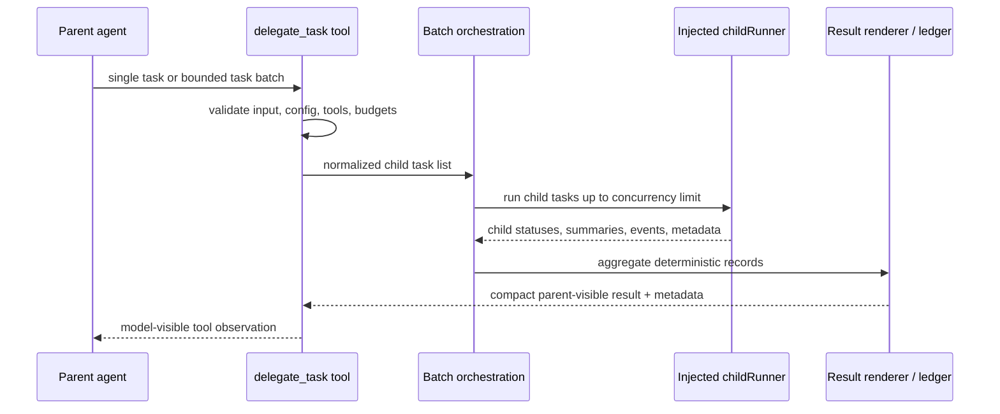
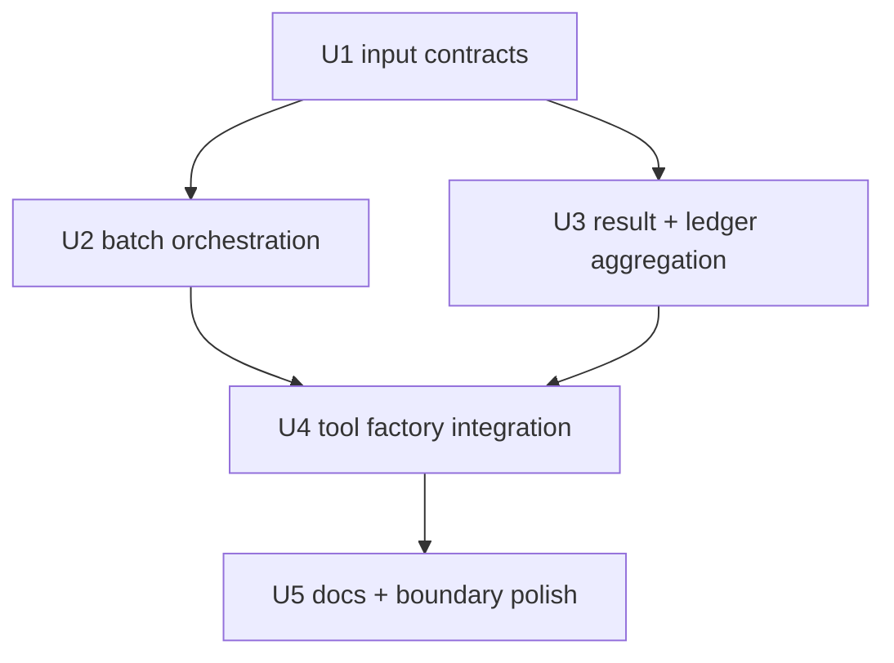

# feat: Multi-subagent delegation

## Summary

This plan upgrades `@guga-agent/plugin-tools-delegation` from single child-task delegation to bounded multi-child delegation while preserving the existing single-task tool path. It keeps core neutral, uses the current plugin/tool pipeline, and records P2 handoff/coordinator semantics as documentation and type-boundary guidance rather than implementation scope.

---

## Problem Frame

The existing M14 delegation slice proves Guga can expose `delegate_task` as a governed first-party tool with an injected child runner, isolated child input, compact results, and ledger helpers. The new requirements extend that substrate to multiple child tasks without turning delegation into swarm, workflow graph, or active-agent handoff.

---

## Requirements

- R1. Extend the existing `delegate_task` plugin surface into a first-party multi-subagent delegation capability without introducing a team, workflow, or group-chat runtime.
- R2. Support a bounded batch of multiple self-contained child tasks with deterministic maximum task count, deterministic concurrency limiting, and deterministic output ordering.
- R3. Preserve isolated child inputs: each child receives only its delegated goal, optional context, generated child instructions, and allowed tools.
- R4. Preserve default single-layer delegation by blocking recursive delegation tools for every child task in a batch.
- R5. Preserve least-privilege tool inheritance by intersecting each child task's allowlist with the current parent-visible catalog and the configured blocked set; the default blocked set must include recursive delegation, user clarification, memory mutation, and direct user-presentation capabilities where the catalog can identify them.
- R6. Give every child task its own budget, enforced timeout, cancellation state, status, run ID, session ID, task index, and optional task ID.
- R7. Return compact parent-visible results for both single and batch modes without injecting full child transcripts or large tool outputs; settled batch results must include compact child outcomes even when some children fail.
- R8. Preserve parent-child correlation and batch-level audit data through deterministic metadata and ledger records ordered by normalized task order.
- R9. Propagate parent cancellation to active children and report deterministic cancelled outcomes.
- R10. Surface validation diagnostics for invalid child runner, tool catalog, blocked tools, batch size, concurrency settings, oversized inputs, and malformed single or batch inputs.
- R11. Keep tests hermetic, using injected fake child runners and no network or real model calls.
- R12. Document handoff as a future active-agent control transfer, not a child-task result-return mechanism.
- R13. Preserve room for future handoff-capable specialist agents without making P1 delegation depend on handoff support.
- R14. Document coordinator mode as a future profile/runtime mode where the parent agent plans, delegates, interprets worker results, and synthesizes.
- R15. Preserve coordinator reuse of P1 child delegation without requiring P1 swarm, mailbox, shared task list, or worker-to-worker communication.
- R16. Keep naming and explanations distinct: delegation returns work to the parent, handoff changes who is active, and coordinator changes the parent role.
- R17. Keep implementation aligned with Guga's small-core strategy and avoid core contract changes unless strictly necessary.
- R18. Preserve artifact-friendly child output metadata without requiring a concrete artifact store.
- R19. Keep scope boundaries explicit enough that P2 work does not reinterpret P1 as swarm or workflow infrastructure.

**Origin actors:** A1 parent agent; A2 child agent; A3 runtime / host; A4 downstream planner / implementer; A5 user.

**Origin flows:** F1 multi-child delegation; F2 child result synthesis; F3 P2 handoff boundary; F4 P2 coordinator boundary.

**Origin acceptance examples:** AE1 bounded three-child delegation; AE2 child isolation and allowlist filtering; AE3 recursive delegation diagnostics; AE4 parent cancellation propagation; AE5 handoff is not a child summary; AE6 coordinator reuses P1 delegation later.

---

## Scope Boundaries

- Do not implement handoff or active-agent switching.
- Do not implement coordinator mode as a runtime/profile mode.
- Do not implement swarm teammates, team files, mailboxes, shared task lists, or worker-to-worker messaging.
- Do not introduce a workflow graph runtime or external graph dependency.
- Do not implement remote A2A adapter or remote agent discovery.
- Do not implement automatic worktree management.
- Do not expose child scratch transcripts as the default parent-visible result.
- Do not add generated `packages/*/dist/` output.

### Deferred to Follow-Up Work

- Real artifact-store integration for large child outputs: P1 should preserve reference-friendly metadata, but a concrete artifact plugin flow can land separately.
- Handoff-capable agent descriptors and active-agent switching: future P2 plan.
- Coordinator profile/mode: future P2 plan that can reuse P1 child delegation and result events.

---

## Context & Research

### Relevant Code and Patterns

- `packages/plugin-tools-delegation/src/delegate-task-tool.ts` already creates the model-visible `delegate_task` tool, validates single-task input, blocks recursive delegation tool names, selects child tools from a parent-visible catalog, builds compact child input, invokes an injected `childRunner`, and returns compact metadata.
- `packages/plugin-tools-delegation/src/delegation-types.ts` already defines single-task input/output, child runner request/result, catalog items, run records, ledgers, and validation diagnostics.
- `packages/plugin-tools-delegation/src/delegation-ledger.ts` already renders compact results, validates outputs, sorts event counts, and builds deterministic ledgers from run records.
- `packages/plugin-tools-delegation/src/delegate-task-tool.test.ts` already covers success, invalid input, recursion blocking, unavailable tools, child failure, metadata isolation, abort handling, deterministic ledgers, plugin registration, and config diagnostics.
- `packages/plugin-tools-delegation/src/runtime-integration.test.ts` already proves the plugin flows through runtime permission, execution pipeline, model-visible tool results, and headless tool filtering.
- `packages/core/src/tools/tool-scheduler.ts` currently serializes interactive/ask-default tools; delegation should manage child-level concurrency internally rather than relying on scheduler parallelism for one tool call.
- `packages/core/src/tools/execution-pipeline.ts` already handles schema validation, permissions, hooks, cancellation, result budgeting, and model-visible tool observations for normal tools.
- `docs/solutions/architecture-patterns/multi-agent-delegation-runtime.md` establishes the M14 decision: delegation is a normal plugin tool, core remains neutral, child runners are injected, context is isolated, and recursive delegation is blocked by default.

### Institutional Learnings

- `.trellis/spec/backend/quality-guidelines.md` requires runtime work to stay TypeScript-first, behavior-tested, strict-mode compatible, and outside core unless a host-facing contract truly belongs there.
- `.trellis/spec/backend/error-handling.md` requires tool failures, permission denials, cancellation, timeout, and schema failures to become structured model-visible tool observations rather than uncaught runtime exceptions.
- `.trellis/spec/backend/logging-guidelines.md` requires observable runtime facts to be structured events or records, not console logging.
- `docs/solutions/architecture-patterns/tool-permission-runtime.md` and the existing plugin tests reinforce that side-effecting capability execution must stay inside the normal permission and execution pipeline.

### External References

- No additional external research is needed for plan structure. The upstream requirements already incorporated Anthropic, LangChain, OpenAI Agents, and AutoGen references, and local code has a direct implementation baseline.

---

## Key Technical Decisions

- **Keep the public tool name stable:** Continue using model-visible `delegate_task` and TypeScript API naming around `DelegateTask` so existing M14 callers remain compatible.
- **Add batch support without removing single-task input:** Accept both the existing single `goal/context` shape and a new bounded multi-task shape; normalize both into an internal task list before execution.
- **Single and batch input contract is explicit:** The existing root `goal` path remains the single-task mode; a root `tasks` array is the batch mode; the parser enforces that callers choose one non-empty mode because the current lightweight tool schema cannot express a clean single/batch union by itself.
- **Default concurrency and batch size are both 3:** This matches the requirement research and prior reference systems while bounding both simultaneous and total child work per tool call.
- **Keep current single-task defaults:** Preserve `maxTurns=4` and `timeoutMs=600_000` unless the caller or task overrides them.
- **Use plugin-local batch orchestration without child-tool permission bypass:** A `delegate_task` call grants permission to create delegated child runs. It does not grant blanket permission for child tools; actual child tool execution remains the responsibility of a child runtime/runner that must use the normal execution pipeline under child run/session identity.
- **Settled batch failures stay model-visible:** A batch that starts and settles with failed, timed-out, or cancelled children returns compact child outcomes in the model-visible content. Tool-level failure is reserved for invalid input, invalid configuration, or orchestration failure before safe batch settlement begins.
- **Do not add core event types in P1:** Use tool result metadata, delegation metadata, and ledger records for traceability. Core event expansion is deferred unless implementation discovers an unavoidable host contract gap.
- **Make artifact support reference-friendly, not store-bound:** Child outputs can carry bounded safe references and counters for larger artifacts, but this plan does not require a concrete artifact store integration or raw child metadata exposure.
- **Document P2 boundaries in docs, not runtime behavior:** Handoff/coordinator naming and semantics are preserved for future planning without changing active agent routing or parent role behavior now.

---

## Open Questions

### Resolved During Planning

- Default multi-child concurrency: use 3, with an option to configure lower or higher limits.
- Default maximum batch size: use 3 tasks per `delegate_task` call, with a configurable cap and fail-fast diagnostics when exceeded.
- Default child budget: keep the existing single-task defaults of 4 max turns and 600 seconds timeout unless overridden.
- Batch input contract: support existing single-task root `goal` mode and new root `tasks` batch mode; validation, not the lightweight schema alone, enforces mutual exclusivity and task array bounds.
- Settled batch outcome semantics: failed/timed-out/cancelled children remain child outcomes in compact model-visible batch content; tool-level `ok:false` is reserved for invalid input/configuration and unsafe pre-start orchestration failure.
- Trace mechanism for P1: use existing tool result metadata and delegation ledger helpers; do not add new core `AgentEventType` values in this slice.
- Large child output handling: preserve reference-friendly metadata now; defer concrete artifact-store wiring.
- Existing M14 plan vs new plan: create this as an upgrade plan rather than rewriting the completed M14 implementation plan.

### Deferred to Implementation

- Exact names for internal normalization helpers and batch runner helpers.
- Exact child-output reference metadata field names, as long as the shape is bounded, whitelist-based, and does not require a specific artifact store.
- Whether docs should also update the M14 blog post or only the architecture-pattern note.

---

## High-Level Technical Design

> *This illustrates the intended approach and is directional guidance for review, not implementation specification. The implementing agent should treat it as context, not code to reproduce.*

The key invariant is that the runtime still sees one governed tool call. Multi-child work is internal to the delegation plugin and returns a compact observation to the parent model.

---

## Implementation Units

- U1. **Batch-capable delegation contracts**

**Goal:** Extend delegation types and validation to represent both existing single-task input and bounded multi-task input without breaking existing callers.

**Requirements:** R1, R2, R3, R4, R5, R6, R10, R11; F1; AE1, AE2, AE3.

**Dependencies:** None.

**Files:**
- Modify: `packages/plugin-tools-delegation/src/delegation-types.ts`
- Modify: `packages/plugin-tools-delegation/src/delegate-task-tool.ts`
- Modify: `packages/plugin-tools-delegation/src/index.ts`
- Test: `packages/plugin-tools-delegation/src/delegate-task-tool.test.ts`

**Approach:**
- Add task-level input types for delegated child tasks and a normalized internal representation shared by single and batch modes.
- Keep the existing single-task shape valid, including `goal`, optional `context`, `agentType`, `toolAllowlist`, `maxTurns`, and `timeoutMs`.
- Add batch-level configuration for maximum task count and max concurrency, with validation for positive integer limits, task-array bounds, and malformed task arrays.
- Define task-level override rules: each child can override context, agent type, tool allowlist, max turns, and timeout, while falling back to existing tool defaults.
- Ensure blocked delegation tools, user-clarification tools, memory mutation tools, direct user-presentation tools, and unavailable allowlisted tools are diagnosed per child task with enough path information for the caller to fix input. If the current catalog cannot classify a capability, use a minimal name-based fallback and keep catalog-classification expansion tightly scoped.
- Add task index and optional task ID fields to normalized tasks, child runner requests, output records, ledger records, and child ID factory inputs so ordering and correlation do not depend on generated run ID lexical order.
- Support a call-time parent-visible catalog snapshot or resolver while keeping the existing static catalog path compatible; child selection should use the current visible snapshot when one is available.

**Execution note:** Implement the new contract test-first because this is the public surface most likely to constrain later units.

**Patterns to follow:**
- Existing `parseDelegateTaskInput` diagnostics and `validateDelegationConfig` patterns in `packages/plugin-tools-delegation/src/delegate-task-tool.ts`.
- Existing strict optional typing in `packages/plugin-tools-delegation/src/delegation-types.ts`.

**Test scenarios:**
- Happy path: existing single-task input still parses and normalizes to one child task with the current defaults.
- Happy path: batch input with three child tasks normalizes into three distinct child requests with per-task goals and inherited defaults.
- Edge case: task-level context and budget overrides apply only to that child and do not mutate defaults for sibling tasks.
- Edge case: task index and optional task ID flow into runner request and ledger record fields used for deterministic ordering.
- Error path: input with both invalid single-task fields and invalid task array fields returns structured diagnostics without running children.
- Error path: empty task arrays, too many tasks, oversized task fields, and total input over budget are rejected before any child starts.
- Error path: recursive delegation, user clarification, memory mutation, and direct user-presentation tool names or capability classes are rejected for each child task, including legacy delegation spelling.
- Error path: unavailable child tool names are reported with task-specific diagnostic paths.
- Error path: stale static catalog entries can be overridden by a call-time visible catalog snapshot, and hidden/unavailable tools are not inherited by child tasks.

**Verification:**
- Type exports remain compatible for existing single-task consumers, and validation tests cover both single and batch modes.

---

- U2. **Bounded child-task orchestration**

**Goal:** Run normalized child tasks through the injected child runner with deterministic concurrency limiting, per-child IDs, budgets, cancellation, and partial-failure handling.

**Requirements:** R2, R3, R4, R5, R6, R8, R9, R10, R11; F1, F2; AE1, AE2, AE4.

**Dependencies:** U1.

**Files:**
- Create: `packages/plugin-tools-delegation/src/delegation-batch-runner.ts`
- Modify: `packages/plugin-tools-delegation/src/delegate-task-tool.ts`
- Modify: `packages/plugin-tools-delegation/src/delegation-types.ts`
- Test: `packages/plugin-tools-delegation/src/delegate-task-tool.test.ts`

**Approach:**
- Introduce a small plugin-local orchestration helper that accepts normalized child tasks and invokes the existing injected child runner.
- Run at most the configured concurrency number of active children at a time while preserving deterministic final ordering by normalized task order.
- Generate stable per-child run/session IDs using the existing factory options, extended with child task index and caller-provided task identity when available.
- Enforce per-child timeout and cancellation inside the plugin by racing runner completion against each child timer and parent cancellation. Timeout produces a `timed_out` child outcome; parent cancellation produces `cancelled` outcomes for active and pending children.
- If an injected child runner ignores abort and settles late, the late result must not overwrite the already-settled parent-visible outcome or ledger; it may be captured only as audit-only late-after-cancel information if needed.
- Treat child exceptions as child-level failed outcomes unless the entire batch cannot be orchestrated safely before any child starts.
- Keep orchestration independent of core `ToolScheduler`; permission for the `delegate_task` tool is resolved once by the normal execution pipeline, while actual child tool execution remains under the child runner/runtime's own execution-pipeline responsibility.

**Execution note:** Add fake-runner tests that record start/finish order before implementing the limiter.

**Patterns to follow:**
- Existing abort handling and child runner invocation in `packages/plugin-tools-delegation/src/delegate-task-tool.ts`.
- Existing error normalization expectations in `.trellis/spec/backend/error-handling.md`.

**Test scenarios:**
- Happy path: with three children and concurrency two, the runner never has more than two active child requests at once.
- Happy path: every child receives isolated generated input, inherited or overridden tools, own max turns, own timeout, and unique child run/session IDs.
- Edge case: one child fails while siblings complete; the batch result preserves all child outcomes and does not discard successful siblings.
- Edge case: child completion order differs from task order; final compact output and records remain deterministic by task order.
- Edge case: a never-resolving child runner becomes a `timed_out` child outcome and does not hang the batch.
- Error path: parent abort during active children marks active and pending children deterministically and returns a compact cancelled batch observation.
- Error path: child runner ignores abort and resolves later; the late result does not overwrite the already emitted cancelled outcome.
- Error path: child runner throws for one child; that child becomes a failed child outcome and the batch can still settle siblings.

**Verification:**
- Hermetic tests prove concurrency limits, cancellation, per-child isolation, and mixed outcomes without real providers or network calls.

---

- U3. **Batch result rendering and ledger aggregation**

**Goal:** Render compact parent-visible results and deterministic audit metadata for both single and multi-child outcomes.

**Requirements:** R7, R8, R9, R18, R19; F2; AE1, AE4.

**Dependencies:** U1.

**Files:**
- Modify: `packages/plugin-tools-delegation/src/delegation-ledger.ts`
- Modify: `packages/plugin-tools-delegation/src/delegation-types.ts`
- Modify: `packages/plugin-tools-delegation/src/index.ts`
- Test: `packages/plugin-tools-delegation/src/delegate-task-tool.test.ts`

**Approach:**
- Add batch output types that contain child outcome records, aggregate status counts, aggregate event counts, aggregate status, task indexes, optional task IDs, and compact summaries.
- Preserve existing `renderDelegationResult` behavior for single-task output, while adding a batch renderer that summarizes all child outcomes without dumping child transcripts.
- Reuse and extend `createDelegationLedger` so records from a batch sort deterministically by task index and aggregate status/event counts consistently.
- Include artifact/reference metadata slots only as compact references; do not couple this package to a concrete artifact store.
- Split child metadata into model-visible compact fields and audit-only raw child metadata. Model-visible content should include only status, short summary, run/session IDs, task identity, safe counters, and opaque references; raw child metadata should be size-limited, redacted, and unable to affect parent-owned delegation correlation.
- Ensure child metadata cannot overwrite parent-owned delegation correlation metadata.

**Patterns to follow:**
- Existing `createDelegationLedger`, `renderDelegationResult`, `validateDelegationOutput`, and `sortEventCounts` patterns.
- Existing metadata-forgery test in `packages/plugin-tools-delegation/src/delegate-task-tool.test.ts`.

**Test scenarios:**
- Happy path: completed batch renders a compact summary containing child count, status counts, child run/session identifiers, and short child summaries.
- Edge case: mixed completed/failed/timed-out/cancelled child outcomes produce deterministic aggregate status counts.
- Edge case: child event counts merge and sort deterministically across children.
- Edge case: ledger and renderer order by task index even when child run IDs would sort differently.
- Error path: invalid child output in a batch is normalized to a failed child outcome or validation failure according to the point of failure, without corrupting sibling records.
- Error path: child-supplied metadata attempting to spoof delegation correlation is nested as audit-only child metadata and cannot replace parent-owned fields.
- Error path: secret-like, transcript-like, or oversized child metadata does not enter model-visible content or unbounded tool result metadata.

**Verification:**
- Snapshot-resistant assertions prove parent-visible output is compact, deterministic, and safe for model context.

---

- U4. **Tool factory and runtime integration**

**Goal:** Wire batch contracts, orchestration, rendering, metadata, and validation into `createDelegateTaskTool()` and `createDelegationPlugin()` while preserving current runtime behavior for single-task calls.

**Requirements:** R1-R11, R17-R19; F1, F2; AE1, AE2, AE3, AE4.

**Dependencies:** U1, U2, U3.

**Files:**
- Modify: `packages/plugin-tools-delegation/src/delegate-task-tool.ts`
- Modify: `packages/plugin-tools-delegation/src/runtime-integration.test.ts`
- Modify: `packages/plugin-tools-delegation/src/dependency-boundary.test.ts`
- Test: `packages/plugin-tools-delegation/src/delegate-task-tool.test.ts`
- Test: `packages/plugin-tools-delegation/src/runtime-integration.test.ts`
- Test: `packages/plugin-tools-delegation/src/dependency-boundary.test.ts`

**Approach:**
- Update the tool input schema to accept both single and batch shapes, with `additionalProperties` still constrained.
- Keep runtime permission, action metadata, model visibility, result budget, headless filtering, and plugin registration behavior aligned with the existing single-task tool.
- Add configuration validation for default concurrency, maximum batch size, duplicate catalog entries, blocked defaults, blocked capability classes, oversized input limits, and missing child runner.
- For batch mode, return model-visible compact content for any batch that safely starts and settles, even when some children fail, time out, or are cancelled. Reserve tool-level failure for validation, configuration, hidden/unavailable tool, and unsafe pre-start orchestration failures.
- Keep dependency-boundary tests proving core does not import the delegation plugin or external orchestration frameworks.

**Patterns to follow:**
- Existing `createDelegateTaskTool()` runtime metadata and permission shape.
- Existing `runtime-integration.test.ts` tests for permission, pipeline, headless projection, and hidden-tool rejection.
- `.trellis/spec/backend/quality-guidelines.md` capability and plugin-owned descriptor guidance.

**Test scenarios:**
- Covers AE1. Runtime integration: provider calls `delegate_task` with three tasks, permission allows the tool once, runner receives child requests under concurrency control, and the model receives a compact batch observation.
- Covers AE2. Runtime integration: child requests use only allowed tools from the parent catalog and do not inherit parent transcript data.
- Covers AE3. Runtime integration: recursive delegation in any batch task is blocked before child runner execution.
- Covers AE4. Runtime integration: abort signal from the parent tool execution propagates to active children and produces a deterministic cancelled observation.
- Happy path: mixed child outcomes still produce a model-visible tool message containing successful and failed child compact summaries.
- Error path: a batch exceeding maximum task count or total input limits starts no children and returns a structured tool failure.
- Error path: headless profile still filters `delegate_task` from provider projection and refuses execution if a hidden provider emits it anyway.
- Error path: invalid batch input becomes a structured tool failure and is appended as a model-visible observation by the runtime.

**Verification:**
- Existing single-task runtime tests keep passing, and new batch integration tests prove the feature still flows through permission, execution pipeline, and result budgeting.

---

- U5. **Documentation and P2 boundary polish**

**Goal:** Update architecture documentation so implementers understand P1 multi-subagent delegation and the explicit P2 handoff/coordinator boundary.

**Requirements:** R12-R19; F3, F4; AE5, AE6.

**Dependencies:** U4.

**Files:**
- Modify: `docs/solutions/architecture-patterns/multi-agent-delegation-runtime.md`
- Test: `packages/plugin-tools-delegation/src/dependency-boundary.test.ts`

**Approach:**
- Update the solution note from M14 single-child delegation to explain multi-child batch delegation, bounded concurrency, aggregate result semantics, and why core remains neutral.
- Add a short P2 semantics section distinguishing delegation, handoff, and coordinator mode using the upstream requirements wording.
- Keep package manifest changes out of scope unless implementation discovers a concrete subpath export need; do not add orchestration framework dependencies.
- Leave blog updates optional unless implementation materially changes the public narrative of the M14 article.

**Patterns to follow:**
- Existing `docs/solutions/architecture-patterns/multi-agent-delegation-runtime.md` structure.
- Existing dependency-boundary test that prevents core from depending on the plugin or external multi-agent frameworks.

**Test scenarios:**
- Error path: dependency-boundary test still proves core does not import the delegation plugin, LangGraph, CrewAI, or similar frameworks.
- Documentation expectation: solution note clearly states that P1 is not handoff, coordinator, swarm, workflow graph, or A2A.

**Verification:**
- Documentation makes the new feature understandable without expanding core or confusing P1 delegation with P2 semantics.

---

## System-Wide Impact

- **Interaction graph:** Parent model still invokes a normal tool; the plugin internally fans out to injected child runners and returns one compact tool observation.
- **Error propagation:** In batch mode, child-level failures become compact child outcomes in model-visible batch content; tool-level validation/configuration/pre-start orchestration failures remain structured tool failures visible to the model.
- **State lifecycle risks:** Partial batches, out-of-order child completion, timeout, and parent cancellation must all settle deterministically so the parent is never left waiting on an implicit background task.
- **API surface parity:** Single-task `delegate_task` callers must continue to work; new batch types must be exported without forcing core or host packages to import orchestration policy.
- **Integration coverage:** Unit tests prove normalization and batch behavior; runtime integration tests prove permission/pipeline/model-visible result flow.
- **Unchanged invariants:** Core does not import delegation plugin code, child agents cannot recursively delegate by default, and the tool remains hidden/denied in headless contexts as today.

---

## Risks & Dependencies

| Risk | Mitigation |
|------|------------|
| Batch support breaks existing single-task callers | Keep single-task input valid and cover it with compatibility tests before adding batch behavior. |
| Child completion order makes parent output nondeterministic | Normalize child task order and render/ledger by normalized order, not completion order. |
| Parent cancellation leaves queued or active child work ambiguous | Treat cancellation as a batch-settlement state and test active plus pending child behavior. |
| Metadata grows too large for parent context | Keep compact summaries in content and allow only bounded, whitelisted model-visible metadata plus opaque reference slots. |
| Child runner ignores timeout or abort | Enforce child timeout/cancellation in the plugin and ensure late child results cannot overwrite settled outcomes. |
| P2 semantics creep into P1 implementation | Keep handoff/coordinator changes to docs and type-boundary language only. |
| Core neutrality erodes | Maintain dependency-boundary tests and avoid adding core event types unless implementation proves a necessary contract gap. |

---

## Documentation / Operational Notes

- Update the architecture-pattern note as part of the implementation, not after the fact, because P2 boundary language is a functional scope control.
- Do not update generated `dist/` files.
- No rollout migration is required because the package is private and existing single-task input remains compatible.

---

## Sources & References

- **Origin document:** `docs/brainstorms/2026-06-10-multi-subagent-delegation-handoff-coordinator-requirements.md`
- Existing plan: `docs/plans/2026-05-28-011-feat-multi-agent-delegation-runtime-plan.md`
- Existing solution note: `docs/solutions/architecture-patterns/multi-agent-delegation-runtime.md`
- Existing implementation: `packages/plugin-tools-delegation/src/delegate-task-tool.ts`
- Existing contracts: `packages/plugin-tools-delegation/src/delegation-types.ts`
- Existing ledger helpers: `packages/plugin-tools-delegation/src/delegation-ledger.ts`
- Existing tests: `packages/plugin-tools-delegation/src/delegate-task-tool.test.ts`
- Existing runtime integration tests: `packages/plugin-tools-delegation/src/runtime-integration.test.ts`
- Backend quality spec: `.trellis/spec/backend/quality-guidelines.md`
- Backend error-handling spec: `.trellis/spec/backend/error-handling.md`
- Backend logging spec: `.trellis/spec/backend/logging-guidelines.md`
