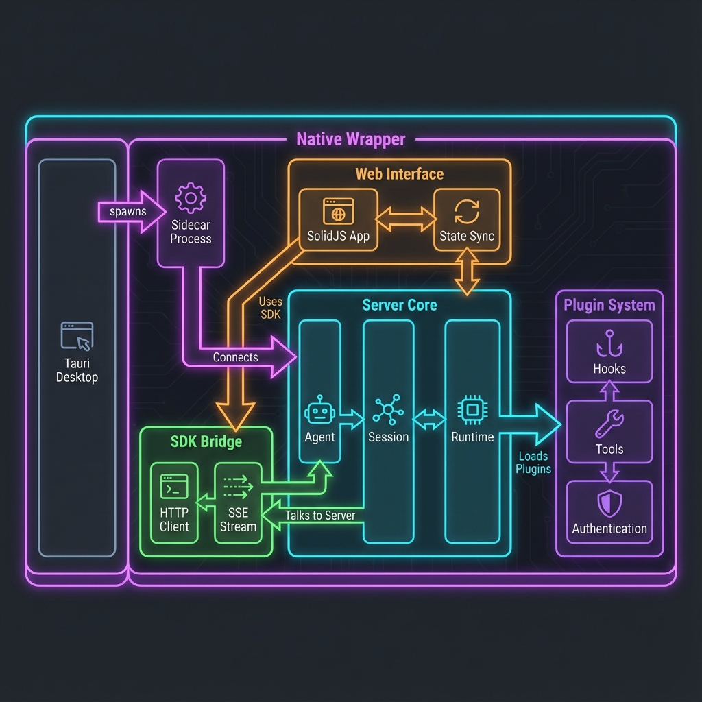

# Monorepo 结构解析 (Structure Analysis)

> 本文档解析 `opencode` 项目的整体目录结构与依赖关系。

> [查看 Mermaid 源码版本](system_diagram.md) (已废弃)

## 核心 (Core)
- **`packages/opencode`**: 👑 **核心项目**。包含 CLI 入口、Agent 编排逻辑。这是理解系统的起点。
- **`packages/sdk`**: 🛠 **SDK**。为开发者提供的工具包，用于构建插件或与平台交互。

## 客户端 (Clients)
- **`packages/console`**: 🖥 **管理控制台**。基于 SST/SolidStart 的 SaaS 管理后台。
- **`packages/app`**: 💻 **Web 应用**。基于 SolidJS 的前端界面。
- **`packages/desktop`**: 💻 **桌面端应用**。基于 Tauri + Sidecar 模式的原生应用。
- **`packages/ui`**: 🎨 **UI 组件库**。包含 Pierre 代码渲染引擎。

## 扩展与集成 (Extensions)
- **`packages/plugin`**: 🔌 **插件系统基础**。定义 Hooks 和插件接口。
- **`packages/slack`**: 💬 **Slack 集成**。演示 SDK 的高级用法，实现 Slack Bot。
- **`packages/extensions`**: 🆚 **编辑器扩展**。Zed 编辑器的 ACP 协议插件。

## 共享库 (Shared Libraries)
- **`packages/util`**: 🧰 **通用工具函数**。文件操作、ID 生成等基础设施。
- **`packages/function`**: ⚡ **云函数**。Console 服务器的 Lambda 函数定义。

## 编辑器集成 (Editor Integrations)
- **`VS Code`**: 🆚 **VS Code 集成**。通过内置终端和文件引用注入实现。
- **`Zed`**: 🆚 **Zed 编辑器插件**。通过 ACP 协议实现原生集成。

## CI/CD 集成 (Integrations)
- **`GitHub Action`**: 🐙 **GitHub 集成**。通过 `/opencode` 评论触发 Issue/PR 自动处理。

## 基础设施 (Infra & Config)
- **`infra/`**: 🏗 **基础设施代码**。SST 配置和部署脚本。
- **`script/`**: 📜 **构建与维护脚本**。自动化工具脚本。
