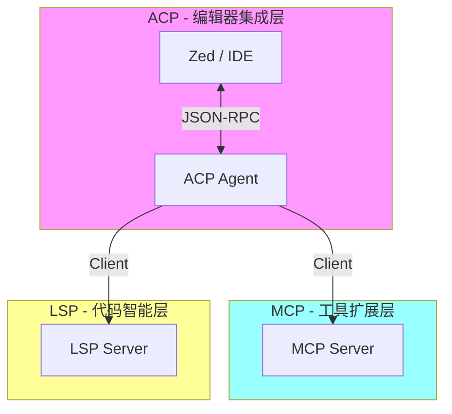
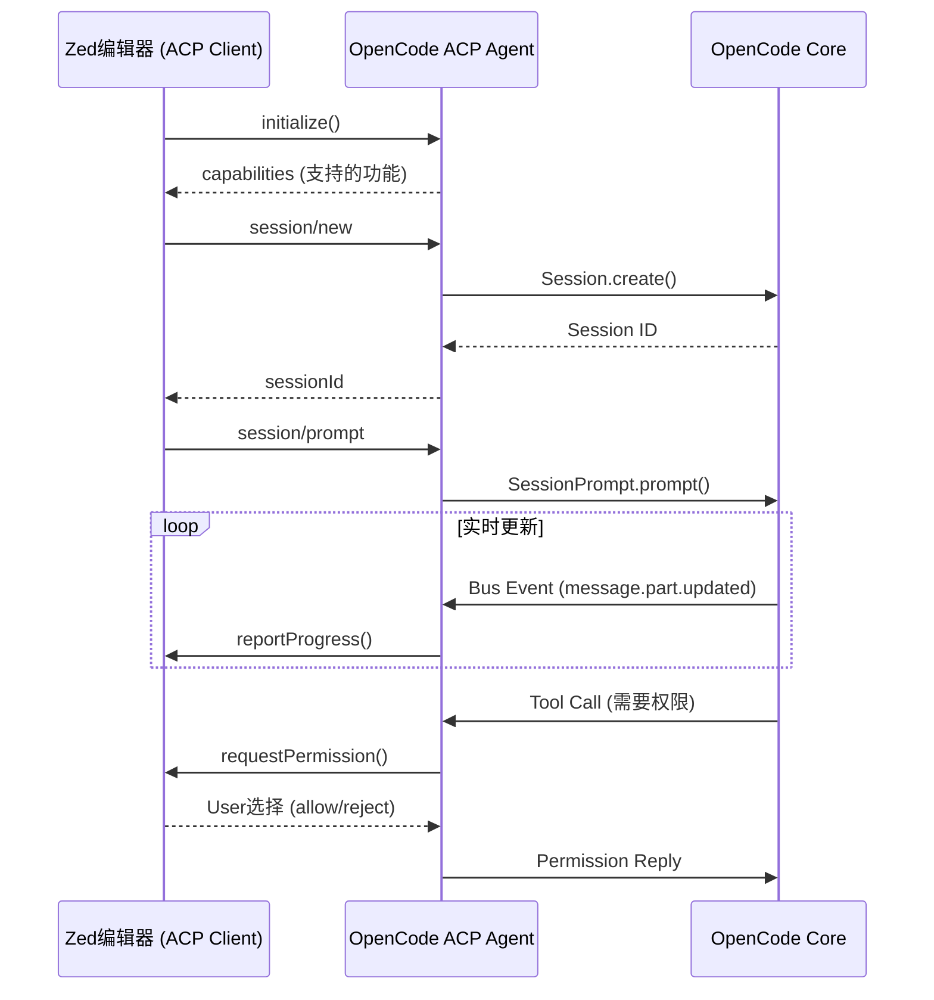
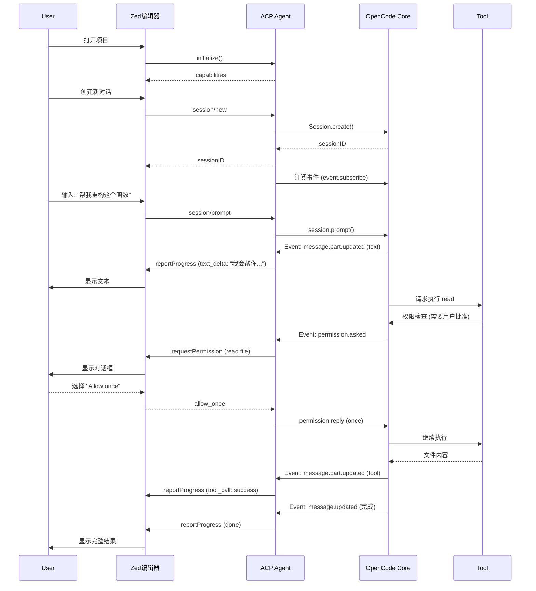
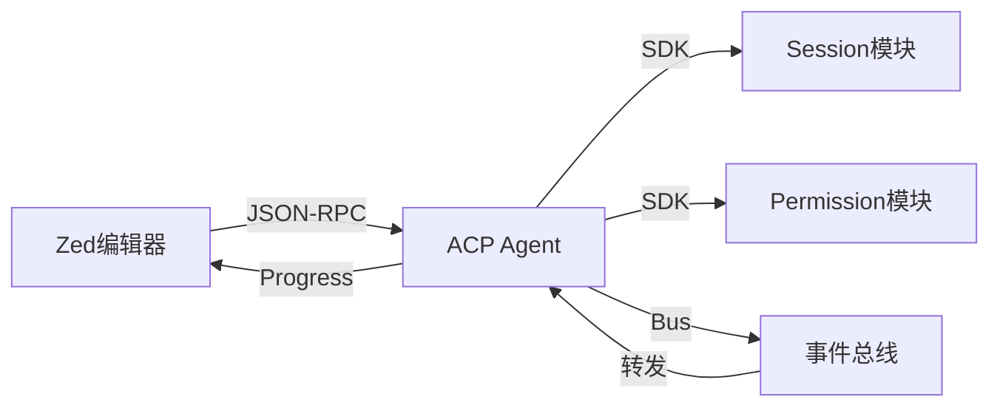

# Agent Context Protocol (ACP)

> OpenCode 作为 ACP Server 的实现，让任何支持 ACP 的 IDE 都能集成 OpenCode Agent。

## 1. 协议介绍

### 1.1 什么是 ACP？

**Agent Context Protocol (ACP)** 是一个**标准化的协议**，用于连接 AI Agent 和开发环境（IDE/编辑器）。

```
问题: 每个 AI 编程助手都需要为不同的编辑器编写专用集成
  → VS Code Extension
  → Zed Plugin
  → Vim Plugin
  → ...

解决方案: ACP 协议
  → Agent 只需实现一次 ACP Server
  → 任何支持 ACP 的编辑器都能直接使用
```

### 1.2 设计目标

| 目标 | 说明 |
|------|------|
| **标准化** | 统一的 Agent 接口，减少重复开发 |
| **双向通信** | IDE 可以调用 Agent，Agent 也可以请求 IDE |
| **权限管理** | Agent 需要 IDE 用户授权才能执行操作 |
| **实时反馈** | 支持流式响应和进度更新 |

### 1.3 与其他协议的关系



---

## 2. OpenCode 作为 ACP Server

### 2.1 架构概览

OpenCode 实现了 **ACP Server**，这意味着它可以被任何 ACP Client（如 Zed 编辑器）控制。



### 2.2 实现位置

```
packages/opencode/src/acp/
├── agent.ts         # ACP Agent 实现 (36,206 行)
├── session.ts       # 会话管理器 (2,561 行)
├── types.ts         # 类型定义 (422 行)
└── README.md        # 协议文档
```

---

## 3. 核心实现分析

### 3.1 ACP Agent 类

**文件**: `src/acp/agent.ts`

OpenCode 的 `ACP.Agent` 类实现了 `@agentclientprotocol/sdk` 的 `ACPAgent` 接口：

```typescript
// src/acp/agent.ts
export class Agent implements ACPAgent {
  private connection: AgentSideConnection  // 与 IDE 的连接
  private sdk: OpencodeClient              // OpenCode SDK
  private sessionManager: ACPSessionManager // 会话管理
  
  constructor(connection: AgentSideConnection, config: ACPConfig) {
    this.connection = connection
    this.sdk = config.sdk
    this.sessionManager = new ACPSessionManager(this.sdk)
  }
  
  // 实现 ACP 协议方法
  async initialize(req: InitializeRequest): Promise<InitializeResponse>
  async newSession(req: NewSessionRequest): Promise<string>
  async loadSession(req: LoadSessionRequest): Promise<void>
  async prompt(req: PromptRequest): Promise<void>
  async cancel(notif: CancelNotification): Promise<void>
  // ...
}
```

### 3.2 会话映射

**ACP 会话** 需要映射到 **OpenCode 内部会话**：

```typescript
// src/acp/session.ts
export class ACPSessionManager {
  private sessions = new Map<string, ACPSessionState>()
  private sdk: OpencodeClient
  
  // 创建新会话
  async create(cwd: string, mcpServers: McpServer[], model?) {
    // 1. 通过 SDK 创建 OpenCode 会话
    const session = await this.sdk.session.create({
      title: `ACP Session ${crypto.randomUUID()}`,
      directory: cwd,
    })
    
    // 2. 存储映射关系
    const state: ACPSessionState = {
      id: session.id,
      cwd,
      mcpServers,
      model,
      createdAt: new Date(),
    }
    this.sessions.set(session.id, state)
    
    return state
  }
  
  // 加载已有会话
  async load(sessionId: string, cwd: string) {
    const session = await this.sdk.session.get({
      sessionID: sessionId,
      directory: cwd,
    })
    
    // 恢复映射
    const state: ACPSessionState = {
      id: sessionId,
      cwd,
      createdAt: new Date(session.time.created),
    }
    this.sessions.set(sessionId, state)
    
    return state
  }
}
```

**ACPSessionState 数据结构**:

```typescript
// src/acp/types.ts
export type ACPSessionState = {
  id: string              // OpenCode Session ID
  cwd: string             // 工作目录
  mcpServers: McpServer[] // MCP 服务器配置
  model?: {               // 选定的模型
    providerID: string
    modelID: string
  }
  modeId?: string         // Agent 模式
  createdAt: Date
}
```

---

## 4. 协议交互流程

### 4.1 初始化握手

```typescript
// 1. IDE 发送 initialize 请求
async initialize(req: InitializeRequest): Promise<InitializeResponse> {
  log.info("ACP initialize", { req })
  
  return {
    // 声明支持的能力
    capabilities: {
      supportsStreaming: false,        // 暂不支持流式
      supportsToolCallReporting: false, // 暂不支持工具调用报告
      supportsCancellation: true,      // 支持取消
      supportsSetSessionModel: true,   // 支持切换模型
      supportsSetSessionMode: true,    // 支持切换 Agent 模式
    },
    // Agent 信息
    agentInfo: {
      name: "OpenCode",
      version: Installation.VERSION,
      description: "AI-powered coding assistant",
    },
    // 支持的认证方式
    authMethods: []  // 目前不需要认证
  }
}
```

### 4.2 会话创建

```typescript
// 2. IDE 创建新会话
async newSession(req: NewSessionRequest): Promise<string> {
  const { cwd, mcpServers } = req
  
  // 创建 OpenCode 会话
  const session = await this.sessionManager.create(
    cwd,
    mcpServers ?? [],
    req.model
  )
  
  // 订阅事件（权限请求、进度更新等）
  this.setupEventSubscriptions(session)
  
  return session.id  // 返回 Session ID
}
```

### 4.3 会话加载

```typescript
// 3. IDE 加载已有会话
async loadSession(req: LoadSessionRequest): Promise<void> {
  const { sessionId, cwd, mcpServers } = req
  
  const session = await this.sessionManager.load(
    sessionId,
    cwd,
    mcpServers ?? []
  )
  
  // 重新订阅事件
  this.setupEventSubscriptions(session)
}
```

### 4.4 提示处理

```typescript
// 4. IDE 发送用户提示
async prompt(req: PromptRequest): Promise<void> {
  const { sessionId, prompt } = req
  const session = this.sessionManager.get(sessionId)
  
  // 调用 OpenCode 核心
  await this.sdk.session.prompt({
    sessionID: sessionId,
    directory: session.cwd,
    parts: [
      { type: "text", text: prompt }
    ],
    // 如果指定了模型，使用该模型
    ...(session.model && { model: session.model }),
  })
  
  // 实时事件通过 setupEventSubscriptions 转发
}
```

---

## 5. 事件转发机制

ACP Agent 需要将 OpenCode 的内部事件转发给 IDE。

### 5.1 订阅 OpenCode 事件

```typescript
// src/acp/agent.ts
private setupEventSubscriptions(session: ACPSessionState) {
  const sessionId = session.id
  const directory = session.cwd
  
  // 订阅该会话的所有事件
  this.sdk.event.subscribe({ directory }).then(async (events) => {
    for await (const event of events.stream) {
      switch (event.type) {
        case "permission.asked":
          // 权限请求 → 转发给 IDE
          await this.handlePermissionRequest(event, sessionId, directory)
          break
          
        case "message.part.updated":
          // 消息更新 → 报告进度
          await this.reportProgress(event, sessionId)
          break
          
        case "message.updated":
          // 消息完成
          break
          
        // ... 其他事件
      }
    }
  })
}
```

### 5.2 权限请求处理

这是 ACP 的核心特性：**Agent 需要用户授权才能执行操作**。

```typescript
// 权限请求事件
case "permission.asked": {
  const permission = event.properties
  
  // 1. 请求 IDE 显示权限对话框
  const res = await this.connection.requestPermission({
    sessionId,
    toolCall: {
      toolCallId: permission.id,
      status: "pending",
      title: permission.permission,  // 例如: "bash", "edit"
      rawInput: permission.metadata,
      kind: toToolKind(permission.permission),
      locations: toLocations(permission.permission, permission.metadata),
    },
    options: [
      { optionId: "once", kind: "allow_once", name: "Allow once" },
      { optionId: "always", kind: "allow_always", name: "Always allow" },
      { optionId: "reject", kind: "reject_once", name: "Reject" },
    ],
  })
  
  // 2. 将用户选择返回给 OpenCode
  if (res.outcome.outcome === "selected") {
    await this.sdk.permission.reply({
      requestID: permission.id,
      reply: res.outcome.optionId as "once" | "always" | "reject",
      directory,
    })
  } else {
    // 用户取消或超时
    await this.sdk.permission.reply({
      requestID: permission.id,
      reply: "reject",
      directory,
    })
  }
}
```

**权限类型映射**:

```typescript
function toToolKind(permission: string): ToolKind {
  switch (permission) {
    case "bash": return "bash"
    case "read": return "read"
    case "edit": return "write"
    case "write": return "write"
    default: return "other"
  }
}
```

### 5.3 进度报告

```typescript
// 消息 Part 更新
case "message.part.updated": {
  const part = event.properties.part
  
  if (part.type === "text") {
    // 文本增量更新
    await this.connection.reportProgress({
      sessionId,
      progress: {
        kind: "text_delta",
        text: event.properties.delta ?? part.text,
      }
    })
  }
  
  if (part.type === "tool") {
    // 工具调用
    await this.connection.reportProgress({
      sessionId,
      progress: {
        kind: "tool_call",
        toolCall: {
          toolCallId: part.id,
          status: part.state.status === "completed" ? "success" : "pending",
          title: part.tool,
          rawInput: part.args,
        }
      }
    })
  }
}
```

---

## 6. 协议完整流程图



---

## 7. 集成示例

### 7.1 Zed 编辑器集成

Zed 是第一个支持 ACP 的编辑器：

**Zed 配置** (`.zed/settings.json`):
```json
{
  "agent": {
    "provider": "opencode",
    "opencode": {
      "command": "opencode",
      "args": ["acp"]
    }
  }
}
```

**启动流程**:
```bash
# Zed 启动 OpenCode ACP 模式
$ opencode acp

# OpenCode 输出 JSON-RPC 端口
{"port": 12345}

# Zed 通过 JSON-RPC 连接到 localhost:12345
```

### 7.2 自定义 ACP Client

你也可以构建自己的 ACP Client：

```typescript
import { createAgentConnection } from "@agentclientprotocol/sdk"

// 1. 连接到 ACP Agent
const connection = await createAgentConnection({
  command: "opencode",
  args: ["acp"],
})

// 2. 初始化
const initResponse = await connection.initialize({
  clientInfo: {
    name: "MyEditor",
    version: "1.0.0",
  }
})

console.log("Agent capabilities:", initResponse.capabilities)

// 3. 创建会话
const sessionId = await connection.newSession({
  cwd: "/path/to/project",
  mcpServers: [],
})

// 4. 订阅进度
connection.onProgress((progress) => {
  if (progress.progress.kind === "text_delta") {
    console.log("Text:", progress.progress.text)
  }
})

// 5. 发送提示
await connection.prompt({
  sessionId,
  prompt: "帮我创建一个 React 组件",
})
```

---

## 8. 支持的功能

### 8.1 当前支持

| 功能 | 状态 | 说明 |
|------|------|------|
| ✅ **会话创建** | 完整支持 | `session/new` |
| ✅ **会话加载** | 完整支持 | `session/load` |
| ✅ **提示处理** | 完整支持 | `session/prompt` |
| ✅ **权限请求** | 完整支持 | `requestPermission` |
| ✅ **进度报告** | 完整支持 | `reportProgress` |
| ✅ **模型切换** | 完整支持 | `session/setModel` |
| ✅ **模式切换** | 完整支持 | `session/setMode` |
| ✅ **取消操作** | 完整支持 | `session/cancel` |

### 8.2 计划支持

| 功能 | 状态 | 说明 |
|------|------|------|
| ⏳ **流式响应** | 计划中 | `supportsStreaming: true` |
| ⏳ **工具调用报告** | 计划中 | `supportsToolCallReporting: true` |

---

## 9. 配置与调试

### 9.1 启用 ACP 模式

```bash
# 启动 ACP Server
$ opencode acp

# 指定端口
$ opencode acp --port 12345

# 调试模式
$ opencode acp --debug
```

### 9.2 调试日志

```typescript
// ACP Agent 会输出详细日志
const log = Log.create({ service: "acp-agent" })

log.info("ACP initialize", { req })
log.info("creating_session", { state })
log.error("failed to request permission", { error, permissionID })
```

### 9.3 常见问题

**Q: ACP 和直接使用 OpenCode CLI 有什么区别？**

A: 
- **CLI**: 独立运行，有自己的 TUI
- **ACP**: 作为后台服务，由 IDE 控制，所有 UI 在 IDE 中

**Q: ACP 支持哪些 IDE？**

A: 
- ✅ Zed (官方支持)
- 🔄 VS Code (通过 Extension 可实现)
- 🔄 Cursor (可集成)
- 🔄 任何支持 JSON-RPC 的编辑器

---

## 10. 总结

ACP 协议让 OpenCode 能够**无缝集成到任何编辑器**：

### 核心特性
- ✅ **标准化**: 基于 `@agentclientprotocol/sdk`
- ✅ **双向通信**: IDE ↔ Agent 互相调用
- ✅ **权限管理**: 用户完全控制 Agent 行为
- ✅ **实时反馈**: 流式更新进度

### 关键实现
- **ACP.Agent**: 实现 ACP 协议接口
- **ACPSessionManager**: 管理会话映射
- **事件转发**: OpenCode Bus → ACP Progress
- **权限代理**: OpenCode Permission → ACP Permission

### 与其他模块的关系


**下一步**: 阅读 [MCP 协议](./mcp.md) 了解工具扩展机制
