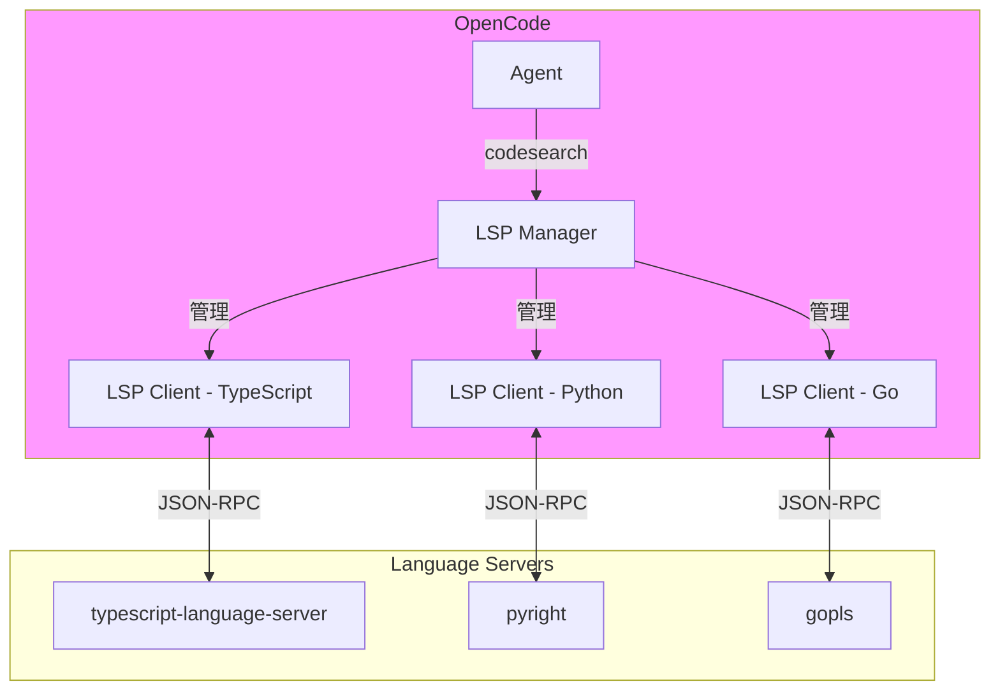
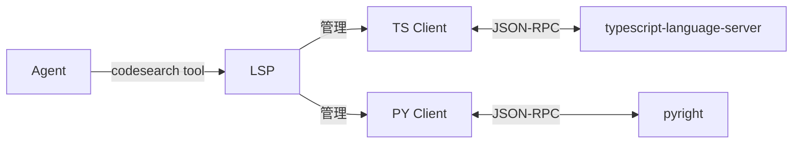

# Language Server Protocol (LSP)

> OpenCode 集成 LSP，提供代码智能功能，让 Agent 像 IDE 一样理解代码。

## 1. 协议介绍

### 1.1 什么是 LSP？

**Language Server Protocol (LSP)** 是微软开发的**标准协议**，用于编辑器与语言服务器之间的通信。

```
问题: 每种编程语言都需要代码智能功能
  → 自动补全
  → 跳转定义
  → 查找引用
  → 错误诊断
  → 代码格式化

传统方案: 每个编辑器为每种语言写专用插件
  ❌ N个编辑器 × M种语言 = N×M 个插件

LSP 方案: 标准化的通信协议
  ✅ 1个 Language Server
  ✅ 任何支持 LSP 的编辑器都能使用
  ✅ VS Code, Vim, Emacs, Zed... 都支持
```

### 1.2 LSP 核心功能

| 功能 | LSP 方法 | OpenCode 用途 |
|------|----------|--------------|
| **跳转定义** | `textDocument/definition` | Agent 查找函数/类定义位置 |
| **查找引用** | `textDocument/references` | Agent 找到所有调用点 |
| **符号搜索** | `workspace/symbol` | Agent 搜索项目中的类/函数 |
| **文档符号** | `textDocument/documentSymbol` | Agent 获取文件结构 |
| **诊断** | `textDocument/publishDiagnostics` | Agent 检查错误和警告 |
| **悬停信息** | `textDocument/hover` | Agent 获取类型和文档 |
| **代码补全** | `textDocument/completion` | (未使用) |

### 1.3 为什么 OpenCode 需要 LSP？

**对比: Grep vs LSP**

```typescript
// 场景: Agent 需要找到 AuthService 的定义

// ❌ 使用 grep (文本搜索)
$ grep -r "class AuthService"
// 问题:
// - 可能匹配注释中的 "AuthService"
// - 可能匹配字符串 "class AuthService is..."
// - 无法区分定义和使用

// ✅ 使用 LSP (语义搜索)
workspace/symbol query="AuthService"
// 返回:
// {
//   "name": "AuthService",
//   "kind": 5,  // Class
//   "location": {
//     "uri": "file:///src/auth/service.ts",
//     "range": { "start": { "line": 10, "character": 6 }, ... }
//   }
// }
// 优势:
// - 精确定位定义
// - 理解代码结构
// - 支持跨文件跳转
```

---

## 2. OpenCode 作为 LSP Client

### 2.1 架构概览

OpenCode 作为 **LSP Client**，管理多个 Language Server：



### 2.2 实现位置

```
packages/opencode/src/lsp/
├── index.ts       # LSP 管理器 (14,200 行)
├── client.ts      # LSP Client 实现 (8,043 行)
├── server.ts      # LSP Server 配置 (61,846 行)
└── language.ts    # 语言扩展名映射 (2,521 行)
```

---

## 3. 核心实现分析

### 3.1 Language Server 配置

**文件**: `src/lsp/server.ts`

OpenCode 内置了常见语言的 LSP Server 配置：

```typescript
// src/lsp/server.ts (简化)
export namespace LSPServer {
  // TypeScript/JavaScript
  export const typescript: Info = {
    id: "typescript",
    extensions: [".ts", ".tsx", ".js", ".jsx", ".mts", ".cts"],
    spawn: async (root) => ({
      process: spawn("typescript-language-server", ["--stdio"], {
        cwd: root,
      })
    })
  }
  
  // Python
  export const pyright: Info = {
    id: "pyright",
    extensions: [".py"],
    spawn: async (root) => ({
      process: spawn("pyright-langserver", ["--stdio"], {
        cwd: root,
      })
    })
  }
  
  // Go
  export const gopls: Info = {
    id: "gopls",
    extensions: [".go"],
    spawn: async (root) => ({
      process: spawn("gopls", [], {
        cwd: root,
      })
    })
  }
  
  // Rust
  export const rust: Info = {
    id: "rust",
    extensions: [".rs"],
    spawn: async (root) => ({
      process: spawn("rust-analyzer", [], {
        cwd: root,
      })
    })
  }
  
  // ... 还有 20+ 种语言
}
```

**支持的语言** (部分列表):

| 语言 | Server | 扩展名 |
|------|--------|--------|
| TypeScript/JavaScript | `typescript-language-server` | `.ts`, `.tsx`, `.js`, `.jsx` |
| Python | `pyright` | `.py` |
| Go | `gopls` | `.go` |
| Rust | `rust-analyzer` | `.rs` |
| Java | `jdtls` | `.java` |
| C/C++ | `clangd` | `.c`, `.cpp`, `.h` |
| Ruby | `solargraph` | `.rb` |
| PHP | `intelephense` | `.php` |
| ... | ... | ... |

### 3.2 LSP Client 管理

**文件**: `src/lsp/client.ts`

每个 Language Server 对应一个 LSP Client 实例：

```typescript
// src/lsp/client.ts
export namespace LSPClient {
  export type Info = {
    id: string                // "typescript", "pyright"...
    process: ChildProcess     // 子进程
    client: JSONRPCClient     // JSON-RPC 客户端
    ready: Promise<void>      // 初始化完成标志
  }
  
  export async function spawn(input: {
    id: string
    root: string
    command: string
    args: string[]
  }): Promise<Info> {
    // 1. 启动 Language Server 子进程
    const process = spawn(input.command, input.args, {
      cwd: input.root,
      stdio: ["pipe", "pipe", "pipe"],
    })
    
    // 2. 创建 JSON-RPC 通信通道
    const client = new JSONRPCClient({
      send: (data) => {
        process.stdin.write(JSON.stringify(data) + "\n")
      }
    })
    
    // 监听 stdout (JSON-RPC 响应)
    process.stdout.on("data", (data) => {
      const messages = parseJSONRPC(data)
      messages.forEach(msg => client.receive(msg))
    })
    
    // 3. 发送 initialize 请求
    const ready = client.request("initialize", {
      processId: process.pid,
      rootUri: pathToFileURL(input.root).href,
      capabilities: {
        workspace: {
          symbol: { dynamicRegistration: false }
        },
        textDocument: {
          definition: { dynamicRegistration: false },
          references: { dynamicRegistration: false },
          documentSymbol: { dynamicRegistration: false },
        }
      }
    }).then(() => {
      // 4. 发送 initialized 通知
      client.notify("initialized", {})
    })
    
    return {
      id: input.id,
      process,
      client,
      ready,
    }
  }
}
```

### 3.3 自动 Server 管理

**文件**: `src/lsp/index.ts`

OpenCode 会根据项目中的文件自动启动相应的 Language Server：

```typescript
// src/lsp/index.ts
export namespace LSP {
  // 根据文件扩展名获取 LSP Client
  export async function clientForFile(filepath: string): Promise<LSPClient.Info | undefined> {
    const ext = path.extname(filepath)
    
    // 1. 查找支持该扩展名的 Server
    const servers = await state()
    const serverID = Object.values(servers.servers).find(s => 
      s.extensions.includes(ext)
    )?.id
    
    if (!serverID) return undefined
    
    // 2. 检查是否已启动
    const existing = servers.clients.find(c => c.id === serverID)
    if (existing) return existing
    
    // 3. 启动新的 LSP Client
    const server = servers.servers[serverID]
    const spawned = await server.spawn(await server.root())
    
    const client = await LSPClient.spawn({
      id: serverID,
      root: await server.root(),
      ...spawned,
    })
    
    servers.clients.push(client)
    
    log.info("LSP client started", { id: serverID })
    
    return client
  }
}
```

---

## 4. LSP 操作实现

### 4.1 符号搜索 (Workspace Symbol)

**核心功能**: 在整个项目中搜索类/函数/变量

```typescript
// src/lsp/index.ts
export namespace LSP {
  export async function workspaceSymbol(input: {
    query: string
  }): Promise<Symbol[]> {
    const clients = await allClients()
    const results: Symbol[] = []
    
    // 并行查询所有 LSP Client
    await Promise.all(
      clients.map(async (client) => {
        await client.ready
        
        const symbols = await client.client.request("workspace/symbol", {
          query: input.query
        })
        
        results.push(...symbols)
      })
    )
    
    return results
  }
}
```

**使用示例**:
```typescript
// Agent 搜索 "AuthService"
const symbols = await LSP.workspaceSymbol({ query: "AuthService" })

// 返回:
[
  {
    name: "AuthService",
    kind: 5,  // Class
    location: {
      uri: "file:///src/auth/service.ts",
      range: { start: { line: 10, character: 6 }, ... }
    }
  }
]
```

### 4.2 跳转定义 (Go to Definition)

```typescript
export namespace LSP {
  export async function definition(input: {
    filepath: string
    line: number
    character: number
  }): Promise<Location[]> {
    // 1. 获取对应的 LSP Client
    const client = await clientForFile(input.filepath)
    if (!client) return []
    
    await client.ready
    
    // 2. 打开文档（如果尚未打开）
    await client.client.notify("textDocument/didOpen", {
      textDocument: {
        uri: pathToFileURL(input.filepath).href,
        languageId: getLanguageId(input.filepath),
        version: 1,
        text: await Bun.file(input.filepath).text(),
      }
    })
    
    // 3. 请求定义位置
    const locations = await client.client.request("textDocument/definition", {
      textDocument: { uri: pathToFileURL(input.filepath).href },
      position: { line: input.line, character: input.character }
    })
    
    return Array.isArray(locations) ? locations : [locations]
  }
}
```

### 4.3 查找引用 (Find References)

```typescript
export namespace LSP {
  export async function references(input: {
    filepath: string
    line: number
    character: number
    includeDeclaration?: boolean
  }): Promise<Location[]> {
    const client = await clientForFile(input.filepath)
    if (!client) return []
    
    await client.ready
    
    const locations = await client.client.request("textDocument/references", {
      textDocument: { uri: pathToFileURL(input.filepath).href },
      position: { line: input.line, character: input.character },
      context: {
        includeDeclaration: input.includeDeclaration ?? true
      }
    })
    
    return locations ?? []
  }
}
```

### 4.4 文档符号 (Document Symbols)

获取文件的结构（类、函数、变量等）：

```typescript
export namespace LSP {
  export async function documentSymbol(input: {
    filepath: string
  }): Promise<DocumentSymbol[]> {
    const client = await clientForFile(input.filepath)
    if (!client) return []
    
    await client.ready
    
    const symbols = await client.client.request("textDocument/documentSymbol", {
      textDocument: { uri: pathToFileURL(input.filepath).href }
    })
    
    return symbols ?? []
  }
}
```

**返回示例**:
```json
[
  {
    "name": "AuthService",
    "kind": 5,  // Class
    "range": { "start": { "line": 10, "character": 0 }, ... },
    "children": [
      {
        "name": "login",
        "kind": 6,  // Method
        "range": { "start": { "line": 12, "character": 2 }, ... }
      },
      {
        "name": "logout",
        "kind": 6,
        "range": { "start": { "line": 20, "character": 2 }, ... }
      }
    ]
  }
]
```

---

## 5. 与 codesearch 工具的集成

LSP 功能通过 **codesearch 工具**暴露给 Agent。

**文件**: `src/tool/codesearch.ts`

```typescript
// src/tool/codesearch.ts
export const CodeSearchTool = Tool.define("codesearch", {
  description: "Search for code symbols (classes, functions, variables) using LSP",
  parameters: z.object({
    query: z.string().describe("The symbol name to search for"),
    kind: z.enum(["class", "function", "variable", "all"]).optional(),
  }),
  async execute(params, ctx) {
    // 调用 LSP 符号搜索
    const symbols = await LSP.workspaceSymbol({
      query: params.query
    })
    
    // 过滤符号类型
    const filtered = params.kind 
      ? symbols.filter(s => matchKind(s.kind, params.kind))
      : symbols
    
    // 格式化结果
    return {
      results: filtered.map(s => ({
        name: s.name,
        type: symbolKindToString(s.kind),
        file: fileURLToPath(s.location.uri),
        line: s.location.range.start.line + 1,
        preview: getPreview(s.location),
      }))
    }
  }
})
```

**Agent 使用示例**:
```
用户: 找到所有名为 login 的函数

Agent: 我会使用代码搜索工具
  → 调用 codesearch({ query: "login", kind: "function" })
  → 返回:
    1. AuthService.login (src/auth/service.ts:12)
    2. UserController.login (src/controllers/user.ts:45)
    3. loginHelper (src/utils/auth.ts:8)
```

---

## 6. 语言扩展名映射

**文件**: `src/lsp/language.ts`

OpenCode 维护了一个完整的扩展名→语言ID 映射表：

```typescript
// src/lsp/language.ts (部分)
export const LANGUAGE_EXTENSIONS: Record<string, string> = {
  ".ts": "typescript",
  ".tsx": "typescriptreact",
  ".js": "javascript",
  ".jsx": "javascriptreact",
  ".py": "python",
  ".go": "go",
  ".rs": "rust",
  ".java": "java",
  ".rb": "ruby",
  ".php": "php",
  ".c": "c",
  ".cpp": "cpp",
  ".cs": "csharp",
  ".swift": "swift",
  ".kt": "kotlin",
  ".scala": "scala",
  ".sh": "shellscript",
  ".sql": "sql",
  ".html": "html",
  ".css": "css",
  ".json": "json",
  ".md": "markdown",
  ".yaml": "yaml",
  ".toml": "toml",
  // ... 100+ 种扩展名
}
```

---

## 7. 配置与定制

### 7.1 禁用 LSP

```json
// opencode.json
{
  "lsp": false  // 禁用所有 LSP
}
```

### 7.2 禁用特定 Server

```json
{
  "lsp": {
    "pyright": {
      "disabled": true  // 只禁用 Python LSP
    }
  }
}
```

### 7.3 自定义 LSP Server

```json
{
  "lsp": {
    "custom-lang": {
      "extensions": [".custom"],
      "command": ["custom-language-server", "--stdio"],
      "env": {
        "CUSTOM_VAR": "value"
      }
    }
  }
}
```

---

## 8. 实战场景

### 场景 1: Agent 重构代码

```
用户: 把所有调用 oldFunction 的地方改成 newFunction

Agent 思路:
1. 使用 codesearch 找到 oldFunction 的定义
   → LSP workspace/symbol query="oldFunction"
   
2. 使用 LSP 查找所有引用
   → LSP textDocument/references
   
3. 对每个引用使用 edit 工具替换
   → edit oldString="oldFunction" newString="newFunction"
```

### 场景 2: Agent 理解项目结构

```
用户: 这个项目的认证逻辑在哪里？

Agent 思路:
1. 搜索 "Auth" 相关的类
   → codesearch({ query: "Auth", kind: "class" })
   → 找到: AuthService, AuthController, AuthMiddleware
   
2. 读取 AuthService 的结构
   → LSP documentSymbol filepath="src/auth/service.ts"
   → 获取所有方法: login, logout, verify, ...
   
3. 总结给用户
   → "认证逻辑主要在 AuthService 类中..."
```

### 场景 3: Agent 跳转定义

```
用户: user.save() 这个 save 方法是在哪里定义的？

Agent 思路:
1. 找到 user.save() 所在的文件和位置
   → grep "user.save()"
   → 找到: src/app.ts:45
   
2. 使用 LSP 跳转到定义
   → LSP definition filepath="src/app.ts" line=45 character=10
   → 返回: src/models/User.ts:120
   
3. 读取定义
   → read filepath="src/models/User.ts" offset=115 limit=10
```

---

## 9. Symbol Kind 映射

LSP 使用数字表示符号类型：

```typescript
export enum SymbolKind {
  File = 1,
  Module = 2,
  Namespace = 3,
  Package = 4,
  Class = 5,
  Method = 6,
  Property = 7,
  Field = 8,
  Constructor = 9,
  Enum = 10,
  Interface = 11,
  Function = 12,
  Variable = 13,
  Constant = 14,
  String = 15,
  Number = 16,
  Boolean = 17,
  Array = 18,
  Object = 19,
  Key = 20,
  Null = 21,
  EnumMember = 22,
  Struct = 23,
  Event = 24,
  Operator = 25,
  TypeParameter = 26,
}
```

---

## 10. 常见陷阱与最佳实践

### ❌ 陷阱 1: LSP Server 未安装

**问题**:
```bash
# 项目是 TypeScript，但没有安装 typescript-language-server
$ opencode run
# LSP 功能不可用，codesearch 无法工作
```

**解决方案**:
```bash
# 安装 LSP Server
$ npm install -g typescript-language-server typescript

# 或在项目中安装
$ npm install --save-dev typescript-language-server typescript
```

### ❌ 陷阱 2: 忘记等待 LSP Ready

**错误做法**:
```typescript
const client = await LSPClient.spawn(...)
// 立即请求（可能失败）
const result = await client.client.request("workspace/symbol", ...)
```

**正确做法**:
```typescript
const client = await LSPClient.spawn(...)
await client.ready  // ← 等待初始化完成
const result = await client.client.request("workspace/symbol", ...)
```

### ✅ 最佳实践 1: 结合 grep 和 LSP

```typescript
// 先用 grep 快速筛选
const files = await grep({ pattern: "AuthService" })

// 再用 LSP 精确定位
for (const file of files) {
  const symbols = await LSP.documentSymbol({ filepath: file })
  const authService = symbols.find(s => s.name === "AuthService" && s.kind === 5)
}
```

### ✅ 最佳实践 2: 缓存 LSP Client

```typescript
// OpenCode 已内置缓存
// 相同的文件扩展名复用同一个 LSP Client
const client1 = await LSP.clientForFile("file1.ts")
const client2 = await LSP.clientForFile("file2.ts")
// client1 === client2 (复用)
```

---

## 11. 与 grep 的性能对比

| 操作 | grep | LSP | 性能 | 准确性 |
|------|------|-----|------|--------|
| 查找字符串 | ✅ | ✅ | grep 更快 | grep 可能误匹配 |
| 查找符号定义 | ❌ | ✅ | LSP 稍慢 | LSP 100% 准确 |
| 跨文件引用 | ❌ | ✅ | LSP 慢 | LSP 完整追踪 |
| 大文件搜索 | ✅ | ⚠️ | grep 快 10x+ | - |

**建议策略**:
- **简单字符串搜索**: 使用 grep
- **符号定义/引用**: 使用 LSP
- **大规模搜索**: 先 grep 筛选，再 LSP 精确定位

---

## 12. 总结

LSP 让 OpenCode Agent 拥有**代码理解能力**：

### 核心特性
- ✅ **多语言支持**: 20+ 种编程语言
- ✅ **自动管理**: 根据文件扩展名自动启动 Server
- ✅ **语义搜索**: 精确定位符号定义和引用
- ✅ **项目级分析**: workspace/symbol 全局搜索

### 关键实现
- **LSPClient.spawn**: 启动并初始化 Language Server
- **clientForFile**: 自动选择和复用 Client
- **workspaceSymbol**: 全局符号搜索
- **definition**: 跳转定义
- **references**: 查找引用

### 与其他模块的关系


**下一步**: 阅读 [Provider 模块](../internals/provider.md) 了解 LLM 抽象层
