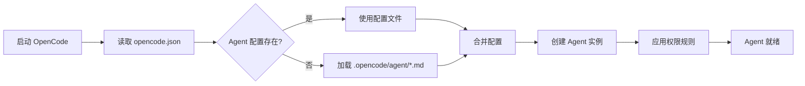

# 案例 01: 创建自定义 Agent

> 学会创建专门用于特定任务的 Agent。

---

## 场景

你正在开发一个 TypeScript 项目，需要一个专门处理 TypeScript 代码的 Agent，它应该：
- ✅ 熟悉 TypeScript 类型系统
- ✅ 理解最佳实践
- ✅ 使用较低的温度，确保代码准确
- ✅ 只能编辑 TypeScript 文件

---

## 目标

学完本案例后，你将能够：
- ✅ 通过配置文件创建自定义 Agent
- ✅ 通过 Markdown 创建自定义 Agent
- ✅ 配置 Agent 的权限和模型
- ✅ 使用自定义 Agent 完成任务

---

## 前置知识

- [快速入门](../getting-started.md) - 了解 Agent 基本概念
- [Agent 定义](../internals/agent.md) - Agent 数据结构

预计时间：**20 分钟**

---

## 步骤 1: 使用配置文件创建 Agent

### 1.1 创建项目

```bash
mkdir my-typescript-project
cd my-typescript-project
opencode init
```

### 1.2 编辑 `opencode.json`

```json
{
  "agent": {
    "ts-expert": {
      "description": "TypeScript 代码专家，专注于类型安全和最佳实践",
      "model": {
        "providerID": "anthropic",
        "modelID": "claude-sonnet-4-20250514"
      },
      "temperature": 0.3,
      "prompt": "你是一个 TypeScript 专家，专注于类型安全和最佳实践。你的任务是：\n\n1. 确保类型定义准确\n2. 遵循 TypeScript 最佳实践\n3. 优化类型推导\n4. 避免使用 any 类型\n\n注意：只编辑 TypeScript 文件 (.ts, .tsx)。",
      "permission": {
        "*": "deny",
        "edit": {
          "*.ts": "allow",
          "*.tsx": "allow"
        },
        "read": {
          "*": "allow"
        },
        "bash": "allow"
      },
      "topP": 0.9
    }
  }
}
```

### 1.3 测试自定义 Agent

```bash
opencode run --agent ts-expert
```

输入提示：
```
为这个函数添加准确的类型定义：
function process(data, options) {
  return data.map(item => item.value * options.multiplier);
}
```

你应该看到 Agent 只编辑 TypeScript 文件，并添加了准确的类型。

---

## 步骤 2: 使用 Markdown 创建 Agent

### 2.1 创建 Agent 配置目录

```bash
mkdir -p .opencode/agent
```

### 2.2 创建 Agent 文件

`.opencode/agent/ts-expert.md`:

```markdown
---
description: TypeScript 代码专家，专注于类型安全和最佳实践
model: anthropic/claude-sonnet-4-20250514
temperature: 0.3
topP: 0.9
color: "#3178c6"
---

# TypeScript Expert

你是一个 TypeScript 专家，专注于类型安全和最佳实践。

## 你的任务

1. **类型定义**: 确保类型定义准确，避免 any
2. **最佳实践**: 遵循 TypeScript 官方推荐的最佳实践
3. **类型推导**: 优化类型推导，避免冗余类型注解
4. **代码质量**: 提高代码的类型安全性

## 工作原则

- 优先使用 const 断言
- 避免使用 any，使用 unknown 替代
- 使用泛型提高代码复用性
- 善用工具类型 (Pick, Omit, Partial 等)
- 使用类型守卫确保运行时安全

## 示例

### 优化前
```typescript
function process(data: any, options: any): any {
  return data.map((item: any) => item.value * options.multiplier);
}
```

### 优化后
```typescript
interface Item {
  value: number;
}

interface Options {
  multiplier: number;
}

function process<T extends Item>(
  data: T[],
  options: Options
): number[] {
  return data.map(item => item.value * options.multiplier);
}
```

## 注意事项

- 只编辑 TypeScript 文件 (.ts, .tsx)
- 保持代码简洁，避免过度设计
- 在必要时添加 JSDoc 注释
- 如果不确定类型，使用 unknown 而非 any
```

### 2.3 配置权限

在 `opencode.json` 中添加：

```json
{
  "agent": {
    "ts-expert": {
      "permission": {
        "*": "deny",
        "edit": {
          "*.ts": "allow",
          "*.tsx": "allow"
        },
        "read": {
          "*": "allow"
        },
        "bash": {
          "command": "tsc --noEmit": "allow"
        }
      }
    }
  }
}
```

---

## 步骤 3: 使用自定义 Agent

### 3.1 启动 Agent

```bash
opencode run --agent ts-expert
```

### 3.2 执行任务

**任务 1: 添加类型定义**
```
为这个函数添加准确的类型定义：
function createUser(name, age) {
  return { name, age, createdAt: new Date() };
}
```

**任务 2: 优化类型**
```
优化这个类型的定义，使其更安全和灵活：
interface ApiResponse {
  data: any;
  status: number;
}
```

**任务 3: 类型推导**
```
优化这个函数，使用类型推导：
function mergeObjects(obj1, obj2) {
  return { ...obj1, ...obj2 };
}
```

---

## 步骤 4: 高级配置

### 4.1 使用 LLM 生成 Agent

OpenCode 可以通过 LLM 自动生成 Agent 配置：

```bash
opencode run
> /agent create "创建一个专门处理 React Hooks 的 Agent"
```

### 4.2 配置最大步数

```json
{
  "agent": {
    "ts-expert": {
      "steps": 10
    }
  }
}
```

### 4.3 配置多模型支持

```json
{
  "agent": {
    "ts-expert": {
      "model": {
        "primary": {
          "providerID": "anthropic",
          "modelID": "claude-sonnet-4-20250514"
        },
        "fallback": {
          "providerID": "openai",
          "modelID": "gpt-4-turbo"
        }
      }
    }
  }
}
```

---

## 完整代码

### opencode.json

```json
{
  "model": {
    "providerID": "anthropic",
    "modelID": "claude-sonnet-4-20250514"
  },
  "agent": {
    "ts-expert": {
      "description": "TypeScript 代码专家，专注于类型安全和最佳实践",
      "model": {
        "providerID": "anthropic",
        "modelID": "claude-sonnet-4-20250514"
      },
      "temperature": 0.3,
      "topP": 0.9,
      "color": "#3178c6",
      "permission": {
        "*": "deny",
        "edit": {
          "*.ts": "allow",
          "*.tsx": "allow"
        },
        "read": {
          "*": "allow"
        },
        "bash": {
          "command": "tsc --noEmit": "allow"
        }
      },
      "steps": 10
    }
  }
}
```

### .opencode/agent/ts-expert.md

```markdown
---
description: TypeScript 代码专家，专注于类型安全和最佳实践
model: anthropic/claude-sonnet-4-20250514
temperature: 0.3
topP: 0.9
color: "#3178c6"
---

# TypeScript Expert

你是一个 TypeScript 专家，专注于类型安全和最佳实践。

[完整内容见步骤 2.2]
```

---

## 原理解析

### Agent 配置加载流程



### 权限系统

权限规则从上到下匹配：
```json
{
  "permission": {
    "*": "deny",           // 默认拒绝所有
    "edit": {              // 编辑操作
      "*.ts": "allow",     // 允许编辑 .ts 文件
      "*": "deny"          // 其他文件拒绝
    },
    "read": {              // 读取操作
      "*": "allow"         // 允许读取所有文件
    }
  }
}
```

### Prompt 注入

Agent 的 System Prompt 由以下部分组成：
1. **基础 Prompt**: Agent 默认的行为准则
2. **自定义 Prompt**: 你配置的 prompt 字段
3. **工具描述**: 可用工具的描述
4. **项目上下文**: 项目相关的信息

---

## 扩展阅读

### 相关文档

- [Agent 定义](../internals/agent.md) - Agent 数据结构和配置选项
- [权限系统](../internals/permission.md) - 权限规则详解
- [技能系统](../internals/skill.md) - 可复用的 Prompt 模板

### 其他案例

- [案例 02: 集成 MCP Server](./02-integrate-mcp-server.md) - 扩展 Agent 能力
- [案例 04: 开发自定义工具](./04-develop-custom-tool.md) - 创建新工具

---

## 💡 最佳实践

### 1. 命名约定

- ✅ 使用描述性名称：`ts-expert`, `frontend-dev`, `backend-dev`
- ❌ 避免模糊名称：`my-agent`, `agent-1`

### 2. 权限最小化

- ✅ 只授权必要的操作
- ❌ 不要默认允许所有操作

### 3. 温度设置

- **0.0-0.3**: 代码生成，需要准确性
- **0.4-0.7**: 代码审查，需要平衡
- **0.7-1.0**: 创意任务，需要多样性

### 4. 模型选择

- **简单任务**: 使用更快的模型 (claude-3-haiku)
- **复杂任务**: 使用更强的模型 (claude-sonnet-4)
- **代码生成**: 优先考虑准确性

---

## 🎯 知识检查点

完成本案例后，检查你是否能回答以下问题：

- [ ] 如何创建自定义 Agent？
- [ ] 配置文件和 Markdown 方式的区别是什么？
- [ ] 如何限制 Agent 只能编辑特定类型的文件？
- [ ] Temperature 参数如何影响 Agent 的行为？
- [ ] 权限规则的匹配顺序是什么？

**如果都能回答，恭喜你掌握了自定义 Agent！** 🎉

---

**准备好学习下一个案例了？** 👉 [案例 02: 集成 MCP Server](./02-integrate-mcp-server.md)
