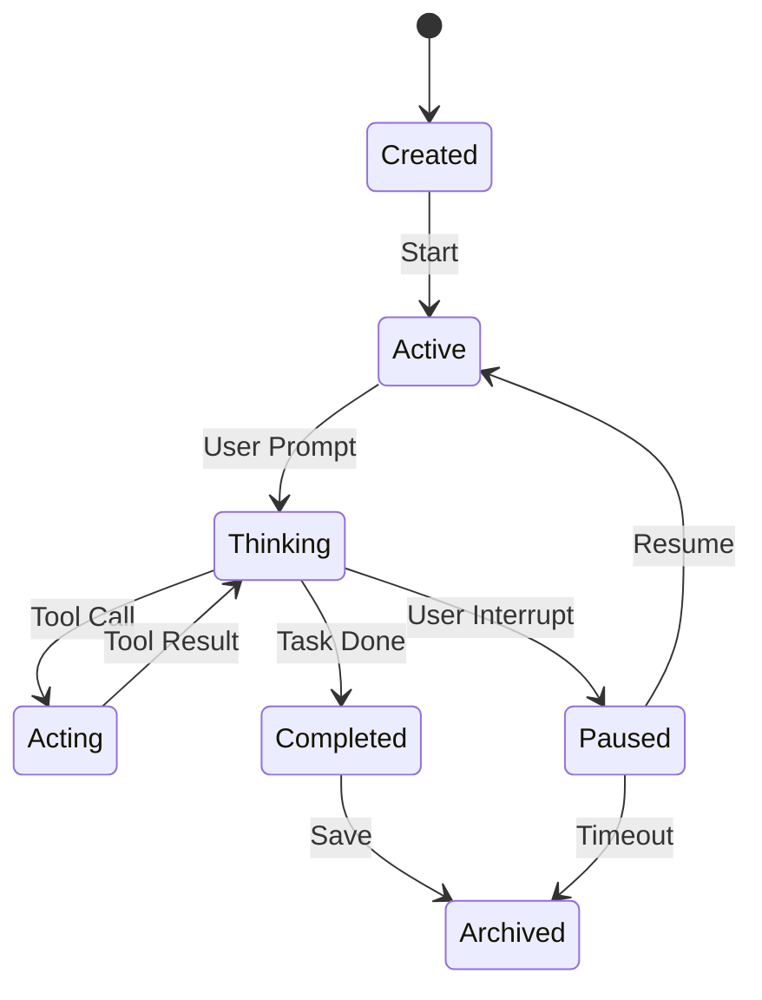

# 案例 03: 调试会话问题

> 学会诊断和解决 Agent 会话中的常见问题。

---

## 场景

你在使用 OpenCode 时遇到了一些问题：
- ❌ Agent 一直在 "Thinking"，没有响应
- ❌ 权限请求一直弹出
- ❌ 工具执行失败，但没有明确错误信息
- ❌ 会话状态异常，无法继续

本案例教你如何系统地诊断和解决这些问题。

---

## 目标

学完本案例后，你将能够：
- ✅ 启用调试日志
- ✅ 查看会话状态和统计信息
- ✅ 诊断常见的会话问题
- ✅ 使用快照恢复会话

---

## 前置知识

- [快速入门](../getting-started.md) - 基本使用
- [会话管理](../internals/session.md) - Session 工作原理

预计时间：**20 分钟**

---

## 步骤 1: 启用调试日志

### 1.1 基础调试模式

```bash
# 启用详细日志
opencode run --debug

# 查看所有日志级别
opencode run --log-level debug
```

你会看到类似这样的输出：

```
[DEBUG] [agent] Starting thinking loop...
[DEBUG] [session] Loading session: xxx
[DEBUG] [llm] Sending request to Anthropic...
[DEBUG] [tool] Calling tool: read
[DEBUG] [permission] Checking permission for tool "read"
```

### 1.2 特定模块调试

```bash
# 只调试 Agent 模块
opencode run --debug agent

# 只调试工具调用
opencode run --debug tool

# 只调试权限系统
opencode run --debug permission
```

### 1.3 保存日志到文件

```bash
# 保存完整日志
opencode run --debug > opencode.log 2>&1

# 只保存错误日志
opencode run --log-level error > errors.log
```

---

## 步骤 2: 查看会话状态

### 2.1 列出所有会话

```bash
opencode session list
```

输出示例：

```
ID          Title              Status    Messages    Last Updated
xxx         重构登录功能        active    15          2025-01-09 20:30
yyy         添加单元测试        paused    8           2025-01-09 19:15
zzz         API 设计           archived  23          2025-01-08 10:00
```

### 2.2 查看会话详情

```bash
# 查看基本信息
opencode session info xxx

# 查看消息历史
opencode session history xxx

# 查看工具调用记录
opencode session tools xxx
```

### 2.3 查看会话统计

```bash
opencode session stats xxx
```

输出示例：

```
Session ID: xxx
Status: active
Messages: 15
Tools Called: 12
Tokens Used:
  Input: 15,234
  Output: 8,567
  Total: 23,801
Cost Estimate: $0.12
Last Activity: 2025-01-09 20:30:00
```

### 2.4 查看 Agent 的 Prompt

```bash
opencode session prompt xxx
```

这会显示 Agent 当前的 System Prompt，包括：
- 基础行为准则
- 自定义配置
- 工具描述
- 项目上下文

---

## 步骤 3: 诊断常见问题

### 问题 1: Agent 一直在 "Thinking"

**症状**：
```
🤖 Agent is thinking...
[等待超过 5 分钟]
```

**诊断步骤**：

1. 检查网络连接
```bash
ping api.anthropic.com
```

2. 测试 API 连接
```bash
opencode test --model anthropic/claude-sonnet-4
```

3. 查看 Prompt 长度
```bash
opencode session stats xxx
# 检查 Token 使用量是否接近上限
```

4. 查看详细日志
```bash
opencode run --debug llm
# 查看是否有请求超时
```

**解决方案**：

- 切换到更快的模型
```bash
opencode run --model anthropic/claude-3-haiku
```

- 减少 Context 大小
```json
{
  "agent": {
    "build": {
      "options": {
        "maxContextTokens": 16000
      }
    }
  }
}
```

- 检查 API 配额
```bash
opencode config show
```

---

### 问题 2: 权限请求一直弹出

**症状**：
```
Opencode: 我想删除 node_modules/
You: [Allow Once] [Allow Always] [Reject]
[重复多次]
```

**诊断步骤**：

1. 查看权限配置
```bash
opencode config show
```

2. 查看当前权限规则
```bash
opencode permission list
```

**解决方案**：

**方案 A: 临时允许**
```bash
opencode run
> /permission --allow-all
```

**方案 B: 配置永久允许**
```json
{
  "agent": {
    "build": {
      "permission": {
        "*": "allow"
      }
    }
  }
}
```

**方案 C: 细粒度配置**
```json
{
  "agent": {
    "build": {
      "permission": {
        "bash": {
          "command": "rm -rf node_modules": "allow"
        }
      }
    }
  }
}
```

---

### 问题 3: 工具执行失败

**症状**：
```
🛠️ Tool: bash
❌ Error: Command failed with exit code 127
```

**诊断步骤**：

1. 查看详细错误
```bash
opencode session tools xxx
# 查看工具调用的详细错误信息
```

2. 测试命令
```bash
# 在终端中手动执行相同的命令
echo "test"
```

3. 检查环境变量
```bash
opencode config show
# 查看是否缺少必要的环境变量
```

**解决方案**：

- 添加环境变量
```json
{
  "env": {
    "PATH": "/usr/local/bin:/usr/bin:/bin"
  }
}
```

- 使用绝对路径
```
> 使用 /usr/local/bin/node 而非 node
```

- 检查工具权限
```bash
opencode permission check bash
```

---

### 问题 4: 会话状态异常

**症状**：
```
Error: Session not found
Error: Invalid session state
```

**诊断步骤**：

1. 检查会话列表
```bash
opencode session list
```

2. 验证会话 ID
```bash
opencode session info xxx
```

3. 检查会话文件
```bash
ls -la ~/.opencode/sessions/xxx
```

**解决方案**：

**方案 A: 恢复会话**
```bash
opencode session restore xxx
```

**方案 B: 重新创建会话**
```bash
opencode run --new
```

**方案 C: 从快照恢复**
```bash
opencode snapshot list
opencode snapshot restore yyy
```

---

## 步骤 4: 使用快照恢复

### 4.1 创建快照

```bash
# 自动快照（每次工具执行后）
# 已在配置中启用

# 手动创建快照
opencode snapshot create
```

### 4.2 列出快照

```bash
opencode snapshot list
```

输出示例：

```
ID          Created                Files Changed
aaa         2025-01-09 20:30:00    5
bbb         2025-01-09 20:15:00    3
ccc         2025-01-09 20:00:00    8
```

### 4.3 查看快照详情

```bash
opencode snapshot info aaa
```

输出示例：

```
Snapshot ID: aaa
Created: 2025-01-09 20:30:00
Files Changed:
  + src/index.ts (new)
  ~ src/app.ts (modified)
  - src/old.ts (deleted)
Session: xxx
Message: "完成了登录功能重构"
```

### 4.4 恢复快照

```bash
# 恢复到指定快照
opencode snapshot restore aaa

# 查看差异
opencode snapshot diff aaa bbb
```

---

## 步骤 5: 高级调试技巧

### 5.1 使用断点调试

```bash
# 使用 Node.js 调试器
node --inspect-brk $(which opencode) run --debug
```

然后在 Chrome DevTools 中连接：
1. 打开 `chrome://inspect`
2. 点击 "Open dedicated DevTools"
3. 设置断点并调试

### 5.2 导出会话数据

```bash
# 导出完整会话
opencode session export xxx --output session.json

# 导出消息历史
opencode session export xxx --messages-only --output messages.json

# 导出工具调用
opencode session export xxx --tools-only --output tools.json
```

### 5.3 分析会话数据

创建分析脚本 `analyze-session.js`:

```javascript
const session = require('./session.json')

// 统计消息数量
const messageCount = session.messages.length
console.log(`Total messages: ${messageCount}`)

// 统计工具调用
const toolCalls = session.messages.filter(m => m.tool_calls)
console.log(`Tool calls: ${toolCalls.length}`)

// 统计 Token 使用
const totalTokens = session.messages.reduce((sum, m) => {
  return sum + (m.usage?.total_tokens || 0)
}, 0)
console.log(`Total tokens: ${totalTokens}`)

// 统计错误
const errors = session.messages.filter(m => m.error)
console.log(`Errors: ${errors.length}`)
errors.forEach(e => console.log(`- ${e.error}`))
```

运行：
```bash
node analyze-session.js
```

---

## 完整代码

### 调试脚本 (debug.sh)

```bash
#!/bin/bash

SESSION_ID=$1

echo "=== 会话信息 ==="
opencode session info $SESSION_ID

echo -e "\n=== 会话统计 ==="
opencode session stats $SESSION_ID

echo -e "\n=== 消息历史 ==="
opencode session history $SESSION_ID

echo -e "\n=== 工具调用 ==="
opencode session tools $SESSION_ID

echo -e "\n=== 快照列表 ==="
opencode snapshot list

echo -e "\n=== 导出会话数据 ==="
opencode session export $SESSION_ID --output session.json

echo -e "\n调试完成！查看 session.json 进行详细分析。"
```

使用：
```bash
chmod +x debug.sh
./debug.sh <session-id>
```

---

## 原理解析

### 会话生命周期



### 调试日志级别

| 级别 | 说明 | 使用场景 |
|------|------|---------|
| `error` | 只显示错误 | 生产环境 |
| `warn` | 警告和错误 | 日常使用 |
| `info` | 信息、警告、错误 | 默认级别 |
| `debug` | 详细调试信息 | 开发调试 |
| `trace` | 最详细的日志 | 深度调试 |

### 会话数据结构

```typescript
interface Session {
  id: string
  status: "active" | "paused" | "completed" | "archived"
  messages: Message[]
  metadata: {
    createdAt: Date
    updatedAt: Date
    tokenUsage: {
      input: number
      output: number
      total: number
    }
  }
}
```

---

## 扩展阅读

### 相关文档

- [会话管理](../internals/session.md) - Session 工作原理
- [快照系统](../internals/snapshot.md) - 快照机制
- [故障排查](./troubleshooting.md) - 更多故障排查技巧

### 其他案例

- [案例 01: 创建自定义 Agent](./01-create-custom-agent.md)
- [案例 02: 集成 MCP Server](./02-integrate-mcp-server.md)

---

## 💡 最佳实践

### 1. 调试前检查清单

在调试之前，先检查：
- [ ] OpenCode 是否是最新版本？
- [ ] API Key 是否有效？
- [ ] 网络连接是否正常？
- [ ] 配置文件是否正确？

### 2. 日志管理

- 不要长期启用 `--debug`，会影响性能
- 定期清理日志文件
- 使用日志轮转避免文件过大

### 3. 快照策略

- 在重要操作前手动创建快照
- 定期清理旧快照
- 使用有意义的快照描述

---

## 🎯 知识检查点

完成本案例后，检查你是否能回答以下问题：

- [ ] 如何启用调试日志？
- [ ] 如何查看会话统计信息？
- [ ] Agent 一直在 "Thinking" 的常见原因有哪些？
- [ ] 如何使用快照恢复会话？
- [ ] 如何导出和分析会话数据？

**如果都能回答，恭喜你掌握了会话调试！** 🎉

---

**准备好学习下一个案例了？** 👉 [案例 04: 开发自定义工具](./04-develop-custom-tool.md)
