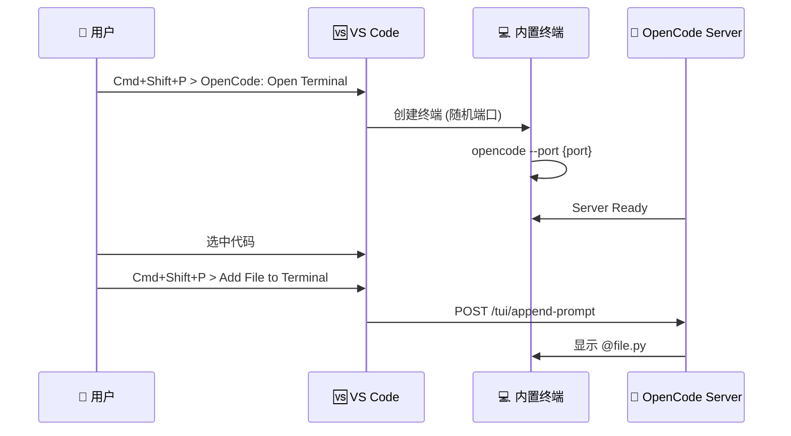

# 编辑器集成: VS Code 扩展

> OpenCode 的 VS Code 扩展，实现了编辑器与 Agent 的无缝集成。

## 1. 概览 (Overview)
- **路径**: `sdks/vscode`
- **定位**: 在 VS Code 侧边栏终端中嵌入 OpenCode CLI，实现 "一键启动 + 文件引用" 的流畅体验。
- **技术栈**: TypeScript + VS Code Extension API
- **依赖**: 无外部 NPM 依赖，纯原生 VS Code API

## 2. 核心架构 (Core Architecture)



## 3. 核心命令 (Commands)

扩展注册了 3 个命令：

| 命令 ID | 描述 | 快捷方式 |
| :--- | :--- | :--- |
| `opencode.openTerminal` | 打开或聚焦 OpenCode 终端 | 默认无 |
| `opencode.openNewTerminal` | 强制创建新终端 | 默认无 |
| `opencode.addFilepathToTerminal` | 将当前文件/选区添加到 Prompt | 默认无 |

## 4. 核心代码解析

### 4.1 终端创建 (`openTerminal`)

```typescript
async function openTerminal() {
  // 随机端口避免冲突
  const port = Math.floor(Math.random() * (65535 - 16384 + 1)) + 16384
  
  const terminal = vscode.window.createTerminal({
    name: "opencode",
    location: {
      viewColumn: vscode.ViewColumn.Beside,  // 分屏显示
      preserveFocus: false,
    },
    env: {
      _EXTENSION_OPENCODE_PORT: port.toString(),
      OPENCODE_CALLER: "vscode",  // 标识来源
    },
  })

  terminal.show()
  terminal.sendText(`opencode --port ${port}`)
  
  // 等待 Server 就绪
  let tries = 10
  do {
    await new Promise(resolve => setTimeout(resolve, 200))
    try {
      await fetch(`http://localhost:${port}/app`)
      break  // 连接成功
    } catch {}
  } while (--tries > 0)
}
```

**设计亮点**:
- **随机端口**: 避免多窗口冲突
- **环境变量传递**: 通过 `OPENCODE_CALLER` 让 Server 知道是从 VS Code 启动的
- **就绪检测**: 轮询 `/app` 端点确保 Server 启动完成

### 4.2 文件路径注入 (`addFilepathToTerminal`)

```typescript
function getActiveFile() {
  const activeEditor = vscode.window.activeTextEditor
  const document = activeEditor.document
  const relativePath = vscode.workspace.asRelativePath(document.uri)
  
  let filepathWithAt = `@${relativePath}`

  // 支持行号范围
  const selection = activeEditor.selection
  if (!selection.isEmpty) {
    const startLine = selection.start.line + 1
    const endLine = selection.end.line + 1
    if (startLine === endLine) {
      filepathWithAt += `#L${startLine}`
    } else {
      filepathWithAt += `#L${startLine}-${endLine}`
    }
  }
  return filepathWithAt  // 例如: @src/index.ts#L10-25
}
```

**注入方式**:

```typescript
if (terminal.name === "opencode") {
  const port = terminal.creationOptions.env?.["_EXTENSION_OPENCODE_PORT"]
  if (port) {
    // 通过 API 注入到 Prompt 输入框
    await fetch(`http://localhost:${port}/tui/append-prompt`, {
      method: "POST",
      body: JSON.stringify({ text: fileRef }),
    })
  } else {
    // 回退: 直接发送文本到终端
    terminal.sendText(fileRef, false)
  }
}
```

## 5. 技术亮点

### 5.1 @ 语法
文件引用使用 `@file#L10-20` 语法，这是 OpenCode 的标准引用格式，被 CLI 和所有客户端共享。

### 5.2 零依赖
扩展不依赖任何 NPM 包，完全使用 VS Code 原生 API，确保了：
- 快速加载
- 无安全风险
- 维护简单

### 5.3 分屏体验
终端默认在编辑器旁边打开 (`ViewColumn.Beside`)，用户可以边看代码边与 Agent 对话。

## 6. 使用场景

```
1. 用户打开一个 Python 项目
2. Cmd+Shift+P > OpenCode: Open Terminal
3. 终端在右侧打开，显示 opencode> 提示符
4. 用户选中 utils.py 中 L10-30 的函数
5. Cmd+Shift+P > Add File to Terminal
6. Prompt 自动填充: @utils.py#L10-30
7. 用户输入: 帮我优化这个函数
8. Agent 分析代码并给出建议
```

## 7. 与 Zed 扩展的对比

| 特性 | VS Code 扩展 | Zed 扩展 |
| :--- | :--- | :--- |
| **协议** | HTTP (自定义) | ACP (Agent Client Protocol) |
| **启动方式** | 内置终端 | 独立进程 |
| **通信方式** | REST API | stdio (JSON-RPC) |
| **复杂度** | 简单 (~140 行) | 由 Zed 托管 |

## 8. 总结

VS Code 扩展采用了极简设计：
- **没有 WebView，没有复杂 UI** —— 直接复用 VS Code 终端
- **没有 SDK 封装** —— 直接调用 HTTP API
- **没有状态管理** —— 状态全在 OpenCode Server

这体现了 OpenCode 的设计哲学: **一个 Server，多个 Client**。扩展只是一个轻量级桥梁，真正的能力在 Server 端。
