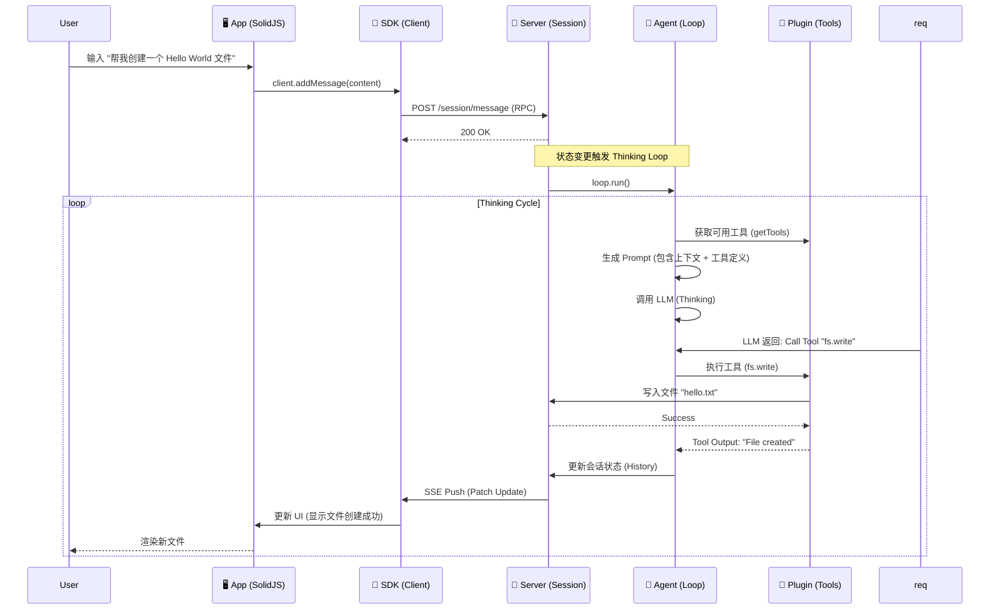

# 核心流程: 从 Prompt 到 Code (Agent Lifecycle)

> 本文档描述了 OpenCode 最核心的生命周期：当用户输入需求后，系统内部发生了什么。

## 1. 全链路时序图 (End-to-End Flow)

这个过程跨越了 App (UI), SDK (Network), Server (Logic) 和 Plugin (Tools) 四个层次。

## 2. 详细步骤解析

### 阶段一：意图捕获 (App Layer)
- **位置**: `packages/app/src/components/chat-input.tsx`
- **动作**: 用户按下回车。
- **逻辑**: 前端不进行任何处理，直接通过 `sdk.mutation.addMessage` 将原始文本发送给 Server。OpenCode 坚持 **"Server-Driven"**，前端只是一个哑终端。

### 阶段二：会话状态更新 (Server Layer)
- **位置**: `packages/opencode/src/session.ts`
- **动作**: Server 接收到消息，将其追加到 `Session.history`。
- **触发**: 状态的变更会触发 `Loop` 的检测机制。如果当前没有正在运行的任务，且由用户触发，`Loop` 会自动启动。

### 阶段三：代理思考 (Agent Layer)
- **核心**: `packages/opencode/src/agent/loop.ts`
- **动作**: 这是一个 `while(true)` 循环。
    1.  **Gather Context**: 收集当前打开的文件、终端输出、用户最后的消息。
    2.  **Construct Prompt**: 将这些信息组装成 LLM 能理解的 Prompt。
    3.  **Predict**: 发送给 LLM，等待响应。

### 阶段四：工具执行 (Runtime Layer)
- **核心**: `packages/plugin/src/tools.ts`
- **动作**: LLM 返回 "我需要执行 `run_command`" 的指令。
- **校验**: Server 检查用户权限（是否允许读写文件？）。
- **执行**: 调用底层 `fs` 或 `child_process` 真正干活。

### 阶段五：状态同步 (Sync Layer)
- **机制**: 整个过程中，Server 的每一次状态变化（Thinking, Tool Calling, Tool Output），都会通过 **SSE (Server-Sent Events)** 实时推送到前端。
- **UI 响应**: App 收到 SSE 事件，更新 Solid Store，界面上的 "Chat Bubble" 会实时显示 "正在思考...", "正在写入文件..."。
