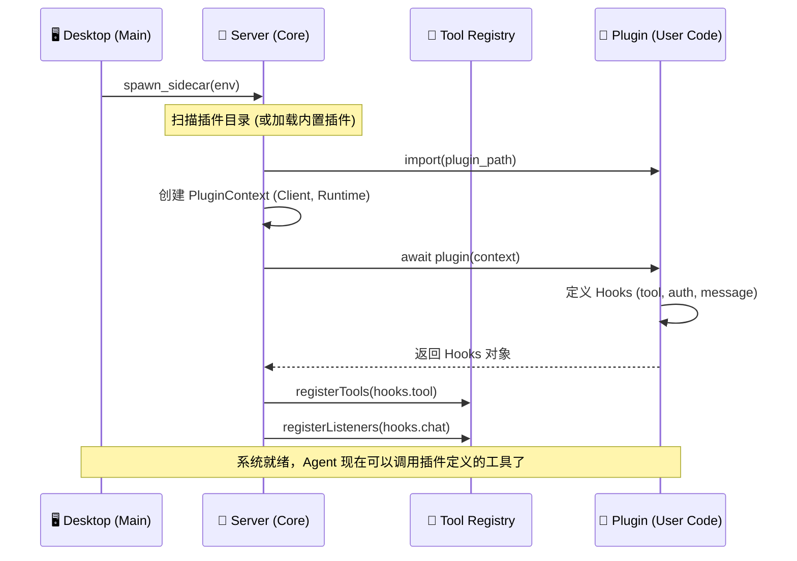

# 核心流程: 插件加载机制 (Plugin Bootstrapping)

> 本文档解析 OpenCode 如何动态发现、加载并激活插件，使其能够扩展系统的核心能力。

## 1. 加载流程图

## 2. 关键阶段

### 2.1 发现 (Discovery)
- OpenCode 目前主要支持 **内置插件** (Built-in) 和 **用户配置插件**。
- Server 启动时会读取配置，确定需要加载哪些插件模块。

### 2.2 注入 (Injection)
- 核心代码: `packages/plugin/src/types.ts` 定义了 `PluginInput`。
- Server 在调用插件函数时，会将把自己最核心的能力（`OpencodeClient`, `Runtime`）作为参数注入进去。
- 这是一种 **"控制反转" (IoC)** 设计：插件不需要去“找”能力，Server 会把能力“送”给它。

### 2.3 注册 (Registration)
- 插件返回一个 `Hooks` 对象。
- Server 遍历这个对象：
    - 如果有 `tool`，注册到 `ToolRegistry`，供 Agent 思考时调用。
    - 如果有 `chat.message`，注册监听器，每当有新消息时通知插件。
    - 如果有 `auth`，注册鉴权逻辑。

## 3. 插件隔离
为了防止插件崩溃影响主进程，OpenCode 的设计允许插件运行在独立的上下文或沙箱中（具体取决于 Runtime 实现）。目前的架构中，插件是作为 Server 进程的一部分运行的（同构），因此拥有极高的性能，但也要求插件代码必须健壮。
