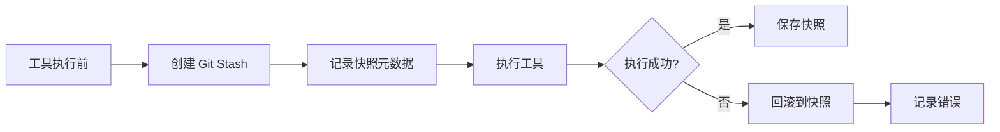

# 快照回滚 (Snapshot Rollback)

> 基于 Git 的文件变更追踪和回滚机制。

---

## 1. 快照创建流程



---

## 2. 快照数据结构

```typescript
interface Snapshot {
  id: string
  sessionID: string
  toolCallID: string
  gitStashHash: string
  filesChanged: FileChange[]
  timestamp: Date
  status: "created" | "applied" | "reverted"
}

interface FileChange {
  path: string
  operation: "create" | "modify" | "delete"
  before?: string // 文件内容或 Git hash
  after?: string
}
```

---

## 3. 创建快照

```typescript
export async function createSnapshot(
  sessionID: string,
  toolCallID: string
): Promise<Snapshot> {
  // 1. 创建 Git stash
  const stashResult = await Bun.$`git stash push -m "opencode:${toolCallID}"`.quiet()
  const stashHash = stashResult.stdout.trim()
  
  // 2. 获取变更文件列表
  const statusResult = await Bun.$`git status --porcelain`.quiet()
  const filesChanged = parseGitStatus(statusResult.stdout)
  
  // 3. 记录快照
  const snapshot = await Snapshots.create({
    id: crypto.randomUUID(),
    sessionID,
    toolCallID,
    gitStashHash: stashHash,
    filesChanged,
    timestamp: new Date(),
    status: "created"
  })
  
  return snapshot
}
```

---

## 4. 回滚快照

```typescript
export async function revertSnapshot(
  snapshotID: string
): Promise<void> {
  // 1. 获取快照
  const snapshot = await Snapshots.get(snapshotID)
  
  // 2. 应用 Git stash
  await Bun.$`git stash pop ${snapshot.gitStashHash}`
  
  // 3. 更新快照状态
  await Snapshots.update(snapshotID, {
    status: "reverted",
    revertedAt: new Date()
  })
}
```

---

## 5. 相关文档

- [快照系统](../internals/snapshot.md) - 快照系统详解
- [Cookbook - 调试会话](../cookbook/03-debug-session.md) - 使用快照调试
