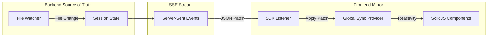

# 核心流程: 状态同步 (State Synchronization)

> 本文档揭秘 OpenCode 前端如何实现“像变魔术一样”的实时更新。
> 核心理念: **Server-Driven Push Architecture** (服务器驱动的推送架构)。

## 1. 核心架构图

## 2. 为什么需要这个？

传统的 Web 应用通常是 **Pull-Based** (前端主动请求数据)。
但在 IDE 场景下，这行不通：
- Agent 正在写代码，文件随时会变。
- 终端输出了新的一行日志。
- LSP 发现了新的错误。

必须要让 Server **主动推送** 变化给前端。

## 3. 实现细节

### 3.1 Server 端 (Source of Truth)
- **位置**: `packages/opencode/src/session.ts`
- **机制**: 任何对 `Session` 对象的修改（如 `history.push`），都会触发 `notify()`。
- **优化**: Server 会计算 State 的 Diff (增量)，而不是发送整个大对象。

### 3.2 传输层 (The Pipe)
- **协议**: SSE (Server-Sent Events)。
- **优势**: 比 WebSocket 更简单，天然支持自动重连 (在 SDK 中实现)。
- **数据**: 发送的是 **JSON Patch** 或 **State Snapshot**。

### 3.3 Client 端 (The Mirror)
- **位置**: `packages/app/src/providers/global-sync-provider.tsx`
- **上帝状态 (God Store)**: 前端维护一个巨大的 `Store` 对象，它是后端状态的完美镜像。
- **处理**:
    1.  `sdk.events.on('patch', ...)`: 收到补丁。
    2.  `reconcile(store, patch)`: 将补丁应用到本地 Store。
    3.  **SolidJSMagic**: 由于 SolidJS 的细粒度响应式特性，Store 的局部变化会直接更新对应的 DOM 节点 (例如只更新终端的最后一行)，而不需要 React 那样的 VDOM Diff，性能极高。

## 4. 总结
OpenCode 的前端其实非常“傻”。它不管理状态，它只是 Server 状态的一个 **即时投影 (View)**。
这种架构极大地简化了前端逻辑：**Don't sync state, just mirror it.**
