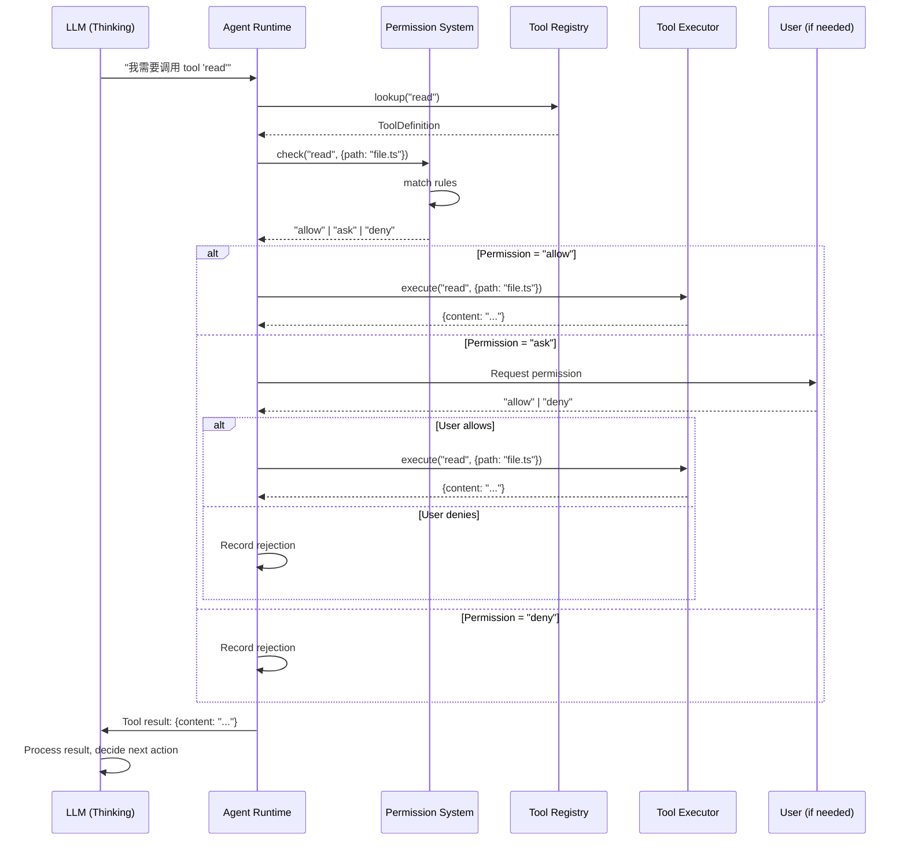

# 工具执行流程 (Tool Execution)

> 详细描述 Agent 如何调用和执行工具。

---

## 1. 概览

当 Agent 决定执行一个工具时，会经历以下阶段：

```
Agent Decision → Permission Check → Tool Execution → Result Processing → Loop Continuation
```

---

## 2. 完整时序图



---

## 3. 详细步骤解析

### 3.1 工具发现 (Tool Discovery)

**位置**: `packages/opencode/src/tool/registry.ts`

Agent 首先需要知道有哪些工具可用：

```typescript
// 获取所有可用工具
const tools = await ToolRegistry.tools(providerID)

// 过滤当前 Agent 有权限的工具
const allowedTools = tools.filter(tool => {
  return Permission.canUse(agent.id, tool.id)
})

// 转换为 LLM 格式
const llmTools = allowedTools.map(tool => ({
  type: "function",
  function: {
    name: tool.id,
    description: tool.description,
    parameters: tool.parameters,
  }
}))
```

**输出示例**：
```json
[
  {
    "type": "function",
    "function": {
      "name": "read",
      "description": "读取文件内容",
      "parameters": {
        "type": "object",
        "properties": {
          "filePath": {"type": "string"}
        },
        "required": ["filePath"]
      }
    }
  }
]
```

---

### 3.2 LLM 工具调用决策

**位置**: `packages/opencode/src/processor.ts`

LLM 根据上下文决定是否调用工具：

```typescript
// 发送请求到 LLM
const result = await processor.process({
  messages: sessionMessages,
  tools: llmTools,
  // ...
})

// 检查是否包含工具调用
if (result.toolCalls && result.toolCalls.length > 0) {
  // 处理每个工具调用
  for (const toolCall of result.toolCalls) {
    await executeTool(toolCall)
  }
}
```

**LLM 响应示例**：
```json
{
  "role": "assistant",
  "tool_calls": [
    {
      "id": "call_abc123",
      "type": "function",
      "function": {
        "name": "read",
        "arguments": "{\"filePath\": \"src/index.ts\"}"
      }
    }
  ]
}
```

---

### 3.3 权限检查 (Permission Check)

**位置**: `packages/opencode/src/permission/permission.ts`

在执行工具前，检查权限：

```typescript
export async function checkPermission(
  agentID: string,
  toolID: string,
  args: Record<string, any>
): Promise<"allow" | "ask" | "deny"> {
  // 1. 获取 Agent 的权限配置
  const agentConfig = await Agent.get(agentID)
  const ruleset = agentConfig.permission
  
  // 2. 匹配权限规则
  const rule = PermissionNext.match(ruleset, toolID, args)
  
  // 3. 返回权限结果
  if (rule === "allow") return "allow"
  if (rule === "deny") return "deny"
  
  // 4. 需要用户批准
  return "ask"
}
```

**权限规则匹配**：

```typescript
export function match(
  ruleset: Ruleset,
  toolID: string,
  args: Record<string, any>
): "allow" | "ask" | "deny" {
  // 1. 检查具体工具规则
  if (ruleset[toolID]) {
    return resolveRule(ruleset[toolID], args)
  }
  
  // 2. 检查通配符规则
  if (ruleset["*"]) {
    return resolveRule(ruleset["*"], args)
  }
  
  // 3. 默认拒绝
  return "deny"
}
```

---

### 3.4 用户授权请求 (User Authorization)

**位置**: `packages/opencode/src/permission/user.ts`

如果权限为 "ask"，需要用户授权：

```typescript
if (permission === "ask") {
  // 创建权限请求
  const requestID = crypto.randomUUID()
  
  // 记录请求
  await PermissionRequests.create({
    id: requestID,
    agentID,
    toolID,
    args,
    status: "pending"
  })
  
  // 发送事件通知 UI
  Bus.emit("permission.asked", {
    requestID,
    toolID,
    args
  })
  
  // 等待用户响应
  const response = await waitForResponse(requestID)
  
  // 处理响应
  if (response === "allow") {
    // 继续执行
  } else {
    // 记录拒绝
    await PermissionRequests.update(requestID, {
      status: "denied",
      reply: response
    })
    return { error: "Permission denied" }
  }
}
```

---

### 3.5 工具执行 (Tool Execution)

**位置**: `packages/opencode/src/tool/executor.ts`

执行工具并获取结果：

```typescript
export async function executeTool(
  toolID: string,
  args: Record<string, any>
): Promise<ToolResult> {
  try {
    // 1. 获取工具定义
    const tool = await ToolRegistry.get(toolID)
    
    // 2. 执行工具
    const result = await tool.execute(args)
    
    // 3. 验证返回值
    if (!validateResult(result)) {
      throw new Error("Invalid tool result")
    }
    
    // 4. 记录工具调用
    await ToolCalls.create({
      id: crypto.randomUUID(),
      toolID,
      args,
      result,
      timestamp: new Date()
    })
    
    return result
  } catch (error) {
    // 记录错误
    await ToolCalls.create({
      id: crypto.randomUUID(),
      toolID,
      args,
      error: error.message,
      timestamp: new Date()
    })
    
    throw error
  }
}
```

**示例工具实现**：

```typescript
// packages/opencode/src/tool/read.ts
export const read = {
  id: "read",
  description: "读取文件内容",
  parameters: z.object({
    filePath: z.string()
  }),
  
  async execute({ filePath }: { filePath: string }) {
    // 验证路径
    if (!isValidPath(filePath)) {
      throw new Error(`Invalid file path: ${filePath}`)
    }
    
    // 读取文件
    const content = await Bun.file(filePath).text()
    
    return {
      content,
      filePath,
      size: content.length
    }
  }
}
```

---

### 3.6 结果处理 (Result Processing)

**位置**: `packages/opencode/src/processor.ts`

处理工具执行结果：

```typescript
function processToolResult(
  toolCall: ToolCall,
  result: ToolResult
): ToolCallMessage {
  // 1. 构造工具调用消息
  const message: ToolCallMessage = {
    role: "assistant",
    tool_calls: [toolCall]
  }
  
  // 2. 构造工具结果消息
  const resultMessage: ToolResultMessage = {
    role: "tool",
    tool_call_id: toolCall.id,
    content: JSON.stringify(result)
  }
  
  // 3. 添加到消息历史
  session.messages.push(message)
  session.messages.push(resultMessage)
  
  // 4. 触发事件
  Bus.emit("tool.executed", {
    toolID: toolCall.function.name,
    result
  })
  
  return resultMessage
}
```

---

### 3.7 循环继续 (Loop Continuation)

**位置**: `packages/opencode/src/session/prompt.ts`

将工具结果返回给 LLM，继续思考：

```typescript
// 主循环
while (true) {
  // 1. 构造 Prompt
  const prompt = buildPrompt(session.messages)
  
  // 2. 调用 LLM
  const response = await llm.complete(prompt)
  
  // 3. 处理响应
  if (response.toolCalls) {
    // 执行工具
    for (const toolCall of response.toolCalls) {
      const result = await executeTool(toolCall)
      processToolResult(toolCall, result)
    }
    
    // 继续循环
    continue
  }
  
  // 4. 没有工具调用，完成
  break
}
```

---

## 4. 错误处理

### 4.1 工具执行失败

```typescript
try {
  const result = await executeTool(toolID, args)
  // 处理结果
} catch (error) {
  // 记录错误
  session.errors.push({
    type: "tool_error",
    toolID,
    error: error.message,
    timestamp: new Date()
  })
  
  // 通知 LLM
  const errorMessage: ToolResultMessage = {
    role: "tool",
    tool_call_id: toolCall.id,
    content: JSON.stringify({
      error: error.message,
      suggestion: "请检查工具参数或尝试其他工具"
    })
  }
  
  // LLM 可以根据错误决定重试或尝试其他方法
  session.messages.push(errorMessage)
}
```

### 4.2 超时处理

```typescript
export async function executeToolWithTimeout(
  toolID: string,
  args: Record<string, any>,
  timeout: number = 30000 // 30秒
): Promise<ToolResult> {
  const timeoutPromise = new Promise((_, reject) => {
    setTimeout(() => reject(new Error("Tool execution timeout")), timeout)
  })
  
  try {
    const result = await Promise.race([
      executeTool(toolID, args),
      timeoutPromise
    ])
    return result
  } catch (error) {
    if (error.message === "Tool execution timeout") {
      // 终止工具进程
      await terminateToolProcess(toolID)
    }
    throw error
  }
}
```

---

## 5. 性能优化

### 5.1 并行工具执行

```typescript
// 检查是否可以并行执行
if (canExecuteParallel(toolCalls)) {
  // 并行执行
  const results = await Promise.all(
    toolCalls.map(call => executeTool(call))
  )
  
  // 处理所有结果
  results.forEach((result, i) => {
    processToolResult(toolCalls[i], result)
  })
} else {
  // 顺序执行
  for (const call of toolCalls) {
    const result = await executeTool(call)
    processToolResult(call, result)
  }
}
```

### 5.2 工具缓存

```typescript
const toolCache = new Map<string, ToolResult>()

export async function executeToolWithCache(
  toolID: string,
  args: Record<string, any>
): Promise<ToolResult> {
  // 生成缓存键
  const cacheKey = `${toolID}:${JSON.stringify(args)}`
  
  // 检查缓存
  const cached = toolCache.get(cacheKey)
  if (cached) {
    return cached
  }
  
  // 执行工具
  const result = await executeTool(toolID, args)
  
  // 缓存结果
  toolCache.set(cacheKey, result)
  
  return result
}
```

---

## 6. 相关文档

- [工具注册表](../internals/tool.md) - 工具定义和管理
- [权限系统](../internals/permission.md) - 权限检查机制
- [Agent 生命周期](./agent_lifecycle.md) - 整体执行流程
- [Cookbook - 开发自定义工具](../cookbook/04-develop-custom-tool.md) - 创建新工具
