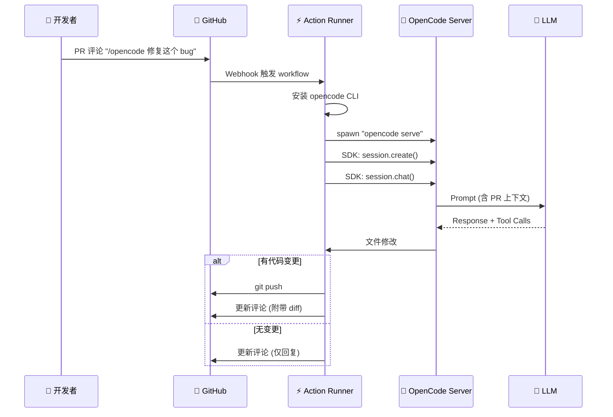

# 集成: GitHub Action

> OpenCode 的 GitHub Action，实现了 CI/CD 场景下的 AI Agent 自动化。

## 1. 概览 (Overview)
- **路径**: `github/`
- **定位**: 让 OpenCode Agent 响应 GitHub Issue/PR 评论，自动执行代码任务。
- **技术栈**: Bun + @actions/core + @octokit/rest + @opencode-ai/sdk
- **触发词**: `/opencode` 或 `/oc`

## 2. 核心架构 (Core Architecture)



## 3. 触发机制

### 3.1 Action 配置 (`action.yml`)

```yaml
name: "opencode GitHub Action"
description: "Run opencode in GitHub Actions workflows"

inputs:
  model:
    description: "Model to use (e.g., anthropic/claude-sonnet-4-20250514)"
    required: true
  agent:
    description: "Agent to use (must be primary agent)"
    required: false
  share:
    description: "Share session link (default: true for public repos)"
    required: false
  mentions:
    description: "Trigger phrases (default: /opencode,/oc)"
    required: false

runs:
  using: "composite"
  steps:
    - name: Install opencode
      run: curl -fsSL https://opencode.ai/install | bash
    - name: Run opencode
      run: opencode github run
      env:
        MODEL: ${{ inputs.model }}
```

### 3.2 支持的事件

| 事件类型 | 触发场景 | 处理逻辑 |
| :--- | :--- | :--- |
| `issue_comment` | Issue 评论 | 创建新分支并 PR |
| `pull_request_review_comment` | PR Review 评论 | 直接推送到 PR 分支 |

## 4. 核心代码解析

### 4.1 启动 OpenCode Server

```typescript
function createOpencode() {
  const host = "127.0.0.1"
  const port = 4096
  const url = `http://${host}:${port}`
  
  // 在 Action Runner 中启动 Server 进程
  const proc = spawn(`opencode`, [`serve`, `--hostname=${host}`, `--port=${port}`])
  const client = createOpencodeClient({ baseUrl: url })

  return { server: { url, close: () => proc.kill() }, client }
}
```

### 4.2 处理 Issue vs PR

```typescript
if (isPullRequest()) {
  const prData = await fetchPR()
  
  if (prData.headRepository === prData.baseRepository) {
    // 本地 PR: 直接 push 到 head 分支
    await checkoutLocalBranch(prData)
    const response = await chat(userPrompt)
    if (await branchIsDirty()) {
      await pushToLocalBranch(summary)
    }
  } else {
    // Fork PR: push 到 fork 仓库
    await checkoutForkBranch(prData)
    const response = await chat(userPrompt)
    if (await branchIsDirty()) {
      await pushToForkBranch(summary, prData)
    }
  }
} else {
  // Issue: 创建新分支并开 PR
  const branch = await checkoutNewBranch()
  const response = await chat(userPrompt)
  if (await branchIsDirty()) {
    await createPR(defaultBranch, branch, summary, response)
  }
}
```

### 4.3 构建上下文 Prompt

```typescript
function buildPromptDataForPR(pr: GitHubPullRequest): string {
  return `
## Pull Request Context

**Title**: ${pr.title}
**Author**: ${pr.author.login}
**Base**: ${pr.baseRefName} ← **Head**: ${pr.headRefName}
**State**: ${pr.state}

### Description
${pr.body}

### Changed Files (${pr.additions}+ / ${pr.deletions}-)
${pr.files.nodes.map(f => `- ${f.path} (+${f.additions} -${f.deletions})`).join('\n')}

### Recent Commits
${pr.commits.nodes.map(c => `- ${c.commit.message}`).join('\n')}

### Review Comments
${pr.reviews.nodes.map(r => `**${r.author.login}**: ${r.body}`).join('\n')}
  `
}
```

### 4.4 实时事件订阅

```typescript
async function subscribeSessionEvents() {
  const response = await fetch(`${server.url}/event`)
  const reader = response.body.getReader()

  while (true) {
    const { done, value } = await reader.read()
    if (done) break

    const chunk = decoder.decode(value)
    for (const line of chunk.split("\n")) {
      if (!line.startsWith("data: ")) continue
      const evt = JSON.parse(line.slice(6))

      if (evt.type === "message.part.updated") {
        const part = evt.properties.part
        if (part.type === "tool" && part.state.status === "completed") {
          // 在 Action 日志中显示工具进度
          console.log(`| ${part.tool.padEnd(7)} | ${part.state.title}`)
        }
      }
    }
  }
}
```

## 5. 分支命名规则

```typescript
function generateBranchName(type: "issue" | "pr") {
  const timestamp = new Date()
    .toISOString()
    .replace(/[:-]/g, "")
    .split("T")
    .join("")
  return `opencode/${type}${useIssueId()}-${timestamp}`
}
// 例如: opencode/issue42-20260106163000
```

## 6. 图片处理

Action 支持在评论中附带图片：

```typescript
// 匹配 GitHub 图片 URL
const imgMatches = prompt.matchAll(
  /!\[.*?\]\((https:\/\/github\.com\/user-attachments\/[^)]+)\)/gi
)

for (const match of imgMatches) {
  // 下载图片
  const res = await fetch(url, {
    headers: { Authorization: `Bearer ${accessToken}` }
  })
  // 替换为本地引用
  prompt = prompt.replace(match[0], `@${filename}`)
  // 将图片作为附件传给 LLM
  promptFiles.push({
    filename,
    mime: contentType,
    content: Buffer.from(await res.arrayBuffer()).toString("base64"),
  })
}
```

## 7. 权限控制

```typescript
async function assertPermissions() {
  const { actor, repo } = useContext()
  
  const response = await octoRest.repos.getCollaboratorPermissionLevel({
    owner: repo.owner,
    repo: repo.repo,
    username: actor,
  })

  // 只有 admin 或 write 权限的用户才能触发
  if (!["admin", "write"].includes(response.data.permission)) {
    throw new Error(`User ${actor} does not have write permissions`)
  }
}
```

## 8. 使用示例

### 在仓库中配置 Workflow

```yaml
# .github/workflows/opencode.yml
name: OpenCode
on:
  issue_comment:
    types: [created]
  pull_request_review_comment:
    types: [created]

jobs:
  opencode:
    if: contains(github.event.comment.body, '/opencode') || contains(github.event.comment.body, '/oc')
    runs-on: ubuntu-latest
    permissions:
      contents: write
      issues: write
      pull-requests: write
      id-token: write
    steps:
      - uses: actions/checkout@v4
        with:
          fetch-depth: 0
      - uses: anomalyco/opencode@main
        with:
          model: "anthropic/claude-sonnet-4-20250514"
```

### 触发 Agent

在 Issue 或 PR 中评论：
```
/opencode 请帮我添加单元测试
```

## 9. 总结

GitHub Action 展示了 OpenCode 在 **无人值守场景** 下的能力：
- **自动响应**: 评论即触发，无需手动操作
- **上下文感知**: 自动注入 PR/Issue 的完整上下文
- **代码变更**: 不仅能回复，还能直接 push 代码
- **安全可控**: 权限校验 + 仓库粒度控制

这是 **Agent-Driven Development** 的典型实践。
