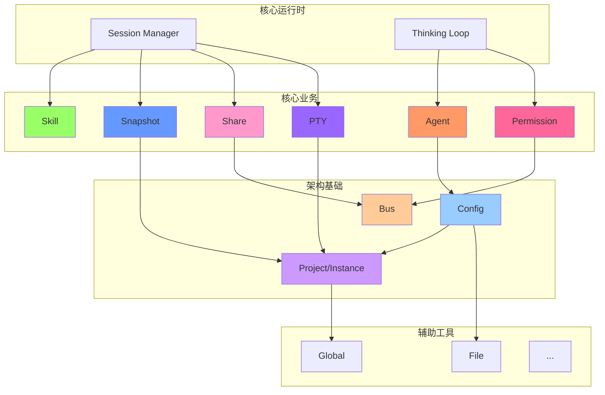

# OpenCode 内部模块深入分析

> 本目录包含对 `packages/opencode/src` 内部关键子模块的深入分析。

## 模块索引

### 核心业务模块

| 模块 | 描述 | 文档 |
| :--- | :--- | :--- |
| **agent** | Agent 定义 - 内置和自定义 Agent 配置 | [详情](./agent.md) |
| **permission** | 权限系统 - 工具执行前的用户授权机制 | [详情](./permission.md) |
| **snapshot** | 快照系统 - 基于 Git 的文件变更追踪和回滚 | [详情](./snapshot.md) |
| **skill** | 技能系统 - 可复用的指令模板加载 | [详情](./skill.md) |
| **share** | 分享功能 - 会话的云端同步和分享链接 | [详情](./share.md) |
| **pty** | 终端模拟器 - 伪终端管理和 WebSocket 连接 | [详情](./pty.md) |

### 架构基础模块

| 模块 | 描述 | 文档 |
| :--- | :--- | :--- |
| **bus** | 事件总线 - 发布/订阅解耦通信 | [详情](./bus.md) |
| **config** | 配置系统 - 多层级配置加载和合并 | [详情](./config.md) |
| **project** | 项目上下文 - 项目识别和实例状态隔离 | [详情](./project.md) |

### 辅助基础设施

| 模块类别 | 包含模块 | 文档 |
| :--- | :--- | :--- |
| **工具集合** | file, global, id, env, flag, format, shell, auth, bun, installation, ide, command, patch | [详情](./utilities.md) |

---

## 模块关系图

---

## 模块深度统计

| 模块 | 源码行数 | 复杂度 | 阅读优先级 |
| :--- | :---: | :---: | :---: |
| agent | ~250 | 中 | ⭐⭐⭐⭐⭐ |
| config | ~1100 | 高 | ⭐⭐⭐⭐ |
| permission | ~210 | 中 | ⭐⭐⭐⭐ |
| bus | ~100 | 低 | ⭐⭐⭐ |
| snapshot | ~200 | 中 | ⭐⭐⭐ |
| project | ~80 | 低 | ⭐⭐⭐ |
| pty | ~230 | 中 | ⭐⭐⭐ |
| skill | ~125 | 低 | ⭐⭐ |
| share | ~90 | 低 | ⭐⭐ |
| utilities | 各~50-200 | 低 | ⭐ |

---

## 推荐阅读顺序

1. **理解架构基础**: [project](./project.md) → [bus](./bus.md) → [config](./config.md)
2. **掌握 Agent 系统**: [agent](./agent.md) → [permission](./permission.md) → [skill](./skill.md)
3. **了解状态管理**: [snapshot](./snapshot.md) → [share](./share.md)
4. **探索 I/O 系统**: [pty](./pty.md) → [utilities](./utilities.md)
