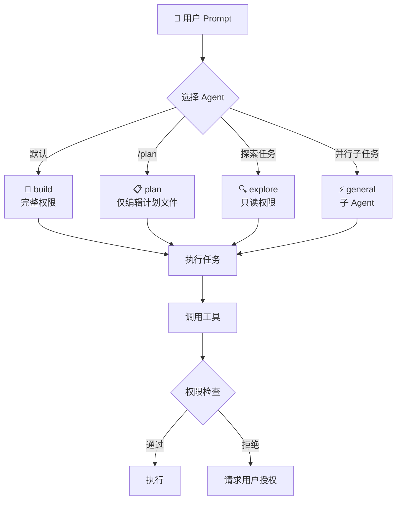

# 内部模块: Agent (Agent 定义)

> Agent 的定义、配置和能力规范。

## 1. 概览 (Overview)
- **路径**: `packages/opencode/src/agent/`
- **定位**: 定义内置 Agent 和加载用户自定义 Agent。
- **核心文件**: `agent.ts`, `prompt/*.txt`

## 2. Agent 选择流程



## 3. 内置 Agent 类型

OpenCode 预置了多种 Agent，各有专长：

| Agent | 模式 | 描述 |
| :--- | :---: | :--- |
| **build** | primary | 默认 Agent，完整工具权限 |
| **plan** | primary | 规划 Agent，仅能编辑 `.opencode/plan/*.md` |
| **explore** | subagent | 快速探索代码库，只读工具 |
| **general** | subagent | 通用子 Agent，可并行执行任务 |
| **compaction** | primary (hidden) | 会话压缩 |
| **title** | primary (hidden) | 会话标题生成 |
| **summary** | primary (hidden) | 会话摘要生成 |

## 3. Agent 数据结构

```typescript
export const Info = z.object({
  name: z.string(),
  description: z.string().optional(),
  mode: z.enum(["subagent", "primary", "all"]),
  native: z.boolean().optional(),       // 是否内置
  hidden: z.boolean().optional(),       // 是否隐藏
  topP: z.number().optional(),
  temperature: z.number().optional(),
  color: z.string().optional(),         // 显示颜色
  permission: PermissionNext.Ruleset,   // 权限规则
  model: z.object({                     // 指定模型
    modelID: z.string(),
    providerID: z.string(),
  }).optional(),
  prompt: z.string().optional(),        // System Prompt
  options: z.record(z.string(), z.any()),
  steps: z.number().int().positive().optional(),  // 最大步数
})
```

## 4. 权限系统集成

每个 Agent 有独立的权限配置：

```typescript
// build Agent 默认权限
const defaults = PermissionNext.fromConfig({
  "*": "allow",
  doom_loop: "ask",
  external_directory: "ask",
  read: {
    "*": "allow",
    "*.env": "deny",       // 拒绝读取 .env 文件
    "*.env.*": "deny",
    "*.env.example": "allow",
  },
})

// explore Agent 限制权限
explore: {
  permission: {
    "*": "deny",           // 默认拒绝
    grep: "allow",         // 仅允许搜索
    glob: "allow",
    list: "allow",
    bash: "allow",
    read: "allow",
  },
}
```

## 5. 自定义 Agent

用户可以通过配置文件或 Markdown 定义自定义 Agent：

### 5.1 配置方式 (`opencode.json`)

```json
{
  "agent": {
    "my-agent": {
      "model": "anthropic/claude-sonnet-4-20250514",
      "temperature": 0.3,
      "description": "专门处理 TypeScript 代码",
      "prompt": "你是一个 TypeScript 专家...",
      "permission": {
        "edit": { "*.ts": "allow", "*": "deny" }
      }
    }
  }
}
```

### 5.2 Markdown 方式 (`.opencode/agent/my-agent.md`)

```markdown
---
description: 专门处理 TypeScript 代码
model: anthropic/claude-sonnet-4-20250514
temperature: 0.3
---

# TypeScript Expert

你是一个 TypeScript 专家，专注于类型安全和最佳实践...
```

## 6. Agent 生成

OpenCode 支持通过 LLM 自动生成 Agent 配置：

```typescript
export async function generate(input: { description: string }) {
  const result = await generateObject({
    model: language,
    schema: z.object({
      identifier: z.string(),
      whenToUse: z.string(),
      systemPrompt: z.string(),
    }),
    messages: [
      { role: "user", content: `Create an agent configuration based on: "${input.description}"` }
    ],
  })
  return result.object
}
```

示例：
```bash
opencode> /agent create "React 组件代码审查专家"
# 自动生成 Agent 配置
```

## 7. Prompt 模板

`src/agent/prompt/` 目录包含专用 Prompt：

| 文件 | 用途 |
| :--- | :--- |
| `compaction.txt` | 会话压缩 |
| `explore.txt` | 代码探索 |
| `summary.txt` | 内容摘要 |
| `title.txt` | 标题生成 |

## 8. 总结

Agent 模块是 OpenCode **行为定制** 的核心：
- **隔离权限**: 不同 Agent 有不同的工具访问权限
- **专业化**: 通过 Prompt 定义专业能力
- **可扩展**: 支持配置文件和 Markdown 两种定义方式
- **智能生成**: 可以通过 LLM 自动创建 Agent
