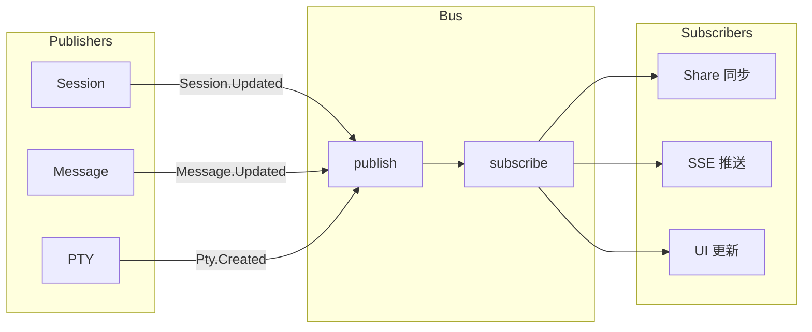

# 内部模块: Bus (事件总线)

> 系统内部的发布/订阅事件机制。

## 1. 概览 (Overview)
- **路径**: `packages/opencode/src/bus/`
- **定位**: 实现模块间的解耦通信。
- **核心文件**: `index.ts`, `bus-event.ts`, `global.ts`

## 2. 核心概念



## 3. 事件定义

使用 `BusEvent.define` 创建类型安全的事件：

```typescript
// 定义事件
export const Event = {
  Updated: BusEvent.define("permission.updated", 
    z.object({
      id: z.string(),
      type: z.string(),
      sessionID: z.string(),
      message: z.string(),
    })
  ),
}
```

## 4. 核心 API

### 4.1 发布事件 (`publish`)

```typescript
export async function publish<Definition extends BusEvent.Definition>(
  def: Definition,
  properties: z.output<Definition["properties"]>,
) {
  const payload = { type: def.type, properties }
  log.info("publishing", { type: def.type })
  
  // 通知局部订阅者
  for (const key of [def.type, "*"]) {
    const match = state().subscriptions.get(key)
    for (const sub of match ?? []) {
      pending.push(sub(payload))
    }
  }
  
  // 通知全局事件 (跨实例)
  GlobalBus.emit("event", {
    directory: Instance.directory,
    payload,
  })
  
  return Promise.all(pending)
}
```

### 4.2 订阅事件 (`subscribe`)

```typescript
export function subscribe<Definition extends BusEvent.Definition>(
  def: Definition,
  callback: (event: { type: string; properties: z.infer<...> }) => void,
) {
  const subscriptions = state().subscriptions
  let match = subscriptions.get(def.type) ?? []
  match.push(callback)
  subscriptions.set(def.type, match)

  // 返回取消订阅函数
  return () => {
    const index = match.indexOf(callback)
    if (index !== -1) match.splice(index, 1)
  }
}
```

### 4.3 订阅所有事件 (`subscribeAll`)

```typescript
export function subscribeAll(callback: (event: any) => void) {
  return raw("*", callback)  // 使用通配符
}
```

### 4.4 一次性订阅 (`once`)

```typescript
export function once<Definition>(
  def: Definition,
  callback: (event) => "done" | undefined,
) {
  const unsub = subscribe(def, (event) => {
    if (callback(event)) unsub()  // 条件满足后自动取消
  })
}
```

## 5. 使用示例

### 场景 1: 监听会话更新

```typescript
// 订阅会话更新事件
const unsub = Bus.subscribe(Session.Event.Updated, (evt) => {
  console.log("Session updated:", evt.properties.info.id)
})

// 不再需要时取消订阅
unsub()
```

### 场景 2: Share 模块同步

```typescript
// src/share/share.ts
export function init() {
  Bus.subscribe(Session.Event.Updated, async (evt) => {
    await sync("session/info/" + evt.properties.info.id, evt.properties.info)
  })
  
  Bus.subscribe(MessageV2.Event.Updated, async (evt) => {
    await sync("session/message/" + sessionID + "/" + messageID, ...)
  })
}
```

### 场景 3: SSE 事件推送

```typescript
// Server 端订阅所有事件并推送给客户端
Bus.subscribeAll((event) => {
  sseClients.forEach(client => {
    client.send(`data: ${JSON.stringify(event)}\n\n`)
  })
})
```

## 6. 全局事件 (`GlobalBus`)

`GlobalBus` 用于跨项目实例通信：

```typescript
// 当实例销毁时通知
GlobalBus.emit("event", {
  directory: Instance.directory,
  payload: {
    type: "server.instance.disposed",
    properties: { directory: Instance.directory },
  },
})
```

## 7. 常见事件类型

| 模块 | 事件 | 时机 |
| :--- | :--- | :--- |
| Session | `session.updated` | 会话状态变更 |
| Message | `message.updated` | 消息内容变更 |
| Message | `message.part.updated` | 消息片段更新 |
| Permission | `permission.updated` | 权限请求创建 |
| Permission | `permission.replied` | 权限响应 |
| PTY | `pty.created` | 终端创建 |
| PTY | `pty.exited` | 终端退出 |

## 8. 总结

Bus 模块实现了 **事件驱动架构**：
- **解耦**: 发布者和订阅者互不感知
- **类型安全**: 使用 Zod Schema 定义事件
- **灵活订阅**: 支持通配符和一次性订阅
- **跨实例**: GlobalBus 支持多项目通信
