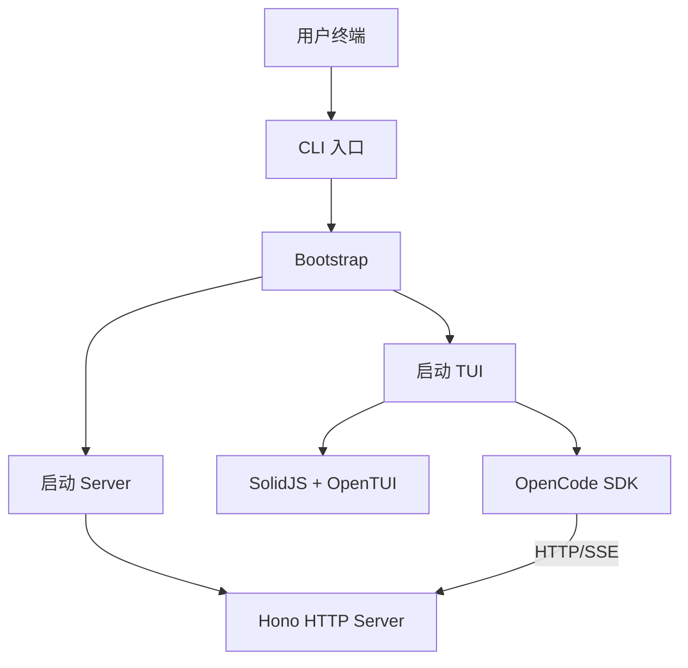

# 内部模块: CLI (命令行接口)

> OpenCode 的命令行实现和 TUI (Terminal UI)。

---

## 1. 概览

- **路径**: `packages/opencode/src/cli/`
- **定位**: 用户与 OpenCode 交互的主要接口
- **核心职责**:
  - 命令解析和路由
  - TUI 渲染和交互
  - Server 启动和管理

---

## 2. CLI 架构



---

## 3. 核心模块

| 模块 | 文件 | 职责 |
|------|------|------|
| **bootstrap** | `bootstrap.ts` | 启动流程控制 |
| **ui** | `ui.ts` | TUI 渲染 |
| **network** | `network.ts` | 网络连接管理 |
| **error** | `error.ts` | 错误处理 |
| **upgrade** | `upgrade.ts` | 版本升级 |
| **cmd/** | `cmd/*` | 命令实现 |

---

## 4. 命令列表

基于 `src/cli/cmd/` 目录：

| 命令 | 描述 | 优先级 |
|------|------|--------|
| **run** | 启动交互式会话 | ⭐⭐⭐⭐⭐ |
| **serve** | 启动 Server 模式 | ⭐⭐⭐⭐ |
| **history** | 查看会话历史 | ⭐⭐⭐ |
| **config** | 配置管理 | ⭐⭐⭐ |
| **model** | 模型管理 | ⭐⭐⭐ |
| **session** | 会话操作 | ⭐⭐⭐ |
| **agent** | Agent 管理 | ⭐⭐ |
| **plugin** | 插件管理 | ⭐⭐ |

---

## 5. Bootstrap 流程

```typescript
// src/cli/bootstrap.ts
export async function bootstrap() {
  // 1. 启动 Server
  const server = await startServer({
    port: 0, // 随机端口
    hostname: "127.0.0.1"
  })
  
  // 2. 创建 SDK Client
  const client = createClient({
    baseURL: server.url
  })
  
  // 3. 启动 TUI
  await startTUI(client)
  
  // 4. 等待用户退出
  await waitForExit()
  
  // 5. 清理资源
  await server.close()
}
```

---

## 6. TUI 实现

OpenCode 的 TUI 基于：
- **SolidJS**: 响应式 UI 框架
- **OpenTUI**: Terminal UI 库
- **实时同步**: 通过 SSE 与 Server 同步状态

---

## 7. 相关文档

- [Server 模块](./server.md) - HTTP Server 实现
- [SDK 包](../packages/sdk/README.md) - Client SDK
- [快速入门](../getting-started.md) - CLI 使用指南
