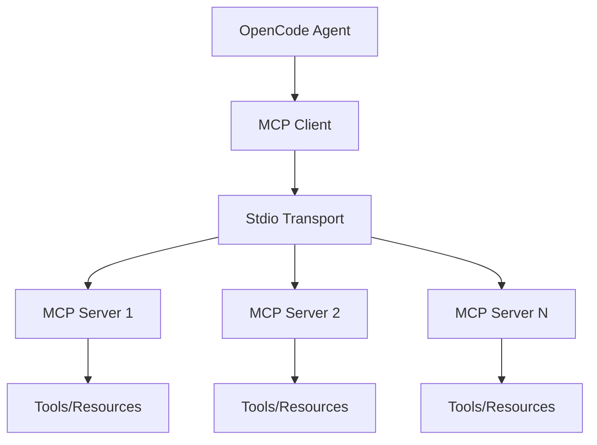

# MCP 实现细节 (MCP Implementation)

> OpenCode 作为 MCP Client 的完整实现。

---

## 1. 概览

- **路径**: `packages/opencode/src/mcp/`
- **定位**: Model Context Protocol 客户端实现
- **核心职责**:
  - 连接和管理 MCP Server
  - 发现工具/资源/Prompt
  - 执行 MCP 工具调用

---

## 2. 架构



---

## 3. 核心实现

### 3.1 MCP Client

```typescript
// src/mcp/client.ts
export class MCPClient {
  private connection: StdioClientTransport
  
  async connect(config: MCPServerConfig) {
    // 启动 MCP Server 进程
    this.connection = new StdioClientTransport({
      command: config.command,
      args: config.args,
      env: config.env
    })
    
    await this.connection.connect()
  }
  
  async listTools() {
    const response = await this.connection.request({
      method: "tools/list"
    })
    return response.tools
  }
  
  async callTool(name: string, args: any) {
    const response = await this.connection.request({
      method: "tools/call",
      params: { name, arguments: args }
    })
    return response.content
  }
}
```

### 3.2 工具注册

MCP 工具会自动注册到 Tool Registry：

```typescript
// 发现 MCP 工具
const mcpServers = await Config.getMCPServers()

for (const server of mcpServers) {
  const client = new MCPClient()
  await client.connect(server)
  
  const tools = await client.listTools()
  
  for (const tool of tools) {
    ToolRegistry.register({
      id: `mcp_${server.name}_${tool.name}`,
      init: async () => ({
        description: tool.description,
        parameters: tool.inputSchema,
        execute: async (args) => {
          return await client.callTool(tool.name, args)
        }
      })
    })
  }
}
```

---

## 4. 配置示例

```json
{
  "mcpServers": {
    "filesystem": {
      "command": "npx",
      "args": ["-y", "@modelcontextprotocol/server-filesystem", "/path"]
    },
    "postgres": {
      "command": "npx",
      "args": ["-y", "@modelcontextprotocol/server-postgres"],
      "env": {
        "DATABASE_URL": "postgresql://..."
      }
    }
  }
}
```

---

## 5. 相关文档

- [MCP 协议](../concepts/mcp.md) - 协议概念
- [Cookbook - 集成 MCP Server](../cookbook/02-integrate-mcp-server.md) - 实战案例
- [工具系统](./tool.md) - 工具注册机制
