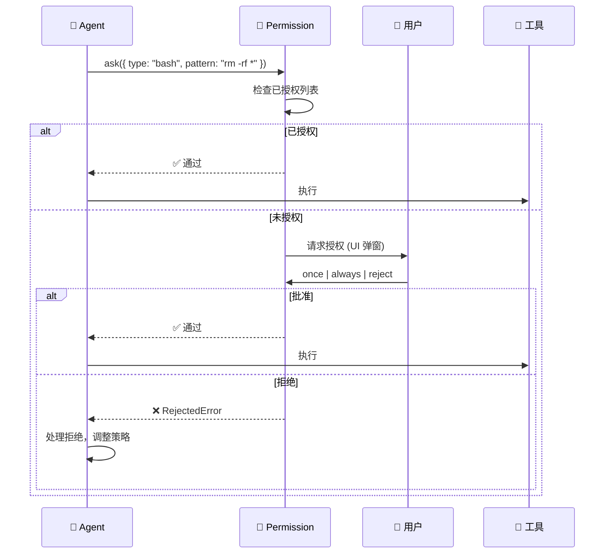

# 内部模块: Permission (权限系统)

> Agent 工具执行前的用户授权机制。

## 1. 概览 (Overview)
- **路径**: `packages/opencode/src/permission/`
- **定位**: 控制 Agent 执行敏感操作前必须获得用户许可。
- **核心文件**: `index.ts`, `arity.ts`, `next.ts`

## 2. 设计理念

OpenCode 的权限系统遵循 **"Ask Before Act"** 原则：



## 3. 核心数据结构

### 3.1 Permission Info

```typescript
const Info = z.object({
  id: z.string(),              // 权限请求 ID
  type: z.string(),            // 权限类型 (如 "bash", "write")
  pattern: z.union([           // 匹配模式 (如文件路径)
    z.string(), 
    z.array(z.string())
  ]).optional(),
  sessionID: z.string(),       // 所属会话
  messageID: z.string(),       // 触发的消息
  callID: z.string().optional(), // 工具调用 ID
  message: z.string(),         // 显示给用户的描述
  metadata: z.record(z.any()), // 附加信息
  time: z.object({
    created: z.number(),       // 创建时间
  }),
})
```

### 3.2 用户响应类型

```typescript
const Response = z.enum([
  "once",    // 仅本次允许
  "always",  // 本会话始终允许 (同类型操作)
  "reject",  // 拒绝
])
```

## 4. 核心代码解析

### 4.1 请求权限 (`ask`)

```typescript
export async function ask(input: {
  type: Info["type"]
  message: Info["message"]
  pattern?: Info["pattern"]
  sessionID: Info["sessionID"]
  messageID: Info["messageID"]
  callID?: Info["callID"]
  metadata: Info["metadata"]
}) {
  const { pending, approved } = state()
  
  // 1. 检查是否已授权
  const approvedForSession = approved[input.sessionID] || {}
  const keys = toKeys(input.pattern, input.type)
  if (covered(keys, approvedForSession)) return  // 已授权，直接通过
  
  // 2. 触发插件钩子 (允许插件自动处理)
  const result = await Plugin.trigger("permission.ask", info, { status: "ask" })
  if (result.status === "deny") throw new RejectedError(...)
  if (result.status === "allow") return
  
  // 3. 等待用户响应
  pending[input.sessionID][info.id] = { info, resolve, reject }
  Bus.publish(Event.Updated, info)  // 通知前端显示弹窗
  
  return new Promise<void>((resolve, reject) => {
    // 用户响应后 resolve/reject
  })
}
```

### 4.2 处理响应 (`respond`)

```typescript
export function respond(input: { 
  sessionID: string
  permissionID: string
  response: Response 
}) {
  const { pending, approved } = state()
  const match = pending[input.sessionID]?.[input.permissionID]
  if (!match) return
  
  delete pending[input.sessionID][input.permissionID]
  
  if (input.response === "reject") {
    match.reject(new RejectedError(...))
    return
  }
  
  match.resolve()
  
  // "always" 模式: 记住授权，后续同类操作自动通过
  if (input.response === "always") {
    approved[input.sessionID] = approved[input.sessionID] || {}
    const approveKeys = toKeys(match.info.pattern, match.info.type)
    for (const k of approveKeys) {
      approved[input.sessionID][k] = true
    }
    
    // 批量通过所有匹配的待处理请求
    for (const item of Object.values(pending[input.sessionID] || {})) {
      if (covered(toKeys(item.info.pattern, item.info.type), approved[input.sessionID])) {
        respond({ ...input, permissionID: item.info.id })
      }
    }
  }
}
```

### 4.3 通配符匹配

```typescript
function covered(keys: string[], approved: Record<string, boolean>): boolean {
  const pats = Object.keys(approved)
  return keys.every((k) => pats.some((p) => Wildcard.match(k, p)))
}
```

例如：
- 用户授权了 `src/*`
- 后续请求 `src/index.ts` 会自动匹配通过

## 5. 权限类型示例

| 类型 | 场景 | Pattern 示例 |
| :--- | :--- | :--- |
| `bash` | 执行命令 | `rm -rf *`, `npm install` |
| `write` | 写入文件 | `src/*.ts`, `/etc/*` |
| `read` | 读取文件 | `~/.ssh/*`, `.env` |
| `network` | 网络请求 | `https://api.external.com/*` |

## 6. 插件扩展

插件可以通过 `permission.ask` 钩子自定义权限处理：

```typescript
// 自定义插件: 自动批准测试目录的写入
export default async function plugin({ client }) {
  return {
    "permission.ask": async (info, { status }) => {
      if (info.type === "write" && info.pattern?.startsWith("test/")) {
        return { status: "allow" }  // 自动批准
      }
      return { status }  // 使用默认行为
    }
  }
}
```

## 7. 错误处理

```typescript
export class RejectedError extends Error {
  constructor(
    public readonly sessionID: string,
    public readonly permissionID: string,
    public readonly toolCallID?: string,
    public readonly metadata?: Record<string, any>,
    public readonly reason?: string,
  ) {
    super(
      reason ?? "The user rejected permission to use this specific tool call. " +
                "You may try again with different parameters."
    )
  }
}
```

Agent 收到 `RejectedError` 后通常会：
1. 告知用户操作被拒绝
2. 尝试用其他方式完成任务
3. 请求用户提供替代方案

## 8. 总结

Permission 模块是 OpenCode **安全边界** 的核心：
- **用户控制**: 敏感操作必须经过用户许可
- **智能记忆**: "always" 模式避免重复询问
- **插件可扩展**: 允许自定义授权策略
- **优雅降级**: 拒绝后 Agent 可以调整策略
