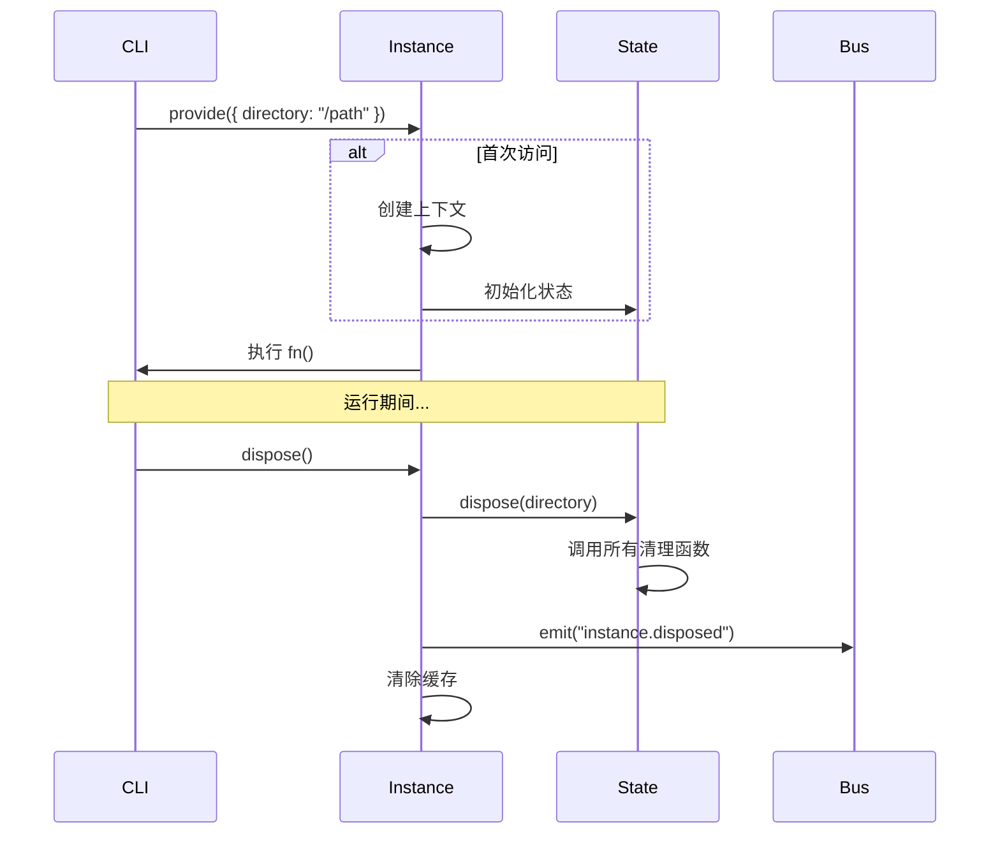
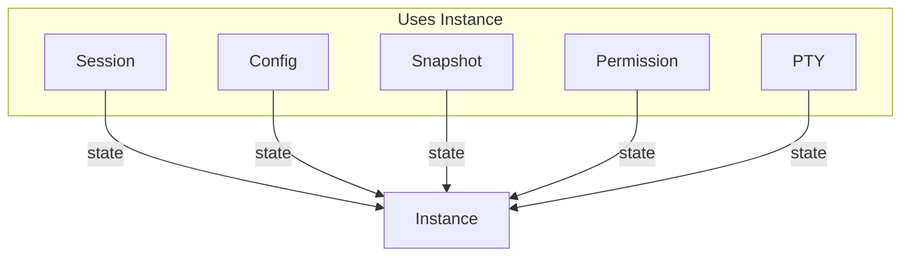

# 内部模块: Project & Instance (项目上下文)

> 项目识别和实例状态管理。

## 1. 概览 (Overview)
- **路径**: `packages/opencode/src/project/`
- **定位**: 管理当前工作目录的项目上下文和状态隔离。
- **核心文件**: `project.ts`, `instance.ts`, `state.ts`

## 2. 核心概念

| 概念 | 说明 |
| :--- | :--- |
| **Project** | 项目元信息 (名称、VCS 类型、根目录) |
| **Instance** | 运行时上下文 (工作目录、状态缓存) |
| **State** | 按实例隔离的状态管理 |

## 3. Project 识别

`Project.fromDirectory` 自动识别项目类型：

```typescript
export async function fromDirectory(directory: string) {
  // 查找 Git 根目录
  const gitRoot = await findGitRoot(directory)
  
  // 确定项目 ID (基于路径 hash)
  const id = createHash(directory)
  
  return {
    project: {
      id,
      name: path.basename(directory),
      vcs: gitRoot ? "git" : "none",
      root: gitRoot || directory,
    },
    sandbox: worktree || directory,  // 沙箱目录
  }
}
```

## 4. Instance 管理

`Instance` 是项目运行时的上下文容器：

```typescript
export const Instance = {
  // 创建或获取实例
  async provide<R>(input: { 
    directory: string
    init?: () => Promise<any>
    fn: () => R 
  }): Promise<R> {
    let existing = cache.get(input.directory)
    if (!existing) {
      existing = (async () => {
        const { project, sandbox } = await Project.fromDirectory(input.directory)
        return { directory: input.directory, worktree: sandbox, project }
      })()
      cache.set(input.directory, existing)
    }
    const ctx = await existing
    return context.provide(ctx, async () => input.fn())
  },

  // 当前目录
  get directory() {
    return context.use().directory
  },

  // 工作树目录 (可能是 worktree)
  get worktree() {
    return context.use().worktree
  },

  // 项目信息
  get project() {
    return context.use().project
  },
}
```

## 5. State 隔离

不同项目有独立的状态空间：

```typescript
// 创建按实例隔离的状态
export function state<S>(
  init: () => S, 
  dispose?: (state: Awaited<S>) => Promise<void>
): () => S {
  return State.create(
    () => Instance.directory,  // 使用目录作为 key
    init, 
    dispose
  )
}

// 使用示例
const sessionState = Instance.state(async () => {
  return {
    sessions: new Map<string, Session>(),
    pending: new Set<string>(),
  }
}, async (state) => {
  // 清理逻辑
  for (const session of state.sessions.values()) {
    await session.close()
  }
})

// 访问当前实例的状态
const current = sessionState()
```

## 6. 实例生命周期



## 7. 使用场景

### 场景 1: 多项目并行

```typescript
// 同时处理两个项目
await Promise.all([
  Instance.provide({ directory: "/project-a", fn: handleA }),
  Instance.provide({ directory: "/project-b", fn: handleB }),
])
// 两个项目有独立的状态
```

### 场景 2: Worktree 沙箱

```typescript
// 在 Worktree 中执行
const ctx = await Instance.provide({
  directory: "/home/user/project",
  fn: async () => {
    // Instance.worktree 可能指向
    // ~/.opencode/data/worktree/proj-id/brave-tiger
    console.log(Instance.worktree)
  }
})
```

## 8. 与其他模块的关系



几乎所有核心模块都使用 `Instance.state()` 来管理状态。

## 9. 总结

Project/Instance 模块提供了 **多项目隔离** 的基础：
- **项目识别**: 自动检测 Git 项目
- **上下文传递**: 使用 AsyncLocalStorage
- **状态隔离**: 每个项目独立的状态空间
- **生命周期**: 完善的初始化和清理机制
