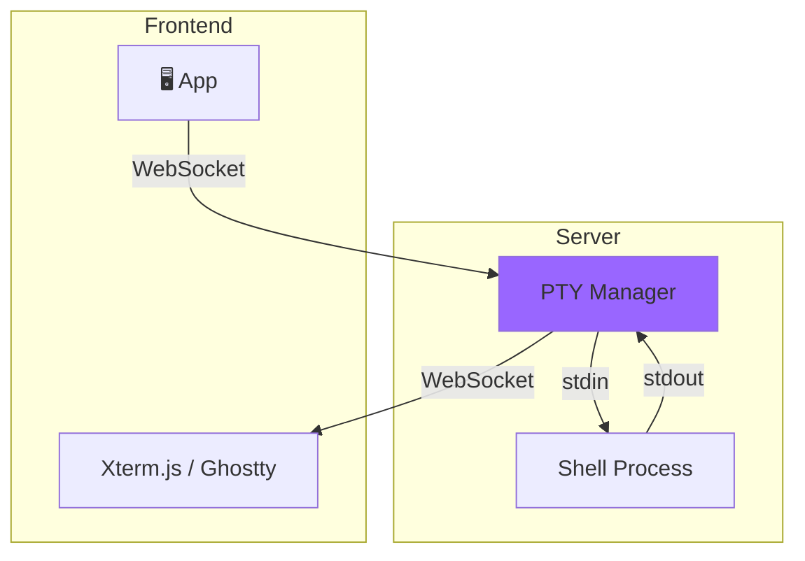

# 内部模块: PTY (伪终端)

> 终端模拟器管理和 WebSocket 连接。

## 1. 概览 (Overview)
- **路径**: `packages/opencode/src/pty/`
- **定位**: 管理交互式终端会话，支持 Web 前端连接。
- **技术**: `bun-pty` + WebSocket

## 2. 核心架构



## 3. 核心数据结构

### 3.1 PTY Info

```typescript
export const Info = z.object({
  id: Identifier.schema("pty"),     // 终端 ID
  title: z.string(),                // 显示标题
  command: z.string(),              // 启动命令
  args: z.array(z.string()),        // 命令参数
  cwd: z.string(),                  // 工作目录
  status: z.enum(["running", "exited"]),
  pid: z.number(),                  // 进程 ID
})
```

### 3.2 Active Session

```typescript
interface ActiveSession {
  info: Info
  process: IPty               // bun-pty 进程
  buffer: string              // 输出缓冲
  subscribers: Set<WSContext> // WebSocket 连接
}
```

## 4. 核心代码解析

### 4.1 创建终端 (`create`)

```typescript
export async function create(input: CreateInput) {
  const id = Identifier.create("pty", false)
  const command = input.command || Shell.preferred()  // 默认使用用户 Shell
  const args = input.args || []
  
  // 为 shell 添加 -l (login shell)
  if (command.endsWith("sh")) {
    args.push("-l")
  }

  const cwd = input.cwd || Instance.directory
  const env = { 
    ...process.env, 
    ...input.env, 
    TERM: "xterm-256color"  // 支持颜色
  }

  // 使用 bun-pty 创建伪终端
  const spawn = await pty()
  const ptyProcess = spawn(command, args, {
    name: "xterm-256color",
    cwd,
    env,
  })

  const session: ActiveSession = {
    info: { id, title, command, args, cwd, status: "running", pid: ptyProcess.pid },
    process: ptyProcess,
    buffer: "",
    subscribers: new Set(),
  }
  
  state().set(id, session)

  // 监听输出
  ptyProcess.onData((data) => {
    let hasOpenConnection = false
    for (const ws of session.subscribers) {
      if (ws.readyState !== 1) {
        session.subscribers.delete(ws)
        continue
      }
      hasOpenConnection = true
      ws.send(data)  // 实时推送
    }
    
    // 如果没有 WebSocket 连接，缓冲输出
    if (!hasOpenConnection) {
      session.buffer += data
      if (session.buffer.length > BUFFER_LIMIT) {
        session.buffer = session.buffer.slice(-BUFFER_LIMIT)
      }
    }
  })

  // 监听退出
  ptyProcess.onExit(({ exitCode }) => {
    session.info.status = "exited"
    Bus.publish(Event.Exited, { id, exitCode })
    state().delete(id)
  })

  Bus.publish(Event.Created, { info: session.info })
  return session.info
}
```

### 4.2 WebSocket 连接 (`connect`)

```typescript
export function connect(id: string, ws: WSContext) {
  const session = state().get(id)
  if (!session) {
    ws.close()
    return
  }

  session.subscribers.add(ws)

  // 发送缓冲的输出 (重连时恢复历史)
  if (session.buffer) {
    const buffer = session.buffer
    session.buffer = ""
    
    // 分块发送，避免阻塞
    for (let i = 0; i < buffer.length; i += BUFFER_CHUNK) {
      ws.send(buffer.slice(i, i + BUFFER_CHUNK))
    }
  }

  return {
    onMessage: (message: string | ArrayBuffer) => {
      session.process.write(String(message))  // 转发输入到 PTY
    },
    onClose: () => {
      session.subscribers.delete(ws)
    },
  }
}
```

### 4.3 调整终端大小 (`resize`)

```typescript
export function resize(id: string, cols: number, rows: number) {
  const session = state().get(id)
  if (session && session.info.status === "running") {
    session.process.resize(cols, rows)
  }
}
```

### 4.4 写入数据 (`write`)

```typescript
export function write(id: string, data: string) {
  const session = state().get(id)
  if (session && session.info.status === "running") {
    session.process.write(data)
  }
}
```

## 5. 事件系统

```typescript
export const Event = {
  Created: BusEvent.define("pty.created", z.object({ info: Info })),
  Updated: BusEvent.define("pty.updated", z.object({ info: Info })),
  Exited: BusEvent.define("pty.exited", z.object({ 
    id: Identifier.schema("pty"), 
    exitCode: z.number() 
  })),
  Deleted: BusEvent.define("pty.deleted", z.object({ 
    id: Identifier.schema("pty") 
  })),
}
```

前端通过 SSE 订阅这些事件来更新 UI。

## 6. 缓冲机制

```typescript
const BUFFER_LIMIT = 1024 * 1024 * 2   // 2MB
const BUFFER_CHUNK = 64 * 1024         // 64KB chunks
```

- 当没有 WebSocket 连接时，输出被缓冲
- 缓冲超过 2MB 时，丢弃旧数据
- 重连时分块发送，避免一次性发送过多数据

## 7. 与 BashTool 的关系

| 特性 | PTY | BashTool |
| :--- | :--- | :--- |
| **交互性** | ✅ 完整交互式终端 | ❌ 单次命令执行 |
| **用户可见** | ✅ 前端 Terminal 组件 | 通常不可见 |
| **持久性** | ✅ 保持 Shell 会话 | ❌ 每次新进程 |
| **用途** | 用户手动操作 | Agent 自动执行 |

## 8. 前端集成

App 使用 Ghostty Web 或 Xterm.js 渲染终端：

```typescript
// packages/app/src/components/terminal.tsx
const terminal = new Terminal()
const ws = new WebSocket(`ws://localhost:${port}/pty/${id}/ws`)

ws.onmessage = (e) => terminal.write(e.data)
terminal.onData((data) => ws.send(data))
```

## 9. 总结

PTY 模块提供了 **完整的终端体验**：
- **实时双向通信**: WebSocket 连接
- **断线恢复**: 输出缓冲机制
- **多用户** : 支持多个 WebSocket 订阅者
- **资源管理**: 进程生命周期管理
