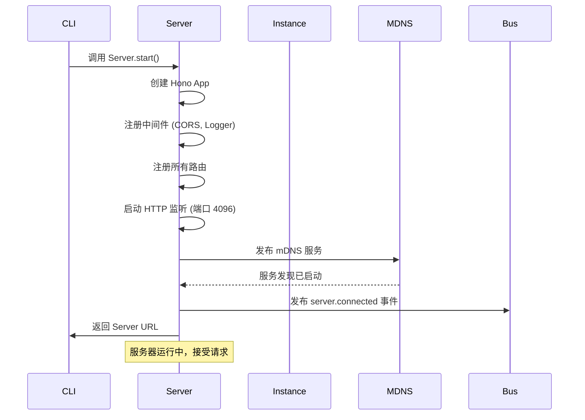
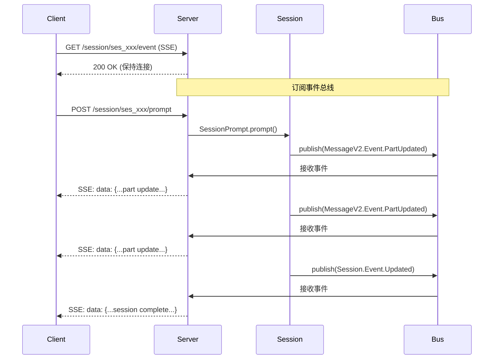
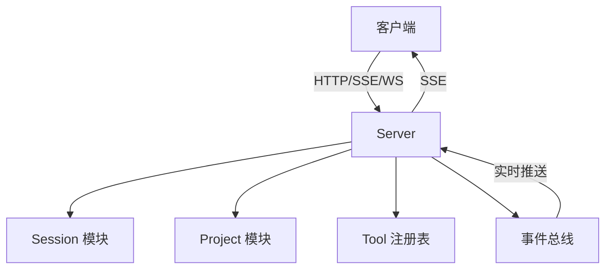

# 内部模块: Server (HTTP 服务器)

> OpenCode 的 HTTP API 服务器，提供 REST API、WebSocket 和 SSE 实时通信。

## 1. 概览 (Overview)

- **路径**: `packages/opencode/src/server/`
- **定位**: OpenCode 的网络接口层，所有客户端（Desktop, Web, CLI, VS Code 等）都通过 Server 与核心通信
- **技术栈**: 
  - **Hono** - 高性能 Web 框架
  - **WebSocket** - 双向实时通信
  - **SSE (Server-Sent Events)** - 服务端推送
  - **OpenAPI** - API 文档自动生成

### 核心文件列表

| 文件 | 行数 | 职责 |
|------|------|------|
| **server.ts** | ~94,353 | 主服务器，包含所有 REST API 路由 |
| **tui.ts** | ~1,757 | Terminal UI 专用路由（CLI 模式） |
| **project.ts** | ~2,193 | 项目管理路由 |
| **question.ts** | ~2,402 | 用户交互问答路由 |
| **mdns.ts** | ~1,295 | mDNS 服务发现 |
| **error.ts** | ~839 | 错误处理和标准化响应 |

---

## 2. 服务器架构

### 2.1 启动流程



### 2.2 中间件栈

```typescript
// src/server/server.ts (简化)
const app = new Hono()
  // 1. 错误处理中间件
  .onError((err, c) => {
    if (err instanceof NamedError) {
      return c.json(err.toObject(), { status: getStatusCode(err) })
    }
    return c.json(new NamedError.Unknown({ message: err.stack }).toObject(), {
      status: 500,
    })
  })
  
  // 2. 日志中间件
  .use(async (c, next) => {
    log.info("request", { method: c.req.method, path: c.req.path })
    const timer = log.time("request")
    await next()
    timer.stop()
  })
  
  // 3. CORS 中间件
  .use(cors({
    origin(input) {
      // 允许 localhost
      if (input.startsWith("http://localhost:")) return input
      if (input.startsWith("http://127.0.0.1:")) return input
      
      // 允许 Tauri
      if (input === "tauri://localhost") return input
      
      // 允许 *.opencode.ai
      if (/^https:\/\/([a-z0-9-]+\.)*opencode\.ai$/.test(input)) {
        return input
      }
      
      return // 拒绝其他来源
    },
  }))
  
  // 4. 注册路由...
```

---

## 3. 路由系统

OpenCode 的 API 按功能模块组织成多个路由组：

### 3.1 路由分类

| 路由前缀 | 模块 | 职责 |
|---------|------|------|
| `/global/*` | 全局 | 健康检查、全局事件、实例管理 |
| `/project/*` | 项目 | 项目列表、当前项目、项目更新 |
| `/session/*` | 会话 | 会话 CRUD、消息管理、对话流程 |
| `/message/*` | 消息 | 消息 CRUD、Part 更新 |
| `/config/*` | 配置 | 配置读取和更新 |
| `/provider/*` | 提供商 | LLM 提供商和模型列表 |
| `/agent/*` | Agent | Agent 列表和创建 |
| `/tool/*` | 工具 | 工具注册表和执行 |
| `/file/*` | 文件 | 文件系统操作 |
| `/lsp/*` | LSP | 代码智能功能 |
| `/mcp/*` | MCP | MCP 服务器管理 |
| `/pty/*` | 终端 | 伪终端管理 |
| `/tui/control/*` | TUI | Terminal UI 控制（CLI 模式） |
| `/question/*` | 问答 | 用户交互问答 |

### 3.2 核心 API 端点详解

#### Global 路由

```typescript
// GET /global/health - 健康检查
{
  "healthy": true,
  "version": "1.0.0"
}

// GET /global/event - 全局 SSE 事件流
// 返回 text/event-stream
data: {"directory": "/path", "payload": {"type": "session.updated", ...}}
data: {"directory": "/path", "payload": {"type": "server.heartbeat", ...}}

// POST /global/dispose - 清理所有实例
// 返回 true
```

#### Project 路由

```typescript
// GET /project/ - 列出所有项目
[
  {
    "id": "proj_xxx",
    "directory": "/path/to/project",
    "name": "My Project",
    "icon": "📦",
    "color": "#3b82f6"
  }
]

// GET /project/current - 获取当前项目
{
  "id": "proj_xxx",
  "directory": "/Users/...",
  ...
}

// PATCH /project/:projectID - 更新项目
{
  "name": "New Name",
  "icon": "🚀",
  "color": "#10b981"
}
```

#### Session 路由

```typescript
// POST /session - 创建新会话
{
  "directory": "/path/to/project",
  "title": "Implement authentication"
}
// 返回 Session.Info

// GET /session/:sessionID - 获取会话详情
{
  "id": "ses_xxx",
  "title": "...",
  "summary": { "additions": 100, "deletions": 20, "files": 5 },
  ...
}

// POST /session/:sessionID/prompt - 发送消息并触发 Agent
{
  "parts": [
    { "type": "text", "text": "帮我实现登录功能" }
  ],
  "agent": "build",  // 可选
  "model": {         // 可选
    "providerID": "anthropic",
    "modelID": "claude-sonnet-4"
  }
}

// GET /session/:sessionID/event - 会话 SSE 事件流
// 实时推送会话状态变化
```

#### Message 路由

```typescript
// GET /session/:sessionID/message - 列出所有消息
[
  {
    "id": "msg_xxx",
    "role": "user",
    "parts": [...]
  },
  {
    "id": "msg_yyy",
    "role": "assistant",
    "parts": [...]
  }
]

// GET /message/:messageID - 获取消息详情
{
  "id": "msg_xxx",
  "sessionID": "ses_xxx",
  "role": "assistant",
  "parts": [
    { "type": "text", "text": "我会帮你..." },
    { "type": "tool", "tool": "read", "args": {...}, "state": {...} }
  ],
  "tokens": { "input": 1000, "output": 500 }
}
```

---

## 4. 实时通信机制

### 4.1 SSE (Server-Sent Events)

OpenCode 使用 SSE 实现**服务端推送**，让客户端实时获取状态更新。

#### 全局事件流

```typescript
// GET /global/event
export const GlobalEventRoute = app.get("/global/event", async (c) => {
  return streamSSE(c, async (stream) => {
    // 1. 发送连接确认
    await stream.writeSSE({
      data: JSON.stringify({
        payload: { type: "server.connected", properties: {} }
      })
    })
    
    // 2. 订阅全局事件总线
    async function handler(event: any) {
      await stream.writeSSE({
        data: JSON.stringify(event)
      })
    }
    GlobalBus.on("event", handler)
    
    // 3. 心跳（防止超时）
    const heartbeat = setInterval(() => {
      stream.writeSSE({
        data: JSON.stringify({
          payload: { type: "server.heartbeat", properties: {} }
        })
      })
    }, 30000)  // 每 30 秒
    
    // 4. 清理
    await new Promise<void>((resolve) => {
      stream.onAbort(() => {
        clearInterval(heartbeat)
        GlobalBus.off("event", handler)
        resolve()
      })
    })
  })
})
```

#### 会话事件流

每个会话也有独立的 SSE 连接：

```typescript
// GET /session/:sessionID/event
{
  // 会话级别事件
  type: "session.updated",
  properties: {
    info: { id: "ses_xxx", title: "...", ... }
  }
}

{
  // 消息更新事件
  type: "message.updated",
  properties: {
    info: { id: "msg_xxx", role: "assistant", ... }
  }
}

{
  // Part 增量更新（流式）
  type: "message.part.updated",
  properties: {
    part: { id: "part_xxx", type: "text", ... },
    delta: "继续"  // 增量文本
  }
}
```

### 4.2 WebSocket

用于 PTY (伪终端) 的双向通信：

```typescript
// WebSocket: /pty/:ptyID
app.get("/pty/:ptyID", 
  upgradeWebSocket((c) => ({
    onOpen(evt, ws) {
      const ptyID = c.req.param("ptyID")
      const pty = Pty.get(ptyID)
      
      // 监听终端输出
      pty.onData((data) => {
        ws.send(data)
      })
    },
    
    onMessage(evt, ws) {
      // 接收用户输入
      const ptyID = c.req.param("ptyID")
      const pty = Pty.get(ptyID)
      pty.write(evt.data)
    },
    
    onClose() {
      // 清理资源
    }
  }))
)
```

### 4.3 事件流程图



---

## 5. 专用路由模块

### 5.1 TUI 路由 (Terminal UI)

**文件**: `src/server/tui.ts`

TUI 路由用于 CLI 模式下的**反向代理**模式：

```typescript
// CLI 运行在本地，需要与 Server 通信
// 但 CLI 不能直接调用某些需要 UI 的功能（如 question）
// 所以通过 TUI 路由让 Server "回调" CLI

// CLI 端：轮询获取请求
const request = await fetch("/tui/control/next")
// { "path": "/question", "body": {...} }

// CLI 处理请求（显示 UI）
const answer = await showQuestionUI(request.body)

// CLI 返回响应
await fetch("/tui/control/response", {
  method: "POST",
  body: JSON.stringify(answer)
})
```

**使用场景**:
- 权限询问（CLI 显示提示，等待用户 Y/N）
- 问答交互（CLI 显示选项，用户选择）

### 5.2 Project 路由

**文件**: `src/server/project.ts`

简单的 CRUD 操作：

```typescript
export const ProjectRoute = new Hono()
  // GET / - 列出所有项目
  .get("/", async (c) => {
    const projects = await Project.list()
    return c.json(projects)
  })
  
  // GET /current - 获取当前项目
  .get("/current", async (c) => {
    return c.json(Instance.project)
  })
  
  // PATCH /:projectID - 更新项目
  .patch("/:projectID", async (c) => {
    const projectID = c.req.param("projectID")
    const body = await c.req.json()
    const project = await Project.update({ ...body, projectID })
    return c.json(project)
  })
```

### 5.3 Question 路由

**文件**: `src/server/question.ts`

处理 `question` 工具的用户交互：

```typescript
// POST /question/:questionID/answer - 提交答案
{
  "answer": {
    "choices": ["option1"]
  }
}

// GET /question/:questionID - 获取问题详情
{
  "id": "q_xxx",
  "questions": [
    {
      "header": "Confirm",
      "question": "是否允许执行 bash 命令?",
      "options": [
        { "label": "允许", "description": "执行命令" },
        { "label": "拒绝", "description": "取消操作" }
      ]
    }
  ]
}
```

---

## 6. mDNS 服务发现

**文件**: `src/server/mdns.ts`

使用 **Bonjour/mDNS** 协议在局域网内发布服务：

```typescript
// src/server/mdns.ts
export namespace MDNS {
  export function publish(port: number, name = "opencode") {
    const bonjour = new Bonjour()
    
    const service = bonjour.publish({
      name,
      type: "http",  // HTTP 服务
      port,
      txt: { path: "/" },
    })
    
    service.on("up", () => {
      log.info("mDNS service published", { name, port })
    })
  }
}
```

**作用**:
- Desktop App 可以自动发现本地运行的 Server
- 不需要手动输入 IP 和端口
- 支持局域网内多个 OpenCode 实例

**使用场景**:
```
场景: 用户在 Mac 上运行 OpenCode Desktop
  1. Server 启动在 localhost:4096
  2. MDNS.publish(4096, "opencode")
  3. Desktop App 扫描局域网
  4. 发现 "opencode._http._tcp.local"
  5. 自动连接到 http://localhost:4096
```

---

## 7. 错误处理

**文件**: `src/server/error.ts`

标准化错误响应：

```typescript
// src/server/error.ts
export const errors = (...codes: number[]) => {
  const result: Record<number, any> = {}
  
  for (const code of codes) {
    result[code] = {
      description: getDescription(code),
      content: {
        "application/json": {
          schema: resolver(NamedError.schema)
        }
      }
    }
  }
  
  return result
}

// 使用示例
app.get("/session/:sessionID", 
  describeRoute({
    responses: {
      200: { ... },
      ...errors(400, 404)  // 自动添加 400 和 404 错误响应
    }
  })
)
```

**错误格式**:
```json
{
  "name": "Session.NotFoundError",
  "message": "Session not found: ses_xxx",
  "data": {
    "sessionID": "ses_xxx"
  }
}
```

---

## 8. OpenAPI 集成

OpenCode 使用 **hono-openapi** 自动生成 API 文档：

```typescript
import { describeRoute, resolver, validator, generateSpecs } from "hono-openapi"

// 1. 描述路由
app.get("/session/:sessionID",
  describeRoute({
    summary: "Get session",
    description: "Retrieve detailed information about a session by its ID.",
    operationId: "session.get",  // 用于 SDK 生成
    responses: {
      200: {
        description: "Session information",
        content: {
          "application/json": {
            schema: resolver(Session.Info)  // 从 Zod 自动生成 JSON Schema
          }
        }
      }
    }
  }),
  async (c) => { ... }
)

// 2. 生成 OpenAPI Spec
const spec = generateSpecs(app)
// 输出到 openapi.json
```

**优势**:
- **类型安全**: 从 Zod Schema 自动生成
- **文档自动化**: 无需手写 OpenAPI YAML
- **SDK 生成**: 可用于生成客户端 SDK

---

## 9. 实战场景

### 场景 1: 构建 Desktop App 客户端

```typescript
// Desktop App (SolidJS)
import { createClient } from "@opencode-ai/sdk"

const client = createClient({ 
  url: "http://localhost:4096" 
})

// 1. 创建会话
const session = await client.session.create({
  directory: "/path/to/project",
  title: "My Task"
})

// 2. 订阅实时更新
const eventSource = new EventSource(
  `http://localhost:4096/session/${session.id}/event`
)

eventSource.onmessage = (event) => {
  const data = JSON.parse(event.data)
  
  if (data.payload.type === "message.part.updated") {
    // 更新 UI，显示增量文本
    updateUI(data.payload.properties.delta)
  }
}

// 3. 发送消息
await client.session.prompt({
  sessionID: session.id,
  parts: [
    { type: "text", text: "帮我重构这个函数" }
  ]
})
```

### 场景 2: VS Code Extension 集成

```typescript
// VS Code Extension
const serverUrl = "http://localhost:4096"

// 1. 健康检查
const health = await fetch(`${serverUrl}/global/health`).then(r => r.json())
if (!health.healthy) throw new Error("Server not ready")

// 2. 获取当前项目
const project = await fetch(`${serverUrl}/project/current`).then(r => r.json())

// 3. 创建会话（使用当前打开的文件夹）
const session = await fetch(`${serverUrl}/session`, {
  method: "POST",
  headers: { "Content-Type": "application/json" },
  body: JSON.stringify({
    directory: vscode.workspace.rootPath,
    title: "VS Code Session"
  })
}).then(r => r.json())

// 4. 发送选中的代码
const editor = vscode.window.activeTextEditor
const selection = editor.document.getText(editor.selection)

await fetch(`${serverUrl}/session/${session.id}/prompt`, {
  method: "POST",
  body: JSON.stringify({
    parts: [
      { type: "text", text: "解释这段代码:\n" + selection }
    ]
  })
})
```

### 场景 3: 自定义工具调用

```typescript
// 直接调用工具（不通过 Agent）
const result = await fetch(`${serverUrl}/tool/read/execute`, {
  method: "POST",
  body: JSON.stringify({
    filePath: "/path/to/file.ts",
    offset: 0,
    limit: 100
  })
}).then(r => r.json())

console.log(result.output)  // 文件内容
```

---

## 10. 常见陷阱与最佳实践

### ❌ 陷阱 1: SSE 连接超时

**问题**:
```typescript
// SSE 连接可能被中间件或浏览器超时关闭
const eventSource = new EventSource("/session/xxx/event")
// 60 秒后自动断开
```

**解决方案**:
```typescript
// Server 端发送心跳（已内置）
const heartbeat = setInterval(() => {
  stream.writeSSE({
    data: JSON.stringify({
      payload: { type: "server.heartbeat", properties: {} }
    })
  })
}, 30000)  // 每 30 秒

// Client 端重连
eventSource.onerror = () => {
  eventSource.close()
  setTimeout(() => {
    eventSource = new EventSource("/session/xxx/event")
  }, 1000)
}
```

### ❌ 陷阱 2: CORS 配置错误

**错误做法**:
```typescript
// 允许所有来源（安全隐患）
cors({ origin: "*" })
```

**正确做法**:
```typescript
// 白名单模式
cors({
  origin(input) {
    const allowed = [
      /^http:\/\/localhost:\d+$/,
      /^https:\/\/.*\.opencode\.ai$/,
      "tauri://localhost"
    ]
    
    return allowed.some(pattern => 
      typeof pattern === "string" 
        ? pattern === input 
        : pattern.test(input)
    )
  }
})
```

### ✅ 最佳实践 1: 使用 OpenAPI 描述

```typescript
// ✅ 完整的 API 描述
app.post("/session/:sessionID/prompt",
  describeRoute({
    summary: "Send prompt to session",
    description: "Send a user message to trigger the agent to start working.",
    operationId: "session.prompt",
    responses: {
      200: { ... },
      ...errors(400, 404, 500)
    }
  }),
  validator("param", z.object({ sessionID: z.string() })),
  validator("json", SessionPrompt.PromptInput),
  async (c) => { ... }
)

// ❌ 缺少描述
app.post("/session/:sessionID/prompt", async (c) => { ... })
```

### ✅ 最佳实践 2: 错误处理

```typescript
// ✅ 使用 NamedError
if (!session) {
  throw new Session.NotFoundError({ sessionID })
}

// Server 自动处理
.onError((err, c) => {
  if (err instanceof NamedError) {
    return c.json(err.toObject(), { status: getStatusCode(err) })
  }
  // ...
})

// ❌ 抛出普通 Error
if (!session) {
  throw new Error("Not found")  // 客户端无法区分错误类型
}
```

---

## 11. 性能优化

### 11.1 连接池

```typescript
// Server 复用 Instance
// 相同 directory 使用同一个 Instance
const instance = await Instance.get(directory)
```

### 11.2 SSE 流式响应

```typescript
// 不要等待完整结果
// ❌
const fullResponse = await llm.generate()
res.json(fullResponse)

// ✅ 流式推送
for await (const chunk of llm.stream()) {
  stream.writeSSE({ data: JSON.stringify(chunk) })
}
```

---

## 12. 总结

Server 模块是 OpenCode 的**网络接口层**：

### 核心职责
- ✅ **REST API**: 提供完整的 CRUD 操作
- ✅ **实时通信**: SSE 和 WebSocket 支持
- ✅ **服务发现**: mDNS 自动发现
- ✅ **错误处理**: 标准化错误响应

### 关键设计
- **Hono 框架**: 高性能、类型安全
- **OpenAPI 集成**: 自动生成文档和 Schema
- **事件驱动**: 通过 Bus 获取实时更新
- **模块化路由**: 分离 TUI、Project、Question 等路由

### 与其他模块的关系


**下一步**: 阅读 [ACP 协议](../concepts/acp.md) 了解编辑器集成机制
