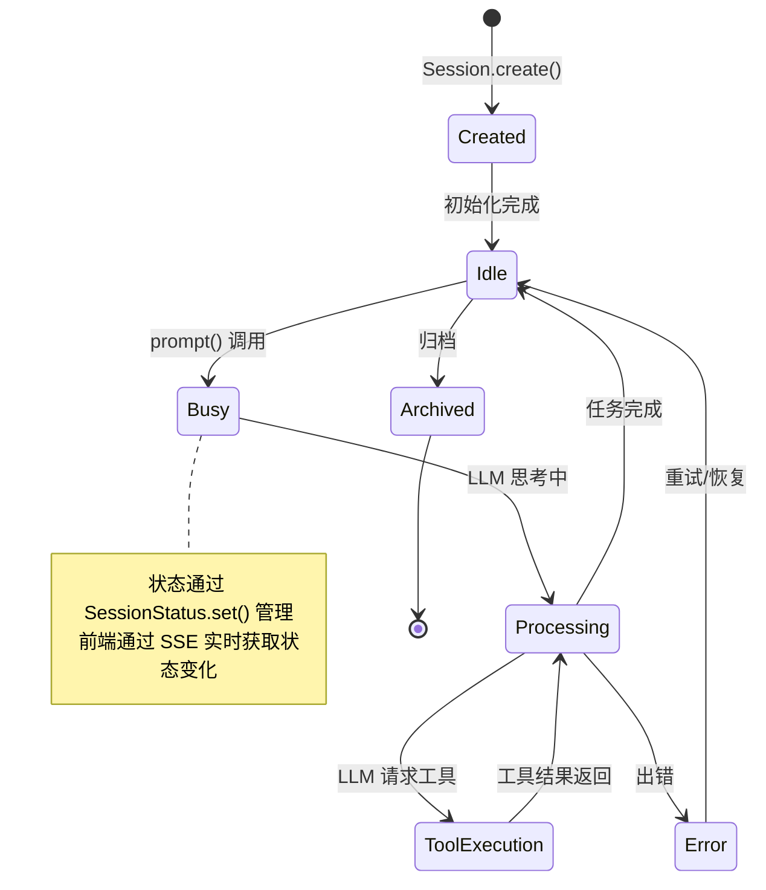
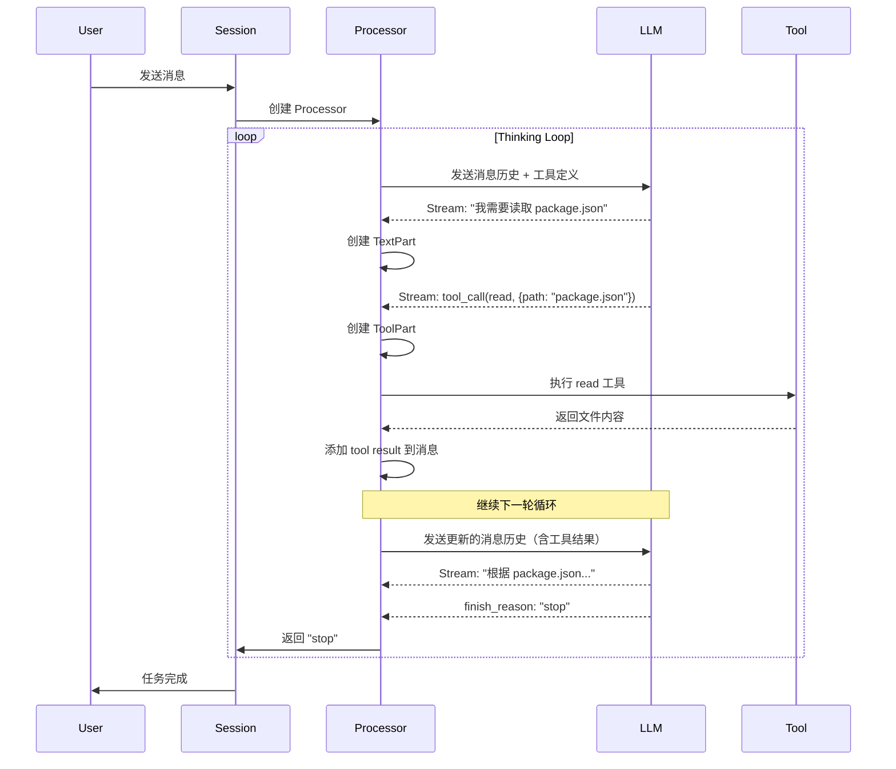
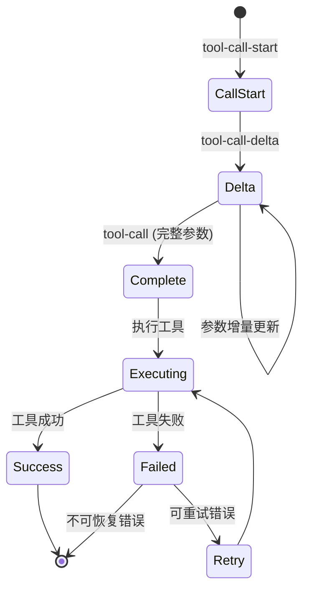
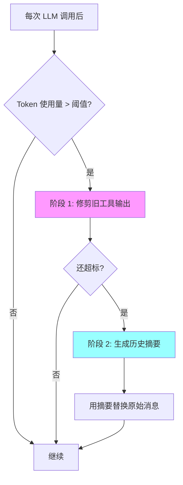
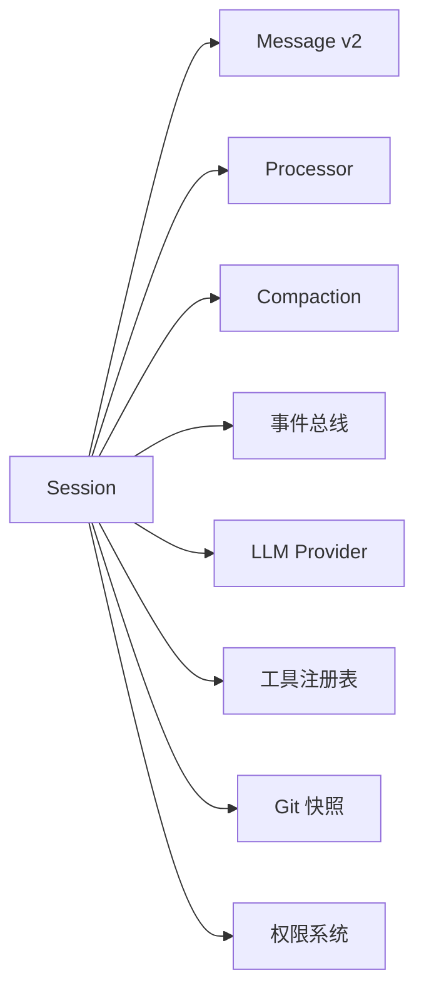

# 内部模块: Session (会话管理)

> OpenCode 的核心大脑，管理对话生命周期、上下文和 Agent 执行循环。

## 1. 概览 (Overview)

- **路径**: `packages/opencode/src/session/`
- **定位**: OpenCode 最核心的模块，负责整个对话的生命周期管理
- **核心职责**: 
  - 管理 Agent 与 LLM 的交互循环
  - 处理消息流和工具调用
  - 上下文压缩和 Token 管理
  - 会话状态持久化

### 核心文件列表

| 文件 | 行数 | 职责 |
|------|------|------|
| **index.ts** | ~13,697 | 会话数据结构、CRUD 操作、事件定义 |
| **prompt.ts** | ~53,223 | **核心循环**，System Prompt 构建 |
| **processor.ts** | ~15,461 | 消息处理器，处理 LLM 响应和工具调用 |
| **message-v2.ts** | ~19,260 | 消息格式 v2，Part 系统 |
| **compaction.ts** | ~7,216 | 上下文压缩和 Token 管理 |
| **llm.ts** | ~6,607 | LLM 调用封装 |
| **summary.ts** | ~6,066 | 会话摘要生成 |
| **system.ts** | ~4,415 | System Prompt 构建 |
| **retry.ts** | ~3,087 | 错误重试逻辑 |
| **revert.ts** | ~3,819 | 撤销操作管理 |
| **status.ts** | ~1,483 | 会话状态管理 |
| **todo.ts** | ~1,131 | 待办事项追踪 |
| **message.ts** | ~5,090 | 旧版消息格式（v1，已废弃） |

---

## 2. 核心概念

### 2.1 Session 数据结构

```typescript
// src/session/index.ts
export const Info = z.object({
  id: Identifier.schema("session"),
  projectID: z.string(),
  directory: z.string(),
  parentID: Identifier.schema("session").optional(),  // 子会话支持
  
  // 会话摘要统计
  summary: z.object({
    additions: z.number(),
    deletions: z.number(),
    files: z.number(),
    diffs: Snapshot.FileDiff.array().optional(),
  }).optional(),
  
  // 分享信息
  share: z.object({
    url: z.string(),
  }).optional(),
  
  title: z.string(),
  version: z.string(),
  
  // 时间戳
  time: z.object({
    created: z.number(),
    updated: z.number(),
    compacting: z.number().optional(),
    archived: z.number().optional(),
  }),
  
  // 权限规则集
  permission: PermissionNext.Ruleset.optional(),
  
  // 撤销信息
  revert: z.object({
    messageID: z.string(),
    partID: z.string().optional(),
    snapshot: z.string().optional(),
    diff: z.string().optional(),
  }).optional(),
})
```

**关键字段说明**:
- `parentID`: 支持子会话（由 Task Tool 创建）
- `summary`: Git 级别的代码变更统计
- `permission`: 会话级别的权限覆盖规则
- `revert`: 撤销点信息，用于回滚

### 2.2 会话状态机



### 2.3 Message 格式演进

OpenCode 经历了两个消息格式版本：

| 版本 | 文件 | 状态 | 特点 |
|------|------|------|------|
| **v1** | `message.ts` | 🔴 已废弃 | 简单的 role + content 结构 |
| **v2** | `message-v2.ts` | ✅ 当前 | **Part 系统**，支持流式更新 |

**v2 的 Part 系统** 是核心设计：

```typescript
// src/session/message-v2.ts
export type Part = 
  | TextPart          // 文本内容
  | FilePart          // 文件引用
  | ToolPart          // 工具调用
  | ReasoningPart     // 推理过程 (Claude 3.5 Thinking)
  | AgentPart         // Agent 切换
  | SubtaskPart       // 子任务
  | ErrorPart         // 错误信息
```

**为什么需要 Part 系统？**
1. **流式更新**: 每个 Part 可以独立增量更新
2. **细粒度控制**: 可以单独压缩、撤销某个 Part
3. **类型安全**: 每种 Part 有明确的数据结构
4. **UI 渲染**: 前端可以为不同 Part 类型定制 UI

---

## 3. Thinking Loop (核心循环) 🧠

**最重要的文件**: `src/session/prompt.ts`

这是 OpenCode 的**心跳**，一个持续运行的循环，直到任务完成或用户中断。

### 3.1 循环入口

```typescript
// src/session/prompt.ts
export const prompt = fn(PromptInput, async (input) => {
  // 1. 创建或获取 Assistant Message
  const assistantMessage = await iife(async () => {
    if (input.messageID) {
      return MessageV2.get({ id: input.messageID, sessionID: input.sessionID })
    }
    // 创建新的 Assistant Message
    return MessageV2.create({
      sessionID: input.sessionID,
      role: "assistant",
      parts: input.parts,
    })
  })

  // 2. 准备工具和上下文
  const tools = await prepareTools(input)
  const messages = await buildContext(input)
  
  // 3. 创建 Processor
  const processor = SessionProcessor.create({
    assistantMessage,
    sessionID: input.sessionID,
    model: selectedModel,
    abort: abortController.signal,
  })

  // 4. **开始循环**
  const result = await processor.process({
    messages,
    tools,
    model: selectedModel,
    system: systemPrompt,
    // ...
  })

  return assistantMessage
})
```

### 3.2 循环逻辑详解

**核心在 `SessionProcessor.process()` 中**：

```typescript
// src/session/processor.ts
export function create(input: {
  assistantMessage: MessageV2.Assistant
  sessionID: string
  model: Provider.Model
  abort: AbortSignal
}) {
  return {
    async process(streamInput: LLM.StreamInput) {
      while (true) {  // ← 无限循环！
        try {
          // 1. 调用 LLM 获取流式响应
          const stream = await LLM.stream(streamInput)
          
          for await (const value of stream.fullStream) {
            switch (value.type) {
              case "text-delta":
                // 增量更新文本 Part
                await updateTextPart(value.text)
                break
                
              case "tool-call-delta":
                // 工具调用参数增量更新
                await updateToolPart(value)
                break
                
              case "tool-call":
                // 工具调用完成，执行工具
                const result = await executeTool(value)
                
                // 将工具结果添加到消息历史
                streamInput.messages.push({
                  role: "tool",
                  content: result,
                })
                break
                
              case "finish":
                // LLM 决定停止
                if (value.finishReason === "stop") {
                  return "stop"  // ← 退出循环
                }
                break
            }
          }
          
          // 2. 如果有工具调用，继续下一轮循环
          // LLM 会看到工具结果，继续思考
          
        } catch (error) {
          // 错误处理和重试逻辑
          await SessionRetry.handle(error)
        }
      }
    }
  }
}
```

### 3.3 循环流程图



### 3.4 Context 收集

在每次循环开始前，需要构建完整的上下文：

```typescript
// src/session/prompt.ts
async function buildContext(input: PromptInput) {
  // 1. 获取所有消息（包含压缩后的）
  const messages = await MessageV2.filterCompacted(
    MessageV2.stream(input.sessionID)
  )
  
  // 2. 转换为 LLM 格式
  const llmMessages = MessageV2.toModelMessage(messages)
  
  // 3. 添加 System Prompt
  const systemPrompt = await SystemPrompt.build({
    agent: selectedAgent,
    model: selectedModel,
  })
  
  return { messages: llmMessages, system: systemPrompt }
}
```

---

## 4. 消息处理 (Message Processing)

### 4.1 Processor 架构

`SessionProcessor` 是**状态机**和**事件处理器**的结合：

```typescript
// src/session/processor.ts
export function create(input) {
  const toolcalls: Record<string, MessageV2.ToolPart> = {}
  let snapshot: string | undefined
  let blocked = false
  let attempt = 0
  let needsCompaction = false

  return {
    // 核心处理函数
    async process(streamInput: LLM.StreamInput) {
      // 处理流式事件...
    },
    
    // 从 tool call ID 获取 Part
    partFromToolCall(toolCallID: string) {
      return toolcalls[toolCallID]
    },
    
    // 获取当前消息
    get message() {
      return input.assistantMessage
    }
  }
}
```

### 4.2 工具调用处理

工具调用经历多个阶段：



**代码实现**:

```typescript
// src/session/processor.ts (简化版)
for await (const value of stream.fullStream) {
  switch (value.type) {
    case "tool-call-start":
      // 创建 ToolPart
      const part: MessageV2.ToolPart = {
        id: Identifier.ascending("part"),
        type: "tool",
        tool: value.toolName,
        args: {},
        state: { status: "pending" },
      }
      toolcalls[value.toolCallId] = part
      break

    case "tool-call-delta":
      // 增量更新参数
      const part = toolcalls[value.toolCallId]
      part.args = mergeJson(part.args, value.argsTextDelta)
      await Session.updatePart({ part, delta: value.argsTextDelta })
      break

    case "tool-call":
      // 执行工具
      const part = toolcalls[value.toolCallId]
      part.state.status = "executing"
      await Session.updatePart(part)
      
      try {
        // 工具执行（带权限检查）
        const result = await tools[value.toolName].execute(
          value.args,
          toolContext
        )
        
        part.state = {
          status: "completed",
          output: result,
        }
      } catch (error) {
        part.state = {
          status: "failed",
          error: error.message,
        }
      }
      
      await Session.updatePart(part)
      break
  }
}
```

### 4.3 流式响应支持

OpenCode 支持多种流式内容：

| 类型 | 事件 | 用途 |
|------|------|------|
| **文本** | `text-delta` | Agent 的回复文本 |
| **推理** | `reasoning-delta` | Claude 3.5 的思考过程 |
| **工具调用** | `tool-call-delta` | 工具参数增量更新 |
| **完成** | `finish` | 本轮对话结束 |

---

## 5. 上下文管理

### 5.1 为什么需要压缩？

```
问题: LLM 的 Context Window 是有限的
  例如: Claude Sonnet 4 有 200K tokens
  
现实: 一个长对话可能包含:
  - 100 条消息
  - 50 次工具调用
  - 大量的文件内容
  
结果: Token 使用量 > Context Limit
  → 导致 API 调用失败
  
解决方案: 上下文压缩 (Compaction)
```

### 5.2 压缩策略

**文件**: `src/session/compaction.ts`

OpenCode 使用**两阶段压缩**：

#### 阶段 1: Pruning (修剪)

删除旧的、不相关的工具调用输出：

```typescript
// src/session/compaction.ts
export const PRUNE_MINIMUM = 20_000   // 最少保留 20K tokens
export const PRUNE_PROTECT = 40_000   // 保护最近 40K tokens

export async function prune(input: { sessionID: string }) {
  const msgs = await Session.messages({ sessionID: input.sessionID })
  let total = 0
  let pruned = 0
  
  // 从后往前遍历消息
  for (let msgIndex = msgs.length - 1; msgIndex >= 0; msgIndex--) {
    const msg = msgs[msgIndex]
    
    for (const part of msg.parts) {
      if (part.type === "tool" && part.state.status === "completed") {
        const estimate = Token.estimate(part.state.output)
        total += estimate
        
        // 超过保护阈值的工具调用输出可以删除
        if (total > PRUNE_PROTECT) {
          pruned += estimate
          await compactPart(part)  // 清空输出，保留元数据
        }
      }
    }
  }
}
```

#### 阶段 2: Summarization (摘要)

使用 LLM 生成历史消息的摘要：

```typescript
// src/session/compaction.ts (简化逻辑)
export async function compact(input: { sessionID: string }) {
  // 1. 检查是否需要压缩
  const isOverflow = await SessionCompaction.isOverflow({
    tokens: latestMessage.tokens,
    model: selectedModel,
  })
  
  if (!isOverflow) return
  
  // 2. 先尝试修剪
  await prune({ sessionID: input.sessionID })
  
  // 3. 如果还不够，生成摘要
  const summary = await SessionSummary.generate({
    sessionID: input.sessionID,
    upToMessageID: lastUserMessage.id,
  })
  
  // 4. 用摘要替换原始消息
  await Message.markAsSummarized(messagesBeforeLastUser)
  await Message.createSummaryMessage(summary)
}
```

### 5.3 Token 预算管理

```typescript
// src/session/compaction.ts
export async function isOverflow(input: {
  tokens: { input: number; output: number; cache: { read: number } }
  model: Provider.Model
}) {
  const context = input.model.limit.context  // 200K for Claude Sonnet 4
  const count = input.tokens.input + input.tokens.cache.read + input.tokens.output
  
  // 预留输出空间
  const output = Math.min(input.model.limit.output, 32_000)
  const usable = context - output
  
  return count > usable  // 超过可用空间？
}
```

### 5.4 压缩流程图



---

## 6. 辅助功能

### 6.1 会话摘要 (summary.ts)

自动生成对话摘要，用于上下文压缩：

```typescript
// src/session/summary.ts
export namespace SessionSummary {
  export async function generate(input: {
    sessionID: string
    upToMessageID: string
  }) {
    const messages = await getMessagesUpTo(input.upToMessageID)
    
    // 使用特殊的 "summary" Agent
    const result = await LLM.generate({
      agent: "summary",  // 专门的摘要 Agent
      messages: messages,
      prompt: "总结以上对话的关键信息和决策...",
    })
    
    return result.summary
  }
}
```

### 6.2 错误重试 (retry.ts)

智能重试机制，处理 LLM API 的临时错误：

```typescript
// src/session/retry.ts
export namespace SessionRetry {
  const MAX_RETRIES = 3
  
  export async function handle(error: Error, attempt: number) {
    // 可重试的错误类型
    if (error.code === "rate_limit_exceeded" || 
        error.code === "server_error") {
      
      if (attempt < MAX_RETRIES) {
        const delay = Math.pow(2, attempt) * 1000  // 指数退避
        await sleep(delay)
        return "retry"
      }
    }
    
    throw error  // 不可重试或超过次数
  }
}
```

### 6.3 撤销操作 (revert.ts)

支持会话回滚到之前的状态：

```typescript
// src/session/revert.ts
export namespace SessionRevert {
  export async function create(input: {
    sessionID: string
    messageID: string
    partID?: string
  }) {
    // 1. 创建 Git 快照
    const snapshot = await Snapshot.create()
    
    // 2. 记录撤销点
    await Session.update({
      id: input.sessionID,
      revert: {
        messageID: input.messageID,
        partID: input.partID,
        snapshot: snapshot.id,
      }
    })
  }
  
  export async function apply(input: { sessionID: string }) {
    const session = await Session.get(input.sessionID)
    if (!session.revert) throw new Error("No revert point")
    
    // 1. 恢复 Git 快照
    await Snapshot.restore(session.revert.snapshot)
    
    // 2. 删除撤销点之后的消息
    await Message.deleteAfter(session.revert.messageID)
    
    // 3. 清除撤销点
    await Session.update({
      id: input.sessionID,
      revert: undefined,
    })
  }
}
```

### 6.4 待办管理 (todo.ts)

追踪 Agent 的任务列表：

```typescript
// src/session/todo.ts
export namespace SessionTodo {
  export const Item = z.object({
    id: z.string(),
    content: z.string(),
    status: z.enum(["pending", "in_progress", "completed", "cancelled"]),
    priority: z.enum(["high", "medium", "low"]),
  })
  
  export async function update(input: {
    sessionID: string
    todos: Item[]
  }) {
    // 存储在 Session Storage 中
    await Storage.set(`todo/${input.sessionID}`, input.todos)
    
    // 发布事件通知 UI
    await Bus.publish(Event.Updated, {
      sessionID: input.sessionID,
      todos: input.todos,
    })
  }
}
```

---

## 7. Prompt 模板系统

**目录**: `src/session/prompt/`

OpenCode 为不同的 LLM 提供商和场景优化了 System Prompt：

### 7.1 模板列表

| 文件 | 用途 | 优化对象 |
|------|------|----------|
| `anthropic.txt` | 标准 Anthropic Prompt | Claude 系列 |
| `anthropic-20250930.txt` | 最新版本 Prompt | Claude Sonnet 4+ |
| `gemini.txt` | Google Gemini 优化 | Gemini 系列 |
| `qwen.txt` | 通义千问优化 | Qwen 系列 |
| `codex.txt` | 代码生成优化 | OpenAI Codex |
| `copilot-gpt-5.txt` | GitHub Copilot 优化 | GPT-5 |
| `beast.txt` | 高性能模式 | 所有模型 |
| `plan.txt` | 规划模式 | Plan Agent |
| `build-switch.txt` | 模式切换提示 | 动态切换 |
| `max-steps.txt` | 步数限制提示 | 所有模型 |

### 7.2 Prompt 选择逻辑

```typescript
// src/session/system.ts
export namespace SystemPrompt {
  export async function build(input: {
    agent: Agent.Info
    model: Provider.Model
  }) {
    let template = ""
    
    // 1. 根据 Provider 选择模板
    if (input.model.providerID === "anthropic") {
      if (input.model.modelID.includes("sonnet-4")) {
        template = ANTHROPIC_20250930
      } else {
        template = ANTHROPIC
      }
    } else if (input.model.providerID === "google") {
      template = GEMINI
    }
    
    // 2. 根据 Agent 选择
    if (input.agent.name === "plan") {
      template += PLAN
    }
    
    // 3. 添加 Agent 的自定义 Prompt
    if (input.agent.prompt) {
      template += "\n\n" + input.agent.prompt
    }
    
    return template
  }
}
```

---

## 8. 代码示例与实战场景

### 场景 1: 创建新会话并发送消息

```typescript
// 1. 创建会话
const session = await Session.create({
  directory: "/path/to/project",
  title: "Implement user authentication",
})

// 2. 发送用户消息
await SessionPrompt.prompt({
  sessionID: session.id,
  parts: [
    {
      type: "text",
      text: "帮我实现用户登录功能，使用 JWT",
    }
  ],
})

// 3. Agent 会自动开始工作
// - 读取现有代码
// - 生成新文件
// - 运行测试
// - 返回结果
```

### 场景 2: 监听会话更新

```typescript
// 订阅会话事件
Bus.subscribe(Session.Event.Updated, async (event) => {
  console.log("Session updated:", event.properties.info.id)
  console.log("Title:", event.properties.info.title)
})

// 订阅消息更新
Bus.subscribe(MessageV2.Event.Updated, async (event) => {
  const message = event.properties.info
  console.log("New message:", message.role, message.parts.length)
})

// 订阅 Part 更新（实时流式）
Bus.subscribe(MessageV2.Event.PartUpdated, async (event) => {
  const part = event.properties.part
  if (part.type === "text") {
    console.log("Text delta:", event.properties.delta)
  }
})
```

### 场景 3: 手动触发压缩

```typescript
// 检查是否需要压缩
const lastMessage = await MessageV2.latest({ sessionID })
const needsCompaction = await SessionCompaction.isOverflow({
  tokens: lastMessage.tokens,
  model: selectedModel,
})

if (needsCompaction) {
  // 先修剪
  await SessionCompaction.prune({ sessionID })
  
  // 如果还不够，生成摘要
  const stillOverflow = await SessionCompaction.isOverflow(...)
  if (stillOverflow) {
    await SessionCompaction.compact({ sessionID })
  }
}
```

### 场景 4: 实现自定义 Agent

```typescript
// 在配置中定义
const customAgent: Agent.Info = {
  name: "code-reviewer",
  description: "专门进行代码审查",
  mode: "primary",
  temperature: 0.3,
  prompt: `
你是一个资深的代码审查专家。
你的任务是：
1. 检查代码质量
2. 发现潜在 bug
3. 提出改进建议
  `,
  permission: {
    "*": "allow",
    "edit": "deny",  // 只读，不能修改代码
    "write": "deny",
    "bash": "deny",
  }
}

// 使用自定义 Agent
await SessionPrompt.prompt({
  sessionID,
  agent: "code-reviewer",
  parts: [{ type: "text", text: "审查 src/auth.ts" }],
})
```

---

## 9. 常见陷阱与最佳实践

### ❌ 陷阱 1: 忽略 Token 限制

**错误做法**:
```typescript
// 不检查 token 使用量就发送大量消息
for (const file of 100files) {
  await SessionPrompt.prompt({
    sessionID,
    parts: [{ type: "file", path: file }],
  })
}
```

**正确做法**:
```typescript
// 监控 token 使用量
const session = await Session.get(sessionID)
const lastMessage = await MessageV2.latest({ sessionID })

if (lastMessage.tokens.input > 150_000) {
  // 触发压缩
  await SessionCompaction.compact({ sessionID })
}
```

### ❌ 陷阱 2: 阻塞式等待

**错误做法**:
```typescript
// 同步等待结果
const result = await SessionPrompt.prompt({ ... })
// 这会阻塞，直到 Agent 完成所有工作
```

**正确做法**:
```typescript
// 使用事件监听
const promise = SessionPrompt.prompt({ ... })

Bus.subscribe(SessionStatus.Event.Updated, (event) => {
  if (event.properties.status.type === "idle") {
    console.log("Agent 完成工作")
  }
})

await promise
```

### ✅ 最佳实践 1: 使用子会话

对于复杂任务，创建子会话隔离上下文：

```typescript
// 主会话
const mainSession = await Session.create({ ... })

// 创建子会话处理子任务
const childSession = await Session.create({
  parentID: mainSession.id,
  directory: mainSession.directory,
  title: "Subtask: Generate tests",
})

// 子会话完成后，结果会汇总到主会话
```

### ✅ 最佳实践 2: 定期保存撤销点

```typescript
// 在重要操作前创建撤销点
await SessionRevert.create({
  sessionID,
  messageID: lastSafeMessage.id,
})

// 执行高风险操作
await dangerousOperation()

// 如果出错，可以回滚
if (failed) {
  await SessionRevert.apply({ sessionID })
}
```

---

## 10. 总结

Session 模块是 OpenCode **最核心的模块**：

### 核心职责
- ✅ **Thinking Loop**: 管理 Agent 与 LLM 的交互循环
- ✅ **消息处理**: 处理流式响应、工具调用、错误重试
- ✅ **上下文管理**: 智能压缩，保持 Token 在限制内
- ✅ **状态持久化**: 保存会话历史和撤销点

### 关键设计
- **Part 系统**: 细粒度的消息片段，支持流式更新
- **双阶段压缩**: Pruning + Summarization
- **事件驱动**: 所有状态变化通过 Bus 广播
- **错误恢复**: 重试、撤销、快照机制

### 与其他模块的关系


**下一步**: 阅读 [Server 模块](./server.md) 了解 HTTP API 如何调用 Session
