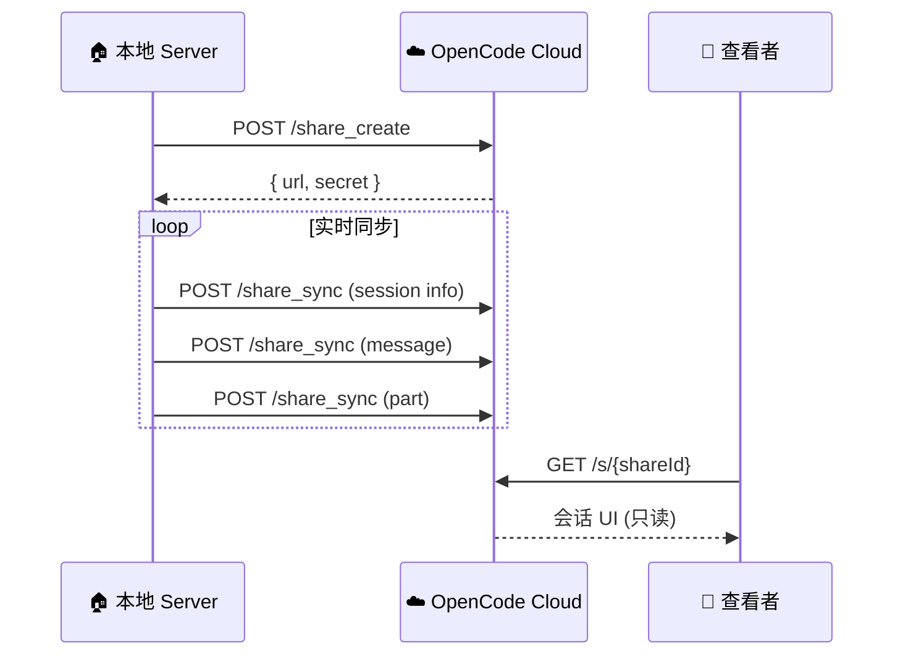

# 内部模块: Share (分享功能)

> 会话的云端同步和分享链接生成。

## 1. 概览 (Overview)
- **路径**: `packages/opencode/src/share/`
- **定位**: 将本地会话同步到云端，生成可分享的链接。
- **后端**: `api.opencode.ai`

## 2. 核心功能



## 3. 核心代码解析

### 3.1 创建分享

```typescript
export async function create(sessionID: string) {
  return fetch(`${URL}/share_create`, {
    method: "POST",
    body: JSON.stringify({ sessionID }),
  })
    .then((x) => x.json())
    .then((x) => x as { url: string; secret: string })
}
```

返回值:
- `url`: 分享链接 (如 `https://opencode.ai/s/abc12345`)
- `secret`: 同步密钥 (用于后续数据推送)

### 3.2 实时同步

```typescript
export async function sync(key: string, content: any) {
  const [root, ...splits] = key.split("/")
  if (root !== "session") return
  
  const [sub, sessionID] = splits
  if (sub === "share") return  // 避免循环
  
  const share = await Session.getShare(sessionID)
  if (!share) return  // 未启用分享
  
  const { secret } = share
  
  // 加入队列，避免并发冲突
  pending.set(key, content)
  queue = queue.then(async () => {
    const content = pending.get(key)
    if (content === undefined) return
    pending.delete(key)

    return fetch(`${URL}/share_sync`, {
      method: "POST",
      body: JSON.stringify({
        sessionID,
        secret,
        key,
        content,
      }),
    })
  })
}
```

### 3.3 事件订阅

```typescript
export function init() {
  // 会话更新
  Bus.subscribe(Session.Event.Updated, async (evt) => {
    await sync("session/info/" + evt.properties.info.id, evt.properties.info)
  })
  
  // 消息更新
  Bus.subscribe(MessageV2.Event.Updated, async (evt) => {
    await sync(
      "session/message/" + sessionID + "/" + messageID, 
      evt.properties.info
    )
  })
  
  // 消息片段更新 (工具调用结果等)
  Bus.subscribe(MessageV2.Event.PartUpdated, async (evt) => {
    await sync(
      "session/part/" + sessionID + "/" + messageID + "/" + partID,
      evt.properties.part
    )
  })
}
```

### 3.4 删除分享

```typescript
export async function remove(sessionID: string, secret: string) {
  return fetch(`${URL}/share_delete`, {
    method: "POST",
    body: JSON.stringify({ sessionID, secret }),
  }).then((x) => x.json())
}
```

## 4. 数据结构

同步的 Key 格式：

| Key 格式 | 内容 |
| :--- | :--- |
| `session/info/{sessionID}` | 会话元信息 |
| `session/message/{sessionID}/{messageID}` | 消息 |
| `session/part/{sessionID}/{messageID}/{partID}` | 消息片段 (文本/工具) |

## 5. API 环境

```typescript
export const URL =
  process.env["OPENCODE_API"] ??
  (Installation.isPreview() || Installation.isLocal() 
    ? "https://api.dev.opencode.ai"   // 开发环境
    : "https://api.opencode.ai")      // 生产环境
```

## 6. 使用场景

### 场景 1: 分享给同事

```bash
opencode> /share

✅ 会话分享链接: https://opencode.ai/s/abc12345
```

同事打开链接即可看到完整的对话历史（只读）。

### 场景 2: GitHub Action 自动分享

```typescript
// github/index.ts
shareId = await (async () => {
  if (useEnvShare() === false) return
  if (!useEnvShare() && repoData.data.private) return  // 私有仓库默认不分享
  await client.session.share({ path: session })
  return session.id.slice(-8)
})()

// 在 PR 评论中附上分享链接
await updateComment(`${response}\n\n[查看完整对话](${useShareUrl()}/s/${shareId})`)
```

### 场景 3: Slack Bot 分享

```typescript
// 创建会话后立即生成分享链接
await client.session.share({ path: session })

// 发送给 Slack 频道
await slack.postMessage({
  text: `点击查看完整对话: ${shareUrl}`
})
```

## 7. 隐私考虑

| 项目 | 安全措施 |
| :--- | :--- |
| **Secret** | 仅创建者持有，用于同步数据 |
| **只读** | 查看者无法修改会话 |
| **可撤销** | 随时调用 `remove()` 删除分享 |
| **私有仓库** | GitHub Action 默认不分享 |

## 8. 总结

Share 模块提供了 **跨设备协作** 的能力：
- **实时同步**: 本地操作立即反映到云端
- **只读分享**: 安全地展示工作成果
- **无需登录**: 查看者不需要 OpenCode 账号
- **可撤销**: 用户完全控制
